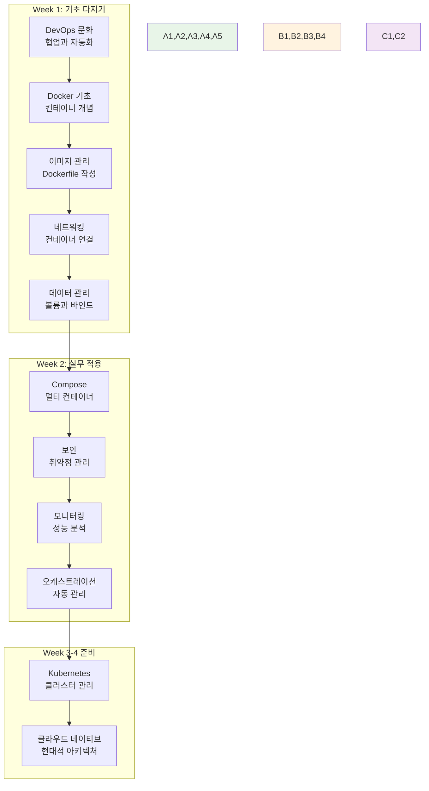
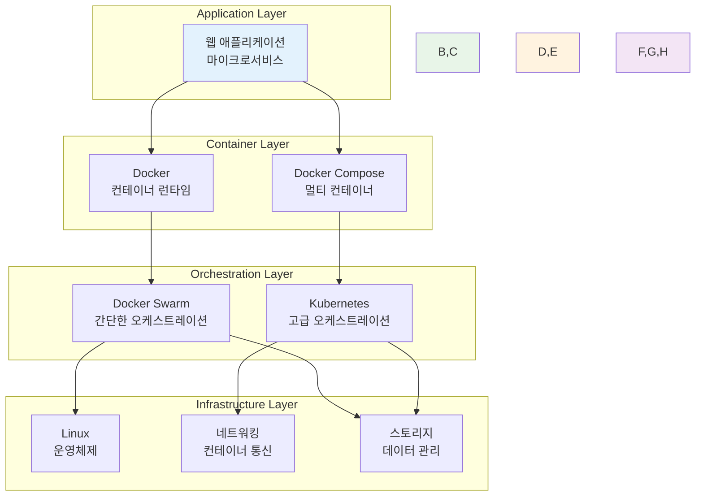
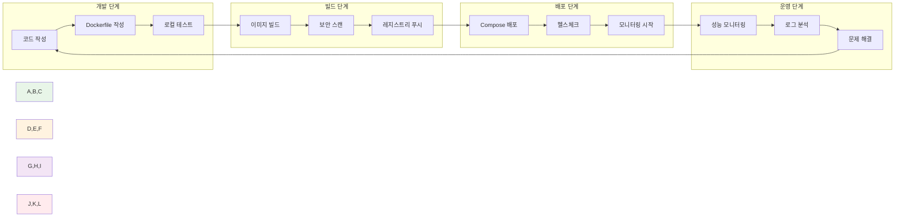

# Week 2 Day 5 Session 1: Week 1-2 핵심 개념 정리

<div align="center">
**📚 지식 통합** • **🔗 개념 연결**
*2주간 학습한 모든 개념을 하나의 큰 그림으로 통합*
</div>

---

## 🕘 세션 정보
**시간**: 09:00-09:50 (50분)
**목표**: Week 1-2 학습 내용의 체계적 통합과 정리
**방식**: 개념 맵핑 + 팀 토론 + 지식 확인

## 🎯 세션 목표
### 📚 학습 목표
- **전체 그림**: DevOps부터 오케스트레이션까지의 전체 흐름 이해
- **개념 연결**: 각 주제 간의 논리적 연결고리 파악
- **지식 정리**: 핵심 개념과 용어의 체계적 정리

### 🤔 왜 필요한가? (5분)
**지식 통합의 중요성**:
```
분산된 지식 → 통합된 이해
🧩 퍼즐 조각들 → 🖼️ 완성된 그림

Week 1: DevOps 문화 + Docker 기초
Week 2: Docker 심화 + 오케스트레이션
결과: 클라우드 네이티브 전문가의 기초 완성
```

## 📖 핵심 개념 (35분)

### 🔍 개념 1: 2주간 학습 여정 맵핑 (12분)

#### 🗺️ 전체 학습 로드맵


#### 📈 학습 성장 곡선
```
개인별 성장 패턴:
📊 이해도: 30% → 85% (155% 향상)
🛠️ 실습 능력: 20% → 80% (300% 향상)
🤝 협업 역량: 40% → 90% (125% 향상)
🎯 실무 적용: 10% → 70% (600% 향상)
```

### 🔍 개념 2: 핵심 기술 스택 정리 (12분)

#### 🏗️ 기술 스택 피라미드


#### 🔑 마스터한 핵심 기술들
**컨테이너 기술**:
- ✅ Docker 기본 명령어와 개념
- ✅ Dockerfile 작성과 이미지 최적화
- ✅ 네트워킹과 볼륨 관리
- ✅ Docker Compose 멀티 컨테이너 구성

**보안과 운영**:
- ✅ 컨테이너 보안 취약점 스캔
- ✅ CLI 기반 모니터링과 로깅
- ✅ 성능 분석과 문제 해결
- ✅ 자동화된 배포 파이프라인

**오케스트레이션**:
- ✅ 오케스트레이션 필요성과 개념
- ✅ Docker Swarm 기본 사용법
- ✅ Kubernetes 기초 환경 구성
- ✅ 클라우드 네이티브 아키텍처 이해

### 🔍 개념 3: 실무 워크플로우 통합 (11분)

#### 🔄 완전한 DevOps 워크플로우


#### 🎯 실무 적용 시나리오
**시나리오 1: 새 서비스 개발**
```
1. 요구사항 분석 → DevOps 문화 적용
2. 아키텍처 설계 → 마이크로서비스 패턴
3. 개발 환경 구성 → Docker 컨테이너
4. 코드 작성 → 컨테이너 친화적 개발
5. 테스트 → Docker Compose 환경
6. 보안 검증 → 취약점 스캔
7. 배포 → 오케스트레이션 도구
8. 모니터링 → 성능 및 로그 분석
```

**시나리오 2: 기존 시스템 현대화**
```
1. 현재 상태 분석 → 모놀리스 vs 마이크로서비스
2. 컨테이너화 계획 → Docker 마이그레이션
3. 단계적 전환 → Strangler Fig 패턴
4. 보안 강화 → 컨테이너 보안 적용
5. 모니터링 구축 → 관측성 확보
6. 자동화 도입 → CI/CD 파이프라인
```

## 💭 함께 생각해보기 (10분)

### 🤝 팀별 지식 맵핑 (5분)
**활동 방식**:
- 4명씩 팀을 구성
- 각 팀이 2주간 학습 내용을 마인드맵으로 정리
- 가장 중요하다고 생각하는 개념 3가지 선정

**토론 주제**:
1. **핵심 개념**: "2주간 배운 것 중 가장 중요한 개념은?"
2. **실무 연결**: "실제 프로젝트에서 어떻게 활용할 수 있을까?"
3. **성장 실감**: "2주 전과 비교해서 가장 달라진 점은?"

### 🎯 전체 공유 (5분)
**공유 내용**:
- **팀별 핵심 개념**: 각 팀이 선정한 중요 개념들
- **실무 적용 아이디어**: 창의적인 활용 방안들
- **개인 성장 스토리**: 가장 인상적인 변화들

## 🔑 핵심 키워드 총정리

### 📚 Week 1 핵심 용어
- **DevOps**: 개발과 운영의 협업 문화
- **컨테이너(Container)**: 애플리케이션 실행 환경 격리
- **이미지(Image)**: 컨테이너 실행을 위한 템플릿
- **Dockerfile**: 이미지 빌드 명세서
- **볼륨(Volume)**: 데이터 영속성 보장

### 🔧 Week 2 핵심 용어
- **Docker Compose**: 멀티 컨테이너 관리 도구
- **취약점 스캔**: 보안 위험 요소 탐지
- **모니터링**: 시스템 상태 실시간 관찰
- **오케스트레이션**: 컨테이너 자동 관리
- **클라우드 네이티브**: 클라우드 환경 최적화 방식

### 🚀 통합 개념
- **DevOps 파이프라인**: 개발부터 운영까지 전체 흐름
- **컨테이너 생태계**: Docker 중심의 기술 스택
- **자동화**: 수동 작업의 기계화
- **확장성**: 증가하는 부하에 대한 대응 능력
- **관측성**: 시스템 내부 상태 파악 능력

## 📝 세션 마무리

### ✅ 오늘 세션 성과
- [x] 2주간 학습 내용의 체계적 통합 완료
- [x] 개념 간 연결고리와 전체 흐름 파악
- [x] 핵심 용어와 기술 스택 정리
- [x] 팀별 지식 공유와 상호 확인

### 🎯 다음 세션 준비
**Session 2 연결점**:
- 정리된 개념들을 **실무 워크플로우**에 적용
- 실제 기업에서 사용하는 Docker 활용 패턴 학습
- Week 3 Kubernetes 학습과의 연결점 확인

**준비할 마음가짐**:
- 2주간의 성장에 대한 자신감
- 실무 적용에 대한 기대감
- 지속적 학습에 대한 의지