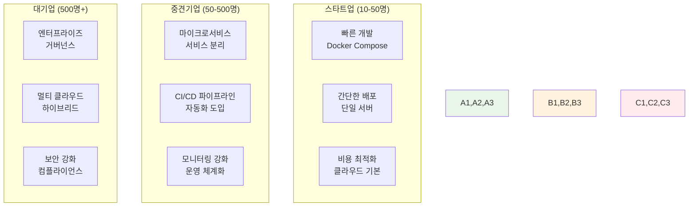
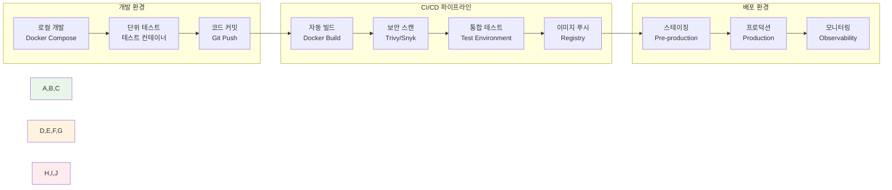

# Week 2 Day 5 Session 2: 실무 Docker 워크플로우

<div align="center">
**💼 실무 적용** • **🔄 워크플로우**
*기업에서 실제 사용하는 Docker 활용 패턴과 베스트 프랙티스*
</div>

---

## 🕘 세션 정보
**시간**: 10:00-10:50 (50분)
**목표**: 실무에서 사용하는 Docker 워크플로우 완전 이해
**방식**: 실무 사례 + 베스트 프랙티스 + 적용 방안

## 🎯 세션 목표
### 📚 학습 목표
- **실무 워크플로우**: 기업에서 실제 사용하는 Docker 활용 패턴
- **베스트 프랙티스**: 검증된 Docker 사용 방법과 주의사항
- **도구 통합**: Docker와 다른 DevOps 도구들의 연계 방법

### 🤔 왜 필요한가? (5분)
**학습과 실무의 차이**:
```
📚 학습 환경:
- 간단한 예제
- 완벽한 조건
- 단일 목적

💼 실무 환경:
- 복잡한 요구사항
- 제약 조건 다수
- 다양한 이해관계자
- 레거시 시스템 연동
- 보안과 컴플라이언스
```

## 📖 핵심 개념 (35분)

### 🔍 개념 1: 기업별 Docker 도입 패턴 (12분)

#### 🏢 기업 규모별 활용 패턴


#### 🚀 실제 기업 사례
**Netflix 사례**:
```
도전 과제:
- 수백만 사용자 동시 접속
- 글로벌 서비스 안정성
- 빠른 기능 배포 요구

Docker 활용:
✅ 마이크로서비스 아키텍처
✅ 컨테이너 기반 자동 스케일링
✅ 카나리 배포로 위험 최소화
✅ 장애 격리와 빠른 복구

결과:
📈 배포 빈도: 주 1회 → 일 1000회+
⚡ 장애 복구: 시간 단위 → 분 단위
💰 인프라 비용: 30% 절감
```

**Spotify 사례**:
```
도전 과제:
- 수천 명의 개발자
- 독립적인 팀 운영
- 빠른 실험과 배포

Docker 활용:
✅ 팀별 독립적 컨테이너 환경
✅ 표준화된 배포 파이프라인
✅ 개발-운영 환경 일치
✅ 자동화된 테스트 환경

결과:
🚀 개발 속도: 50% 향상
🔧 운영 효율성: 40% 개선
👥 개발자 만족도: 크게 향상
```

### 🔍 개념 2: 실무 Docker 워크플로우 (12분)

#### 🔄 완전한 개발-배포 파이프라인


#### 🛠️ 각 단계별 실무 도구와 방법
**개발 단계**:
```yaml
# docker-compose.dev.yml
version: '3.8'
services:
  app:
    build: 
      context: .
      target: development
    volumes:
      - .:/app
      - /app/node_modules
    environment:
      - NODE_ENV=development
    ports:
      - "3000:3000"
  
  db:
    image: postgres:13
    environment:
      POSTGRES_DB: myapp_dev
    volumes:
      - postgres_data:/var/lib/postgresql/data
```

**CI/CD 단계**:
```yaml
# .github/workflows/docker.yml
name: Docker CI/CD
on:
  push:
    branches: [main]

jobs:
  build-and-deploy:
    runs-on: ubuntu-latest
    steps:
      - uses: actions/checkout@v2
      
      - name: Build Docker image
        run: docker build -t myapp:${{ github.sha }} .
      
      - name: Security scan
        run: |
          docker run --rm -v /var/run/docker.sock:/var/run/docker.sock \
            aquasec/trivy image myapp:${{ github.sha }}
      
      - name: Push to registry
        run: |
          docker tag myapp:${{ github.sha }} registry.com/myapp:latest
          docker push registry.com/myapp:latest
```

**배포 단계**:
```yaml
# docker-compose.prod.yml
version: '3.8'
services:
  app:
    image: registry.com/myapp:latest
    deploy:
      replicas: 3
      resources:
        limits:
          memory: 512M
          cpus: '0.5'
    healthcheck:
      test: ["CMD", "curl", "-f", "http://localhost:3000/health"]
      interval: 30s
      timeout: 10s
      retries: 3
```

### 🔍 개념 3: 실무 베스트 프랙티스 (11분)

#### 🏆 검증된 베스트 프랙티스
**1. 이미지 최적화**:
```dockerfile
# ❌ 비효율적인 방법
FROM node:16
COPY . /app
WORKDIR /app
RUN npm install
CMD ["npm", "start"]

# ✅ 최적화된 방법
FROM node:16-alpine AS builder
WORKDIR /app
COPY package*.json ./
RUN npm ci --only=production

FROM node:16-alpine
WORKDIR /app
COPY --from=builder /app/node_modules ./node_modules
COPY . .
USER node
CMD ["npm", "start"]
```

**2. 보안 강화**:
```dockerfile
# 보안 베스트 프랙티스
FROM node:16-alpine

# 비root 사용자 생성
RUN addgroup -g 1001 -S nodejs
RUN adduser -S nextjs -u 1001

# 필요한 패키지만 설치
RUN apk add --no-cache libc6-compat

# 취약점 업데이트
RUN apk update && apk upgrade

# 애플리케이션 파일 복사
COPY --chown=nextjs:nodejs . .

# 비root 사용자로 실행
USER nextjs

# 헬스체크 추가
HEALTHCHECK --interval=30s --timeout=3s --start-period=5s --retries=3 \
  CMD curl -f http://localhost:3000/health || exit 1
```

**3. 환경별 설정 관리**:
```yaml
# 환경별 설정 분리
# .env.development
NODE_ENV=development
DATABASE_URL=postgres://localhost:5432/myapp_dev
REDIS_URL=redis://localhost:6379

# .env.production
NODE_ENV=production
DATABASE_URL=${DATABASE_URL}
REDIS_URL=${REDIS_URL}
LOG_LEVEL=error
```

#### ⚠️ 실무에서 자주 하는 실수들
**흔한 실수와 해결책**:
```
❌ 실수 1: 프로덕션에서 :latest 태그 사용
✅ 해결책: 명시적 버전 태그 사용 (v1.2.3, git-sha)

❌ 실수 2: 컨테이너에 민감 정보 하드코딩
✅ 해결책: 환경 변수나 시크릿 관리 도구 사용

❌ 실수 3: 로그를 컨테이너 내부에 저장
✅ 해결책: stdout/stderr로 출력하여 외부 수집

❌ 실수 4: 헬스체크 없이 배포
✅ 해결책: 적절한 헬스체크 엔드포인트 구현

❌ 실수 5: 리소스 제한 없이 실행
✅ 해결책: CPU/메모리 제한 설정
```

## 💭 함께 생각해보기 (10분)

### 🤝 실무 시나리오 토론 (5분)
**토론 주제**:
1. **우선순위**: "실무에서 가장 먼저 적용하고 싶은 패턴은?"
2. **도전 과제**: "우리 프로젝트에서 예상되는 어려움은?"
3. **해결 방안**: "실무 제약 조건을 어떻게 극복할까?"

**시나리오 예시**:
```
상황: 레거시 모놀리스 애플리케이션 현대화
제약: 기존 데이터베이스 유지, 점진적 전환 필요
과제: 어떤 순서로 컨테이너화를 진행할 것인가?

토론 포인트:
- Strangler Fig 패턴 적용 방안
- 데이터베이스 연결 전략
- 단계별 마이그레이션 계획
- 위험 요소와 대응 방안
```

### 🎯 전체 공유 (5분)
**공유 내용**:
- **적용 계획**: 팀별 실무 적용 우선순위
- **예상 도전**: 실무에서 마주칠 어려움들
- **해결 아이디어**: 창의적인 문제 해결 방안

## 🔑 실무 핵심 키워드

### 💼 실무 용어
- **프로덕션 레디(Production Ready)**: 실제 서비스에 사용 가능한 상태
- **블루-그린 배포(Blue-Green Deployment)**: 무중단 배포 전략
- **카나리 배포(Canary Deployment)**: 점진적 배포 전략
- **서킷 브레이커(Circuit Breaker)**: 장애 전파 방지 패턴

### 🛠️ 도구 생태계
- **레지스트리**: Harbor, AWS ECR, Docker Hub
- **CI/CD**: Jenkins, GitHub Actions, GitLab CI
- **모니터링**: Prometheus, Grafana, ELK Stack
- **보안**: Trivy, Snyk, Aqua Security

### 📊 운영 지표
- **SLA (Service Level Agreement)**: 서비스 수준 협약
- **SLO (Service Level Objective)**: 서비스 수준 목표
- **SLI (Service Level Indicator)**: 서비스 수준 지표
- **MTTR (Mean Time To Recovery)**: 평균 복구 시간

## 📝 세션 마무리

### ✅ 오늘 세션 성과
- [x] 실무 Docker 워크플로우 완전 이해
- [x] 기업별 활용 패턴과 사례 학습
- [x] 베스트 프랙티스와 주의사항 파악
- [x] 실무 적용 계획 수립

### 🎯 다음 세션 준비
**Session 3 연결점**:
- 실무 워크플로우를 **Kubernetes 환경**으로 확장
- Week 3-4 학습에서 다룰 고급 주제들 미리보기
- 클라우드 네이티브 아키텍처로의 진화 방향

**실무 적용 준비**:
- 학습한 패턴을 개인 프로젝트에 적용해보기
- 실무 제약 조건 고려한 현실적 계획 수립
- 지속적 학습과 개선을 위한 마인드셋