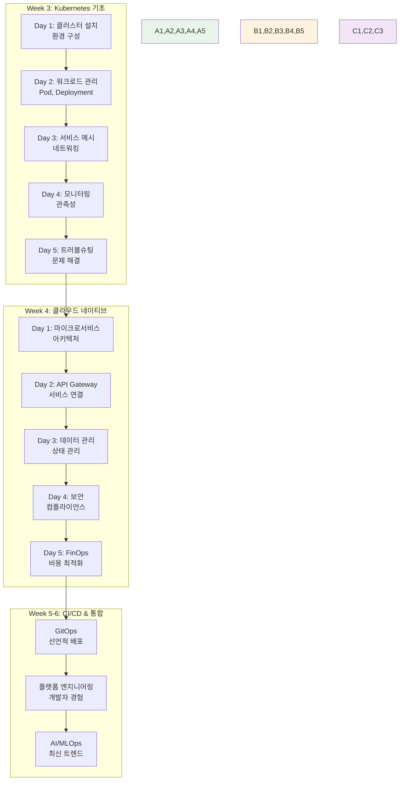
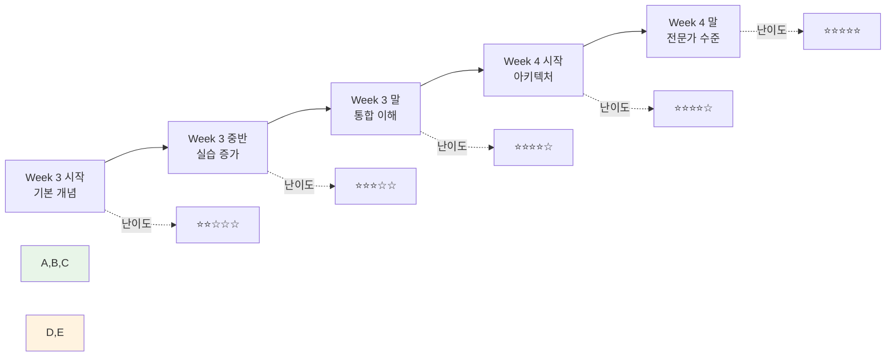
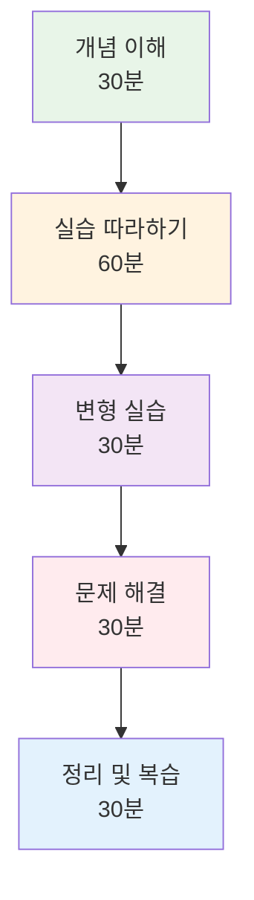

# Week 2 Day 5 Session 3: Kubernetes 학습 준비

<div align="center">
**☸️ Kubernetes 준비** • **🚀 다음 단계**
*Week 3-4 성공적 학습을 위한 완벽한 준비*
</div>

---

## 🕘 세션 정보
**시간**: 11:00-11:50 (50분)
**목표**: Week 3-4 Kubernetes 학습 완벽 준비
**방식**: 로드맵 제시 + 환경 점검 + 동기 부여

## 🎯 세션 목표
### 📚 학습 목표
- **학습 로드맵**: Week 3-4 Kubernetes 학습 전체 계획 이해
- **환경 준비**: 학습에 필요한 모든 환경과 도구 점검
- **동기 부여**: Kubernetes 학습의 가치와 미래 전망 확인

### 🤔 왜 Kubernetes인가? (5분)
**클라우드 네이티브 시대의 필수 기술**:
```
📊 시장 현황 (2024년):
- Fortune 500 기업의 96%가 Kubernetes 사용
- 클라우드 네이티브 채용 공고의 85%가 Kubernetes 요구
- 평균 연봉: Kubernetes 전문가 +30% 프리미엄

🚀 미래 전망:
- 2025년까지 모든 새로운 애플리케이션의 95%가 클라우드 네이티브
- Kubernetes 생태계 지속 확장 (CNCF 프로젝트 500+)
- 엣지 컴퓨팅, IoT, AI/ML 영역으로 확산
```

## 📖 핵심 개념 (35분)

### 🔍 개념 1: Week 3-4 학습 로드맵 (12분)

#### 🗺️ 전체 학습 여정


#### 📈 난이도 곡선과 학습 전략


#### 🎯 레벨별 학습 목표
**🟢 초급자 목표**:
```
Week 3 목표:
✅ Kubernetes 기본 개념 완전 이해
✅ kubectl 명령어 자유자재 사용
✅ Pod, Service, Deployment 생성/관리
✅ 기본 트러블슈팅 능력

Week 4 목표:
✅ 마이크로서비스 아키텍처 이해
✅ 간단한 클라우드 네이티브 앱 배포
✅ 기본 보안 설정 적용
✅ 팀 프로젝트 기여
```

**🟡 중급자 목표**:
```
Week 3 목표:
✅ Kubernetes 아키텍처 심화 이해
✅ 고급 워크로드 관리 (StatefulSet, DaemonSet)
✅ 네트워킹과 스토리지 고급 설정
✅ 모니터링 시스템 구축

Week 4 목표:
✅ 복잡한 마이크로서비스 설계
✅ API Gateway와 서비스 메시 구현
✅ 고급 보안 정책 적용
✅ 팀 리더십 발휘
```

**🔴 고급자 목표**:
```
Week 3 목표:
✅ 프로덕션 클러스터 설계
✅ 커스텀 리소스와 오퍼레이터
✅ 고급 네트워킹 (CNI, 서비스 메시)
✅ 성능 최적화와 튜닝

Week 4 목표:
✅ 엔터프라이즈 아키텍처 설계
✅ 멀티 클러스터 관리
✅ 고급 보안과 컴플라이언스
✅ 기술 멘토링과 지식 전파
```

### 🔍 개념 2: 학습 환경과 도구 준비 (12분)

#### 🛠️ 필수 도구 체크리스트
**로컬 개발 환경**:
```bash
# 1. Kubernetes 클러스터
□ minikube 또는 kind 설치
□ kubectl 설치 및 설정
□ 클러스터 연결 테스트

# 2. 개발 도구
□ Docker Desktop 최신 버전
□ VS Code + Kubernetes 확장
□ Helm 패키지 매니저
□ kubectx/kubens (컨텍스트 관리)

# 3. 모니터링 도구
□ k9s (터미널 UI)
□ Lens (GUI 도구)
□ 브라우저 기반 대시보드
```

**클라우드 환경 (선택사항)**:
```bash
# 클라우드 Kubernetes 서비스
□ AWS EKS 또는 Azure AKS 또는 GCP GKE
□ 클라우드 CLI 도구 설치
□ 무료 크레딧 확인
□ 비용 모니터링 설정
```

#### 🔧 환경 설정 검증
**기본 환경 테스트**:
```bash
# Kubernetes 클러스터 상태 확인
kubectl cluster-info
kubectl get nodes
kubectl get pods --all-namespaces

# 샘플 애플리케이션 배포 테스트
kubectl create deployment nginx --image=nginx
kubectl expose deployment nginx --port=80 --type=NodePort
kubectl get services

# 정리
kubectl delete deployment nginx
kubectl delete service nginx
```

**도구 버전 확인**:
```bash
# 버전 호환성 체크
docker --version          # 20.10+ 권장
kubectl version --client  # 1.25+ 권장
minikube version          # 1.28+ 권장
helm version              # 3.10+ 권장
```

### 🔍 개념 3: 학습 전략과 성공 팁 (11분)

#### 📚 효과적인 학습 방법
**1. 점진적 학습 접근법**:


**2. 실습 중심 학습**:
```
이론 20% : 실습 80% 비율 유지

실습 단계:
1️⃣ 따라하기: 가이드대로 정확히 실행
2️⃣ 변형하기: 파라미터나 설정 변경해보기
3️⃣ 문제해결: 의도적으로 오류 만들고 해결
4️⃣ 응용하기: 새로운 시나리오에 적용
```

**3. 협업 학습 극대화**:
```
페어 프로그래밍:
👥 2명이 함께 실습 진행
🔄 30분마다 역할 교대 (Driver/Navigator)
💬 지속적인 대화와 설명

팀 프로젝트:
🎯 공통 목표 설정
📋 역할 분담과 책임
🔄 일일 스탠드업 미팅
📊 주간 회고와 개선
```

#### 🏆 성공을 위한 핵심 팁
**학습 효율성 극대화**:
```
✅ DO (해야 할 것):
- 매일 최소 1시간 실습
- 오류 메시지 꼼꼼히 읽기
- 공식 문서 참조 습관
- 학습 내용 정리 및 공유
- 질문하기를 두려워하지 않기

❌ DON'T (하지 말 것):
- 이론만 읽고 실습 건너뛰기
- 오류 발생 시 바로 포기
- 혼자서만 해결하려고 고집
- 완벽하게 이해하려고 너무 오래 머물기
- 다른 사람과 비교하며 조급해하기
```

**어려움 극복 전략**:
```
🤔 "너무 복잡해요"
→ 작은 단위로 나누어 학습
→ 핵심 개념부터 차근차근
→ 팀원들과 함께 토론

😰 "따라갈 수 없어요"
→ 개인 속도 인정하고 꾸준히
→ 추가 시간 투자
→ 멘토에게 도움 요청

🔥 "실무에 적용하기 어려워요"
→ 간단한 프로젝트부터 시작
→ 기존 Docker 지식 활용
→ 점진적 도입 계획 수립
```

## 💭 함께 생각해보기 (10분)

### 🤝 학습 계획 수립 (5분)
**개인별 학습 목표 설정**:
1. **Week 3 개인 목표**: "가장 집중하고 싶은 Kubernetes 기능은?"
2. **Week 4 도전 과제**: "어떤 클라우드 네이티브 프로젝트를 만들고 싶나?"
3. **협업 계획**: "팀에서 어떤 역할을 하고 싶나?"

### 🎯 전체 다짐 (5분)
**팀별 다짐 공유**:
- **학습 다짐**: Week 3-4 학습에 대한 각오
- **협업 약속**: 서로 도우며 함께 성장하겠다는 약속
- **미래 비전**: Kubernetes 전문가가 된 후의 모습

## 🔑 Kubernetes 핵심 키워드 미리보기

### ☸️ 기본 개념
- **클러스터(Cluster)**: 여러 노드로 구성된 Kubernetes 환경
- **노드(Node)**: 클러스터를 구성하는 개별 서버
- **파드(Pod)**: Kubernetes의 최소 배포 단위
- **서비스(Service)**: 파드들에 대한 네트워크 접근점
- **네임스페이스(Namespace)**: 리소스 격리를 위한 가상 클러스터

### 🏗️ 워크로드 리소스
- **Deployment**: 상태가 없는 애플리케이션 관리
- **StatefulSet**: 상태가 있는 애플리케이션 관리
- **DaemonSet**: 모든 노드에서 실행되는 파드
- **Job/CronJob**: 배치 작업 관리

### 🌐 네트워킹과 스토리지
- **Ingress**: 외부 트래픽을 클러스터 내부로 라우팅
- **ConfigMap/Secret**: 설정과 민감 정보 관리
- **PersistentVolume**: 영구 스토리지 관리
- **NetworkPolicy**: 네트워크 보안 정책

## 📝 세션 마무리

### ✅ 오늘 세션 성과
- [x] Week 3-4 Kubernetes 학습 로드맵 완전 이해
- [x] 학습 환경과 도구 준비 상태 점검
- [x] 효과적인 학습 전략과 성공 팁 습득
- [x] 개인별 학습 목표와 팀 협업 계획 수립

### 🎯 Week 3 Day 1 준비
**내일 시작 준비**:
- Kubernetes 환경 최종 점검
- 개인 학습 목표 재확인
- 팀 협업 도구 준비
- 긍정적이고 도전적인 마인드셋

**기대하는 변화**:
- Week 3 종료 시: Kubernetes 기본 마스터
- Week 4 종료 시: 클라우드 네이티브 아키텍트
- Week 6 종료 시: DevOps 전문가 완성

---

<div align="center">

**☸️ Kubernetes 정복 준비 완료** • **🚀 클라우드 네이티브 여정 시작** • **🎯 전문가로의 도약**

*2주간의 성과를 바탕으로 더 높은 단계로 나아갈 시간*

</div>