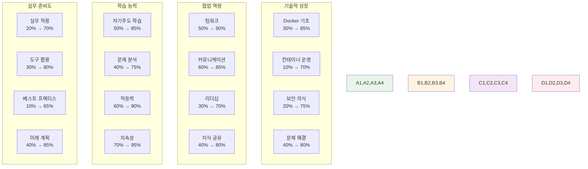
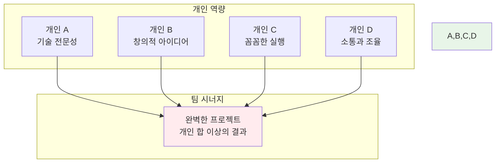

# Week 2 Day 5 Session 5: 개별 성장 평가 및 Week 3 계획

<div align="center">
**🎯 개별 평가** • **📈 성장 확인** • **🚀 미래 계획**
*2주간의 성장을 확인하고 다음 단계를 준비하는 시간*
</div>

---

## 🕘 세션 정보
**시간**: 16:15-18:00 (105분)
**목표**: 개인별 성장 평가와 Week 3 맞춤 계획 수립
**방식**: 개별 상담 + 그룹 회고 + 미래 계획

## 🎯 세션 목표
### 📚 핵심 목표
- **성장 확인**: 2주간의 개인별 학습 성과와 변화 측정
- **강점 발견**: 각자의 고유한 강점과 기여 영역 확인
- **계획 수립**: Week 3-4 개인별 맞춤 학습 전략 수립
- **동기 부여**: 지속적 성장을 위한 동기와 자신감 강화

### 🤝 협업 목표
- **상호 인정**: 동료들의 성장과 기여에 대한 인정과 격려
- **팀 시너지**: 개인 강점을 팀 성공으로 연결하는 방안
- **지속 협업**: Week 3 이후 협업 관계 발전 계획

---

## 📊 개별 성장 평가 (60분)

### 🔍 성장 측정 프레임워크
#### 📈 4가지 성장 영역


### 🎯 개별 상담 진행 (학생당 5분 × 11명 = 55분)

#### 📋 상담 구조
**1분: 성과 확인**
- 가장 자랑스러운 성장 포인트
- 예상보다 잘 해낸 부분
- 팀에 기여한 특별한 부분

**2분: 강점 발견**
- 자연스럽게 드러난 개인 강점
- 동료들이 인정하는 특별한 능력
- 앞으로 더 발전시킬 수 있는 영역

**2분: 미래 계획**
- Week 3-4에서 집중하고 싶은 분야
- 개인 커리어 목표와의 연결점
- 필요한 지원과 도움

#### 🟢 초급자 개별 상담 포인트
```
성장 확인:
✨ "Docker 명령어를 자연스럽게 사용하게 되었네요"
✨ "처음엔 어려워했던 Compose도 이제 능숙하게 다루시네요"
✨ "팀 프로젝트에서 중요한 역할을 해주셨어요"

강점 발견:
🌟 꼼꼼함: "세심한 부분까지 놓치지 않는 능력"
🌟 끈기: "어려운 문제도 포기하지 않고 해결하는 의지"
🌟 협력: "팀원들과 잘 소통하고 도움을 주고받는 능력"

미래 계획:
🎯 "Kubernetes 기본기를 탄탄히 다져보세요"
🎯 "실습을 통해 자신감을 더 키워나가세요"
🎯 "팀에서 안정적인 역할을 계속 해주세요"
```

#### 🟡 중급자 개별 상담 포인트
```
성장 확인:
✨ "기술적 이해도가 눈에 띄게 향상되었어요"
✨ "팀에서 자연스럽게 리더 역할을 하고 계시네요"
✨ "복잡한 문제도 체계적으로 접근하시는 모습이 인상적이에요"

강점 발견:
🌟 분석력: "문제의 본질을 빠르게 파악하는 능력"
🌟 리더십: "팀을 이끌고 동기부여하는 자연스러운 리더십"
🌟 균형감: "기술과 협업 모두에서 균형잡힌 성장"

미래 계획:
🎯 "Kubernetes에서 팀의 기술적 리더 역할을 기대해요"
🎯 "아키텍처 설계 능력을 더 발전시켜보세요"
🎯 "후배 멘토링 경험을 쌓아보시면 좋겠어요"
```

#### 🔴 고급자 개별 상담 포인트
```
성장 확인:
✨ "기술적 깊이와 폭이 모두 인상적이에요"
✨ "팀 전체의 성장에 크게 기여해주셨어요"
✨ "복잡한 시스템도 명확하게 설계하고 구현하시네요"

강점 발견:
🌟 전문성: "깊이 있는 기술적 이해와 적용 능력"
🌟 멘토링: "다른 사람을 성장시키는 탁월한 능력"
🌟 혁신: "새로운 아이디어와 개선 방안을 제시하는 능력"

미래 계획:
🎯 "Kubernetes 전문가로서 팀을 이끌어주세요"
🎯 "오픈소스 기여나 기술 블로그 작성을 고려해보세요"
🎯 "업계 전문가 수준의 깊이를 목표로 해보세요"
```

---

## 🤝 그룹 회고 및 상호 인정 (30분)

### 🌟 상호 인정 세션 (20분)
#### 💝 "감사 카드" 활동
**진행 방식**:
- 각자 동료들에게 감사 메시지 작성
- 구체적인 도움이나 인상적인 순간 언급
- 서로의 성장과 기여를 인정하고 격려

**감사 카드 예시**:
```
To: [이름]
From: [이름]

🌟 가장 인상적이었던 순간:
"Docker Compose 실습에서 막혔을 때 차근차근 설명해줘서 
정말 고마웠어요. 덕분에 개념을 완전히 이해할 수 있었습니다."

💪 당신의 특별한 강점:
"복잡한 문제를 단순하게 설명하는 능력이 정말 대단해요. 
팀의 든든한 기술 멘토 역할을 해주셔서 감사합니다."

🚀 앞으로의 기대:
"Week 3에서도 함께 Kubernetes를 정복해봐요! 
당신과 함께라면 어떤 어려움도 극복할 수 있을 것 같아요."
```

### 🎯 팀별 회고 (10분)
#### 📊 2주간 팀 성과 정리
**회고 질문들**:
1. **가장 자랑스러운 팀 성과는?**
2. **서로에게서 배운 가장 중요한 것은?**
3. **팀워크에서 가장 잘된 부분은?**
4. **Week 3에서 더 발전시키고 싶은 협업 방식은?**

**팀 시너지 확인**:


---

## 🚀 Week 3-4 개인별 맞춤 계획 (15분)

### 📋 개인별 학습 로드맵 수립
#### 🟢 초급자 맞춤 계획
```
Week 3 목표:
🎯 Kubernetes 기본 개념 완전 마스터
🎯 kubectl 명령어 자유자재 사용
🎯 Pod, Service, Deployment 실습 완료
🎯 팀 프로젝트에서 안정적 기여

학습 전략:
📚 이론 30% + 실습 70% 비율 유지
🤝 페어 프로그래밍으로 어려운 부분 해결
📝 매일 학습 내용 정리 및 복습
💪 작은 성공 경험 적극 축적

지원 방안:
👥 중급자/고급자와 페어링
📖 추가 학습 자료 제공
⏰ 개별 질의응답 시간 확보
🎯 단계별 목표 설정 및 점검
```

#### 🟡 중급자 맞춤 계획
```
Week 3 목표:
🎯 Kubernetes 아키텍처 심화 이해
🎯 고급 워크로드 관리 능력
🎯 팀 프로젝트 기술 리더 역할
🎯 초급자 멘토링 경험 축적

학습 전략:
🏗️ 아키텍처 중심 학습 접근
🔧 실무 시나리오 기반 실습
👨🏫 설명하며 배우는 방식 활용
📊 성능과 최적화 관점 추가

성장 기회:
🎤 기술 발표 및 지식 공유
🏆 팀 프로젝트 리더십 발휘
🤝 초급자 멘토링 담당
📈 개인 기술 블로그 시작
```

#### 🔴 고급자 맞춤 계획
```
Week 3 목표:
🎯 프로덕션 수준 클러스터 설계
🎯 고급 네트워킹과 보안 구현
🎯 팀 전체 기술 멘토 역할
🎯 오픈소스 기여 준비

학습 전략:
🔬 공식 문서와 소스코드 분석
🏭 엔터프라이즈 시나리오 연구
🌐 커뮤니티 참여 및 기여
📚 최신 기술 트렌드 연구

전문가 도전:
🎯 CNCF 프로젝트 분석 및 기여
📝 기술 아티클 작성 및 발표
🏆 팀 프로젝트 아키텍처 설계
🌟 업계 전문가 네트워킹
```

### 🎯 공통 성공 전략
```
일일 루틴:
⏰ 매일 아침 개인 목표 확인
📚 이론 학습 30분 + 실습 90분
🤝 팀원과 학습 내용 공유 30분
📝 하루 학습 정리 및 내일 계획 15분

주간 루틴:
📊 주간 목표 달성도 점검
🎯 다음 주 목표 조정 및 설정
🤝 팀 회고 및 개선 방안 논의
🎉 성과 축하 및 동기부여

지속 성장:
💪 꾸준한 학습 습관 유지
🌟 작은 성공 경험 축적
🤝 동료와의 지속적 협업
🚀 장기 목표와 연결된 학습
```

---

## 📝 세션 마무리

### ✅ 오늘 세션 성과
- [x] 개인별 2주간 성장 성과 확인 완료
- [x] 각자의 고유한 강점과 기여 영역 발견
- [x] Week 3-4 개인별 맞춤 학습 계획 수립
- [x] 팀 시너지와 상호 인정을 통한 동기 부여

### 🎯 Week 3 시작 준비
**개인 준비사항**:
- 개인별 학습 목표 최종 확인
- Kubernetes 환경 점검
- 학습 도구 및 자료 준비
- 긍정적 마인드셋과 도전 의지

**팀 준비사항**:
- 팀 협업 방식 재확인
- 역할 분담 및 상호 지원 계획
- 소통 채널 및 도구 점검
- Week 3 팀 목표 공유

### 🌟 2주간의 성장 축하
```
🎉 축하합니다! 2주간의 놀라운 성장을 이뤄냈습니다!

📊 전체 성과:
- Docker 초보 → Docker 실무자
- 개별 학습 → 팀 협업 전문가
- 이론 중심 → 실무 적용 능력
- 수동적 학습 → 능동적 성장

🚀 다음 도전:
Week 3-4에서는 Kubernetes와 클라우드 네이티브 전문가로
더욱 성장하는 여러분의 모습을 기대합니다!

💪 함께 해낸 것처럼, 앞으로도 함께 성장해나가요!
```

---

<div align="center">

**🎯 2주간 성장 완료** • **📈 개인 강점 확인** • **🚀 Kubernetes 정복 준비**

*각자의 속도로, 함께 성장하는 클라우드 네이티브 전문가 여정*

</div>