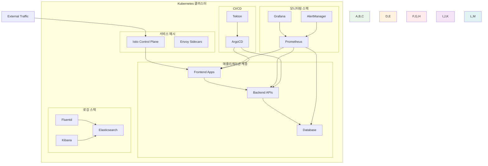

# Week 3: Kubernetes 운영과 관리

**🎓 Kubernetes 심화 & 클러스터 운영** • **실무 역량 개발**

*기초에서 실무까지, Kubernetes 클러스터 운영 전문가 되기*

---

## 🎯 주간 학습 목표

### 📚 전체 공통 목표
> **Kubernetes 클러스터 운영 역량을 개발하고, 실무에서 필요한 고급 기능들을 습득한다**

### 🎪 레벨별 목표
- **🟢 초급자**: 클러스터 설치 및 기본 운영 능력 + 워크로드 관리 기초
- **🟡 중급자**: 고급 배포 전략 + 서비스 메시 기초 + 모니터링 구성
- **🔴 고급자**: HA 클러스터 설계 + 성능 최적화 + 복잡한 문제 해결

---

## 📅 일일 학습 계획

### [Day 1: 클러스터 설치와 구성](./day_01_cluster_installation.md)
**🎯 목표**: 다양한 방법으로 Kubernetes 클러스터 구축 + 클러스터 관리 기초

#### 📚 이론 강의 (2.5시간)
- **Session 1**: Kubernetes 설치 방법 비교 (kubeadm, kops, kubespray)
- **Session 2**: 클러스터 네트워킹 설정 (CNI 플러그인)
- **Session 3**: 클러스터 보안 설정 및 인증서 관리

#### 🛠️ 실습 챌린지 (3시간)
- **Phase 1**: kubeadm으로 멀티 노드 클러스터 구축
- **Phase 2**: CNI 플러그인 설치 및 네트워크 테스트
- **Phase 3**: 클러스터 백업 및 복구 실습

#### 🎯 레벨별 활동
- **초급자**: 로컬 클러스터 설치 + 기본 설정
- **중급자**: 멀티 노드 클러스터 + 네트워크 구성
- **고급자**: HA 클러스터 + 백업/복구 전략

---

### [Day 2: 워크로드 관리](./day_02_workload_management.md)
**🎯 목표**: 고급 워크로드 타입 이해 + 배포 전략 학습

#### 📚 이론 강의 (2.5시간)
- **Session 1**: Deployment vs StatefulSet vs DaemonSet
- **Session 2**: 롤링 업데이트와 배포 전략
- **Session 3**: HPA/VPA를 통한 자동 스케일링

#### 🛠️ 실습 챌린지 (3시간)
- **Phase 1**: 다양한 워크로드 타입 배포 실습
- **Phase 2**: 카나리 배포와 블루-그린 배포
- **Phase 3**: 자동 스케일링 설정 및 테스트

#### 🎯 레벨별 활동
- **초급자**: 기본 워크로드 배포 + 스케일링
- **중급자**: 롤링 업데이트 + 카나리 배포
- **고급자**: 블루-그린 배포 + GitOps 패턴

---

### [Day 3: 서비스 메시 개념](./day_03_service_mesh.md)
**🎯 목표**: 서비스 메시 필요성 이해 + Istio 기초 학습

#### 📚 이론 강의 (2.5시간)
- **Session 1**: 마이크로서비스 통신의 복잡성
- **Session 2**: 서비스 메시 아키텍처 (Istio, Linkerd, Consul Connect)
- **Session 3**: 사이드카 패턴과 데이터 플레인/컨트롤 플레인

#### 🛠️ 실습 챌린지 (3시간)
- **Phase 1**: Istio 설치 및 기본 구성
- **Phase 2**: 트래픽 관리 및 라우팅 규칙
- **Phase 3**: 보안 정책 및 mTLS 설정

#### 🎯 레벨별 활동
- **초급자**: 서비스 메시 개념 이해 + 기본 구성
- **중급자**: 트래픽 관리 + 보안 정책
- **고급자**: 멀티 클러스터 메시 + 성능 최적화

---

### [Day 4: 모니터링과 로깅](./day_04_monitoring_logging.md)
**🎯 목표**: 종합적인 관측성 구축 + Prometheus/Grafana 활용

#### 📚 이론 강의 (2.5시간)
- **Session 1**: 관측성의 3요소 (메트릭, 로그, 추적)
- **Session 2**: Prometheus 아키텍처와 메트릭 수집
- **Session 3**: ELK/EFK 스택을 통한 로그 관리

#### 🛠️ 실습 챌린지 (3시간)
- **Phase 1**: Prometheus + Grafana 모니터링 스택 구축
- **Phase 2**: 커스텀 메트릭 수집 및 알림 설정
- **Phase 3**: EFK 스택으로 중앙화된 로깅 구성

#### 🎯 레벨별 활동
- **초급자**: 기본 메트릭 수집 + 대시보드 구성
- **중급자**: 커스텀 메트릭 + 알림 설정
- **고급자**: 분산 추적 + 로그 분석 자동화

---

### [Day 5: 트러블슈팅과 디버깅](./day_05_troubleshooting.md)
**🎯 목표**: 체계적인 문제 해결 방법론 + 실전 디버깅 기술

#### 📚 이론 강의 (2.5시간)
- **Session 1**: Kubernetes 트러블슈팅 방법론
- **Session 2**: 일반적인 문제 패턴과 해결책
- **Session 3**: 성능 최적화 및 리소스 관리

#### 🛠️ 실습 챌린지 (3시간)
- **Phase 1**: 의도적 장애 시나리오 해결
- **Phase 2**: 성능 병목 지점 분석 및 최적화
- **Phase 3**: 클러스터 복구 및 재해 대응

#### 🎯 레벨별 활동
- **초급자**: 기본 트러블슈팅 + 로그 분석
- **중급자**: 성능 문제 진단 + 리소스 최적화
- **고급자**: 복잡한 네트워크 문제 + 클러스터 복구

---

## 🛠️ 주간 통합 프로젝트

### 🎯 프로젝트 목표
**"프로덕션 레디 Kubernetes 플랫폼 구축"**
- 실제 운영 환경에 준하는 클러스터 구성
- 완전한 관측성 및 모니터링 구축
- 자동화된 배포 파이프라인 구성

### 🏗️ 프로젝트 아키텍처

### 👥 팀 구성 및 역할
- **Platform 팀**: 클러스터 구축 및 기본 인프라
- **Service Mesh 팀**: Istio 구성 및 트래픽 관리
- **Monitoring 팀**: 관측성 스택 구축
- **Security 팀**: 보안 정책 및 RBAC 설정

### 📋 프로젝트 요구사항
1. **고가용성 클러스터**: 멀티 마스터 노드 구성
2. **서비스 메시**: Istio를 통한 트래픽 관리
3. **완전한 모니터링**: 메트릭, 로그, 추적 통합
4. **자동 스케일링**: HPA/VPA 설정
5. **보안 강화**: RBAC, 네트워크 정책, Pod 보안 정책
6. **재해 복구**: 백업 및 복구 절차

---

## 📊 주간 평가 기준

### ✅ 실무 역량 평가
- **클러스터 운영**: 설치, 구성, 관리 능력
- **문제 해결**: 트러블슈팅 및 디버깅 역량
- **모니터링**: 관측성 구축 및 활용 능력
- **협업**: 팀 프로젝트에서의 기여도

### 🎯 성공 지표
- **기술 이해도**: 85% 이상
- **실습 완성률**: 90% 이상
- **프로젝트 완성도**: 85% 이상
- **문제 해결 능력**: 80% 이상

### 📋 평가 체크리스트
- [ ] 멀티 노드 클러스터 구축 완료
- [ ] 다양한 워크로드 타입 배포 가능
- [ ] 서비스 메시 기본 구성 완료
- [ ] 모니터링 스택 구축 및 활용
- [ ] 기본적인 트러블슈팅 수행 가능
- [ ] 팀 프로젝트 역할 완수

---

## 🔗 다음 주 연결

### 🚀 Week 4 준비사항
- Kubernetes 운영 경험 정리
- 마이크로서비스 아키텍처 개념 예습
- 클라우드 네이티브 패턴 학습

### 📚 추천 학습 자료
- [Kubernetes 운영 가이드](https://kubernetes.io/docs/setup/production-environment/)
- [Istio 공식 문서](https://istio.io/latest/docs/)
- [Prometheus 모니터링 가이드](https://prometheus.io/docs/guides/)

### 🎯 심화 학습 주제
- **초급자**: Kubernetes 네트워킹 심화
- **중급자**: Kubernetes Operator 개발
- **고급자**: 멀티 클러스터 관리 전략

---

## 📝 주간 회고

### 🤔 회고 질문
1. 클러스터 운영의 복잡성을 어떻게 관리했나요?
2. 서비스 메시의 필요성을 실제로 체감했나요?
3. 모니터링을 통해 어떤 인사이트를 얻었나요?
4. 가장 도전적이었던 트러블슈팅 경험은?

### 📈 개선 포인트
- 클러스터 설치 시 자주 발생한 문제
- 서비스 메시 구성의 어려움
- 모니터링 설정 시 놓친 부분
- 팀 협업에서 개선할 점

### 🎉 성취 사항
- 프로덕션 레벨 클러스터 구축 완료
- 복잡한 문제 상황 해결 경험
- 팀워크를 통한 대규모 프로젝트 완성
- 실무 운영 역량 획득

---

## 🔧 운영 베스트 프랙티스

### 클러스터 관리
1. **정기적인 백업**: etcd 백업 자동화
2. **모니터링 필수**: 클러스터 상태 지속 감시
3. **보안 강화**: RBAC 및 네트워크 정책 적용
4. **리소스 관리**: 적절한 리소스 할당 및 제한

### 애플리케이션 배포
1. **점진적 배포**: 카나리/블루-그린 배포 활용
2. **헬스 체크**: Liveness/Readiness Probe 설정
3. **설정 분리**: ConfigMap/Secret 활용
4. **로그 중앙화**: 구조화된 로깅 구현

### 문제 해결
1. **체계적 접근**: 문제 범위 좁히기
2. **로그 분석**: 다양한 레벨의 로그 확인
3. **메트릭 활용**: 성능 지표를 통한 원인 분석
4. **문서화**: 해결 과정 및 결과 기록

---

**🎓 클러스터 운영 전문가** • **☸️ Kubernetes 실무 역량** • **🔍 문제 해결 능력**

*Week 3을 통해 Kubernetes 운영의 핵심 역량을 갖추었습니다*

**이전 주**: [Week 2 - 컨테이너 오케스트레이션 기초](../week_02/README.md) | **다음 주**: [Week 4 - 클라우드 네이티브 아키텍처](../week_04/README.md)

