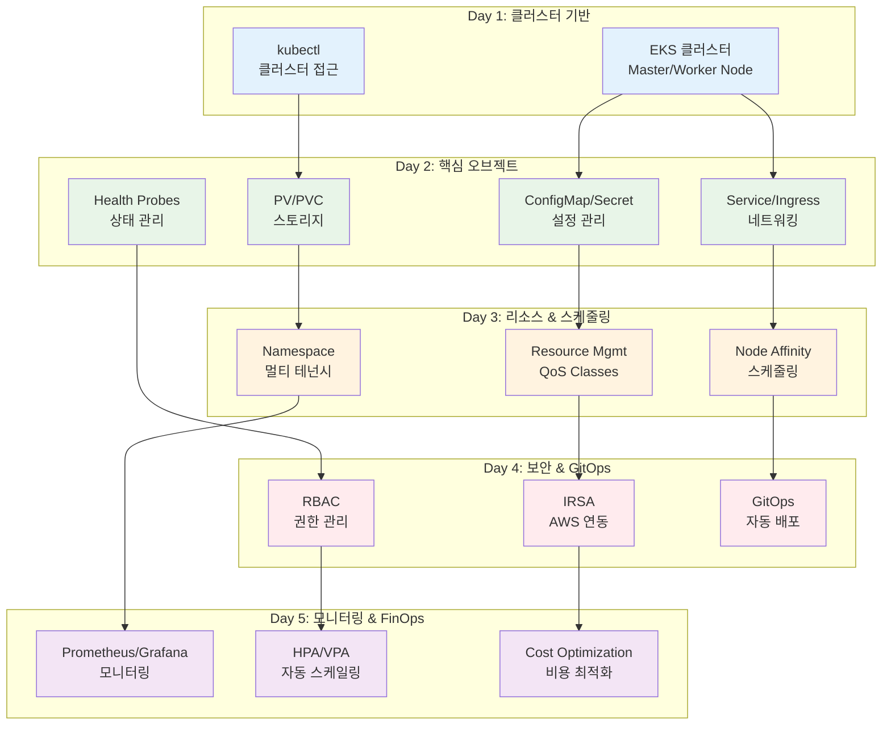

# Week 3: Kubernetes 운영과 관리

**☸️ Kubernetes 실무 운영** • **🔧 개인 역량 개발** • **☁️ 클라우드 네이티브**

*기초부터 AWS EKS까지, Kubernetes 운영 전문가 되기*

---

## 🎯 주간 학습 목표

### 📚 전체 공통 목표
> **Kubernetes 클러스터 운영 역량을 개발하고, AWS EKS를 포함한 실무 환경에서 필요한 모든 기술을 습득한다**

### 🎪 개인별 학습 목표
- **🟢 초급자**: 클러스터 설치 및 기본 운영 + AWS EKS 기초 + 워크스페이스 관리
- **🟡 중급자**: 고급 배포 전략 + IRSA 보안 + 모니터링/알람 구성 + FinOps 기초
- **🔴 고급자**: HA 클러스터 설계 + 고급 보안 + 성능 최적화 + FinOps 고도화

---

## 📅 일일 학습 계획

### [Day 1: 클러스터 설치와 구성](./day1/README.md)
**🎯 목표**: Kubernetes 기본 구성요소 이해 + 다양한 설치 방법 + AWS EKS 기초

#### 📚 이론 강의 (2.5시간)
- **Session 1**: Kubernetes 기본 구성요소 (Master/Worker Node, etcd, API Server) (50분)
- **Session 2**: 설치 방법 비교 (kubeadm, kops, kubespray, Managed Services) (50분)
- **Session 3**: AWS EKS 아키텍처 및 설정 방법 (50분)

#### 🛠️ 실습 챌린지 (3시간)
- **Phase 1**: kubeadm으로 로컬 클러스터 구축
- **Phase 2**: AWS EKS 클러스터 생성 및 구성
- **Phase 3**: kubectl 설정 및 클러스터 접근 권한 관리

#### 🎯 레벨별 활동
- **초급자**: 로컬 클러스터 설치 + EKS 기본 설정
- **중급자**: 멀티 노드 클러스터 + EKS 네트워킹 구성
- **고급자**: HA 클러스터 + EKS 고급 보안 설정

---

### [Day 2: 핵심 오브젝트와 워크로드 관리](./day2/README.md)
**🎯 목표**: Kubernetes 핵심 오브젝트 + 설정 관리 + 워크로드 배포 전략

#### 📚 이론 강의 (2.5시간)
- **Session 1**: ConfigMap & Secret 설정 관리 (50분)
- **Session 2**: Service & Ingress 네트워킹 (50분)
- **Session 3**: PV/PVC 스토리지 + Health Probes (50분)

#### 🛠️ 실습 챌린지 (3시간)
- **Phase 1**: ConfigMap/Secret + Service 타입별 네트워킹 구성
- **Phase 2**: PV/PVC 영속성 + Probe 설정으로 안정성 확보
- **Phase 3**: 통합 애플리케이션 배포 + 롤링 업데이트

#### 🎯 레벨별 활동
- **초급자**: 기본 설정 관리 + ClusterIP Service + 기본 Probe
- **중급자**: 환경별 설정 분리 + Ingress 라우팅 + 고급 Health Check
- **고급자**: 암호화된 설정 + 멀티 도메인 + 커스텀 배포 전략

---

### [Day 3: 리소스 관리와 스케줄링](./day3/README.md)
**🎯 목표**: Resource Management + QoS + 스케줄링 정책 + 네임스페이스 관리

#### 📚 이론 강의 (2.5시간)
- **Session 1**: Resource Requests/Limits + QoS Classes (50분)
- **Session 2**: Node Affinity + Pod Anti-Affinity 스케줄링 (50분)
- **Session 3**: Namespace 멀티 테넌시 + ResourceQuota (50분)

#### 🛠️ 실습 챌린지 (3시간)
- **Phase 1**: Resource 설정으로 성능 최적화 + QoS 클래스 적용
- **Phase 2**: Affinity 규칙으로 고가용성 배치 + 스케줄링 최적화
- **Phase 3**: 네임스페이스 기반 환경 분리 + ResourceQuota 설정

#### 🎯 레벨별 활동
- **초급자**: 기본 Resource 설정 + 기본 스케줄링 + 네임스페이스 관리
- **중급자**: QoS 최적화 + Node Selector + 고급 리소스 정책
- **고급자**: 복잡한 Affinity + 멀티 클러스터 스케줄링 + 고급 격리

---

### [Day 4: 보안과 RBAC + GitOps](./day4/README.md)
**🎯 목표**: RBAC 보안 + AWS EKS IRSA + GitOps 배포 자동화

#### 📚 이론 강의 (2.5시간)
- **Session 1**: RBAC + ServiceAccount (50분)
- **Session 2**: AWS EKS 보안 + IRSA (50분)
- **Session 3**: GitOps (ArgoCD, Helm) + Pod Security Standards (50분)

#### 🛠️ 실습 챌린지 (3시간)
- **Phase 1**: RBAC으로 세밀한 권한 제어 + ServiceAccount 관리
- **Phase 2**: EKS IRSA 구성 + AWS 서비스 연동 보안
- **Phase 3**: GitOps 파이프라인 + Helm Chart 배포 자동화

#### 🎯 레벨별 활동
- **초급자**: 기본 RBAC + IRSA 기초 + ArgoCD 기본
- **중급자**: 세밀한 권한 제어 + Pod Security + GitOps 고급 패턴
- **고급자**: 제로 트러스트 + 고급 감사 + 멀티 클러스터 GitOps

---

### [Day 5: 모니터링, FinOps & 통합 프로젝트](./day5/README.md)
**🎯 목표**: 모니터링 스택 + FinOps + 주간 통합 개인 프로젝트 완성

#### 📚 이론 강의 (2.5시간)
- **Session 1**: Prometheus + Grafana 모니터링 스택 (50분)
- **Session 2**: AlertManager + SLI/SLO 알람 시스템 (50분)
- **Session 3**: FinOps + HPA/VPA + 통합 프로젝트 아키텍처 (50분)

#### 🛠️ 통합 프로젝트 (3시간)
- **Phase 1**: 개인 Kubernetes 플랫폼 최종 구성
- **Phase 2**: 모니터링 스택 구축 + FinOps 비용 최적화 적용
- **Phase 3**: 전체 시스템 통합 테스트 + 포트폴리오 정리

#### 🎯 레벨별 활동
- **초급자**: 기본 모니터링 + 비용 가시성 + 개인 프로젝트 완성
- **중급자**: 커스텀 메트릭 + 자동 스케일링 + 고급 프로젝트 구성
- **고급자**: 분산 추적 + 고급 FinOps + 엔터프라이즈급 프로젝트

---

## 🏗️ Week 3 전체 아키텍처

---

## 📊 개인 학습 평가 기준

### ✅ 실무 역량 평가
- **클러스터 운영**: EKS 설치, 구성, 관리 능력
- **보안 관리**: IRSA 및 클러스터 보안 구성 능력
- **모니터링**: 관측성 구축 및 알람 시스템 구성
- **비용 최적화**: FinOps 원칙 적용 및 비용 관리

### 🎯 개인 성공 지표
- **기술 이해도**: 85% 이상
- **실습 완성률**: 90% 이상
- **프로젝트 완성도**: 85% 이상
- **문제 해결 능력**: 80% 이상

### 📋 주간 평가 체크리스트
- [ ] EKS 클러스터 구축 및 운영 완료
- [ ] 핵심 오브젝트 (ConfigMap/Secret/Service/PV) 활용
- [ ] 리소스 관리 및 스케줄링 정책 적용
- [ ] RBAC 보안 및 IRSA 구성 완료
- [ ] 모니터링 스택 구축 및 FinOps 적용
- [ ] **Day 5 통합 프로젝트 완성**

---

**☸️ Kubernetes 운영 전문가** • **☁️ AWS EKS 마스터** • **💰 FinOps 실무자**

*Week 3을 통해 개인 Kubernetes 플랫폼을 완벽하게 구축하고 운영할 수 있게 되었습니다*

