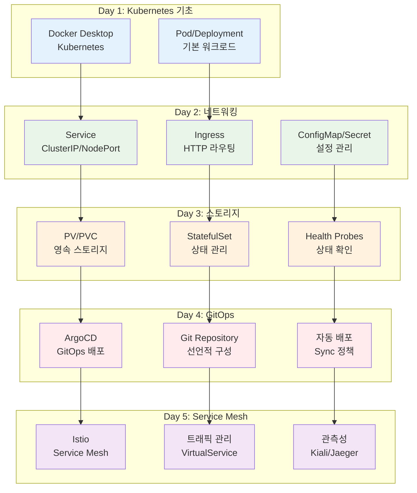

# Week 3: Kubernetes 기초와 클라우드 네이티브

**☸️ Kubernetes 기초** • **🚀 ArgoCD GitOps** • **🌐 Istio Service Mesh**

*CNCF 기초 교육과정 기반 - Docker Desktop에서 클라우드 네이티브까지*

---

## 🎯 주간 학습 목표

### 📚 CNCF 기초 교육과정 목표
> **Kubernetes 기본 개념부터 GitOps, Service Mesh까지 클라우드 네이티브 생태계의 핵심 기술을 체계적으로 학습한다**

### 🛠️ 실습 환경
- **로컬 환경**: Docker Desktop Kubernetes
- **GitOps**: ArgoCD를 통한 선언적 배포
- **Service Mesh**: Istio를 통한 마이크로서비스 관리
- **모니터링**: Prometheus + Grafana 스택

### 🎪 학습자별 목표
- **🟢 초급자**: Kubernetes 기본 개념 + Pod/Service 배포 + ArgoCD 기초
- **🟡 중급자**: 고급 워크로드 + Istio 트래픽 관리 + 모니터링 구성
- **🔴 고급자**: 복잡한 배포 전략 + Istio 보안 + 성능 최적화

---

## 📅 일일 학습 계획

### [Day 1: Kubernetes 기초와 환경 구성](./day1/README.md)
**🎯 목표**: Kubernetes 아키텍처 이해 + Docker Desktop 환경 구성 + 기본 오브젝트

#### 📚 이론 강의 (2.5시간)
- **Session 1**: Kubernetes 아키텍처와 구성요소 (Control Plane, Node, etcd) (50분)
- **Session 2**: Docker Desktop Kubernetes 활성화 + kubectl 기초 (50분)
- **Session 3**: Pod, ReplicaSet, Deployment 기본 개념 (50분)

#### 🛠️ 실습 (1.5시간)
- **Lab 1**: Docker Desktop Kubernetes 환경 구성 + kubectl 설정 (50분)
- **Lab 2**: 첫 번째 Pod 배포 + Deployment 생성 및 관리 (50분)

#### 🎯 레벨별 활동
- **초급자**: 기본 Pod 배포 + kubectl 명령어 익히기
- **중급자**: Deployment 전략 + 롤링 업데이트
- **고급자**: 커스텀 리소스 + 고급 kubectl 활용

---

### [Day 2: 서비스와 네트워킹](./day2/README.md)
**🎯 목표**: Service 타입별 이해 + Ingress 구성 + ConfigMap/Secret 활용

#### 📚 이론 강의 (2.5시간)
- **Session 1**: Service 타입 (ClusterIP, NodePort, LoadBalancer) (50분)
- **Session 2**: Ingress Controller + 라우팅 규칙 (50분)
- **Session 3**: ConfigMap/Secret을 통한 설정 관리 (50분)

#### 🛠️ 실습 (1.5시간)
- **Lab 1**: 다양한 Service 타입으로 애플리케이션 노출 (50분)
- **Lab 2**: Nginx Ingress + 멀티 서비스 라우팅 구성 (50분)

#### 🎯 레벨별 활동
- **초급자**: 기본 Service + 간단한 Ingress 구성
- **중급자**: 고급 라우팅 + TLS 인증서 적용
- **고급자**: 커스텀 Ingress Controller + 고급 네트워킹

---

### [Day 3: 스토리지와 상태 관리](./day3/README.md)
**🎯 목표**: Volume + PV/PVC + StatefulSet + 상태 관리

#### 📚 이론 강의 (2.5시간)
- **Session 1**: Volume 타입과 영속성 (emptyDir, hostPath, PV/PVC) (50분)
- **Session 2**: StatefulSet vs Deployment + 상태 관리 (50분)
- **Session 3**: Health Check (Liveness, Readiness, Startup Probes) (50분)

#### 🛠️ 실습 (1.5시간)
- **Lab 1**: PV/PVC를 사용한 데이터베이스 배포 (50분)
- **Lab 2**: StatefulSet으로 상태 유지 애플리케이션 구성 (50분)

#### 🎯 레벨별 활동
- **초급자**: 기본 Volume + 간단한 StatefulSet
- **중급자**: 동적 프로비저닝 + 복잡한 상태 관리
- **고급자**: 커스텀 스토리지 클래스 + 고급 백업 전략

---

### [Day 4: GitOps와 ArgoCD](./day4/README.md)
**🎯 목표**: GitOps 개념 + ArgoCD 설치/구성 + 자동 배포 파이프라인

#### 📚 이론 강의 (2.5시간)
- **Session 1**: GitOps 개념과 장점 + 선언적 배포 (50분)
- **Session 2**: ArgoCD 아키텍처 + 설치 및 구성 (50분)
- **Session 3**: Application 배포 + Sync 정책 + 롤백 전략 (50분)

#### 🛠️ 실습 (1.5시간)
- **Lab 1**: ArgoCD 설치 + 첫 번째 애플리케이션 배포 (50분)
- **Lab 2**: Git 기반 자동 배포 + 멀티 환경 관리 (50분)

#### 🎯 레벨별 활동
- **초급자**: ArgoCD 기본 사용 + 간단한 앱 배포
- **중급자**: 복잡한 애플리케이션 + 환경별 배포
- **고급자**: 커스텀 리소스 + 고급 배포 전략

---

### [Day 5: Istio Service Mesh와 통합 프로젝트](./day5/README.md)
**🎯 목표**: Istio 설치/구성 + 트래픽 관리 + 보안 + 관측성

#### 📚 이론 강의 (2.5시간)
- **Session 1**: Service Mesh 개념 + Istio 아키텍처 (50분)
- **Session 2**: 트래픽 관리 (VirtualService, DestinationRule) (50분)
- **Session 3**: 보안 (mTLS) + 관측성 (Kiali, Jaeger) (50분)

#### 🛠️ 통합 프로젝트 (1.5시간)
- **Lab 1**: Istio 설치 + 마이크로서비스 배포 (50분)
- **Lab 2**: 카나리 배포 + 트래픽 분할 + 모니터링 (50분)

#### 🎯 레벨별 활동
- **초급자**: 기본 Istio 구성 + 간단한 트래픽 관리
- **중급자**: 고급 라우팅 + 보안 정책 적용
- **고급자**: 복잡한 배포 전략 + 성능 최적화

---

## 🏗️ Week 3 클라우드 네이티브 아키텍처

---

## 📊 CNCF 기초 과정 평가 기준

### ✅ 핵심 역량 평가
- **Kubernetes 기초**: Pod, Service, Deployment 이해 및 활용
- **네트워킹**: Ingress를 통한 외부 노출 및 라우팅
- **스토리지**: PV/PVC를 통한 데이터 영속성 관리
- **GitOps**: ArgoCD를 통한 자동 배포 파이프라인
- **Service Mesh**: Istio를 통한 마이크로서비스 관리

### 🎯 학습 성공 지표
- **개념 이해도**: 80% 이상
- **실습 완성률**: 85% 이상
- **통합 프로젝트**: 완성도 80% 이상
- **협업 참여도**: 적극적 참여

### 📋 주간 체크리스트
- [ ] Docker Desktop Kubernetes 환경 구성 완료
- [ ] 기본 워크로드 (Pod/Deployment/Service) 배포
- [ ] Ingress를 통한 외부 접근 구성
- [ ] PV/PVC를 사용한 상태 관리 애플리케이션 배포
- [ ] ArgoCD를 통한 GitOps 파이프라인 구축
- [ ] Istio Service Mesh 구성 및 트래픽 관리
- [ ] **통합 마이크로서비스 프로젝트 완성**

---

**☸️ Kubernetes 기초 마스터** • **🚀 GitOps 실무자** • **🌐 Service Mesh 전문가**

*CNCF 기초 과정을 통해 클라우드 네이티브 애플리케이션 개발과 운영의 기초를 완벽하게 습득했습니다*

