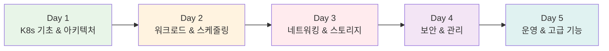

# Week 3: Kubernetes 마스터리 과정

<div align="center">

**🚀 Kubernetes 완전 정복** • **🎯 실무 중심 학습** • **🔧 Challenge 기반 문제해결**

*컨테이너 오케스트레이션의 핵심, Kubernetes를 완전히 마스터하는 5일 집중 과정*

</div>

---

## 🛠️ 사전 준비 사항

### 📦 필수 도구 설치

#### 1. kubectl (Kubernetes CLI)
```bash
# macOS
brew install kubectl

# Linux
curl -LO "https://dl.k8s.io/release/$(curl -L -s https://dl.k8s.io/release/stable.txt)/bin/linux/amd64/kubectl"
sudo install -o root -g root -m 0755 kubectl /usr/local/bin/kubectl

# Windows (PowerShell)
curl.exe -LO "https://dl.k8s.io/release/v1.28.0/bin/windows/amd64/kubectl.exe"
```

#### 2. Kind (Kubernetes in Docker)
```bash
# macOS/Linux
curl -Lo ./kind https://kind.sigs.k8s.io/dl/v0.20.0/kind-linux-amd64
chmod +x ./kind
sudo mv ./kind /usr/local/bin/kind

# Windows
curl.exe -Lo kind-windows-amd64.exe https://kind.sigs.k8s.io/dl/v0.20.0/kind-windows-amd64
```

#### 3. k9s (Kubernetes TUI) - 강력 추천! 🌟
```bash
# macOS
brew install k9s

# Linux
K9S_VERSION=$(curl -s https://api.github.com/repos/derailed/k9s/releases/latest | grep tag_name | cut -d '"' -f 4)
curl -sL https://github.com/derailed/k9s/releases/download/${K9S_VERSION}/k9s_Linux_amd64.tar.gz | tar xz
sudo mv k9s /usr/local/bin/

# Windows
choco install k9s
# 또는 scoop install k9s
```

### 📚 추가 도구 가이드
- **상세 설치 가이드**: [Kubernetes 모니터링 도구 가이드](./k8s_monitoring_tools_guide.md)
- **kubectl 명령어 레퍼런스**: [kubectl 명령어 참조](./kubectl_commands_reference.md)

---

## 🎯 Week 3 전체 목표

### 📚 핵심 학습 목표
- **Kubernetes 아키텍처**: 클러스터 구조와 핵심 컴포넌트 완전 이해
- **워크로드 관리**: Pod부터 Deployment까지 계층적 관리 체계
- **네트워킹 & 스토리지**: 서비스 디스커버리와 영속적 데이터 관리
- **보안 & 운영**: RBAC, 모니터링, 클러스터 유지보수
- **실무 적용**: 프로덕션 환경에서의 Kubernetes 운영 노하우

### 🔄 학습 방법론
- **이론 3시간**: 50분 세션 × 3 (개념 → 심화 → 통합)
- **실습 3시간**: Lab 90분 + Challenge 90분
- **Challenge 방식**: 의도적 오류 코드로 문제해결 능력 향상
- **Fun Facts**: 재미있는 사실과 실무 팁으로 흥미 유발

---

## 📅 5일 커리큘럼 구조



---

## 📅 Day 1: Kubernetes 기초 & 클러스터 아키텍처

### 🎯 일일 목표
- Kubernetes 전체 아키텍처와 핵심 컴포넌트 완전 이해
- Docker와 ContainerD의 차이점과 실무 선택 기준
- ETCD의 역할과 클러스터 상태 관리 원리

### 📚 이론 세션 (3시간)

#### Session 1: K8s 아키텍처 & 컴포넌트 (50분)
**🎯 학습 목표**: Kubernetes 클러스터의 전체 구조 이해

**핵심 개념**:
- **Cluster Architecture**: 마스터-워커 노드 구조의 비밀
- **Docker vs ContainerD**: 컨테이너 런타임 전쟁의 승자는?
- **Container Runtime Interface (CRI)**: 런타임 추상화의 힘

**🎉 Fun Facts**:
- 왜 K8s라고 부를까? (Kubernetes = K + 8글자 + s)
- Google이 15년간 운영한 Borg 시스템의 오픈소스 버전
- 매주 1,000개 이상의 컨테이너를 관리하는 Google의 노하우

#### Session 2: 핵심 컴포넌트 심화 (50분)
**🎯 학습 목표**: 마스터 노드 컴포넌트의 역할과 상호작용

**핵심 개념**:
- **ETCD**: 분산 시스템의 뇌, 클러스터의 기억 저장소
- **Kube-API Server**: 모든 요청의 관문, RESTful API의 마법
- **Kube Controller Manager**: 자동화의 핵심, 원하는 상태 유지의 비밀

**🎉 Fun Facts**:
- ETCD는 "distributed reliable key-value store"의 줄임말
- API Server는 초당 수천 개의 요청을 처리할 수 있음
- Controller Manager는 실제로는 여러 개의 컨트롤러가 하나로 패키징된 것

#### Session 3: 스케줄러 & 에이전트 (50분)
**🎯 학습 목표**: 워커 노드 컴포넌트와 스케줄링 메커니즘

**핵심 개념**:
- **Kube Scheduler**: 최적의 집 찾기 알고리즘
- **Kubelet**: 각 노드의 충실한 관리자
- **Kube Proxy**: 네트워크 트래픽의 교통 경찰

**🎉 Fun Facts**:
- 스케줄러는 100개 이상의 조건을 고려해서 Pod 배치를 결정
- Kubelet은 10초마다 API Server와 통신하여 상태를 보고
- Kube Proxy는 iptables 규칙을 동적으로 관리

### 🛠️ 실습 세션 (3시간)

#### Lab 1: 클러스터 구축 & 컴포넌트 탐험 (90분)
**목표**: 실제 클러스터를 구축하고 각 컴포넌트 동작 확인

**실습 내용**:
1. **환경 구축**: Kind/Minikube로 로컬 클러스터 생성
2. **컴포넌트 확인**: 각 컴포넌트 상태 모니터링
3. **ETCD 실습**: 클러스터 데이터 직접 조회
4. **API 호출**: kubectl 없이 직접 API 호출해보기

#### Challenge 1: 고장난 클러스터 복구하기 (90분)
**목표**: 의도적으로 망가뜨린 클러스터를 복구하며 문제해결 능력 향상

**Challenge 시나리오**:
- **시나리오 1**: API Server 설정 파일 오류
- **시나리오 2**: ETCD 연결 문제
- **시나리오 3**: Kubelet 인증서 만료
- **시나리오 4**: 네트워크 플러그인 오류

**🎮 Fun Challenge**: "클러스터 의사" 되어보기 - 증상을 보고 원인 진단

---

## 📅 Day 2: 워크로드 관리 & 스케줄링

### 🎯 일일 목표
- Pod, ReplicaSet, Deployment의 계층적 관계 완전 이해
- 스케줄링 메커니즘과 고급 배치 전략
- 애플리케이션 생명주기 관리의 실무 노하우

### 📚 이론 세션 (3시간)

#### Session 1: 기본 워크로드 객체 (50분)
**🎯 학습 목표**: Kubernetes 워크로드의 기본 단위들

**핵심 개념**:
- **Pods**: 컨테이너의 최소 실행 단위, 왜 Pod일까?
- **ReplicaSets**: 복제본 관리의 마법사
- **Deployments**: 무중단 배포의 핵심 비밀
- **Namespaces**: 가상 클러스터로 리소스 격리

**🎉 Fun Facts**:
- Pod는 고래 떼(Pod of whales)에서 유래
- ReplicaSet은 ReplicationController의 진화형
- Deployment는 실제로 ReplicaSet을 관리하는 상위 개념

#### Session 2: 고급 스케줄링 (50분)
**🎯 학습 목표**: 정교한 Pod 배치 전략

**핵심 개념**:
- **Labels & Selectors**: 라벨링 시스템의 힘
- **Taints & Tolerations**: 노드의 호불호 시스템
- **Node Affinity**: 스마트한 배치 전략
- **Pod Affinity/Anti-Affinity**: Pod 간의 친밀도 관리

**🎉 Fun Facts**:
- 라벨은 최대 63자까지 가능하며 유니코드도 지원
- Taint는 "오염"이라는 뜻으로 특정 Pod만 배치 허용
- Anti-Affinity로 고가용성 구성 가능

#### Session 3: 리소스 관리 & 특수 워크로드 (50분)
**🎯 학습 목표**: 리소스 관리와 특수 목적 워크로드

**핵심 개념**:
- **Resource Limits**: 자원 관리의 균형점
- **DaemonSets**: 모든 노드의 수호천사
- **Static Pods**: 불멸의 Pod들
- **Jobs & CronJobs**: 배치 작업의 자동화

**🎉 Fun Facts**:
- DaemonSet은 로깅, 모니터링 에이전트에 주로 사용
- Static Pod는 kubelet이 직접 관리하는 특별한 Pod
- CronJob은 Linux cron과 동일한 문법 사용

### 🛠️ 실습 세션 (3시간)

#### Lab 2: 워크로드 배포 & 관리 (90분)
**목표**: 다양한 워크로드 타입을 실제로 배포하고 관리

**실습 내용**:
1. **단계별 배포**: Pod → ReplicaSet → Deployment
2. **스케줄링 실습**: 라벨링과 노드 선택
3. **롤링 업데이트**: 무중단 배포 체험
4. **리소스 관리**: CPU/Memory 제한 설정

#### Challenge 2: 배포 재해 시나리오 (90분)
**목표**: 배포 과정에서 발생할 수 있는 다양한 문제 해결

**Challenge 시나리오**:
- **시나리오 1**: 잘못된 이미지로 인한 배포 실패
- **시나리오 2**: 리소스 부족으로 인한 스케줄링 실패
- **시나리오 3**: 롤링 업데이트 중 서비스 중단
- **시나리오 4**: 노드 장애 시 Pod 재배치

**🎮 Fun Challenge**: "배포 마스터" 되어보기 - 배포 전략 최적화

---

## 📅 Day 3: 네트워킹 & 스토리지

### 🎯 일일 목표
- Kubernetes 네트워킹 모델과 CNI의 동작 원리
- 서비스 디스커버리와 로드밸런싱 메커니즘
- 영속적 스토리지와 데이터 관리 전략

### 📚 이론 세션 (3시간)

#### Session 1: 네트워킹 기초 & CNI (50분)
**🎯 학습 목표**: Kubernetes 네트워킹의 기본 원리

**핵심 개념**:
- **Pod Networking**: 가상 네트워크의 마법
- **CNI (Container Network Interface)**: 네트워크 플러그인의 표준
- **Cluster Networking**: 노드 간 통신 메커니즘
- **Network Namespaces**: 네트워크 격리의 비밀

**🎉 Fun Facts**:
- 모든 Pod은 고유한 IP를 가지며 NAT 없이 통신 가능
- CNI는 CNCF의 첫 번째 졸업 프로젝트 중 하나
- Flannel, Calico, Weave 등 다양한 CNI 플러그인 존재

#### Session 2: 서비스 & 인그레스 (50분)
**🎯 학습 목표**: 서비스 디스커버리와 외부 접근 관리

**핵심 개념**:
- **Services**: 동적 환경에서의 안정적 접근
- **ClusterIP vs NodePort vs LoadBalancer**: 각각의 용도와 특징
- **Ingress**: L7 로드밸런서의 진화
- **DNS in Kubernetes**: 서비스 디스커버리의 핵심

**🎉 Fun Facts**:
- Service는 가상 IP(VIP)를 사용하여 Pod 그룹을 추상화
- Ingress Controller는 실제로는 리버스 프록시
- CoreDNS가 클러스터 내 DNS 서버 역할

#### Session 3: 스토리지 & 데이터 관리 (50분)
**🎯 학습 목표**: 영속적 데이터 관리와 스토리지 추상화

**핵심 개념**:
- **Volumes vs Persistent Volumes**: 임시 vs 영구 저장소
- **Storage Classes**: 동적 프로비저닝의 편리함
- **CSI (Container Storage Interface)**: 스토리지 플러그인 표준
- **StatefulSets**: 상태를 가진 애플리케이션 관리

**🎉 Fun Facts**:
- PV는 클러스터 리소스, PVC는 네임스페이스 리소스
- CSI는 Kubernetes뿐만 아니라 다른 오케스트레이터에서도 사용
- StatefulSet은 Pod에 순서와 고유성을 보장

### 🛠️ 실습 세션 (3시간)

#### Lab 3: 네트워킹 & 서비스 구성 (90분)
**목표**: 완전한 3-tier 애플리케이션의 네트워킹 구성

**실습 내용**:
1. **멀티 티어 애플리케이션**: Frontend-Backend-Database 연결
2. **서비스 타입별 실습**: ClusterIP, NodePort, LoadBalancer
3. **Ingress 설정**: 도메인 기반 라우팅
4. **스토리지 구성**: PV/PVC를 이용한 데이터 영속화

#### Challenge 3: 네트워크 장애 해결 (90분)
**목표**: 네트워킹과 스토리지 관련 복합 문제 해결

**Challenge 시나리오**:
- **시나리오 1**: DNS 해결 실패로 서비스 간 통신 불가
- **시나리오 2**: Ingress 설정 오류로 외부 접근 실패
- **시나리오 3**: PVC 바인딩 실패로 데이터베이스 시작 불가
- **시나리오 4**: 네트워크 정책으로 인한 통신 차단

**🎮 Fun Challenge**: "네트워크 탐정" 되어보기 - 패킷 추적과 문제 해결

---

## 📅 Day 4: 보안 & 클러스터 관리

### 🎯 일일 목표
- Kubernetes 보안 모델과 RBAC 시스템
- 인증서 관리와 TLS 통신 보안
- 클러스터 유지보수와 업그레이드 전략

### 📚 이론 세션 (3시간)

#### Session 1: 보안 기초 & 인증 (50분)
**🎯 학습 목표**: Kubernetes 보안의 기본 원칙

**핵심 개념**:
- **Security Primitives**: 다층 보안 모델
- **Authentication**: 누구인가? (사용자, 서비스 계정)
- **TLS in Kubernetes**: 모든 통신의 암호화
- **Certificate Management**: 인증서 생명주기 관리

**🎉 Fun Facts**:
- Kubernetes는 기본적으로 모든 통신을 TLS로 암호화
- 클러스터 내에서만 수십 개의 인증서가 사용됨
- kubeconfig 파일에는 클러스터 접근을 위한 모든 정보가 포함

#### Session 2: 권한 관리 & RBAC (50분)
**🎯 학습 목표**: 세밀한 권한 제어 시스템

**핵심 개념**:
- **Authorization**: 무엇을 할 수 있는가?
- **RBAC**: 역할 기반 접근 제어의 정교함
- **Service Accounts**: 애플리케이션의 신원
- **Network Policies**: 네트워크 수준 보안

**🎉 Fun Facts**:
- RBAC는 Role, RoleBinding, ClusterRole, ClusterRoleBinding으로 구성
- 기본적으로 모든 것이 거부(deny-by-default) 정책
- Service Account는 Pod가 API Server와 통신할 때 사용

#### Session 3: 클러스터 유지보수 (50분)
**🎯 학습 목표**: 프로덕션 클러스터의 운영과 관리

**핵심 개념**:
- **Cluster Upgrades**: 무중단 업그레이드 전략
- **Backup & Restore**: ETCD 백업의 중요성
- **OS Upgrades**: 노드 유지보수 방법
- **Troubleshooting**: 클러스터 문제 진단

**🎉 Fun Facts**:
- Kubernetes는 3개 버전까지 지원 (N, N-1, N-2)
- ETCD 백업 하나로 전체 클러스터 상태 복구 가능
- 노드 드레인(drain)으로 안전한 유지보수 가능

### 🛠️ 실습 세션 (3시간)

#### Lab 4: 보안 설정 & 권한 관리 (90분)
**목표**: 프로덕션급 보안 설정 구성

**실습 내용**:
1. **RBAC 구성**: 사용자별, 팀별 권한 설정
2. **Network Policies**: 마이크로세그멘테이션 구현
3. **Security Contexts**: 컨테이너 보안 강화
4. **Secret 관리**: 민감 정보의 안전한 관리

#### Challenge 4: 보안 침해 시나리오 (90분)
**목표**: 보안 관련 문제 상황 대응

**Challenge 시나리오**:
- **시나리오 1**: 권한 오류로 애플리케이션 배포 실패
- **시나리오 2**: 인증서 만료로 클러스터 통신 장애
- **시나리오 3**: 네트워크 정책 설정 오류로 서비스 차단
- **시나리오 4**: Secret 노출로 인한 보안 위험

**🎮 Fun Challenge**: "보안 전문가" 되어보기 - 취약점 발견과 보안 강화

---

## 📅 Day 5: 운영 & 고급 기능

### 🎯 일일 목표
- 프로덕션 환경에서의 모니터링과 로깅
- Helm을 이용한 패키지 관리와 배포 자동화
- GitOps 기반 배포 파이프라인 구축
- Service Mesh(Istio)의 개념과 실전 활용

### 📚 이론 세션 (3시간)

#### Session 1: 모니터링 & 로깅 (50분)
**🎯 학습 목표**: 관측 가능성(Observability) 구현

**핵심 개념**:
- **Cluster Monitoring**: 클러스터 상태 감시
- **Application Logs**: 애플리케이션 로그 관리
- **Metrics & Alerting**: 지표 수집과 알림
- **Distributed Tracing**: 마이크로서비스 추적

**🎉 Fun Facts**:
- Prometheus는 SoundCloud에서 시작된 오픈소스 프로젝트
- Grafana는 "그래프"와 "아나"(데이터)의 합성어
- OpenTelemetry는 관측성의 표준을 만들어가는 프로젝트

#### Session 2: Helm & 패키지 관리 (50분)
**🎯 학습 목표**: Helm을 이용한 애플리케이션 패키지 관리

**핵심 개념**:
- **Helm 기본**: Chart, Release, Repository 개념
- **Chart 구조**: templates, values, dependencies
- **Helm 명령어**: install, upgrade, rollback
- **Chart 개발**: 커스텀 Chart 작성 및 배포

**🎉 Fun Facts**:
- Helm은 "Kubernetes의 패키지 매니저"
- Chart는 Kubernetes 리소스의 템플릿 번들
- Artifact Hub에 수천 개의 공개 Chart 존재
- Helm 3부터 Tiller 제거로 보안 강화

#### Session 3: GitOps & 오토스케일링 (50분)
**🎯 학습 목표**: GitOps 기반 배포와 자동 확장

**핵심 개념**:
- **GitOps 원칙**: Git as Single Source of Truth
- **ArgoCD**: 선언적 GitOps 배포
- **HPA/VPA**: 수평/수직 오토스케일링
- **Cluster Autoscaler**: 노드 자동 확장

**🎉 Fun Facts**:
- GitOps는 Weaveworks에서 처음 제안한 개념
- ArgoCD는 CNCF Graduated 프로젝트
- HPA는 커스텀 메트릭으로도 확장 가능
- VPA는 Google에서 개발한 수직 확장 솔루션

### 🛠️ 실습 세션 (3시간)

#### Lab 5: 운영 환경 구축 (90분)
**목표**: 완전한 프로덕션 환경 구성

**실습 내용**:
1. **Helm 패키지 관리**: Helm Chart로 애플리케이션 배포
2. **모니터링 스택**: Prometheus + Grafana 구축 (Helm 사용)
3. **GitOps 파이프라인**: ArgoCD로 자동 배포
4. **오토스케일링**: HPA/VPA 설정 및 테스트

#### Challenge 5: 운영 장애 대응 (90분)
**목표**: 복합적인 운영 문제 해결

**Challenge 시나리오**:
- **시나리오 1**: 급격한 트래픽 증가로 인한 성능 저하
- **시나리오 2**: 모니터링 시스템 장애로 가시성 상실
- **시나리오 3**: 자동 스케일링 오작동으로 리소스 낭비
- **시나리오 4**: 배포 파이프라인 오류로 서비스 중단

**🎮 Fun Challenge**: "운영 마스터" 되어보기 - SRE 관점에서 시스템 최적화

---

### 🎓 특강: Istio Service Mesh (60분 연장)

#### 특강 개요
**시간**: 실습 종료 후 1시간 연장  
**형태**: 선택 참여 특강 (심화 학습)  
**목표**: Service Mesh의 개념과 Istio 실전 활용

#### 특강 내용

**Part 1: Service Mesh 개념** (15분)
- 마이크로서비스 통신의 복잡성
- Service Mesh가 해결하는 문제
- Istio vs Linkerd vs Consul 비교

**Part 2: Istio 아키텍처** (15분)
- Control Plane (Istiod)
- Data Plane (Envoy Proxy)
- Sidecar Injection 패턴

**Part 3: 핵심 기능 실습** (20분)
- 트래픽 관리 (Canary, Blue-Green)
- 보안 (mTLS, Authorization)
- 관측성 (Kiali, Jaeger)

**Part 4: 실무 적용 사례** (10분)
- Netflix, Uber의 Service Mesh 도입 사례
- 도입 시 고려사항과 Best Practices
- Q&A 및 토론

**🎉 Fun Facts**:
- Istio는 그리스어로 "항해하다"라는 뜻
- Envoy는 Lyft에서 개발한 고성능 프록시
- Service Mesh는 Netflix의 Hystrix에서 영감
- Istio는 Google, IBM, Lyft가 공동 개발
**목표**: 복합적인 운영 문제 해결

**Challenge 시나리오**:
- **시나리오 1**: 급격한 트래픽 증가로 인한 성능 저하
- **시나리오 2**: 모니터링 시스템 장애로 가시성 상실
- **시나리오 3**: 자동 스케일링 오작동으로 리소스 낭비
- **시나리오 4**: 배포 파이프라인 오류로 서비스 중단

**🎮 Fun Challenge**: "운영 마스터" 되어보기 - SRE 관점에서 시스템 최적화

---

## 🎯 주간 통합 프로젝트

### 🚀 최종 Challenge: "완벽한 K8s 클러스터 구축"

**프로젝트 목표**: 5일간 학습한 모든 내용을 통합하여 프로덕션급 클러스터 구축

**구현 요구사항**:
1. **고가용성 클러스터**: 마스터 노드 3개, 워커 노드 3개
2. **보안 강화**: RBAC, Network Policy, TLS 인증서 관리
3. **모니터링**: Prometheus, Grafana, AlertManager 구성
4. **자동화**: HPA, VPA, GitOps 파이프라인
5. **애플리케이션**: 3-tier 웹 애플리케이션 배포

**평가 기준**:
- **기능성**: 모든 요구사항 구현 (40%)
- **안정성**: 장애 상황 대응 능력 (30%)
- **보안성**: 보안 설정의 완성도 (20%)
- **운영성**: 모니터링과 자동화 수준 (10%)

---

## 📊 학습 성과 측정

### ✅ 일일 체크포인트
- **이론 이해도**: 핵심 개념 설명 능력
- **실습 완성도**: Lab 과제 완료율
- **문제해결 능력**: Challenge 해결 시간과 방법
- **협업 참여도**: 페어 프로그래밍과 토론 참여

### 📈 주간 성취도
- **기술적 역량**: Kubernetes 운영 능력
- **문제해결 역량**: 복합 문제 해결 능력
- **실무 적용성**: 프로덕션 환경 대응 능력
- **지속 학습**: 최신 트렌드 이해도

---

<div align="center">

**🚀 Kubernetes 완전 정복** • **🎯 실무 중심 학습** • **🔧 Challenge 기반 문제해결**

*5일간의 집중 학습으로 Kubernetes 전문가로 성장*

</div>