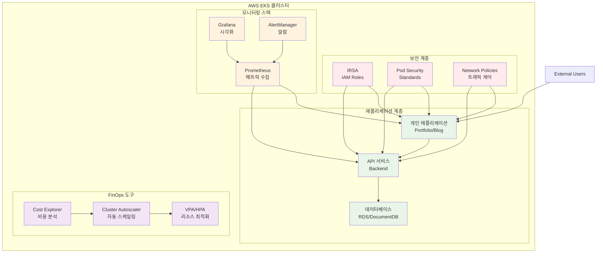
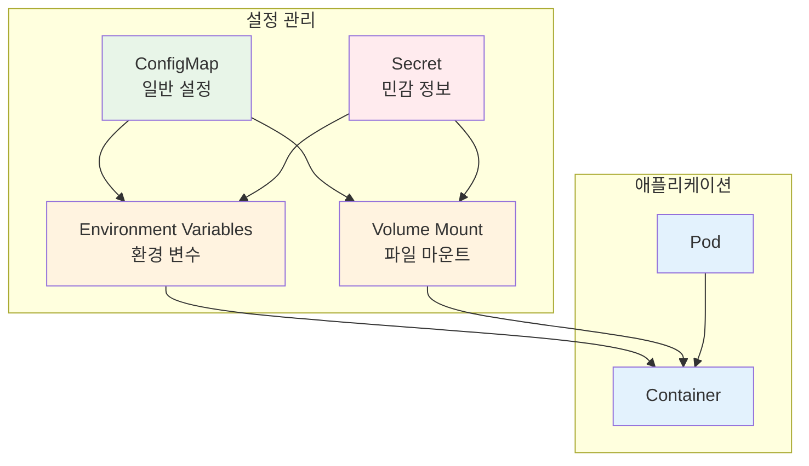
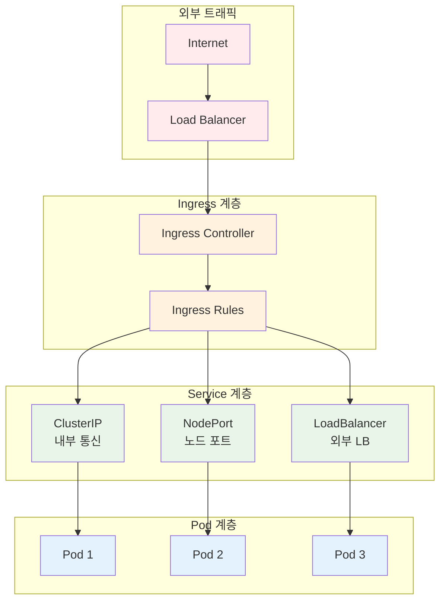
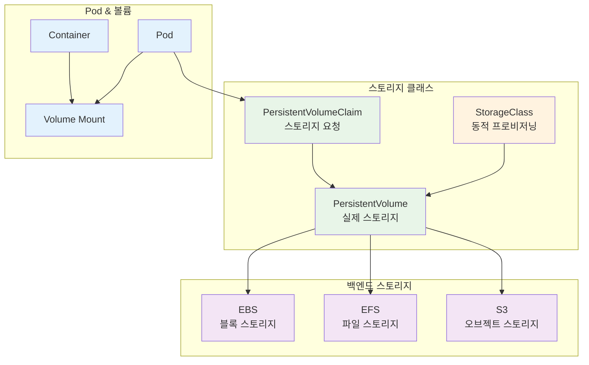
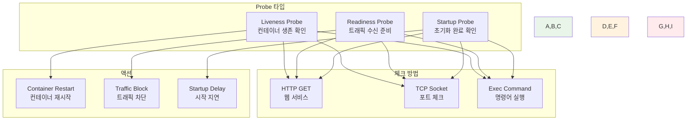
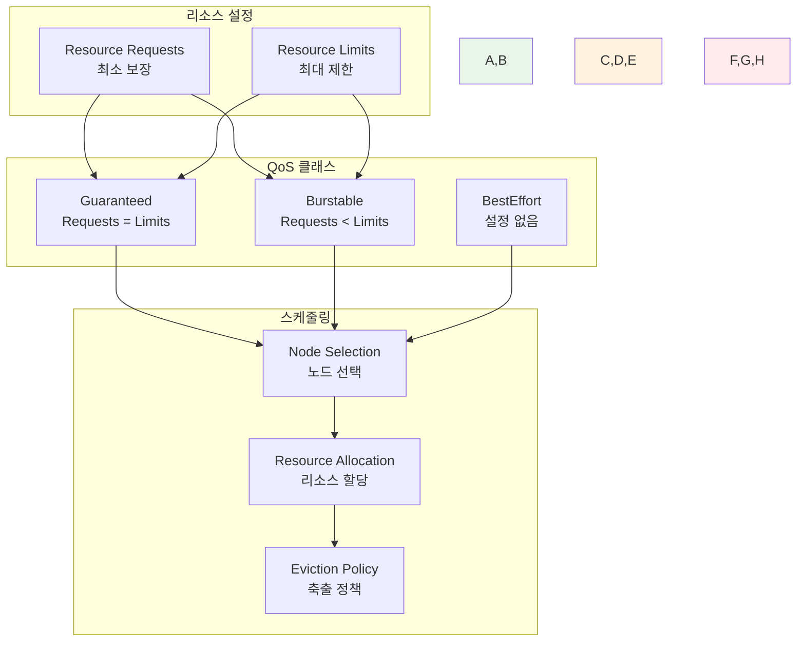
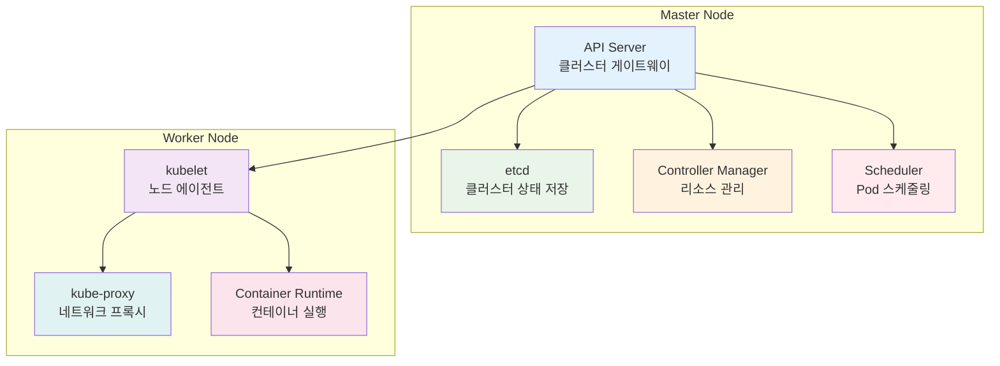
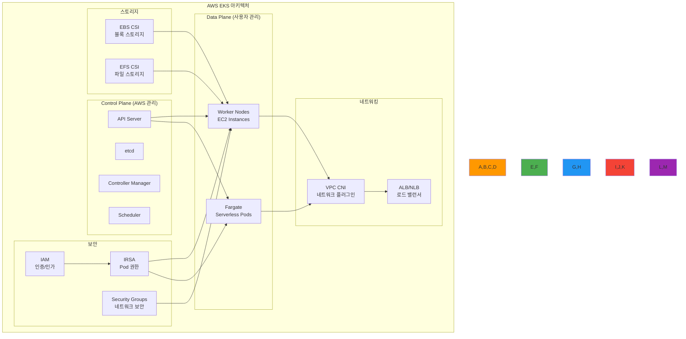
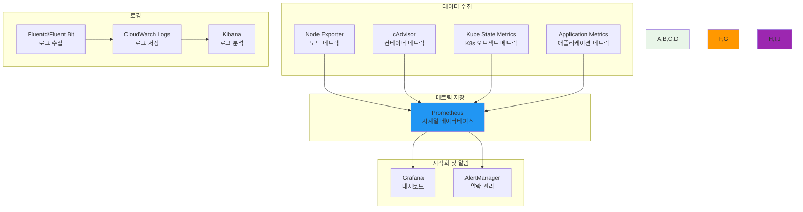

# Week 3: Kubernetes 운영과 관리

<div align="center">

**☸️ Kubernetes 실무 운영** • **🔧 개인 역량 개발** • **☁️ 클라우드 네이티브**

*기초부터 AWS EKS까지, Kubernetes 운영 전문가 되기*


</div>

---

## 🎯 주간 학습 목표

### 📚 전체 공통 목표
> **Kubernetes 클러스터 운영 역량을 개발하고, AWS EKS를 포함한 실무 환경에서 필요한 모든 기술을 습득한다**

### 🎪 개인별 학습 목표
- **🟢 초급자**: 클러스터 설치 및 기본 운영 + AWS EKS 기초 + 워크스페이스 관리
- **🟡 중급자**: 고급 배포 전략 + IRSA 보안 + 모니터링/알람 구성 + FinOps 기초
- **🔴 고급자**: HA 클러스터 설계 + 고급 보안 + 성능 최적화 + FinOps 고도화

---

## 📅 일일 학습 계획

### [Day 1: 클러스터 설치와 구성](./day1/README.md)
**🎯 목표**: Kubernetes 기본 구성요소 이해 + 다양한 설치 방법 + AWS EKS 기초

#### 📚 이론 강의 (2.5시간)
- **Session 1**: Kubernetes 기본 구성요소 (Master/Worker Node, etcd, API Server)
- **Session 2**: 설치 방법 비교 (kubeadm, kops, kubespray, Managed Services)
- **Session 3**: AWS EKS 아키텍처 및 설정 방법

#### 🛠️ 개인 실습 (3시간)
- **Phase 1**: kubeadm으로 로컬 클러스터 구축
- **Phase 2**: AWS EKS 클러스터 생성 및 구성
- **Phase 3**: kubectl 설정 및 클러스터 접근 권한 관리

#### 🎯 레벨별 활동
- **초급자**: 로컬 클러스터 설치 + EKS 기본 설정
- **중급자**: 멀티 노드 클러스터 + EKS 네트워킹 구성
- **고급자**: HA 클러스터 + EKS 고급 보안 설정

---

### [Day 2: 핵심 오브젝트와 워크로드 관리](./day2/README.md)
**🎯 목표**: Kubernetes 핵심 오브젝트 + 설정 관리 + 워크로드 배포 전략

#### 📚 이론 강의 (3시간)
- **Session 1**: ConfigMap & Secret + Service & Ingress 네트워킹 (90분)
- **Session 2**: PV/PVC 스토리지 + Health Probes + 무중단 배포 (90분)

#### 🛠️ 실습 챌린지 (3시간)
- **Phase 1**: ConfigMap/Secret + Service 타입별 네트워킹 구성
- **Phase 2**: PV/PVC 영속성 + Probe 설정으로 안정성 확보
- **Phase 3**: 통합 애플리케이션 배포 + 롤링 업데이트

#### 🎯 레벨별 활동
- **초급자**: 기본 설정 관리 + ClusterIP Service + 기본 Probe
- **중급자**: 환경별 설정 분리 + Ingress 라우팅 + 고급 Health Check
- **고급자**: 암호화된 설정 + 멀티 도메인 + 커스텀 배포 전략

---

### [Day 3: 리소스 관리와 스케줄링](./day3/README.md)
**🎯 목표**: Resource Management + QoS + 스케줄링 정책 + 네임스페이스 관리

#### 📚 이론 강의 (3시간)
- **Session 1**: Resource Requests/Limits + QoS Classes + 리소스 최적화 (90분)
- **Session 2**: Node Affinity + Pod Anti-Affinity + Namespace 멀티 테넌시 (90분)

#### 🛠️ 실습 챌린지 (3시간)
- **Phase 1**: Resource 설정으로 성능 최적화 + QoS 클래스 적용
- **Phase 2**: Affinity 규칙으로 고가용성 배치 + 스케줄링 최적화
- **Phase 3**: 네임스페이스 기반 환경 분리 + ResourceQuota 설정

#### 🎯 레벨별 활동
- **초급자**: 기본 Resource 설정 + 기본 스케줄링 + 네임스페이스 관리
- **중급자**: QoS 최적화 + Node Selector + 고급 리소스 정책
- **고급자**: 복잡한 Affinity + 멀티 클러스터 스케줄링 + 고급 격리

---

### [Day 4: 보안과 RBAC + GitOps](./day4/README.md)
**🎯 목표**: RBAC 보안 + AWS EKS IRSA + GitOps 배포 자동화

#### 📚 이론 강의 (3시간)
- **Session 1**: RBAC + ServiceAccount + Pod Security Standards (90분)
- **Session 2**: AWS EKS 보안 + IRSA + GitOps (ArgoCD, Helm) (90분)

#### 🛠️ 실습 챌린지 (3시간)
- **Phase 1**: RBAC으로 세밀한 권한 제어 + ServiceAccount 관리
- **Phase 2**: EKS IRSA 구성 + AWS 서비스 연동 보안
- **Phase 3**: GitOps 파이프라인 + Helm Chart 배포 자동화

#### 🎯 레벨별 활동
- **초급자**: 기본 RBAC + IRSA 기초 + ArgoCD 기본
- **중급자**: 세밀한 권한 제어 + Pod Security + GitOps 고급 패턴
- **고급자**: 제로 트러스트 + 고급 감사 + 멀티 클러스터 GitOps

---

### [Day 5: 모니터링과 FinOps](./day5/README.md)
**🎯 목표**: 모니터링 스택 + 알람 시스템 + FinOps 비용 최적화 + 트러블슈팅

#### 📚 이론 강의 (3시간)
- **Session 1**: Prometheus + Grafana + AlertManager 모니터링 스택 (90분)
- **Session 2**: FinOps + HPA/VPA + 트러블슈팅 + 성능 최적화 (90분)

#### 🛠️ 실습 챌린지 (3시간)
- **Phase 1**: Prometheus + Grafana 모니터링 스택 구축
- **Phase 2**: SLO 기반 알람 + HPA/VPA 자동 스케일링 설정
- **Phase 3**: 비용 모니터링 + 리소스 최적화 + 종합 트러블슈팅

#### 🎯 레벨별 활동
- **초급자**: 기본 모니터링 + 알람 설정 + 비용 가시성 + 기본 트러블슈팅
- **중급자**: 커스텀 메트릭 + SLO 알람 + 자동 스케일링 + 성능 최적화
- **고급자**: 분산 추적 + 예측적 알람 + 고급 FinOps + 복잡한 문제 해결

---

## 🏗️ 주간 통합 개인 프로젝트

### 🎯 개인 프로젝트 목표
**"개인 Kubernetes 플랫폼 구축 및 운영"**
- AWS EKS 기반 개인 클러스터 구축
- 완전한 모니터링 및 보안 시스템 구현
- FinOps 기반 비용 최적화 적용

### 🏗️ 개인 프로젝트 아키텍처


### 📋 개인 프로젝트 요구사항

#### 🏗️ 인프라 요구사항
1. **EKS 클러스터**: 멀티 AZ 구성으로 고가용성 확보
2. **네트워킹**: VPC, 서브넷, 보안 그룹 최적 구성
3. **스토리지**: EBS, EFS를 활용한 영구 스토리지
4. **로드 밸런싱**: ALB/NLB를 통한 트래픽 분산

#### 🔒 보안 요구사항
1. **IRSA 구성**: Pod별 최소 권한 IAM 역할 할당
2. **클러스터 보안**: API 서버 접근 제어 및 감사 로깅
3. **네트워크 보안**: 네트워크 정책을 통한 트래픽 격리
4. **시크릿 관리**: AWS Secrets Manager 연동

#### 📊 모니터링 요구사항
1. **메트릭 수집**: Prometheus로 클러스터 및 애플리케이션 메트릭
2. **시각화**: Grafana 대시보드로 실시간 모니터링
3. **알람**: SLO 기반 지능형 알람 시스템
4. **로깅**: CloudWatch Logs 연동 중앙화 로깅

#### 💰 FinOps 요구사항
1. **비용 가시성**: 실시간 비용 모니터링 및 분석
2. **리소스 최적화**: HPA/VPA를 통한 자동 리소스 조정
3. **스케줄링**: 비용 효율적인 노드 스케줄링
4. **예산 관리**: 비용 임계값 기반 알람 설정

---

## 📊 개인 학습 평가 기준

### ✅ 실무 역량 평가
- **클러스터 운영**: EKS 설치, 구성, 관리 능력
- **보안 관리**: IRSA 및 클러스터 보안 구성 능력
- **모니터링**: 관측성 구축 및 알람 시스템 구성
- **비용 최적화**: FinOps 원칙 적용 및 비용 관리

### 🎯 개인 성공 지표
- **기술 이해도**: 85% 이상
- **실습 완성률**: 90% 이상
- **프로젝트 완성도**: 85% 이상
- **문제 해결 능력**: 80% 이상

### 📋 개인 평가 체크리스트
- [ ] EKS 클러스터 구축 및 운영 완료
- [ ] IRSA를 통한 보안 구성 완료
- [ ] 워크스페이스 기반 멀티 환경 구성
- [ ] 모니터링 스택 구축 및 알람 설정
- [ ] FinOps 기반 비용 최적화 적용
- [ ] 개인 프로젝트 완성 및 운영

---

## 🔧 추가된 Kubernetes 핵심 구성요소

### 📝 ConfigMap & Secret 관리


### 🌐 Service & Ingress 네트워킹


### 💾 PersistentVolume & Storage


### 🏥 Health Check & Probes


### ⚖️ Resource Management & QoS
```mermaid
graph TB
    subgraph "리소스 설정"
        A[Resource Requests<br/>최소 보장]
        B[Resource Limits<br/>최대 제한]
    end
    
    subgraph "QoS 클래스"
        C[Guaranteed<br/>Requests = Limits]
        D[Burstable<br/>Requests < Limits]
        E[BestEffort<br/>설정 없음]
    end
    
    subgraph "스케줄링"
        F[Node Selection<br/>노드 선택]
        G[Resource Allocation<br/>리소스 할당]
        H[Eviction Policy<br/>축출 정책]
    end
    
    A --> C
    A --> D
    B --> C
    B --> D
    C --> F
    D --> F
    E --> F
    F --> G
    G --> H
    
    style A,B fill:#e8f5e8
    style C,D,E fill:#fff3e0
    style F,G,H fill:#ffebee
        G[Container Restart<br/>컨테이너 재시작]
        H[Traffic Block<br/>트래픽 차단]
        I[Startup Delay<br/>시작 지연]
    end
    
    A --> D
    A --> E
    A --> F
    B --> D
    B --> E
    B --> F
    C --> D
    C --> E
    C --> F
    
    A --> G
    B --> H
    C --> I
    
    style A,B,C fill:#e8f5e8
    style D,E,F fill:#fff3e0
    style G,H,I fill:#ffebee
```

### ⚖️ Resource Management & QoS


---

## 🔧 Kubernetes 핵심 구성요소 상세

### 🏗️ 마스터 노드 구성요소


### ⚙️ 설치 방법별 특징 비교

| 설치 방법 | 복잡도 | 제어 수준 | 운영 부담 | 적용 환경 |
|-----------|---------|-----------|-----------|-----------|
| **kubeadm** | 중간 | 높음 | 높음 | 온프레미스, 학습용 |
| **kops** | 높음 | 매우 높음 | 매우 높음 | AWS 전용, 고급 사용자 |
| **kubespray** | 높음 | 높음 | 높음 | 멀티 클라우드, 엔터프라이즈 |
| **EKS** | 낮음 | 중간 | 낮음 | AWS 프로덕션 환경 |
| **GKE** | 낮음 | 중간 | 낮음 | GCP 프로덕션 환경 |
| **AKS** | 낮음 | 중간 | 낮음 | Azure 프로덕션 환경 |

### 📜 스크립트 구성 및 관리

#### Helm Chart 구조
```
my-app/
├── Chart.yaml          # 차트 메타데이터
├── values.yaml         # 기본 설정값
├── templates/          # Kubernetes 매니페스트 템플릿
│   ├── deployment.yaml
│   ├── service.yaml
│   ├── ingress.yaml
│   └── configmap.yaml
└── charts/            # 의존성 차트
```

#### Kustomize 구조
```
overlays/
├── base/              # 기본 매니페스트
│   ├── kustomization.yaml
│   ├── deployment.yaml
│   └── service.yaml
├── dev/               # 개발 환경 오버레이
│   ├── kustomization.yaml
│   └── patch-dev.yaml
└── prod/              # 프로덕션 환경 오버레이
    ├── kustomization.yaml
    └── patch-prod.yaml
```

---

## ☁️ AWS EKS 심화 가이드

### 🏗️ EKS 아키텍처 구성요소


### 🔐 IRSA (IAM Roles for Service Accounts) 구성

#### IRSA 설정 단계
1. **OIDC Identity Provider 생성**
2. **IAM 역할 생성 및 신뢰 정책 설정**
3. **Service Account 생성 및 어노테이션 추가**
4. **Pod에서 Service Account 사용**

#### IRSA 예제 구성
```yaml
# ServiceAccount with IRSA
apiVersion: v1
kind: ServiceAccount
metadata:
  name: s3-access-sa
  namespace: default
  annotations:
    eks.amazonaws.com/role-arn: arn:aws:iam::ACCOUNT:role/EKS-S3-Access-Role

---
# Pod using IRSA
apiVersion: v1
kind: Pod
metadata:
  name: s3-pod
spec:
  serviceAccountName: s3-access-sa
  containers:
  - name: app
    image: my-app:latest
    env:
    - name: AWS_REGION
      value: "us-west-2"
```

---

## 📊 모니터링 및 FinOps 통합

### 📈 모니터링 스택 구성


### 💰 FinOps 비용 최적화 전략

#### 비용 모니터링 메트릭
- **노드 사용률**: CPU, 메모리, 네트워크 사용률
- **Pod 리소스 효율성**: Request vs Actual 사용량
- **스토리지 비용**: EBS, EFS 사용량 및 비용
- **네트워크 비용**: 데이터 전송 비용

#### 자동 최적화 도구
```yaml
# Cluster Autoscaler 설정
apiVersion: apps/v1
kind: Deployment
metadata:
  name: cluster-autoscaler
  namespace: kube-system
spec:
  template:
    spec:
      containers:
      - image: k8s.gcr.io/autoscaling/cluster-autoscaler:v1.21.0
        name: cluster-autoscaler
        command:
        - ./cluster-autoscaler
        - --v=4
        - --stderrthreshold=info
        - --cloud-provider=aws
        - --skip-nodes-with-local-storage=false
        - --expander=least-waste
        - --node-group-auto-discovery=asg:tag=k8s.io/cluster-autoscaler/enabled,k8s.io/cluster-autoscaler/my-cluster
```

---

## 🔗 다음 주 연결

### 🚀 Week 4 준비사항
- Kubernetes 운영 경험 정리 및 포트폴리오 업데이트
- 클라우드 네이티브 아키텍처 패턴 예습
- 마이크로서비스 설계 원칙 학습

### 📚 추천 학습 자료
- [EKS 모범 사례 가이드](https://aws.github.io/aws-eks-best-practices/)
- [Kubernetes FinOps](https://www.finops.org/projects/kubernetes/)
- [IRSA 구성 가이드](https://docs.aws.amazon.com/eks/latest/userguide/iam-roles-for-service-accounts.html)

### 🎯 심화 학습 주제
- **초급자**: Kubernetes 네트워킹 및 스토리지 심화
- **중급자**: Kubernetes Operator 개발 기초
- **고급자**: 멀티 클러스터 관리 및 GitOps 고도화

---

## 📝 주간 개인 회고

### 🤔 개인 회고 질문
1. EKS 클러스터 운영의 복잡성을 어떻게 관리했나요?
2. IRSA를 통한 보안 구성에서 어려웠던 점은?
3. 모니터링을 통해 어떤 인사이트를 얻었나요?
4. FinOps 관점에서 가장 효과적인 비용 최적화는?

### 📈 개인 개선 포인트
- 클러스터 설치 및 구성 시 자주 발생한 문제
- IRSA 설정 과정에서의 어려움
- 모니터링 설정 시 놓친 부분
- 비용 최적화에서 개선할 점

### 🎉 개인 성취 사항
- AWS EKS 기반 개인 클러스터 구축 완료
- 보안이 강화된 클러스터 운영 경험
- 완전한 모니터링 시스템 구축
- FinOps 기반 비용 최적화 적용

---

<div align="center">

**☸️ Kubernetes 운영 전문가** • **☁️ AWS EKS 마스터** • **💰 FinOps 실무자**

*Week 3을 통해 개인 Kubernetes 플랫폼을 완벽하게 구축하고 운영할 수 있게 되었습니다*

**이전 주**: [Week 2 - 컨테이너 오케스트레이션 기초](../week_02/README.md) | **다음 주**: [Week 4 - 클라우드 네이티브 아키텍처](../week_04/README.md)

</div>