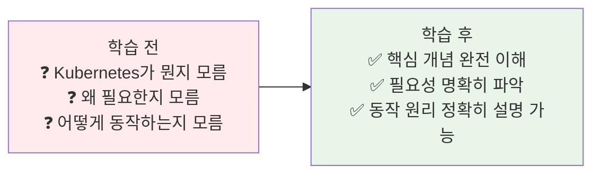
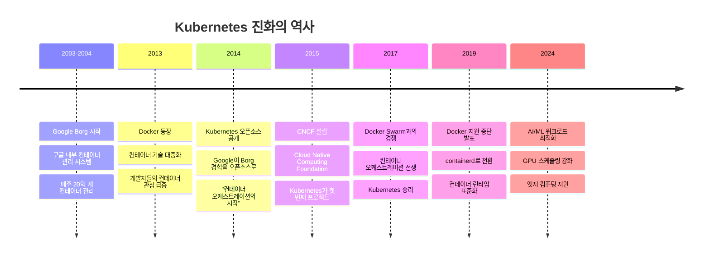
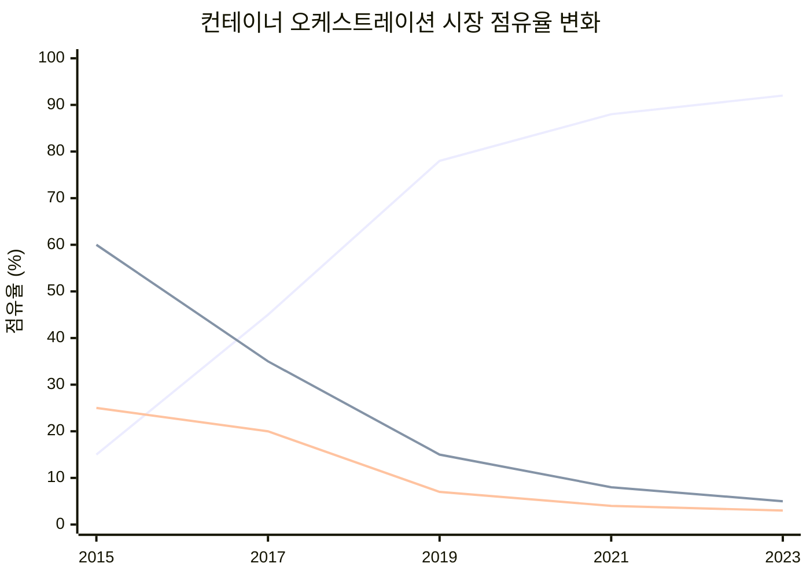
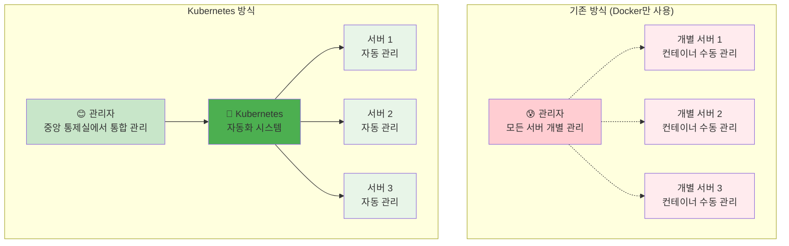
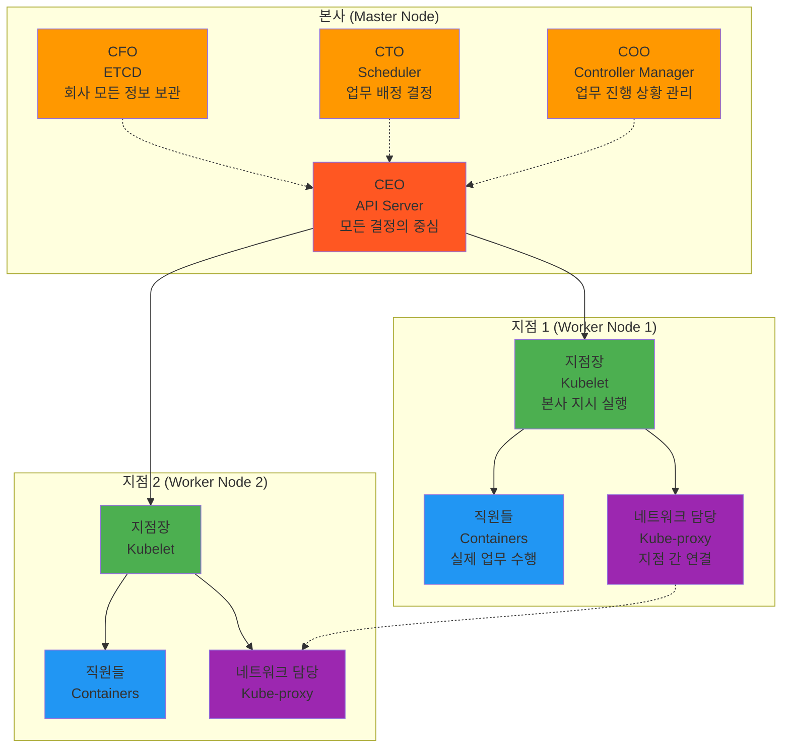
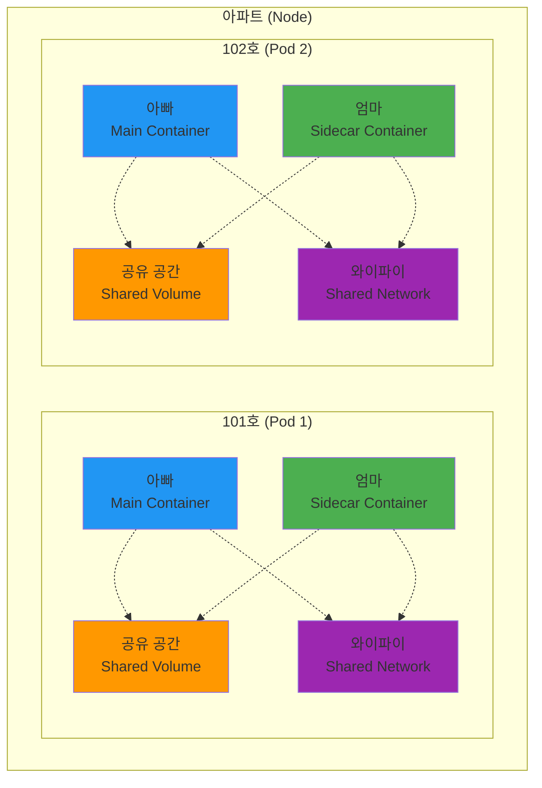
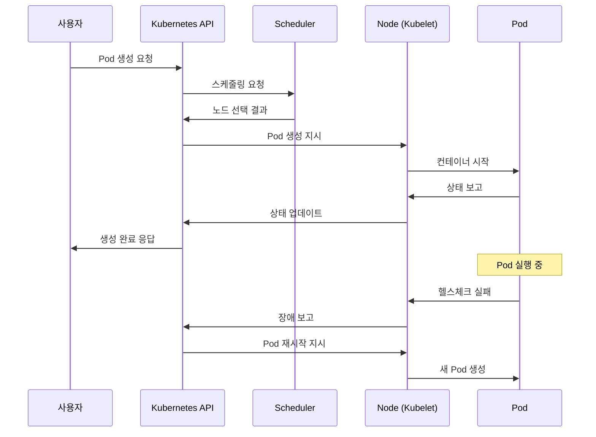
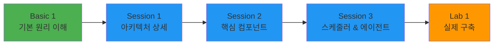

# Week 3 Day 1 Basic 1: Kubernetes 기초 원리 완전 이해

**🧠 핵심 원리** • **🔍 동작 메커니즘** • **📚 학술적 기초**

*초보자도 완벽히 이해하는 Kubernetes의 모든 것*

---

## 🕘 세션 정보
**시간**: 08:30-09:20 (50분) - 메인 세션 전 기초 다지기  
**목표**: Kubernetes의 핵심 원리와 동작 메커니즘 완전 이해  
**방식**: 단계별 설명 + 시각적 자료 + 실생활 비유

## 🎯 세션 목표

### 📚 학습 목표
- **이해 목표**: "왜 Kubernetes가 필요한가?"부터 "어떻게 동작하는가?"까지
- **원리 목표**: 컨테이너 오케스트레이션의 핵심 개념과 동작 원리
- **기초 목표**: 이후 모든 학습의 탄탄한 기반 구축

### 🤔 왜 이 세션이 필요한가? (5분)

**현실 문제 상황**:
- 💼 **실무 시나리오**: "Docker는 알겠는데 Kubernetes는 왜 필요한거죠?"
- 🏠 **일상 비유**: 아파트 관리사무소가 없다면? (개별 관리 vs 통합 관리)
- 📊 **시장 현실**: 95%의 기업이 컨테이너 오케스트레이션 도구 사용

**학습 전후 비교**:

---

## 📖 핵심 개념 (47분)

### 🔍 개념 0: Kubernetes의 탄생과 진화 (7분)

> **정의**: Google의 15년 컨테이너 운영 경험이 오픈소스로 탄생한 혁신적 플랫폼

**🏛️ Kubernetes 역사 타임라인**:

**🌟 주요 변천 포인트**:

**1단계: Google Borg (2003-2013)**
- Google 내부에서만 사용
- 매주 20억 개 컨테이너 관리
- 15년간의 대규모 운영 경험 축적

**2단계: Docker 혁명 (2013-2014)**
- 컨테이너 기술의 대중화
- 개발자들의 컨테이너 도입 급증
- 하지만 단일 서버 한계 명확

**3단계: Kubernetes 탄생 (2014-2016)**
- Google이 Borg 경험을 오픈소스로 공개
- "Kubernetes = 그리스어로 '조타수(helmsman)'"
- 컨테이너 오케스트레이션의 새로운 표준

**4단계: 생태계 확장 (2017-2020)**
- Docker Swarm, Apache Mesos와의 경쟁에서 승리
- 클라우드 제공업체들의 관리형 서비스 출시
- 엔터프라이즈 도입 급증

**5단계: 성숙기 (2021-현재)**
- AI/ML 워크로드 최적화
- 엣지 컴퓨팅 지원 강화
- 보안 및 거버넌스 기능 향상

**📊 시장 점유율 변화**:

**🏢 기업 도입 사례 변화**:
- **2015년**: 구글, 레드햇 등 기술 기업 중심
- **2017년**: Netflix, Spotify 등 인터넷 기업 확산
- **2019년**: 금융, 제조업 등 전통 기업 도입
- **2021년**: 정부, 공공기관까지 확산
- **2024년**: 중소기업도 클라우드 서비스로 쉽게 사용

### 🔍 개념 1: 컨테이너 오케스트레이션이란? (13분)

> **정의**: 여러 컨테이너를 자동으로 배포, 관리, 확장, 네트워킹하는 기술

**🏠 실생활 비유 - 아파트 관리**:

**왜 필요한가?**:
1. **확장성**: 트래픽 증가 시 자동으로 컨테이너 추가
2. **가용성**: 컨테이너 장애 시 자동 복구
3. **효율성**: 리소스 최적 배치로 비용 절약
4. **관리성**: 수백 개 컨테이너를 하나의 시스템으로 관리

**📊 실제 사례**:
- **Netflix**: 700개 마이크로서비스, 수만 개 컨테이너 관리
- **Spotify**: 음악 스트리밍 서비스의 글로벌 확장
- **Airbnb**: 전 세계 숙박 예약 시스템 안정성 확보

### 🔍 개념 2: Kubernetes 아키텍처 - 마스터와 워커 (12분)

> **정의**: 중앙 제어부(Master)와 실행부(Worker)로 구성된 분산 시스템

**🏢 실생활 비유 - 회사 조직**:

**각 컴포넌트의 역할**:

**Master Node (본사)**:
- **API Server**: 모든 요청의 관문, 인증/인가 처리
- **ETCD**: 클러스터의 모든 상태 정보 저장 (분산 데이터베이스)
- **Scheduler**: 새로운 Pod을 어느 노드에 배치할지 결정
- **Controller Manager**: 원하는 상태와 현재 상태를 지속적으로 비교하여 조정

**Worker Node (지점)**:
- **Kubelet**: 마스터의 지시를 받아 실제 컨테이너 관리
- **Kube-proxy**: 네트워크 트래픽 라우팅 및 로드밸런싱
- **Container Runtime**: 실제 컨테이너 실행 (Docker, containerd 등)

### 🔍 개념 3: Pod - Kubernetes의 최소 단위 (15분)

> **정의**: 하나 이상의 컨테이너를 묶은 배포 단위, 같은 네트워크와 스토리지 공유

**🏠 실생활 비유 - 가족 단위**:

**Pod의 핵심 특징**:

1. **네트워크 공유**:
   - 같은 Pod 내 컨테이너들은 `localhost`로 통신
   - 하나의 IP 주소 공유
   - 포트 충돌 주의 필요

2. **스토리지 공유**:
   - Volume을 통해 파일 시스템 공유
   - 컨테이너 간 데이터 교환 가능
   - 임시 데이터나 설정 파일 공유

3. **생명주기 공유**:
   - 함께 생성되고 함께 삭제
   - 하나의 컨테이너 실패 시 전체 Pod 재시작
   - 스케줄링도 Pod 단위로 수행

**실제 사용 패턴**:

**사이드카 패턴 예시**:
- **메인 컨테이너**: 웹 애플리케이션
- **사이드카 컨테이너**: 로그 수집기
- **공유 볼륨**: 로그 파일 저장소
- **결과**: 애플리케이션 코드 변경 없이 로그 수집 기능 추가

---

## 💭 함께 생각해보기 (3분)

### 🤝 페어 토론 (2분)
**토론 주제**:
1. **실생활 연결**: "Kubernetes를 일상생활의 어떤 것에 비유할 수 있을까요?"
2. **역사적 의미**: "Google이 왜 Borg를 오픈소스로 공개했을까요?"
3. **궁금한 점**: "아직 이해가 어려운 부분이나 더 알고 싶은 부분은?"

### 🎯 전체 공유 (1분)
- **인사이트 공유**: 페어 토론에서 나온 좋은 비유나 아이디어
- **질문 수집**: 아직 궁금한 점들 정리
- **다음 연결**: Session 1과의 연결고리 확인

---

## 🔑 핵심 키워드 정리

### 🆕 새로운 용어
- **Google Borg**: Kubernetes의 전신, 구글 내부 컨테이너 관리 시스템
- **CNCF**: Cloud Native Computing Foundation, 클라우드 네이티브 기술 재단
- **오케스트레이션(Orchestration)**: 여러 컨테이너의 자동 관리
- **마스터 노드(Master Node)**: 클러스터의 제어 중심
- **워커 노드(Worker Node)**: 실제 워크로드 실행
- **Pod**: Kubernetes의 최소 배포 단위
- **API Server**: 모든 요청의 관문
- **ETCD**: 분산 키-값 저장소
- **Scheduler**: 워크로드 배치 결정자
- **Kubelet**: 노드의 에이전트

### 🔤 중요 개념
- **선언적 관리**: "어떻게"가 아닌 "무엇을" 원하는지 선언
- **자동 복구**: 장애 발생 시 자동으로 정상 상태로 복구
- **수평 확장**: 서버 추가로 처리 능력 증대
- **로드밸런싱**: 트래픽을 여러 인스턴스에 분산

---

## 📊 이해도 체크

### 💡 즉석 퀴즈
1. **Q**: Kubernetes의 전신인 Google의 내부 시스템 이름은?
   **A**: Borg입니다.

2. **Q**: Kubernetes에서 컨테이너를 직접 생성할 수 있나요?
   **A**: 아니요, Pod 단위로만 생성 가능합니다.

3. **Q**: 같은 Pod 내 컨테이너들은 어떻게 통신하나요?
   **A**: localhost를 통해 직접 통신 가능합니다.

4. **Q**: Master Node에서 실제 애플리케이션이 실행되나요?
   **A**: 일반적으로 아니요, Worker Node에서 실행됩니다.

### ✅ 이해도 확인 질문
- "Google이 왜 Borg를 오픈소스로 공개했는지 설명할 수 있나요?"
- "Kubernetes가 왜 필요한지 친구에게 설명할 수 있나요?"
- "Pod와 컨테이너의 차이점을 말할 수 있나요?"
- "Master Node와 Worker Node의 역할을 구분할 수 있나요?"

---

## 🎯 다음 세션 연결

### 📚 Session 1 준비
이제 기본 원리를 이해했으니, Session 1에서는:
- **실제 아키텍처**: 각 컴포넌트의 상세한 동작 방식
- **통신 메커니즘**: 컴포넌트 간 어떻게 소통하는지
- **실습 준비**: 직접 클러스터를 구축해보기 위한 준비

### 🔗 학습 연결고리

---

## 📝 세션 마무리

### ✅ 오늘 Basic 세션 성과
- [ ] **기본 개념**: Kubernetes가 무엇인지 명확히 이해
- [ ] **필요성**: 왜 컨테이너 오케스트레이션이 필요한지 파악
- [ ] **아키텍처**: Master-Worker 구조의 기본 이해
- [ ] **Pod 개념**: Kubernetes의 최소 단위 완전 이해

### 🎯 다음 학습 준비
- **자신감**: 기본기가 탄탄해져서 다음 학습이 쉬워질 것
- **호기심**: 실제로 어떻게 동작하는지 더 알고 싶어질 것
- **실습 준비**: 이론을 바탕으로 실제 구축해볼 준비 완료

---

**🧠 원리 이해** • **🔍 메커니즘 파악** • **📚 기초 완성**

*이제 Kubernetes의 모든 것이 명확해졌습니다!*

