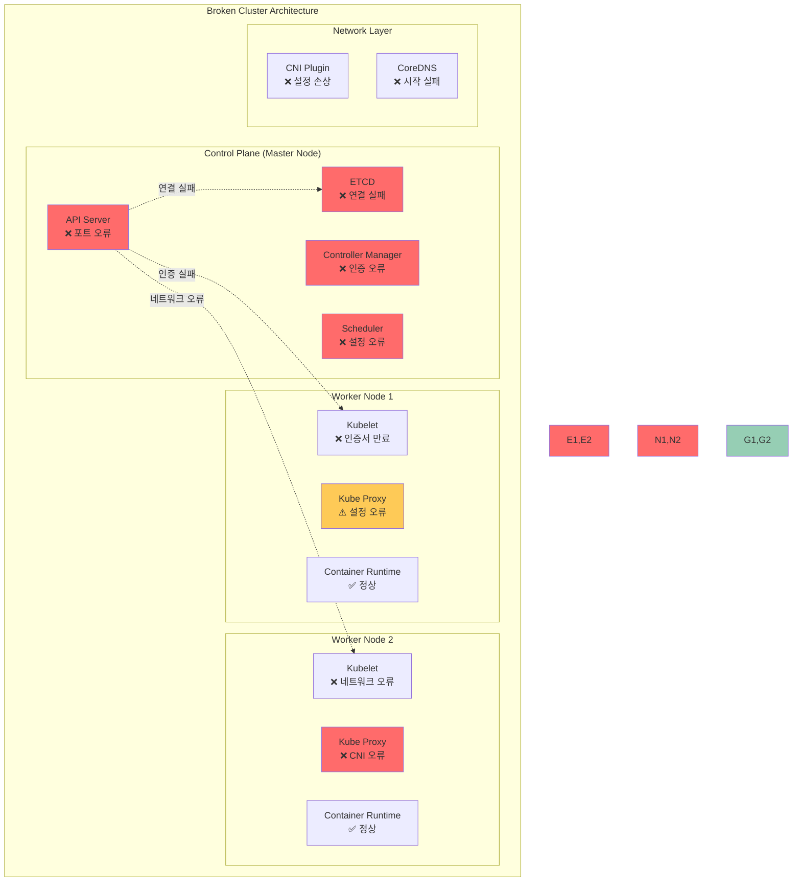

# Challenge 1: 고장난 클러스터 복구하기 (90분)

## 🎯 Challenge 목표
**시나리오**: 
"TechStart" 스타트업의 개발팀이 새로운 Kubernetes 클러스터를 구축했지만, 
설정 실수로 인해 여러 컴포넌트에 장애가 발생했습니다. 
DevOps 엔지니어로서 시스템을 진단하고 복구해야 합니다.

## 🏗️ 시스템 아키텍처



## 🔧 구현 요구사항

### 초기 클러스터 상태
```yaml
# 예상되는 클러스터 상태
cluster_status:
  api_server: "Connection refused"
  etcd: "Unhealthy"
  nodes: "NotReady"
  pods: "Pending/Failed"
  services: "Unreachable"
```

### 복구 목표
```yaml
# 목표 클러스터 상태
target_status:
  api_server: "Healthy"
  etcd: "Healthy"
  nodes: "Ready"
  pods: "Running"
  services: "Accessible"
  dns: "Resolving"
```

## ⚠️ 의도적 오류 시나리오

### 시나리오 1: API Server 설정 오류 (20분)

**상황**: API Server가 시작되지 않고 kubectl 명령어가 모두 실패

**오류 설정 파일**: [broken-apiserver.yaml](./lab_scripts/challenge1/broken-apiserver.yaml)

**증상**:
```bash
# 다음 명령어들이 모두 실패
kubectl cluster-info
# Error: connection refused

kubectl get nodes
# Error: Unable to connect to the server

curl -k https://localhost:6443/api/v1
# curl: (7) Failed to connect to localhost port 6443
```

**진단 과정**:
**스크립트 파일**: [diagnose-apiserver.sh](./lab_scripts/challenge1/diagnose-apiserver.sh)

**해결 단계**:
**스크립트 파일**: [fix-apiserver.sh](./lab_scripts/challenge1/fix-apiserver.sh)

### 시나리오 2: ETCD 연결 문제 (25분)

**상황**: ETCD 클러스터가 비정상 상태이고 데이터 접근 불가

**오류 설정 파일**: [broken-etcd.yaml](./lab_scripts/challenge1/broken-etcd.yaml)

**증상**:
```bash
# ETCD 상태 확인 실패
kubectl exec -n kube-system etcd-master -- \
  etcdctl --endpoints=https://127.0.0.1:2379 \
  --cacert=/etc/kubernetes/pki/etcd/ca.crt \
  --cert=/etc/kubernetes/pki/etcd/server.crt \
  --key=/etc/kubernetes/pki/etcd/server.key \
  endpoint health
# Error: context deadline exceeded
```

**진단 과정**:
**스크립트 파일**: [diagnose-etcd.sh](./lab_scripts/challenge1/diagnose-etcd.sh)

**해결 단계**:
**스크립트 파일**: [fix-etcd.sh](./lab_scripts/challenge1/fix-etcd.sh)

### 시나리오 3: Kubelet 인증서 만료 (25분)

**상황**: Worker 노드의 Kubelet이 API Server와 통신할 수 없음

**오류 설정 파일**: [broken-kubelet.conf](./lab_scripts/challenge1/broken-kubelet.conf)

**증상**:
```bash
# 노드가 NotReady 상태
kubectl get nodes
# NAME      STATUS     ROLES    AGE   VERSION
# master    Ready      master   1h    v1.28.0
# worker1   NotReady   <none>   1h    v1.28.0

# Kubelet 로그에서 인증 오류
sudo journalctl -u kubelet -f
# certificate has expired or is not yet valid
```

**진단 과정**:
**스크립트 파일**: [diagnose-kubelet.sh](./lab_scripts/challenge1/diagnose-kubelet.sh)

**해결 단계**:
**스크립트 파일**: [fix-kubelet.sh](./lab_scripts/challenge1/fix-kubelet.sh)

### 시나리오 4: 네트워크 플러그인 오류 (20분)

**상황**: CNI 플러그인 설정 오류로 Pod 간 통신 불가

**오류 설정 파일**: 
- [broken-cni-config.json](./lab_scripts/challenge1/broken-cni-config.json)
- [broken-calico-kubeconfig](./lab_scripts/challenge1/broken-calico-kubeconfig)

**증상**:
```bash
# Pod가 ContainerCreating 상태에서 멈춤
kubectl get pods --all-namespaces
# coredns pods are in Pending state

# CNI 오류 로그
kubectl describe pod <coredns-pod> -n kube-system
# Warning: FailedCreatePodSandBox: Failed to create pod sandbox
```

**진단 과정**:
**스크립트 파일**: [diagnose-cni.sh](./lab_scripts/challenge1/diagnose-cni.sh)

**해결 단계**:
**스크립트 파일**: [fix-cni.sh](./lab_scripts/challenge1/fix-cni.sh)

## 🎯 성공 기준

### 기능적 요구사항
- [ ] kubectl 명령어 정상 동작
- [ ] 모든 노드가 Ready 상태
- [ ] 시스템 Pod들이 Running 상태
- [ ] Pod 간 네트워크 통신 가능
- [ ] DNS 해결 정상 동작

### 성능 요구사항
- [ ] API Server 응답 시간 < 1초
- [ ] Pod 생성 시간 < 30초
- [ ] 네트워크 지연시간 < 10ms
- [ ] ETCD 응답 시간 < 100ms

### 안정성 요구사항
- [ ] 모든 컴포넌트 헬스체크 통과
- [ ] 로그에 ERROR 메시지 없음
- [ ] 인증서 유효성 확인
- [ ] 백업 및 복구 절차 수립

## 🏆 도전 과제 (보너스)

### 고급 복구 기능 (+15점)
1. **자동 복구 스크립트**: 일반적인 오류를 자동으로 감지하고 복구하는 스크립트 작성
2. **모니터링 대시보드**: Prometheus + Grafana로 클러스터 상태 모니터링
3. **백업 자동화**: ETCD 백업 자동화 및 복원 테스트
4. **고가용성 구성**: 마스터 노드 3개로 HA 클러스터 구성

### 창의적 해결책 (+10점)
1. **진단 도구**: 클러스터 문제를 자동으로 진단하는 도구 개발
2. **복구 플레이북**: 단계별 복구 가이드 문서화
3. **테스트 자동화**: 복구 후 기능 테스트 자동화
4. **알림 시스템**: 장애 발생 시 자동 알림 시스템

## 📊 평가 매트릭스

| 영역 | 기본 (60%) | 우수 (80%) | 탁월 (100%) |
|------|------------|------------|--------------|
| **문제 진단** | 증상 파악 | 근본 원인 분석 | 예방 대책 수립 |
| **복구 속도** | 90분 내 완료 | 60분 내 완료 | 45분 내 완료 |
| **문서화** | 기본 해결 과정 | 상세 분석 보고서 | 재발 방지 가이드 |
| **협업** | 개별 문제 해결 | 팀 내 지식 공유 | 전체 팀 멘토링 |

## 💡 힌트 및 팁

### 디버깅 체크리스트
```bash
# 1. 클러스터 전체 상태 확인
kubectl cluster-info
kubectl get nodes
kubectl get pods --all-namespaces

# 2. 시스템 컴포넌트 상태 확인
kubectl get componentstatuses
sudo systemctl status kubelet
sudo systemctl status docker

# 3. 로그 분석
sudo journalctl -u kubelet -f
kubectl logs -n kube-system <pod-name>

# 4. 네트워크 연결 확인
sudo netstat -tlnp | grep -E "(6443|2379|10250)"
ping <node-ip>

# 5. 인증서 확인
sudo openssl x509 -in <cert-file> -text -noout | grep -A2 Validity
```

### 문제 해결 순서
1. **증상 파악**: 어떤 기능이 동작하지 않는가?
2. **로그 분석**: 오류 메시지에서 단서 찾기
3. **설정 확인**: 설정 파일의 오타나 잘못된 값 확인
4. **네트워크 확인**: 포트, 방화벽, DNS 설정 확인
5. **인증서 확인**: 만료, 권한, 경로 확인
6. **단계적 복구**: 한 번에 하나씩 문제 해결
7. **검증**: 복구 후 전체 기능 테스트

### 복구 후 검증 스크립트
**스크립트 파일**: [verify-recovery.sh](./lab_scripts/challenge1/verify-recovery.sh)

이 Challenge를 통해 실제 운영 환경에서 발생할 수 있는 다양한 Kubernetes 클러스터 장애 상황을 경험하고, 
체계적인 문제 해결 능력과 클러스터 복구 기술을 습득할 수 있습니다! 🚀