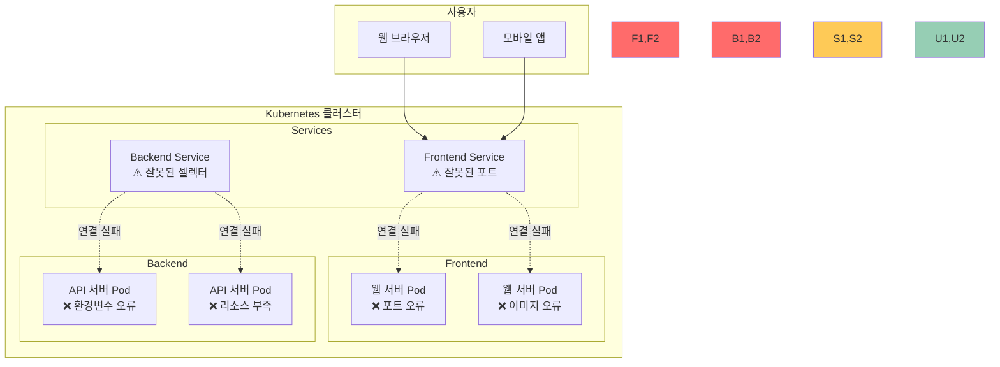

# Challenge 1: 웹 애플리케이션 배포 문제 해결 (60분)

## 🎯 Challenge 목표
**시나리오**: 
"WebStart" 스타트업의 개발팀이 첫 번째 웹 애플리케이션을 Kubernetes에 배포했지만, 
사용자들이 웹사이트에 접근할 수 없다고 신고했습니다. 
주니어 DevOps 엔지니어로서 문제를 찾아 해결해야 합니다.

## 🌐 애플리케이션 아키텍처



## 🚀 Challenge 시작하기

### 📋 사전 준비
```bash
# 작업 디렉토리 생성
mkdir -p ~/k8s-challenge1
cd ~/k8s-challenge1

# Challenge용 문제 애플리케이션 배포
./lab_scripts/challenge1/deploy-broken-app.sh
```

---

## ⚠️ 문제 시나리오들

### 시나리오 1: 웹사이트 접근 불가 - 포트 문제 (15분)

**상황**: 사용자가 웹사이트에 접근하려고 하지만 "연결할 수 없음" 오류 발생

**증상**:
```bash
# 브라우저에서 접근 시도
curl http://localhost:30080
# curl: (7) Failed to connect to localhost port 30080: Connection refused

# Pod는 정상 실행 중
kubectl get pods
# NAME                        READY   STATUS    RESTARTS   AGE
# frontend-xxx                1/1     Running   0          5m
```

**문제 파일**: [broken-frontend-service.yaml](./lab_scripts/challenge1/broken-frontend-service.yaml)

**진단 과정**:
```bash
# 1. Pod 상태 확인
kubectl get pods -l app=frontend

# 2. Service 상태 확인  
kubectl get svc frontend-service

# 3. Service 상세 정보 확인
kubectl describe svc frontend-service

# 4. Pod 포트 확인
kubectl describe pod <frontend-pod-name>
```

**해결 단계**:
1. Service와 Pod의 포트 매핑 확인
2. targetPort 수정
3. 서비스 재배포
4. 접근 테스트

### 시나리오 2: API 서버 응답 없음 - 환경변수 문제 (15분)

**상황**: 프론트엔드는 로드되지만 데이터가 표시되지 않음

**증상**:
```bash
# API 엔드포인트 테스트
curl http://localhost:30081/api/health
# {"error": "Database connection failed"}

# Pod 로그 확인
kubectl logs <api-pod-name>
# Error: connect ECONNREFUSED database:5432
```

**문제 파일**: [broken-api-deployment.yaml](./lab_scripts/challenge1/broken-api-deployment.yaml)

**진단 과정**:
```bash
# 1. API Pod 로그 확인
kubectl logs -l app=api-server

# 2. 환경변수 확인
kubectl describe pod <api-pod-name>

# 3. ConfigMap/Secret 확인
kubectl get configmap
kubectl get secret
```

**해결 단계**:
1. 환경변수 값 확인
2. 올바른 데이터베이스 호스트명으로 수정
3. Deployment 재배포
4. API 응답 테스트

### 시나리오 3: Pod 시작 실패 - 이미지 문제 (15분)

**상황**: 새로운 버전 배포 후 Pod가 시작되지 않음

**증상**:
```bash
# Pod 상태 확인
kubectl get pods
# NAME                        READY   STATUS         RESTARTS   AGE
# frontend-v2-xxx             0/1     ErrImagePull   0          2m

# 상세 정보 확인
kubectl describe pod <pod-name>
# Failed to pull image "nginx:nonexistent-tag": rpc error: code = NotFound
```

**문제 파일**: [broken-frontend-v2.yaml](./lab_scripts/challenge1/broken-frontend-v2.yaml)

**진단 과정**:
```bash
# 1. Pod 이벤트 확인
kubectl describe pod <pod-name>

# 2. 이미지 태그 확인
kubectl get deployment <deployment-name> -o yaml | grep image

# 3. 사용 가능한 이미지 태그 확인 (Docker Hub)
```

**해결 단계**:
1. 올바른 이미지 태그 확인
2. Deployment 이미지 수정
3. 롤아웃 상태 확인
4. Pod 정상 시작 확인

### 시나리오 4: 서비스 연결 실패 - 라벨 셀렉터 문제 (15분)

**상황**: Pod는 실행 중이지만 Service를 통한 접근이 불가능

**증상**:
```bash
# Service 엔드포인트 확인
kubectl get endpoints
# NAME              ENDPOINTS   AGE
# backend-service   <none>      10m

# Pod는 정상 실행
kubectl get pods -l app=backend
# NAME                       READY   STATUS    RESTARTS   AGE
# backend-xxx                1/1     Running   0          10m
```

**문제 파일**: [broken-backend-service.yaml](./lab_scripts/challenge1/broken-backend-service.yaml)

**진단 과정**:
```bash
# 1. Service 엔드포인트 확인
kubectl get endpoints backend-service

# 2. Service 셀렉터 확인
kubectl describe svc backend-service

# 3. Pod 라벨 확인
kubectl get pods --show-labels
```

**해결 단계**:
1. Service selector와 Pod labels 비교
2. 일치하지 않는 라벨 수정
3. Service 재배포
4. Endpoints 생성 확인

## 🎯 성공 기준

### 기능적 요구사항
- [ ] 웹사이트 정상 접근 가능 (http://localhost:30080)
- [ ] API 서버 정상 응답 (http://localhost:30081/api/health)
- [ ] 모든 Pod가 Running 상태
- [ ] 모든 Service에 Endpoints 존재

### 사용자 경험 요구사항
- [ ] 웹페이지 로딩 시간 < 3초
- [ ] API 응답 시간 < 1초
- [ ] 에러 메시지 없이 정상 동작
- [ ] 데이터 정상 표시

## 🛠️ 도구 및 명령어 가이드

### 기본 진단 명령어
```bash
# Pod 상태 확인
kubectl get pods
kubectl get pods -o wide
kubectl describe pod <pod-name>
kubectl logs <pod-name>

# Service 상태 확인
kubectl get svc
kubectl describe svc <service-name>
kubectl get endpoints

# 네트워크 테스트
curl http://localhost:<port>
kubectl port-forward pod/<pod-name> 8080:80
```

### 문제 해결 명령어
```bash
# 설정 수정
kubectl edit deployment <deployment-name>
kubectl edit service <service-name>

# 재배포
kubectl rollout restart deployment <deployment-name>
kubectl rollout status deployment <deployment-name>

# 리소스 재생성
kubectl delete -f <file.yaml>
kubectl apply -f <file.yaml>
```

## 🏆 도전 과제 (보너스)

### 추가 기능 구현 (+10점)
1. **Health Check 추가**: Liveness/Readiness Probe 설정
2. **로드밸런싱 테스트**: 여러 Pod 간 트래픽 분산 확인
3. **롤링 업데이트**: 무중단 배포 테스트
4. **모니터링 추가**: 기본 메트릭 수집 설정

### 자동화 스크립트 (+5점)
1. **자동 진단**: 문제를 자동으로 찾는 스크립트
2. **자동 복구**: 일반적인 문제를 자동으로 해결
3. **상태 모니터링**: 지속적인 상태 확인
4. **알림 시스템**: 문제 발생 시 알림

## 📊 평가 기준

| 시나리오 | 기본 (15점) | 우수 (20점) | 탁월 (25점) |
|----------|-------------|-------------|-------------|
| **시나리오 1** | 포트 문제 해결 | 근본 원인 설명 | 예방 방법 제시 |
| **시나리오 2** | 환경변수 수정 | 설정 관리 방법 | 자동화 구현 |
| **시나리오 3** | 이미지 태그 수정 | 이미지 관리 전략 | CI/CD 연계 |
| **시나리오 4** | 라벨 매칭 해결 | 서비스 설계 원칙 | 네트워크 최적화 |

## 💡 힌트 및 팁

### 문제 해결 순서
1. **증상 파악**: 무엇이 작동하지 않는가?
2. **로그 확인**: 오류 메시지에서 단서 찾기
3. **설정 비교**: 예상값과 실제값 비교
4. **단계적 테스트**: 한 번에 하나씩 수정
5. **결과 검증**: 수정 후 동작 확인

### 자주 하는 실수들
- **포트 번호 혼동**: containerPort vs targetPort vs port
- **라벨 오타**: selector와 labels의 불일치
- **이미지 태그**: 존재하지 않는 태그 사용
- **환경변수**: 대소문자나 특수문자 실수

### 유용한 디버깅 팁
```bash
# Pod 내부 접속하여 직접 확인
kubectl exec -it <pod-name> -- /bin/bash

# 포트 포워딩으로 직접 테스트
kubectl port-forward <pod-name> 8080:80

# 임시 테스트 Pod 생성
kubectl run test --image=busybox -it --rm -- /bin/sh
```

## ✅ 성공 검증

### 최종 확인 스크립트
**검증 스크립트**: [verify-success.sh](./lab_scripts/challenge1/verify-success.sh)

```bash
# 전체 애플리케이션 상태 검증
./lab_scripts/challenge1/verify-success.sh
```

**검증 항목**:
- ✅ 모든 Pod Running 상태
- ✅ 모든 Service Endpoints 존재
- ✅ 웹사이트 접근 가능
- ✅ API 서버 정상 응답
- ✅ 데이터 정상 표시

---

<div align="center">

**🎯 실무 중심** • **🔧 문제 해결** • **📈 단계적 학습**

*Kubernetes 첫 걸음을 위한 실전 문제 해결 경험*

</div>
