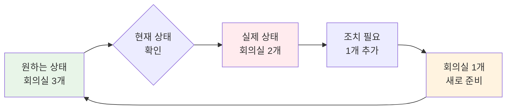
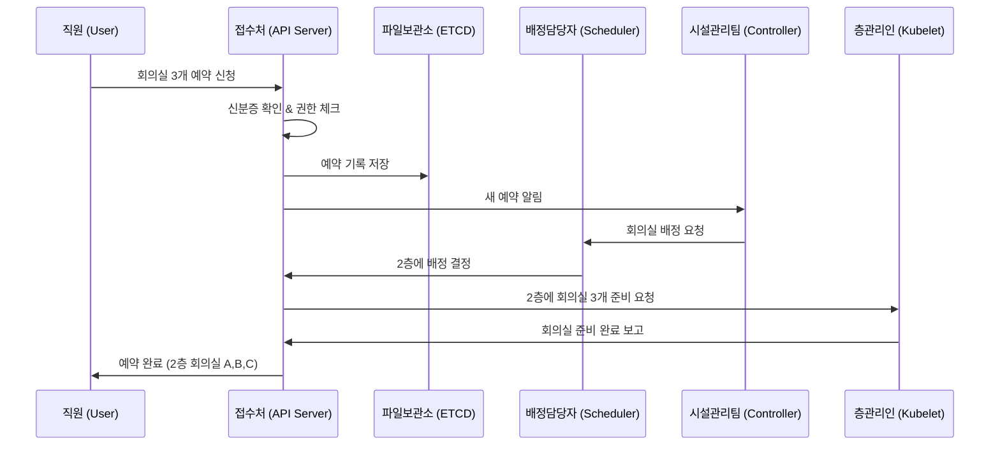

# 🏠 Kubernetes 동작 원리 - 실생활 비유로 이해하기

## 🏢 Kubernetes = 스마트 오피스 빌딩

### 🎯 전체 구조 비유

```mermaid
graph TB
    subgraph "스마트 오피스 빌딩 (Kubernetes Cluster)"
        subgraph "관리사무소 (Control Plane)"
            A[접수처<br/>(API Server)]
            B[파일 보관소<br/>(ETCD)]
            C[시설 관리팀<br/>(Controller Manager)]
            D[자리 배정 담당자<br/>(Scheduler)]
        end
        
        subgraph "사무실 층 1 (Worker Node 1)"
            E1[층 관리인<br/>(Kubelet)]
            F1[보안 담당자<br/>(Kube Proxy)]
            G1[사무용품 창고<br/>(Container Runtime)]
            H1[회의실 A<br/>(Pod)]
            I1[회의실 B<br/>(Pod)]
        end
        
        subgraph "사무실 층 2 (Worker Node 2)"
            E2[층 관리인<br/>(Kubelet)]
            F2[보안 담당자<br/>(Kube Proxy)]
            G2[사무용품 창고<br/>(Container Runtime)]
            H2[회의실 C<br/>(Pod)]
            I2[회의실 D<br/>(Pod)]
        end
    end
    
    A --> E1
    A --> E2
    B <--> A
    C --> A
    D --> A
    
    style A fill:#ff6b6b
    style B fill:#4ecdc4
    style C fill:#45b7d1
    style D fill:#96ceb4
```

### 📋 각 컴포넌트의 실생활 역할

#### 🏢 API Server = 빌딩 접수처
**"모든 요청은 접수처를 통해서만!"**

- **실생활 상황**: 회사 방문자가 회의실을 예약하려고 함
- **API Server 역할**: 
  - 신분증 확인 (Authentication)
  - 회의실 예약 권한 확인 (Authorization)  
  - 예약 양식 검토 (Admission Control)
  - 파일 보관소에 예약 기록 저장

```bash
# 실제 명령어와 비유 연결
kubectl create deployment nginx --image=nginx
# = "접수처에서 nginx 팀을 위한 사무공간 신청서 제출"
```

#### 📁 ETCD = 빌딩 파일 보관소
**"모든 기록은 안전한 금고에!"**

- **실생활 상황**: 중요한 계약서와 도면을 보관하는 금고
- **ETCD 역할**:
  - 모든 예약 기록, 직원 정보, 시설 현황 저장
  - 여러 개의 금고가 서로 동기화 (Raft 알고리즘)
  - 변경사항 발생 시 관련 부서에 즉시 알림

```bash
# ETCD 데이터 구조 비유
/registry/pods/default/nginx-xxx
# = "파일 보관소/회의실 예약/기본층/nginx팀 회의실"
```

#### 👷 Controller Manager = 시설 관리팀
**"원하는 상태를 항상 유지해드립니다!"**

- **실생활 상황**: 빌딩의 모든 시설을 관리하는 팀
- **Controller Manager 역할**:
  - 회의실 3개 필요 → 현재 2개만 있음 → 1개 더 준비
  - 에어컨 고장 감지 → 즉시 수리 요청
  - 청소 스케줄 관리 → 정해진 시간에 자동 청소



#### 📋 Scheduler = 자리 배정 담당자
**"가장 적합한 자리를 찾아드립니다!"**

- **실생활 상황**: 새 직원이나 팀을 위한 최적의 사무공간 배정
- **Scheduler 역할**:
  1. **필터링**: 조건에 맞는 층 찾기 (전력, 네트워크, 보안 등)
  2. **점수 매기기**: 각 층의 장단점 평가 (위치, 시설, 여유 공간)
  3. **최종 배정**: 가장 높은 점수의 층에 배정

```bash
# 스케줄링 과정 비유
kubectl create pod nginx
# 1. 필터링: "nginx 팀이 들어갈 수 있는 층은?"
# 2. 점수: "2층(80점), 3층(90점), 4층(70점)"  
# 3. 배정: "3층이 가장 적합하니 3층에 배정!"
```

#### 🏃 Kubelet = 각 층 관리인
**"우리 층은 제가 책임집니다!"**

- **실생활 상황**: 각 층을 담당하는 관리인
- **Kubelet 역할**:
  - 새 팀 입주 준비 (Pod 생성)
  - 매일 시설 점검 (Health Check)
  - 본사에 층 상황 보고 (Status Update)
  - 문제 발생 시 즉시 대응

#### 🛡️ Kube Proxy = 각 층 보안 담당자
**"안전하고 원활한 소통을 책임집니다!"**

- **실생활 상황**: 각 층의 보안과 내부 통신 관리
- **Kube Proxy 역할**:
  - 방문자 안내 (Traffic Routing)
  - 내부 전화 연결 (Load Balancing)
  - 보안 규칙 적용 (Network Policy)

### 🔄 전체 동작 과정 - 회의실 예약 시나리오



### 💡 핵심 원리 3가지

#### 1. **선언적 방식 (Declarative)**
```bash
# 명령적 방식 (Imperative) - 어떻게 할지 지시
"1층에 가서 회의실 A를 준비하고, 2층에 가서 회의실 B를 준비해"

# 선언적 방식 (Declarative) - 원하는 결과만 말함  
"회의실 3개가 필요해" → 시스템이 알아서 최적의 방법으로 준비
```

#### 2. **지속적 조정 (Reconciliation)**
```bash
# 원하는 상태: 회의실 3개
# 현재 상태: 회의실 2개 (1개 고장)
# → 시설관리팀이 자동으로 1개 수리 + 1개 추가 준비
```

#### 3. **이벤트 기반 (Event-Driven)**
```bash
# 파일보관소에 새 예약 기록 저장
# → 시설관리팀에 자동 알림
# → 배정담당자가 즉시 처리 시작
```

### 🎯 이해도 체크 질문

1. **비유 연결**: "API Server가 접수처라면, 왜 모든 요청이 여기를 거쳐야 할까요?"
2. **원리 이해**: "회의실 1개가 고장났을 때, 누가 어떤 순서로 이를 해결할까요?"
3. **실무 적용**: "실제 회사에서 이런 시스템이 있다면 어떤 장점이 있을까요?"

### 🔧 실습 연결

```bash
# 1. 빌딩 구축 (클러스터 생성)
kind create cluster --name smart-office

# 2. 접수처 확인 (API Server 상태)
kubectl cluster-info

# 3. 파일보관소 내용 확인 (ETCD 데이터)
kubectl get all --all-namespaces

# 4. 회의실 예약 (Pod 생성)
kubectl run meeting-room --image=nginx

# 5. 예약 현황 확인 (Pod 상태)
kubectl get pods -o wide
```

이렇게 실생활 비유를 통해 복잡한 Kubernetes 개념을 쉽게 이해할 수 있습니다! 🏢✨
