# Session 1: Kubernetes 아키텍처 & 컴포넌트 (50분)

<div align="center">

**🏗️ 클러스터 아키텍처** • **🔧 컴포넌트 역할** • **📚 공식 문서 기반**

*Kubernetes 공식 아키텍처를 완전히 이해하는 첫 번째 세션*

</div>

---

## 📚 Kubernetes 공식 문서 참조

### 🔗 핵심 참조 문서
- **[Cluster Architecture](https://kubernetes.io/docs/concepts/architecture/)** - 전체 클러스터 구조
- **[Nodes](https://kubernetes.io/docs/concepts/architecture/nodes/)** - 노드 아키텍처 상세
- **[Control Plane Components](https://kubernetes.io/docs/concepts/overview/components/#control-plane-components)** - 컨트롤 플레인 컴포넌트
- **[Node Components](https://kubernetes.io/docs/concepts/overview/components/#node-components)** - 노드 컴포넌트
- **[Container Runtime](https://kubernetes.io/docs/setup/production-environment/container-runtimes/)** - 컨테이너 런타임 설정

---

## 🎯 필수 요소
- **Cluster Architecture 완전 이해**
- **Master-Worker 노드 역할 분담**
- **Docker vs ContainerD 실무 차이점**
- **Container Runtime 진화 과정**

## 🔍 핵심 설명

### Kubernetes 클러스터 구조

```mermaid
graph TB
    subgraph "Control Plane (Master Node)"
        A[API Server<br/>모든 요청의 관문]
        B[ETCD<br/>클러스터 상태 저장소]
        C[Controller Manager<br/>상태 관리자]
        D[Scheduler<br/>Pod 배치 결정자]
    end
    
    subgraph "Worker Node 1"
        E1[Kubelet<br/>노드 에이전트]
        F1[Kube Proxy<br/>네트워크 프록시]
        G1[Container Runtime<br/>실제 컨테이너 실행]
        H1[Pod 1]
        I1[Pod 2]
    end
    
    subgraph "Worker Node 2"
        E2[Kubelet<br/>노드 에이전트]
        F2[Kube Proxy<br/>네트워크 프록시]
        G2[Container Runtime<br/>실제 컨테이너 실행]
        H2[Pod 3]
        I2[Pod 4]
    end
    
    A --> E1
    A --> E2
    B <--> A
    C --> A
    D --> A
    
    E1 --> G1
    G1 --> H1
    G1 --> I1
    
    E2 --> G2
    G2 --> H2
    G2 --> I2
    
    style A fill:#ff6b6b
    style B fill:#4ecdc4
    style C fill:#45b7d1
    style D fill:#96ceb4
    style E1,E2 fill:#feca57
    style F1,F2 fill:#ff9ff3
    style G1,G2 fill:#54a0ff
```



### 동작 원리 상세

**1. 사용자 요청 처리 흐름**:


**2. 컴포넌트별 상세 역할**:

#### API Server - 클러스터의 관문
- **RESTful API 제공**: 모든 클러스터 리소스에 대한 CRUD 작업
- **인증 및 인가**: 사용자 신원 확인 및 권한 검증
- **Admission Control**: 요청 검증 및 변형
- **ETCD와의 유일한 통신 창구**: 다른 컴포넌트는 직접 ETCD 접근 불가

#### ETCD - 분산 데이터 저장소
- **Raft 알고리즘**: 분산 합의를 통한 데이터 일관성 보장
- **Key-Value 저장**: 모든 클러스터 상태를 JSON 형태로 저장
- **Watch 기능**: 데이터 변경 시 실시간 알림
- **백업 및 복원**: 클러스터 전체 상태 백업 가능

#### Controller Manager - 자동화의 핵심
- **Reconciliation Loop**: 현재 상태를 원하는 상태로 지속적 조정
- **40개 이상의 컨트롤러**: Deployment, ReplicaSet, Service 등 각각의 컨트롤러
- **이벤트 기반 동작**: API Server의 변경 사항을 Watch하여 반응

#### Scheduler - 최적 배치 알고리즘
- **Filtering Phase**: 조건에 맞지 않는 노드 제외
- **Scoring Phase**: 남은 노드들에 점수 부여
- **Binding**: 최고 점수 노드에 Pod 할당

### Container Runtime 진화 과정

```mermaid
timeline
    title Container Runtime 진화
    
    section Docker 시대
        2013-2019 : Docker Engine
                  : 모든 기능이 하나의 데몬에 통합
                  : 무겁고 복잡한 구조
    
    section CRI 도입
        2016     : Container Runtime Interface
                 : 런타임 추상화 계층 도입
                 : 다양한 런타임 지원 가능
    
    section containerd 부상
        2017-2020 : containerd 독립
                  : Docker에서 분리된 경량 런타임
                  : CNCF 졸업 프로젝트
    
    section Docker 지원 중단
        2020-2022 : Dockershim 제거 예고
                  : Kubernetes 1.24에서 완전 제거
                  : containerd, CRI-O 권장
```



### Docker vs ContainerD 실무 비교

| 구분 | Docker | ContainerD |
|------|--------|------------|
| **아키텍처** | 모놀리식 (무거움) | 모듈형 (경량) |
| **메모리 사용량** | ~200MB | ~50MB |
| **시작 시간** | 느림 | 빠름 |
| **보안** | 루트 권한 필요 | 비특권 실행 가능 |
| **Kubernetes 지원** | Dockershim 필요 | 네이티브 지원 |
| **이미지 빌드** | 내장 | 별도 도구 필요 |
| **디버깅** | 풍부한 도구 | 제한적 |

### 사용 예제

#### 1. 클러스터 상태 확인
```bash
# 클러스터 정보 확인
kubectl cluster-info

# 노드 상태 확인
kubectl get nodes -o wide

# 시스템 Pod 확인
kubectl get pods -n kube-system

# 컴포넌트 상태 확인
kubectl get componentstatuses
```

#### 2. API Server 직접 호출
```bash
# API Server 주소 확인
kubectl config view --minify -o jsonpath='{.clusters[0].cluster.server}'

# 토큰 획득
TOKEN=$(kubectl get secret -n kube-system \
  $(kubectl get serviceaccount default -n kube-system -o jsonpath='{.secrets[0].name}') \
  -o jsonpath='{.data.token}' | base64 -d)

# 직접 API 호출
curl -k -H "Authorization: Bearer $TOKEN" \
  https://kubernetes-api-server:6443/api/v1/namespaces/default/pods
```

#### 3. ETCD 직접 조회
```bash
# ETCD Pod 접속
kubectl exec -it etcd-master -n kube-system -- sh

# 모든 키 조회
ETCDCTL_API=3 etcdctl get / --prefix --keys-only

# 특정 네임스페이스의 Pod 조회
ETCDCTL_API=3 etcdctl get /registry/pods/default/ --prefix
```

## 🎉 Fun Facts & 기업 사례

### 기술적 재미
- **K8s 이름의 비밀**: Kubernetes = K + 8글자 + s, 그리스어로 "조타수"를 의미
- **Google의 15년 노하우**: Borg 시스템에서 15년간 수십억 개 컨테이너 운영 경험 반영
- **매주 1,000개 컨테이너**: Google이 현재도 매주 20억 개 이상의 컨테이너 실행
- **Docker의 몰락**: Kubernetes 1.24부터 Docker 지원 완전 중단

### Netflix 사례
- **문제 상황**: 수천 개의 마이크로서비스를 효율적으로 관리해야 하는 상황
- **해결 방법**: Kubernetes 도입으로 서비스 배포 및 관리 자동화
- **결과**: 배포 시간 90% 단축, 인프라 비용 40% 절감
- **교훈**: 컨테이너 오케스트레이션의 중요성과 자동화의 힘

### Spotify 사례
- **문제 상황**: 개발팀별로 다른 배포 방식으로 인한 운영 복잡성
- **해결 방법**: Kubernetes 기반 통합 플랫폼 구축
- **결과**: 개발자 생산성 300% 향상, 배포 실패율 95% 감소
- **교훈**: 표준화된 플랫폼의 중요성

### Airbnb 사례
- **문제 상황**: 급격한 성장으로 인한 인프라 확장성 문제
- **해결 방법**: Kubernetes 기반 멀티 클라우드 전략
- **결과**: 글로벌 서비스 안정성 99.99% 달성
- **교훈**: 클라우드 네이티브 아키텍처의 확장성

### 업계 통계
- **채택률**: Fortune 500 기업의 83%가 Kubernetes 사용 (2024년 기준)
- **성장률**: Kubernetes 관련 일자리 연평균 67% 증가
- **비용 절감**: 평균 23% 인프라 비용 절감 효과
- **배포 속도**: 기존 대비 평균 5배 빠른 배포 속도

---

## 📖 추가 학습 자료

### 🔗 Kubernetes 공식 문서
- **[Kubernetes Documentation](https://kubernetes.io/docs/home/)** - 전체 문서 홈
- **[Concepts](https://kubernetes.io/docs/concepts/)** - 핵심 개념 설명
- **[Tutorials](https://kubernetes.io/docs/tutorials/)** - 단계별 튜토리얼
- **[Reference](https://kubernetes.io/docs/reference/)** - API 및 CLI 레퍼런스

### 📚 심화 학습
- **[Kubernetes The Hard Way](https://github.com/kelseyhightower/kubernetes-the-hard-way)** - 수동 클러스터 구축
- **[CNCF Landscape](https://landscape.cncf.io/)** - 클라우드 네이티브 생태계
- **[Kubernetes Blog](https://kubernetes.io/blog/)** - 최신 소식 및 기술 블로그

### Google 내부 데이터
- **Borg 경험**: 15년간 수십억 개의 컨테이너 운영 경험이 Kubernetes 설계에 반영
- **스케일**: 단일 클러스터에서 최대 15,000개 노드, 300,000개 Pod 운영 가능
- **효율성**: 리소스 활용률 평균 70% 이상 달성 (기존 VM 대비 2배)
- **안정성**: 99.99% 가용성으로 연간 다운타임 52분 이하

## 💡 실무 팁

### 클러스터 설계 베스트 프랙티스
1. **고가용성**: 마스터 노드 최소 3개로 홀수 구성
2. **리소스 분리**: 시스템 Pod와 애플리케이션 Pod 분리
3. **네트워크 설계**: Pod CIDR과 Service CIDR 충돌 방지
4. **보안 강화**: RBAC, Network Policy, Pod Security Standards 적용

### 흔한 실수와 해결책
- **실수**: 단일 마스터 노드로 클러스터 구성
- **해결**: HA 구성으로 단일 장애점 제거
- **실수**: ETCD 백업 미실시
- **해결**: 정기적인 ETCD 백업 자동화 구성
- **실수**: 리소스 제한 미설정
- **해결**: 모든 Pod에 적절한 리소스 제한 설정

### 모니터링 포인트
- **API Server 응답 시간**: 평균 100ms 이하 유지
- **ETCD 성능**: 디스크 I/O 지연시간 10ms 이하
- **노드 리소스**: CPU/Memory 사용률 80% 이하
- **네트워크 지연**: Pod 간 통신 지연 5ms 이하