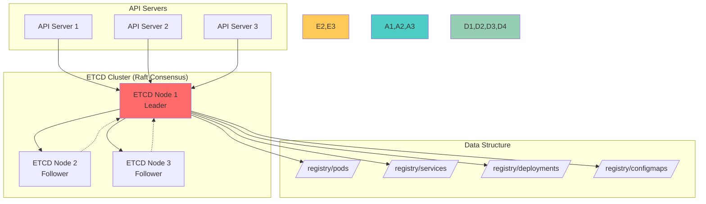
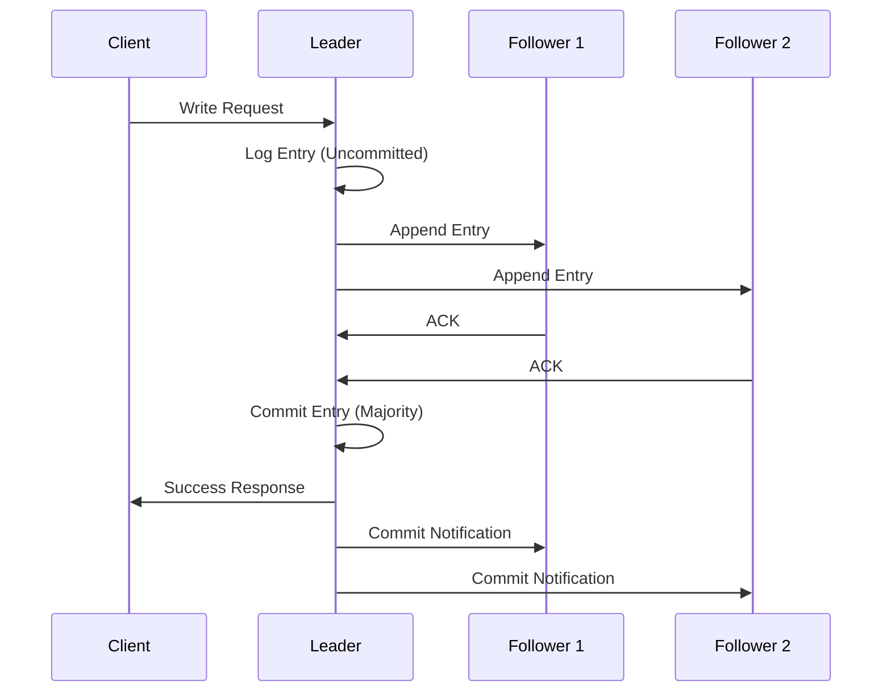
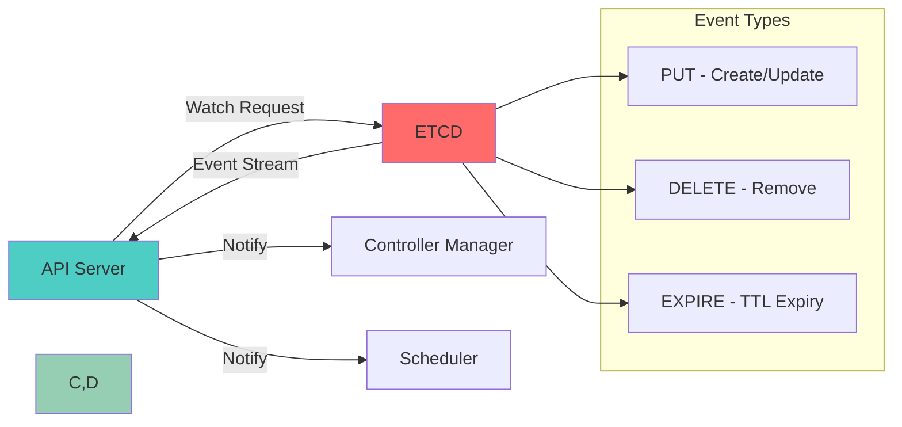
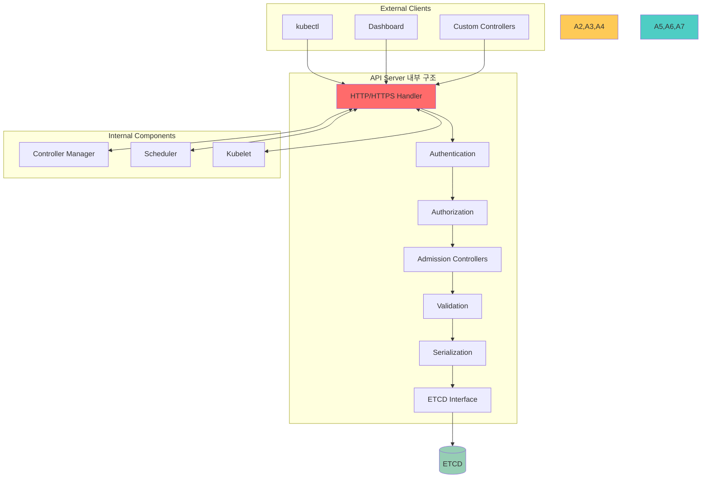
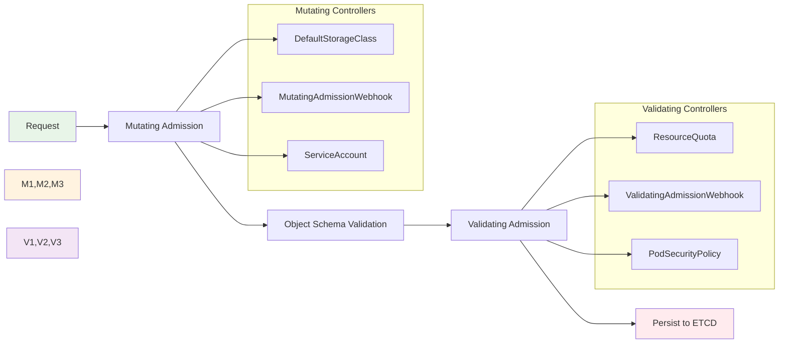
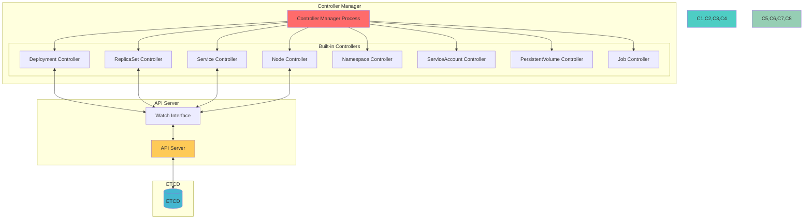
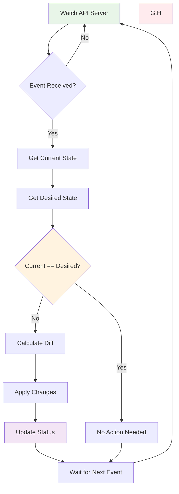
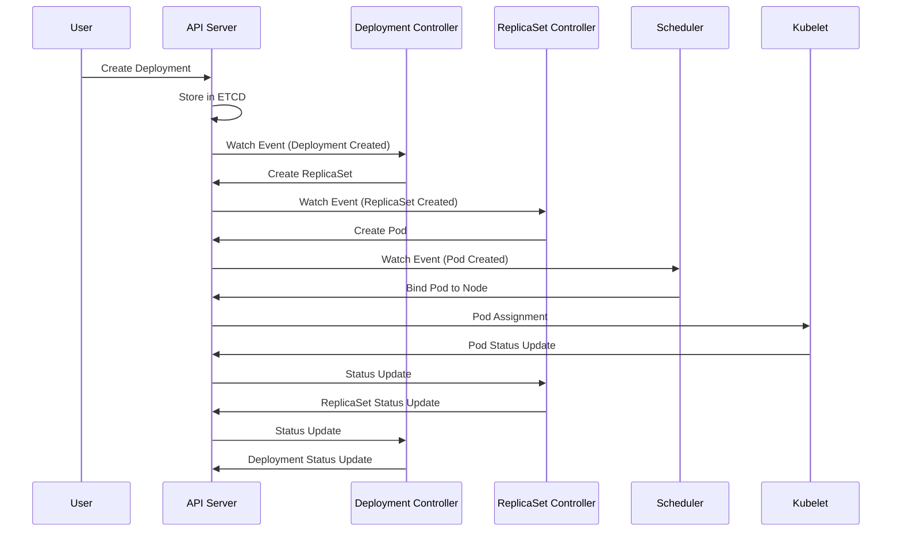
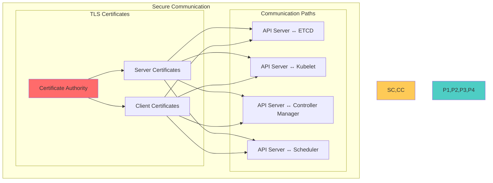

# Session 2: 핵심 컴포넌트 심화 (50분)

## 🎯 필수 요소
- **ETCD 분산 저장소 원리**
- **API Server RESTful 설계**
- **Controller Manager 루프 메커니즘**
- **각 컴포넌트 간 통신 방식**

## 🔍 핵심 설명

### ETCD - 클러스터의 뇌



#### ETCD 동작 원리 상세

**1. Raft 합의 알고리즘**:


**2. 데이터 저장 구조**:
```bash
# ETCD 키 구조 예시
/registry/
├── pods/
│   ├── default/
│   │   ├── nginx-deployment-abc123
│   │   └── redis-cache-def456
│   └── kube-system/
│       ├── coredns-789xyz
│       └── kube-proxy-ghi012
├── services/
│   ├── default/
│   │   └── kubernetes
│   └── kube-system/
│       └── kube-dns
└── configmaps/
    ├── default/
    └── kube-system/
        └── kubeadm-config
```

**3. Watch 메커니즘**:


### API Server - 모든 것의 중심



#### API Server 요청 처리 과정

**1. 인증 (Authentication)**:
```yaml
# 지원하는 인증 방식
authentication:
  - x509_client_certs    # 클라이언트 인증서
  - bearer_tokens        # Bearer 토큰
  - basic_auth          # 기본 인증 (deprecated)
  - service_accounts    # 서비스 계정
  - oidc               # OpenID Connect
  - webhook            # 외부 인증 서비스
```

**2. 인가 (Authorization)**:
```yaml
# 인가 모드 (순서대로 확인)
authorization:
  - node        # 노드 권한 (kubelet)
  - rbac        # 역할 기반 접근 제어
  - abac        # 속성 기반 접근 제어
  - webhook     # 외부 인가 서비스
  - always_allow # 모든 요청 허용 (개발용)
```

**3. Admission Controllers**:


### Controller Manager - 자동화의 핵심



#### Reconciliation Loop (조정 루프)



**Controller 동작 예시 - Deployment Controller**:


### 컴포넌트 간 통신 방식



### 사용 예제

#### 1. ETCD 직접 조작
```bash
# ETCD 클러스터 상태 확인
kubectl exec -it etcd-master -n kube-system -- \
  etcdctl --endpoints=https://127.0.0.1:2379 \
  --cacert=/etc/kubernetes/pki/etcd/ca.crt \
  --cert=/etc/kubernetes/pki/etcd/server.crt \
  --key=/etc/kubernetes/pki/etcd/server.key \
  endpoint health

# 모든 키 조회
kubectl exec -it etcd-master -n kube-system -- \
  etcdctl --endpoints=https://127.0.0.1:2379 \
  --cacert=/etc/kubernetes/pki/etcd/ca.crt \
  --cert=/etc/kubernetes/pki/etcd/server.crt \
  --key=/etc/kubernetes/pki/etcd/server.key \
  get / --prefix --keys-only

# 특정 Pod 정보 조회
kubectl exec -it etcd-master -n kube-system -- \
  etcdctl --endpoints=https://127.0.0.1:2379 \
  --cacert=/etc/kubernetes/pki/etcd/ca.crt \
  --cert=/etc/kubernetes/pki/etcd/server.crt \
  --key=/etc/kubernetes/pki/etcd/server.key \
  get /registry/pods/default/nginx-pod
```

#### 2. API Server 메트릭 확인
```bash
# API Server 메트릭 엔드포인트 접근
kubectl get --raw /metrics | grep apiserver

# 요청 처리 시간 확인
kubectl get --raw /metrics | grep apiserver_request_duration_seconds

# 인증/인가 실패 확인
kubectl get --raw /metrics | grep apiserver_audit_total
```

#### 3. Controller Manager 상태 확인
```bash
# Controller Manager 로그 확인
kubectl logs -n kube-system kube-controller-manager-master

# 특정 컨트롤러 로그 필터링
kubectl logs -n kube-system kube-controller-manager-master | grep deployment

# Controller Manager 메트릭 확인
kubectl get --raw /metrics | grep controller_manager
```

## 🎉 Fun Facts & 기업 사례

### 기술적 재미
- **ETCD 이름**: "distributed reliable key-value store"의 줄임말
- **API Server 성능**: 초당 수천 개의 요청을 처리할 수 있음
- **Controller 개수**: 실제로는 40개 이상의 컨트롤러가 하나의 프로세스로 실행
- **Watch의 마법**: 폴링 없이 실시간 이벤트 감지로 효율성 극대화

### Uber 사례
- **문제 상황**: 수천 개의 마이크로서비스 배포 시 API Server 병목 현상
- **해결 방법**: API Server 다중화 및 로드밸런싱 구성
- **결과**: API 응답 시간 80% 개선, 동시 배포 처리량 5배 증가
- **교훈**: 고가용성 설계의 중요성과 병목점 사전 식별

### Pinterest 사례
- **문제 상황**: ETCD 클러스터 장애로 인한 전체 서비스 중단
- **해결 방법**: ETCD 백업 자동화 및 다중 리전 복제 구성
- **결과**: 장애 복구 시간 4시간 → 15분으로 단축
- **교훈**: 데이터 백업과 재해 복구 계획의 중요성

### Shopify 사례
- **문제 상황**: Black Friday 트래픽 급증으로 Controller Manager 과부하
- **해결 방법**: Controller 튜닝 및 리소스 최적화
- **결과**: 99.99% 가용성 달성, 매출 손실 방지
- **교훈**: 대용량 트래픽 대비 성능 튜닝의 중요성

### 업계 통계
- **ETCD 성능**: 초당 10,000회 쓰기, 100,000회 읽기 처리 가능
- **API Server 확장성**: 단일 인스턴스로 5,000개 노드 지원
- **Controller 효율성**: 평균 100ms 이내 상태 조정 완료
- **장애 복구**: 평균 30초 이내 자동 복구

### CoreOS 개발 비화
- **ETCD 탄생**: CoreOS가 분산 설정 관리를 위해 개발
- **Raft 선택**: Paxos 대신 이해하기 쉬운 Raft 알고리즘 채택
- **Kubernetes 채택**: Google이 ETCD의 안정성을 인정하여 채택
- **CNCF 기증**: 2018년 CNCF에 기증되어 중립적 관리

## 💡 실무 팁

### ETCD 운영 베스트 프랙티스
1. **백업 자동화**: 매일 자동 백업 및 원격 저장소 보관
2. **모니터링**: 디스크 I/O, 네트워크 지연시간 지속 모니터링
3. **용량 관리**: 정기적인 압축(compaction) 수행
4. **보안**: TLS 인증서 정기 갱신 및 접근 제어

### API Server 성능 최적화
- **캐싱**: 자주 조회되는 리소스 캐싱 활용
- **페이징**: 대량 데이터 조회 시 페이징 사용
- **필드 선택**: 필요한 필드만 조회하여 네트워크 부하 감소
- **압축**: gzip 압축으로 전송 데이터 크기 최소화

### Controller 튜닝 포인트
- **동시성**: Worker 수 조정으로 처리량 최적화
- **재시도**: 지수 백오프로 재시도 간격 조정
- **리더 선출**: 다중 인스턴스 실행 시 리더 선출 설정
- **메모리 관리**: 캐시 크기 조정으로 메모리 사용량 최적화