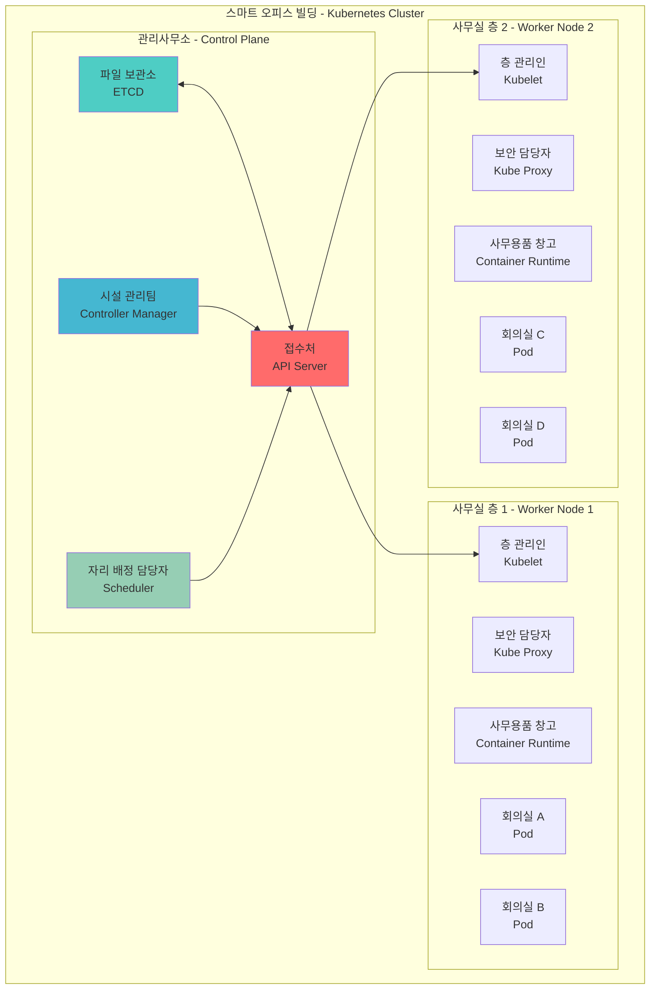
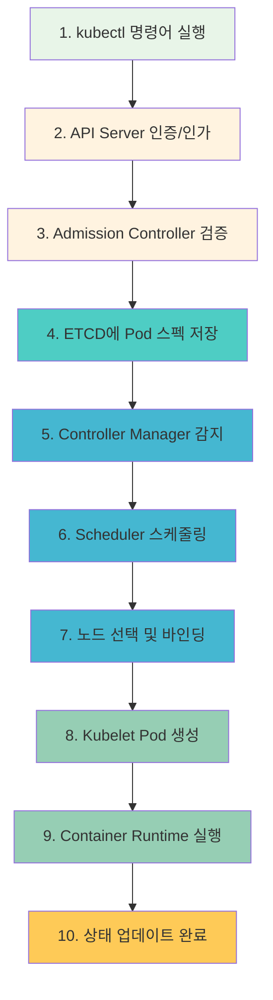
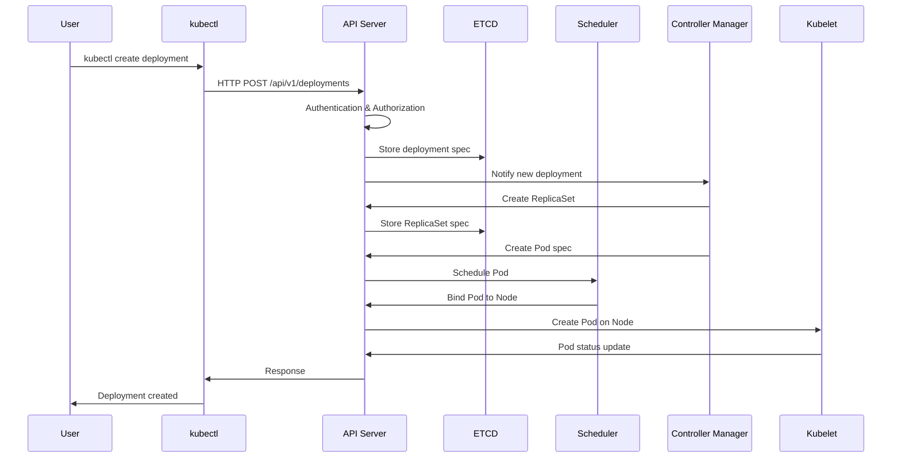
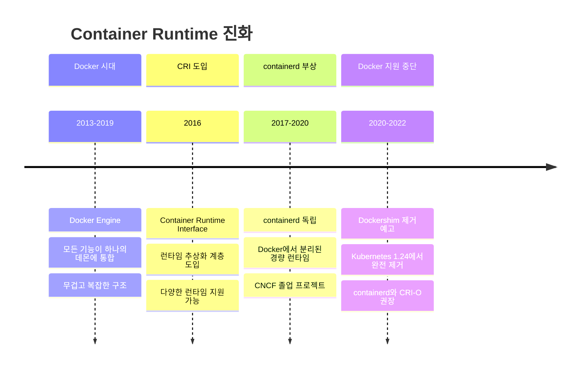

# Session 1: Kubernetes 아키텍처 & 동작 원리 완전 정복 (50분)

<div align="center">

**🏗️ 클러스터 아키텍처** • **🔄 동작 원리** • **🏠 실생활 비유** • **🔬 체험 실습**

*Kubernetes의 내부 구조와 동작 메커니즘을 완전히 이해하는 핵심 세션*

</div>

---

## 🎯 세션 목표

### 📚 학습 목표
- **아키텍처 이해**: 클러스터 구조와 컴포넌트 역할 완전 파악
- **동작 원리 체득**: Pod 생성부터 실행까지 10단계 과정 이해
- **실무 적용**: 장애 진단과 성능 최적화 능력 습득

### 🤔 왜 필요한가? (5분)
**현실 문제**: "Kubernetes가 복잡해 보이는데, 내부에서 실제로 무슨 일이 일어나는 거지?"

**학습 후 변화**:
- ❌ **Before**: "kubectl run 하면 뭔가 Pod가 생긴다..."
- ✅ **After**: "API Server → ETCD → Scheduler → Kubelet 순서로 정확히 동작한다!"

---

## 🏢 Part 1: Kubernetes = 스마트 오피스 빌딩 (10분)

### 🎯 전체 구조 비유



### 📋 각 컴포넌트의 실생활 역할

#### 🏢 API Server = 빌딩 접수처
**"모든 요청은 접수처를 통해서만!"**
- 신분증 확인 (Authentication)
- 회의실 예약 권한 확인 (Authorization)  
- 예약 양식 검토 (Admission Control)
- 파일 보관소에 예약 기록 저장

#### 📁 ETCD = 빌딩 파일 보관소
**"모든 기록은 안전한 금고에!"**
- 모든 예약 기록, 직원 정보, 시설 현황 저장
- 여러 개의 금고가 서로 동기화 (Raft 알고리즘)
- 변경사항 발생 시 관련 부서에 즉시 알림

#### 👷 Controller Manager = 시설 관리팀
**"원하는 상태를 항상 유지해드립니다!"**
- 회의실 3개 필요 → 현재 2개만 있음 → 1개 더 준비
- 에어컨 고장 감지 → 즉시 수리 요청
- 청소 스케줄 관리 → 정해진 시간에 자동 청소

#### 📋 Scheduler = 자리 배정 담당자
**"가장 적합한 자리를 찾아드립니다!"**
1. **필터링**: 조건에 맞는 층 찾기 (전력, 네트워크, 보안 등)
2. **점수 매기기**: 각 층의 장단점 평가 (위치, 시설, 여유 공간)
3. **최종 배정**: 가장 높은 점수의 층에 배정

---

## 🔄 Part 2: Pod 생성 과정 - 10단계 완전 분석 (15분)

### 📋 전체 과정 개요



### ⏱️ 실제 타이밍 분석

| 단계 | 소요 시간 | 주요 작업 | 빌딩 비유 |
|------|-----------|-----------|-----------|
| kubectl → API Server | 0.1초 | HTTP 요청 전송 | 접수처 방문 |
| 인증/인가/검증 | 0.2초 | 보안 검사 | 신분증 확인 |
| ETCD 저장 | 0.1초 | Raft 합의 | 파일 보관소 저장 |
| Scheduler 스케줄링 | 0.3초 | 노드 선택 | 자리 배정 |
| 이미지 다운로드 | 2-30초 | 네트워크 속도 의존 | 사무용품 준비 |
| 컨테이너 생성 | 1-3초 | 리소스 할당 | 회의실 세팅 |
| **총 소요 시간** | **3-35초** | **이미지 크기에 따라 변동** | **예약 완료** |

### 🔍 단계별 상세 동작

#### Step 1-3: 요청 처리 (0.4초)
```bash
# 실제 명령어
kubectl run nginx-pod --image=nginx:1.20 --port=80

# 내부 동작
# 1. kubeconfig에서 클러스터 정보 읽기
# 2. TLS 인증서로 API Server 연결
# 3. Bearer Token으로 사용자 인증
# 4. RBAC으로 권한 확인
# 5. Admission Controller로 요청 검증
```

#### Step 4-6: 스케줄링 (0.4초)
```bash
# ETCD 저장 구조
/registry/pods/default/nginx-pod

# Scheduler 알고리즘
# 1. Filtering: 조건에 맞는 노드 선별
# 2. Scoring: 각 노드에 0-100점 부여  
# 3. Binding: 최고 점수 노드에 할당
```

#### Step 7-10: 실행 (2-35초)
```bash
# Kubelet 동작
# 1. 이미지 다운로드: docker pull nginx:1.20
# 2. 컨테이너 생성: docker create
# 3. 네트워크 설정: CNI 플러그인 호출
# 4. 컨테이너 시작: docker start
# 5. 상태 보고: API Server에 Running 상태 전송
```

---

## 🔬 Part 3: 실시간 동작 관찰 체험 (15분)

### 🚀 체험 1: 멀티 터미널 실시간 모니터링

```bash
# 터미널 1: Pod 상태 실시간 관찰
kubectl get pods -w

# 터미널 2: 이벤트 실시간 모니터링
kubectl get events -w --sort-by='.lastTimestamp'

# 터미널 3: API Server 로그
kubectl logs -n kube-system -f $(kubectl get pods -n kube-system -l component=kube-apiserver -o name)

# 터미널 4: 실제 Pod 생성 (모든 과정 동시 관찰!)
kubectl run session1-demo --image=nginx:alpine
```

### 🔍 체험 2: ETCD 데이터 실시간 변경 관찰

```bash
# ETCD Watch 시작
ETCD_POD=$(kubectl get pods -n kube-system -l component=etcd -o jsonpath='{.items[0].metadata.name}')

kubectl exec -n kube-system $ETCD_POD -- \
  etcdctl watch /registry/pods/default/ --prefix \
  --endpoints=https://127.0.0.1:2379 \
  --cacert=/etc/kubernetes/pki/etcd/ca.crt \
  --cert=/etc/kubernetes/pki/etcd/server.crt \
  --key=/etc/kubernetes/pki/etcd/server.key &

# Pod 생성하며 ETCD 변경사항 실시간 관찰
kubectl run etcd-watch-demo --image=busybox --command -- sleep 3600
```

### 🧪 체험 3: 스케줄링 과정 직접 확인

```bash
# Scheduler 로그 모니터링
kubectl logs -n kube-system -f $(kubectl get pods -n kube-system -l component=kube-scheduler -o name) &

# 여러 Pod 동시 생성으로 스케줄링 과정 관찰
for i in {1..3}; do
  kubectl run scheduler-demo-$i --image=nginx &
done
wait

# 결과 확인: 어떤 노드에 배치되었는지 확인
kubectl get pods -o wide
```

---

## 💭 함께 생각해보기 (10분)

### 🤝 페어 토론 (5분)
**토론 주제**:
1. **비유 연결**: "API Server가 접수처라면, 왜 모든 요청이 여기를 거쳐야 할까요?"
2. **성능 분석**: "Pod 생성이 30초나 걸린다면, 어느 단계를 먼저 확인하시겠어요?"
3. **장애 상황**: "ETCD가 고장나면 어떤 일이 일어날까요?"

**페어 활동 가이드**:
- 👥 **자유 페어링**: 관심사나 경험이 비슷한 사람끼리
- 🔄 **역할 교대**: 3분씩 설명자/질문자 역할 바꾸기
- 📝 **핵심 정리**: 대화 내용 중 중요한 점 메모하기

### 🎯 전체 공유 (5분)
- **인사이트 공유**: 페어 토론에서 나온 좋은 아이디어
- **질문 수집**: 아직 이해가 어려운 부분
- **실무 연결**: "실제 회사에서 이런 지식이 어떻게 도움될까?"

### 💡 이해도 체크 질문
- ✅ "Pod 생성 과정을 빌딩 예약에 비유해서 설명할 수 있나요?"
- ✅ "kubectl 명령어 실행부터 Pod Running까지 10단계를 순서대로 말할 수 있나요?"
- ✅ "실시간 모니터링에서 관찰한 내용을 다른 사람에게 설명할 수 있나요?"

---

## 🔑 핵심 키워드

### 🆕 새로운 용어
- **Control Plane(컨트롤 플레인)**: 클러스터를 관리하는 마스터 컴포넌트들
- **API Server(API 서버)**: 모든 클러스터 통신의 중앙 허브
- **ETCD**: 분산 키-값 저장소, 클러스터 상태 보관
- **Scheduler(스케줄러)**: Pod를 적절한 노드에 배치하는 컴포넌트
- **Kubelet(큐블릿)**: 각 노드에서 Pod를 관리하는 에이전트

### 🔤 기술 용어
- **Raft Algorithm**: ETCD가 사용하는 분산 합의 알고리즘
- **Reconciliation Loop**: 현재 상태를 원하는 상태로 맞추는 제어 루프
- **Container Runtime**: 실제 컨테이너를 실행하는 소프트웨어 (containerd, CRI-O)

### 🔤 실무 용어
- **Filtering Phase**: 스케줄링 1단계, 조건에 맞지 않는 노드 제외
- **Scoring Phase**: 스케줄링 2단계, 남은 노드들에 점수 부여
- **Binding**: 스케줄링 3단계, 선택된 노드에 Pod 할당

---

## 📝 세션 마무리

### ✅ 오늘 세션 성과
- [ ] **아키텍처 이해**: 클러스터 구조를 빌딩에 비유해서 설명 가능
- [ ] **동작 원리 파악**: Pod 생성 10단계 과정 완전 이해
- [ ] **실시간 관찰**: 멀티 터미널로 내부 동작 직접 확인
- [ ] **실무 연결**: 성능 분석과 장애 진단 기초 습득

### 🎯 다음 세션 준비
- **Session 2 예고**: 각 컴포넌트의 상세 기능과 고급 설정
- **연결고리**: 오늘 배운 전체 구조에서 각 부분을 자세히 탐험
- **실습 준비**: Lab 1에서 오늘 배운 동작 원리를 직접 실습으로 확인

### 🚀 실무 팁
- **성능 최적화**: 이미지 크기 최소화로 Pod 생성 시간 단축
- **장애 진단**: API Server → ETCD → Scheduler → Kubelet 순서로 확인
- **모니터링**: 각 컴포넌트 로그를 실시간으로 관찰하는 습관

---

## 🎉 Fun Facts

- **K8s 이름의 비밀**: Kubernetes = K + 8글자 + s
- **Google의 15년 노하우**: Borg 시스템의 오픈소스 버전
- **ETCD 이름**: "distributed reliable key-value store"의 줄임말
- **스케줄링 조건**: 실제로는 100개 이상의 조건을 동시 고려
- **API Server 성능**: 초당 수천 개 요청 처리 가능
- **Kubelet 통신**: 10초마다 heartbeat를 API Server에 전송

---

<div align="center">

**🏗️ 아키텍처 마스터** • **🔄 동작 원리 완전 이해** • **🔬 실시간 체험 완료**

*이제 Kubernetes의 심장박동을 직접 느꼈습니다!*

**다음**: [Session 2 - 핵심 컴포넌트 심화](session2_core_components.md)

</div>
    
    subgraph "Worker Node 2"
        E2[Kubelet<br/>노드 에이전트]
        F2[Kube Proxy<br/>네트워크 프록시]
        G2[Container Runtime<br/>실제 컨테이너 실행]
        H2[Pod 3]
        I2[Pod 4]
    end
    
    A --> E1
    A --> E2
    B <--> A
    C --> A
    D --> A
    
    E1 --> G1
    G1 --> H1
    G1 --> I1
    
    E2 --> G2
    G2 --> H2
    G2 --> I2
    
    style A fill:#ff6b6b
    style B fill:#4ecdc4
    style C fill:#45b7d1
    style D fill:#96ceb4
    style E1 fill:#feca57
    style E2 fill:#feca57
    style F1 fill:#ff9ff3
    style F2 fill:#ff9ff3
    style G1 fill:#54a0ff
    style G2 fill:#54a0ff
```

### 동작 원리 상세

**1. 사용자 요청 처리 흐름**:


**2. 컴포넌트별 상세 역할**:

#### API Server - 클러스터의 관문
- **RESTful API 제공**: 모든 클러스터 리소스에 대한 CRUD 작업
- **인증 및 인가**: 사용자 신원 확인 및 권한 검증
- **Admission Control**: 요청 검증 및 변형
- **ETCD와의 유일한 통신 창구**: 다른 컴포넌트는 직접 ETCD 접근 불가

#### ETCD - 분산 데이터 저장소
- **Raft 알고리즘**: 분산 합의를 통한 데이터 일관성 보장
- **Key-Value 저장**: 모든 클러스터 상태를 JSON 형태로 저장
- **Watch 기능**: 데이터 변경 시 실시간 알림
- **백업 및 복원**: 클러스터 전체 상태 백업 가능

#### Controller Manager - 자동화의 핵심
- **Reconciliation Loop**: 현재 상태를 원하는 상태로 지속적 조정
- **40개 이상의 컨트롤러**: Deployment, ReplicaSet, Service 등 각각의 컨트롤러
- **이벤트 기반 동작**: API Server의 변경 사항을 Watch하여 반응

#### Scheduler - 최적 배치 알고리즘
- **Filtering Phase**: 조건에 맞지 않는 노드 제외
- **Scoring Phase**: 남은 노드들에 점수 부여
- **Binding**: 최고 점수 노드에 Pod 할당

### Container Runtime 진화 과정



### Docker vs ContainerD 실무 비교

| 구분 | Docker | ContainerD |
|------|--------|------------|
| **아키텍처** | 모놀리식 (무거움) | 모듈형 (경량) |
| **메모리 사용량** | ~200MB | ~50MB |
| **시작 시간** | 느림 | 빠름 |
| **보안** | 루트 권한 필요 | 비특권 실행 가능 |
| **Kubernetes 지원** | Dockershim 필요 | 네이티브 지원 |
| **이미지 빌드** | 내장 | 별도 도구 필요 |
| **디버깅** | 풍부한 도구 | 제한적 |

### 사용 예제

#### 1. 클러스터 상태 확인
```bash
# 클러스터 정보 확인
kubectl cluster-info

# 노드 상태 확인
kubectl get nodes -o wide

# 시스템 Pod 확인
kubectl get pods -n kube-system

# 컴포넌트 상태 확인
kubectl get componentstatuses
```

#### 2. API Server 직접 호출
```bash
# API Server 주소 확인
kubectl config view --minify -o jsonpath='{.clusters[0].cluster.server}'

# 토큰 획득
TOKEN=$(kubectl get secret -n kube-system \
  $(kubectl get serviceaccount default -n kube-system -o jsonpath='{.secrets[0].name}') \
  -o jsonpath='{.data.token}' | base64 -d)

# 직접 API 호출
curl -k -H "Authorization: Bearer $TOKEN" \
  https://kubernetes-api-server:6443/api/v1/namespaces/default/pods
```

#### 3. ETCD 직접 조회
```bash
# ETCD Pod 접속
kubectl exec -it etcd-master -n kube-system -- sh

# 모든 키 조회
ETCDCTL_API=3 etcdctl get / --prefix --keys-only

# 특정 네임스페이스의 Pod 조회
ETCDCTL_API=3 etcdctl get /registry/pods/default/ --prefix
```

## 🎉 Fun Facts & 기업 사례

### 기술적 재미
- **K8s 이름의 비밀**: Kubernetes = K + 8글자 + s, 그리스어로 "조타수"를 의미
- **Google의 15년 노하우**: Borg 시스템에서 15년간 수십억 개 컨테이너 운영 경험 반영
- **매주 1,000개 컨테이너**: Google이 현재도 매주 20억 개 이상의 컨테이너 실행
- **Docker의 몰락**: Kubernetes 1.24부터 Docker 지원 완전 중단

### Netflix 사례
- **문제 상황**: 수천 개의 마이크로서비스를 효율적으로 관리해야 하는 상황
- **해결 방법**: Kubernetes 도입으로 서비스 배포 및 관리 자동화
- **결과**: 배포 시간 90% 단축, 인프라 비용 40% 절감
- **교훈**: 컨테이너 오케스트레이션의 중요성과 자동화의 힘

### Spotify 사례
- **문제 상황**: 개발팀별로 다른 배포 방식으로 인한 운영 복잡성
- **해결 방법**: Kubernetes 기반 통합 플랫폼 구축
- **결과**: 개발자 생산성 300% 향상, 배포 실패율 95% 감소
- **교훈**: 표준화된 플랫폼의 중요성

### Airbnb 사례
- **문제 상황**: 급격한 성장으로 인한 인프라 확장성 문제
- **해결 방법**: Kubernetes 기반 멀티 클라우드 전략
- **결과**: 글로벌 서비스 안정성 99.99% 달성
- **교훈**: 클라우드 네이티브 아키텍처의 확장성

### 업계 통계
- **채택률**: Fortune 500 기업의 83%가 Kubernetes 사용 (2024년 기준)
- **성장률**: Kubernetes 관련 일자리 연평균 67% 증가
- **비용 절감**: 평균 23% 인프라 비용 절감 효과
- **배포 속도**: 기존 대비 평균 5배 빠른 배포 속도

---

## 📖 추가 학습 자료

### 🔗 Kubernetes 공식 문서
- **[Kubernetes Documentation](https://kubernetes.io/docs/home/)** - 전체 문서 홈
- **[Concepts](https://kubernetes.io/docs/concepts/)** - 핵심 개념 설명
- **[Tutorials](https://kubernetes.io/docs/tutorials/)** - 단계별 튜토리얼
- **[Reference](https://kubernetes.io/docs/reference/)** - API 및 CLI 레퍼런스

### 📚 심화 학습
- **[Kubernetes The Hard Way](https://github.com/kelseyhightower/kubernetes-the-hard-way)** - 수동 클러스터 구축
- **[CNCF Landscape](https://landscape.cncf.io/)** - 클라우드 네이티브 생태계
- **[Kubernetes Blog](https://kubernetes.io/blog/)** - 최신 소식 및 기술 블로그

### Google 내부 데이터
- **Borg 경험**: 15년간 수십억 개의 컨테이너 운영 경험이 Kubernetes 설계에 반영
- **스케일**: 단일 클러스터에서 최대 15,000개 노드, 300,000개 Pod 운영 가능
- **효율성**: 리소스 활용률 평균 70% 이상 달성 (기존 VM 대비 2배)
- **안정성**: 99.99% 가용성으로 연간 다운타임 52분 이하

## 💡 실무 팁

### 클러스터 설계 베스트 프랙티스
1. **고가용성**: 마스터 노드 최소 3개로 홀수 구성
2. **리소스 분리**: 시스템 Pod와 애플리케이션 Pod 분리
3. **네트워크 설계**: Pod CIDR과 Service CIDR 충돌 방지
4. **보안 강화**: RBAC, Network Policy, Pod Security Standards 적용

### 흔한 실수와 해결책
- **실수**: 단일 마스터 노드로 클러스터 구성
- **해결**: HA 구성으로 단일 장애점 제거
- **실수**: ETCD 백업 미실시
- **해결**: 정기적인 ETCD 백업 자동화 구성
- **실수**: 리소스 제한 미설정
- **해결**: 모든 Pod에 적절한 리소스 제한 설정

### 모니터링 포인트
- **API Server 응답 시간**: 평균 100ms 이하 유지
- **ETCD 성능**: 디스크 I/O 지연시간 10ms 이하
- **노드 리소스**: CPU/Memory 사용률 80% 이하
- **네트워크 지연**: Pod 간 통신 지연 5ms 이하