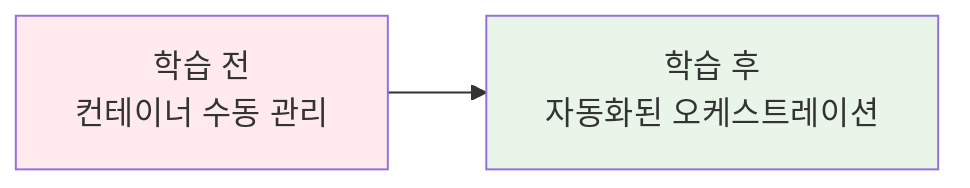
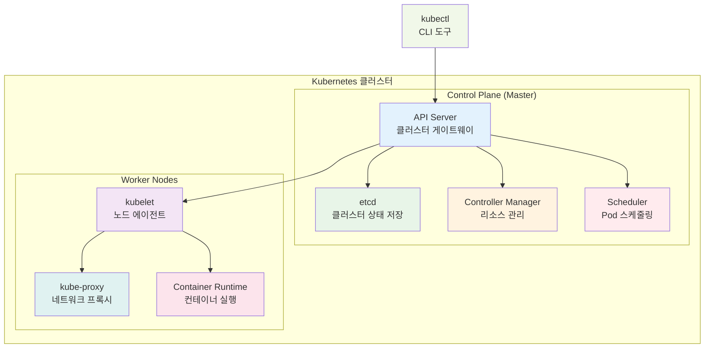
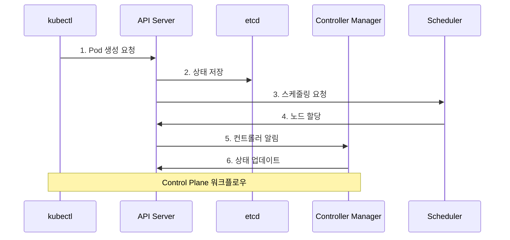

# Week 3 Day 1 Session 1: Kubernetes 기본 구성요소

**☸️ Kubernetes 아키텍처** • **🏗️ Control Plane** • **⚙️ Worker Node**
*컨테이너 오케스트레이션의 핵심 구조 이해*

---

## 🕘 세션 정보
**시간**: 09:00-09:50 (50분)
**목표**: Kubernetes 아키텍처와 구성요소 완전 이해
**방식**: 협업 중심 학습 + 시각적 설명

## 🎯 세션 목표
### 📚 학습 목표
- **이해 목표**: Kubernetes 전체 아키텍처와 각 구성요소의 역할 완전 이해
- **적용 목표**: 실습에서 각 구성요소를 식별하고 상태를 확인할 수 있는 능력
- **협업 목표**: 페어와 함께 복잡한 아키텍처를 단순하게 설명하는 능력

### 🤔 왜 필요한가? (5분)

**현실 문제 상황**:
- 💼 **실무 시나리오**: 수백 개의 컨테이너를 수동으로 관리하는 어려움
- 🏠 **일상 비유**: 아파트 관리사무소처럼 여러 세대(컨테이너)를 체계적으로 관리
- 📊 **시장 동향**: 90% 이상의 기업이 컨테이너 오케스트레이션 도구 사용

**학습 전후 비교**:

---

## 📖 핵심 개념 (35분)

### 🔍 개념 1: Kubernetes 아키텍처 개요 (12분)
> **정의**: 컨테이너화된 애플리케이션의 배포, 스케일링, 관리를 자동화하는 오픈소스 플랫폼

**핵심 원리**:
- **선언적 구성**: 원하는 상태를 선언하면 Kubernetes가 자동으로 유지
- **자동 복구**: 장애 발생 시 자동으로 복구
- **수평 확장**: 트래픽 증가 시 자동으로 Pod 수 조정

**시각적 이해**:

### 🔍 개념 2: Control Plane 구성요소 (12분)
> **정의**: 클러스터의 두뇌 역할을 하는 관리 컴포넌트들

**주요 구성요소**:
- **API Server**: 모든 요청의 진입점, RESTful API 제공
- **etcd**: 클러스터 상태 정보를 저장하는 분산 키-값 저장소
- **Controller Manager**: 다양한 컨트롤러들을 실행하여 원하는 상태 유지
- **Scheduler**: Pod를 적절한 노드에 배치하는 스케줄링 담당

**Control Plane 상호작용**:

### 🔍 개념 3: Worker Node 구성요소 (11분)
> **정의**: 실제 애플리케이션 Pod가 실행되는 작업 노드

**주요 구성요소**:
- **kubelet**: 각 노드의 에이전트, Pod 생명주기 관리
- **kube-proxy**: 네트워크 프록시, Service 추상화 구현
- **Container Runtime**: Docker, containerd 등 컨테이너 실행 엔진

**Worker Node 역할 비교**:
| 구성요소 | 주요 역할 | 관리 대상 | 통신 방식 |
|----------|-----------|-----------|-----------|
| **kubelet** | Pod 생명주기 관리 | Pod, Container | API Server와 통신 |
| **kube-proxy** | 네트워크 프록시 | Service, Endpoint | iptables/IPVS 규칙 |
| **Container Runtime** | 컨테이너 실행 | 컨테이너 이미지 | CRI 인터페이스 |

**🔑 핵심 키워드 정리**:
- **Control Plane**: 클러스터 관리 및 제어 영역
- **Worker Node**: 실제 워크로드가 실행되는 노드
- **API Server**: 모든 클러스터 통신의 중앙 허브
- **etcd**: 클러스터 상태의 단일 진실 소스
- **kubelet**: 노드 수준의 Pod 관리자

---

## 💭 함께 생각해보기 (10분)

### 🤝 페어 토론 (5분)
**토론 주제**:
1. **개념 적용**: "Kubernetes가 없다면 컨테이너 관리에서 어떤 문제가 발생할까요?"
2. **문제 해결**: "Control Plane과 Worker Node가 분리된 이유는 무엇일까요?"
3. **경험 공유**: "Docker와 Kubernetes의 차이점을 어떻게 설명하시겠어요?"

**페어 활동 가이드**:
- 👥 **자유 페어링**: 관심사나 이해도가 비슷한 사람끼리
- 🔄 **역할 교대**: 5분씩 설명자/질문자 역할 바꾸기
- 📝 **핵심 정리**: 대화 내용 중 중요한 점 메모하기

### 🎯 전체 공유 (5분)
- **인사이트 공유**: 페어 토론에서 나온 좋은 아이디어
- **질문 수집**: 아직 이해가 어려운 부분
- **다음 연결**: Session 2 설치 방법과의 연결고리 확인

**💡 이해도 체크 질문**:
- ✅ "Control Plane의 4가지 구성요소를 설명할 수 있나요?"
- ✅ "kubelet과 kube-proxy의 차이점을 아시나요?"
- ✅ "API Server가 왜 모든 통신의 중심인지 이해하셨나요?"

---

## 📝 세션 마무리

### ✅ 오늘 세션 성과
- Kubernetes 전체 아키텍처 구조 이해
- Control Plane과 Worker Node 역할 구분
- 각 구성요소의 상호작용 방식 파악

### 🎯 다음 세션 준비
- **Session 2 연결**: 다양한 설치 방법에서 이 구성요소들이 어떻게 배치되는지
- **실습 준비**: kubeadm 설치 시 각 구성요소 확인 방법
- **키워드 복습**: API Server, etcd, kubelet, kube-proxy

---

**🎉 Session 1 완료!**

*Kubernetes 아키텍처의 기초를 완전히 이해했습니다*

