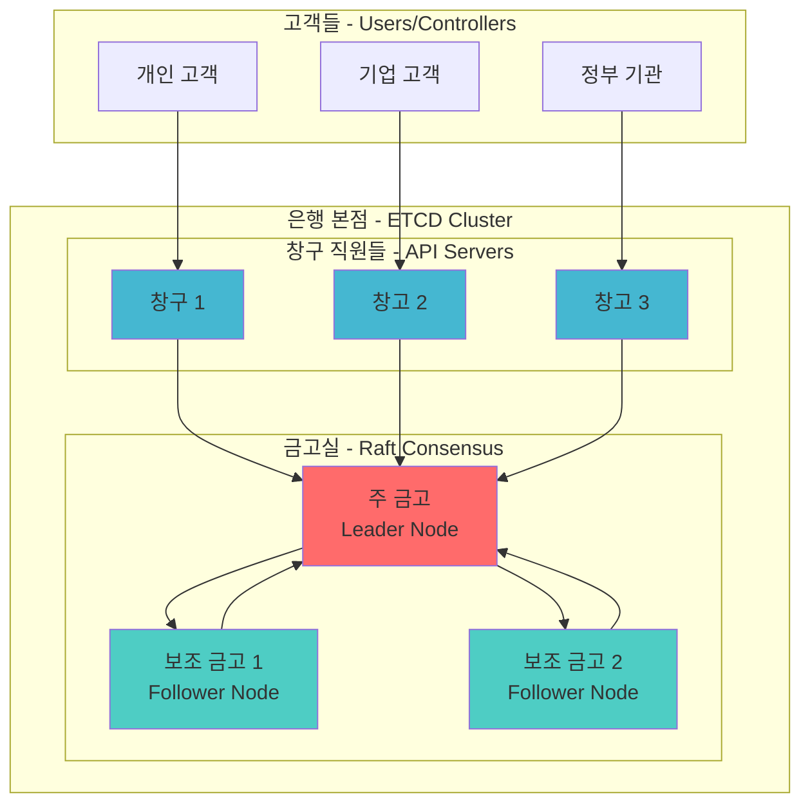
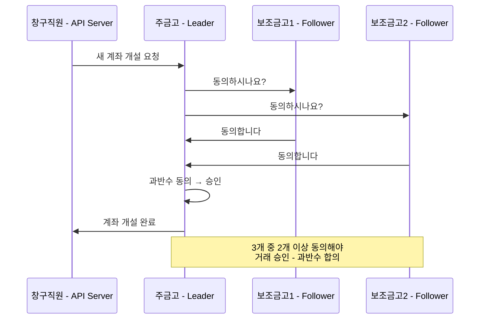
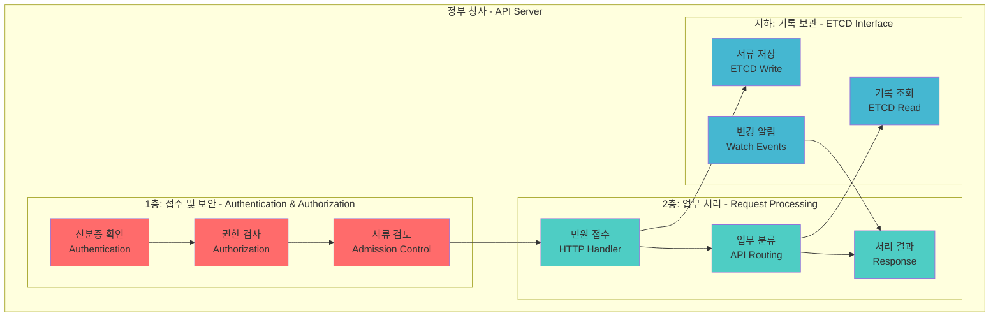
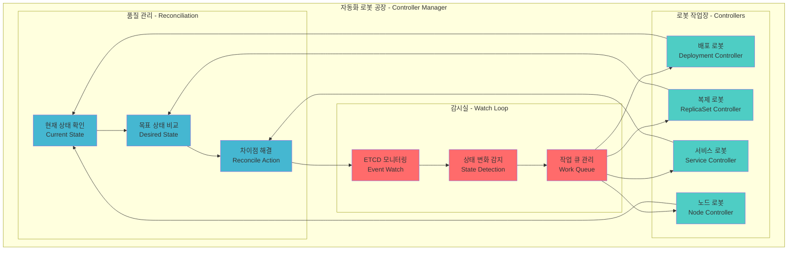
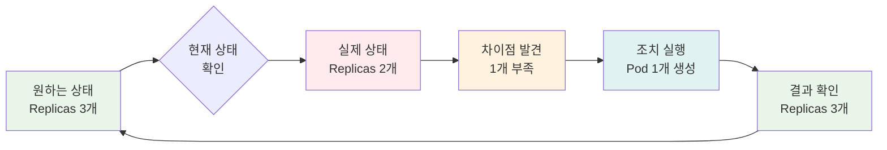

# Session 2: 핵심 컴포넌트 심화 & 내부 메커니즘 (50분)

<div align="center">

**💾 ETCD 분산 저장소** • **🌐 API Server 아키텍처** • **🔄 Controller 패턴** • **🔬 실시간 체험**

*각 컴포넌트의 내부 동작 원리와 상호작용을 완전히 이해하는 심화 세션*

</div>

---

## 📚 Kubernetes 공식 문서 참조

### 🔗 핵심 참조 문서
- **[etcd](https://kubernetes.io/docs/concepts/overview/components/#etcd)** - ETCD 컴포넌트 개요
- **[kube-apiserver](https://kubernetes.io/docs/concepts/overview/components/#kube-apiserver)** - API Server 상세
- **[kube-controller-manager](https://kubernetes.io/docs/concepts/overview/components/#kube-controller-manager)** - Controller Manager 역할
- **[Controllers](https://kubernetes.io/docs/concepts/architecture/controller/)** - Controller 패턴 설명
- **[API Concepts](https://kubernetes.io/docs/reference/using-api/api-concepts/)** - API 설계 개념
- **[Authentication](https://kubernetes.io/docs/reference/access-authn-authz/authentication/)** - 인증 메커니즘
- **[Authorization](https://kubernetes.io/docs/reference/access-authn-authz/authorization/)** - 인가 시스템
- **[Admission Controllers](https://kubernetes.io/docs/reference/access-authn-authz/admission-controllers/)** - 어드미션 컨트롤러

### 🔗 ETCD 전용 문서
- **[etcd Official Documentation](https://etcd.io/docs/)** - ETCD 공식 문서
- **[Raft Consensus Algorithm](https://raft.github.io/)** - Raft 알고리즘 설명
- **[etcd Clustering Guide](https://etcd.io/docs/v3.5/op-guide/clustering/)** - ETCD 클러스터링

---

## 🎯 세션 목표

### 📚 학습 목표
- **ETCD 마스터**: Raft 알고리즘과 분산 합의 메커니즘 이해
- **API Server 전문가**: RESTful API 설계와 인증/인가 시스템 파악
- **Controller 패턴**: Reconciliation Loop의 동작 원리 체득
- **실무 적용**: 각 컴포넌트 장애 진단과 성능 튜닝 능력

### 🤔 왜 필요한가? (5분)
**현실 문제**: "Pod 하나 만드는데 왜 이렇게 많은 컴포넌트가 필요한 거지?"

**학습 후 변화**:
- ❌ **Before**: "뭔가 복잡한 시스템들이 돌아간다..."
- ✅ **After**: "각 컴포넌트가 명확한 역할 분담으로 안정성과 확장성을 보장한다!"

---

## 🏦 Part 1: ETCD = 은행 금고 시스템 (15분)

### 🎯 ETCD 실생활 비유



### 🔐 ETCD = 은행 금고의 3가지 핵심 원칙

#### 1. **합의 기반 저장 (Raft Algorithm)**
**은행 비유**: "중요한 거래는 반드시 3명이 확인해야 합니다!"



#### 2. **실시간 동기화 (Watch Mechanism)**
**은행 비유**: "계좌 잔액이 바뀌면 모든 지점에 즉시 알림!"

```bash
# 실제 ETCD Watch 체험
kubectl exec -n kube-system etcd-control-plane -- \
  etcdctl watch /registry/pods/default/ --prefix \
  --endpoints=https://127.0.0.1:2379 \
  --cacert=/etc/kubernetes/pki/etcd/ca.crt \
  --cert=/etc/kubernetes/pki/etcd/server.crt \
  --key=/etc/kubernetes/pki/etcd/server.key

# 다른 터미널에서 Pod 생성
kubectl run etcd-demo --image=nginx
# → Watch 터미널에서 즉시 변경사항 확인!
```

#### 3. **데이터 구조 (Key-Value Store)**
**은행 비유**: "모든 계좌는 고유 번호로 관리됩니다!"

```bash
# ETCD 데이터 구조 탐험
/registry/pods/default/nginx-pod           # Pod 정보
/registry/services/default/kubernetes      # Service 정보  
/registry/nodes/worker-node-1              # Node 정보
/registry/secrets/kube-system/token-xxx    # Secret 정보

# 실제 데이터 확인
kubectl exec -n kube-system etcd-control-plane -- \
  etcdctl get /registry/pods/default/ --prefix --keys-only
```

### 🔍 ETCD 성능 및 한계

| 항목 | 성능 지표 | 은행 비유 |
|------|-----------|-----------|
| **쓰기 성능** | 초당 10,000건 | 하루 거래 처리량 |
| **읽기 성능** | 초당 50,000건 | 잔액 조회 속도 |
| **데이터 크기** | 최대 8GB | 금고 용량 |
| **클러스터 크기** | 홀수 개 (3,5,7) | 금고 개수 |
| **네트워크 지연** | <10ms 권장 | 지점 간 통신 속도 |

---

## 🏛️ Part 2: API Server = 정부 청사 (15분)

### 🎯 API Server 실생활 비유



### 🔐 API Server의 3단계 보안 검사

#### 1단계: Authentication (신분 확인)
**정부 청사 비유**: "신분증을 제시해 주세요!"

```bash
# 실제 인증 방법들
1. X.509 Client Certificates    # 공무원 신분증
2. Bearer Tokens               # 임시 출입증  
3. Basic Authentication        # 방문자 등록
4. OpenID Connect             # 외부 기관 연동

# 현재 사용 중인 인증 확인
kubectl config view --minify
```

#### 2단계: Authorization (권한 확인)  
**정부 청사 비유**: "이 업무를 처리할 권한이 있으신가요?"

```bash
# RBAC 권한 확인
kubectl auth can-i create pods
kubectl auth can-i delete nodes
kubectl auth can-i get secrets --all-namespaces

# 권한 매트릭스 확인
kubectl auth can-i --list
```

#### 3단계: Admission Control (서류 검토)
**정부 청사 비유**: "제출하신 서류가 규정에 맞는지 검토하겠습니다!"

```bash
# 활성화된 Admission Controllers 확인
kubectl exec -n kube-system kube-apiserver-control-plane -- \
  kube-apiserver --help | grep admission-plugins

# 일반적인 Admission Controllers
- NamespaceLifecycle      # 네임스페이스 생명주기 관리
- ResourceQuota          # 리소스 할당량 검사
- PodSecurityPolicy      # Pod 보안 정책 적용
- MutatingAdmissionWebhook  # 요청 내용 수정
- ValidatingAdmissionWebhook # 요청 내용 검증
```

### 🌐 RESTful API 설계 원칙

```bash
# Kubernetes API 구조
GET    /api/v1/pods                    # 모든 Pod 조회
POST   /api/v1/namespaces/default/pods # Pod 생성
GET    /api/v1/namespaces/default/pods/nginx # 특정 Pod 조회
PUT    /api/v1/namespaces/default/pods/nginx # Pod 업데이트
DELETE /api/v1/namespaces/default/pods/nginx # Pod 삭제

# 실제 API 호출 체험
kubectl proxy --port=8080 &
curl http://localhost:8080/api/v1/pods
```

---

## 🔄 Part 3: Controller Manager = 자동화 로봇 공장 (15분)

### 🎯 Controller Manager 실생활 비유



### 🤖 Reconciliation Loop = 품질 관리 시스템

**자동화 공장 비유**: "목표 생산량과 실제 생산량을 지속적으로 비교해서 자동 조정!"



### 🔍 주요 Controller들의 역할

#### 1. Deployment Controller
```bash
# Deployment 생성 시 Controller 동작 관찰
kubectl create deployment nginx --image=nginx --replicas=3

# Controller Manager 로그에서 확인
kubectl logs -n kube-system kube-controller-manager-control-plane | grep deployment
```

#### 2. ReplicaSet Controller  
```bash
# ReplicaSet 직접 조작해보기
kubectl scale deployment nginx --replicas=5

# 실시간 Pod 변화 관찰
kubectl get pods -w
```

#### 3. Node Controller
```bash
# 노드 상태 모니터링
kubectl get nodes -w

# 노드 Controller 설정 확인
kubectl describe node | grep -A5 "Conditions"
```

### 🚀 실시간 Controller 동작 체험

```bash
# 터미널 1: Controller Manager 로그 모니터링
kubectl logs -n kube-system -f kube-controller-manager-control-plane

# 터미널 2: Pod 상태 실시간 관찰
kubectl get pods -w

# 터미널 3: ReplicaSet 상태 관찰
kubectl get replicasets -w

# 터미널 4: 실험 수행
kubectl create deployment controller-demo --image=nginx --replicas=3
kubectl scale deployment controller-demo --replicas=1
kubectl scale deployment controller-demo --replicas=5
kubectl delete deployment controller-demo
```

---

## 💭 함께 생각해보기 (5분)

### 🤝 페어 토론 (3분)
**토론 주제**:
1. **ETCD 장애**: "ETCD 클러스터에서 1개 노드가 고장나면 어떻게 될까요?"
2. **API Server 성능**: "API Server가 느려지면 어떤 컴포넌트들이 영향을 받을까요?"
3. **Controller 충돌**: "두 개의 Controller가 같은 리소스를 동시에 수정하려 하면?"

### 🎯 전체 공유 (2분)
- **핵심 인사이트**: 각 컴포넌트의 상호 의존성 이해
- **실무 질문**: "실제 운영에서 어떤 모니터링이 필요할까?"

### 💡 이해도 체크 질문
- ✅ "ETCD Raft 알고리즘을 은행 금고에 비유해서 설명할 수 있나요?"
- ✅ "API Server의 3단계 보안 검사 과정을 순서대로 말할 수 있나요?"
- ✅ "Reconciliation Loop가 어떻게 동작하는지 설명할 수 있나요?"

---

## 🔑 핵심 키워드

### 🆕 ETCD 관련 용어
- **Raft Algorithm(래프트 알고리즘)**: 분산 시스템에서 합의를 달성하는 알고리즘
- **Leader Election(리더 선출)**: 클러스터에서 주 노드를 선택하는 과정
- **Quorum(쿼럼)**: 의사결정에 필요한 최소 노드 수 (과반수)
- **Watch(워치)**: 데이터 변경사항을 실시간으로 감지하는 기능

### 🆕 API Server 관련 용어
- **Authentication(인증)**: 사용자 신원 확인 과정
- **Authorization(인가)**: 사용자 권한 확인 과정  
- **Admission Control(어드미션 컨트롤)**: 요청 내용 검증 및 수정
- **RBAC**: Role-Based Access Control, 역할 기반 접근 제어

### 🆕 Controller 관련 용어
- **Reconciliation Loop(조정 루프)**: 현재 상태를 원하는 상태로 맞추는 제어 루프
- **Event-Driven(이벤트 기반)**: 상태 변화에 반응하여 동작하는 방식
- **Work Queue(작업 큐)**: 처리해야 할 작업들을 순서대로 관리하는 대기열

---

## 📝 세션 마무리

### ✅ 오늘 세션 성과
- [ ] **ETCD 마스터**: Raft 알고리즘과 분산 합의 메커니즘 완전 이해
- [ ] **API Server 전문가**: 3단계 보안 검사와 RESTful API 구조 파악
- [ ] **Controller 패턴**: Reconciliation Loop의 동작 원리 체득
- [ ] **실시간 체험**: 각 컴포넌트의 실제 동작 직접 관찰

### 🎯 다음 세션 준비
- **Session 3 예고**: Scheduler와 Kubelet의 상세 동작 메커니즘
- **연결고리**: 오늘 배운 핵심 컴포넌트들이 어떻게 협력하여 Pod를 스케줄링하고 실행하는지
- **실습 준비**: Lab 1에서 오늘 배운 각 컴포넌트를 직접 조작하고 모니터링

### 🚀 실무 팁
- **ETCD 백업**: 정기적인 스냅샷으로 클러스터 상태 보호
- **API Server 튜닝**: 동시 연결 수와 요청 제한 적절히 설정
- **Controller 모니터링**: 각 Controller의 작업 큐 길이 지속 관찰

---

## 🎉 Fun Facts

- **ETCD 이름**: "distributed reliable key-value store"의 줄임말
- **Raft 알고리즘**: 2013년 스탠포드 대학에서 개발, Paxos보다 이해하기 쉬움
- **API Server 성능**: 초당 수천 개 요청 처리, Netflix는 초당 10만 요청도 처리
- **Controller 개수**: 실제로는 40개 이상의 Controller가 하나의 바이너리에 패키징
- **Reconciliation**: "화해, 조정"이라는 뜻으로 상태를 일치시킨다는 의미
- **Watch 효율성**: 폴링 방식 대비 99% 네트워크 트래픽 절약

---

<div align="center">

**💾 ETCD 마스터** • **🌐 API Server 전문가** • **🔄 Controller 패턴 완전 이해**

*이제 Kubernetes의 두뇌와 심장을 완전히 파악했습니다!*

**다음**: [Session 3 - 스케줄러 & 에이전트](session_3.md)

</div>
