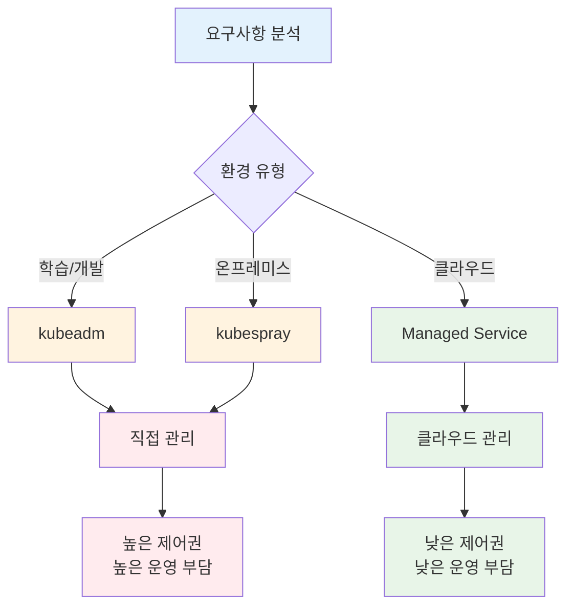
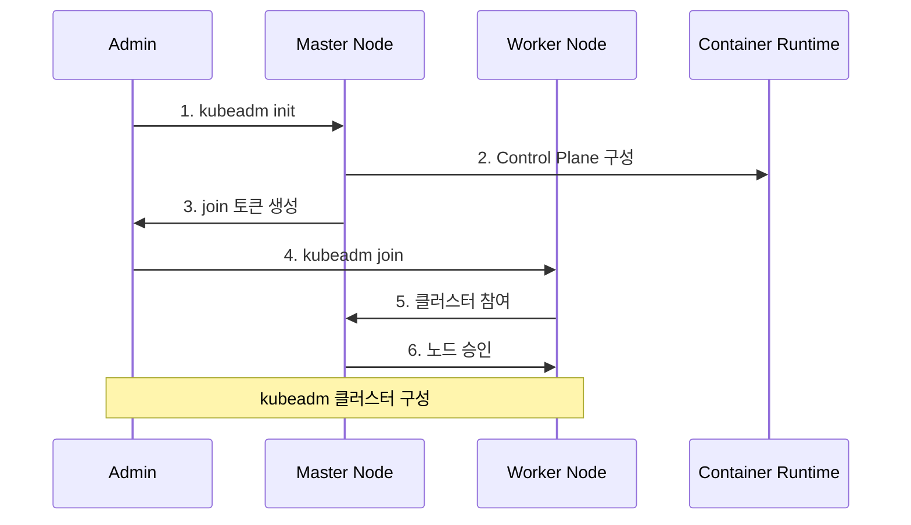
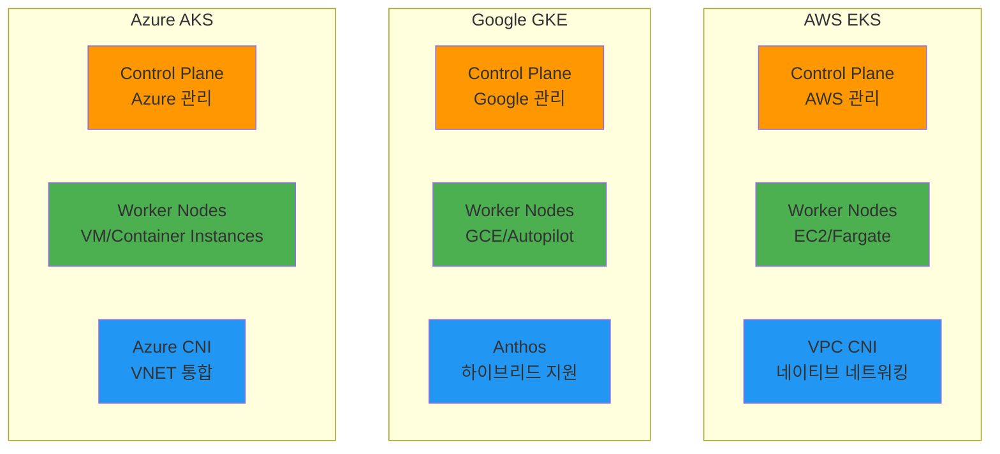
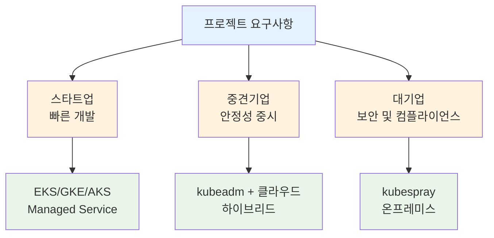

# Week 3 Day 1 Session 2: 설치 방법 비교

**🛠️ 설치 옵션** • **⚖️ 방법 비교** • **🎯 선택 기준**
*kubeadm부터 Managed Service까지, 최적의 설치 방법 선택*

---

## 🕘 세션 정보
**시간**: 10:00-10:50 (50분)
**목표**: 다양한 Kubernetes 설치 방법 이해 및 비교
**방식**: 실무 중심 비교 분석 + 협업 토론

## 🎯 세션 목표
### 📚 학습 목표
- **이해 목표**: 각 설치 방법의 특징과 장단점 완전 이해
- **적용 목표**: 프로젝트 요구사항에 맞는 설치 방법 선택 능력
- **협업 목표**: 팀 환경에 최적화된 설치 전략 수립

### 🤔 왜 필요한가? (5분)

**현실 문제 상황**:
- 💼 **실무 시나리오**: 학습용, 개발용, 프로덕션용 환경별 다른 요구사항
- 🏠 **일상 비유**: 집을 짓는 방법 - 직접 건설 vs 아파트 분양 vs 전세
- 📊 **시장 동향**: 80% 기업이 Managed Kubernetes 서비스 선호

**학습 전후 비교**:

---

## 📖 핵심 개념 (35분)

### 🔍 개념 1: 설치 방법 개요 (12분)
> **정의**: Kubernetes 클러스터를 구축하는 다양한 방법과 각각의 특징

**설치 방법별 비교**:

| 설치 방법 | 복잡도 | 제어 수준 | 운영 부담 | 적용 환경 |
|-----------|---------|-----------|-----------|-----------| 
| **kubeadm** | 중간 | 높음 | 높음 | 온프레미스, 학습용 |
| **kops** | 높음 | 매우 높음 | 매우 높음 | AWS 전용, 고급 사용자 |
| **kubespray** | 높음 | 높음 | 높음 | 멀티 클라우드, 엔터프라이즈 |
| **EKS** | 낮음 | 중간 | 낮음 | AWS 프로덕션 환경 |
| **GKE** | 낮음 | 중간 | 낮음 | GCP 프로덕션 환경 |
| **AKS** | 낮음 | 중간 | 낮음 | Azure 프로덕션 환경 |

**설치 방법 선택 기준**:

### 🔍 개념 2: kubeadm 설치 방법 (12분)
> **정의**: Kubernetes 공식 클러스터 부트스트래핑 도구

**kubeadm 특징**:
- **장점**: 공식 도구, 표준 설치 방법, 학습에 적합
- **단점**: 수동 설정 많음, 운영 복잡성
- **사용 시기**: 학습, 테스트, 온프레미스 환경

**kubeadm 설치 과정**:

**kubeadm 설치 단계**:
1. **사전 준비**: Docker/containerd 설치, 네트워크 설정
2. **패키지 설치**: kubeadm, kubelet, kubectl 설치
3. **클러스터 초기화**: `kubeadm init` 실행
4. **네트워크 플러그인**: CNI 플러그인 설치
5. **워커 노드 추가**: `kubeadm join` 실행

### 🔍 개념 3: Managed Kubernetes 서비스 (11분)
> **정의**: 클라우드 제공업체가 Control Plane을 관리해주는 서비스

**Managed 서비스 장점**:
- **운영 부담 감소**: Control Plane 관리 불필요
- **고가용성**: 자동 백업, 복구, 업데이트
- **보안**: 클라우드 네이티브 보안 기능 통합
- **확장성**: 자동 스케일링 지원

**주요 Managed 서비스 비교**:

**🔑 핵심 키워드 정리**:
- **kubeadm**: Kubernetes 공식 부트스트래핑 도구
- **Managed Service**: 클라우드 제공업체가 관리하는 Kubernetes
- **Control Plane**: 관리 영역 (Managed에서는 클라우드가 관리)
- **Worker Node**: 사용자가 관리하는 컴퓨팅 리소스
- **CNI**: Container Network Interface, 네트워크 플러그인

---

## 🌟 실무 연계 (15분)

### 📊 업계 동향
- **시장 현황**: Managed Kubernetes 서비스 사용률 80% 이상
- **주요 기업 사례**: 
  - Netflix: AWS EKS로 마이크로서비스 운영
  - Spotify: Google GKE로 음악 스트리밍 서비스
  - Adobe: Azure AKS로 Creative Cloud 서비스
- **미래 전망**: 서버리스 Kubernetes (Fargate, Cloud Run) 증가

### 🏢 실무 적용 사례

### 💼 직무별 활용도
- **개발자**: Managed Service로 빠른 개발 환경 구축
- **운영자**: kubeadm으로 세밀한 클러스터 제어
- **아키텍트**: 요구사항에 맞는 최적 설치 방법 선택

### ⚠️ 실무 주의사항
- 🚨 **흔한 실수**: 학습용 도구를 프로덕션에 사용
- 💡 **베스트 프랙티스**: 환경별 다른 설치 방법 적용
- 🔧 **트러블슈팅**: 각 설치 방법별 로그 확인 위치 숙지

---

## 💭 함께 생각해보기 (10분)

### 🤝 페어 토론 (5분)
**토론 주제**:
1. **개념 적용**: "학습용과 프로덕션용 설치 방법이 다른 이유는?"
2. **문제 해결**: "우리 프로젝트에 가장 적합한 설치 방법은?"
3. **경험 공유**: "클라우드 vs 온프레미스 선택 기준은?"

**페어 활동 가이드**:
- 👥 **시나리오 기반**: 가상의 프로젝트 상황 설정
- 🔄 **의사결정 연습**: 설치 방법 선택 근거 토론
- 📝 **장단점 정리**: 각 방법의 트레이드오프 분석

### 🎯 전체 공유 (5분)
- **인사이트 공유**: 설치 방법 선택 기준과 경험
- **질문 수집**: 각 설치 방법의 구체적 차이점
- **다음 연결**: Session 3 EKS 아키텍처와의 연결고리

**💡 이해도 체크 질문**:
- ✅ "kubeadm과 EKS의 가장 큰 차이점을 설명할 수 있나요?"
- ✅ "프로젝트 요구사항에 따른 설치 방법을 선택할 수 있나요?"
- ✅ "Managed Service의 장단점을 이해하셨나요?"

---

## 📝 세션 마무리

### ✅ 오늘 세션 성과
- 다양한 Kubernetes 설치 방법 이해
- 각 방법의 장단점과 적용 시나리오 파악
- 실무 환경별 최적 선택 기준 습득

### 🎯 다음 세션 준비
- **Session 3 연결**: AWS EKS의 구체적 아키텍처와 설정 방법
- **실습 준비**: kubeadm과 EKS 설치 실습 대비
- **키워드 복습**: Managed Service, Control Plane, Worker Node

---

**🎉 Session 2 완료!**

*Kubernetes 설치 방법의 선택 기준을 완전히 이해했습니다*

