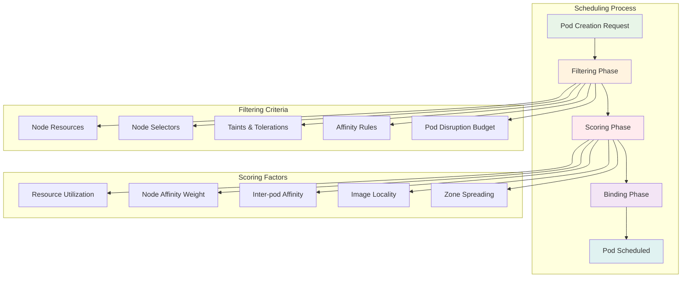
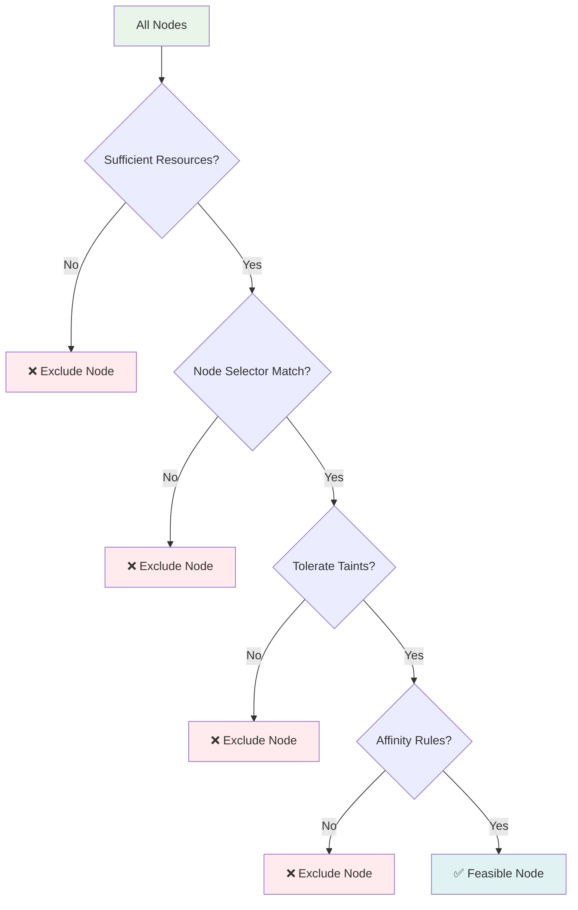
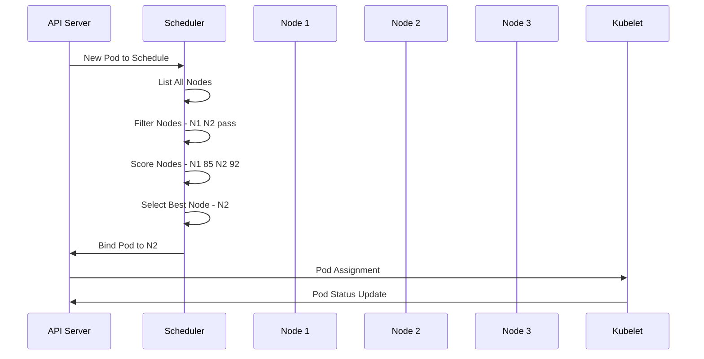
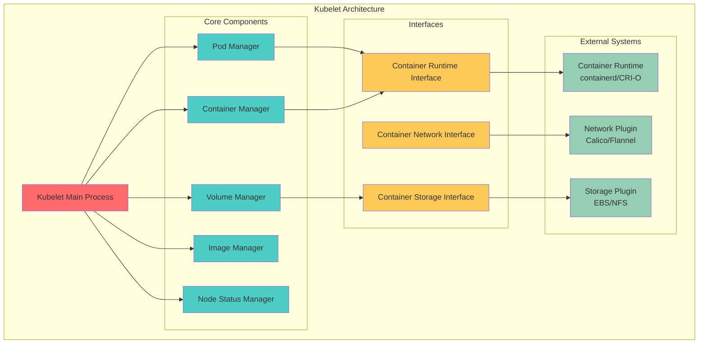
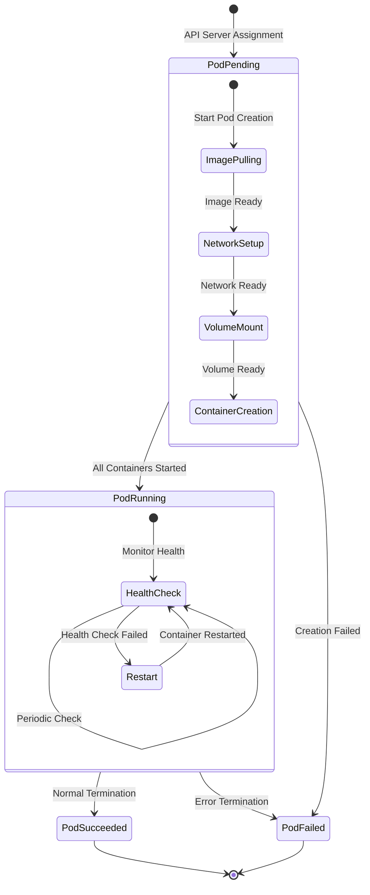
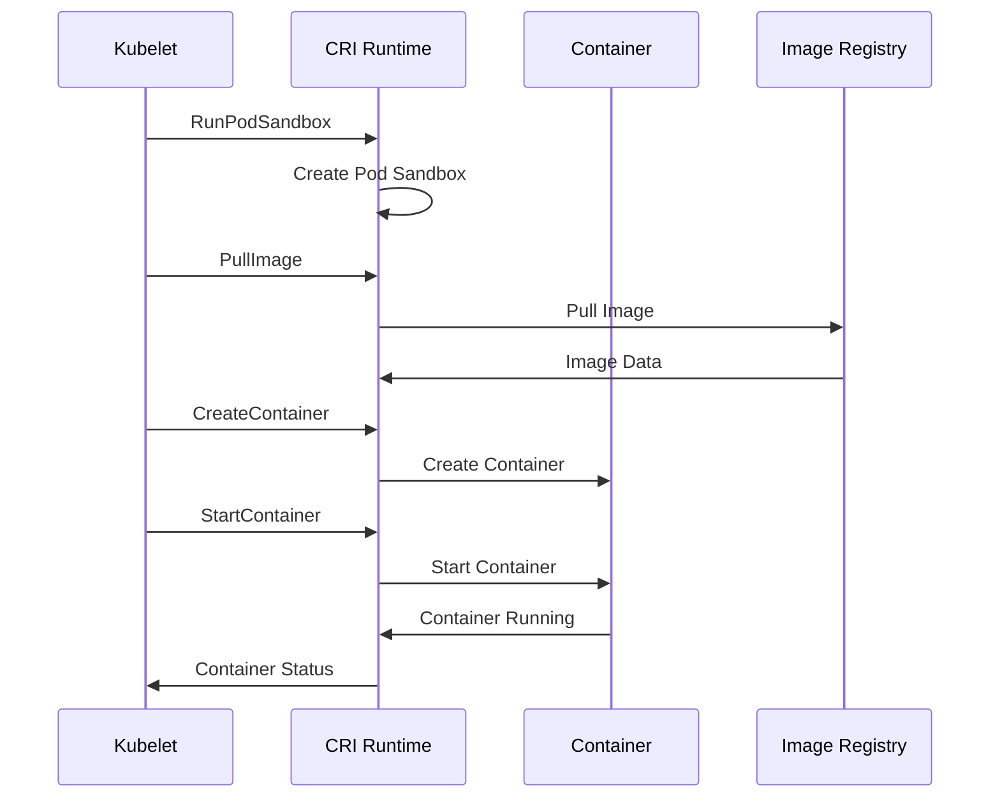
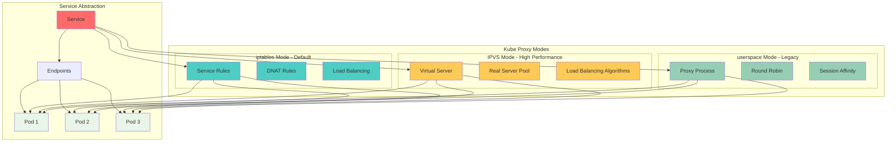
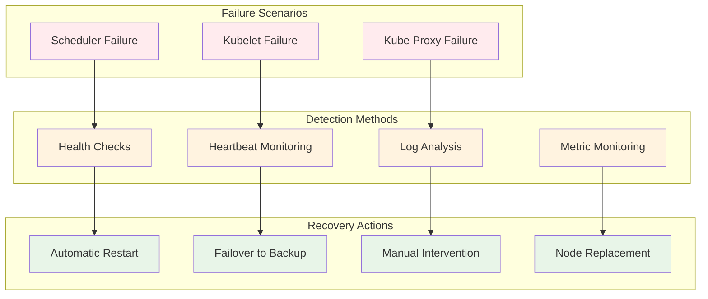

# Session 3: 스케줄러 & 에이전트 (50분)

<div align="center">

**📋 스케줄러** • **🤖 Kubelet** • **🌐 Kube Proxy** • **📚 공식 문서 기반**

*Pod 배치부터 네트워크 관리까지, 워커 노드의 핵심 컴포넌트 완전 이해*

</div>

---

## 📚 Kubernetes 공식 문서 참조

### 🔗 핵심 참조 문서
- **[kube-scheduler](https://kubernetes.io/docs/concepts/overview/components/#kube-scheduler)** - 스케줄러 개요
- **[Scheduling Framework](https://kubernetes.io/docs/concepts/scheduling-eviction/scheduling-framework/)** - 스케줄링 프레임워크
- **[Assigning Pods to Nodes](https://kubernetes.io/docs/concepts/scheduling-eviction/assign-pod-node/)** - Pod 노드 할당
- **[kubelet](https://kubernetes.io/docs/concepts/overview/components/#kubelet)** - Kubelet 컴포넌트
- **[Container Runtime Interface (CRI)](https://kubernetes.io/docs/concepts/architecture/cri/)** - CRI 인터페이스
- **[kube-proxy](https://kubernetes.io/docs/concepts/overview/components/#kube-proxy)** - Kube Proxy 역할
- **[Service Networking](https://kubernetes.io/docs/concepts/services-networking/)** - 서비스 네트워킹

### 🔗 스케줄링 전용 문서
- **[Scheduler Configuration](https://kubernetes.io/docs/reference/scheduling/config/)** - 스케줄러 설정
- **[Scheduler Profiles](https://kubernetes.io/docs/reference/scheduling/config/#profiles)** - 스케줄러 프로필
- **[Taints and Tolerations](https://kubernetes.io/docs/concepts/scheduling-eviction/taint-and-toleration/)** - Taint/Toleration
- **[Node Affinity](https://kubernetes.io/docs/concepts/scheduling-eviction/assign-pod-node/#node-affinity)** - 노드 친화성

### 🔗 Kubelet 전용 문서
- **[Kubelet Configuration](https://kubernetes.io/docs/reference/config-file/kubelet/)** - Kubelet 설정
- **[Pod Lifecycle](https://kubernetes.io/docs/concepts/workloads/pods/pod-lifecycle/)** - Pod 생명주기
- **[Container Probes](https://kubernetes.io/docs/concepts/workloads/pods/pod-lifecycle/#container-probes)** - 컨테이너 프로브

---

## 🎯 필수 요소
- **Scheduler 알고리즘 동작 원리**
- **Kubelet 역할과 책임**
- **Kube Proxy 네트워크 관리**
- **각 컴포넌트의 장애 대응**

## 🔍 핵심 설명

### Kube Scheduler - 최적 배치의 마법사



#### 스케줄링 알고리즘 상세

**1. Filtering Phase (필터링 단계)**:


**2. Scoring Phase (점수 매기기 단계)**:
```yaml
# 스코어링 가중치 예시
scoringWeights:
  NodeResourcesFit: 1          # 리소스 적합성
  NodeAffinity: 2              # 노드 친화성
  InterPodAffinity: 2          # Pod 간 친화성
  NodePreferAvoidPods: 10000   # Pod 회피 선호
  TaintToleration: 3           # Taint 허용도
  ImageLocality: 1             # 이미지 지역성
  SelectorSpread: 1            # 셀렉터 분산
  VolumeBinding: 1             # 볼륨 바인딩
```

**3. 스케줄링 결정 과정**:


### Kubelet - 노드의 충실한 관리자



#### Kubelet 동작 원리 상세

**1. Pod 생명주기 관리**:


**2. Container Runtime 통신**:


**3. 노드 상태 보고**:
```yaml
# Kubelet이 API Server에 보고하는 노드 상태
nodeStatus:
  conditions:
  - type: Ready
    status: "True"
    reason: KubeletReady
    message: kubelet is posting ready status
  - type: MemoryPressure
    status: "False"
    reason: KubeletHasSufficientMemory
  - type: DiskPressure
    status: "False"
    reason: KubeletHasNoDiskPressure
  - type: PIDPressure
    status: "False"
    reason: KubeletHasSufficientPID
  capacity:
    cpu: "4"
    memory: 8Gi
    pods: "110"
  allocatable:
    cpu: "3800m"
    memory: 7.5Gi
    pods: "110"
```

### Kube Proxy - 네트워크 교통 경찰



#### Kube Proxy 동작 모드 비교

**1. iptables 모드 (기본값)**:
```bash
# Service에 대한 iptables 규칙 예시
# ClusterIP Service: nginx-service (10.96.100.100:80)
# Endpoints: 192.168.1.10:80, 192.168.1.11:80

# PREROUTING 체인 - Service IP 감지
-A KUBE-SERVICES -d 10.96.100.100/32 -p tcp -m tcp --dport 80 -j KUBE-SVC-NGINX

# Service 체인 - 로드밸런싱
-A KUBE-SVC-NGINX -m statistic --mode random --probability 0.50000000000 -j KUBE-SEP-EP1
-A KUBE-SVC-NGINX -j KUBE-SEP-EP2

# Endpoint 체인 - DNAT
-A KUBE-SEP-EP1 -p tcp -m tcp -j DNAT --to-destination 192.168.1.10:80
-A KUBE-SEP-EP2 -p tcp -m tcp -j DNAT --to-destination 192.168.1.11:80
```

**2. IPVS 모드 (고성능)**:
```bash
# IPVS 가상 서버 설정 예시
ipvsadm -A -t 10.96.100.100:80 -s rr  # Round Robin 스케줄링
ipvsadm -a -t 10.96.100.100:80 -r 192.168.1.10:80 -m  # Masquerading
ipvsadm -a -t 10.96.100.100:80 -r 192.168.1.11:80 -m

# 지원하는 로드밸런싱 알고리즘
# rr (Round Robin), lc (Least Connection), dh (Destination Hashing)
# sh (Source Hashing), sed (Shortest Expected Delay)
```

**3. 성능 비교**:
| 모드 | 처리량 | 지연시간 | 메모리 사용량 | 복잡도 |
|------|--------|----------|---------------|--------|
| **iptables** | 보통 | 높음 | 높음 | 낮음 |
| **IPVS** | 높음 | 낮음 | 낮음 | 중간 |
| **userspace** | 낮음 | 매우 높음 | 보통 | 높음 |

### 컴포넌트 장애 대응



### 사용 예제

#### 1. Scheduler 상태 확인 및 튜닝
```bash
# Scheduler 로그 확인
kubectl logs -n kube-system kube-scheduler-master

# Scheduler 설정 확인
kubectl get configmap -n kube-system kube-scheduler-config -o yaml

# 커스텀 스케줄러 프로파일 생성
cat <<EOF | kubectl apply -f -
apiVersion: v1
kind: ConfigMap
metadata:
  name: custom-scheduler-config
  namespace: kube-system
data:
  config.yaml: |
    apiVersion: kubescheduler.config.k8s.io/v1beta3
    kind: KubeSchedulerConfiguration
    profiles:
    - schedulerName: custom-scheduler
      plugins:
        score:
          enabled:
          - name: NodeResourcesFit
            weight: 1
          - name: NodeAffinity
            weight: 5
      pluginConfig:
      - name: NodeResourcesFit
        args:
          scoringStrategy:
            type: LeastAllocated
EOF
```

#### 2. Kubelet 설정 및 모니터링
```bash
# Kubelet 상태 확인
systemctl status kubelet

# Kubelet 설정 파일 확인
cat /var/lib/kubelet/config.yaml

# 노드 리소스 사용량 확인
kubectl top node

# Pod 리소스 사용량 확인
kubectl top pod --all-namespaces

# Kubelet 메트릭 확인
curl -k https://localhost:10250/metrics
```

#### 3. Kube Proxy 설정 및 디버깅
```bash
# Kube Proxy 설정 확인
kubectl get configmap -n kube-system kube-proxy -o yaml

# IPVS 모드로 변경
kubectl patch configmap -n kube-system kube-proxy \
  --patch '{"data":{"config.conf":"mode: ipvs"}}'

# iptables 규칙 확인
iptables -t nat -L KUBE-SERVICES

# IPVS 가상 서버 확인
ipvsadm -L -n

# 네트워크 연결 테스트
kubectl run test-pod --image=busybox --rm -it -- /bin/sh
# 컨테이너 내에서
nslookup kubernetes.default.svc.cluster.local
wget -qO- http://service-name.namespace.svc.cluster.local
```

## 🎉 Fun Facts & 기업 사례

### 기술적 재미
- **스케줄링 조건**: 100개 이상의 조건을 동시에 고려하여 최적 노드 선택
- **Kubelet 통신**: 10초마다 API Server에 heartbeat 전송으로 생존 신호
- **Proxy 모드**: iptables, IPVS, userspace 3가지 모드 중 선택 가능
- **CRI 표준**: Docker, containerd, CRI-O 등 다양한 런타임 지원

### LinkedIn 사례
- **문제 상황**: 수천 개의 Pod 스케줄링 시 Scheduler 병목 현상
- **해결 방법**: 커스텀 스케줄러 개발 및 스케줄링 알고리즘 최적화
- **결과**: 스케줄링 시간 70% 단축, 리소스 활용률 25% 향상
- **교훈**: 워크로드 특성에 맞는 커스텀 스케줄러의 효과

### Alibaba 사례
- **문제 상황**: 대규모 클러스터에서 Kubelet 메모리 사용량 급증
- **해결 방법**: Kubelet 설정 튜닝 및 가비지 컬렉션 최적화
- **결과**: 메모리 사용량 40% 감소, 노드 안정성 크게 향상
- **교훈**: 대규모 환경에서의 컴포넌트 튜닝 중요성

### Tencent 사례
- **문제 상황**: 게임 서비스의 네트워크 지연시간 최소화 필요
- **해결 방법**: Kube Proxy IPVS 모드 도입 및 네트워크 최적화
- **결과**: 네트워크 지연시간 50% 감소, 게임 성능 크게 개선
- **교훈**: 성능 크리티컬한 애플리케이션에서의 네트워크 최적화

### 업계 통계
- **스케줄링 성능**: 초당 300개 Pod 스케줄링 처리 가능
- **Kubelet 확장성**: 단일 노드에서 최대 110개 Pod 관리
- **Proxy 성능**: IPVS 모드에서 iptables 대비 10배 성능 향상
- **장애 복구**: 평균 30초 이내 컴포넌트 자동 재시작

### Google Borg 시스템 경험
- **스케줄링 진화**: Borg의 15년 스케줄링 경험이 Kubernetes에 반영
- **리소스 효율성**: 빈 패킹(bin packing) 알고리즘으로 리소스 활용률 극대화
- **장애 허용**: 컴포넌트 장애를 전제로 한 복원력 있는 설계
- **확장성**: 수만 개 노드 규모의 클러스터 운영 경험

## 💡 실무 팁

### Scheduler 최적화 전략
1. **리소스 요청 정확성**: 정확한 CPU/Memory 요청으로 스케줄링 품질 향상
2. **Affinity 활용**: Node/Pod Affinity로 성능 최적화
3. **Taint/Toleration**: 특수 목적 노드 분리 운영
4. **커스텀 스케줄러**: 특별한 요구사항이 있는 경우 커스텀 개발

### Kubelet 운영 베스트 프랙티스
- **리소스 예약**: 시스템 프로세스를 위한 리소스 예약 설정
- **가비지 컬렉션**: 이미지 및 컨테이너 정리 정책 설정
- **로그 로테이션**: 컨테이너 로그 크기 제한 및 로테이션
- **보안 강화**: 읽기 전용 루트 파일시스템 및 보안 컨텍스트 설정

### Kube Proxy 성능 튜닝
- **IPVS 모드**: 대규모 서비스 환경에서 IPVS 모드 사용
- **커널 파라미터**: 네트워크 성능 관련 커널 파라미터 튜닝
- **로드밸런싱**: 워크로드 특성에 맞는 로드밸런싱 알고리즘 선택
- **세션 어피니티**: 필요한 경우에만 세션 어피니티 사용

### 장애 대응 체크리스트
1. **모니터링**: 각 컴포넌트의 상태 및 성능 지표 모니터링
2. **로그 분석**: 정기적인 로그 분석으로 잠재적 문제 사전 발견
3. **백업**: 설정 파일 및 인증서 백업
4. **복구 절차**: 컴포넌트별 장애 복구 절차 문서화

---

## 📖 추가 학습 자료

### 🔗 심화 문서
- **[Kubernetes Scheduler](https://kubernetes.io/docs/concepts/scheduling-eviction/kube-scheduler/)** - 스케줄러 상세 가이드
- **[Multiple Schedulers](https://kubernetes.io/docs/tasks/extend-kubernetes/configure-multiple-schedulers/)** - 다중 스케줄러 설정
- **[Kubelet Device Plugins](https://kubernetes.io/docs/concepts/extend-kubernetes/compute-storage-net/device-plugins/)** - 디바이스 플러그인
- **[Network Plugins](https://kubernetes.io/docs/concepts/extend-kubernetes/compute-storage-net/network-plugins/)** - 네트워크 플러그인

### 📊 모니터링 및 디버깅
- **[Troubleshooting Applications](https://kubernetes.io/docs/tasks/debug-application-cluster/debug-application/)** - 애플리케이션 디버깅
- **[Debug Services](https://kubernetes.io/docs/tasks/debug-application-cluster/debug-service/)** - 서비스 디버깅
- **[Monitor Node Health](https://kubernetes.io/docs/tasks/debug-application-cluster/monitor-node-health/)** - 노드 상태 모니터링

### 🔧 운영 도구
- **[crictl](https://kubernetes.io/docs/tasks/debug-application-cluster/crictl/)** - CRI 디버깅 도구
- **[kubectl](https://kubernetes.io/docs/reference/kubectl/)** - kubectl 명령어 레퍼런스
- **[Metrics Server](https://kubernetes.io/docs/tasks/debug-application-cluster/resource-usage-monitoring/)** - 리소스 모니터링