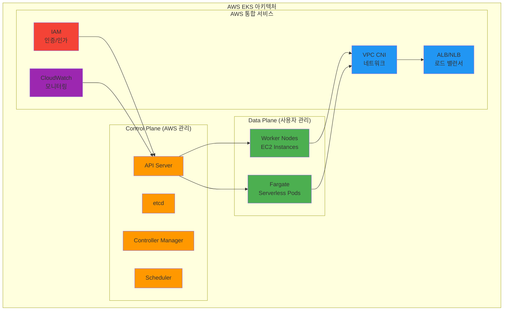
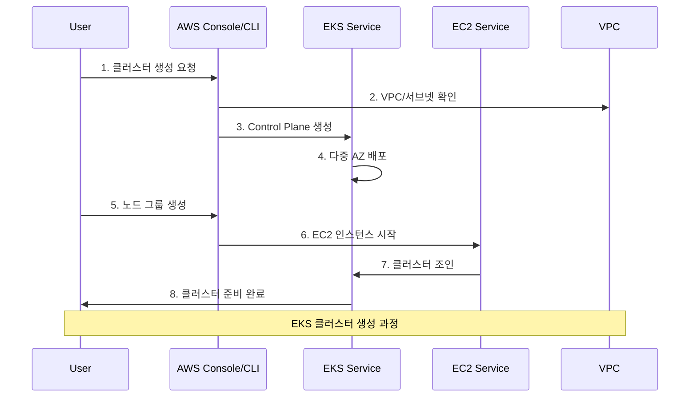
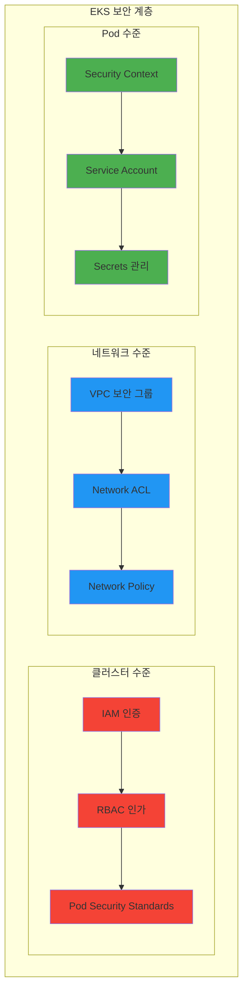
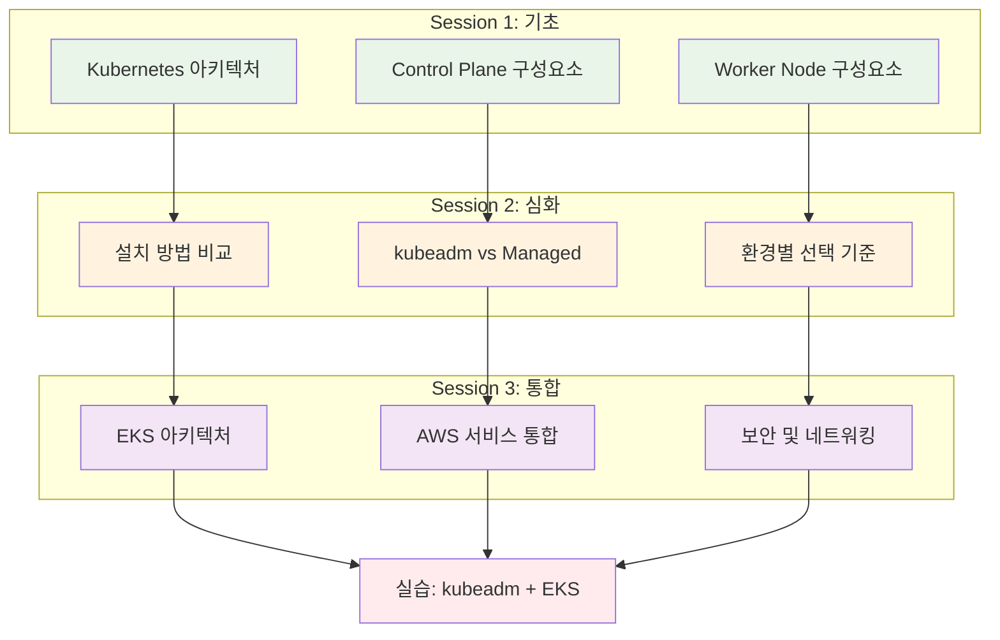

# Week 3 Day 1 Session 3: AWS EKS 아키텍처 및 설정 방법

**☁️ AWS EKS** • **🏗️ 관리형 서비스** • **🔐 클라우드 통합**
*AWS의 관리형 Kubernetes 서비스 완전 정복*

---

## 🕘 세션 정보
**시간**: 11:00-11:50 (50분)
**목표**: AWS EKS 아키텍처 이해 및 설정 방법 습득
**방식**: 클라우드 네이티브 관점 + 실무 중심 설명

## 🎯 세션 목표
### 📚 학습 목표
- **이해 목표**: EKS 아키텍처와 AWS 서비스 통합 방식 완전 이해
- **적용 목표**: EKS 클러스터 생성 및 구성 방법 습득
- **협업 목표**: 팀 환경에서 EKS 클러스터 공유 및 관리 전략

### 🤔 왜 필요한가? (5분)

**현실 문제 상황**:
- 💼 **실무 시나리오**: Control Plane 관리 부담 없이 애플리케이션 개발에 집중
- 🏠 **일상 비유**: 호텔 서비스처럼 인프라는 맡기고 비즈니스에 집중
- 📊 **시장 동향**: AWS 고객의 70% 이상이 EKS 사용

**학습 전후 비교**:

---

## 📖 핵심 개념 (35분)

### 🔍 개념 1: EKS 아키텍처 (12분)
> **정의**: Amazon Elastic Kubernetes Service, AWS의 관리형 Kubernetes 서비스

**EKS 핵심 특징**:
- **관리형 Control Plane**: AWS가 API Server, etcd, Controller Manager, Scheduler 관리
- **AWS 네이티브 통합**: VPC, IAM, CloudWatch 등과 완전 통합
- **고가용성**: 다중 AZ에 걸친 Control Plane 자동 배포
- **자동 업데이트**: Kubernetes 버전 업데이트 자동화

**EKS 아키텍처 구조**:

### 🔍 개념 2: EKS 클러스터 생성 과정 (12분)
> **정의**: AWS 콘솔, CLI, Terraform을 통한 EKS 클러스터 생성 방법

**EKS 생성 단계**:
1. **VPC 및 서브넷 구성**: 클러스터용 네트워크 환경
2. **IAM 역할 생성**: EKS 서비스 역할과 노드 그룹 역할
3. **EKS 클러스터 생성**: Control Plane 구성
4. **노드 그룹 생성**: Worker Node 구성
5. **kubectl 설정**: 로컬에서 클러스터 접근 설정

**EKS 생성 워크플로우**:

**필수 IAM 역할**:
- **EKS Service Role**: EKS가 다른 AWS 서비스에 접근하기 위한 역할
- **Node Instance Role**: EC2 인스턴스가 EKS 클러스터에 참여하기 위한 역할
- **Pod Execution Role**: Fargate Pod 실행을 위한 역할

### 🔍 개념 3: EKS 네트워킹과 보안 (11분)
> **정의**: EKS의 VPC CNI와 IAM 통합 보안 모델

**VPC CNI 특징**:
- **네이티브 VPC 통합**: Pod가 VPC IP 주소 직접 할당
- **보안 그룹**: EC2 보안 그룹을 Pod에 직접 적용 가능
- **네트워크 정책**: Calico 등을 통한 네트워크 정책 지원

**EKS 보안 모델**:

**EKS vs 자체 관리 비교**:
| 구분 | EKS | 자체 관리 (kubeadm) |
|------|-----|---------------------|
| **Control Plane** | AWS 관리 | 사용자 관리 |
| **고가용성** | 자동 보장 | 수동 구성 필요 |
| **업데이트** | 자동화 | 수동 작업 |
| **모니터링** | CloudWatch 통합 | 별도 구성 |
| **비용** | 시간당 $0.10 | 인프라 비용만 |
| **제어 수준** | 제한적 | 완전 제어 |

**🔑 핵심 키워드 정리**:
- **EKS**: Amazon Elastic Kubernetes Service
- **VPC CNI**: AWS VPC와 네이티브 통합되는 네트워크 플러그인
- **Node Group**: EKS 클러스터의 Worker Node 집합
- **Fargate**: 서버리스 컨테이너 실행 환경
- **IRSA**: IAM Roles for Service Accounts

---

## 🔗 전체 연결 및 정리 (15분)

### 📚 3개 세션 통합 맵

### 🎯 실습 연결 준비
- **Lab 1 연결**: kubeadm으로 Session 1의 구성요소들을 직접 설치
- **Lab 2 연결**: EKS로 Session 2의 Managed Service 장점 체험
- **통합 적용**: Session 3의 AWS 통합 기능들을 실제로 확인

### 📋 학습 점검 체크리스트
- [ ] **Kubernetes 아키텍처**: Control Plane과 Worker Node 구조 이해
- [ ] **설치 방법 비교**: kubeadm, EKS 등의 장단점 파악
- [ ] **EKS 특징**: AWS 서비스 통합과 관리형 서비스 장점 이해
- [ ] **실습 준비 완료**: kubeadm과 EKS 설치 실습에 필요한 지식 습득

### 🔮 다음 학습 예고
- **내일 연결**: ConfigMap, Secret 등 Kubernetes 핵심 오브젝트 학습
- **주간 목표**: Week 3 전체에서 클러스터 구축의 기초 역할
- **장기 비전**: 실무에서 활용할 수 있는 Kubernetes 운영 능력 개발

---

## 💭 함께 생각해보기 (10분)

### 🤝 페어 토론 (5분)
**토론 주제**:
1. **개념 적용**: "EKS를 사용하는 가장 큰 장점은 무엇일까요?"
2. **문제 해결**: "온프레미스 대비 EKS의 비용 효율성은?"
3. **경험 공유**: "어떤 상황에서 EKS 대신 kubeadm을 선택하시겠어요?"

**페어 활동 가이드**:
- 👥 **실무 관점**: 실제 프로젝트 상황을 가정한 토론
- 🔄 **비용 분석**: EKS vs 자체 관리의 총 소유 비용 비교
- 📝 **의사결정 트리**: 상황별 선택 기준 정리

### 🎯 전체 공유 (5분)
- **인사이트 공유**: EKS 선택 기준과 실무 고려사항
- **질문 수집**: AWS 서비스 통합 관련 궁금한 점
- **실습 연결**: 오후 실습에서 확인하고 싶은 기능들

**💡 이해도 체크 질문**:
- ✅ "EKS의 Control Plane과 Data Plane 구분을 설명할 수 있나요?"
- ✅ "VPC CNI의 특징과 장점을 이해하셨나요?"
- ✅ "EKS 클러스터 생성에 필요한 IAM 역할들을 아시나요?"

---

## 📝 세션 마무리

### ✅ 오늘 세션 성과
- AWS EKS 아키텍처와 특징 완전 이해
- 관리형 서비스의 장점과 AWS 통합 기능 파악
- EKS 클러스터 생성 과정과 보안 모델 습득

### 🎯 실습 준비 완료
- **kubeadm 실습**: Session 1의 구성요소들을 직접 설치하며 확인
- **EKS 실습**: Session 2, 3의 관리형 서비스 장점을 실제로 체험
- **비교 분석**: 두 방법의 차이점을 실습을 통해 명확히 이해

---

**🎉 Session 3 완료!**

*AWS EKS의 모든 것을 완전히 이해했습니다*

