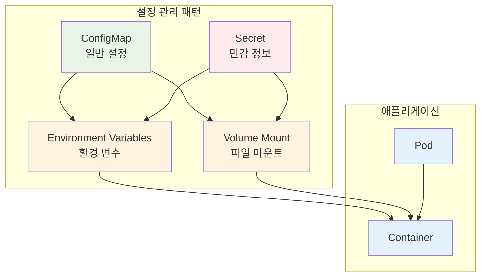
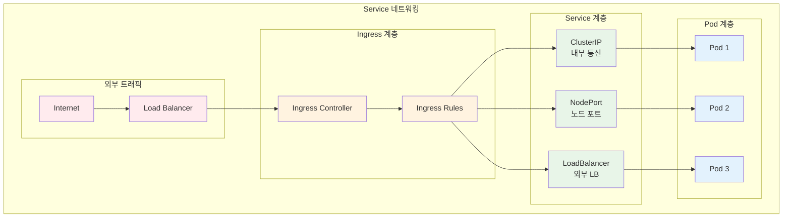
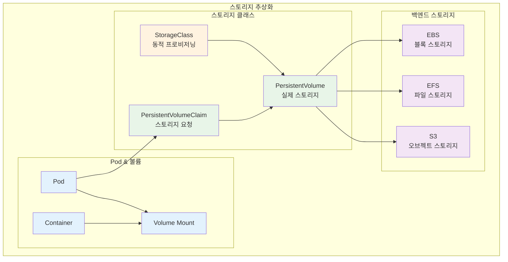
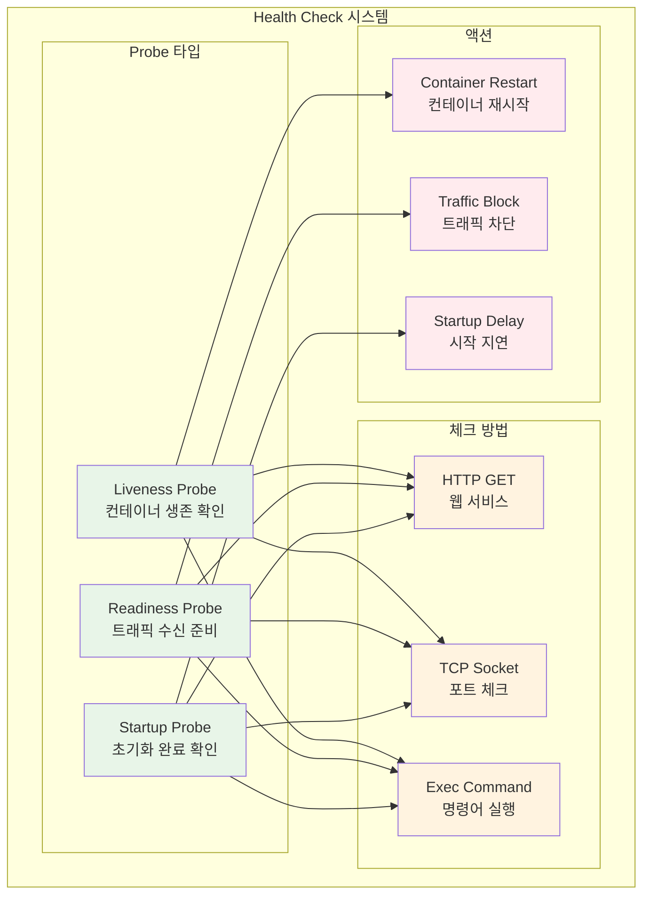

# Week 3 Day 2: 핵심 오브젝트와 워크로드 관리

<div align="center">

**📦 핵심 오브젝트** • **⚙️ 설정 관리** • **🌐 네트워킹**

*ConfigMap부터 Health Probes까지, Kubernetes 핵심 구성요소 마스터*

</div>

---

## 🕘 세션 정보
**시간**: 09:00-11:50 (이론 2.5시간) + 13:00-16:00 (실습 3시간)
**목표**: Kubernetes 핵심 오브젝트 + 설정 관리 + 워크로드 배포 전략
**방식**: 협업 중심 학습 + 레벨별 차별화

## 🎯 세션 목표
### 📚 학습 목표
- **이해 목표**: ConfigMap, Secret, Service, PV/PVC, Health Probes 완전 이해
- **적용 목표**: 실무 수준의 애플리케이션 배포 및 설정 관리
- **협업 목표**: 페어 프로그래밍으로 복잡한 워크로드 구성 경험

---

## 📖 Session 1: ConfigMap & Secret 설정 관리 (50분)

### 🔍 개념 1: ConfigMap 기본 개념 (15분)
> **정의**: 애플리케이션 설정 데이터를 Pod와 분리하여 관리하는 Kubernetes 오브젝트

**ConfigMap 사용 이유**:
- **설정 분리**: 코드와 설정의 완전한 분리
- **환경별 관리**: dev, staging, prod 환경별 다른 설정
- **동적 업데이트**: 애플리케이션 재시작 없이 설정 변경 가능



**ConfigMap 생성 방법**:
```yaml
# 1. YAML 파일로 생성
apiVersion: v1
kind: ConfigMap
metadata:
  name: app-config
data:
  database_url: "postgresql://localhost:5432/mydb"
  log_level: "info"
  config.properties: |
    server.port=8080
    server.host=0.0.0.0
```

### 🔍 개념 2: Secret 보안 관리 (15분)
> **정의**: 패스워드, 토큰, 키 등 민감한 정보를 안전하게 저장하는 오브젝트

**Secret 타입별 특징**:
- **Opaque**: 일반적인 사용자 정의 데이터
- **kubernetes.io/dockerconfigjson**: Docker 레지스트리 인증
- **kubernetes.io/tls**: TLS 인증서와 키
- **kubernetes.io/service-account-token**: ServiceAccount 토큰

**Secret 생성 및 사용**:
```yaml
# Secret 생성
apiVersion: v1
kind: Secret
metadata:
  name: app-secret
type: Opaque
data:
  username: YWRtaW4=  # base64 encoded
  password: MWYyZDFlMmU2N2Rm  # base64 encoded
```

### 🔍 개념 3: Pod에서 ConfigMap/Secret 사용 (15분)
> **정의**: 환경 변수와 볼륨 마운트를 통한 설정 주입 방법

**사용 방법 비교**:
```yaml
apiVersion: v1
kind: Pod
metadata:
  name: app-pod
spec:
  containers:
  - name: app
    image: nginx
    # 환경 변수로 사용
    env:
    - name: DATABASE_URL
      valueFrom:
        configMapKeyRef:
          name: app-config
          key: database_url
    - name: DB_PASSWORD
      valueFrom:
        secretKeyRef:
          name: app-secret
          key: password
    # 볼륨으로 마운트
    volumeMounts:
    - name: config-volume
      mountPath: /etc/config
  volumes:
  - name: config-volume
    configMap:
      name: app-config
```

### 💭 함께 생각해보기 (5분)

**🤝 페어 토론**:
1. "ConfigMap과 Secret을 언제 각각 사용해야 할까요?"
2. "환경 변수와 볼륨 마운트 방식의 장단점은?"

---

## 📖 Session 2: Service & Ingress 네트워킹 (50분)

### 🔍 개념 1: Service 기본 개념 (15분)
> **정의**: Pod 집합에 대한 안정적인 네트워크 엔드포인트를 제공하는 추상화

**Service가 필요한 이유**:
- **Pod IP 변동성**: Pod 재시작 시 IP 주소 변경
- **로드 밸런싱**: 여러 Pod 간 트래픽 분산
- **서비스 디스커버리**: DNS 기반 서비스 발견



### 🔍 개념 2: Service 타입별 특징 (15분)
> **정의**: ClusterIP, NodePort, LoadBalancer, ExternalName 타입별 사용법

**Service 타입 비교**:

| 타입 | 접근 범위 | 사용 목적 | 포트 범위 |
|------|-----------|-----------|-----------|
| **ClusterIP** | 클러스터 내부 | 내부 서비스 통신 | 임의 포트 |
| **NodePort** | 노드 IP:포트 | 개발/테스트 외부 접근 | 30000-32767 |
| **LoadBalancer** | 외부 로드밸런서 | 프로덕션 외부 서비스 | 임의 포트 |
| **ExternalName** | 외부 DNS | 외부 서비스 연결 | - |

**Service 생성 예시**:
```yaml
# ClusterIP Service
apiVersion: v1
kind: Service
metadata:
  name: web-service
spec:
  selector:
    app: web
  ports:
  - port: 80
    targetPort: 8080
  type: ClusterIP
```

### 🔍 개념 3: Ingress 고급 라우팅 (15분)
> **정의**: HTTP/HTTPS 트래픽을 클러스터 내부 서비스로 라우팅하는 규칙

**Ingress 주요 기능**:
- **호스트 기반 라우팅**: 도메인별 서비스 분기
- **경로 기반 라우팅**: URL 경로별 서비스 분기
- **TLS 종료**: HTTPS 인증서 관리
- **로드 밸런싱**: 고급 트래픽 분산

**Ingress 설정 예시**:
```yaml
apiVersion: networking.k8s.io/v1
kind: Ingress
metadata:
  name: web-ingress
spec:
  rules:
  - host: api.example.com
    http:
      paths:
      - path: /v1
        pathType: Prefix
        backend:
          service:
            name: api-v1-service
            port:
              number: 80
  - host: web.example.com
    http:
      paths:
      - path: /
        pathType: Prefix
        backend:
          service:
            name: web-service
            port:
              number: 80
```

### 💭 함께 생각해보기 (5분)

**🤝 페어 토론**:
1. "마이크로서비스 환경에서 Service의 역할은?"
2. "Ingress와 LoadBalancer Service의 차이점은?"

---

## 📖 Session 3: PV/PVC 스토리지 + Health Probes (50분)

### 🔍 개념 1: PersistentVolume & PVC (15분)
> **정의**: 클러스터의 스토리지 리소스와 사용자의 스토리지 요청을 분리하는 추상화



**PVC 생성 및 사용**:
```yaml
# PVC 생성
apiVersion: v1
kind: PersistentVolumeClaim
metadata:
  name: web-pvc
spec:
  accessModes:
  - ReadWriteOnce
  resources:
    requests:
      storage: 10Gi
  storageClassName: gp2

---
# Pod에서 PVC 사용
apiVersion: v1
kind: Pod
metadata:
  name: web-pod
spec:
  containers:
  - name: web
    image: nginx
    volumeMounts:
    - name: web-storage
      mountPath: /var/www/html
  volumes:
  - name: web-storage
    persistentVolumeClaim:
      claimName: web-pvc
```

### 🔍 개념 2: Health Probes 개념 (15분)
> **정의**: 컨테이너의 상태를 확인하고 적절한 조치를 취하는 메커니즘



**Probe 타입별 역할**:
- **Liveness Probe**: 컨테이너가 살아있는지 확인, 실패 시 재시작
- **Readiness Probe**: 트래픽을 받을 준비가 되었는지 확인, 실패 시 Service에서 제외
- **Startup Probe**: 초기화가 완료되었는지 확인, 느린 시작 애플리케이션용

### 🔍 개념 3: 무중단 배포 전략 (15분)
> **정의**: 서비스 중단 없이 애플리케이션을 업데이트하는 배포 방법

**롤링 업데이트 설정**:
```yaml
apiVersion: apps/v1
kind: Deployment
metadata:
  name: web-app
spec:
  replicas: 3
  strategy:
    type: RollingUpdate
    rollingUpdate:
      maxUnavailable: 1
      maxSurge: 1
  template:
    spec:
      containers:
      - name: web
        image: nginx:1.20
        livenessProbe:
          httpGet:
            path: /health
            port: 80
          initialDelaySeconds: 30
          periodSeconds: 10
        readinessProbe:
          httpGet:
            path: /ready
            port: 80
          initialDelaySeconds: 5
          periodSeconds: 5
```

### 💭 함께 생각해보기 (5분)

**🤝 페어 토론**:
1. "데이터베이스 Pod에는 어떤 Probe가 가장 중요할까요?"
2. "무중단 배포에서 Readiness Probe의 역할은?"

---

## 🛠️ 실습 챌린지 (3시간)

### 🎯 실습 개요
**목표**: 실무 수준의 웹 애플리케이션 배포 및 설정 관리

### 🚀 Phase 1: ConfigMap/Secret + Service 구성 (90분)

#### Step 1: ConfigMap과 Secret 생성 (30분)
```bash
# 1. ConfigMap 생성 (명령어 방식)
kubectl create configmap app-config \
  --from-literal=database_url="postgresql://db:5432/myapp" \
  --from-literal=log_level="info" \
  --from-literal=debug="false"

# 2. Secret 생성 (파일 방식)
echo -n 'admin' | base64  # YWRtaW4=
echo -n 'password123' | base64  # cGFzc3dvcmQxMjM=

cat <<EOF | kubectl apply -f -
apiVersion: v1
kind: Secret
metadata:
  name: app-secret
type: Opaque
data:
  username: YWRtaW4=
  password: cGFzc3dvcmQxMjM=
EOF

# 3. 확인
kubectl get configmaps
kubectl get secrets
kubectl describe configmap app-config
```

#### Step 2: 애플리케이션 배포 (30분)
```yaml
# web-app.yaml
apiVersion: apps/v1
kind: Deployment
metadata:
  name: web-app
spec:
  replicas: 2
  selector:
    matchLabels:
      app: web-app
  template:
    metadata:
      labels:
        app: web-app
    spec:
      containers:
      - name: web
        image: nginx:1.20
        env:
        - name: DATABASE_URL
          valueFrom:
            configMapKeyRef:
              name: app-config
              key: database_url
        - name: DB_USERNAME
          valueFrom:
            secretKeyRef:
              name: app-secret
              key: username
        volumeMounts:
        - name: config-volume
          mountPath: /etc/config
        - name: secret-volume
          mountPath: /etc/secret
          readOnly: true
      volumes:
      - name: config-volume
        configMap:
          name: app-config
      - name: secret-volume
        secret:
          secretName: app-secret
```

#### Step 3: Service 생성 및 테스트 (30분)
```yaml
# ClusterIP Service
apiVersion: v1
kind: Service
metadata:
  name: web-service
spec:
  selector:
    app: web-app
  ports:
  - port: 80
    targetPort: 80
  type: ClusterIP

---
# NodePort Service (테스트용)
apiVersion: v1
kind: Service
metadata:
  name: web-nodeport
spec:
  selector:
    app: web-app
  ports:
  - port: 80
    targetPort: 80
    nodePort: 30080
  type: NodePort
```

### 🌟 Phase 2: PV/PVC + Health Probes 구성 (90분)

#### Step 1: StorageClass와 PVC 생성 (30분)
```yaml
# EKS에서 gp2 StorageClass 사용
apiVersion: v1
kind: PersistentVolumeClaim
metadata:
  name: web-pvc
spec:
  accessModes:
  - ReadWriteOnce
  resources:
    requests:
      storage: 5Gi
  storageClassName: gp2

---
# 데이터베이스용 PVC
apiVersion: v1
kind: PersistentVolumeClaim
metadata:
  name: db-pvc
spec:
  accessModes:
  - ReadWriteOnce
  resources:
    requests:
      storage: 10Gi
  storageClassName: gp2
```

#### Step 2: Health Probes 적용 (30분)
```yaml
apiVersion: apps/v1
kind: Deployment
metadata:
  name: web-app-with-probes
spec:
  replicas: 3
  selector:
    matchLabels:
      app: web-app-probes
  template:
    metadata:
      labels:
        app: web-app-probes
    spec:
      containers:
      - name: web
        image: nginx:1.20
        ports:
        - containerPort: 80
        # Liveness Probe
        livenessProbe:
          httpGet:
            path: /
            port: 80
          initialDelaySeconds: 30
          periodSeconds: 10
          timeoutSeconds: 5
          failureThreshold: 3
        # Readiness Probe
        readinessProbe:
          httpGet:
            path: /
            port: 80
          initialDelaySeconds: 5
          periodSeconds: 5
          timeoutSeconds: 3
          failureThreshold: 3
        # Startup Probe
        startupProbe:
          httpGet:
            path: /
            port: 80
          initialDelaySeconds: 10
          periodSeconds: 10
          timeoutSeconds: 5
          failureThreshold: 30
        volumeMounts:
        - name: web-storage
          mountPath: /usr/share/nginx/html
      volumes:
      - name: web-storage
        persistentVolumeClaim:
          claimName: web-pvc
```

#### Step 3: 무중단 배포 테스트 (30분)
```bash
# 1. 현재 상태 확인
kubectl get pods -l app=web-app-probes -w &

# 2. 이미지 업데이트 (롤링 업데이트)
kubectl set image deployment/web-app-with-probes web=nginx:1.21

# 3. 롤아웃 상태 확인
kubectl rollout status deployment/web-app-with-probes

# 4. 롤백 테스트
kubectl rollout undo deployment/web-app-with-probes

# 5. 히스토리 확인
kubectl rollout history deployment/web-app-with-probes
```

### 🏆 Phase 3: Ingress 고급 라우팅 구성 (30분)

#### Ingress Controller 설치 및 설정
```bash
# 1. NGINX Ingress Controller 설치 (EKS)
kubectl apply -f https://raw.githubusercontent.com/kubernetes/ingress-nginx/controller-v1.8.2/deploy/static/provider/aws/deploy.yaml

# 2. Ingress 리소스 생성
cat <<EOF | kubectl apply -f -
apiVersion: networking.k8s.io/v1
kind: Ingress
metadata:
  name: web-ingress
  annotations:
    nginx.ingress.kubernetes.io/rewrite-target: /
spec:
  rules:
  - host: web.local
    http:
      paths:
      - path: /
        pathType: Prefix
        backend:
          service:
            name: web-service
            port:
              number: 80
      - path: /api
        pathType: Prefix
        backend:
          service:
            name: api-service
            port:
              number: 8080
EOF

# 3. 테스트
kubectl get ingress
curl -H "Host: web.local" http://INGRESS-IP/
```

---

## 📝 일일 마무리

### ✅ 오늘의 성과
- [ ] ConfigMap과 Secret으로 설정 관리 완료
- [ ] Service 타입별 네트워킹 구성 성공
- [ ] PV/PVC로 영구 스토리지 구현
- [ ] Health Probes로 애플리케이션 안정성 확보
- [ ] 무중단 배포 전략 실습 완료

### 🎯 내일 준비사항
- **예습**: Resource Requests와 Limits의 차이점
- **복습**: kubectl을 이용한 리소스 관리 명령어
- **환경**: 오늘 생성한 리소스들 정리

---

<div align="center">

**🎉 Day 2 완료!** 

*Kubernetes 핵심 오브젝트를 완전히 마스터했습니다*

</div>