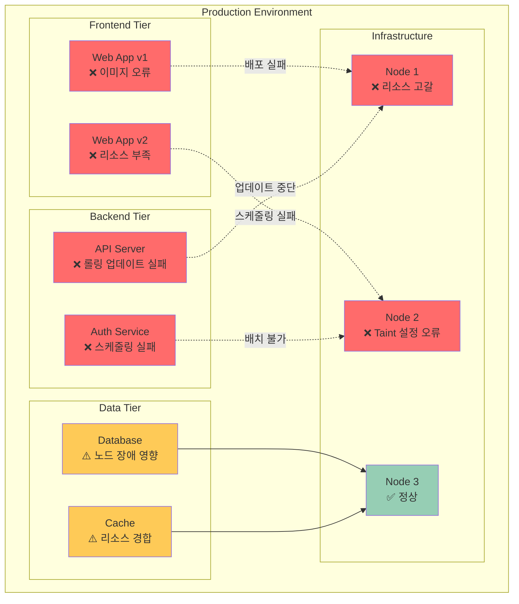

# Challenge 2: 배포 재해 시나리오 (90분)

<div align="center">

**🚨 배포 장애 대응** • **🔧 문제 해결** • **📈 시스템 복구**

*실무에서 발생하는 배포 문제 상황 해결 경험*

</div>

---

## 🎯 Challenge 목표
**시나리오**: 
"DevOps팀의 신입 엔지니어로 입사한 첫날, 여러 마이크로서비스에서 배포 문제가 연달아 발생했습니다. 
선배들은 모두 회의 중이고, 고객들은 서비스 장애를 신고하고 있습니다. 
문제를 빠르게 진단하고 해결해야 합니다!"

## 🌐 시스템 아키텍처



## 🚀 Challenge 시작하기

### 📋 사전 준비
```bash
# Challenge 환경 배포
cd theory/week_03/day2/lab_scripts/challenge1
./deploy-broken.sh
```

**🎯 배포 후 상태**: 
- 4개 서비스에서 각각 다른 유형의 배포 문제 발생
- 고객 서비스 영향도 높음 → 빠른 해결 필요
- 각 시나리오별 20-25분 내 해결 목표

---

## ⚠️ 문제 시나리오들

### 시나리오 1: 이미지 배포 실패 - "새 버전이 시작되지 않아요!" (20분)

**상황**: 프론트엔드 팀이 새로운 기능을 배포했는데 Pod들이 계속 실패 상태

**증상**:
```bash
# Pod 상태 확인
kubectl get pods -l app=frontend
# NAME                        READY   STATUS             RESTARTS   AGE
# frontend-xxx                0/1     ImagePullBackOff   0          5m
# frontend-yyy                0/1     ErrImagePull       0          5m

# Deployment 상태
kubectl get deployments frontend
# NAME       READY   UP-TO-DATE   AVAILABLE   AGE
# frontend   0/3     3            0           5m
```

**문제 파일**: [broken-frontend-deployment.yaml](./lab_scripts/challenge2/broken-frontend-deployment.yaml)

**🔍 진단 과정**:
1. Pod 상세 정보 확인
2. 이벤트 로그 분석
3. 이미지 태그 검증
4. 배포 히스토리 확인

**💡 해결 힌트**:
- 이미지 이름이나 태그에 오타가 있을 수 있습니다
- Docker Hub에서 실제 존재하는 태그인지 확인해보세요
- 이전 버전으로 롤백도 고려해보세요

### 시나리오 2: 리소스 부족으로 스케줄링 실패 (25분)

**상황**: 새로운 마이크로서비스를 배포했는데 Pod들이 Pending 상태에서 멈춤

**증상**:
```bash
# Pod 상태 확인
kubectl get pods -l app=analytics
# NAME                         READY   STATUS    RESTARTS   AGE
# analytics-xxx                0/1     Pending   0          10m
# analytics-yyy                0/1     Pending   0          10m

# 노드 리소스 상태
kubectl describe nodes
# Allocated resources: (Total limits may be over 100 percent)
# CPU Requests: 3800m (95%)
# Memory Requests: 7.5Gi (98%)
```

**문제 파일**: [broken-analytics-deployment.yaml](./lab_scripts/challenge2/broken-analytics-deployment.yaml)

**🔍 진단 과정**:
1. Pod 스케줄링 실패 원인 분석
2. 노드별 리소스 사용량 확인
3. 리소스 요청량 검토
4. 다른 Pod들의 리소스 설정 비교

**💡 해결 힌트**:
- 리소스 요청량이 너무 클 수 있습니다
- 다른 Pod들의 리소스 설정과 비교해보세요
- QoS 클래스를 확인해보세요

### 시나리오 3: 롤링 업데이트 중 서비스 중단 (25분)

**상황**: API 서버 업데이트 중 전체 서비스가 중단되어 고객 불만 폭주

**증상**:
```bash
# Deployment 상태
kubectl get deployments api-server
# NAME         READY   UP-TO-DATE   AVAILABLE   AGE
# api-server   0/5     2            0           15m

# 롤아웃 상태
kubectl rollout status deployment/api-server
# Waiting for deployment "api-server" rollout to finish: 0 of 5 updated replicas are available...
```

**문제 파일**: [broken-api-deployment.yaml](./lab_scripts/challenge2/broken-api-deployment.yaml)

**🔍 진단 과정**:
1. 롤링 업데이트 전략 분석
2. 헬스체크 설정 확인
3. 새 버전 Pod 로그 분석
4. 서비스 연결성 테스트

**💡 해결 힌트**:
- 롤링 업데이트 전략이 너무 공격적일 수 있습니다
- 헬스체크가 제대로 설정되지 않았을 수 있습니다
- 즉시 롤백을 고려해보세요

### 시나리오 4: 노드 장애 시 Pod 재배치 실패 (20분)

**상황**: 노드 하나가 장애가 났는데 중요한 데이터베이스 Pod가 다른 노드로 이동하지 않음

**증상**:
```bash
# 노드 상태
kubectl get nodes
# NAME     STATUS     ROLES    AGE   VERSION
# node-1   NotReady   <none>   1h    v1.28.0
# node-2   Ready      <none>   1h    v1.28.0

# Pod 상태
kubectl get pods -l app=database -o wide
# NAME                        READY   STATUS    NODE     
# database-xxx                1/1     Unknown   node-1   
```

**문제 파일**: [broken-database-deployment.yaml](./lab_scripts/challenge2/broken-database-deployment.yaml)

**🔍 진단 과정**:
1. 노드 장애 상황 분석
2. Pod 재스케줄링 정책 확인
3. Affinity/Anti-Affinity 설정 검토
4. 데이터 영속성 확인

**💡 해결 힌트**:
- Pod가 특정 노드에 고정되어 있을 수 있습니다
- 노드 Affinity 설정을 확인해보세요
- 수동으로 Pod를 삭제해서 재스케줄링을 유도해보세요

---

## 🎯 성공 기준

### 기능적 요구사항
- [ ] 모든 서비스가 정상적으로 실행 중
- [ ] 외부에서 애플리케이션 접근 가능
- [ ] 데이터베이스 연결 및 데이터 무결성 확보
- [ ] 롤링 업데이트가 무중단으로 동작

### 성능 요구사항
- [ ] 서비스 응답 시간 < 2초
- [ ] Pod 시작 시간 < 60초
- [ ] 리소스 사용률 < 80%
- [ ] 고가용성 구성 (단일 장애점 없음)

### 운영 요구사항
- [ ] 모든 Pod가 적절한 노드에 배치
- [ ] 리소스 제한이 적절히 설정
- [ ] 헬스체크가 정상 동작
- [ ] 로그에 ERROR 메시지 없음

---

## 🛠️ 도구 및 명령어 가이드

### 기본 진단 명령어
```bash
# 전체 상태 확인
kubectl get all --all-namespaces

# Pod 상세 정보
kubectl describe pod <pod-name>
kubectl logs <pod-name>

# 이벤트 확인
kubectl get events --sort-by=.metadata.creationTimestamp

# 리소스 사용량
kubectl top nodes
kubectl top pods
```

### 문제 해결 명령어
```bash
# 배포 관리
kubectl rollout status deployment/<name>
kubectl rollout history deployment/<name>
kubectl rollout undo deployment/<name>

# 리소스 수정
kubectl edit deployment <name>
kubectl scale deployment <name> --replicas=3
kubectl set image deployment/<name> container=image:tag

# 강제 재시작
kubectl delete pod <pod-name>
kubectl rollout restart deployment/<name>
```

---

## 🏆 도전 과제 (보너스)

### 고급 해결 방법 (+15점)
1. **자동 복구 스크립트**: 일반적인 배포 문제를 자동으로 감지하고 해결
2. **모니터링 대시보드**: Prometheus + Grafana로 실시간 상태 모니터링
3. **알림 시스템**: 배포 실패 시 자동 알림 및 에스컬레이션
4. **카나리 배포**: 안전한 점진적 배포 전략 구현

### 창의적 해결책 (+10점)
1. **배포 전 검증**: 배포 전 자동 테스트 및 검증 파이프라인
2. **리소스 최적화**: AI 기반 리소스 사용량 예측 및 자동 조정
3. **장애 시뮬레이션**: Chaos Engineering으로 장애 내성 테스트
4. **운영 플레이북**: 단계별 문제 해결 가이드 문서화

---

## 📊 평가 매트릭스

| 영역 | 기본 (60%) | 우수 (80%) | 탁월 (100%) |
|------|------------|------------|--------------|
| **문제 진단** | 증상 파악 | 근본 원인 분석 | 예방 대책 수립 |
| **해결 속도** | 90분 내 완료 | 70분 내 완료 | 50분 내 완료 |
| **해결 품질** | 기본 기능 복구 | 성능 최적화 | 고가용성 구현 |
| **협업** | 개별 문제 해결 | 팀 내 지식 공유 | 전체 팀 멘토링 |

---

## ✅ 성공 검증

### 최종 확인 스크립트
**검증 스크립트**: [verify-success.sh](./lab_scripts/challenge1/verify-success.sh)

```bash
# 전체 시스템 상태 종합 검증
./verify-success.sh
```

**검증 항목**:
- ✅ 모든 Deployment가 Ready 상태
- ✅ Pod들이 적절한 노드에 분산 배치
- ✅ 서비스 접근성 및 응답 시간 확인
- ✅ 리소스 사용량이 적정 수준
- ✅ 헬스체크 및 로그 상태 정상
- ✅ 롤링 업데이트 및 롤백 기능 동작
- ✅ 고가용성 구성 검증

---

## 💡 정말 막혔을 때만 보세요!

### 🆘 힌트가 필요하신가요?

충분히 시도해보셨나요? 로그도 확인해보고, 리소스도 체크해보고, 구글링도 해보셨나요?

그래도 정말 막혔다면... 👇

**힌트 파일**: [hints.md](./lab_scripts/challenge1/hints.md)

⚠️ **주의**: 힌트를 보기 전에 최소 20분은 스스로 시도해보세요. 실무에서는 힌트가 없습니다!

### 🎯 최종 검증

모든 문제를 해결했다고 생각되면:

**검증 스크립트**: [verify-success.sh](./lab_scripts/challenge1/verify-success.sh)

```bash
./verify-success.sh
```

---

<div align="center">

**🚨 배포 장애 전문가** • **🔧 문제 해결 마스터** • **📈 시스템 복구 전문가**

*실무 배포 문제 해결의 모든 것을 경험하다*

</div>
