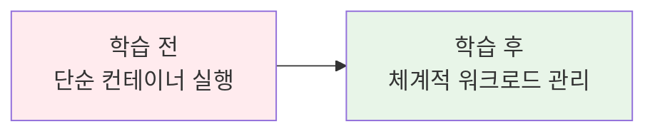
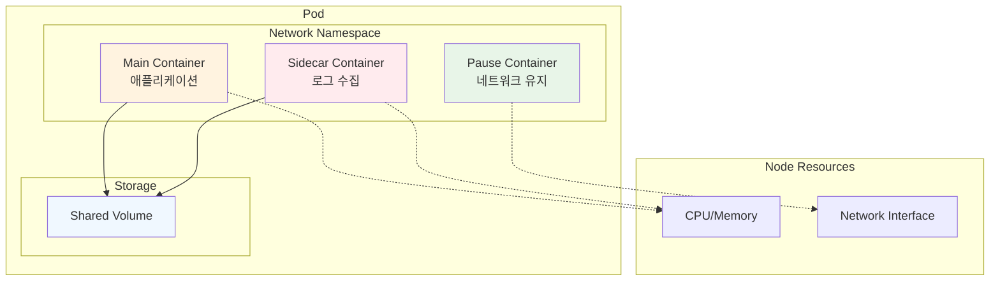
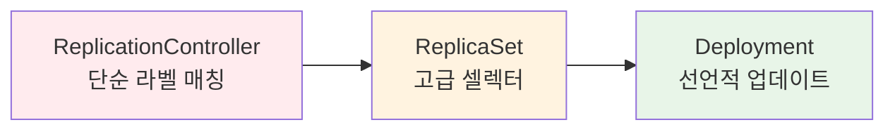
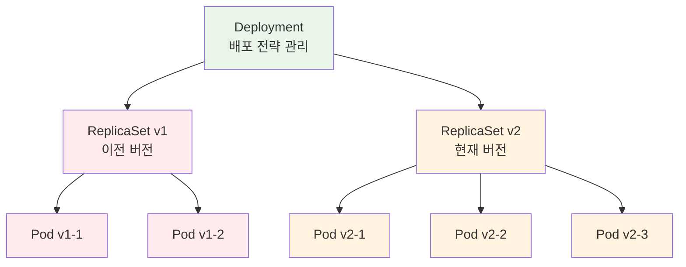

# Week 3 Day 2 Session 1: 기본 워크로드 객체 (50분)

<div align="center">

**🎯 Pod 설계 철학** • **📦 ReplicaSet 진화** • **🚀 Deployment 무중단 배포**

*Kubernetes 워크로드의 기본 단위들과 계층적 관계*

</div>

---

## 🕘 세션 정보
**시간**: 09:00-09:50 (50분)
**목표**: Kubernetes 워크로드의 계층적 구조 완전 이해
**방식**: 개념 설명 + 실시간 데모 + 페어 토론

## 🎯 세션 목표

### 📚 학습 목표
- **이해 목표**: Pod, ReplicaSet, Deployment의 계층적 관계와 각각의 역할
- **적용 목표**: 상황에 맞는 적절한 워크로드 타입 선택 능력
- **협업 목표**: 워크로드 설계 시 팀원과의 효과적 의사소통

### 🤔 왜 필요한가? (5분)

**현실 문제 상황**:
- 💼 **실무 시나리오**: "앱을 배포했는데 갑자기 죽으면 어떻게 하죠?"
- 🏠 **일상 비유**: 아파트(Pod) → 아파트 단지(ReplicaSet) → 도시 계획(Deployment)
- 📊 **시장 동향**: Netflix는 하루에 수천 번 배포하는데 어떻게 무중단이 가능할까?

**학습 전후 비교**:


---

## 📖 핵심 개념 (35분)

### 🔍 개념 1: Pod - 최소 배포 단위의 비밀 (12분)

> **정의**: 하나 이상의 컨테이너를 포함하는 Kubernetes의 최소 실행 단위

**Pod 설계 철학 - 왜 컨테이너가 아닌 Pod인가?**



**Pod의 4가지 핵심 특징**:
1. **네트워크 공유**: 같은 IP, 포트 공간 사용
2. **스토리지 공유**: 볼륨을 여러 컨테이너가 공유
3. **생명주기 공유**: 함께 생성되고 함께 삭제
4. **사이드카 패턴**: 메인 앱 + 보조 서비스 조합

**실무 사용 패턴**:
```yaml
# 단일 컨테이너 Pod (가장 일반적)
apiVersion: v1
kind: Pod
metadata:
  name: web-app
spec:
  containers:
  - name: nginx
    image: nginx:1.20
    ports:
    - containerPort: 80

---
# 멀티 컨테이너 Pod (사이드카 패턴)
apiVersion: v1
kind: Pod
metadata:
  name: web-with-logging
spec:
  containers:
  - name: web-app
    image: nginx:1.20
    volumeMounts:
    - name: logs
      mountPath: /var/log/nginx
  - name: log-shipper
    image: fluent/fluent-bit:1.8
    volumeMounts:
    - name: logs
      mountPath: /var/log/nginx
  volumes:
  - name: logs
    emptyDir: {}
```

### 🔍 개념 2: ReplicaSet - 복제본 관리의 진화 (12분)

> **정의**: 지정된 수의 Pod 복제본이 항상 실행되도록 보장하는 컨트롤러

**ReplicationController → ReplicaSet 진화 과정**:



**ReplicaSet의 핵심 동작 원리**:
1. **Desired State**: 원하는 Pod 개수 선언
2. **Current State**: 현재 실행 중인 Pod 개수 확인
3. **Reconciliation**: 차이가 있으면 Pod 생성/삭제로 조정

**Label Selector의 진화**:
```yaml
# ReplicationController (구식)
selector:
  app: web

# ReplicaSet (신식) - 더 강력한 셀렉터
selector:
  matchLabels:
    app: web
    version: v1
  matchExpressions:
  - key: tier
    operator: In
    values: [frontend, backend]
```

**실무 활용 예시**:
```yaml
apiVersion: apps/v1
kind: ReplicaSet
metadata:
  name: web-replicaset
spec:
  replicas: 3
  selector:
    matchLabels:
      app: web
  template:
    metadata:
      labels:
        app: web
    spec:
      containers:
      - name: nginx
        image: nginx:1.20
        resources:
          requests:
            cpu: 100m
            memory: 128Mi
```

### 🔍 개념 3: Deployment - 무중단 배포의 마법 (11분)

> **정의**: ReplicaSet을 관리하며 선언적 업데이트와 롤백을 제공하는 상위 컨트롤러

**Deployment의 계층적 구조**:



**롤링 업데이트 과정**:
1. **새 ReplicaSet 생성**: 새 버전의 Pod 템플릿으로
2. **점진적 확장**: 새 ReplicaSet의 Pod 수 증가
3. **점진적 축소**: 기존 ReplicaSet의 Pod 수 감소
4. **완료**: 새 버전으로 완전 전환, 기존 ReplicaSet 보존(롤백용)

**배포 전략 비교**:

| 전략 | 특징 | 장점 | 단점 | 사용 시기 |
|------|------|------|------|----------|
| **Recreate** | 모든 Pod 삭제 후 재생성 | 간단, 리소스 절약 | 다운타임 발생 | 개발 환경 |
| **RollingUpdate** | 점진적 교체 | 무중단 배포 | 리소스 2배 필요 | 프로덕션 |

**실무 Deployment 설정**:
```yaml
apiVersion: apps/v1
kind: Deployment
metadata:
  name: web-deployment
spec:
  replicas: 5
  strategy:
    type: RollingUpdate
    rollingUpdate:
      maxUnavailable: 1      # 최대 1개 Pod 중단 허용
      maxSurge: 1           # 최대 1개 Pod 추가 생성 허용
  selector:
    matchLabels:
      app: web
  template:
    metadata:
      labels:
        app: web
        version: v2
    spec:
      containers:
      - name: nginx
        image: nginx:1.21
        readinessProbe:       # 트래픽 받을 준비 확인
          httpGet:
            path: /
            port: 80
          initialDelaySeconds: 5
        livenessProbe:        # 컨테이너 생존 확인
          httpGet:
            path: /
            port: 80
          initialDelaySeconds: 30
```

---

## 💭 함께 생각해보기 (10분)

### 🤝 페어 토론 (5분)
**토론 주제**:
1. **설계 선택**: "언제 Pod를 직접 사용하고, 언제 Deployment를 사용해야 할까요?"
2. **실무 경험**: "롤링 업데이트 중 문제가 생기면 어떻게 대응해야 할까요?"
3. **리소스 최적화**: "ReplicaSet의 replicas 수를 어떻게 결정해야 할까요?"

**페어 활동 가이드**:
- 👥 **경험 공유**: 각자의 배포 경험이나 관련 지식 공유
- 🔄 **역할 교대**: 3분씩 설명자/질문자 역할 바꾸기
- 📝 **핵심 정리**: 대화에서 나온 인사이트 메모

### 🎯 전체 공유 (5분)
- **베스트 프랙티스**: 페어 토론에서 나온 좋은 아이디어
- **실무 팁**: 실제 운영에서 유용한 노하우
- **다음 연결**: Session 2 스케줄링과의 연결고리

### 💡 이해도 체크 질문
- ✅ "Pod, ReplicaSet, Deployment의 관계를 계층적으로 설명할 수 있나요?"
- ✅ "롤링 업데이트가 무중단 배포를 보장하는 원리를 설명할 수 있나요?"
- ✅ "사이드카 패턴이 필요한 실무 상황을 예시로 들 수 있나요?"

---

## 🔑 핵심 키워드

### 🆕 새로운 용어
- **Pod(파드)**: 최소 배포 단위, 하나 이상의 컨테이너 그룹
- **ReplicaSet(레플리카셋)**: Pod 복제본 수 관리 컨트롤러
- **Deployment(디플로이먼트)**: 선언적 업데이트와 롤백 제공
- **Sidecar Pattern(사이드카 패턴)**: 메인 컨테이너 + 보조 컨테이너 조합

### 🔧 기술 용어
- **Rolling Update(롤링 업데이트)**: 점진적 무중단 배포 방식
- **Reconciliation(조정)**: 원하는 상태와 현재 상태 일치시키는 과정
- **Label Selector(라벨 셀렉터)**: 리소스 선택을 위한 쿼리 시스템
- **Readiness/Liveness Probe**: 컨테이너 상태 확인 메커니즘

### 💼 실무 용어
- **Desired State(원하는 상태)**: 선언적으로 정의한 목표 상태
- **Blue-Green Deployment**: 전체 환경 교체 배포 방식
- **Canary Deployment**: 일부 트래픽으로 새 버전 테스트

---

## 🎉 Fun Facts & 실무 인사이트

### 🎭 재미있는 사실들
- **Pod 어원**: 고래 떼(Pod of whales)에서 유래, Docker의 고래 로고와 연결
- **Pause 컨테이너**: 실제로는 단 몇 KB 크기의 초경량 컨테이너
- **ReplicaSet 진화**: ReplicationController → ReplicaSet → Deployment 순으로 발전
- **Netflix 배포**: 하루에 수천 번 배포하지만 99.99% 가용성 유지

### 🏢 기업 사례
**Netflix의 무중단 배포**:
- **문제**: 전 세계 2억 사용자에게 서비스 중단 없이 업데이트
- **해결**: Spinnaker + Kubernetes Deployment로 카나리 배포
- **결과**: 배포 실패율 0.01% 미만, 평균 롤백 시간 2분
- **교훈**: 점진적 배포와 자동 롤백이 핵심

**Spotify의 마이크로서비스**:
- **문제**: 수백 개 마이크로서비스의 복잡한 배포 관리
- **해결**: Deployment + HPA로 각 서비스별 독립적 스케일링
- **결과**: 개발팀별 자율적 배포, 전체 시스템 안정성 향상
- **교훈**: 워크로드 격리와 자동화가 확장성의 열쇠

### 📊 업계 통계
- **Pod 평균 수명**: 프로덕션 환경에서 평균 2-3일 (Netflix 기준)
- **배포 빈도**: 선진 기업들은 하루 평균 10-100회 배포
- **롤백 비율**: 전체 배포의 약 5-10%가 롤백 수행
- **리소스 효율**: Deployment 사용 시 리소스 활용률 평균 70% 향상

---

## 📝 세션 마무리

### ✅ 오늘 세션 성과
- [ ] Pod의 설계 철학과 멀티 컨테이너 패턴 이해
- [ ] ReplicaSet의 복제본 관리 메커니즘 파악
- [ ] Deployment의 무중단 배포 원리 습득
- [ ] 워크로드 타입별 적절한 사용 시점 판단 능력

### 🎯 다음 세션 준비
- **Session 2 예고**: 고급 스케줄링 - Labels, Taints, Affinity
- **연결 포인트**: 오늘 배운 Deployment를 어떤 노드에 배치할지 결정
- **사전 생각**: "모든 Pod가 같은 노드에 배치되면 어떤 문제가 있을까?"

### 🔗 실습 연계
- **Lab 1 준비**: 오늘 배운 3가지 워크로드 타입을 직접 생성하고 관리
- **실무 적용**: 실제 애플리케이션을 단계별로 배포하며 각 단계의 차이점 체험

---

<div align="center">

**🎯 워크로드 계층 이해** • **🚀 무중단 배포 마스터** • **📦 컨테이너 오케스트레이션**

*Pod부터 Deployment까지, Kubernetes 워크로드의 모든 것*

</div>
