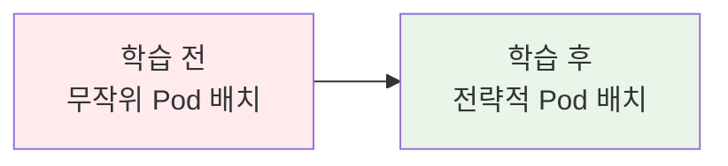
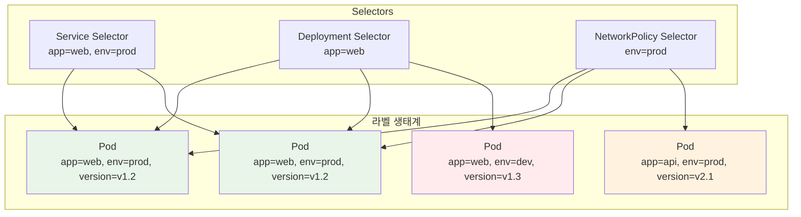
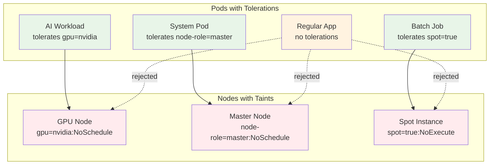
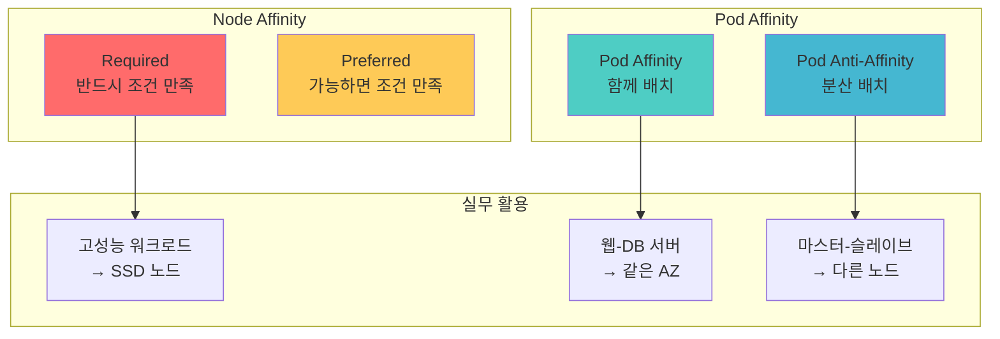

# Week 3 Day 2 Session 2: 고급 스케줄링 (50분)

<div align="center">

**🏷️ Labels & Selectors** • **🚫 Taints & Tolerations** • **🧲 Node/Pod Affinity**

*정교한 Pod 배치 전략과 스케줄링 최적화*

</div>

---

## 🕘 세션 정보
**시간**: 10:00-10:50 (50분)
**목표**: Kubernetes 스케줄링 메커니즘과 고급 배치 전략 마스터
**방식**: 실시간 데모 + 시나리오 분석 + 팀 토론

## 🎯 세션 목표

### 📚 학습 목표
- **이해 목표**: 라벨링 시스템과 스케줄링 제약 조건의 동작 원리
- **적용 목표**: 실무 상황에 맞는 최적의 Pod 배치 전략 수립
- **협업 목표**: 스케줄링 정책 설계 시 팀원과의 효과적 의사결정

### 🤔 왜 필요한가? (5분)

**현실 문제 상황**:
- 💼 **실무 시나리오**: "GPU 노드에만 AI 워크로드를 배치하고 싶어요"
- 🏠 **일상 비유**: 아파트 배정 - 층수 선호, 금연/흡연, 반려동물 허용 여부
- 📊 **시장 동향**: AWS EKS에서 Spot Instance와 On-Demand 혼합 사용 전략

**학습 전후 비교**:


---

## 📖 핵심 개념 (35분)

### 🔍 개념 1: Labels & Selectors - Kubernetes의 DNA (12분)

> **정의**: 리소스를 식별하고 그룹화하기 위한 key-value 쌍의 메타데이터 시스템

**라벨링 시스템의 철학**:



**라벨 설계 베스트 프랙티스**:
```yaml
# 권장 라벨 구조
metadata:
  labels:
    # 애플리케이션 식별
    app.kubernetes.io/name: nginx
    app.kubernetes.io/instance: web-frontend
    app.kubernetes.io/version: "1.20.0"
    app.kubernetes.io/component: frontend
    app.kubernetes.io/part-of: ecommerce-platform
    
    # 운영 관리
    environment: production
    tier: frontend
    team: platform
    cost-center: engineering
```

**Selector의 진화**:
```yaml
# 기본 매칭 (equality-based)
selector:
  matchLabels:
    app: web
    version: v1

# 고급 매칭 (set-based)
selector:
  matchExpressions:
  - key: app
    operator: In
    values: [web, api]
  - key: version
    operator: NotIn
    values: [v0.1, v0.2]
  - key: environment
    operator: Exists
  - key: deprecated
    operator: DoesNotExist
```

### 🔍 개념 2: Taints & Tolerations - 노드의 호불호 시스템 (12분)

> **정의**: 노드가 특정 Pod를 거부(Taint)하고, Pod가 그 거부를 참아낼 수 있는(Toleration) 메커니즘

**Taint & Toleration 동작 원리**:



**Taint Effect 종류**:
1. **NoSchedule**: 새로운 Pod 스케줄링 금지
2. **PreferNoSchedule**: 가능하면 스케줄링 피함 (soft)
3. **NoExecute**: 기존 Pod도 제거 (가장 강력)

**실무 Taint 활용 예시**:
```bash
# GPU 노드에 Taint 설정
kubectl taint nodes gpu-node-1 gpu=nvidia:NoSchedule

# 마스터 노드 Taint (자동 설정됨)
kubectl taint nodes master-node node-role.kubernetes.io/master:NoSchedule

# Spot Instance Taint
kubectl taint nodes spot-node-1 spot=true:NoExecute
```

**Toleration 설정**:
```yaml
apiVersion: v1
kind: Pod
spec:
  tolerations:
  # GPU Taint 허용
  - key: "gpu"
    operator: "Equal"
    value: "nvidia"
    effect: "NoSchedule"
  
  # 모든 Spot Instance Taint 허용
  - key: "spot"
    operator: "Exists"
    effect: "NoExecute"
    tolerationSeconds: 300  # 5분 후 제거
```

### 🔍 개념 3: Node & Pod Affinity - 스마트한 배치 전략 (11분)

> **정의**: Pod가 특정 노드나 다른 Pod와 함께 또는 떨어져서 배치되도록 하는 선호도 규칙

**Affinity 종류와 특징**:



**Node Affinity 실무 예시**:
```yaml
apiVersion: v1
kind: Pod
spec:
  affinity:
    nodeAffinity:
      # 필수 조건: SSD 스토리지 노드
      requiredDuringSchedulingIgnoredDuringExecution:
        nodeSelectorTerms:
        - matchExpressions:
          - key: storage-type
            operator: In
            values: [ssd]
      
      # 선호 조건: 고성능 CPU 노드
      preferredDuringSchedulingIgnoredDuringExecution:
      - weight: 100
        preference:
          matchExpressions:
          - key: cpu-type
            operator: In
            values: [high-performance]
```

**Pod Anti-Affinity로 고가용성 구현**:
```yaml
apiVersion: apps/v1
kind: Deployment
spec:
  template:
    spec:
      affinity:
        podAntiAffinity:
          # 같은 앱의 다른 Pod와 다른 노드에 배치
          requiredDuringSchedulingIgnoredDuringExecution:
          - labelSelector:
              matchExpressions:
              - key: app
                operator: In
                values: [web]
            topologyKey: kubernetes.io/hostname
          
          # 가능하면 다른 가용 영역에 배치
          preferredDuringSchedulingIgnoredDuringExecution:
          - weight: 100
            podAffinityTerm:
              labelSelector:
                matchExpressions:
                - key: app
                  operator: In
                  values: [web]
              topologyKey: topology.kubernetes.io/zone
```

**실무 배치 전략 예시**:

| 시나리오 | 전략 | 구현 방법 |
|----------|------|-----------|
| **데이터베이스** | 고성능 스토리지 필수 | Node Affinity (SSD) |
| **웹 서버** | 고가용성 분산 배치 | Pod Anti-Affinity |
| **캐시 서버** | 웹 서버와 같은 위치 | Pod Affinity |
| **AI 워크로드** | GPU 노드 전용 | Taint + Toleration |
| **배치 작업** | Spot Instance 활용 | Node Affinity + Toleration |

---

## 💭 함께 생각해보기 (10분)

### 🤝 팀 토론 (7분)
**토론 주제**: "실무 스케줄링 전략 설계"

**시나리오**: 
```
전자상거래 플랫폼 운영 중
- 웹 프론트엔드: 고가용성 필요
- API 서버: 데이터베이스와 가까운 위치
- 데이터베이스: 고성능 스토리지 필수
- 배치 작업: 비용 절약을 위해 Spot Instance 활용
- AI 추천 엔진: GPU 노드 전용
```

**토론 가이드**:
1. **라벨 설계**: 어떤 라벨을 사용해서 리소스를 분류할까?
2. **Taint 전략**: 어떤 노드에 어떤 Taint를 설정할까?
3. **Affinity 규칙**: 각 워크로드의 배치 전략은?

### 🎯 전체 공유 (3분)
- **베스트 전략**: 각 팀의 스케줄링 전략 발표
- **실무 고려사항**: 비용, 성능, 가용성 균형점
- **다음 연결**: Session 3 리소스 관리와의 연계

### 💡 이해도 체크 질문
- ✅ "Taint와 Toleration의 차이점과 각각의 역할을 설명할 수 있나요?"
- ✅ "Pod Anti-Affinity가 고가용성에 도움이 되는 이유를 설명할 수 있나요?"
- ✅ "실무에서 라벨을 어떻게 체계적으로 설계해야 하는지 아시나요?"

---

## 🔑 핵심 키워드

### 🆕 새로운 용어
- **Labels(라벨)**: 리소스 식별을 위한 key-value 메타데이터
- **Selectors(셀렉터)**: 라벨을 이용한 리소스 선택 쿼리
- **Taints(테인트)**: 노드가 특정 Pod를 거부하는 표시
- **Tolerations(톨러레이션)**: Pod가 Taint를 참아내는 능력

### 🔧 기술 용어
- **Node Affinity(노드 어피니티)**: Pod의 노드 선호도 규칙
- **Pod Affinity(파드 어피니티)**: Pod 간 함께 배치 선호도
- **Anti-Affinity(안티 어피니티)**: Pod 간 분산 배치 선호도
- **Topology Key(토폴로지 키)**: 배치 기준이 되는 노드 속성

### 💼 실무 용어
- **Required vs Preferred**: 필수 조건 vs 선호 조건
- **Hard vs Soft Constraints**: 강제 제약 vs 유연한 제약
- **Topology Spread**: 토폴로지 기반 Pod 분산 배치

---

## 🎉 Fun Facts & 실무 인사이트

### 🎭 재미있는 사실들
- **라벨 한계**: 최대 63자까지 가능하며 유니코드도 지원
- **Taint 어원**: "오염"이라는 뜻으로 특별한 용도를 나타냄
- **Affinity 유래**: 화학에서 원소 간 친화력을 나타내는 용어에서 차용
- **스케줄러 복잡도**: 대규모 클러스터에서는 수백 개 조건을 동시 고려

### 🏢 기업 사례
**Airbnb의 멀티 테넌트 클러스터**:
- **문제**: 수천 개 마이크로서비스의 효율적 배치
- **해결**: 라벨 기반 네임스페이스 분리 + Affinity 규칙
- **결과**: 리소스 활용률 40% 향상, 배치 시간 60% 단축
- **교훈**: 체계적인 라벨링이 운영 효율성의 핵심

**Spotify의 고가용성 전략**:
- **문제**: 음악 스트리밍 서비스의 무중단 운영
- **해결**: Pod Anti-Affinity로 서비스별 분산 배치
- **결과**: 단일 장애점 제거, 99.95% 가용성 달성
- **교훈**: Anti-Affinity가 진정한 고가용성의 열쇠

### 📊 업계 통계
- **라벨 사용률**: 프로덕션 클러스터에서 평균 Pod당 8-12개 라벨 사용
- **Taint 활용**: 전체 노드의 약 30%가 특수 목적 Taint 설정
- **스케줄링 실패율**: 적절한 Affinity 설정 시 0.1% 미만
- **성능 향상**: 전략적 배치로 네트워크 지연시간 평균 25% 감소

---

## 📝 세션 마무리

### ✅ 오늘 세션 성과
- [ ] 라벨링 시스템의 설계 원칙과 베스트 프랙티스 이해
- [ ] Taint/Toleration을 이용한 노드 전용화 전략 습득
- [ ] Affinity 규칙을 통한 고가용성 및 성능 최적화 방법 파악
- [ ] 실무 시나리오별 적절한 스케줄링 전략 수립 능력

### 🎯 다음 세션 준비
- **Session 3 예고**: 리소스 관리 & 특수 워크로드
- **연결 포인트**: 스케줄링된 Pod의 리소스 사용량 관리
- **사전 생각**: "Pod가 너무 많은 CPU를 사용하면 어떻게 제한할까?"

### 🔗 실습 연계
- **Lab 1 적용**: 오늘 배운 스케줄링 전략을 실제 워크로드에 적용
- **Challenge 2 준비**: 스케줄링 실패 시나리오 해결 능력 향상

---

<div align="center">

**🏷️ 라벨링 마스터** • **🚫 스케줄링 제약** • **🧲 전략적 배치**

*Kubernetes 스케줄링의 모든 것을 마스터하다*

</div>
