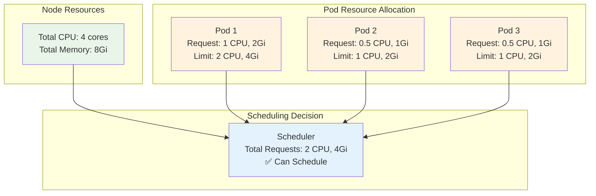
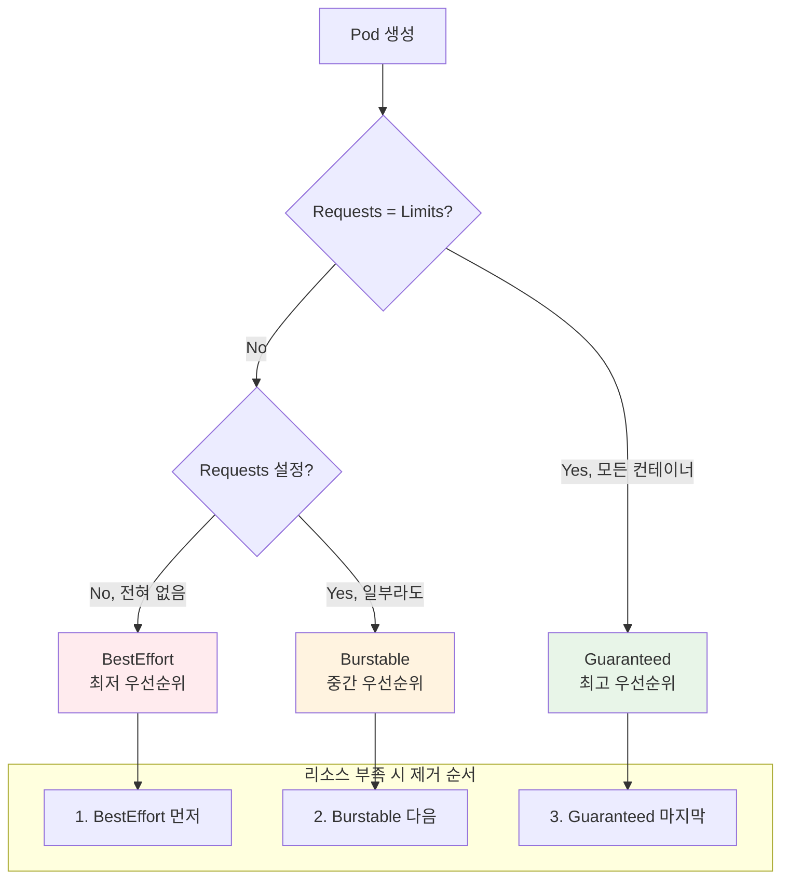
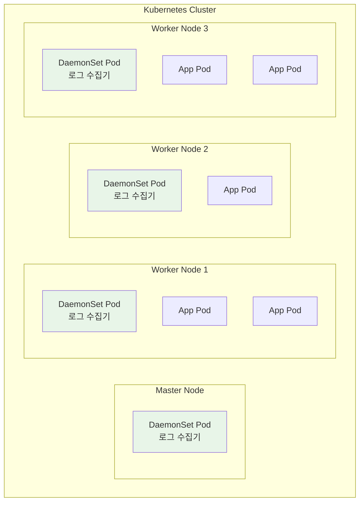
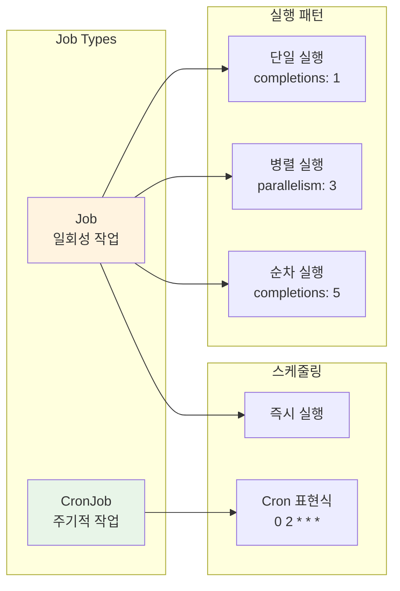

# Week 3 Day 2 Session 3: 리소스 관리 & 특수 워크로드 (50분)

<div align="center">

**⚖️ Resource Limits** • **🏆 QoS Classes** • **👹 DaemonSets** • **⏰ Jobs & CronJobs**

*리소스 관리와 특수 목적 워크로드 활용*

</div>

---

## 🕘 세션 정보
**시간**: 11:00-11:50 (50분)
**목표**: 리소스 관리 전략과 특수 워크로드 타입 완전 이해
**방식**: 실시간 리소스 모니터링 + 시나리오 기반 학습

## 🎯 세션 목표

### 📚 학습 목표
- **이해 목표**: CPU/Memory 리소스 관리와 QoS 클래스 시스템
- **적용 목표**: 워크로드 특성에 맞는 적절한 리소스 할당 전략
- **협업 목표**: 리소스 최적화를 위한 팀 차원의 의사결정 프로세스

### 🤔 왜 필요한가? (5분)

**현실 문제 상황**:
- 💼 **실무 시나리오**: "Pod 하나가 전체 노드 리소스를 독점해서 다른 앱이 죽었어요"
- 🏠 **일상 비유**: 아파트 전기/수도 사용량 제한 - 한 집이 너무 많이 쓰면 전체 문제
- 📊 **시장 동향**: AWS Fargate는 정확한 리소스 할당으로 비용 최적화

**학습 전후 비교**:


---

## 📖 핵심 개념 (35분)

### 🔍 개념 1: Resource Requests & Limits - 리소스 관리의 균형점 (12분)

> **정의**: Pod가 사용할 리소스의 최소 보장량(Requests)과 최대 허용량(Limits) 설정

**리소스 관리의 핵심 철학**:



**Requests vs Limits 차이점**:

| 구분 | Requests | Limits |
|------|----------|--------|
| **목적** | 최소 보장 리소스 | 최대 사용 리소스 |
| **스케줄링** | 스케줄링 결정 기준 | 스케줄링에 영향 없음 |
| **초과 시** | 다른 Pod가 사용 가능 | 컨테이너 종료/제한 |
| **필수성** | 권장 | 필수 (특히 Memory) |

**실무 리소스 설정 예시**:
```yaml
apiVersion: v1
kind: Pod
spec:
  containers:
  - name: web-app
    image: nginx:1.20
    resources:
      requests:
        cpu: 100m        # 0.1 CPU 보장
        memory: 128Mi    # 128MB 보장
      limits:
        cpu: 500m        # 최대 0.5 CPU
        memory: 512Mi    # 최대 512MB (초과 시 OOMKilled)
  
  - name: sidecar
    image: fluent-bit:1.8
    resources:
      requests:
        cpu: 50m
        memory: 64Mi
      limits:
        cpu: 100m
        memory: 128Mi
```

**리소스 단위 이해**:
```yaml
# CPU 단위
cpu: 1        # 1 CPU 코어
cpu: 1000m    # 1000 밀리코어 = 1 CPU 코어
cpu: 0.5      # 0.5 CPU 코어
cpu: 500m     # 500 밀리코어 = 0.5 CPU 코어

# Memory 단위
memory: 1Gi   # 1 기비바이트 (1024^3 bytes)
memory: 1G    # 1 기가바이트 (1000^3 bytes)
memory: 512Mi # 512 메비바이트
memory: 128M  # 128 메가바이트
```

### 🔍 개념 2: QoS Classes - 리소스 우선순위 시스템 (12분)

> **정의**: Pod의 리소스 설정에 따라 자동으로 결정되는 서비스 품질 등급

**QoS 클래스 자동 분류 시스템**:



**QoS 클래스별 특징과 활용**:

| QoS Class | 조건 | 특징 | 실무 활용 |
|-----------|------|------|-----------|
| **Guaranteed** | requests = limits | 최고 우선순위, 안정적 | 데이터베이스, 중요 서비스 |
| **Burstable** | requests < limits | 중간 우선순위, 유연함 | 웹 서버, API 서버 |
| **BestEffort** | 설정 없음 | 최저 우선순위, 불안정 | 배치 작업, 테스트 |

**실무 QoS 설정 예시**:
```yaml
# Guaranteed QoS - 중요한 데이터베이스
apiVersion: v1
kind: Pod
metadata:
  name: database
spec:
  containers:
  - name: postgres
    resources:
      requests:
        cpu: 2
        memory: 4Gi
      limits:
        cpu: 2          # requests와 동일
        memory: 4Gi     # requests와 동일

---
# Burstable QoS - 일반적인 웹 서버
apiVersion: v1
kind: Pod
metadata:
  name: web-server
spec:
  containers:
  - name: nginx
    resources:
      requests:
        cpu: 100m
        memory: 128Mi
      limits:
        cpu: 500m       # requests보다 큼
        memory: 512Mi   # requests보다 큼

---
# BestEffort QoS - 배치 작업
apiVersion: v1
kind: Pod
metadata:
  name: batch-job
spec:
  containers:
  - name: worker
    # 리소스 설정 없음
    image: batch-processor:latest
```

### 🔍 개념 3: 특수 워크로드 - DaemonSet, Jobs, CronJobs (11분)

> **정의**: 특별한 목적을 위해 설계된 워크로드 컨트롤러들

**DaemonSet - 모든 노드의 수호천사**:



**DaemonSet 실무 활용 사례**:
```yaml
apiVersion: apps/v1
kind: DaemonSet
metadata:
  name: fluent-bit
spec:
  selector:
    matchLabels:
      name: fluent-bit
  template:
    metadata:
      labels:
        name: fluent-bit
    spec:
      containers:
      - name: fluent-bit
        image: fluent/fluent-bit:1.8
        volumeMounts:
        - name: varlog
          mountPath: /var/log
        - name: varlibdockercontainers
          mountPath: /var/lib/docker/containers
          readOnly: true
      volumes:
      - name: varlog
        hostPath:
          path: /var/log
      - name: varlibdockercontainers
        hostPath:
          path: /var/lib/docker/containers
```

**Jobs & CronJobs - 배치 작업의 자동화**:



**실무 Job 활용 예시**:
```yaml
# 일회성 데이터 마이그레이션
apiVersion: batch/v1
kind: Job
metadata:
  name: data-migration
spec:
  completions: 1
  parallelism: 1
  backoffLimit: 3
  template:
    spec:
      containers:
      - name: migrator
        image: data-migrator:v1.0
        command: ["python", "migrate.py"]
      restartPolicy: Never

---
# 주기적 백업 작업
apiVersion: batch/v1
kind: CronJob
metadata:
  name: database-backup
spec:
  schedule: "0 2 * * *"  # 매일 새벽 2시
  jobTemplate:
    spec:
      template:
        spec:
          containers:
          - name: backup
            image: postgres:13
            command:
            - /bin/bash
            - -c
            - pg_dump $DATABASE_URL > /backup/db-$(date +%Y%m%d).sql
          restartPolicy: OnFailure
  successfulJobsHistoryLimit: 3
  failedJobsHistoryLimit: 1
```

**특수 워크로드 비교표**:

| 워크로드 | 목적 | 실행 패턴 | 실무 사용 사례 |
|----------|------|-----------|----------------|
| **DaemonSet** | 모든 노드에 하나씩 | 지속적 실행 | 로깅, 모니터링, 네트워크 |
| **Job** | 일회성 작업 | 완료 시까지 | 데이터 처리, 마이그레이션 |
| **CronJob** | 주기적 작업 | 스케줄 기반 | 백업, 정리, 리포트 생성 |

---

## 💭 함께 생각해보기 (10분)

### 🤝 페어 토론 (7분)
**토론 주제**: "리소스 최적화 전략"

**시나리오 분석**:
```
마이크로서비스 플랫폼 운영 중
- 웹 서버: 트래픽 변동이 큰 서비스
- 데이터베이스: 안정적 성능이 중요
- 배치 작업: 야간에 대용량 데이터 처리
- 로그 수집: 모든 노드에서 로그 수집 필요
```

**토론 가이드**:
1. **리소스 할당**: 각 서비스별 적절한 requests/limits는?
2. **QoS 전략**: 어떤 서비스를 어떤 QoS로 설정할까?
3. **특수 워크로드**: DaemonSet, Job, CronJob 활용 방안은?

### 🎯 전체 공유 (3분)
- **최적화 전략**: 각 페어의 리소스 최적화 아이디어
- **실무 경험**: 리소스 관리 관련 경험담 공유
- **Lab 연결**: 오후 실습에서 적용할 리소스 설정 전략

### 💡 이해도 체크 질문
- ✅ "Requests와 Limits의 차이점과 각각의 역할을 설명할 수 있나요?"
- ✅ "QoS 클래스가 자동으로 결정되는 규칙을 설명할 수 있나요?"
- ✅ "DaemonSet이 필요한 실무 상황을 3가지 이상 말할 수 있나요?"

---

## 🔑 핵심 키워드

### 🆕 새로운 용어
- **Requests(요청량)**: Pod가 보장받을 최소 리소스량
- **Limits(제한량)**: Pod가 사용할 수 있는 최대 리소스량
- **QoS Classes**: 서비스 품질 등급 (Guaranteed, Burstable, BestEffort)
- **DaemonSet(데몬셋)**: 모든 노드에 하나씩 배치되는 워크로드

### 🔧 기술 용어
- **OOMKilled**: 메모리 부족으로 컨테이너가 강제 종료됨
- **CPU Throttling**: CPU 사용량이 제한에 도달했을 때 성능 제한
- **Resource Quotas**: 네임스페이스별 리소스 사용량 제한
- **LimitRange**: 개별 리소스의 최소/최대값 제한

### 💼 실무 용어
- **Right-sizing**: 적절한 리소스 크기 설정
- **Resource Utilization**: 리소스 활용률
- **Capacity Planning**: 용량 계획 및 예측
- **Cost Optimization**: 비용 최적화

---

## 🎉 Fun Facts & 실무 인사이트

### 🎭 재미있는 사실들
- **CPU 단위**: 1000m = 1 CPU 코어, m은 "milli"의 줄임말
- **메모리 단위**: Gi는 1024 기반, G는 1000 기반 (약 7% 차이)
- **DaemonSet 예외**: 마스터 노드는 기본적으로 제외 (Taint 때문)
- **Job vs CronJob**: Job은 일회성, CronJob은 Job을 주기적으로 생성

### 🏢 기업 사례
**Netflix의 리소스 최적화**:
- **문제**: 수천 개 마이크로서비스의 리소스 낭비
- **해결**: 머신러닝 기반 자동 리소스 추천 시스템
- **결과**: 평균 리소스 사용률 40% → 70% 향상, 연간 수백만 달러 절약
- **교훈**: 데이터 기반 리소스 최적화가 핵심

**Shopify의 QoS 전략**:
- **문제**: Black Friday 같은 트래픽 급증 시 서비스 안정성
- **해결**: 중요 서비스는 Guaranteed, 부가 서비스는 Burstable로 분리
- **결과**: 99.99% 가용성 달성, 리소스 효율성 30% 향상
- **교훈**: QoS 기반 우선순위 관리가 안정성의 열쇠

### 📊 업계 통계
- **리소스 낭비**: 평균적으로 할당된 리소스의 60%만 실제 사용
- **QoS 분포**: Guaranteed 20%, Burstable 70%, BestEffort 10%
- **DaemonSet 활용**: 전체 Pod의 약 5-10%가 DaemonSet으로 실행
- **배치 작업**: CronJob 사용률이 매년 25% 증가 추세

---

## 📝 세션 마무리

### ✅ 오늘 세션 성과
- [ ] 리소스 Requests/Limits의 차이점과 설정 전략 이해
- [ ] QoS 클래스 자동 분류 시스템과 우선순위 메커니즘 파악
- [ ] DaemonSet, Job, CronJob의 특징과 실무 활용 방법 습득
- [ ] 워크로드별 적절한 리소스 할당 전략 수립 능력

### 🎯 실습 연계
- **Lab 1 적용**: 오늘 배운 리소스 관리 전략을 실제 워크로드에 적용
- **Challenge 2 준비**: 리소스 부족 시나리오와 특수 워크로드 문제 해결

### 🔗 다음 학습 연결
- **Day 3 예고**: 네트워킹 & 스토리지 - 서비스와 데이터 관리
- **연결 포인트**: 리소스가 할당된 Pod들 간의 통신과 데이터 공유

---

<div align="center">

**⚖️ 리소스 마스터** • **🏆 QoS 전문가** • **👹 특수 워크로드** • **⏰ 배치 자동화**

*Kubernetes 리소스 관리의 모든 것을 완전 정복*

</div>
