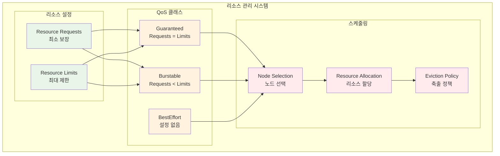

# Week 3 Day 3: 리소스 관리와 스케줄링

<div align="center">

**⚖️ 리소스 관리** • **📊 QoS 클래스** • **🎯 스케줄링**

*Resource Management부터 Namespace까지, 효율적인 클러스터 운영*

</div>

---

## 🕘 세션 정보
**시간**: 09:00-11:50 (이론 2.5시간) + 13:00-16:00 (실습 3시간)
**목표**: Resource Management + QoS + 스케줄링 정책 + 네임스페이스 관리
**방식**: 협업 중심 학습 + 레벨별 차별화

## 🎯 세션 목표
### 📚 학습 목표
- **이해 목표**: Resource 관리, QoS 클래스, 스케줄링 정책 완전 이해
- **적용 목표**: 효율적인 리소스 사용과 고가용성 배치 전략 구현
- **협업 목표**: 팀별로 멀티 테넌트 환경 구성 및 관리

---

## 📖 Session 1: Resource Requests/Limits + QoS Classes (50분)

### 🔍 개념 1: Resource Requests와 Limits (15분)
> **정의**: Pod가 사용할 리소스의 최소 보장량과 최대 제한량을 설정하는 메커니즘

**Resource 관리의 필요성**:
- **리소스 경합 방지**: 한 Pod가 모든 리소스를 독점하는 것 방지
- **성능 예측**: 애플리케이션 성능의 일관성 보장
- **비용 최적화**: 적절한 리소스 할당으로 비용 효율성 향상



**Resource 설정 예시**:
```yaml
apiVersion: v1
kind: Pod
metadata:
  name: resource-demo
spec:
  containers:
  - name: app
    image: nginx
    resources:
      requests:
        memory: "128Mi"
        cpu: "100m"
      limits:
        memory: "256Mi"
        cpu: "200m"
```

### 🔍 개념 2: QoS Classes 이해 (15분)
> **정의**: Pod의 리소스 설정에 따라 자동으로 할당되는 서비스 품질 클래스

**QoS 클래스별 특징**:

| QoS 클래스 | 조건 | 우선순위 | 축출 순서 |
|------------|------|----------|-----------|
| **Guaranteed** | Requests = Limits | 최고 | 마지막 |
| **Burstable** | Requests < Limits | 중간 | 중간 |
| **BestEffort** | 설정 없음 | 최저 | 첫 번째 |

**QoS 클래스 예시**:
```yaml
# Guaranteed QoS
resources:
  requests:
    memory: "256Mi"
    cpu: "200m"
  limits:
    memory: "256Mi"
    cpu: "200m"

---
# Burstable QoS
resources:
  requests:
    memory: "128Mi"
    cpu: "100m"
  limits:
    memory: "256Mi"
    cpu: "200m"

---
# BestEffort QoS
# resources 설정 없음
```

### 🔍 개념 3: 리소스 모니터링과 최적화 (15분)
> **정의**: 실제 리소스 사용량을 모니터링하고 설정을 최적화하는 방법

**리소스 모니터링 도구**:
- **kubectl top**: 기본 리소스 사용량 확인
- **Metrics Server**: 클러스터 메트릭 수집
- **VPA (Vertical Pod Autoscaler)**: 자동 리소스 추천
- **Prometheus**: 상세한 메트릭 수집 및 분석

**리소스 최적화 전략**:
```bash
# 1. 현재 리소스 사용량 확인
kubectl top nodes
kubectl top pods

# 2. Pod 리소스 사용량 상세 확인
kubectl describe pod <pod-name>

# 3. VPA 추천값 확인 (VPA 설치 후)
kubectl get vpa <vpa-name> -o yaml
```

### 💭 함께 생각해보기 (5분)

**🤝 페어 토론**:
1. "웹 서버와 데이터베이스 Pod의 리소스 설정이 다른 이유는?"
2. "QoS 클래스가 실제 운영에 미치는 영향은?"

---

## 📖 Session 2: Node Affinity + Pod Anti-Affinity 스케줄링 (50분)

### 🔍 개념 1: Node Affinity 기본 개념 (15분)
> **정의**: Pod를 특정 노드에 배치하거나 배치하지 않도록 제어하는 스케줄링 규칙

**Node Affinity 타입**:
- **requiredDuringSchedulingIgnoredDuringExecution**: 필수 조건 (Hard)
- **preferredDuringSchedulingIgnoredDuringExecution**: 선호 조건 (Soft)

**Node Affinity 사용 사례**:
- **하드웨어 요구사항**: GPU가 있는 노드에만 ML 워크로드 배치
- **지역 분산**: 다른 가용 영역의 노드에 Pod 분산
- **성능 최적화**: SSD가 있는 노드에 데이터베이스 배치

```yaml
# Node Affinity 예시
apiVersion: v1
kind: Pod
metadata:
  name: node-affinity-demo
spec:
  affinity:
    nodeAffinity:
      requiredDuringSchedulingIgnoredDuringExecution:
        nodeSelectorTerms:
        - matchExpressions:
          - key: kubernetes.io/arch
            operator: In
            values:
            - amd64
      preferredDuringSchedulingIgnoredDuringExecution:
      - weight: 100
        preference:
          matchExpressions:
          - key: node-type
            operator: In
            values:
            - ssd
  containers:
  - name: app
    image: nginx
```

### 🔍 개념 2: Pod Anti-Affinity 고가용성 (15분)
> **정의**: Pod 간의 배치 관계를 제어하여 고가용성과 성능을 보장하는 메커니즘

**Pod Anti-Affinity 전략**:
- **고가용성**: 같은 애플리케이션의 Pod를 다른 노드에 분산
- **성능 격리**: 리소스 집약적인 Pod들을 분리
- **장애 도메인 분산**: 다른 가용 영역에 Pod 배치

```yaml
# Pod Anti-Affinity 예시
apiVersion: apps/v1
kind: Deployment
metadata:
  name: web-app
spec:
  replicas: 3
  selector:
    matchLabels:
      app: web-app
  template:
    metadata:
      labels:
        app: web-app
    spec:
      affinity:
        podAntiAffinity:
          requiredDuringSchedulingIgnoredDuringExecution:
          - labelSelector:
              matchExpressions:
              - key: app
                operator: In
                values:
                - web-app
            topologyKey: kubernetes.io/hostname
        podAntiAffinity:
          preferredDuringSchedulingIgnoredDuringExecution:
          - weight: 100
            podAffinityTerm:
              labelSelector:
                matchExpressions:
                - key: app
                  operator: In
                  values:
                  - web-app
              topologyKey: topology.kubernetes.io/zone
      containers:
      - name: web
        image: nginx
```

### 🔍 개념 3: Taints와 Tolerations (15분)
> **정의**: 노드에 제약을 설정하고 특정 Pod만 해당 노드에 스케줄링되도록 하는 메커니즘

**Taints와 Tolerations 사용법**:
```bash
# 1. 노드에 Taint 설정
kubectl taint nodes node1 key1=value1:NoSchedule

# 2. Taint 확인
kubectl describe node node1

# 3. Taint 제거
kubectl taint nodes node1 key1=value1:NoSchedule-
```

**Toleration 설정**:
```yaml
apiVersion: v1
kind: Pod
metadata:
  name: toleration-demo
spec:
  tolerations:
  - key: "key1"
    operator: "Equal"
    value: "value1"
    effect: "NoSchedule"
  containers:
  - name: app
    image: nginx
```

### 💭 함께 생각해보기 (5분)

**🤝 페어 토론**:
1. "데이터베이스 클러스터에서 Anti-Affinity가 중요한 이유는?"
2. "Taints와 Node Affinity의 차이점과 사용 시기는?"

---

## 📖 Session 3: Namespace 멀티 테넌시 + ResourceQuota (50분)

### 🔍 개념 1: Namespace 기본 개념 (15분)
> **정의**: 클러스터 내에서 리소스를 논리적으로 분리하는 가상 클러스터

**Namespace 사용 목적**:
- **환경 분리**: dev, staging, production 환경 분리
- **팀 분리**: 여러 팀이 같은 클러스터 공유
- **리소스 격리**: 네트워크, 스토리지, 컴퓨팅 리소스 격리
- **권한 관리**: 네임스페이스별 접근 권한 제어

```bash
# Namespace 생성
kubectl create namespace development
kubectl create namespace staging
kubectl create namespace production

# Namespace 확인
kubectl get namespaces

# 특정 Namespace의 리소스 확인
kubectl get pods -n development
```

### 🔍 개념 2: ResourceQuota 리소스 제한 (15분)
> **정의**: Namespace별로 사용할 수 있는 리소스의 총량을 제한하는 메커니즘

**ResourceQuota 설정 항목**:
- **컴퓨팅 리소스**: CPU, 메모리 총 사용량
- **스토리지 리소스**: PVC 개수, 스토리지 총 용량
- **오브젝트 개수**: Pod, Service, Secret 등의 개수

```yaml
# ResourceQuota 예시
apiVersion: v1
kind: ResourceQuota
metadata:
  name: dev-quota
  namespace: development
spec:
  hard:
    # 컴퓨팅 리소스
    requests.cpu: "4"
    requests.memory: 8Gi
    limits.cpu: "8"
    limits.memory: 16Gi
    
    # 오브젝트 개수
    pods: "10"
    services: "5"
    secrets: "10"
    persistentvolumeclaims: "4"
    
    # 스토리지
    requests.storage: 100Gi
```

### 🔍 개념 3: LimitRange와 네트워크 정책 (15분)
> **정의**: 개별 리소스의 기본값과 제한값을 설정하고 네트워크 트래픽을 제어

**LimitRange 설정**:
```yaml
apiVersion: v1
kind: LimitRange
metadata:
  name: dev-limits
  namespace: development
spec:
  limits:
  - default:
      cpu: "200m"
      memory: "256Mi"
    defaultRequest:
      cpu: "100m"
      memory: "128Mi"
    max:
      cpu: "1"
      memory: "1Gi"
    min:
      cpu: "50m"
      memory: "64Mi"
    type: Container
```

**NetworkPolicy 기본 예시**:
```yaml
apiVersion: networking.k8s.io/v1
kind: NetworkPolicy
metadata:
  name: deny-all
  namespace: development
spec:
  podSelector: {}
  policyTypes:
  - Ingress
  - Egress

---
apiVersion: networking.k8s.io/v1
kind: NetworkPolicy
metadata:
  name: allow-web-traffic
  namespace: development
spec:
  podSelector:
    matchLabels:
      app: web
  policyTypes:
  - Ingress
  ingress:
  - from:
    - namespaceSelector:
        matchLabels:
          name: production
    ports:
    - protocol: TCP
      port: 80
```

### 💭 함께 생각해보기 (5분)

**🤝 페어 토론**:
1. "멀티 테넌트 환경에서 가장 중요한 격리 요소는?"
2. "ResourceQuota와 LimitRange의 차이점과 함께 사용하는 이유는?"

---

## 🛠️ 실습 챌린지 (3시간)

### 🎯 실습 개요
**목표**: 멀티 테넌트 환경 구성 및 리소스 최적화

### 🚀 Phase 1: Resource 설정과 QoS 최적화 (90분)

#### Step 1: 다양한 QoS 클래스 Pod 생성 (30분)
```yaml
# guaranteed-pod.yaml
apiVersion: v1
kind: Pod
metadata:
  name: guaranteed-pod
  labels:
    qos: guaranteed
spec:
  containers:
  - name: app
    image: nginx
    resources:
      requests:
        memory: "256Mi"
        cpu: "200m"
      limits:
        memory: "256Mi"
        cpu: "200m"

---
# burstable-pod.yaml
apiVersion: v1
kind: Pod
metadata:
  name: burstable-pod
  labels:
    qos: burstable
spec:
  containers:
  - name: app
    image: nginx
    resources:
      requests:
        memory: "128Mi"
        cpu: "100m"
      limits:
        memory: "512Mi"
        cpu: "400m"

---
# besteffort-pod.yaml
apiVersion: v1
kind: Pod
metadata:
  name: besteffort-pod
  labels:
    qos: besteffort
spec:
  containers:
  - name: app
    image: nginx
    # resources 설정 없음
```

#### Step 2: 리소스 사용량 모니터링 (30분)
```bash
# 1. Pod 배포
kubectl apply -f guaranteed-pod.yaml
kubectl apply -f burstable-pod.yaml
kubectl apply -f besteffort-pod.yaml

# 2. QoS 클래스 확인
kubectl get pods -o custom-columns=NAME:.metadata.name,QOS:.status.qosClass

# 3. 리소스 사용량 모니터링
kubectl top pods
kubectl describe pod guaranteed-pod
kubectl describe pod burstable-pod
kubectl describe pod besteffort-pod

# 4. 스트레스 테스트 (부하 생성)
kubectl exec -it burstable-pod -- sh -c "yes > /dev/null &"
kubectl top pods
```

#### Step 3: VPA를 통한 리소스 최적화 (30분)
```yaml
# vpa-demo.yaml
apiVersion: autoscaling.k8s.io/v1
kind: VerticalPodAutoscaler
metadata:
  name: web-app-vpa
spec:
  targetRef:
    apiVersion: apps/v1
    kind: Deployment
    name: web-app
  updatePolicy:
    updateMode: "Auto"
  resourcePolicy:
    containerPolicies:
    - containerName: web
      maxAllowed:
        cpu: 1
        memory: 500Mi
      minAllowed:
        cpu: 100m
        memory: 50Mi

---
# 테스트용 Deployment
apiVersion: apps/v1
kind: Deployment
metadata:
  name: web-app
spec:
  replicas: 2
  selector:
    matchLabels:
      app: web-app
  template:
    metadata:
      labels:
        app: web-app
    spec:
      containers:
      - name: web
        image: nginx
        resources:
          requests:
            cpu: 50m
            memory: 32Mi
```

### 🌟 Phase 2: 고가용성 스케줄링 구성 (90분)

#### Step 1: Node Labeling과 Affinity 설정 (30분)
```bash
# 1. 노드에 레이블 추가
kubectl label nodes <node1> node-type=compute
kubectl label nodes <node2> node-type=storage
kubectl label nodes <node3> zone=us-west-2a
kubectl label nodes <node4> zone=us-west-2b

# 2. 레이블 확인
kubectl get nodes --show-labels
```

```yaml
# node-affinity-demo.yaml
apiVersion: apps/v1
kind: Deployment
metadata:
  name: compute-app
spec:
  replicas: 2
  selector:
    matchLabels:
      app: compute-app
  template:
    metadata:
      labels:
        app: compute-app
    spec:
      affinity:
        nodeAffinity:
          requiredDuringSchedulingIgnoredDuringExecution:
            nodeSelectorTerms:
            - matchExpressions:
              - key: node-type
                operator: In
                values:
                - compute
          preferredDuringSchedulingIgnoredDuringExecution:
          - weight: 100
            preference:
              matchExpressions:
              - key: zone
                operator: In
                values:
                - us-west-2a
      containers:
      - name: app
        image: nginx
        resources:
          requests:
            cpu: 100m
            memory: 128Mi
```

#### Step 2: Pod Anti-Affinity 고가용성 구성 (30분)
```yaml
# ha-deployment.yaml
apiVersion: apps/v1
kind: Deployment
metadata:
  name: ha-web-app
spec:
  replicas: 4
  selector:
    matchLabels:
      app: ha-web-app
  template:
    metadata:
      labels:
        app: ha-web-app
    spec:
      affinity:
        podAntiAffinity:
          requiredDuringSchedulingIgnoredDuringExecution:
          - labelSelector:
              matchExpressions:
              - key: app
                operator: In
                values:
                - ha-web-app
            topologyKey: kubernetes.io/hostname
        podAntiAffinity:
          preferredDuringSchedulingIgnoredDuringExecution:
          - weight: 100
            podAffinityTerm:
              labelSelector:
                matchExpressions:
                - key: app
                  operator: In
                  values:
                  - ha-web-app
              topologyKey: topology.kubernetes.io/zone
      containers:
      - name: web
        image: nginx
        resources:
          requests:
            cpu: 100m
            memory: 128Mi
          limits:
            cpu: 200m
            memory: 256Mi
```

#### Step 3: Taints와 Tolerations 테스트 (30분)
```bash
# 1. 노드에 Taint 설정
kubectl taint nodes <node-name> dedicated=database:NoSchedule

# 2. Toleration이 없는 Pod 배포 시도
kubectl run test-pod --image=nginx

# 3. Pod 상태 확인 (Pending 상태)
kubectl get pods
kubectl describe pod test-pod

# 4. Toleration이 있는 Pod 배포
cat <<EOF | kubectl apply -f -
apiVersion: v1
kind: Pod
metadata:
  name: tolerated-pod
spec:
  tolerations:
  - key: "dedicated"
    operator: "Equal"
    value: "database"
    effect: "NoSchedule"
  containers:
  - name: app
    image: nginx
EOF

# 5. Taint 제거
kubectl taint nodes <node-name> dedicated=database:NoSchedule-
```

### 🏆 Phase 3: 멀티 테넌트 환경 구성 (30분)

#### Namespace별 환경 구성
```bash
# 1. 네임스페이스 생성
kubectl create namespace team-a
kubectl create namespace team-b
kubectl create namespace shared

# 2. ResourceQuota 적용
cat <<EOF | kubectl apply -f -
apiVersion: v1
kind: ResourceQuota
metadata:
  name: team-a-quota
  namespace: team-a
spec:
  hard:
    requests.cpu: "2"
    requests.memory: 4Gi
    limits.cpu: "4"
    limits.memory: 8Gi
    pods: "10"
    services: "5"

---
apiVersion: v1
kind: ResourceQuota
metadata:
  name: team-b-quota
  namespace: team-b
spec:
  hard:
    requests.cpu: "1"
    requests.memory: 2Gi
    limits.cpu: "2"
    limits.memory: 4Gi
    pods: "5"
    services: "3"
EOF

# 3. LimitRange 적용
cat <<EOF | kubectl apply -f -
apiVersion: v1
kind: LimitRange
metadata:
  name: team-a-limits
  namespace: team-a
spec:
  limits:
  - default:
      cpu: "200m"
      memory: "256Mi"
    defaultRequest:
      cpu: "100m"
      memory: "128Mi"
    type: Container
EOF

# 4. 각 네임스페이스에 애플리케이션 배포
kubectl create deployment web-app --image=nginx -n team-a
kubectl create deployment api-app --image=nginx -n team-b

# 5. 리소스 사용량 확인
kubectl describe quota -n team-a
kubectl describe quota -n team-b
kubectl get limitrange -n team-a
```

---

## 📝 일일 마무리

### ✅ 오늘의 성과
- [ ] Resource Requests/Limits와 QoS 클래스 이해 완료
- [ ] Node Affinity와 Pod Anti-Affinity로 고가용성 구성
- [ ] Namespace 기반 멀티 테넌트 환경 구축
- [ ] ResourceQuota와 LimitRange로 리소스 제한 설정
- [ ] 실제 워크로드 스케줄링 최적화 경험

### 🎯 내일 준비사항
- **예습**: RBAC과 ServiceAccount의 개념
- **복습**: kubectl을 이용한 리소스 관리 명령어
- **환경**: 오늘 생성한 네임스페이스와 리소스 정리

---

<div align="center">

**🎉 Day 3 완료!** 

*효율적인 리소스 관리와 스케줄링 전략을 완전히 마스터했습니다*

</div>