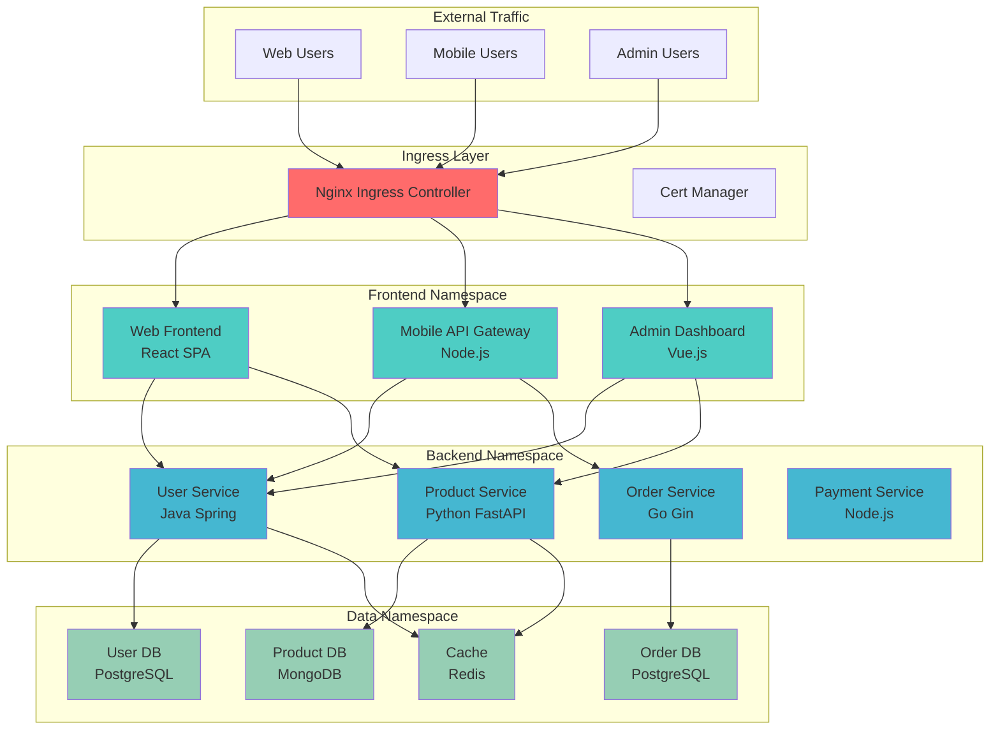

# Week 3 Day 3 Challenge 2: 네트워킹 & 스토리지 아키텍처 구현 챌린지 (선택사항, 90분)

<div align="center">

**🌐 네트워킹 설계** • **💾 스토리지 전략** • **📊 시각화 분석**

*Service, Ingress, PV/PVC를 활용한 3-Tier 애플리케이션 아키텍처 구현*

</div>

---

## 🎯 Challenge 목표

### 📚 학습 목표
- **네트워킹 설계**: Service 타입별 특징과 Ingress 라우팅 전략
- **스토리지 관리**: PV/PVC와 StorageClass 활용
- **실무 문서화**: 네트워크 토폴로지와 데이터 플로우 분석

### 🛠️ 구현 목표
- **GitHub Repository**: 네트워킹과 스토리지 설정의 체계적 관리
- **클러스터 시각화**: 서비스 메시와 데이터 플로우 시각화
- **분석 보고서**: 네트워크 성능과 스토리지 전략 분석

---

## 🌐 도메인 준비 (필수)

### 📋 도메인 발급 가이드
**Ingress 실습을 위해 도메인이 필요합니다.**

👉 **[무료 도메인 발급 가이드](../../shared/free-domain-guide.md)** 참조

### 🚀 빠른 시작 옵션
```bash
# Option 1: 로컬 테스트 (가장 빠름)
sudo nano /etc/hosts
# 추가: 192.168.49.2 shop.example.com api.example.com

# Option 2: 무료 도메인 (실제 도메인)
# Freenom에서 mylab.tk 발급 후 DNS 설정
```

---

## 🏗️ 구현 시나리오

### 📖 비즈니스 상황
**"E-Commerce 플랫폼의 마이크로서비스 네트워킹 설계"**

온라인 쇼핑몰 "CloudMart"가 급성장하면서 기존 모놀리식 아키텍처에서 마이크로서비스로 전환하기로 결정했습니다. 
DevOps 엔지니어로서 Kubernetes 기반의 네트워킹과 스토리지 아키텍처를 설계하고 구현해야 합니다.

### 🎯 비즈니스 요구사항
- **고가용성**: 99.9% 서비스 가용성 보장
- **확장성**: 트래픽 증가에 따른 자동 확장
- **보안**: 서비스 간 안전한 통신
- **성능**: 빠른 응답 시간과 데이터 접근

### 🏗️ 시스템 아키텍처



---

## 📁 GitHub Repository 구조

### 필수 디렉토리 구조
```
kubernetes-challenge/
└── week3/
    └── day3/
        ├── README.md                           # 프로젝트 개요
        ├── k8s-manifests/                      # Kubernetes 매니페스트
        │   ├── namespaces/
        │   │   ├── frontend-ns.yaml
        │   │   ├── backend-ns.yaml
        │   │   └── data-ns.yaml
        │   ├── networking/
        │   │   ├── frontend-service.yaml
        │   │   ├── api-services.yaml
        │   │   ├── database-services.yaml
        │   │   └── ingress.yaml
        │   ├── storage/
        │   │   ├── storage-classes.yaml
        │   │   ├── postgres-pvc.yaml
        │   │   ├── mongodb-pvc.yaml
        │   │   └── logs-pvc.yaml
        │   └── workloads/
        │       ├── frontend-deployment.yaml
        │       ├── api-deployments.yaml
        │       └── database-statefulsets.yaml
        ├── docs/                               # 분석 문서
        │   ├── network-storage-analysis.md    # 네트워크 & 스토리지 분석
        │   └── screenshots/                   # 시각화 캡처
        │       ├── network-topology.png
        │       ├── service-mesh.png
        │       └── storage-usage.png
        └── scripts/                           # 배포/관리 스크립트
            ├── deploy-networking.sh           # 네트워킹 설정
            ├── deploy-storage.sh              # 스토리지 설정
            └── test-connectivity.sh           # 연결 테스트
```

---

## 📊 시각화 도구 활용

### 🛠️ 권장 시각화 도구
1. **Kubernetes Dashboard**: 서비스 메시 토폴로지
2. **K9s**: 실시간 네트워크 연결 상태
3. **kubectl tree**: Service와 Endpoint 관계
4. **Grafana**: 네트워크 성능 메트릭

### 📸 필수 캡처 항목
- **네트워크 토폴로지**: 전체 서비스 연결 구조
- **서비스 메시**: Pod 간 통신 흐름
- **스토리지 사용량**: PV/PVC 할당 현황
- **Ingress 라우팅**: 외부 트래픽 분산 현황

---

## 🚀 Phase 1: 네임스페이스 및 기본 인프라 (25분)

### Step 1-1: 네임스페이스 생성 (5분)

**네임스페이스 전략**:
```yaml
# namespaces/frontend-ns.yaml
apiVersion: v1
kind: Namespace
metadata:
  name: frontend
  labels:
    tier: frontend
    environment: production
---
# namespaces/backend-ns.yaml
apiVersion: v1
kind: Namespace
metadata:
  name: backend
  labels:
    tier: backend
    environment: production
---
# namespaces/data-ns.yaml
apiVersion: v1
kind: Namespace
metadata:
  name: data
  labels:
    tier: data
    environment: production
```

### Step 1-2: StorageClass 설정 (10분)

**스토리지 전략 설계**:
```yaml
# storage/storage-classes.yaml
apiVersion: storage.k8s.io/v1
kind: StorageClass
metadata:
  name: fast-ssd
provisioner: k8s.io/minikube-hostpath
parameters:
  type: pd-ssd
reclaimPolicy: Retain
allowVolumeExpansion: true
---
apiVersion: storage.k8s.io/v1
kind: StorageClass
metadata:
  name: standard-hdd
provisioner: k8s.io/minikube-hostpath
parameters:
  type: pd-standard
reclaimPolicy: Delete
allowVolumeExpansion: true
```

### Step 1-3: PVC 생성 (10분)

**데이터베이스별 스토리지 요구사항**:
```yaml
# storage/postgres-pvc.yaml
apiVersion: v1
kind: PersistentVolumeClaim
metadata:
  name: postgres-user-data
  namespace: data
spec:
  accessModes:
    - ReadWriteOnce
  storageClassName: fast-ssd
  resources:
    requests:
      storage: 10Gi
---
apiVersion: v1
kind: PersistentVolumeClaim
metadata:
  name: postgres-order-data
  namespace: data
spec:
  accessModes:
    - ReadWriteOnce
  storageClassName: fast-ssd
  resources:
    requests:
      storage: 20Gi
```

---

## 🌐 Phase 2: 네트워킹 구성 (35분)

### Step 2-1: 데이터베이스 서비스 (10분)

**StatefulSet과 Service 연동**:
```yaml
# networking/database-services.yaml
apiVersion: v1
kind: Service
metadata:
  name: postgres-user-service
  namespace: data
spec:
  type: ClusterIP
  ports:
  - port: 5432
    targetPort: 5432
  selector:
    app: postgres-user
---
apiVersion: v1
kind: Service
metadata:
  name: mongodb-product-service
  namespace: data
spec:
  type: ClusterIP
  ports:
  - port: 27017
    targetPort: 27017
  selector:
    app: mongodb-product
---
apiVersion: v1
kind: Service
metadata:
  name: redis-cache-service
  namespace: data
spec:
  type: ClusterIP
  ports:
  - port: 6379
    targetPort: 6379
  selector:
    app: redis-cache
```

### Step 2-2: 백엔드 API 서비스 (15분)

**마이크로서비스 간 통신 설정**:
```yaml
# networking/api-services.yaml
apiVersion: v1
kind: Service
metadata:
  name: user-service
  namespace: backend
spec:
  type: ClusterIP
  ports:
  - port: 8080
    targetPort: 8080
    name: http
  selector:
    app: user-service
---
apiVersion: v1
kind: Service
metadata:
  name: product-service
  namespace: backend
spec:
  type: ClusterIP
  ports:
  - port: 8000
    targetPort: 8000
    name: http
  selector:
    app: product-service
---
apiVersion: v1
kind: Service
metadata:
  name: order-service
  namespace: backend
spec:
  type: ClusterIP
  ports:
  - port: 9000
    targetPort: 9000
    name: http
  selector:
    app: order-service
```

### Step 2-3: Ingress 라우팅 설정 (10분)

**도메인 기반 트래픽 분산**:
```yaml
# networking/ingress.yaml
apiVersion: networking.k8s.io/v1
kind: Ingress
metadata:
  name: cloudmart-ingress
  namespace: frontend
  annotations:
    nginx.ingress.kubernetes.io/rewrite-target: /
    nginx.ingress.kubernetes.io/ssl-redirect: "false"
spec:
  rules:
  - host: shop.example.com
    http:
      paths:
      - path: /
        pathType: Prefix
        backend:
          service:
            name: web-frontend-service
            port:
              number: 80
  - host: api.example.com
    http:
      paths:
      - path: /users
        pathType: Prefix
        backend:
          service:
            name: user-service
            port:
              number: 8080
      - path: /products
        pathType: Prefix
        backend:
          service:
            name: product-service
            port:
              number: 8000
      - path: /orders
        pathType: Prefix
        backend:
          service:
            name: order-service
            port:
              number: 9000
```

---

## 💾 Phase 3: 워크로드 배포 (30분)

### Step 3-1: 데이터베이스 StatefulSet (15분)

**상태 유지 워크로드 배포**:
```yaml
# workloads/database-statefulsets.yaml
apiVersion: apps/v1
kind: StatefulSet
metadata:
  name: postgres-user
  namespace: data
spec:
  serviceName: postgres-user-service
  replicas: 1
  selector:
    matchLabels:
      app: postgres-user
  template:
    metadata:
      labels:
        app: postgres-user
    spec:
      containers:
      - name: postgres
        image: postgres:13
        env:
        - name: POSTGRES_DB
          value: userdb
        - name: POSTGRES_USER
          value: admin
        - name: POSTGRES_PASSWORD
          value: password123
        ports:
        - containerPort: 5432
        volumeMounts:
        - name: postgres-storage
          mountPath: /var/lib/postgresql/data
      volumes:
      - name: postgres-storage
        persistentVolumeClaim:
          claimName: postgres-user-data
---
apiVersion: apps/v1
kind: StatefulSet
metadata:
  name: mongodb-product
  namespace: data
spec:
  serviceName: mongodb-product-service
  replicas: 1
  selector:
    matchLabels:
      app: mongodb-product
  template:
    metadata:
      labels:
        app: mongodb-product
    spec:
      containers:
      - name: mongodb
        image: mongo:4.4
        env:
        - name: MONGO_INITDB_ROOT_USERNAME
          value: admin
        - name: MONGO_INITDB_ROOT_PASSWORD
          value: password123
        ports:
        - containerPort: 27017
        volumeMounts:
        - name: mongodb-storage
          mountPath: /data/db
  volumeClaimTemplates:
  - metadata:
      name: mongodb-storage
    spec:
      accessModes: ["ReadWriteOnce"]
      storageClassName: standard-hdd
      resources:
        requests:
          storage: 15Gi
```

### Step 3-2: 백엔드 API Deployment (15분)

**무상태 마이크로서비스 배포**:
```yaml
# workloads/api-deployments.yaml
apiVersion: apps/v1
kind: Deployment
metadata:
  name: user-service
  namespace: backend
spec:
  replicas: 3
  selector:
    matchLabels:
      app: user-service
  template:
    metadata:
      labels:
        app: user-service
    spec:
      containers:
      - name: user-service
        image: nginx:alpine
        ports:
        - containerPort: 8080
        env:
        - name: DB_HOST
          value: postgres-user-service.data.svc.cluster.local
        - name: DB_PORT
          value: "5432"
        resources:
          requests:
            cpu: 100m
            memory: 128Mi
          limits:
            cpu: 500m
            memory: 512Mi
---
apiVersion: apps/v1
kind: Deployment
metadata:
  name: product-service
  namespace: backend
spec:
  replicas: 2
  selector:
    matchLabels:
      app: product-service
  template:
    metadata:
      labels:
        app: product-service
    spec:
      containers:
      - name: product-service
        image: nginx:alpine
        ports:
        - containerPort: 8000
        env:
        - name: MONGO_HOST
          value: mongodb-product-service.data.svc.cluster.local
        - name: MONGO_PORT
          value: "27017"
        resources:
          requests:
            cpu: 100m
            memory: 128Mi
          limits:
            cpu: 500m
            memory: 512Mi
```

---

## 📊 네트워크 & 스토리지 분석 문서 작성

### 📝 분석 보고서 템플릿

**docs/network-storage-analysis.md** 파일에 다음 내용을 포함:

```markdown
# CloudMart 네트워크 & 스토리지 아키텍처 분석

## 🌐 네트워킹 분석

### Service 타입별 활용 전략
- **ClusterIP**: 내부 마이크로서비스 간 통신
- **NodePort**: 개발/테스트 환경 외부 접근
- **LoadBalancer**: 프로덕션 외부 트래픽 분산

### Ingress 라우팅 전략
- **도메인 기반 분리**: shop.example.com (프론트엔드), api.example.com (백엔드)
- **경로 기반 라우팅**: /users, /products, /orders
- **SSL 터미네이션**: Ingress Controller에서 TLS 처리

### 네트워크 성능 최적화
- **DNS 캐싱**: CoreDNS 최적화 설정
- **Connection Pooling**: 데이터베이스 연결 풀 관리
- **Load Balancing**: 서비스별 적절한 로드밸런싱 알고리즘

## 💾 스토리지 분석

### StorageClass 전략
- **fast-ssd**: 데이터베이스용 고성능 스토리지
- **standard-hdd**: 로그, 백업용 표준 스토리지

### PVC 할당 전략
- **PostgreSQL**: 10-20GB SSD, ReadWriteOnce
- **MongoDB**: 15GB HDD, ReadWriteOnce
- **Redis**: 메모리 기반, 영속성 불필요

### 데이터 백업 전략
- **자동 백업**: CronJob을 통한 정기 백업
- **스냅샷**: 볼륨 스냅샷 기능 활용
- **재해 복구**: 다중 AZ 백업 보관

## 📈 성능 메트릭

### 네트워크 성능
- **응답 시간**: 평균 < 200ms
- **처리량**: 초당 1000 요청 처리
- **가용성**: 99.9% 서비스 가용성

### 스토리지 성능
- **IOPS**: SSD 3000 IOPS, HDD 100 IOPS
- **처리량**: SSD 125MB/s, HDD 25MB/s
- **지연시간**: SSD < 10ms, HDD < 100ms

## 🔧 개선 권장사항

### 단기 개선 (1-2주)
1. **모니터링 강화**: Prometheus + Grafana 도입
2. **로그 중앙화**: ELK Stack 구축
3. **보안 강화**: Network Policy 적용

### 중기 개선 (1-3개월)
1. **서비스 메시**: Istio 도입 검토
2. **자동 스케일링**: HPA/VPA 적용
3. **CI/CD 통합**: GitOps 파이프라인 구축

### 장기 개선 (3-6개월)
1. **멀티 클러스터**: 재해 복구용 클러스터
2. **엣지 컴퓨팅**: CDN 및 엣지 캐시
3. **AI/ML 통합**: 예측적 스케일링
```

---

## 🧪 테스트 및 검증

### 📋 네트워크 연결 테스트

**scripts/test-connectivity.sh**:
```bash
#!/bin/bash

echo "=== CloudMart 네트워크 연결 테스트 ==="

# 1. 네임스페이스 확인
echo "1. 네임스페이스 상태 확인"
kubectl get namespaces

# 2. 서비스 상태 확인
echo "2. 서비스 상태 확인"
kubectl get services --all-namespaces

# 3. Ingress 상태 확인
echo "3. Ingress 상태 확인"
kubectl get ingress --all-namespaces

# 4. 데이터베이스 연결 테스트
echo "4. 데이터베이스 연결 테스트"
kubectl exec -n backend deployment/user-service -- nc -zv postgres-user-service.data.svc.cluster.local 5432

# 5. API 서비스 간 통신 테스트
echo "5. API 서비스 간 통신 테스트"
kubectl exec -n frontend deployment/web-frontend -- curl -s user-service.backend.svc.cluster.local:8080/health

# 6. 외부 접근 테스트
echo "6. 외부 접근 테스트"
curl -H "Host: shop.example.com" http://$(minikube ip)/

echo "=== 테스트 완료 ==="
```

### 📊 스토리지 사용량 확인

```bash
# PVC 상태 확인
kubectl get pvc --all-namespaces

# 스토리지 사용량 확인
kubectl exec -n data statefulset/postgres-user -- df -h /var/lib/postgresql/data

# 볼륨 성능 테스트
kubectl exec -n data statefulset/mongodb-product -- dd if=/dev/zero of=/data/db/test bs=1M count=100
```

---

## 🎯 성공 기준

### ✅ 기능적 요구사항
- [ ] **네임스페이스 분리**: 3개 네임스페이스 정상 생성
- [ ] **서비스 통신**: 모든 마이크로서비스 간 정상 통신
- [ ] **Ingress 라우팅**: 도메인별 정상 라우팅
- [ ] **데이터 영속성**: 데이터베이스 재시작 후 데이터 유지
- [ ] **스토리지 할당**: PVC 정상 바인딩 및 사용

### 📊 성능 요구사항
- [ ] **응답 시간**: API 응답 < 500ms
- [ ] **동시 연결**: 100개 동시 요청 처리
- [ ] **스토리지 성능**: 데이터베이스 쓰기 성능 확인
- [ ] **네트워크 처리량**: 서비스 간 통신 지연 < 50ms

### 📝 문서화 요구사항
- [ ] **아키텍처 다이어그램**: 네트워크 토폴로지 시각화
- [ ] **분석 보고서**: 성능 및 최적화 방안
- [ ] **스크린샷**: 주요 화면 캡처
- [ ] **GitHub 구조**: 체계적인 파일 구조

---

## 🏆 도전 과제 (보너스)

### 🔐 고급 네트워킹 (+20점)
1. **Network Policy**: 네임스페이스 간 트래픽 제어
2. **Service Mesh**: Istio 기본 설치 및 트래픽 분할
3. **TLS 인증서**: Let's Encrypt 자동 인증서 발급
4. **DNS 최적화**: CoreDNS 커스텀 설정

### 💾 고급 스토리지 (+15점)
1. **볼륨 스냅샷**: 데이터베이스 스냅샷 생성/복원
2. **동적 프로비저닝**: CSI 드라이버 활용
3. **백업 자동화**: CronJob 기반 자동 백업
4. **스토리지 모니터링**: 사용량 알림 설정

### 📊 모니터링 & 관측성 (+10점)
1. **Prometheus**: 메트릭 수집 및 알림
2. **Grafana**: 네트워크/스토리지 대시보드
3. **Jaeger**: 분산 추적 시스템
4. **로그 집계**: Fluentd + Elasticsearch

---

## 💡 문제 해결 가이드

### 🔍 일반적인 문제들

**문제 1: Ingress가 작동하지 않음**
```bash
# Ingress Controller 상태 확인
kubectl get pods -n ingress-nginx

# Ingress 설정 확인
kubectl describe ingress cloudmart-ingress -n frontend

# 해결: Ingress Controller 설치
minikube addons enable ingress
```

**문제 2: PVC가 Pending 상태**
```bash
# StorageClass 확인
kubectl get storageclass

# PV 가용성 확인
kubectl get pv

# 해결: 적절한 StorageClass 설정
```

**문제 3: 서비스 간 통신 실패**
```bash
# DNS 해결 테스트
kubectl exec -n backend deployment/user-service -- nslookup postgres-user-service.data.svc.cluster.local

# 네트워크 정책 확인
kubectl get networkpolicy --all-namespaces

# 해결: 서비스 이름 및 포트 확인
```

### 🛠️ 디버깅 명령어
```bash
# 전체 리소스 상태 확인
kubectl get all --all-namespaces

# 특정 Pod 로그 확인
kubectl logs -n backend deployment/user-service

# 네트워크 연결 테스트
kubectl exec -n backend deployment/user-service -- nc -zv target-service 8080

# 스토리지 마운트 확인
kubectl exec -n data statefulset/postgres-user -- mount | grep postgresql
```

---

## 🧹 Challenge 정리

### 🗑️ 리소스 정리 스크립트

**scripts/cleanup.sh**:
```bash
#!/bin/bash

echo "=== CloudMart Challenge 정리 시작 ==="

# 1. 워크로드 삭제
kubectl delete -f k8s-manifests/workloads/ --ignore-not-found=true

# 2. 서비스 및 Ingress 삭제
kubectl delete -f k8s-manifests/networking/ --ignore-not-found=true

# 3. PVC 삭제 (데이터 손실 주의!)
kubectl delete -f k8s-manifests/storage/ --ignore-not-found=true

# 4. 네임스페이스 삭제
kubectl delete -f k8s-manifests/namespaces/ --ignore-not-found=true

echo "=== 정리 완료 ==="
echo "⚠️  PVC 삭제로 인해 데이터가 영구 삭제되었습니다."
```

---

## 📝 Challenge 회고

### 🤝 팀 회고 (15분)
1. **가장 어려웠던 네트워킹 설정은?**
2. **스토리지 전략에서 배운 점은?**
3. **실무에서 어떻게 활용할 수 있을까?**
4. **다음에 시도해보고 싶은 고급 기능은?**

### 📊 학습 성과
- **네트워킹 이해도**: Service, Ingress, DNS 완전 이해
- **스토리지 관리**: PV/PVC 생명주기 관리 능력
- **시각화 능력**: 복잡한 아키텍처의 문서화 역량
- **문제 해결**: 네트워크/스토리지 문제 진단 및 해결

---

<div align="center">

**🌐 네트워킹 마스터** • **💾 스토리지 전문가** • **📊 아키텍처 설계자**

*Kubernetes 네트워킹과 스토리지의 실무 전문가로 성장*

</div>
