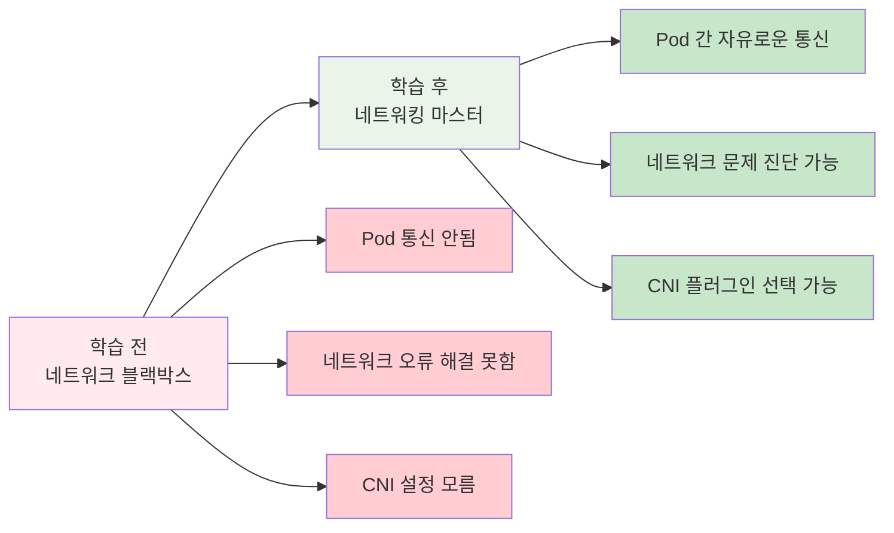
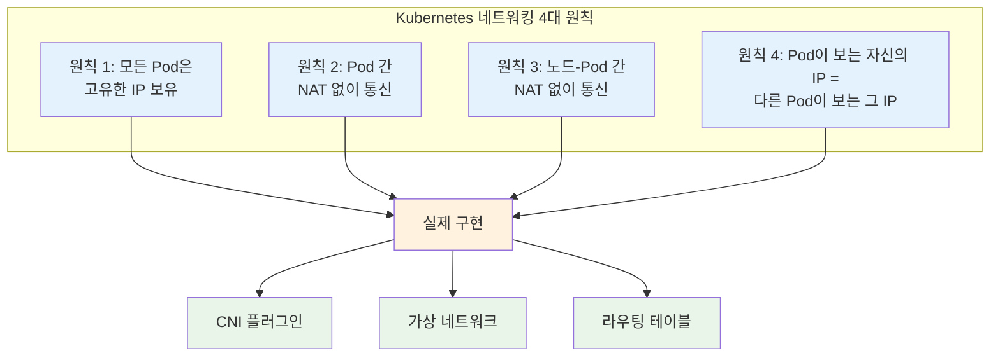
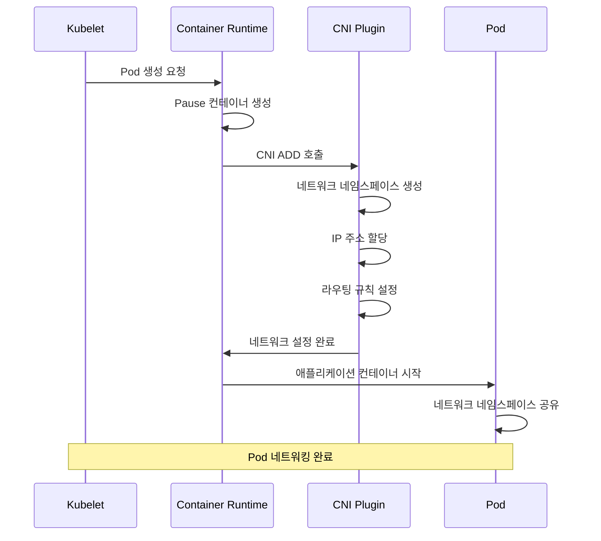
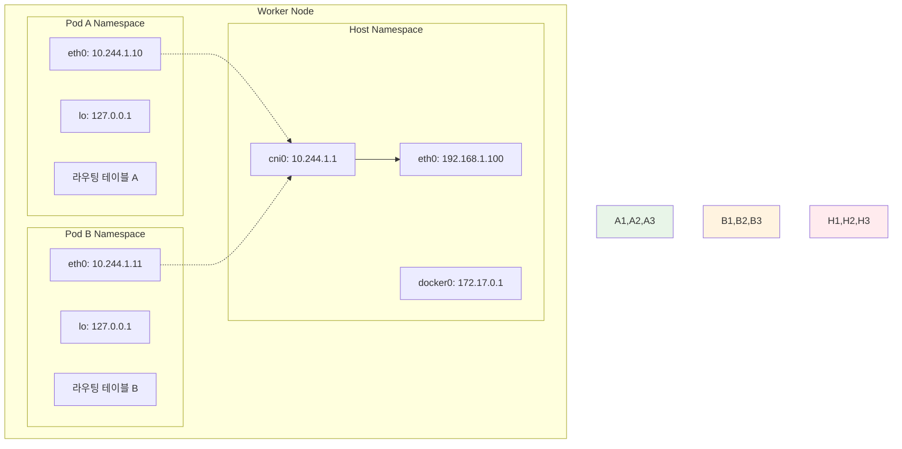

# Week 3 Day 3 Session 1: 네트워킹 기초 & CNI

<div align="center">

**🌐 Pod Networking** • **🔌 CNI 플러그인** • **🛡️ Network Namespace**

*Kubernetes 네트워킹의 기본 원리와 CNI 아키텍처 완전 이해*

</div>

---

## 🕘 세션 정보
**시간**: 09:00-09:50 (50분)  
**목표**: Kubernetes 네트워킹 모델과 CNI 동작 원리 완전 이해  
**방식**: 이론 설명 + 다이어그램 + 페어 토론

## 🎯 세션 목표

### 📚 학습 목표
- **이해 목표**: Kubernetes 네트워킹 4대 원칙과 CNI 아키텍처 이해
- **적용 목표**: Pod 간 통신 메커니즘과 네트워크 격리 방법 파악
- **협업 목표**: 네트워킹 개념을 동료와 함께 토론하고 이해 심화

### 🤔 왜 필요한가? (5분)

**현실 문제 상황**:
- 💼 **실무 시나리오**: 마이크로서비스 간 통신이 안 되는 상황
- 🏠 **일상 비유**: 아파트 단지 내 각 세대 간 통신 시스템
- 📊 **시장 동향**: 클라우드 네이티브 환경에서 네트워킹의 중요성 급증

**학습 전후 비교**:


## 📖 핵심 개념 (35분)

### 🔍 개념 1: Kubernetes 네트워킹 4대 원칙 (12분)

> **정의**: Kubernetes가 컨테이너 네트워킹을 위해 정의한 4가지 기본 규칙

**🏠 실생활 비유**: 
아파트 단지의 통신 규칙과 같습니다. 각 세대(Pod)는 고유한 주소(IP)를 가지고, 단지 내에서는 자유롭게 방문할 수 있으며, 외부와의 통신도 가능합니다.

**4대 네트워킹 원칙**:



**상세 설명**:

1. **고유 IP 원칙**: 
   - 각 Pod는 클러스터 내에서 유일한 IP 주소 할당
   - 일반적으로 10.244.0.0/16 또는 192.168.0.0/16 대역 사용
   - IP 충돌 없이 수천 개의 Pod 동시 운영 가능

2. **NAT 없는 통신**:
   - Pod A에서 Pod B로 직접 통신 (Network Address Translation 불필요)
   - 복잡한 포트 매핑이나 프록시 없이 간단한 통신
   - 마이크로서비스 아키텍처에 최적화

3. **노드-Pod 통신**:
   - 워커 노드에서 모든 Pod에 직접 접근 가능
   - kubelet이 Pod 상태 모니터링 시 활용
   - 디버깅과 로그 수집에 필수적

4. **IP 일관성**:
   - Pod 내부에서 `hostname -i`로 확인한 IP = 외부에서 보는 IP
   - 네트워크 투명성으로 애플리케이션 개발 단순화

### 🔍 개념 2: CNI (Container Network Interface) 아키텍처 (12분)

> **정의**: 컨테이너 런타임과 네트워크 플러그인 간의 표준 인터페이스

**💼 실무 상황**: 
다양한 클라우드 환경(AWS, GCP, Azure)에서 동일한 네트워킹 설정을 사용하고 싶을 때, CNI 표준 덕분에 플러그인만 교체하면 됩니다.

**CNI 동작 과정**:



**주요 CNI 플러그인 비교**:

| CNI 플러그인 | 특징 | 장점 | 단점 | 사용 사례 |
|-------------|------|------|------|----------|
| **Flannel** | 간단한 오버레이 | 설정 간단, 안정성 | 성능 제한, 기능 부족 | 개발/테스트 환경 |
| **Calico** | L3 라우팅 + 정책 | 고성능, 네트워크 정책 | 복잡한 설정 | 프로덕션 환경 |
| **Weave** | 메시 네트워크 | 암호화 지원, 멀티클라우드 | 오버헤드 존재 | 보안 중요 환경 |
| **Cilium** | eBPF 기반 | 최고 성능, 고급 기능 | 커널 의존성 | 대규모 환경 |

### 🔍 개념 3: Network Namespace와 격리 (11분)

> **정의**: 각 Pod가 독립적인 네트워크 환경을 가지도록 하는 Linux 커널 기능

**🏠 실생활 비유**:
아파트의 각 세대가 독립적인 전화선과 인터넷 회선을 가지는 것처럼, 각 Pod는 독립적인 네트워크 스택을 가집니다.

**Network Namespace 구조**:



**격리의 장점**:
- **보안**: 각 Pod는 독립적인 네트워크 환경
- **충돌 방지**: 포트 번호 중복 사용 가능
- **디버깅**: 네트워크 문제 격리 및 진단 용이
- **성능**: 네트워크 트래픽 분리로 성능 최적화

**실제 확인 방법**:
```bash
# Pod 내부에서 네트워크 인터페이스 확인
kubectl exec -it <pod-name> -- ip addr show

# 네트워크 네임스페이스 확인
kubectl exec -it <pod-name> -- cat /proc/net/route
```

## 💭 함께 생각해보기 (10분)

### 🤝 페어 토론 (5분)

**토론 주제**:
1. **네트워킹 선택**: "만약 여러분이 스타트업의 CTO라면, 어떤 CNI 플러그인을 선택하시겠어요?"
2. **문제 해결**: "Pod 간 통신이 안 될 때 어떤 순서로 문제를 진단하시겠어요?"
3. **실무 적용**: "기존 VM 기반 애플리케이션을 Kubernetes로 마이그레이션할 때 네트워킹 관점에서 주의할 점은?"

**페어 활동 가이드**:
- 👥 **자유 페어링**: 네트워킹 경험이나 관심도가 비슷한 사람끼리
- 🔄 **역할 교대**: 3분씩 설명자/질문자 역할 바꾸기
- 📝 **핵심 정리**: 대화 내용 중 중요한 인사이트 메모하기

### 🎯 전체 공유 (5분)

**인사이트 공유**:
- **CNI 선택 기준**: 성능 vs 기능 vs 복잡성의 트레이드오프
- **디버깅 전략**: 네트워크 문제 해결의 체계적 접근법
- **마이그레이션 팁**: 기존 시스템과의 호환성 고려사항

**💡 이해도 체크 질문**:
- ✅ "Kubernetes 네트워킹 4대 원칙을 설명할 수 있나요?"
- ✅ "CNI 플러그인이 하는 일을 간단히 설명할 수 있나요?"
- ✅ "Network Namespace가 왜 필요한지 설명할 수 있나요?"

## 🔑 핵심 키워드

### 🌐 네트워킹 기본
- **Pod IP**: 클러스터 내 고유 IP 주소
- **CNI (Container Network Interface)**: 네트워크 플러그인 표준
- **Network Namespace**: 네트워크 격리 메커니즘
- **Pause Container**: 네트워크 네임스페이스 유지 컨테이너

### 🔌 CNI 플러그인
- **Flannel**: 간단한 오버레이 네트워크
- **Calico**: L3 라우팅 + 네트워크 정책
- **Weave**: 암호화 지원 메시 네트워크
- **Cilium**: eBPF 기반 고성능 네트워킹

### 🛡️ 네트워크 격리
- **Network Namespace**: 독립적 네트워크 환경
- **VXLAN**: 오버레이 네트워크 터널링
- **BGP**: Border Gateway Protocol 라우팅
- **iptables**: 네트워크 규칙 및 NAT

## 🎉 Fun Facts

**기술적 재미**:
- **CNI 이름의 유래**: "Container Network Interface"의 줄임말로, Docker의 libnetwork와 경쟁하며 탄생
- **Pause 컨테이너**: 실제로는 단 몇 KB 크기로, 네트워크 네임스페이스만 유지하는 역할
- **IP 대역**: 기본적으로 10.244.0.0/16을 사용하지만, 65,536개 IP로 충분하지 않을 수 있음
- **성능 차이**: Cilium(eBPF)은 기존 iptables 기반보다 10배 이상 빠른 성능

**업계 동향**:
- **CNCF 졸업**: CNI는 CNCF의 첫 번째 졸업 프로젝트 중 하나
- **멀티 CNI**: 하나의 클러스터에서 여러 CNI 플러그인 동시 사용 가능
- **eBPF 혁신**: Linux 커널의 eBPF 기술로 네트워킹 성능 혁신
- **서비스 메시**: Istio, Linkerd 등과 CNI의 통합으로 고급 네트워킹 기능 제공

## 📝 세션 마무리

### ✅ 오늘 세션 성과
- [ ] **네트워킹 원칙**: Kubernetes 4대 원칙 완전 이해
- [ ] **CNI 아키텍처**: 플러그인 동작 방식과 선택 기준 파악
- [ ] **네트워크 격리**: Namespace를 통한 보안과 격리 이해
- [ ] **실무 연계**: 실제 환경에서의 네트워킹 고려사항 학습

### 🎯 다음 세션 준비
- **Service 개념**: Pod 그룹에 대한 안정적 접근 방법
- **로드밸런싱**: 트래픽 분산과 고가용성
- **DNS**: 서비스 디스커버리의 핵심 메커니즘
- **Ingress**: 외부 트래픽 라우팅과 L7 로드밸런싱

---

<div align="center">

**🌐 네트워킹 기초 완성** • **🔌 CNI 마스터** • **🛡️ 격리 이해** • **🚀 실무 준비**

*다음: Service와 Ingress로 외부 세계와 연결하기*

</div>
