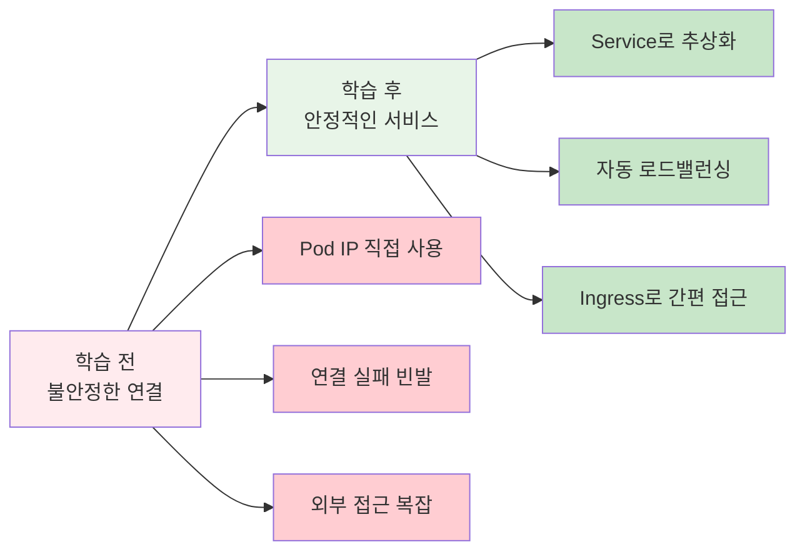
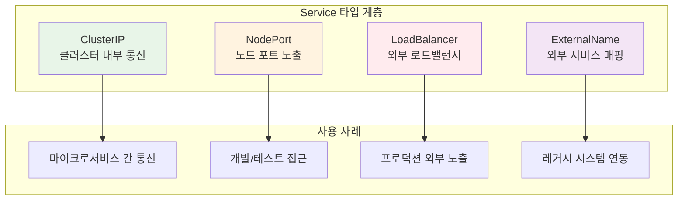
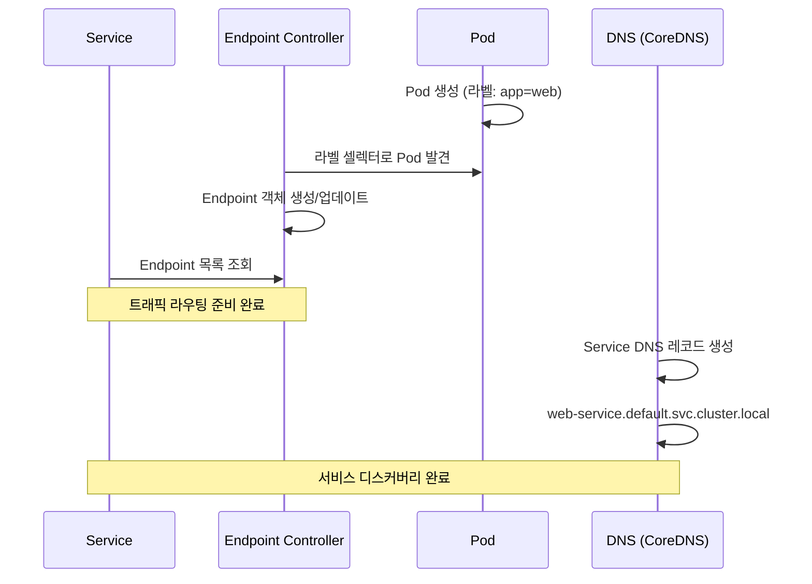
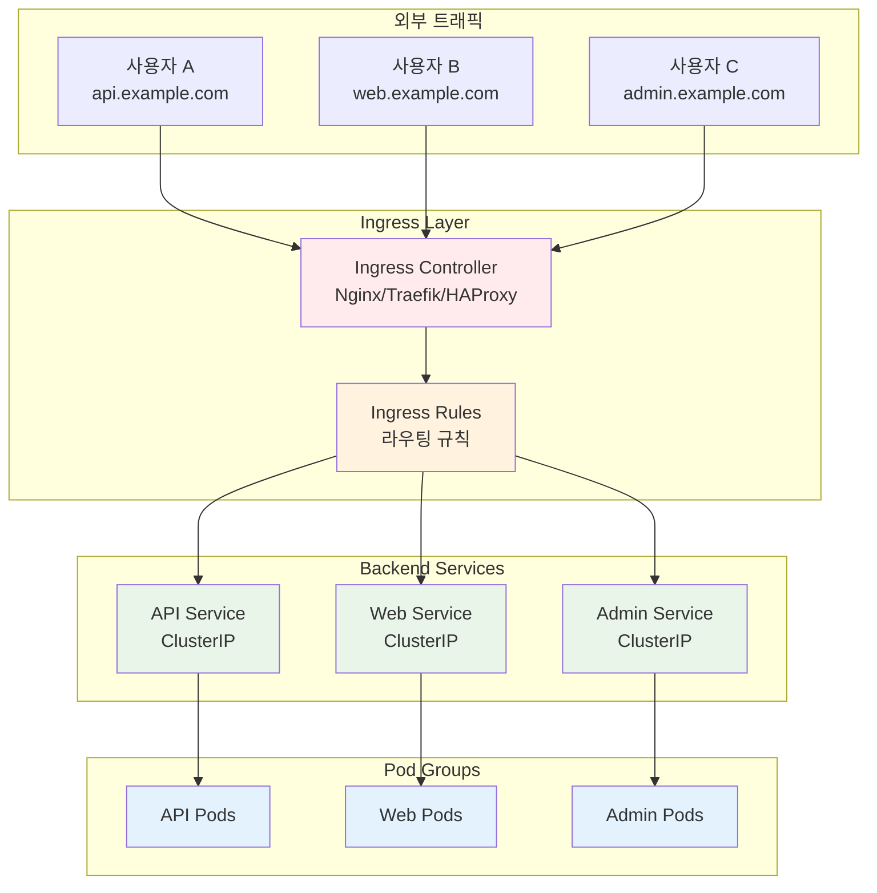

# Week 3 Day 3 Session 2: 서비스 & 인그레스

<div align="center">

**🔗 Service Discovery** • **⚖️ Load Balancing** • **🌐 Ingress Controller**

*Pod 그룹에 대한 안정적 접근과 외부 트래픽 라우팅 마스터하기*

</div>

---

## 🕘 세션 정보
**시간**: 10:00-10:50 (50분)  
**목표**: 서비스 디스커버리와 외부 접근 관리 완전 이해  
**방식**: 이론 설명 + 실습 데모 + 페어 토론

## 🎯 세션 목표

### 📚 학습 목표
- **이해 목표**: Service 타입별 특징과 Ingress Controller 동작 원리 이해
- **적용 목표**: 서비스 디스커버리와 로드밸런싱 메커니즘 활용 방법 습득
- **협업 목표**: 네트워크 아키텍처 설계를 팀원과 함께 토론

### 🤔 왜 필요한가? (5분)

**현실 문제 상황**:
- 💼 **실무 시나리오**: Pod IP가 계속 바뀌어서 애플리케이션 연결이 불안정
- 🏠 **일상 비유**: 이사를 자주 다니는 친구에게 편지를 보내는 방법 (우체국 사서함 활용)
- 📊 **시장 동향**: 마이크로서비스에서 서비스 디스커버리는 필수 인프라

**학습 전후 비교**:


## 📖 핵심 개념 (35분)

### 🔍 개념 1: Service 타입과 특징 (12분)

> **정의**: Pod 그룹에 대한 안정적인 네트워크 접근을 제공하는 추상화 계층

**🏠 실생활 비유**: 
회사의 대표 전화번호와 같습니다. 직원들이 바뀌어도 대표번호는 그대로이고, 전화교환원이 적절한 담당자에게 연결해줍니다.

**Service 타입별 특징**:



**상세 비교표**:

| Service 타입 | IP 범위 | 접근 방법 | 용도 | 장점 | 단점 |
|-------------|---------|----------|------|------|------|
| **ClusterIP** | 10.96.0.0/12 | 클러스터 내부만 | 내부 통신 | 보안, 성능 | 외부 접근 불가 |
| **NodePort** | 30000-32767 | 노드IP:포트 | 개발/테스트 | 간단한 설정 | 포트 관리 복잡 |
| **LoadBalancer** | 클라우드 할당 | 외부 IP | 프로덕션 | 자동 로드밸런싱 | 비용, 클라우드 의존 |
| **ExternalName** | DNS CNAME | DNS 이름 | 외부 연동 | 유연한 매핑 | DNS 의존성 |

**Service 동작 원리**:
```yaml
# ClusterIP Service 예시
apiVersion: v1
kind: Service
metadata:
  name: web-service
spec:
  type: ClusterIP
  selector:
    app: web
  ports:
  - port: 80        # Service 포트
    targetPort: 8080 # Pod 포트
```

### 🔍 개념 2: Endpoint와 서비스 디스커버리 (12분)

> **정의**: Service가 실제 Pod들과 연결되는 메커니즘과 DNS 기반 자동 발견

**💼 실무 상황**: 
Pod가 재시작되거나 스케일링될 때마다 IP가 바뀌지만, Service는 자동으로 새로운 Pod들을 찾아서 연결합니다.

**Endpoint 동작 과정**:



**DNS 서비스 디스커버리**:
```bash
# 서비스 DNS 형식
<service-name>.<namespace>.svc.cluster.local

# 예시
web-service.default.svc.cluster.local
database.production.svc.cluster.local
api.staging.svc.cluster.local

# 같은 네임스페이스 내에서는 짧은 이름 사용 가능
curl http://web-service/api/users
```

**EndpointSlice (Kubernetes 1.17+)**:
- 기존 Endpoint의 확장성 문제 해결
- 대규모 클러스터에서 성능 향상
- 네트워크 토폴로지 인식 라우팅

### 🔍 개념 3: Ingress Controller와 L7 라우팅 (11분)

> **정의**: HTTP/HTTPS 트래픽을 위한 L7 로드밸런서이자 리버스 프록시

**🏠 실생활 비유**:
대형 쇼핑몰의 안내데스크와 같습니다. 방문자가 "스타벅스 어디에 있나요?"라고 물으면, 안내원이 정확한 층과 위치로 안내해줍니다.

**Ingress 아키텍처**:



**Ingress 설정 예시**:
```yaml
apiVersion: networking.k8s.io/v1
kind: Ingress
metadata:
  name: web-ingress
  annotations:
    nginx.ingress.kubernetes.io/rewrite-target: /
spec:
  tls:
  - hosts:
    - api.example.com
    secretName: api-tls
  rules:
  - host: api.example.com
    http:
      paths:
      - path: /v1
        pathType: Prefix
        backend:
          service:
            name: api-v1-service
            port:
              number: 80
      - path: /v2
        pathType: Prefix
        backend:
          service:
            name: api-v2-service
            port:
              number: 80
```

**주요 Ingress Controller 비교**:

| Controller | 특징 | 장점 | 단점 | 사용 사례 |
|-----------|------|------|------|----------|
| **Nginx** | 가장 인기 | 안정성, 풍부한 기능 | 리로드 시 연결 끊김 | 일반적인 웹 서비스 |
| **Traefik** | 클라우드 네이티브 | 자동 설정, 대시보드 | 상대적으로 새로움 | 마이크로서비스 |
| **HAProxy** | 고성능 | 최고 성능, 고급 기능 | 복잡한 설정 | 대규모 트래픽 |
| **Istio Gateway** | 서비스 메시 | 고급 트래픽 관리 | 복잡성, 오버헤드 | 엔터프라이즈 |

## 💭 함께 생각해보기 (10분)

### 🤝 페어 토론 (5분)

**토론 주제**:
1. **서비스 설계**: "3-tier 애플리케이션에서 각 계층 간 통신을 위해 어떤 Service 타입을 사용하시겠어요?"
2. **Ingress 전략**: "하나의 도메인에서 여러 마이크로서비스를 서비스하려면 어떻게 Ingress를 설계하시겠어요?"
3. **문제 해결**: "Service에 연결이 안 될 때 어떤 순서로 문제를 진단하시겠어요?"

**페어 활동 가이드**:
- 👥 **경험 기반 페어링**: 네트워크 운영 경험이 있는 사람과 초보자 매칭
- 🔄 **시나리오 역할극**: 한 명은 개발자, 한 명은 운영자 역할
- 📝 **아키텍처 스케치**: 간단한 다이어그램으로 설계 아이디어 공유

### 🎯 전체 공유 (5분)

**아키텍처 인사이트**:
- **계층별 서비스**: Frontend(LoadBalancer) → Backend(ClusterIP) → Database(ClusterIP)
- **도메인 전략**: 서브도메인 vs 경로 기반 라우팅의 장단점
- **디버깅 체크리스트**: Service → Endpoint → Pod → DNS 순서

**💡 이해도 체크 질문**:
- ✅ "각 Service 타입의 용도를 설명할 수 있나요?"
- ✅ "Ingress가 Service와 어떻게 다른지 설명할 수 있나요?"
- ✅ "서비스 디스커버리가 어떻게 동작하는지 설명할 수 있나요?"

## 🔑 핵심 키워드

### 🔗 Service 관련
- **ClusterIP**: 클러스터 내부 통신용 가상 IP
- **NodePort**: 노드의 특정 포트로 외부 노출
- **LoadBalancer**: 클라우드 로드밸런서 자동 생성
- **Endpoint**: Service와 Pod를 연결하는 실제 주소 목록

### 🌐 Ingress 관련
- **Ingress Controller**: HTTP/HTTPS 트래픽 라우팅 구현체
- **Ingress Rules**: 호스트/경로 기반 라우팅 규칙
- **TLS Termination**: SSL/TLS 인증서 처리
- **Path-based Routing**: URL 경로에 따른 서비스 분기

### 🔍 서비스 디스커버리
- **CoreDNS**: Kubernetes 클러스터 DNS 서버
- **FQDN**: Fully Qualified Domain Name
- **SRV Record**: 서비스 레코드 (포트 정보 포함)
- **Headless Service**: DNS 기반 직접 Pod 접근

## 🎉 Fun Facts

**기술적 재미**:
- **가상 IP의 비밀**: Service IP는 실제로 존재하지 않으며, iptables 규칙으로만 존재
- **DNS 마법**: 서비스 이름만으로 자동 로드밸런싱과 장애 조치 제공
- **Ingress 어원**: "들어가다"라는 뜻으로, 외부에서 클러스터로 들어오는 트래픽 의미
- **포트 범위**: NodePort는 30000-32767 범위만 사용 (IANA 등록된 동적 포트 범위)

**실무 팁**:
- **Netflix 사례**: 수천 개의 마이크로서비스를 Ingress로 관리
- **성능 최적화**: Ingress Controller의 worker 프로세스 수 = CPU 코어 수
- **보안 강화**: Ingress에서 WAF(Web Application Firewall) 기능 활용
- **비용 절약**: 하나의 LoadBalancer로 여러 서비스 통합 관리

## 📝 세션 마무리

### ✅ 오늘 세션 성과
- [ ] **Service 타입**: 각 타입의 특징과 사용 사례 완전 이해
- [ ] **서비스 디스커버리**: DNS 기반 자동 발견 메커니즘 파악
- [ ] **Ingress 아키텍처**: L7 라우팅과 외부 접근 관리 이해
- [ ] **실무 설계**: 실제 애플리케이션 아키텍처 설계 능력 향상

### 🎯 다음 세션 준비
- **영속적 스토리지**: 데이터가 사라지지 않는 저장소 관리
- **Volume vs PV**: 임시 저장소와 영구 저장소의 차이
- **Storage Class**: 동적 프로비저닝과 스토리지 정책
- **StatefulSet**: 상태를 가진 애플리케이션의 특별한 관리

---

<div align="center">

**🔗 서비스 연결 완성** • **🌐 외부 접근 마스터** • **⚖️ 로드밸런싱 이해** • **🚀 실무 아키텍처**

*다음: 영속적 스토리지로 데이터 안전하게 보관하기*

</div>
