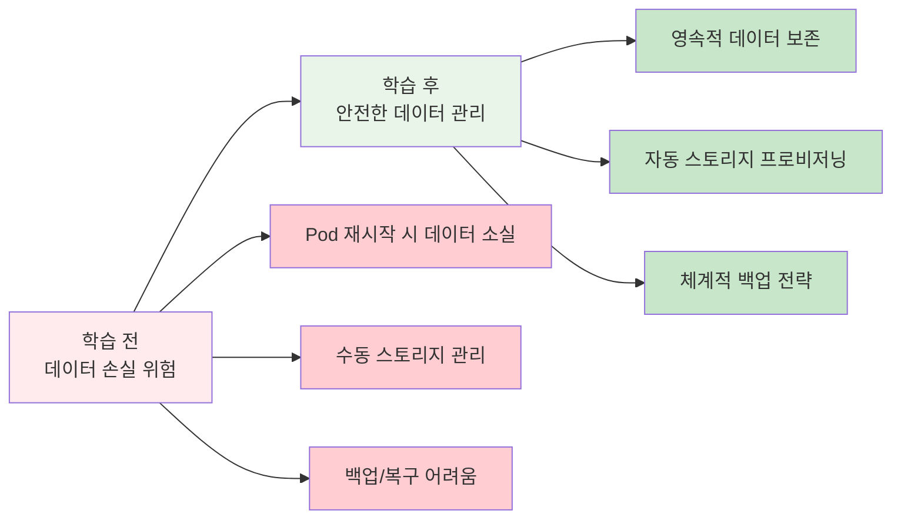
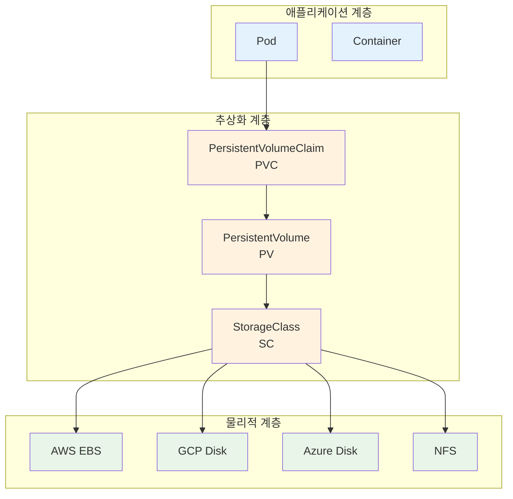
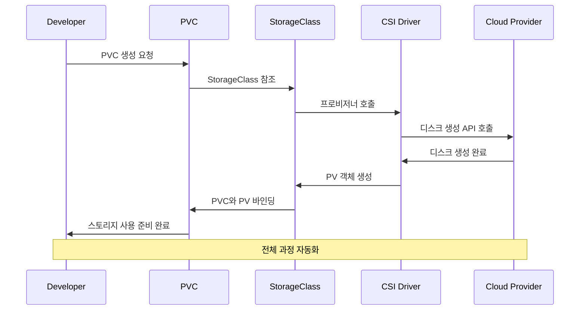
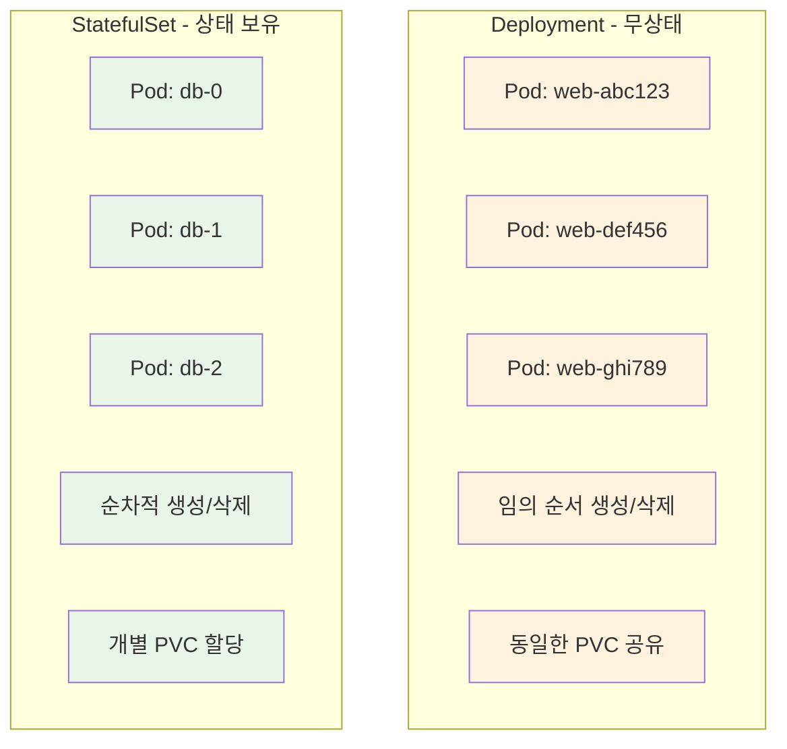

# Week 3 Day 3 Session 3: 스토리지 & 데이터 관리

<div align="center">

**💾 Persistent Storage** • **🔄 Dynamic Provisioning** • **📊 Stateful Applications**

*Kubernetes에서 데이터를 안전하게 보관하고 관리하는 완전한 가이드*

</div>

---

## 🕘 세션 정보
**시간**: 11:00-11:50 (50분)  
**목표**: 영속적 데이터 관리와 스토리지 추상화 완전 이해  
**방식**: 이론 설명 + 실제 사례 + 페어 토론

## 🎯 세션 목표

### 📚 학습 목표
- **이해 목표**: Volume, PV, PVC의 관계와 Storage Class 동적 프로비저닝 이해
- **적용 목표**: 상태를 가진 애플리케이션의 데이터 영속화 전략 수립
- **협업 목표**: 데이터 아키텍처 설계를 팀원과 함께 검토하고 개선

### 🤔 왜 필요한가? (5분)

**현실 문제 상황**:
- 💼 **실무 시나리오**: 데이터베이스 Pod가 재시작되면서 모든 데이터가 사라짐
- 🏠 **일상 비유**: 임시 숙소 vs 내 집 - 중요한 물건은 안전한 곳에 보관
- 📊 **시장 동향**: 클라우드 네이티브에서도 데이터 영속성은 핵심 요구사항

**학습 전후 비교**:


## 📖 핵심 개념 (35분)

### 🔍 개념 1: Volume vs PersistentVolume 계층 구조 (12분)

> **정의**: Kubernetes에서 데이터 저장을 위한 3단계 추상화 계층

**🏠 실생활 비유**: 
- **Volume**: 임시 창고 (이사할 때 버리는 물건들)
- **PersistentVolume**: 은행 금고 (안전하고 영구적)
- **PersistentVolumeClaim**: 금고 사용 신청서

**스토리지 추상화 계층**:



**각 계층의 역할**:

| 계층 | 범위 | 생명주기 | 관리자 | 목적 |
|------|------|----------|--------|------|
| **Volume** | Pod | Pod와 동일 | 개발자 | 임시 데이터, 설정 |
| **PVC** | Namespace | 독립적 | 개발자 | 스토리지 요청 |
| **PV** | Cluster | 독립적 | 관리자 | 실제 스토리지 |
| **StorageClass** | Cluster | 영구적 | 관리자 | 프로비저닝 정책 |

**Volume 타입 예시**:
```yaml
# emptyDir - 임시 저장소
volumes:
- name: temp-storage
  emptyDir: {}

# hostPath - 호스트 경로 마운트
volumes:
- name: host-storage
  hostPath:
    path: /data
    type: Directory

# configMap - 설정 데이터
volumes:
- name: config-volume
  configMap:
    name: app-config
```

### 🔍 개념 2: Storage Class와 동적 프로비저닝 (12분)

> **정의**: 스토리지 리소스를 자동으로 생성하고 관리하는 정책과 메커니즘

**💼 실무 상황**: 
개발자가 "100GB SSD 스토리지가 필요해요"라고 요청하면, StorageClass가 자동으로 클라우드에서 디스크를 생성하고 연결해줍니다.

**동적 프로비저닝 과정**:



**StorageClass 설정 예시**:
```yaml
# AWS EBS StorageClass
apiVersion: storage.k8s.io/v1
kind: StorageClass
metadata:
  name: fast-ssd
provisioner: ebs.csi.aws.com
parameters:
  type: gp3
  iops: "3000"
  throughput: "125"
  encrypted: "true"
reclaimPolicy: Delete
allowVolumeExpansion: true
volumeBindingMode: WaitForFirstConsumer
```

**주요 클라우드 프로바이더별 StorageClass**:

| 프로바이더 | 프로비저너 | 스토리지 타입 | 특징 |
|-----------|-----------|--------------|------|
| **AWS** | ebs.csi.aws.com | gp3, io1, io2 | 높은 IOPS, 암호화 |
| **GCP** | pd.csi.storage.gke.io | pd-standard, pd-ssd | 자동 백업, 스냅샷 |
| **Azure** | disk.csi.azure.com | Standard_LRS, Premium_LRS | 지역 복제, 고성능 |
| **온프레미스** | nfs-client-provisioner | NFS | 기존 인프라 활용 |

### 🔍 개념 3: StatefulSet과 상태 관리 (11분)

> **정의**: 상태를 가진 애플리케이션을 위한 특별한 워크로드 컨트롤러

**🏠 실생활 비유**:
Deployment는 호텔 객실(어느 방이든 상관없음)이고, StatefulSet은 아파트 호수(각자 고유한 주소와 정체성)입니다.

**StatefulSet vs Deployment 비교**:



**StatefulSet 특징**:

| 특징 | Deployment | StatefulSet |
|------|------------|-------------|
| **Pod 이름** | 랜덤 해시 | 순차적 인덱스 (0,1,2...) |
| **생성 순서** | 동시 생성 | 순차적 생성 (0→1→2) |
| **삭제 순서** | 동시 삭제 | 역순 삭제 (2→1→0) |
| **네트워크 ID** | 임시 | 안정적 (Headless Service) |
| **스토리지** | 공유 또는 없음 | 개별 PVC |

**StatefulSet 사용 사례**:
```yaml
# 데이터베이스 클러스터 예시
apiVersion: apps/v1
kind: StatefulSet
metadata:
  name: mysql-cluster
spec:
  serviceName: mysql-headless
  replicas: 3
  selector:
    matchLabels:
      app: mysql
  template:
    metadata:
      labels:
        app: mysql
    spec:
      containers:
      - name: mysql
        image: mysql:8.0
        env:
        - name: MYSQL_ROOT_PASSWORD
          value: "password"
        volumeMounts:
        - name: mysql-data
          mountPath: /var/lib/mysql
  volumeClaimTemplates:
  - metadata:
      name: mysql-data
    spec:
      accessModes: ["ReadWriteOnce"]
      storageClassName: fast-ssd
      resources:
        requests:
          storage: 100Gi
```

**CSI (Container Storage Interface) 혁신**:
- 스토리지 벤더 독립적 인터페이스
- 플러그인 형태로 다양한 스토리지 지원
- 스냅샷, 복제, 확장 등 고급 기능
- Kubernetes뿐만 아니라 다른 오케스트레이터에서도 사용

## 💭 함께 생각해보기 (10분)

### 🤝 페어 토론 (5분)

**토론 주제**:
1. **스토리지 전략**: "전자상거래 사이트를 Kubernetes로 구축한다면, 어떤 데이터를 어떤 방식으로 저장하시겠어요?"
2. **성능 vs 비용**: "데이터베이스용 스토리지를 선택할 때 성능과 비용 중 어느 것을 우선하시겠어요?"
3. **백업 전략**: "StatefulSet으로 운영하는 데이터베이스의 백업 전략을 어떻게 수립하시겠어요?"

**페어 활동 가이드**:
- 👥 **경험 기반 매칭**: 데이터베이스 운영 경험자와 초보자 페어링
- 🔄 **시나리오 분석**: 구체적인 비즈니스 상황을 가정하고 토론
- 📝 **아키텍처 설계**: 스토리지 계층 다이어그램 스케치

### 🎯 전체 공유 (5분)

**설계 인사이트**:
- **계층별 전략**: 캐시(emptyDir) → 세션(PVC) → 데이터베이스(StatefulSet)
- **성능 최적화**: SSD vs HDD, 로컬 vs 네트워크 스토리지
- **백업 모범사례**: 스냅샷 + 크로스 리전 복제 + 정기 테스트

**💡 이해도 체크 질문**:
- ✅ "Volume과 PersistentVolume의 차이점을 설명할 수 있나요?"
- ✅ "언제 StatefulSet을 사용해야 하는지 설명할 수 있나요?"
- ✅ "동적 프로비저닝이 어떻게 동작하는지 설명할 수 있나요?"

## 🔑 핵심 키워드

### 💾 스토리지 기본
- **Volume**: Pod 수준의 임시 저장소
- **PersistentVolume (PV)**: 클러스터 수준의 스토리지 리소스
- **PersistentVolumeClaim (PVC)**: 스토리지 사용 요청서
- **StorageClass**: 동적 프로비저닝 정책

### 🔄 동적 관리
- **Dynamic Provisioning**: 자동 스토리지 생성
- **CSI Driver**: Container Storage Interface 드라이버
- **Reclaim Policy**: PV 회수 정책 (Delete/Retain/Recycle)
- **Volume Expansion**: 볼륨 크기 동적 확장

### 📊 상태 관리
- **StatefulSet**: 상태를 가진 애플리케이션 컨트롤러
- **Headless Service**: DNS 기반 개별 Pod 접근
- **Ordered Deployment**: 순차적 Pod 생성/삭제
- **Stable Network Identity**: 안정적인 네트워크 식별자

## 🎉 Fun Facts

**기술적 재미**:
- **PV vs PVC**: "공급자 vs 소비자" 관계로, 경제학의 수요-공급 이론과 유사
- **CSI 혁신**: 100개 이상의 스토리지 시스템이 CSI 드라이버 제공
- **StatefulSet 순서**: Pod-0이 Ready가 되어야 Pod-1이 생성되는 엄격한 순서
- **스냅샷 마법**: CSI 스냅샷으로 일관된 백업과 복제 가능

**실무 사례**:
- **Netflix**: 수 페타바이트의 데이터를 Kubernetes PV로 관리
- **Spotify**: 음악 스트리밍 데이터를 StatefulSet 기반 Cassandra로 저장
- **Airbnb**: 검색 인덱스를 고성능 SSD PV에 저장하여 응답 시간 단축
- **Uber**: 실시간 위치 데이터를 StatefulSet 기반 Redis 클러스터로 처리

**성능 팁**:
- **로컬 스토리지**: 최고 성능이지만 노드 장애 시 데이터 손실 위험
- **네트워크 스토리지**: 안정성은 높지만 네트워크 지연 존재
- **스토리지 클래스**: 워크로드별 최적화된 스토리지 타입 선택 중요
- **백업 전략**: 3-2-1 규칙 (3개 복사본, 2개 다른 미디어, 1개 오프사이트)

## 📝 세션 마무리

### ✅ 오늘 세션 성과
- [ ] **스토리지 계층**: Volume, PV, PVC, StorageClass 관계 완전 이해
- [ ] **동적 프로비저닝**: 자동 스토리지 생성과 관리 메커니즘 파악
- [ ] **StatefulSet**: 상태를 가진 애플리케이션의 특별한 관리 방법 이해
- [ ] **실무 설계**: 실제 애플리케이션의 데이터 아키텍처 설계 능력 향상

### 🎯 실습 세션 준비
- **3-tier 애플리케이션**: Frontend-Backend-Database 완전 구성
- **스토리지 실습**: PVC를 이용한 데이터베이스 영속화
- **서비스 연결**: 네트워킹과 스토리지 통합 테스트
- **Challenge 준비**: 네트워크와 스토리지 장애 해결 시나리오

### 🔄 오늘 전체 복습
1. **Session 1**: 네트워킹 기초 → Pod 간 통신 이해
2. **Session 2**: 서비스 & 인그레스 → 외부 접근 관리
3. **Session 3**: 스토리지 & 데이터 → 영속적 데이터 보존

**통합 이해**: 네트워킹으로 연결하고, 서비스로 노출하고, 스토리지로 보존하는 완전한 Kubernetes 애플리케이션 아키텍처

---

<div align="center">

**💾 데이터 영속화 완성** • **🔄 자동 프로비저닝 마스터** • **📊 상태 관리 이해** • **🚀 실습 준비 완료**

*다음: 실습으로 3-tier 애플리케이션 완전 구축하기*

</div>
