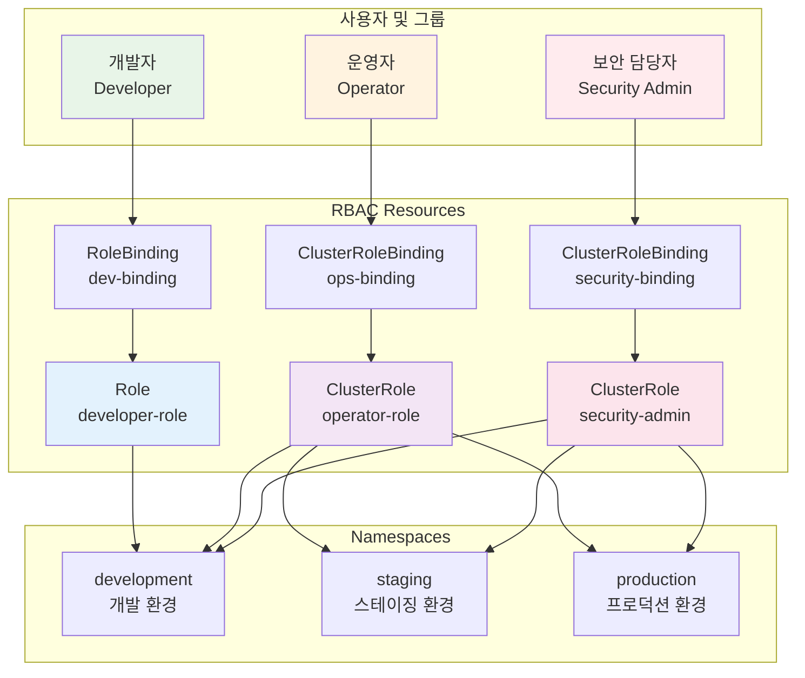

# Week 3 Day 4 Lab 1: RBAC 보안 설정 & 권한 관리

<div align="center">

**🔐 RBAC 구성** • **👥 사용자 권한** • **🛡️ Network Policy**

*프로덕션급 보안 환경 구축 - 역할 기반 접근 제어*

</div>

---

## 🕘 실습 정보
**시간**: 12:00-13:30 (90분)  
**목표**: RBAC 기반 권한 관리와 네트워크 보안 구성  
**방식**: 단계별 실습 + 페어 프로그래밍

## 🎯 실습 목표

### 📚 학습 목표
- **RBAC 구조**: Role, RoleBinding, ClusterRole, ClusterRoleBinding 완전 이해
- **권한 설계**: 개발팀, 운영팀, 보안팀별 권한 분리
- **ServiceAccount**: Pod의 API 접근 권한 관리
- **Network Policy**: 네트워크 레벨 보안 제어

### 🛠️ 구현 목표
- **다층 권한 체계**: 네임스페이스별, 역할별 권한 분리
- **최소 권한 원칙**: 필요한 최소한의 권한만 부여
- **네트워크 격리**: Pod 간 통신 제어
- **감사 및 모니터링**: 권한 사용 추적

---

## 🏗️ 전체 아키텍처



---

## 🛠️ Step 1: 환경 준비 및 네임스페이스 생성 (10분)

### Step 1-1: 네임스페이스 구성

**🚀 자동화 스크립트 사용**
```bash
cd theory/week_03/day4/lab_scripts/lab1
./setup-namespaces.sh
```

**📋 스크립트 내용**: [setup-namespaces.sh](./lab_scripts/lab1/setup-namespaces.sh)

**1-1. 수동 실행 (학습용)**
```bash
# 개발, 스테이징, 프로덕션 네임스페이스 생성
kubectl create namespace development
kubectl create namespace staging
kubectl create namespace production

# 네임스페이스 확인
kubectl get namespaces

# 라벨 추가 (환경 구분)
kubectl label namespace development env=dev
kubectl label namespace staging env=staging
kubectl label namespace production env=prod
```

---

## 👥 Step 2: 개발자 권한 구성 (25분)

### Step 2-1: 개발자 Role 생성 (15분)

**목표**: 개발 네임스페이스에서 Pod, Service, Deployment 관리 권한

**🚀 자동화 스크립트 사용**
```bash
cd theory/week_03/day4/lab_scripts/lab1
./create-developer-role.sh
```

**📋 스크립트 내용**: [create-developer-role.sh](./lab_scripts/lab1/create-developer-role.sh)

**2-1. 수동 실행 (학습용)**
```bash
# 개발자 Role 생성
kubectl apply -f - <<EOF
apiVersion: rbac.authorization.k8s.io/v1
kind: Role
metadata:
  name: developer-role
  namespace: development
rules:
# Pod 관리 권한
- apiGroups: [""]
  resources: ["pods", "pods/log", "pods/exec"]
  verbs: ["get", "list", "watch", "create", "delete"]
# Service 관리 권한
- apiGroups: [""]
  resources: ["services"]
  verbs: ["get", "list", "create", "update", "patch"]
# ConfigMap, Secret 읽기 권한
- apiGroups: [""]
  resources: ["configmaps"]
  verbs: ["get", "list", "create", "update"]
- apiGroups: [""]
  resources: ["secrets"]
  verbs: ["get", "list"]
# Deployment 관리 권한
- apiGroups: ["apps"]
  resources: ["deployments", "replicasets"]
  verbs: ["get", "list", "create", "update", "patch", "delete"]
# 이벤트 조회 권한
- apiGroups: [""]
  resources: ["events"]
  verbs: ["get", "list", "watch"]
EOF

# Role 확인
kubectl get role developer-role -n development
kubectl describe role developer-role -n development
```

### Step 2-2: ServiceAccount 및 RoleBinding 생성 (10분)

```bash
# 개발자 ServiceAccount 생성
kubectl apply -f - <<EOF
apiVersion: v1
kind: ServiceAccount
metadata:
  name: developer-sa
  namespace: development
---
apiVersion: rbac.authorization.k8s.io/v1
kind: RoleBinding
metadata:
  name: developer-binding
  namespace: development
subjects:
- kind: ServiceAccount
  name: developer-sa
  namespace: development
roleRef:
  kind: Role
  name: developer-role
  apiGroup: rbac.authorization.k8s.io
EOF

# RoleBinding 확인
kubectl get rolebinding developer-binding -n development
kubectl describe rolebinding developer-binding -n development
```

---

## 🔧 Step 3: 운영자 권한 구성 (25분)

### Step 3-1: 운영자 ClusterRole 생성 (15분)

**목표**: 모든 네임스페이스에서 읽기 권한, 프로덕션에서 제한적 쓰기 권한

**🚀 자동화 스크립트 사용**
```bash
cd theory/week_03/day4/lab_scripts/lab1
./create-operator-role.sh
```

**📋 스크립트 내용**: [create-operator-role.sh](./lab_scripts/lab1/create-operator-role.sh)

**3-1. 수동 실행 (학습용)**
```bash
# 운영자 ClusterRole 생성 (읽기 전용)
kubectl apply -f - <<EOF
apiVersion: rbac.authorization.k8s.io/v1
kind: ClusterRole
metadata:
  name: operator-readonly
rules:
# 모든 리소스 읽기 권한
- apiGroups: ["*"]
  resources: ["*"]
  verbs: ["get", "list", "watch"]
# 노드 정보 조회
- apiGroups: [""]
  resources: ["nodes"]
  verbs: ["get", "list"]
# 네임스페이스 조회
- apiGroups: [""]
  resources: ["namespaces"]
  verbs: ["get", "list"]
# 이벤트 조회
- apiGroups: [""]
  resources: ["events"]
  verbs: ["get", "list", "watch"]
EOF

# 프로덕션 운영 Role 생성
kubectl apply -f - <<EOF
apiVersion: rbac.authorization.k8s.io/v1
kind: Role
metadata:
  name: operator-prod
  namespace: production
rules:
# Pod 관리 (재시작, 로그 확인)
- apiGroups: [""]
  resources: ["pods", "pods/log"]
  verbs: ["get", "list", "watch", "delete"]
# Deployment 스케일링
- apiGroups: ["apps"]
  resources: ["deployments", "deployments/scale"]
  verbs: ["get", "list", "update", "patch"]
# Service 관리
- apiGroups: [""]
  resources: ["services"]
  verbs: ["get", "list", "update"]
EOF
```

### Step 3-2: 운영자 바인딩 생성 (10분)

```bash
# 운영자 ServiceAccount 생성
kubectl create serviceaccount operator-sa -n production

# ClusterRoleBinding (읽기 전용)
kubectl apply -f - <<EOF
apiVersion: rbac.authorization.k8s.io/v1
kind: ClusterRoleBinding
metadata:
  name: operator-readonly-binding
subjects:
- kind: ServiceAccount
  name: operator-sa
  namespace: production
roleRef:
  kind: ClusterRole
  name: operator-readonly
  apiGroup: rbac.authorization.k8s.io
EOF

# RoleBinding (프로덕션 쓰기)
kubectl apply -f - <<EOF
apiVersion: rbac.authorization.k8s.io/v1
kind: RoleBinding
metadata:
  name: operator-prod-binding
  namespace: production
subjects:
- kind: ServiceAccount
  name: operator-sa
  namespace: production
roleRef:
  kind: Role
  name: operator-prod
  apiGroup: rbac.authorization.k8s.io
EOF
```

---

## 🛡️ Step 4: Network Policy 보안 강화 (20분)

### Step 4-1: 네임스페이스 간 격리 (10분)

**목표**: 각 네임스페이스 간 네트워크 트래픽 격리

```bash
# 개발 환경 격리 정책
kubectl apply -f - <<EOF
apiVersion: networking.k8s.io/v1
kind: NetworkPolicy
metadata:
  name: deny-from-other-namespaces
  namespace: development
spec:
  podSelector: {}
  policyTypes:
  - Ingress
  ingress:
  - from:
    - podSelector: {}
EOF

# 프로덕션 환경 격리 정책
kubectl apply -f - <<EOF
apiVersion: networking.k8s.io/v1
kind: NetworkPolicy
metadata:
  name: deny-from-other-namespaces
  namespace: production
spec:
  podSelector: {}
  policyTypes:
  - Ingress
  ingress:
  - from:
    - podSelector: {}
EOF

# Network Policy 확인
kubectl get networkpolicy -n development
kubectl get networkpolicy -n production
```

### Step 4-2: 애플리케이션별 통신 제어 (10분)

```bash
# 데이터베이스 접근 제한 (프로덕션)
kubectl apply -f - <<EOF
apiVersion: networking.k8s.io/v1
kind: NetworkPolicy
metadata:
  name: database-policy
  namespace: production
spec:
  podSelector:
    matchLabels:
      app: database
      tier: data
  policyTypes:
  - Ingress
  ingress:
  - from:
    - podSelector:
        matchLabels:
          app: backend
          tier: api
    ports:
    - protocol: TCP
      port: 5432
EOF

# API 서버 접근 제한
kubectl apply -f - <<EOF
apiVersion: networking.k8s.io/v1
kind: NetworkPolicy
metadata:
  name: backend-policy
  namespace: production
spec:
  podSelector:
    matchLabels:
      app: backend
      tier: api
  policyTypes:
  - Ingress
  - Egress
  ingress:
  - from:
    - podSelector:
        matchLabels:
          app: frontend
          tier: web
    ports:
    - protocol: TCP
      port: 8080
  egress:
  - to:
    - podSelector:
        matchLabels:
          app: database
    ports:
    - protocol: TCP
      port: 5432
  - to:
    - namespaceSelector:
        matchLabels:
          name: kube-system
    ports:
    - protocol: UDP
      port: 53
EOF
```

---

## 🔍 Step 5: 권한 테스트 및 검증 (10분)

### Step 5-1: 권한 확인

**🚀 자동화 스크립트 사용**
```bash
cd theory/week_03/day4/lab_scripts/lab1
./test-permissions.sh
```

**📋 스크립트 내용**: [test-permissions.sh](./lab_scripts/lab1/test-permissions.sh)

**5-1. 수동 검증 (학습용)**
```bash
# 개발자 권한 테스트
kubectl auth can-i create pods --as=system:serviceaccount:development:developer-sa -n development
kubectl auth can-i delete deployments --as=system:serviceaccount:development:developer-sa -n development
kubectl auth can-i create secrets --as=system:serviceaccount:development:developer-sa -n development

# 운영자 권한 테스트
kubectl auth can-i get pods --as=system:serviceaccount:production:operator-sa -n production
kubectl auth can-i delete pods --as=system:serviceaccount:production:operator-sa -n production
kubectl auth can-i get nodes --as=system:serviceaccount:production:operator-sa

# 모든 권한 확인
kubectl auth can-i --list --as=system:serviceaccount:development:developer-sa -n development
kubectl auth can-i --list --as=system:serviceaccount:production:operator-sa -n production
```

---

## ✅ 실습 체크포인트

### ✅ RBAC 구성 확인
- [ ] **네임스페이스**: development, staging, production 생성
- [ ] **Role**: developer-role, operator-prod 생성
- [ ] **ClusterRole**: operator-readonly 생성
- [ ] **ServiceAccount**: developer-sa, operator-sa 생성
- [ ] **RoleBinding**: 적절한 바인딩 설정

### ✅ 권한 검증
- [ ] **개발자**: development 네임스페이스에서 Pod 생성 가능
- [ ] **개발자**: production 네임스페이스 접근 불가
- [ ] **운영자**: 모든 네임스페이스 읽기 가능
- [ ] **운영자**: production에서 제한적 쓰기 가능

### ✅ 네트워크 보안 확인
- [ ] **네임스페이스 격리**: 다른 네임스페이스에서 접근 차단
- [ ] **애플리케이션 격리**: 필요한 통신만 허용
- [ ] **DNS 접근**: kube-system DNS 접근 허용

---

## 🚀 심화 실습 (선택사항)

### 1. Pod Security Standards 적용

```bash
# Restricted 정책 적용
kubectl label namespace production pod-security.kubernetes.io/enforce=restricted
kubectl label namespace production pod-security.kubernetes.io/audit=restricted
kubectl label namespace production pod-security.kubernetes.io/warn=restricted

# Baseline 정책 적용 (개발 환경)
kubectl label namespace development pod-security.kubernetes.io/enforce=baseline
```

### 2. Admission Controller 설정

```bash
# OPA Gatekeeper 설치 (선택사항)
kubectl apply -f https://raw.githubusercontent.com/open-policy-agent/gatekeeper/master/deploy/gatekeeper.yaml

# 정책 예시: 모든 Pod는 리소스 제한 필수
kubectl apply -f - <<EOF
apiVersion: templates.gatekeeper.sh/v1
kind: ConstraintTemplate
metadata:
  name: k8srequiredresources
spec:
  crd:
    spec:
      names:
        kind: K8sRequiredResources
  targets:
    - target: admission.k8s.gatekeeper.sh
      rego: |
        package k8srequiredresources
        violation[{"msg": msg}] {
          container := input.review.object.spec.containers[_]
          not container.resources.limits
          msg := sprintf("Container %v must have resource limits", [container.name])
        }
EOF
```

### 3. 감사 로깅 활성화

```bash
# Audit Policy 설정 (API Server 설정 필요)
cat > /etc/kubernetes/audit-policy.yaml <<EOF
apiVersion: audit.k8s.io/v1
kind: Policy
rules:
- level: Metadata
  resources:
  - group: ""
    resources: ["secrets", "configmaps"]
- level: RequestResponse
  resources:
  - group: "rbac.authorization.k8s.io"
    resources: ["roles", "rolebindings", "clusterroles", "clusterrolebindings"]
EOF
```

---

## 🧹 실습 정리

### 환경 정리 스크립트

**🚀 자동화 정리**
```bash
cd theory/week_03/day4/lab_scripts/lab1
./cleanup.sh
```

**수동 정리**
```bash
# RBAC 리소스 삭제
kubectl delete role developer-role -n development
kubectl delete role operator-prod -n production
kubectl delete clusterrole operator-readonly
kubectl delete rolebinding developer-binding -n development
kubectl delete rolebinding operator-prod-binding -n production
kubectl delete clusterrolebinding operator-readonly-binding
kubectl delete serviceaccount developer-sa -n development
kubectl delete serviceaccount operator-sa -n production

# Network Policy 삭제
kubectl delete networkpolicy --all -n development
kubectl delete networkpolicy --all -n production

# 네임스페이스 삭제 (선택사항)
kubectl delete namespace development staging production
```

---

## 💡 실습 회고

### 🤝 페어 회고 (5분)
1. **권한 설계**: 개발팀과 운영팀의 권한을 어떻게 분리하는 것이 좋을까요?
2. **최소 권한**: 실무에서 최소 권한 원칙을 적용할 때 어려운 점은?
3. **Network Policy**: 네트워크 격리가 애플리케이션 개발에 미치는 영향은?

### 📊 학습 성과
- **RBAC 구조**: Role, RoleBinding, ClusterRole, ClusterRoleBinding 완전 이해
- **권한 설계**: 실무 환경의 권한 분리 전략 습득
- **네트워크 보안**: 마이크로세그멘테이션 구현 능력
- **보안 원칙**: 최소 권한 원칙과 심층 방어 전략 적용

---

<div align="center">

**🔐 RBAC 마스터** • **👥 권한 분리** • **🛡️ 네트워크 보안** • **🚀 프로덕션 준비**

*다음: Hands-on으로 고급 보안 기능 추가하기*

</div>
