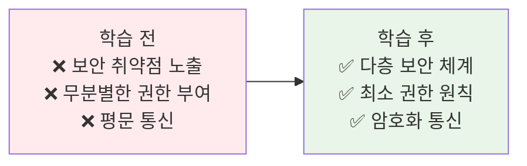
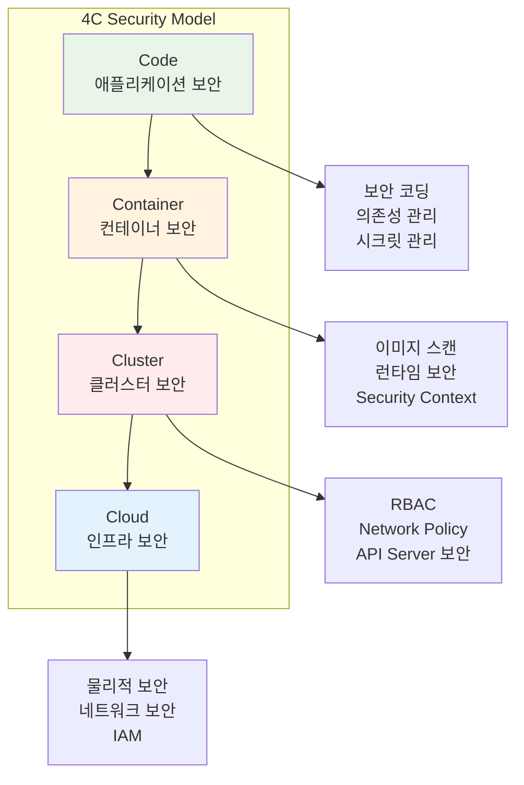
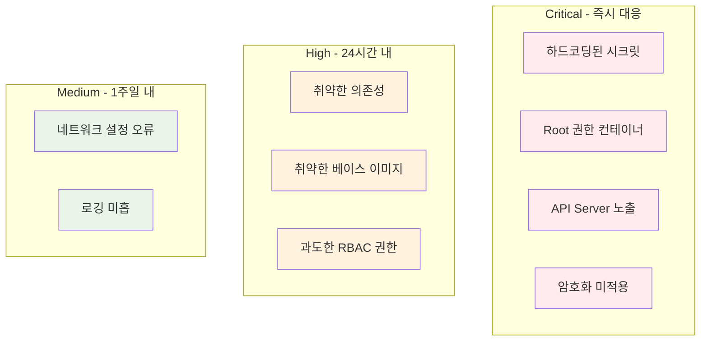
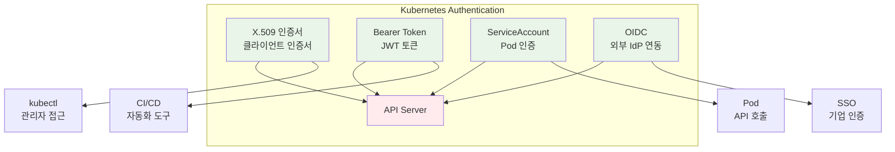
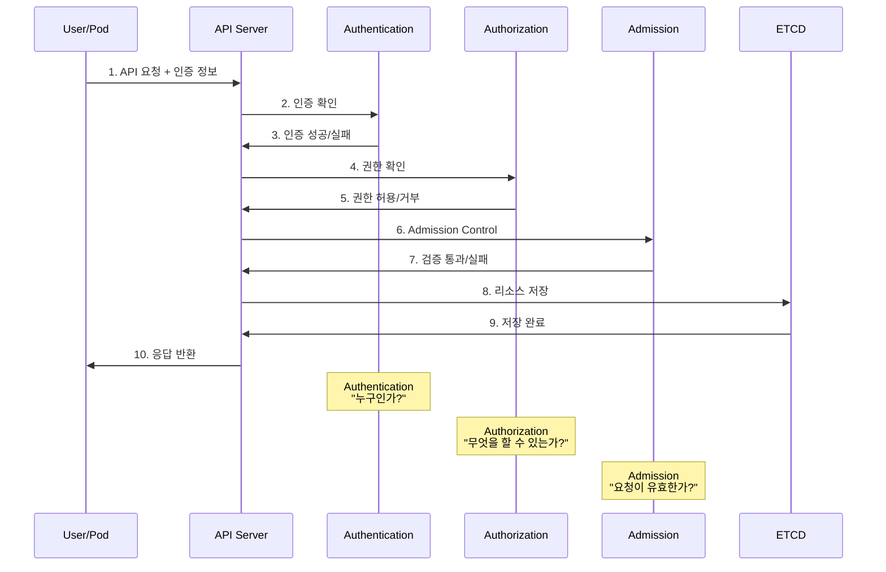
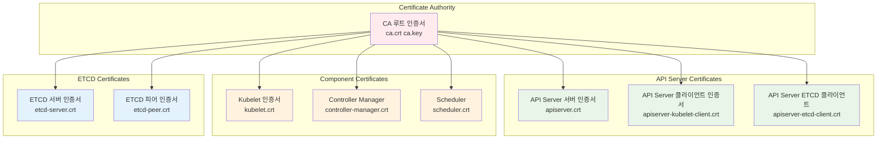

# Week 3 Day 4 Session 1: 보안 기초 & 인증

<div align="center">

**🔐 4C 보안 모델** • **🔑 인증 메커니즘** • **🔒 TLS 암호화**

*Kubernetes 보안의 기본 원칙과 인증 체계*

</div>

---

## 🕘 세션 정보
**시간**: 09:00-09:50 (50분)  
**목표**: Kubernetes 보안 모델과 인증 체계 완전 이해  
**방식**: 개념 설명 → 실제 구조 분석 → 인증서 체계 이해

---

## 🎯 세션 목표

### 📚 학습 목표
- **이해 목표**: 4C 보안 모델과 다층 방어 전략 이해
- **적용 목표**: 인증 메커니즘과 TLS 통신 구조 파악
- **협업 목표**: 보안 정책 설계 시 고려사항 토론

### 🤔 왜 필요한가? (5분)

**현실 문제 상황**:
- 💼 **실무 시나리오**: 클러스터에 무단 접근 시도, 데이터 유출 위험
- 🏠 **일상 비유**: 아파트 보안 시스템 (출입문, CCTV, 경비실, 각 세대 잠금장치)
- 📊 **시장 동향**: 2024년 Kubernetes 보안 사고 60% 증가, 평균 피해액 $4.2M

**학습 전후 비교**:


---

## 📖 핵심 개념 (35분)

### 🔍 개념 1: 4C 보안 모델 (12분)

> **정의**: Cloud, Cluster, Container, Code 4개 계층의 다층 방어 전략

**상세 설명**:



**각 계층별 책임**:

| 계층 | 책임 주체 | 주요 보안 요소 | 실무 적용 |
|------|----------|---------------|----------|
| **Code** | 개발자 | 보안 코딩, 의존성 관리, 시크릿 관리 | SAST, 코드 리뷰, Vault |
| **Container** | DevOps | 이미지 스캔, 런타임 보안, 최소 권한 | Trivy, Falco, runAsNonRoot |
| **Cluster** | Platform팀 | RBAC, Network Policy, Admission | OPA, Calico, PSP |
| **Cloud** | 인프라팀 | 물리적 보안, 네트워크, IAM | VPC, Security Group, KMS |

---

### 🚨 4C 모델 계층별 대표 취약점 사례

#### 1️⃣ Code 계층 취약점

**🔴 사례 1: 하드코딩된 시크릿 (Critical)**
```yaml
# ❌ 잘못된 예시 - 코드에 직접 노출
apiVersion: v1
kind: Pod
metadata:
  name: vulnerable-app
spec:
  containers:
  - name: app
    image: myapp:v1
    env:
    - name: DB_PASSWORD
      value: "admin123"  # 평문 패스워드 노출
    - name: API_KEY
      value: "sk-1234567890abcdef"  # API 키 노출
```

**✅ 올바른 해결책**:
```yaml
# Secret 사용
apiVersion: v1
kind: Secret
metadata:
  name: app-secrets
type: Opaque
data:
  db-password: YWRtaW4xMjM=  # Base64 인코딩
  api-key: c2stMTIzNDU2Nzg5MGFiY2RlZg==
---
apiVersion: v1
kind: Pod
spec:
  containers:
  - name: app
    envFrom:
    - secretRef:
        name: app-secrets
```

**실제 사고 사례**:
- **Uber (2016)**: GitHub에 AWS 키 하드코딩 → 5,700만 사용자 정보 유출
- **피해 규모**: $148M 벌금, 고객 신뢰 손실
- **교훈**: 코드 저장소 스캔 도구(git-secrets, truffleHog) 필수

**🔴 사례 2: 취약한 의존성 라이브러리**
```dockerfile
# ❌ 취약점이 있는 오래된 버전
FROM node:14.15.0  # CVE-2021-22918 취약점 존재
RUN npm install express@4.16.0  # CVE-2022-24999 취약점
```

**✅ 올바른 해결책**:
```dockerfile
# 최신 보안 패치 버전 사용
FROM node:18-alpine  # 최신 LTS + 최소 이미지
RUN npm install express@4.18.2  # 보안 패치 적용 버전
RUN npm audit fix  # 자동 보안 패치
```

**실제 사고 사례**:
- **Equifax (2017)**: Apache Struts 취약점(CVE-2017-5638) 미패치
- **피해 규모**: 1억 4,700만 명 개인정보 유출, $700M 합의금
- **교훈**: 의존성 스캔 자동화(Snyk, Dependabot) 필수

---

#### 2️⃣ Container 계층 취약점

**🔴 사례 3: Root 권한 컨테이너 실행**
```yaml
# ❌ 위험한 설정 - root로 실행
apiVersion: v1
kind: Pod
metadata:
  name: privileged-pod
spec:
  containers:
  - name: app
    image: myapp:v1
    securityContext:
      privileged: true  # 호스트 커널 접근 가능
      runAsUser: 0      # root 사용자
```

**✅ 올바른 해결책**:
```yaml
# 최소 권한 원칙 적용
apiVersion: v1
kind: Pod
spec:
  securityContext:
    runAsNonRoot: true
    runAsUser: 1000
    fsGroup: 2000
    seccompProfile:
      type: RuntimeDefault
  containers:
  - name: app
    securityContext:
      allowPrivilegeEscalation: false
      readOnlyRootFilesystem: true
      capabilities:
        drop:
        - ALL
        add:
        - NET_BIND_SERVICE  # 필요한 권한만 추가
```

**실제 사고 사례**:
- **Tesla (2018)**: Kubernetes 대시보드 노출 + 권한 미설정
- **피해 규모**: 크립토마이닝 악용, AWS 비용 폭증
- **교훈**: 기본적으로 비특권 컨테이너 사용, Pod Security Standards 적용

**🔴 사례 4: 취약한 베이스 이미지**
```dockerfile
# ❌ 취약점 많은 이미지
FROM ubuntu:18.04  # EOL, 보안 패치 중단
RUN apt-get update && apt-get install -y \
    openssl=1.1.0  # 알려진 취약점 존재
```

**✅ 올바른 해결책**:
```dockerfile
# 최소 이미지 + 최신 패치
FROM alpine:3.18  # 최소 이미지, 활발한 보안 패치
RUN apk add --no-cache openssl=3.1.0  # 최신 보안 버전

# 멀티스테이지 빌드로 공격 표면 최소화
FROM golang:1.21-alpine AS builder
WORKDIR /app
COPY . .
RUN go build -o app

FROM alpine:3.18
COPY --from=builder /app/app /app
RUN adduser -D appuser
USER appuser
CMD ["/app"]
```

**실제 사고 사례**:
- **Docker Hub (2019)**: 공식 이미지에서 190,000개 취약점 발견
- **영향**: 상위 1,000개 이미지 중 51%가 심각한 취약점 포함
- **교훈**: 이미지 스캔 자동화(Trivy, Clair), 신뢰할 수 있는 레지스트리 사용

---

#### 3️⃣ Cluster 계층 취약점

**🔴 사례 5: 과도한 RBAC 권한**
```yaml
# ❌ 위험한 권한 부여
apiVersion: rbac.authorization.k8s.io/v1
kind: ClusterRoleBinding
metadata:
  name: developer-admin
subjects:
- kind: ServiceAccount
  name: developer-sa
  namespace: default
roleRef:
  kind: ClusterRole
  name: cluster-admin  # 모든 권한 부여
  apiGroup: rbac.authorization.k8s.io
```

**✅ 올바른 해결책**:
```yaml
# 최소 권한 원칙
apiVersion: rbac.authorization.k8s.io/v1
kind: Role
metadata:
  name: developer-role
  namespace: development
rules:
- apiGroups: [""]
  resources: ["pods", "services"]
  verbs: ["get", "list", "create"]  # 필요한 권한만
- apiGroups: ["apps"]
  resources: ["deployments"]
  verbs: ["get", "list", "update"]
---
apiVersion: rbac.authorization.k8s.io/v1
kind: RoleBinding
metadata:
  name: developer-binding
  namespace: development
subjects:
- kind: ServiceAccount
  name: developer-sa
roleRef:
  kind: Role
  name: developer-role
  apiGroup: rbac.authorization.k8s.io
```

**실제 사고 사례**:
- **Capital One (2019)**: 과도한 IAM 권한 + SSRF 취약점
- **피해 규모**: 1억 600만 고객 정보 유출, $80M 벌금
- **교훈**: 최소 권한 원칙, 정기적인 권한 감사

**🔴 사례 6: API Server 노출**
```yaml
# ❌ 위험한 설정 - 인증 없이 노출
apiVersion: v1
kind: Service
metadata:
  name: kubernetes
spec:
  type: LoadBalancer  # 인터넷에 직접 노출
  ports:
  - port: 6443
    targetPort: 6443
```

**✅ 올바른 해결책**:
```yaml
# VPN/Bastion을 통한 접근
apiVersion: v1
kind: Service
metadata:
  name: kubernetes
spec:
  type: ClusterIP  # 내부 접근만 허용
  ports:
  - port: 6443

# Network Policy로 접근 제어
apiVersion: networking.k8s.io/v1
kind: NetworkPolicy
metadata:
  name: api-server-policy
spec:
  podSelector:
    matchLabels:
      component: kube-apiserver
  policyTypes:
  - Ingress
  ingress:
  - from:
    - ipBlock:
        cidr: 10.0.0.0/8  # 내부 네트워크만
```

**실제 사고 사례**:
- **Tesla (2018)**: Kubernetes 대시보드 인증 없이 노출
- **Shopify (2020)**: API Server 6443 포트 인터넷 노출
- **교훈**: API Server는 절대 인터넷에 직접 노출 금지, VPN/Bastion 필수

---

#### 4️⃣ Cloud 계층 취약점

**🔴 사례 7: 잘못된 네트워크 설정**
```yaml
# ❌ AWS Security Group - 모든 포트 개방
resource "aws_security_group" "vulnerable" {
  ingress {
    from_port   = 0
    to_port     = 65535
    protocol    = "tcp"
    cidr_blocks = ["0.0.0.0/0"]  # 전 세계에 개방
  }
}
```

**✅ 올바른 해결책**:
```yaml
# 최소 필요 포트만 개방
resource "aws_security_group" "secure" {
  # HTTPS만 허용
  ingress {
    from_port   = 443
    to_port     = 443
    protocol    = "tcp"
    cidr_blocks = ["10.0.0.0/8"]  # 내부 네트워크만
  }
  
  # SSH는 Bastion에서만
  ingress {
    from_port       = 22
    to_port         = 22
    protocol        = "tcp"
    security_groups = [aws_security_group.bastion.id]
  }
}
```

**실제 사고 사례**:
- **MongoDB (2017)**: 27,000개 데이터베이스 인터넷 노출
- **Elasticsearch (2020)**: 2억 개 이상 레코드 노출
- **교훈**: 기본 거부(Deny by Default), 필요한 포트만 개방

**🔴 사례 8: 암호화되지 않은 스토리지**
```yaml
# ❌ 암호화 미적용
resource "aws_ebs_volume" "vulnerable" {
  availability_zone = "us-west-2a"
  size              = 100
  encrypted         = false  # 암호화 안 함
}
```

**✅ 올바른 해결책**:
```yaml
# 저장 데이터 암호화
resource "aws_ebs_volume" "secure" {
  availability_zone = "us-west-2a"
  size              = 100
  encrypted         = true
  kms_key_id        = aws_kms_key.ebs.arn  # KMS 키 사용
}

# Kubernetes에서 암호화된 StorageClass
apiVersion: storage.k8s.io/v1
kind: StorageClass
metadata:
  name: encrypted-gp3
provisioner: ebs.csi.aws.com
parameters:
  type: gp3
  encrypted: "true"
  kmsKeyId: "arn:aws:kms:us-west-2:123456789012:key/..."
```

**실제 사고 사례**:
- **Uber (2016)**: 암호화되지 않은 S3 버킷
- **Facebook (2019)**: 암호화되지 않은 서버에 수억 개 패스워드 저장
- **교훈**: 저장 데이터 암호화(Encryption at Rest) 필수, KMS 키 관리

---

### 📊 취약점 심각도 및 대응 우선순위



### 🛡️ 계층별 보안 체크리스트

| 계층 | 필수 보안 조치 | 검증 도구 |
|------|---------------|----------|
| **Code** | ✅ 시크릿 외부화<br/>✅ 의존성 스캔<br/>✅ SAST 적용 | git-secrets, Snyk, SonarQube |
| **Container** | ✅ 비특권 실행<br/>✅ 이미지 스캔<br/>✅ 최소 이미지 | Trivy, Falco, Distroless |
| **Cluster** | ✅ RBAC 최소 권한<br/>✅ Network Policy<br/>✅ Admission Control | OPA, Calico, Kyverno |
| **Cloud** | ✅ 네트워크 격리<br/>✅ 암호화 적용<br/>✅ IAM 최소 권한 | AWS Config, CloudTrail, GuardDuty |

**실무 연결**:
```yaml
# Code 계층: 애플리케이션 보안
apiVersion: v1
kind: Secret
metadata:
  name: db-credentials
type: Opaque
data:
  password: cGFzc3dvcmQxMjM=  # Base64 인코딩

---
# Container 계층: 컨테이너 보안
apiVersion: v1
kind: Pod
spec:
  securityContext:
    runAsNonRoot: true
    runAsUser: 1000
    fsGroup: 2000
  containers:
  - name: app
    securityContext:
      allowPrivilegeEscalation: false
      readOnlyRootFilesystem: true
      capabilities:
        drop:
        - ALL

---
# Cluster 계층: RBAC
apiVersion: rbac.authorization.k8s.io/v1
kind: Role
metadata:
  name: developer
rules:
- apiGroups: [""]
  resources: ["pods"]
  verbs: ["get", "list", "create"]
```

### 🔍 개념 2: 인증 메커니즘 (12분)

> **정의**: "누구인가?"를 확인하는 신원 검증 프로세스

**인증 방식 비교**:



**인증 방식별 특징**:

1. **X.509 클라이언트 인증서**:
```bash
# 인증서 생성 과정
openssl genrsa -out user.key 2048
openssl req -new -key user.key -out user.csr -subj "/CN=john/O=developers"
openssl x509 -req -in user.csr -CA ca.crt -CAkey ca.key -CAcreateserial -out user.crt -days 365

# kubeconfig 설정
kubectl config set-credentials john \
  --client-certificate=user.crt \
  --client-key=user.key
```

2. **ServiceAccount Token**:
```yaml
apiVersion: v1
kind: ServiceAccount
metadata:
  name: app-sa
  namespace: production
---
apiVersion: v1
kind: Pod
spec:
  serviceAccountName: app-sa
  containers:
  - name: app
    image: myapp:v1
    # 자동으로 /var/run/secrets/kubernetes.io/serviceaccount/token 마운트
```

3. **Bearer Token (Static Token)**:
```bash
# token.csv 파일
token1,user1,uid1,"group1,group2"
token2,user2,uid2,"group3"

# API Server 시작 옵션
--token-auth-file=/path/to/token.csv
```

**인증 흐름**:


### 🔍 개념 3: TLS 암호화와 인증서 관리 (11분)

> **정의**: 모든 컴포넌트 간 통신을 암호화하는 TLS 인증서 체계

**Kubernetes 인증서 구조**:



**인증서 위치와 용도**:

| 인증서 | 위치 | 용도 | 갱신 주기 |
|--------|------|------|----------|
| **ca.crt** | /etc/kubernetes/pki/ | 루트 CA | 10년 |
| **apiserver.crt** | /etc/kubernetes/pki/ | API Server 서버 인증 | 1년 |
| **apiserver-kubelet-client.crt** | /etc/kubernetes/pki/ | API → Kubelet 통신 | 1년 |
| **kubelet.crt** | /var/lib/kubelet/pki/ | Kubelet 서버 인증 | 1년 |
| **etcd-server.crt** | /etc/kubernetes/pki/etcd/ | ETCD 서버 인증 | 1년 |

**인증서 확인 및 갱신**:
```bash
# 인증서 만료일 확인
openssl x509 -in /etc/kubernetes/pki/apiserver.crt -noout -dates

# kubeadm으로 인증서 갱신
kubeadm certs check-expiration
kubeadm certs renew all

# 수동 인증서 갱신
openssl x509 -req -in apiserver.csr \
  -CA ca.crt -CAkey ca.key \
  -CAcreateserial -out apiserver.crt \
  -days 365
```

**kubeconfig 구조**:
```yaml
apiVersion: v1
kind: Config
clusters:
- cluster:
    certificate-authority-data: LS0tLS1CRUdJTi...  # CA 인증서
    server: https://192.168.1.100:6443
  name: kubernetes
users:
- name: kubernetes-admin
  user:
    client-certificate-data: LS0tLS1CRUdJTi...  # 클라이언트 인증서
    client-key-data: LS0tLS1CRUdJTi...          # 클라이언트 키
contexts:
- context:
    cluster: kubernetes
    user: kubernetes-admin
  name: kubernetes-admin@kubernetes
current-context: kubernetes-admin@kubernetes
```

**🔑 핵심 키워드 정리**:
- **4C 모델**: Cloud, Cluster, Container, Code 다층 보안
- **Authentication**: X.509 인증서, Bearer Token, ServiceAccount
- **TLS**: 모든 통신 암호화, 인증서 체인
- **CA**: Certificate Authority, 루트 신뢰 기관
- **kubeconfig**: 클러스터 접근 정보 (인증서, 서버 주소, 컨텍스트)

---

## 💭 함께 생각해보기 (10분)

### 🤝 페어 토론 (5분)

**토론 주제**:
1. **보안 계층**: "4C 모델에서 가장 취약한 계층은 어디일까요? 왜 그렇게 생각하나요?"
2. **인증 방식**: "실무에서 X.509 인증서와 ServiceAccount 중 어떤 것을 언제 사용해야 할까요?"
3. **인증서 관리**: "인증서 만료로 인한 장애를 예방하려면 어떤 전략이 필요할까요?"

**페어 활동 가이드**:
- 👥 **자유 페어링**: 보안 경험이나 관심사가 비슷한 사람끼리
- 🔄 **역할 교대**: 각자 경험이나 생각 공유
- 📝 **핵심 정리**: 토론 내용 중 중요한 인사이트 메모

### 🎯 전체 공유 (5분)

**공유 내용**:
- 각 페어의 보안 전략 아이디어
- 실무에서 겪었던 보안 사고 사례
- 인증서 관리 자동화 방안

**💡 이해도 체크 질문**:
- ✅ "4C 보안 모델의 각 계층을 설명할 수 있나요?"
- ✅ "Kubernetes에서 사용하는 3가지 주요 인증 방식은?"
- ✅ "API Server가 사용하는 인증서는 몇 개이고 각각의 용도는?"

---

## 🎉 Fun Facts & 실무 팁

### 재미있는 사실들
- **인증서 개수**: 표준 클러스터에서 약 20개 이상의 인증서 사용
- **CA 중요성**: CA 키가 유출되면 전체 클러스터 재구축 필요
- **자동 갱신**: Kubelet은 인증서 만료 전 자동으로 갱신 시도
- **kubeconfig 위치**: 기본 위치는 `~/.kube/config`

### 실무 베스트 프랙티스
1. **인증서 모니터링**: 만료 30일 전 알림 설정
2. **CA 백업**: CA 키는 안전한 곳에 별도 백업
3. **최소 권한**: ServiceAccount는 필요한 최소 권한만 부여
4. **인증서 자동화**: cert-manager로 인증서 자동 관리

### 기업 사례
**Netflix**:
- 모든 마이크로서비스에 mTLS(mutual TLS) 적용
- Spiffe/Spire로 자동 인증서 발급 및 갱신
- 인증서 만료로 인한 장애 제로 달성

**Google**:
- BeyondCorp 모델로 제로 트러스트 보안 구현
- 모든 통신에 TLS 1.3 이상 강제
- 인증서 수명을 90일로 단축하여 보안 강화

---

## 📝 세션 마무리

### ✅ 오늘 세션 성과
- [ ] 4C 보안 모델의 각 계층 이해
- [ ] 3가지 주요 인증 메커니즘 파악
- [ ] TLS 인증서 구조와 관리 방법 습득
- [ ] kubeconfig 파일 구조 이해

### 🎯 다음 세션 준비
- **Session 2 주제**: 권한 관리 & RBAC
- **연결 고리**: 인증(Authentication) → 인가(Authorization)
- **사전 학습**: RBAC 기본 개념, Role과 RoleBinding 차이

---

<div align="center">

**🔐 보안 기초** • **🔑 인증 체계** • **🔒 TLS 암호화**

*안전한 Kubernetes 클러스터의 첫 걸음*

</div>
