# Week 3 Day 4 Session 1: 보안 기초 & 인증

<div align="center">

**🔐 4C 보안 모델** • **🔑 인증 메커니즘** • **🔒 TLS 암호화**

*Kubernetes 보안의 기본 원칙과 인증 체계*

</div>

---

## 🕘 세션 정보
**시간**: 09:00-09:50 (50분)  
**목표**: Kubernetes 보안 모델과 인증 체계 완전 이해  
**방식**: 개념 설명 → 실제 구조 분석 → 인증서 체계 이해

---

## 🎯 세션 목표

### 📚 학습 목표
- **이해 목표**: 4C 보안 모델과 다층 방어 전략 이해
- **적용 목표**: 인증 메커니즘과 TLS 통신 구조 파악
- **협업 목표**: 보안 정책 설계 시 고려사항 토론

### 🤔 왜 필요한가? (5분)

**현실 문제 상황**:
- 💼 **실무 시나리오**: 클러스터에 무단 접근 시도, 데이터 유출 위험
- 🏠 **일상 비유**: 아파트 보안 시스템 (출입문, CCTV, 경비실, 각 세대 잠금장치)
- 📊 **시장 동향**: 2024년 Kubernetes 보안 사고 60% 증가, 평균 피해액 $4.2M

**학습 전후 비교**:

```mermaid
graph LR
    A[학습 전<br/>❌ 보안 취약점 노출<br/>❌ 무분별한 권한 부여<br/>❌ 평문 통신] --> B[학습 후<br/>✅ 다층 보안 체계<br/>✅ 최소 권한 원칙<br/>✅ 암호화 통신]
    
    style A fill:#ffebee
    style B fill:#e8f5e8
```


---

## 📖 핵심 개념 (35분)

### 🔍 개념 1: 4C 보안 모델 (12분)

> **정의**: Cloud, Cluster, Container, Code 4개 계층의 다층 방어 전략

**상세 설명**:

```mermaid
graph TB
    subgraph "4C Security Model"
        A[Code<br/>애플리케이션 보안]
        B[Container<br/>컨테이너 보안]
        C[Cluster<br/>클러스터 보안]
        D[Cloud<br/>인프라 보안]
    end
    
    A --> B
    B --> C
    C --> D
    
    A --> A1[보안 코딩<br/>의존성 관리<br/>시크릿 관리]
    B --> B1[이미지 스캔<br/>런타임 보안<br/>Security Context]
    C --> C1[RBAC<br/>Network Policy<br/>API Server 보안]
    D --> D1[물리적 보안<br/>네트워크 보안<br/>IAM]
    
    style A fill:#e8f5e8
    style B fill:#fff3e0
    style C fill:#ffebee
    style D fill:#e3f2fd
```



**각 계층별 책임**:

| 계층 | 책임 주체 | 주요 보안 요소 | 실무 적용 |
|------|----------|---------------|----------|
| **Code** | 개발자 | 보안 코딩, 의존성 관리, 시크릿 관리 | SAST, 코드 리뷰, Vault |
| **Container** | DevOps | 이미지 스캔, 런타임 보안, 최소 권한 | Trivy, Falco, runAsNonRoot |
| **Cluster** | Platform팀 | RBAC, Network Policy, Admission | OPA, Calico, PSP |
| **Cloud** | 인프라팀 | 물리적 보안, 네트워크, IAM | VPC, Security Group, KMS |

**실무 연결**:
```yaml
# Code 계층: 애플리케이션 보안
apiVersion: v1
kind: Secret
metadata:
  name: db-credentials
type: Opaque
data:
  password: cGFzc3dvcmQxMjM=  # Base64 인코딩

---
# Container 계층: 컨테이너 보안
apiVersion: v1
kind: Pod
spec:
  securityContext:
    runAsNonRoot: true
    runAsUser: 1000
    fsGroup: 2000
  containers:
  - name: app
    securityContext:
      allowPrivilegeEscalation: false
      readOnlyRootFilesystem: true
      capabilities:
        drop:
        - ALL

---
# Cluster 계층: RBAC
apiVersion: rbac.authorization.k8s.io/v1
kind: Role
metadata:
  name: developer
rules:
- apiGroups: [""]
  resources: ["pods"]
  verbs: ["get", "list", "create"]
```

### 🔍 개념 2: 인증 메커니즘 (12분)

> **정의**: "누구인가?"를 확인하는 신원 검증 프로세스

**인증 방식 비교**:

```mermaid
graph TB
    subgraph "Kubernetes Authentication"
        A[API Server]
        
        B[X.509 인증서<br/>클라이언트 인증서]
        C[Bearer Token<br/>JWT 토큰]
        D[ServiceAccount<br/>Pod 인증]
        E[OIDC<br/>외부 IdP 연동]
    end
    
    B --> A
    C --> A
    D --> A
    E --> A
    
    B --> B1[kubectl<br/>관리자 접근]
    C --> C1[CI/CD<br/>자동화 도구]
    D --> D1[Pod<br/>API 호출]
    E --> E1[SSO<br/>기업 인증]
    
    style A fill:#ffebee
    style B fill:#e8f5e8
    style C fill:#e8f5e8
    style D fill:#e8f5e8
    style E fill:#e8f5e8
```



**인증 방식별 특징**:

1. **X.509 클라이언트 인증서**:
```bash
# 인증서 생성 과정
openssl genrsa -out user.key 2048
openssl req -new -key user.key -out user.csr -subj "/CN=john/O=developers"
openssl x509 -req -in user.csr -CA ca.crt -CAkey ca.key -CAcreateserial -out user.crt -days 365

# kubeconfig 설정
kubectl config set-credentials john \
  --client-certificate=user.crt \
  --client-key=user.key
```

2. **ServiceAccount Token**:
```yaml
apiVersion: v1
kind: ServiceAccount
metadata:
  name: app-sa
  namespace: production
---
apiVersion: v1
kind: Pod
spec:
  serviceAccountName: app-sa
  containers:
  - name: app
    image: myapp:v1
    # 자동으로 /var/run/secrets/kubernetes.io/serviceaccount/token 마운트
```

3. **Bearer Token (Static Token)**:
```bash
# token.csv 파일
token1,user1,uid1,"group1,group2"
token2,user2,uid2,"group3"

# API Server 시작 옵션
--token-auth-file=/path/to/token.csv
```

**인증 흐름**:

```mermaid
sequenceDiagram
    participant U as User/Pod
    participant A as API Server
    participant AA as Authentication
    participant AZ as Authorization
    participant AC as Admission
    participant E as ETCD
    
    U->>A: 1. API 요청 + 인증 정보
    A->>AA: 2. 인증 확인
    AA->>A: 3. 인증 성공/실패
    A->>AZ: 4. 권한 확인
    AZ->>A: 5. 권한 허용/거부
    A->>AC: 6. Admission Control
    AC->>A: 7. 검증 통과/실패
    A->>E: 8. 리소스 저장
    E->>A: 9. 저장 완료
    A->>U: 10. 응답 반환
    
    Note over AA: Authentication<br/>"누구인가?"
    Note over AZ: Authorization<br/>"무엇을 할 수 있는가?"
    Note over AC: Admission<br/>"요청이 유효한가?"
```


### 🔍 개념 3: TLS 암호화와 인증서 관리 (11분)

> **정의**: 모든 컴포넌트 간 통신을 암호화하는 TLS 인증서 체계

**Kubernetes 인증서 구조**:


**인증서 위치와 용도**:

| 인증서 | 위치 | 용도 | 갱신 주기 |
|--------|------|------|----------|
| **ca.crt** | /etc/kubernetes/pki/ | 루트 CA | 10년 |
| **apiserver.crt** | /etc/kubernetes/pki/ | API Server 서버 인증 | 1년 |
| **apiserver-kubelet-client.crt** | /etc/kubernetes/pki/ | API → Kubelet 통신 | 1년 |
| **kubelet.crt** | /var/lib/kubelet/pki/ | Kubelet 서버 인증 | 1년 |
| **etcd-server.crt** | /etc/kubernetes/pki/etcd/ | ETCD 서버 인증 | 1년 |

**인증서 확인 및 갱신**:
```bash
# 인증서 만료일 확인
openssl x509 -in /etc/kubernetes/pki/apiserver.crt -noout -dates

# kubeadm으로 인증서 갱신
kubeadm certs check-expiration
kubeadm certs renew all

# 수동 인증서 갱신
openssl x509 -req -in apiserver.csr \
  -CA ca.crt -CAkey ca.key \
  -CAcreateserial -out apiserver.crt \
  -days 365
```

**kubeconfig 구조**:
```yaml
apiVersion: v1
kind: Config
clusters:
- cluster:
    certificate-authority-data: LS0tLS1CRUdJTi...  # CA 인증서
    server: https://192.168.1.100:6443
  name: kubernetes
users:
- name: kubernetes-admin
  user:
    client-certificate-data: LS0tLS1CRUdJTi...  # 클라이언트 인증서
    client-key-data: LS0tLS1CRUdJTi...          # 클라이언트 키
contexts:
- context:
    cluster: kubernetes
    user: kubernetes-admin
  name: kubernetes-admin@kubernetes
current-context: kubernetes-admin@kubernetes
```

**🔑 핵심 키워드 정리**:
- **4C 모델**: Cloud, Cluster, Container, Code 다층 보안
- **Authentication**: X.509 인증서, Bearer Token, ServiceAccount
- **TLS**: 모든 통신 암호화, 인증서 체인
- **CA**: Certificate Authority, 루트 신뢰 기관
- **kubeconfig**: 클러스터 접근 정보 (인증서, 서버 주소, 컨텍스트)

---

## 💭 함께 생각해보기 (10분)

### 🤝 페어 토론 (5분)

**토론 주제**:
1. **보안 계층**: "4C 모델에서 가장 취약한 계층은 어디일까요? 왜 그렇게 생각하나요?"
2. **인증 방식**: "실무에서 X.509 인증서와 ServiceAccount 중 어떤 것을 언제 사용해야 할까요?"
3. **인증서 관리**: "인증서 만료로 인한 장애를 예방하려면 어떤 전략이 필요할까요?"

**페어 활동 가이드**:
- 👥 **자유 페어링**: 보안 경험이나 관심사가 비슷한 사람끼리
- 🔄 **역할 교대**: 각자 경험이나 생각 공유
- 📝 **핵심 정리**: 토론 내용 중 중요한 인사이트 메모

### 🎯 전체 공유 (5분)

**공유 내용**:
- 각 페어의 보안 전략 아이디어
- 실무에서 겪었던 보안 사고 사례
- 인증서 관리 자동화 방안

**💡 이해도 체크 질문**:
- ✅ "4C 보안 모델의 각 계층을 설명할 수 있나요?"
- ✅ "Kubernetes에서 사용하는 3가지 주요 인증 방식은?"
- ✅ "API Server가 사용하는 인증서는 몇 개이고 각각의 용도는?"

---

## 🎉 Fun Facts & 실무 팁

### 재미있는 사실들
- **인증서 개수**: 표준 클러스터에서 약 20개 이상의 인증서 사용
- **CA 중요성**: CA 키가 유출되면 전체 클러스터 재구축 필요
- **자동 갱신**: Kubelet은 인증서 만료 전 자동으로 갱신 시도
- **kubeconfig 위치**: 기본 위치는 `~/.kube/config`

### 실무 베스트 프랙티스
1. **인증서 모니터링**: 만료 30일 전 알림 설정
2. **CA 백업**: CA 키는 안전한 곳에 별도 백업
3. **최소 권한**: ServiceAccount는 필요한 최소 권한만 부여
4. **인증서 자동화**: cert-manager로 인증서 자동 관리

### 기업 사례
**Netflix**:
- 모든 마이크로서비스에 mTLS(mutual TLS) 적용
- Spiffe/Spire로 자동 인증서 발급 및 갱신
- 인증서 만료로 인한 장애 제로 달성

**Google**:
- BeyondCorp 모델로 제로 트러스트 보안 구현
- 모든 통신에 TLS 1.3 이상 강제
- 인증서 수명을 90일로 단축하여 보안 강화

---

## 📝 세션 마무리

### ✅ 오늘 세션 성과
- [ ] 4C 보안 모델의 각 계층 이해
- [ ] 3가지 주요 인증 메커니즘 파악
- [ ] TLS 인증서 구조와 관리 방법 습득
- [ ] kubeconfig 파일 구조 이해

### 🎯 다음 세션 준비
- **Session 2 주제**: 권한 관리 & RBAC
- **연결 고리**: 인증(Authentication) → 인가(Authorization)
- **사전 학습**: RBAC 기본 개념, Role과 RoleBinding 차이

---

<div align="center">

**🔐 보안 기초** • **🔑 인증 체계** • **🔒 TLS 암호화**

*안전한 Kubernetes 클러스터의 첫 걸음*

</div>
