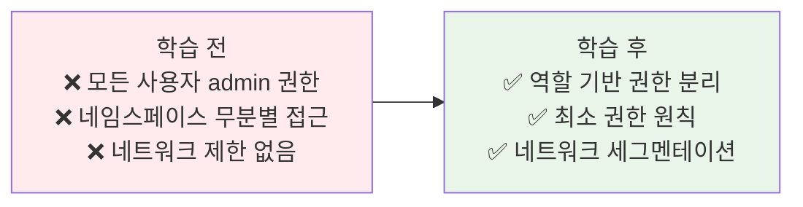
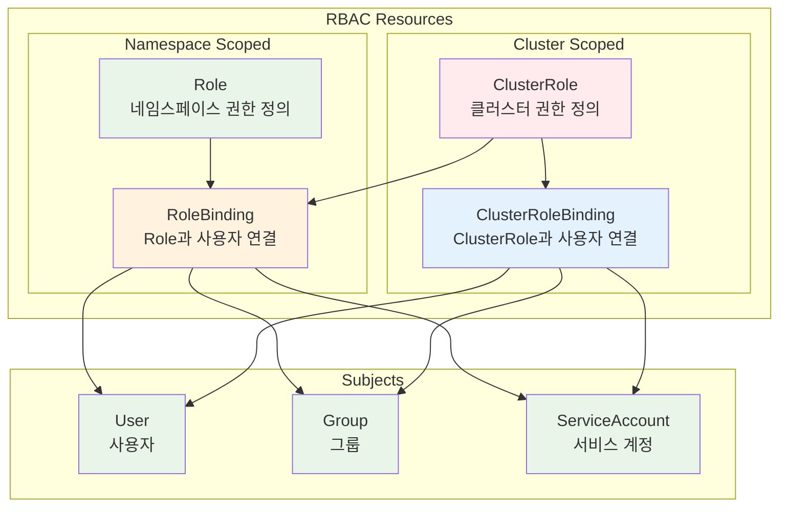
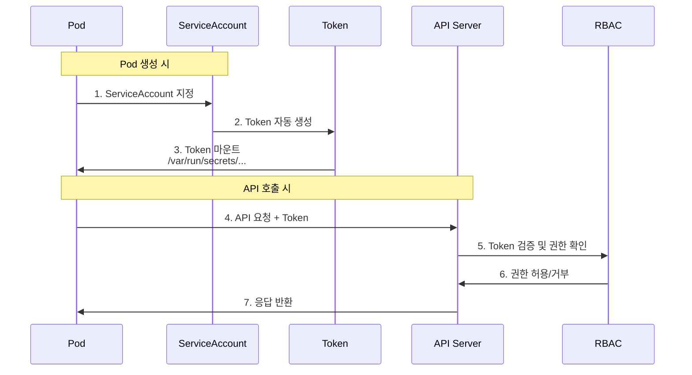
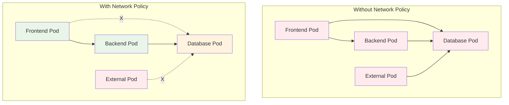
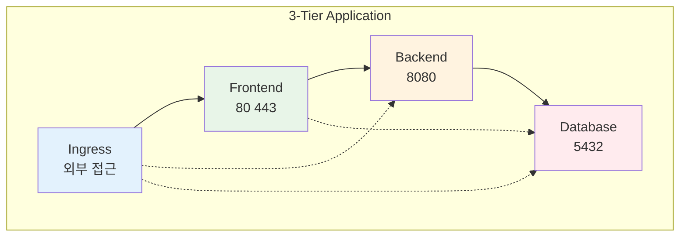

# Week 3 Day 4 Session 2: 권한 관리 & RBAC

<div align="center">

**👥 RBAC 시스템** • **🔐 권한 제어** • **🛡️ Network Policy**

*세밀한 권한 관리와 네트워크 보안*

</div>

---

## 🕘 세션 정보
**시간**: 10:00-10:50 (50분)  
**목표**: RBAC 기반 권한 관리와 네트워크 보안 완전 이해  
**방식**: RBAC 구조 → 실무 권한 설계 → Network Policy

---

## 🎯 세션 목표

### 📚 학습 목표
- **이해 목표**: RBAC 4가지 리소스와 권한 체계 완전 이해
- **적용 목표**: 실무 환경의 사용자/팀별 권한 설계 능력
- **협업 목표**: 최소 권한 원칙 기반 보안 정책 수립

### 🤔 왜 필요한가? (5분)

**현실 문제 상황**:
- 💼 **실무 시나리오**: 개발자가 실수로 프로덕션 Pod 삭제, 전체 서비스 중단
- 🏠 **일상 비유**: 회사 출입 카드 (부서별, 직급별 접근 권한 차등)
- 📊 **시장 동향**: 권한 오남용으로 인한 보안 사고 45% 차지

**학습 전후 비교**:


---

## 📖 핵심 개념 (35분)

### 🔍 개념 1: RBAC 구조와 4가지 리소스 (12분)

> **정의**: Role-Based Access Control, 역할 기반 접근 제어 시스템

**RBAC 4가지 핵심 리소스**:



**리소스별 특징과 용도**:

| 리소스 | 범위 | 용도 | 예시 |
|--------|------|------|------|
| **Role** | Namespace | 특정 네임스페이스 내 권한 | 개발팀의 dev 네임스페이스 접근 |
| **RoleBinding** | Namespace | Role과 사용자 연결 | john을 developer Role에 바인딩 |
| **ClusterRole** | Cluster | 클러스터 전체 권한 | 노드 조회, PV 관리 |
| **ClusterRoleBinding** | Cluster | ClusterRole과 사용자 연결 | admin을 cluster-admin에 바인딩 |

**실무 권한 설계 예시**:

```yaml
# 1. Role: 개발자 권한 (네임스페이스 수준)
apiVersion: rbac.authorization.k8s.io/v1
kind: Role
metadata:
  name: developer
  namespace: development
rules:
# Pod 관리 권한
- apiGroups: [""]
  resources: ["pods", "pods/log"]
  verbs: ["get", "list", "watch", "create", "delete"]
# Service 관리 권한
- apiGroups: [""]
  resources: ["services"]
  verbs: ["get", "list", "create", "update"]
# ConfigMap, Secret 읽기 권한
- apiGroups: [""]
  resources: ["configmaps", "secrets"]
  verbs: ["get", "list"]
# Deployment 관리 권한
- apiGroups: ["apps"]
  resources: ["deployments", "replicasets"]
  verbs: ["get", "list", "create", "update", "patch"]

---
# 2. RoleBinding: 개발자와 Role 연결
apiVersion: rbac.authorization.k8s.io/v1
kind: RoleBinding
metadata:
  name: developer-binding
  namespace: development
subjects:
# 사용자 바인딩
- kind: User
  name: john@company.com
  apiGroup: rbac.authorization.k8s.io
# 그룹 바인딩
- kind: Group
  name: developers
  apiGroup: rbac.authorization.k8s.io
roleRef:
  kind: Role
  name: developer
  apiGroup: rbac.authorization.k8s.io

---
# 3. ClusterRole: 읽기 전용 관리자
apiVersion: rbac.authorization.k8s.io/v1
kind: ClusterRole
metadata:
  name: read-only-admin
rules:
# 모든 리소스 읽기 권한
- apiGroups: ["*"]
  resources: ["*"]
  verbs: ["get", "list", "watch"]
# 노드 정보 조회
- apiGroups: [""]
  resources: ["nodes"]
  verbs: ["get", "list"]
# 네임스페이스 조회
- apiGroups: [""]
  resources: ["namespaces"]
  verbs: ["get", "list"]

---
# 4. ClusterRoleBinding: 운영팀 바인딩
apiVersion: rbac.authorization.k8s.io/v1
kind: ClusterRoleBinding
metadata:
  name: ops-team-binding
subjects:
- kind: Group
  name: ops-team
  apiGroup: rbac.authorization.k8s.io
roleRef:
  kind: ClusterRole
  name: read-only-admin
  apiGroup: rbac.authorization.k8s.io
```

**권한 검증 명령어**:
```bash
# 현재 사용자 권한 확인
kubectl auth can-i create pods
kubectl auth can-i delete deployments --namespace=production

# 다른 사용자 권한 확인 (관리자만 가능)
kubectl auth can-i create pods --as=john@company.com
kubectl auth can-i delete pods --as=john@company.com --namespace=development

# 모든 권한 확인
kubectl auth can-i --list --namespace=development
```

### 🔍 개념 2: ServiceAccount와 Pod 권한 (12분)

> **정의**: Pod가 API Server와 통신할 때 사용하는 신원 증명

**ServiceAccount 동작 원리**:



**ServiceAccount 생성과 사용**:

```yaml
# 1. ServiceAccount 생성
apiVersion: v1
kind: ServiceAccount
metadata:
  name: app-service-account
  namespace: production
automountServiceAccountToken: true  # 자동 마운트 활성화

---
# 2. Role 생성 (ServiceAccount용)
apiVersion: rbac.authorization.k8s.io/v1
kind: Role
metadata:
  name: app-role
  namespace: production
rules:
- apiGroups: [""]
  resources: ["configmaps"]
  verbs: ["get", "list"]
- apiGroups: [""]
  resources: ["secrets"]
  verbs: ["get"]

---
# 3. RoleBinding (ServiceAccount 연결)
apiVersion: rbac.authorization.k8s.io/v1
kind: RoleBinding
metadata:
  name: app-role-binding
  namespace: production
subjects:
- kind: ServiceAccount
  name: app-service-account
  namespace: production
roleRef:
  kind: Role
  name: app-role
  apiGroup: rbac.authorization.k8s.io

---
# 4. Pod에서 ServiceAccount 사용
apiVersion: v1
kind: Pod
metadata:
  name: app-pod
  namespace: production
spec:
  serviceAccountName: app-service-account
  containers:
  - name: app
    image: myapp:v1
    # Token이 자동으로 마운트됨
    # /var/run/secrets/kubernetes.io/serviceaccount/token
```

**Pod 내에서 API 호출**:
```bash
# Pod 내부에서 실행
TOKEN=$(cat /var/run/secrets/kubernetes.io/serviceaccount/token)
CACERT=/var/run/secrets/kubernetes.io/serviceaccount/ca.crt
NAMESPACE=$(cat /var/run/secrets/kubernetes.io/serviceaccount/namespace)

# API 호출 예시
curl --cacert $CACERT \
     --header "Authorization: Bearer $TOKEN" \
     https://kubernetes.default.svc/api/v1/namespaces/$NAMESPACE/configmaps
```

**기본 ServiceAccount vs 커스텀 ServiceAccount**:

| 구분 | 기본 ServiceAccount | 커스텀 ServiceAccount |
|------|---------------------|----------------------|
| **이름** | default | 사용자 정의 |
| **권한** | 최소 권한 (거의 없음) | 필요한 권한만 부여 |
| **용도** | 권한 불필요한 Pod | API 호출 필요한 Pod |
| **보안** | 안전 (권한 없음) | 최소 권한 원칙 적용 |

### 🔍 개념 3: Network Policy와 네트워크 보안 (11분)

> **정의**: Pod 간 네트워크 트래픽을 제어하는 방화벽 규칙

**Network Policy 동작 원리**:



**Network Policy 구조**:

```yaml
# 1. 기본 거부 정책 (모든 트래픽 차단)
apiVersion: networking.k8s.io/v1
kind: NetworkPolicy
metadata:
  name: default-deny-all
  namespace: production
spec:
  podSelector: {}  # 모든 Pod 선택
  policyTypes:
  - Ingress
  - Egress

---
# 2. Database 접근 제한 (Backend만 허용)
apiVersion: networking.k8s.io/v1
kind: NetworkPolicy
metadata:
  name: database-policy
  namespace: production
spec:
  podSelector:
    matchLabels:
      app: database
      tier: data
  policyTypes:
  - Ingress
  ingress:
  # Backend Pod에서만 접근 허용
  - from:
    - podSelector:
        matchLabels:
          app: backend
          tier: api
    ports:
    - protocol: TCP
      port: 5432

---
# 3. Frontend 정책 (외부 접근 허용)
apiVersion: networking.k8s.io/v1
kind: NetworkPolicy
metadata:
  name: frontend-policy
  namespace: production
spec:
  podSelector:
    matchLabels:
      app: frontend
      tier: web
  policyTypes:
  - Ingress
  - Egress
  ingress:
  # 모든 소스에서 접근 허용
  - from:
    - podSelector: {}
    - namespaceSelector: {}
    ports:
    - protocol: TCP
      port: 80
  egress:
  # Backend로만 나가는 트래픽 허용
  - to:
    - podSelector:
        matchLabels:
          app: backend
    ports:
    - protocol: TCP
      port: 8080
  # DNS 허용
  - to:
    - namespaceSelector:
        matchLabels:
          name: kube-system
    ports:
    - protocol: UDP
      port: 53

---
# 4. 네임스페이스 간 격리
apiVersion: networking.k8s.io/v1
kind: NetworkPolicy
metadata:
  name: namespace-isolation
  namespace: production
spec:
  podSelector: {}
  policyTypes:
  - Ingress
  ingress:
  # 같은 네임스페이스에서만 접근 허용
  - from:
    - podSelector: {}
```

**실무 Network Policy 패턴**:



**Network Policy 테스트**:
```bash
# 1. 테스트 Pod 생성
kubectl run test-pod --image=busybox --rm -it -- sh

# 2. 연결 테스트
nc -zv database-service 5432
wget -O- http://backend-service:8080/health

# 3. Network Policy 확인
kubectl get networkpolicy -n production
kubectl describe networkpolicy database-policy -n production

# 4. 트래픽 로그 확인 (Calico 사용 시)
kubectl logs -n calico-system -l k8s-app=calico-node
```

**🔑 핵심 키워드 정리**:
- **RBAC**: Role, RoleBinding, ClusterRole, ClusterRoleBinding
- **ServiceAccount**: Pod의 신원, API 호출 권한
- **Network Policy**: Ingress/Egress 규칙, Pod 간 통신 제어
- **최소 권한 원칙**: 필요한 최소한의 권한만 부여
- **기본 거부**: deny-by-default, 명시적 허용만 통과

---

## 💭 함께 생각해보기 (10분)

### 🤝 페어 토론 (5분)

**토론 주제**:
1. **권한 설계**: "개발팀, 운영팀, 보안팀에게 각각 어떤 권한을 부여해야 할까요?"
2. **ServiceAccount**: "모든 Pod에 커스텀 ServiceAccount를 만들어야 할까요?"
3. **Network Policy**: "기본 거부 정책을 적용하면 어떤 문제가 발생할 수 있을까요?"

**페어 활동 가이드**:
- 👥 **역할극**: 한 명은 개발자, 한 명은 보안 담당자 역할
- 🔄 **권한 협상**: 필요한 권한과 보안 요구사항 조율
- 📝 **정책 작성**: 합의된 권한 정책 문서화

### 🎯 전체 공유 (5분)

**공유 내용**:
- 각 팀의 권한 설계 전략
- ServiceAccount 사용 기준
- Network Policy 적용 시 주의사항

**💡 이해도 체크 질문**:
- ✅ "Role과 ClusterRole의 차이점은?"
- ✅ "ServiceAccount Token은 어디에 마운트되나요?"
- ✅ "Network Policy의 Ingress와 Egress 규칙 차이는?"

---

## 🎉 Fun Facts & 실무 팁

### 재미있는 사실들
- **기본 거부**: RBAC는 기본적으로 모든 것을 거부
- **Token 위치**: `/var/run/secrets/kubernetes.io/serviceaccount/token`
- **CNI 의존성**: Network Policy는 Calico, Cilium 등 CNI 플러그인 필요
- **네임스페이스 격리**: 기본적으로 네임스페이스 간 격리 없음

### 실무 베스트 프랙티스
1. **최소 권한**: 필요한 최소한의 권한만 부여
2. **정기 감사**: 권한 사용 내역 주기적 검토
3. **기본 거부**: Network Policy로 기본 거부 정책 적용
4. **문서화**: 권한 부여 이유와 범위 명확히 문서화

### 기업 사례
**Airbnb**:
- 네임스페이스별 팀 권한 분리
- ServiceAccount 기반 마이크로서비스 인증
- Network Policy로 PCI-DSS 컴플라이언스 달성

**Spotify**:
- 자동화된 RBAC 정책 생성 시스템
- GitOps 기반 권한 관리
- 개발자 셀프서비스 권한 요청 포털

---

## 📝 세션 마무리

### ✅ 오늘 세션 성과
- [ ] RBAC 4가지 리소스 완전 이해
- [ ] ServiceAccount 생성 및 사용 방법 습득
- [ ] Network Policy 작성 및 적용 능력
- [ ] 최소 권한 원칙 기반 보안 설계

### 🎯 다음 세션 준비
- **Session 3 주제**: 클러스터 유지보수
- **연결 고리**: 보안 설정 → 안정적 운영
- **사전 학습**: 클러스터 업그레이드, ETCD 백업

---

<div align="center">

**👥 RBAC 마스터** • **🔐 세밀한 권한 제어** • **🛡️ 네트워크 보안**

*최소 권한 원칙으로 안전한 클러스터 구축*

</div>
