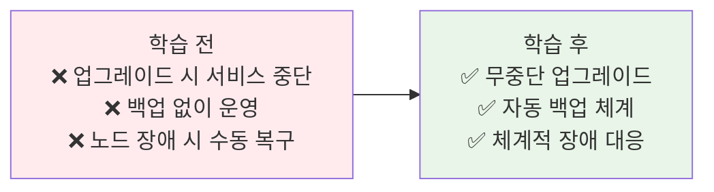
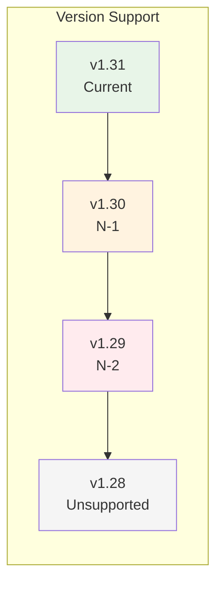
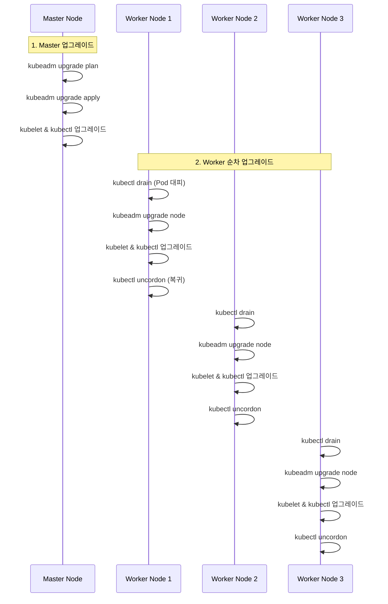
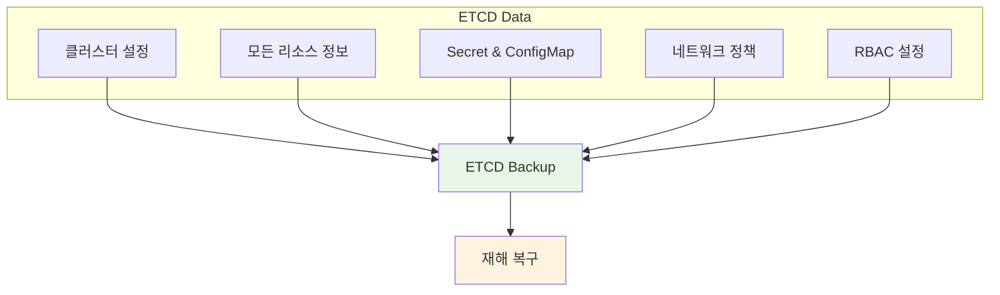
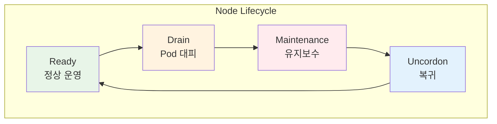

# Week 3 Day 4 Session 3: 클러스터 유지보수

<div align="center">

**🔄 클러스터 업그레이드** • **💾 백업 & 복원** • **🔧 노드 관리**

*프로덕션 클러스터의 안정적 운영과 관리*

</div>

---

## 🕘 세션 정보
**시간**: 11:00-11:50 (50분)  
**목표**: 클러스터 유지보수와 장애 대응 능력 습득  
**방식**: 업그레이드 전략 → 백업/복원 → 트러블슈팅

---

## 🎯 세션 목표

### 📚 학습 목표
- **이해 목표**: 무중단 클러스터 업그레이드 전략 이해
- **적용 목표**: ETCD 백업/복원을 통한 재해 복구 능력
- **협업 목표**: 노드 유지보수 시 서비스 영향 최소화 방안

### 🤔 왜 필요한가? (5분)

**현실 문제 상황**:
- 💼 **실무 시나리오**: 업그레이드 중 서비스 중단, ETCD 장애로 클러스터 전체 손실
- 🏠 **일상 비유**: 비행기 엔진 교체 (비행 중에 안전하게 교체해야 함)
- 📊 **시장 동향**: 클러스터 업그레이드 실패율 30%, 평균 복구 시간 4시간

**학습 전후 비교**:


---

## 📖 핵심 개념 (35분)

### 🔍 개념 1: 클러스터 업그레이드 전략 (12분)

> **정의**: 서비스 중단 없이 Kubernetes 버전을 안전하게 업그레이드하는 프로세스

**Kubernetes 버전 정책**:



**버전 지원 정책**:
- **Current (N)**: 최신 버전, 모든 기능 지원
- **N-1**: 이전 버전, 보안 패치 제공
- **N-2**: 2단계 이전, 제한적 지원
- **릴리스 주기**: 약 3개월마다 새 버전 출시

**업그레이드 순서**:



**마스터 노드 업그레이드**:

```bash
# 1. 현재 버전 확인
kubectl version --short
kubeadm version

# 2. 업그레이드 계획 확인
kubeadm upgrade plan

# 출력 예시:
# Components that must be upgraded manually after you have upgraded the control plane with 'kubeadm upgrade apply':
# COMPONENT   CURRENT       TARGET
# kubelet     3 x v1.30.0   v1.31.0
#
# Upgrade to the latest stable version:
# COMPONENT                 CURRENT   TARGET
# kube-apiserver            v1.30.0   v1.31.0
# kube-controller-manager   v1.30.0   v1.31.0
# kube-scheduler            v1.30.0   v1.31.0
# kube-proxy                v1.30.0   v1.31.0
# CoreDNS                   v1.11.1   v1.11.3
# etcd                      3.5.12-0  3.5.15-0

# 3. kubeadm 업그레이드
apt-mark unhold kubeadm
apt-get update && apt-get install -y kubeadm=1.31.0-00
apt-mark hold kubeadm

# 4. 업그레이드 적용
kubeadm upgrade apply v1.31.0

# 5. kubelet과 kubectl 업그레이드
apt-mark unhold kubelet kubectl
apt-get update && apt-get install -y kubelet=1.31.0-00 kubectl=1.31.0-00
apt-mark hold kubelet kubectl

# 6. kubelet 재시작
systemctl daemon-reload
systemctl restart kubelet

# 7. 상태 확인
kubectl get nodes
```

**워커 노드 업그레이드**:

```bash
# 1. 노드 드레인 (마스터에서 실행)
kubectl drain worker-node-1 --ignore-daemonsets --delete-emptydir-data

# 2. 워커 노드에서 kubeadm 업그레이드
apt-mark unhold kubeadm
apt-get update && apt-get install -y kubeadm=1.31.0-00
apt-mark hold kubeadm

# 3. 노드 업그레이드
kubeadm upgrade node

# 4. kubelet과 kubectl 업그레이드
apt-mark unhold kubelet kubectl
apt-get update && apt-get install -y kubelet=1.31.0-00 kubectl=1.31.0-00
apt-mark hold kubelet kubectl

# 5. kubelet 재시작
systemctl daemon-reload
systemctl restart kubelet

# 6. 노드 복귀 (마스터에서 실행)
kubectl uncordon worker-node-1

# 7. 상태 확인
kubectl get nodes
```

**업그레이드 체크리스트**:
- [ ] 현재 버전과 타겟 버전 확인
- [ ] 백업 완료 (ETCD, 설정 파일)
- [ ] 업그레이드 계획 검토
- [ ] 마스터 노드 업그레이드
- [ ] 워커 노드 순차 업그레이드
- [ ] 전체 클러스터 상태 확인
- [ ] 애플리케이션 동작 검증

### 🔍 개념 2: ETCD 백업과 복원 (12분)

> **정의**: 클러스터의 모든 상태 정보를 저장하는 ETCD의 백업과 재해 복구

**ETCD의 중요성**:



**ETCD 백업 방법**:

```bash
# 1. ETCD 엔드포인트 확인
kubectl get pods -n kube-system | grep etcd

# 2. ETCD 백업 (스냅샷 생성)
ETCDCTL_API=3 etcdctl snapshot save /backup/etcd-snapshot.db \
  --endpoints=https://127.0.0.1:2379 \
  --cacert=/etc/kubernetes/pki/etcd/ca.crt \
  --cert=/etc/kubernetes/pki/etcd/server.crt \
  --key=/etc/kubernetes/pki/etcd/server.key

# 3. 백업 검증
ETCDCTL_API=3 etcdctl snapshot status /backup/etcd-snapshot.db \
  --write-out=table

# 출력 예시:
# +----------+----------+------------+------------+
# |   HASH   | REVISION | TOTAL KEYS | TOTAL SIZE |
# +----------+----------+------------+------------+
# | 12345678 |   123456 |       1234 |     10 MB  |
# +----------+----------+------------+------------+

# 4. 자동 백업 스크립트
cat > /usr/local/bin/etcd-backup.sh << 'EOF'
#!/bin/bash
BACKUP_DIR="/backup/etcd"
DATE=$(date +%Y%m%d-%H%M%S)
BACKUP_FILE="$BACKUP_DIR/etcd-snapshot-$DATE.db"

mkdir -p $BACKUP_DIR

ETCDCTL_API=3 etcdctl snapshot save $BACKUP_FILE \
  --endpoints=https://127.0.0.1:2379 \
  --cacert=/etc/kubernetes/pki/etcd/ca.crt \
  --cert=/etc/kubernetes/pki/etcd/server.crt \
  --key=/etc/kubernetes/pki/etcd/server.key

# 7일 이상 된 백업 삭제
find $BACKUP_DIR -name "etcd-snapshot-*.db" -mtime +7 -delete

echo "Backup completed: $BACKUP_FILE"
EOF

chmod +x /usr/local/bin/etcd-backup.sh

# 5. Cron 작업 등록 (매일 새벽 2시)
echo "0 2 * * * /usr/local/bin/etcd-backup.sh" | crontab -
```

**ETCD 복원 방법**:

```bash
# 1. 클러스터 중지 (모든 마스터 노드에서)
systemctl stop kubelet
systemctl stop etcd

# 2. 기존 ETCD 데이터 백업
mv /var/lib/etcd /var/lib/etcd.old

# 3. 스냅샷에서 복원
ETCDCTL_API=3 etcdctl snapshot restore /backup/etcd-snapshot.db \
  --data-dir=/var/lib/etcd \
  --name=master-node-1 \
  --initial-cluster=master-node-1=https://192.168.1.10:2380 \
  --initial-cluster-token=etcd-cluster-1 \
  --initial-advertise-peer-urls=https://192.168.1.10:2380

# 4. 권한 설정
chown -R etcd:etcd /var/lib/etcd

# 5. ETCD 및 kubelet 재시작
systemctl start etcd
systemctl start kubelet

# 6. 클러스터 상태 확인
kubectl get nodes
kubectl get pods --all-namespaces
```

**백업 전략**:

| 백업 유형 | 주기 | 보관 기간 | 용도 |
|----------|------|----------|------|
| **일일 백업** | 매일 새벽 2시 | 7일 | 일상적 복구 |
| **주간 백업** | 매주 일요일 | 4주 | 중기 복구 |
| **월간 백업** | 매월 1일 | 12개월 | 장기 보관 |
| **업그레이드 전** | 업그레이드 직전 | 영구 | 롤백용 |

### 🔍 개념 3: 노드 유지보수와 트러블슈팅 (11분)

> **정의**: 노드 장애 대응과 안전한 유지보수 절차

**노드 관리 명령어**:



**노드 유지보수 절차**:

```bash
# 1. 노드 상태 확인
kubectl get nodes
kubectl describe node worker-node-1

# 2. Cordon (새 Pod 스케줄링 중지)
kubectl cordon worker-node-1
# 결과: node/worker-node-1 cordoned

# 3. Drain (기존 Pod 대피)
kubectl drain worker-node-1 \
  --ignore-daemonsets \
  --delete-emptydir-data \
  --force \
  --grace-period=300

# 옵션 설명:
# --ignore-daemonsets: DaemonSet Pod는 무시
# --delete-emptydir-data: emptyDir 볼륨 데이터 삭제 허용
# --force: ReplicaSet 없는 Pod도 강제 삭제
# --grace-period: Pod 종료 대기 시간 (초)

# 4. 유지보수 작업 수행
# - OS 업데이트
# - 하드웨어 교체
# - 커널 패치 등

# 5. Uncordon (노드 복귀)
kubectl uncordon worker-node-1
# 결과: node/worker-node-1 uncordoned

# 6. 상태 확인
kubectl get nodes
kubectl get pods -o wide | grep worker-node-1
```

**노드 장애 시나리오와 대응**:

| 장애 유형 | 증상 | 원인 | 해결 방법 |
|----------|------|------|----------|
| **NotReady** | 노드 상태 NotReady | kubelet 중단, 네트워크 단절 | kubelet 재시작, 네트워크 확인 |
| **DiskPressure** | 디스크 공간 부족 | 로그, 이미지 누적 | 불필요한 파일 삭제, 볼륨 확장 |
| **MemoryPressure** | 메모리 부족 | Pod 리소스 과다 사용 | Pod 제한, 노드 추가 |
| **PIDPressure** | 프로세스 수 초과 | 프로세스 누수 | 문제 Pod 재시작 |

**트러블슈팅 명령어**:

```bash
# 1. 노드 상태 상세 확인
kubectl describe node worker-node-1

# 2. 노드 로그 확인
journalctl -u kubelet -f
journalctl -u docker -f  # 또는 containerd

# 3. 리소스 사용량 확인
kubectl top nodes
kubectl top pods --all-namespaces

# 4. 이벤트 확인
kubectl get events --all-namespaces --sort-by='.lastTimestamp'

# 5. Pod 상태 확인
kubectl get pods --all-namespaces -o wide
kubectl describe pod <pod-name> -n <namespace>

# 6. 네트워크 연결 확인
ping <node-ip>
nc -zv <node-ip> 10250  # kubelet 포트

# 7. 인증서 확인
openssl x509 -in /var/lib/kubelet/pki/kubelet.crt -noout -dates

# 8. 클러스터 전체 상태
kubectl cluster-info
kubectl get componentstatuses
```

**일반적인 문제와 해결책**:

```bash
# 문제 1: kubelet이 시작되지 않음
systemctl status kubelet
journalctl -u kubelet -n 50
# 해결: 설정 파일 확인, 인증서 갱신

# 문제 2: Pod이 Pending 상태
kubectl describe pod <pod-name>
# 해결: 리소스 부족, 노드 선택자 확인

# 문제 3: 노드가 NotReady
kubectl describe node <node-name>
# 해결: kubelet 재시작, 네트워크 확인

# 문제 4: 디스크 공간 부족
df -h
docker system prune -a  # 또는 crictl rmi --prune
# 해결: 불필요한 이미지/컨테이너 삭제
```

**🔑 핵심 키워드 정리**:
- **업그레이드**: kubeadm upgrade, drain, uncordon
- **ETCD 백업**: snapshot save, snapshot restore
- **노드 관리**: cordon, drain, uncordon
- **트러블슈팅**: describe, logs, events, top
- **버전 정책**: N, N-1, N-2 지원

---

## 💭 함께 생각해보기 (10분)

### 🤝 페어 토론 (5분)

**토론 주제**:
1. **업그레이드 전략**: "프로덕션 환경에서 업그레이드 시 어떤 순서로 진행해야 할까요?"
2. **백업 주기**: "ETCD 백업은 얼마나 자주 해야 할까요? 보관 기간은?"
3. **노드 장애**: "노드가 NotReady 상태일 때 가장 먼저 확인해야 할 것은?"

**페어 활동 가이드**:
- 👥 **시나리오 연습**: 업그레이드 또는 장애 상황 시뮬레이션
- 🔄 **역할 교대**: 한 명은 운영자, 한 명은 관찰자
- 📝 **체크리스트**: 유지보수 절차 체크리스트 작성

### 🎯 전체 공유 (5분)

**공유 내용**:
- 각 팀의 업그레이드 전략
- 백업 및 복원 경험 공유
- 노드 장애 대응 노하우

**💡 이해도 체크 질문**:
- ✅ "클러스터 업그레이드 순서는?"
- ✅ "ETCD 백업 명령어와 필요한 인증서는?"
- ✅ "drain과 cordon의 차이점은?"

---

## 🎉 Fun Facts & 실무 팁

### 재미있는 사실들
- **버전 지원**: Kubernetes는 3개 버전만 지원 (약 9개월)
- **ETCD 크기**: 일반적으로 수백 MB, 대규모는 수 GB
- **업그레이드 시간**: 마스터 10분, 워커 노드당 5분
- **자동 복구**: kubelet은 인증서 만료 전 자동 갱신 시도

### 실무 베스트 프랙티스
1. **정기 백업**: 매일 자동 백업, 업그레이드 전 수동 백업
2. **테스트 환경**: 프로덕션 전 테스트 환경에서 먼저 업그레이드
3. **롤백 계획**: 업그레이드 실패 시 롤백 절차 준비
4. **모니터링**: 업그레이드 중 클러스터 상태 실시간 모니터링

### 기업 사례
**Shopify**:
- 매월 정기 업그레이드로 최신 버전 유지
- 자동화된 ETCD 백업 시스템 (시간당 1회)
- 카나리 업그레이드로 위험 최소화

**Zalando**:
- 블루-그린 클러스터 전환으로 무중단 업그레이드
- ETCD 백업을 S3에 자동 저장
- 업그레이드 실패 시 자동 롤백 시스템

---

## 📝 세션 마무리

### ✅ 오늘 세션 성과
- [ ] 클러스터 업그레이드 절차 완전 이해
- [ ] ETCD 백업/복원 능력 습득
- [ ] 노드 유지보수 방법 숙지
- [ ] 트러블슈팅 기본 능력 확보

### 🎯 다음 실습 준비
- **Lab 4**: 보안 설정 & 권한 관리
- **Challenge 4**: 보안 침해 시나리오
- **준비물**: 테스트 클러스터, RBAC 정책 예시

---

<div align="center">

**🔄 안정적 업그레이드** • **💾 완벽한 백업** • **🔧 체계적 관리**

*프로덕션 클러스터의 안정적 운영을 위한 필수 역량*

</div>
