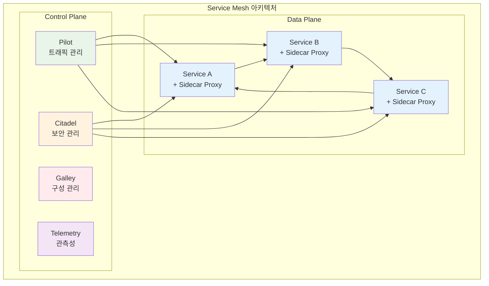

# Week 3 Day 5: Istio Service Mesh와 통합 프로젝트

<div align="center">

**🌐 Service Mesh** • **🔀 트래픽 관리** • **👁️ 관측성**

*CNCF 기초 과정 - Istio부터 마이크로서비스까지, Service Mesh 마스터*

</div>

---

## 🕘 세션 정보
**시간**: 09:00-11:50 (이론 2.5시간) + 13:00-14:30 (통합 프로젝트 1.5시간)
**목표**: Istio 설치/구성 + 트래픽 관리 + 보안 + 관측성
**방식**: 개인 역량 개발 + 레벨별 차별화 + 통합 프로젝트 완성

## 🎯 세션 목표
### 📚 학습 목표
- **이해 목표**: Service Mesh 개념, Istio 아키텍처, 트래픽 관리 완전 이해
- **적용 목표**: Istio를 통한 마이크로서비스 관리 및 고급 배포 전략 구현
- **통합 목표**: Week 3 전체 학습을 통합한 클라우드 네이티브 프로젝트 완성

---

## 📖 Session 1: Service Mesh 개념 + Istio 아키텍처 (50분)

### 🔍 개념 1: Service Mesh 기본 개념 (15분)
> **정의**: 마이크로서비스 간 통신을 관리하는 전용 인프라 계층

**Service Mesh가 해결하는 문제**:
- **서비스 간 통신**: 복잡한 마이크로서비스 네트워크 관리
- **보안**: 서비스 간 암호화 통신 (mTLS)
- **관측성**: 트래픽 모니터링 및 추적
- **트래픽 관리**: 로드 밸런싱, 라우팅, 재시도

**Service Mesh 아키텍처**:


### 🔍 개념 2: Istio 아키텍처 (15분)
> **정의**: Istio의 구성 요소와 각각의 역할

**Istio 구성 요소**:
- **Envoy Proxy**: 사이드카 프록시, 실제 트래픽 처리
- **Istiod**: 통합 컨트롤 플레인 (Pilot + Citadel + Galley)
- **Ingress Gateway**: 외부 트래픽 진입점
- **Egress Gateway**: 외부로 나가는 트래픽 제어

**Istio vs 다른 Service Mesh**:
| 구분 | Istio | Linkerd | Consul Connect |
|------|-------|---------|----------------|
| **복잡성** | 높음 | 낮음 | 중간 |
| **기능** | 풍부 | 기본적 | 중간 |
| **성능** | 중간 | 높음 | 중간 |
| **생태계** | 광범위 | 제한적 | HashiCorp 중심 |

### 🔍 개념 3: Istio 설치 방법 (15분)
> **정의**: 다양한 환경에서 Istio를 설치하고 구성하는 방법

**설치 옵션**:
- **istioctl**: 공식 CLI 도구를 통한 설치
- **Helm**: Helm 차트를 통한 커스터마이징 설치
- **Operator**: Istio Operator를 통한 관리
- **Demo Profile**: 학습 및 테스트용 간단 설치

### 💭 함께 생각해보기 (5분)
**🤝 페어 토론**:
1. "Service Mesh가 없다면 마이크로서비스에서 어떤 문제가 발생할까요?"
2. "Istio를 도입할 때 고려해야 할 요소들은?"

---

## 📖 Session 2: 트래픽 관리 (VirtualService, DestinationRule) (50분)

### 🔍 개념 1: VirtualService 트래픽 라우팅 (15분)
> **정의**: HTTP/TCP 트래픽의 라우팅 규칙을 정의하는 Istio 리소스

**VirtualService 주요 기능**:
- **호스트 기반 라우팅**: 도메인별 트래픽 분기
- **경로 기반 라우팅**: URL 경로별 서비스 분기
- **헤더 기반 라우팅**: HTTP 헤더 조건부 라우팅
- **가중치 기반 라우팅**: 트래픽 비율 분할

**VirtualService 예시**:
```yaml
apiVersion: networking.istio.io/v1beta1
kind: VirtualService
metadata:
  name: bookinfo
spec:
  hosts:
  - bookinfo.com
  http:
  - match:
    - headers:
        end-user:
          exact: jason
    route:
    - destination:
        host: reviews
        subset: v2
  - route:
    - destination:
        host: reviews
        subset: v1
      weight: 90
    - destination:
        host: reviews
        subset: v3
      weight: 10
```

### 🔍 개념 2: DestinationRule 정책 설정 (15분)
> **정의**: 서비스의 트래픽 정책과 서브셋을 정의하는 Istio 리소스

**DestinationRule 주요 기능**:
- **로드 밸런싱**: 라운드 로빈, 최소 연결 등
- **연결 풀**: 연결 수 제한 및 타임아웃 설정
- **Circuit Breaker**: 장애 전파 방지
- **Subset 정의**: 서비스 버전별 그룹화

**DestinationRule 예시**:
```yaml
apiVersion: networking.istio.io/v1beta1
kind: DestinationRule
metadata:
  name: reviews
spec:
  host: reviews
  trafficPolicy:
    loadBalancer:
      simple: LEAST_CONN
    connectionPool:
      tcp:
        maxConnections: 10
      http:
        http1MaxPendingRequests: 10
        maxRequestsPerConnection: 2
    circuitBreaker:
      consecutiveErrors: 3
      interval: 30s
      baseEjectionTime: 30s
  subsets:
  - name: v1
    labels:
      version: v1
  - name: v2
    labels:
      version: v2
  - name: v3
    labels:
      version: v3
```

### 🔍 개념 3: 고급 트래픽 관리 패턴 (15분)
> **정의**: 카나리 배포, A/B 테스트, 트래픽 미러링 등 고급 배포 전략

**고급 패턴들**:
- **카나리 배포**: 점진적 트래픽 증가
- **A/B 테스트**: 사용자 그룹별 다른 버전
- **트래픽 미러링**: 프로덕션 트래픽 복사
- **Fault Injection**: 장애 시뮬레이션

**카나리 배포 예시**:
```yaml
apiVersion: networking.istio.io/v1beta1
kind: VirtualService
metadata:
  name: canary-deployment
spec:
  hosts:
  - productpage
  http:
  - match:
    - headers:
        canary:
          exact: "true"
    route:
    - destination:
        host: productpage
        subset: v2
  - route:
    - destination:
        host: productpage
        subset: v1
      weight: 95
    - destination:
        host: productpage
        subset: v2
      weight: 5
```

### 💭 함께 생각해보기 (5분)
**🤝 페어 토론**:
1. "카나리 배포와 블루-그린 배포의 차이점은?"
2. "Circuit Breaker는 언제 사용해야 할까요?"

---

## 📖 Session 3: 보안 (mTLS) + 관측성 (Kiali, Jaeger) (50분)

### 🔍 개념 1: mTLS (Mutual TLS) 보안 (15분)
> **정의**: 서비스 간 상호 인증과 암호화 통신을 제공하는 보안 메커니즘

**mTLS 특징**:
- **상호 인증**: 클라이언트와 서버 모두 인증서 검증
- **자동 인증서 관리**: Istio가 자동으로 인증서 생성 및 순환
- **투명한 암호화**: 애플리케이션 코드 변경 없이 암호화
- **정책 기반 제어**: 네임스페이스별, 서비스별 정책 설정

**mTLS 설정 예시**:
```yaml
# PeerAuthentication - mTLS 모드 설정
apiVersion: security.istio.io/v1beta1
kind: PeerAuthentication
metadata:
  name: default
  namespace: production
spec:
  mtls:
    mode: STRICT

---
# AuthorizationPolicy - 접근 제어
apiVersion: security.istio.io/v1beta1
kind: AuthorizationPolicy
metadata:
  name: productpage-policy
  namespace: production
spec:
  selector:
    matchLabels:
      app: productpage
  rules:
  - from:
    - source:
        principals: ["cluster.local/ns/production/sa/bookinfo-productpage"]
  - to:
    - operation:
        methods: ["GET"]
```

### 🔍 개념 2: Kiali 서비스 메시 시각화 (15분)
> **정의**: Istio 서비스 메시의 토폴로지와 상태를 시각화하는 도구

**Kiali 주요 기능**:
- **서비스 토폴로지**: 서비스 간 연결 관계 시각화
- **트래픽 플로우**: 실시간 트래픽 흐름 모니터링
- **성능 메트릭**: 응답 시간, 에러율, 처리량 표시
- **구성 검증**: Istio 구성 오류 감지

### 🔍 개념 3: Jaeger 분산 추적 (15분)
> **정의**: 마이크로서비스 간 요청 흐름을 추적하는 분산 추적 시스템

**Jaeger 주요 기능**:
- **요청 추적**: 단일 요청의 전체 경로 추적
- **성능 분석**: 각 서비스별 처리 시간 분석
- **병목 지점 식별**: 느린 서비스나 구간 식별
- **의존성 분석**: 서비스 간 의존 관계 파악

**추적 데이터 예시**:
```yaml
# Jaeger 추적을 위한 애플리케이션 설정
apiVersion: v1
kind: ConfigMap
metadata:
  name: jaeger-config
data:
  config.yaml: |
    service_name: productpage
    sampler:
      type: const
      param: 1
    reporter:
      log_spans: true
      agent_host: jaeger-agent
      agent_port: 6831
```

### 💭 함께 생각해보기 (5분)
**🤝 페어 토론**:
1. "mTLS를 모든 서비스에 적용해야 할까요?"
2. "분산 추적이 성능에 미치는 영향은?"

---

## 🛠️ 통합 프로젝트 (1.5시간)

### 🎯 프로젝트 개요
**목표**: Week 3 전체 학습을 통합한 클라우드 네이티브 마이크로서비스 프로젝트

### 🚀 Lab 1: Istio 설치 + 마이크로서비스 배포 (50분)

#### Step 1: Istio 설치 (15분)
```bash
# 1. Istio 다운로드 및 설치
curl -L https://istio.io/downloadIstio | sh -
cd istio-*
export PATH=$PWD/bin:$PATH

# 2. Istio 설치 (Demo 프로필)
istioctl install --set values.defaultRevision=default -y

# 3. 네임스페이스에 Istio 사이드카 자동 주입 활성화
kubectl label namespace default istio-injection=enabled

# 4. Istio 구성 요소 확인
kubectl get pods -n istio-system
```

#### Step 2: Bookinfo 샘플 애플리케이션 배포 (20분)
```bash
# 1. Bookinfo 애플리케이션 배포
kubectl apply -f samples/bookinfo/platform/kube/bookinfo.yaml

# 2. 서비스 확인
kubectl get services
kubectl get pods

# 3. 애플리케이션 동작 확인
kubectl exec "$(kubectl get pod -l app=ratings -o jsonpath='{.items[0].metadata.name}')" -c ratings -- curl -sS productpage:9080/productpage | grep -o "<title>.*</title>"

# 4. Istio Gateway 생성
kubectl apply -f samples/bookinfo/networking/bookinfo-gateway.yaml

# 5. 외부 접근 확인
kubectl get gateway
export INGRESS_HOST=$(kubectl -n istio-system get service istio-ingressgateway -o jsonpath='{.status.loadBalancer.ingress[0].ip}')
export INGRESS_PORT=$(kubectl -n istio-system get service istio-ingressgateway -o jsonpath='{.spec.ports[?(@.name=="http2")].port}')
export GATEWAY_URL=$INGRESS_HOST:$INGRESS_PORT

# Docker Desktop의 경우
export GATEWAY_URL=localhost:80
kubectl port-forward -n istio-system svc/istio-ingressgateway 8080:80 &

curl -s http://${GATEWAY_URL}/productpage | grep -o "<title>.*</title>"
```

#### Step 3: 관측성 도구 설치 (15분)
```bash
# 1. Kiali, Jaeger, Prometheus, Grafana 설치
kubectl apply -f samples/addons/

# 2. 서비스 확인
kubectl get pods -n istio-system

# 3. Kiali 대시보드 접근
kubectl port-forward -n istio-system svc/kiali 20001:20001 &

# 4. Jaeger 대시보드 접근
kubectl port-forward -n istio-system svc/jaeger 16686:16686 &

# 5. 트래픽 생성 (백그라운드)
for i in $(seq 1 100); do curl -s -o /dev/null http://${GATEWAY_URL}/productpage; done &
```

### 🌟 Lab 2: 카나리 배포 + 트래픽 분할 + 모니터링 (50분)

#### Step 1: 트래픽 관리 설정 (20분)
```yaml
# destination-rule-all.yaml
apiVersion: networking.istio.io/v1beta1
kind: DestinationRule
metadata:
  name: productpage
spec:
  host: productpage
  subsets:
  - name: v1
    labels:
      version: v1
---
apiVersion: networking.istio.io/v1beta1
kind: DestinationRule
metadata:
  name: reviews
spec:
  host: reviews
  subsets:
  - name: v1
    labels:
      version: v1
  - name: v2
    labels:
      version: v2
  - name: v3
    labels:
      version: v3
---
apiVersion: networking.istio.io/v1beta1
kind: DestinationRule
metadata:
  name: ratings
spec:
  host: ratings
  subsets:
  - name: v1
    labels:
      version: v1
  - name: v2
    labels:
      version: v2
  - name: v2-mysql
    labels:
      version: v2-mysql
  - name: v2-mysql-vm
    labels:
      version: v2-mysql-vm
---
apiVersion: networking.istio.io/v1beta1
kind: DestinationRule
metadata:
  name: details
spec:
  host: details
  subsets:
  - name: v1
    labels:
      version: v1
  - name: v2
    labels:
      version: v2
```

```bash
# DestinationRule 적용
kubectl apply -f destination-rule-all.yaml
```

#### Step 2: 카나리 배포 구현 (15분)
```yaml
# canary-reviews.yaml
apiVersion: networking.istio.io/v1beta1
kind: VirtualService
metadata:
  name: reviews
spec:
  hosts:
  - reviews
  http:
  - match:
    - headers:
        end-user:
          exact: jason
    route:
    - destination:
        host: reviews
        subset: v2
  - route:
    - destination:
        host: reviews
        subset: v1
      weight: 80
    - destination:
        host: reviews
        subset: v2
      weight: 20
```

```bash
# 카나리 배포 적용
kubectl apply -f canary-reviews.yaml

# 트래픽 테스트
for i in $(seq 1 20); do
  curl -s http://${GATEWAY_URL}/productpage | grep -c "glyphicon-star"
done
```

#### Step 3: 보안 및 모니터링 설정 (15분)
```yaml
# security-policy.yaml
apiVersion: security.istio.io/v1beta1
kind: PeerAuthentication
metadata:
  name: default
spec:
  mtls:
    mode: STRICT
---
apiVersion: security.istio.io/v1beta1
kind: AuthorizationPolicy
metadata:
  name: allow-all
spec:
  rules:
  - {}
```

```bash
# 보안 정책 적용
kubectl apply -f security-policy.yaml

# mTLS 상태 확인
istioctl authn tls-check productpage.default.svc.cluster.local

# Kiali에서 서비스 메시 확인 (http://localhost:20001)
# Jaeger에서 분산 추적 확인 (http://localhost:16686)

# 트래픽 생성 및 모니터링
while true; do
  curl -s -o /dev/null http://${GATEWAY_URL}/productpage
  sleep 0.5
done
```

---

## 📝 Week 3 최종 성과 정리

### ✅ 완성된 클라우드 네이티브 역량
- [x] **Kubernetes 기초**: Docker Desktop 환경에서 Pod, Service, Deployment 완전 습득
- [x] **네트워킹**: Service 타입별 이해 및 Ingress를 통한 외부 노출
- [x] **스토리지**: PV/PVC를 통한 데이터 영속성 및 StatefulSet 상태 관리
- [x] **GitOps**: ArgoCD를 통한 선언적 배포 파이프라인 구축
- [x] **Service Mesh**: Istio를 통한 마이크로서비스 트래픽 관리 및 보안

### 🎯 레벨별 성취도

#### 🟢 초급자 성과
- Kubernetes 기본 개념 완전 이해
- Docker Desktop 환경에서 기본 워크로드 배포
- ArgoCD 기본 사용법 습득
- Istio 기본 구성 및 간단한 트래픽 관리

#### 🟡 중급자 성과
- 고급 네트워킹 및 Ingress 구성
- StatefulSet을 통한 상태 관리 애플리케이션 운영
- 멀티 환경 GitOps 파이프라인 구축
- Istio 고급 라우팅 및 보안 정책 적용

#### 🔴 고급자 성과
- 커스텀 리소스 및 고급 kubectl 활용
- 복잡한 스토리지 전략 및 백업 구성
- 고급 GitOps 배포 전략 및 롤백 시나리오
- Istio 성능 최적화 및 고급 관측성 구축

### 🚀 다음 주 준비사항
- **Week 4 예습**: 마이크로서비스 아키텍처 패턴
- **프로젝트 확장**: 실제 애플리케이션 개발 준비
- **포트폴리오**: GitHub에 Week 3 프로젝트 정리

---

<div align="center">

**🌐 Service Mesh 마스터** • **🚀 GitOps 전문가** • **☸️ 클라우드 네이티브 개발자**

*CNCF 기초 과정을 통해 현대적인 클라우드 네이티브 애플리케이션 개발과 운영의 모든 기초를 완벽하게 습득했습니다*

</div>