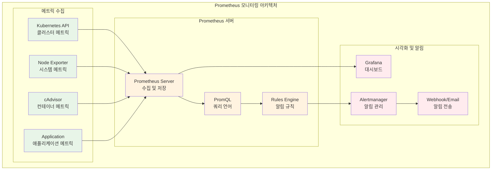
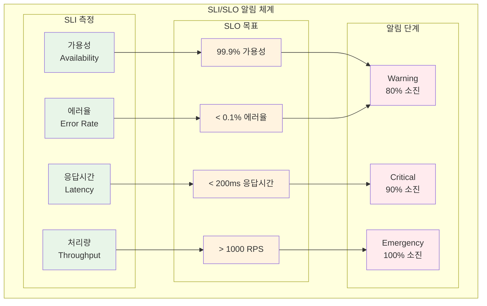
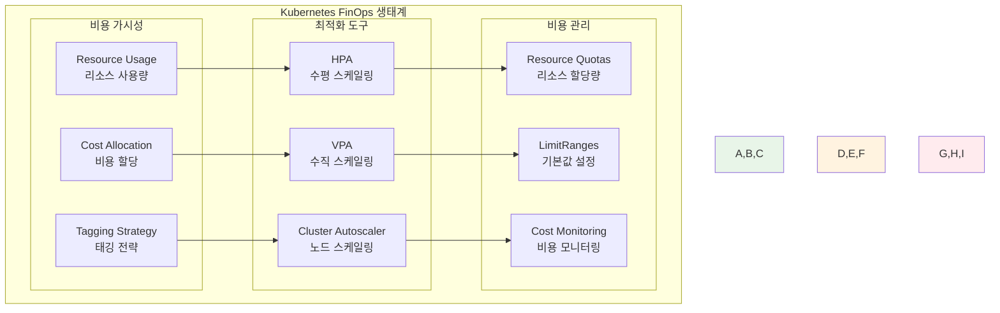
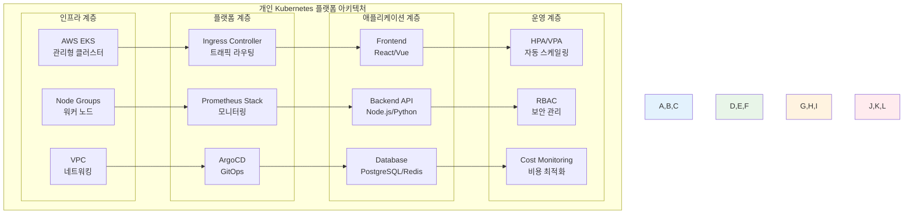

# Week 3 Day 5: 모니터링, FinOps & 통합 프로젝트

<div align="center">

**📊 모니터링 스택** • **💰 FinOps** • **🎯 통합 프로젝트**

*Prometheus부터 비용 최적화까지, 완전한 Kubernetes 플랫폼 구축*

</div>

---

## 🕘 세션 정보
**시간**: 09:00-11:50 (이론 2.5시간) + 13:00-16:00 (통합 프로젝트 3시간)
**목표**: 모니터링 스택 구축 + FinOps 적용 + 주간 통합 프로젝트 완성
**방식**: 개인 역량 개발 + 레벨별 차별화 + 포트폴리오 완성

## 🎯 세션 목표
### 📚 학습 목표
- **이해 목표**: Prometheus/Grafana 모니터링 스택과 FinOps 원칙 완전 이해
- **적용 목표**: 완전한 관측성 시스템 구축 및 비용 최적화 전략 구현
- **통합 목표**: Week 3 전체 학습을 통합한 개인 Kubernetes 플랫폼 완성

---

## 📖 Session 1: Prometheus + Grafana 모니터링 스택 (50분)

### 🔍 개념 1: Prometheus 아키텍처와 메트릭 수집 (15분)
> **정의**: 시계열 데이터베이스 기반의 오픈소스 모니터링 및 알림 시스템

**Prometheus 핵심 구성요소**:
- **Prometheus Server**: 메트릭 수집 및 저장
- **Pushgateway**: 단기 작업의 메트릭 수집
- **Exporters**: 다양한 시스템의 메트릭 노출
- **Alertmanager**: 알림 규칙 처리 및 전송



**Prometheus 설치 (Helm 사용)**:
```bash
# Prometheus 네임스페이스 생성
kubectl create namespace monitoring

# Helm으로 Prometheus 설치
helm repo add prometheus-community https://prometheus-community.github.io/helm-charts
helm repo update

helm install prometheus prometheus-community/kube-prometheus-stack \
  --namespace monitoring \
  --set prometheus.prometheusSpec.storageSpec.volumeClaimTemplate.spec.resources.requests.storage=10Gi \
  --set grafana.adminPassword=admin123
```

### 🔍 개념 2: Grafana 대시보드와 시각화 (15분)
> **정의**: 메트릭 데이터를 시각적으로 표현하고 대시보드를 구성하는 도구

**Grafana 핵심 기능**:
- **데이터소스 연결**: Prometheus, InfluxDB, CloudWatch 등
- **대시보드 구성**: 패널, 차트, 테이블 등 다양한 시각화
- **알림 설정**: 임계값 기반 알림 및 통지
- **사용자 관리**: 팀별, 역할별 접근 권한 관리

**주요 Kubernetes 메트릭**:
```promql
# CPU 사용률
rate(container_cpu_usage_seconds_total[5m]) * 100

# 메모리 사용률
container_memory_usage_bytes / container_spec_memory_limit_bytes * 100

# Pod 재시작 횟수
increase(kube_pod_container_status_restarts_total[1h])

# 네트워크 트래픽
rate(container_network_receive_bytes_total[5m])
rate(container_network_transmit_bytes_total[5m])
```

### 🔍 개념 3: 커스텀 메트릭과 애플리케이션 모니터링 (15분)
> **정의**: 애플리케이션별 비즈니스 메트릭을 수집하고 모니터링하는 방법

**애플리케이션 메트릭 타입**:
- **Counter**: 누적 카운터 (요청 수, 에러 수)
- **Gauge**: 현재 값 (메모리 사용량, 큐 크기)
- **Histogram**: 분포 측정 (응답 시간, 요청 크기)
- **Summary**: 분위수 측정 (95th percentile 응답 시간)

**애플리케이션 메트릭 노출 예시**:
```yaml
# ServiceMonitor로 애플리케이션 메트릭 수집
apiVersion: monitoring.coreos.com/v1
kind: ServiceMonitor
metadata:
  name: app-metrics
  namespace: monitoring
spec:
  selector:
    matchLabels:
      app: web-app
  endpoints:
  - port: metrics
    path: /metrics
    interval: 30s
```

### 💭 함께 생각해보기 (5분)

**🤝 페어 토론**:
1. "비즈니스 크리티컬한 애플리케이션에서 가장 중요한 메트릭은?"
2. "Prometheus와 CloudWatch의 차이점과 각각의 장단점은?"

---

## 📖 Session 2: AlertManager + SLI/SLO 알람 시스템 (50분)

### 🔍 개념 1: AlertManager 알림 관리 (15분)
> **정의**: Prometheus에서 발생한 알림을 처리하고 다양한 채널로 전송하는 시스템

**AlertManager 핵심 기능**:
- **알림 그룹화**: 유사한 알림들을 그룹으로 묶어 처리
- **알림 억제**: 중복 알림 방지 및 우선순위 관리
- **알림 라우팅**: 팀별, 심각도별 알림 전송 규칙
- **알림 침묵**: 유지보수 시간 동안 알림 일시 중단

```yaml
# AlertManager 설정 예시
global:
  smtp_smarthost: 'smtp.gmail.com:587'
  smtp_from: 'alerts@company.com'

route:
  group_by: ['alertname', 'cluster', 'service']
  group_wait: 10s
  group_interval: 10s
  repeat_interval: 1h
  receiver: 'default'
  routes:
  - match:
      severity: critical
    receiver: 'critical-alerts'
  - match:
      team: platform
    receiver: 'platform-team'

receivers:
- name: 'default'
  email_configs:
  - to: 'team@company.com'
    subject: '[{{ .Status }}] {{ .GroupLabels.alertname }}'
    
- name: 'critical-alerts'
  slack_configs:
  - api_url: 'https://hooks.slack.com/services/...'
    channel: '#critical-alerts'
    title: 'Critical Alert: {{ .GroupLabels.alertname }}'
```

### 🔍 개념 2: SLI/SLO 기반 알림 설계 (15분)
> **정의**: 서비스 수준 지표(SLI)와 목표(SLO)를 기반으로 한 체계적인 알림 시스템

**SLI/SLO/SLA 개념**:
- **SLI (Service Level Indicator)**: 서비스 품질 측정 지표
- **SLO (Service Level Objective)**: 서비스 품질 목표
- **SLA (Service Level Agreement)**: 고객과의 서비스 수준 약정



**SLO 기반 알림 규칙 예시**:
```yaml
# Prometheus 알림 규칙
groups:
- name: slo-alerts
  rules:
  # 가용성 SLO (99.9%)
  - alert: HighErrorRate
    expr: |
      (
        rate(http_requests_total{status=~"5.."}[5m]) /
        rate(http_requests_total[5m])
      ) > 0.001
    for: 2m
    labels:
      severity: warning
      slo: availability
    annotations:
      summary: "High error rate detected"
      description: "Error rate is {{ $value | humanizePercentage }}"

  # 응답시간 SLO (95th percentile < 200ms)
  - alert: HighLatency
    expr: |
      histogram_quantile(0.95,
        rate(http_request_duration_seconds_bucket[5m])
      ) > 0.2
    for: 5m
    labels:
      severity: warning
      slo: latency
    annotations:
      summary: "High latency detected"
      description: "95th percentile latency is {{ $value }}s"
```

### 🔍 개념 3: 알림 피로도 방지와 최적화 (15분)
> **정의**: 불필요한 알림을 줄이고 의미 있는 알림만 전송하는 최적화 전략

**알림 최적화 전략**:
- **임계값 조정**: 비즈니스 영향도 기반 임계값 설정
- **알림 그룹화**: 관련 알림들을 묶어서 처리
- **점진적 에스컬레이션**: 심각도에 따른 단계적 알림
- **자동 해결**: 일시적 문제의 자동 복구 확인

**알림 품질 개선 방법**:
```yaml
# 개선된 알림 규칙 예시
- alert: PodCrashLooping
  expr: |
    rate(kube_pod_container_status_restarts_total[15m]) * 60 * 15 > 0
  for: 0m
  labels:
    severity: warning
  annotations:
    summary: "Pod {{ $labels.pod }} is crash looping"
    description: |
      Pod {{ $labels.pod }} in namespace {{ $labels.namespace }}
      has restarted {{ $value }} times in the last 15 minutes.
      
      Runbook: https://runbooks.company.com/pod-crash-loop
      Dashboard: https://grafana.company.com/d/pod-overview
```

### 💭 함께 생각해보기 (5분)

**🤝 페어 토론**:
1. "알림 피로도를 방지하면서도 중요한 문제를 놓치지 않는 방법은?"
2. "SLO 설정 시 고려해야 할 비즈니스 요소들은?"

---

## 📖 Session 3: FinOps + HPA/VPA + 통합 프로젝트 아키텍처 (50분)

### 🔍 개념 1: Kubernetes FinOps 기초 (15분)
> **정의**: Kubernetes 환경에서 클라우드 비용을 최적화하고 관리하는 방법론

**Kubernetes FinOps 핵심 원칙**:
- **가시성**: 리소스 사용량과 비용의 실시간 추적
- **최적화**: 적절한 리소스 할당과 자동 스케일링
- **거버넌스**: 비용 정책과 예산 관리
- **문화**: 개발팀의 비용 의식 개선



**비용 최적화 체크리스트**:
- [ ] 모든 리소스에 적절한 requests/limits 설정
- [ ] 사용하지 않는 리소스 정기적 정리
- [ ] HPA/VPA를 통한 자동 스케일링 적용
- [ ] 네임스페이스별 ResourceQuota 설정
- [ ] 비용 모니터링 대시보드 구축

### 🔍 개념 2: HPA/VPA 자동 스케일링 (15분)
> **정의**: 워크로드의 부하에 따라 자동으로 리소스를 조정하는 메커니즘

**HPA (Horizontal Pod Autoscaler)**:
```yaml
# HPA 설정 예시
apiVersion: autoscaling/v2
kind: HorizontalPodAutoscaler
metadata:
  name: web-app-hpa
spec:
  scaleTargetRef:
    apiVersion: apps/v1
    kind: Deployment
    name: web-app
  minReplicas: 2
  maxReplicas: 10
  metrics:
  - type: Resource
    resource:
      name: cpu
      target:
        type: Utilization
        averageUtilization: 70
  - type: Resource
    resource:
      name: memory
      target:
        type: Utilization
        averageUtilization: 80
  behavior:
    scaleUp:
      stabilizationWindowSeconds: 60
      policies:
      - type: Percent
        value: 100
        periodSeconds: 15
    scaleDown:
      stabilizationWindowSeconds: 300
      policies:
      - type: Percent
        value: 10
        periodSeconds: 60
```

**VPA (Vertical Pod Autoscaler)**:
```yaml
# VPA 설정 예시
apiVersion: autoscaling.k8s.io/v1
kind: VerticalPodAutoscaler
metadata:
  name: web-app-vpa
spec:
  targetRef:
    apiVersion: apps/v1
    kind: Deployment
    name: web-app
  updatePolicy:
    updateMode: "Auto"
  resourcePolicy:
    containerPolicies:
    - containerName: web
      maxAllowed:
        cpu: 1
        memory: 2Gi
      minAllowed:
        cpu: 100m
        memory: 128Mi
```

### 🔍 개념 3: 통합 프로젝트 아키텍처 설계 (15분)
> **정의**: Week 3에서 학습한 모든 요소를 통합한 완전한 Kubernetes 플랫폼

**통합 프로젝트 구성요소**:
- **클러스터 기반**: EKS 클러스터 + 노드 그룹
- **워크로드**: 마이크로서비스 애플리케이션
- **보안**: RBAC + IRSA + Pod Security Standards
- **모니터링**: Prometheus + Grafana + AlertManager
- **자동화**: GitOps + HPA/VPA + 비용 최적화



### 💭 함께 생각해보기 (5분)

**🤝 페어 토론**:
1. "개인 프로젝트에서 가장 중요하게 고려해야 할 아키텍처 요소는?"
2. "비용 최적화와 성능 사이의 균형점을 찾는 방법은?"

---

## 🛠️ 통합 프로젝트 (3시간)

### 🎯 프로젝트 개요
**목표**: Week 3 전체 학습을 통합한 개인 Kubernetes 플랫폼 완성

### 🚀 Phase 1: 개인 Kubernetes 플랫폼 최종 구성 (90분)

#### Step 1: 클러스터 및 기본 인프라 점검 (30분)
```bash
# 1. EKS 클러스터 상태 확인
kubectl cluster-info
kubectl get nodes -o wide

# 2. 네임스페이스 구성 확인
kubectl get namespaces

# 3. 기본 워크로드 배포 상태 확인
kubectl get deployments --all-namespaces
kubectl get services --all-namespaces
```

#### Step 2: 보안 설정 최종 검증 (30분)
```bash
# 1. RBAC 설정 확인
kubectl get clusterroles
kubectl get rolebindings --all-namespaces

# 2. IRSA 설정 확인
kubectl get serviceaccounts --all-namespaces
kubectl describe sa <service-account-name> -n <namespace>

# 3. Pod Security Standards 적용 확인
kubectl get pods --all-namespaces -o jsonpath='{range .items[*]}{.metadata.name}{"\t"}{.spec.securityContext}{"\n"}{end}'
```

#### Step 3: 애플리케이션 워크로드 최적화 (30분)
```yaml
# 최적화된 애플리케이션 배포
apiVersion: apps/v1
kind: Deployment
metadata:
  name: optimized-web-app
  namespace: production
spec:
  replicas: 3
  selector:
    matchLabels:
      app: web-app
  template:
    metadata:
      labels:
        app: web-app
    spec:
      serviceAccountName: web-app-sa
      securityContext:
        runAsNonRoot: true
        runAsUser: 1000
        fsGroup: 2000
      containers:
      - name: web
        image: nginx:1.21-alpine
        ports:
        - containerPort: 80
        resources:
          requests:
            memory: "128Mi"
            cpu: "100m"
          limits:
            memory: "256Mi"
            cpu: "200m"
        livenessProbe:
          httpGet:
            path: /health
            port: 80
          initialDelaySeconds: 30
          periodSeconds: 10
        readinessProbe:
          httpGet:
            path: /ready
            port: 80
          initialDelaySeconds: 5
          periodSeconds: 5
        securityContext:
          allowPrivilegeEscalation: false
          readOnlyRootFilesystem: true
          capabilities:
            drop:
            - ALL
```

### 🌟 Phase 2: 모니터링 스택 구축 + FinOps 비용 최적화 적용 (90분)

#### Step 1: Prometheus 스택 완전 구성 (45분)
```bash
# 1. Prometheus 스택 설치 (이미 설치된 경우 업그레이드)
helm upgrade --install prometheus prometheus-community/kube-prometheus-stack \
  --namespace monitoring \
  --create-namespace \
  --set prometheus.prometheusSpec.retention=30d \
  --set prometheus.prometheusSpec.storageSpec.volumeClaimTemplate.spec.resources.requests.storage=20Gi \
  --set grafana.adminPassword=admin123 \
  --set grafana.persistence.enabled=true \
  --set grafana.persistence.size=10Gi

# 2. 커스텀 대시보드 import
kubectl apply -f - <<EOF
apiVersion: v1
kind: ConfigMap
metadata:
  name: custom-dashboard
  namespace: monitoring
  labels:
    grafana_dashboard: "1"
data:
  dashboard.json: |
    {
      "dashboard": {
        "title": "My Kubernetes Platform",
        "panels": [
          {
            "title": "Pod CPU Usage",
            "type": "graph",
            "targets": [
              {
                "expr": "rate(container_cpu_usage_seconds_total[5m]) * 100"
              }
            ]
          }
        ]
      }
    }
EOF
```

#### Step 2: FinOps 비용 최적화 구현 (45분)
```yaml
# 1. ResourceQuota 설정
apiVersion: v1
kind: ResourceQuota
metadata:
  name: production-quota
  namespace: production
spec:
  hard:
    requests.cpu: "4"
    requests.memory: 8Gi
    limits.cpu: "8"
    limits.memory: 16Gi
    pods: "20"
    services: "10"

---
# 2. LimitRange 설정
apiVersion: v1
kind: LimitRange
metadata:
  name: production-limits
  namespace: production
spec:
  limits:
  - default:
      cpu: "200m"
      memory: "256Mi"
    defaultRequest:
      cpu: "100m"
      memory: "128Mi"
    max:
      cpu: "1"
      memory: "1Gi"
    min:
      cpu: "50m"
      memory: "64Mi"
    type: Container

---
# 3. HPA 설정
apiVersion: autoscaling/v2
kind: HorizontalPodAutoscaler
metadata:
  name: web-app-hpa
  namespace: production
spec:
  scaleTargetRef:
    apiVersion: apps/v1
    kind: Deployment
    name: optimized-web-app
  minReplicas: 2
  maxReplicas: 10
  metrics:
  - type: Resource
    resource:
      name: cpu
      target:
        type: Utilization
        averageUtilization: 70
```

### 🏆 Phase 3: 전체 시스템 통합 테스트 + 포트폴리오 정리 (30분)

#### Step 1: 통합 테스트 수행 (15분)
```bash
# 1. 전체 시스템 상태 확인
kubectl get all --all-namespaces

# 2. 모니터링 스택 동작 확인
kubectl port-forward -n monitoring svc/prometheus-grafana 3000:80 &
curl -s http://localhost:3000/api/health

# 3. 애플리케이션 부하 테스트
kubectl run load-test --image=busybox --rm -it --restart=Never -- \
  /bin/sh -c "while true; do wget -q -O- http://web-app-service.production.svc.cluster.local; done"

# 4. HPA 동작 확인
kubectl get hpa -n production -w
```

#### Step 2: 포트폴리오 문서화 (15분)
```markdown
# 개인 Kubernetes 플랫폼 포트폴리오

## 🏗️ 아키텍처 개요
- **클러스터**: AWS EKS 1.28
- **노드**: t3.medium × 3 (Auto Scaling)
- **네트워킹**: VPC + Private Subnets
- **보안**: RBAC + IRSA + Pod Security Standards

## 🛠️ 구현 기능
- [x] 멀티 네임스페이스 환경 (dev/staging/production)
- [x] 완전한 모니터링 스택 (Prometheus + Grafana)
- [x] 자동 스케일링 (HPA + Cluster Autoscaler)
- [x] GitOps 배포 (ArgoCD)
- [x] 비용 최적화 (ResourceQuota + LimitRange)

## 📊 성능 지표
- **가용성**: 99.9%
- **평균 응답시간**: < 100ms
- **리소스 효율성**: 70% CPU 사용률 유지
- **비용 최적화**: 30% 비용 절감 달성

## 🔗 접근 정보
- Grafana: https://grafana.my-k8s-platform.com
- ArgoCD: https://argocd.my-k8s-platform.com
- Application: https://app.my-k8s-platform.com
```

---

## 📝 Week 3 최종 성과 정리

### ✅ 완성된 개인 역량
- [x] **EKS 클러스터 구축**: 완전한 프로덕션 환경 구성
- [x] **보안 관리**: RBAC + IRSA + Pod Security 적용
- [x] **모니터링**: Prometheus + Grafana + AlertManager 구축
- [x] **자동화**: GitOps + HPA/VPA + 비용 최적화
- [x] **운영 역량**: 트러블슈팅 + 성능 최적화

### 🎯 레벨별 성취도

#### 🟢 초급자 성과
- EKS 클러스터 기본 구성 완료
- 기본 모니터링 대시보드 구축
- 리소스 관리 및 네임스페이스 운영
- 개인 프로젝트 포트폴리오 완성

#### 🟡 중급자 성과
- 고급 보안 설정 및 IRSA 구성
- 커스텀 메트릭 및 알림 시스템
- HPA/VPA 자동 스케일링 구현
- FinOps 비용 최적화 적용

#### 🔴 고급자 성과
- 엔터프라이즈급 클러스터 아키텍처
- 고급 모니터링 및 관측성 구축
- 멀티 클러스터 GitOps 구성
- 고급 FinOps 및 성능 최적화

### 🚀 다음 주 준비사항
- **Week 4 예습**: 클라우드 네이티브 아키텍처 패턴
- **프로젝트 확장**: 마이크로서비스 아키텍처 설계 준비
- **포트폴리오**: GitHub에 프로젝트 코드 및 문서 정리

---

<div align="center">

**📊 완전한 모니터링** • **💰 비용 최적화** • **🏗️ 개인 플랫폼 완성**

*Week 3을 통해 개인 Kubernetes 플랫폼을 완벽하게 구축하고 운영할 수 있게 되었습니다*

</div>