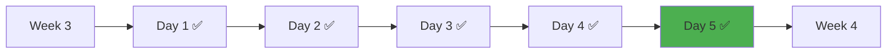

# Week 3 Day 5: 운영 & 고급 기능

<div align="center">

**📊 모니터링** • **🔄 오토스케일링** • **📦 Helm** • **🚀 GitOps**

*Kubernetes 운영의 모든 것 - 프로덕션급 시스템 구축*

</div>

---

## 🕘 일일 스케줄

### 📊 시간 배분
```
📚 이론 강의: 2.5시간 (50분×3세션)
🛠️ 실습 세션: 3.5시간 (Lab 1 + Hands-on 1)
👥 학생 케어: 2시간 (개별 맞춤 지원)
```

### 🗓️ 상세 스케줄
| 시간 | 구분 | 내용 | 목적 |
|------|------|------|------|
| **09:00-09:50** | 📚 이론 1 | 모니터링 & 로깅 (50분) | 관측성 3요소 |
| **09:50-10:00** | ☕ 휴식 | 10분 휴식 | |
| **10:00-10:50** | 📚 이론 2 | 오토스케일링 & 자동화 (50분) | HPA/VPA/CA |
| **10:50-11:00** | ☕ 휴식 | 10분 휴식 | |
| **11:00-11:50** | 📚 이론 3 | Helm & GitOps (50분) | 패키지 관리 |
| **11:50-12:00** | ☕ 휴식 | 10분 휴식 | |
| **12:00-13:00** | 🍽️ 점심 | 점심시간 (60분) | |
| **13:00-14:50** | 🛠️ Lab 1 | 운영 환경 구축 (110분) | 기본 운영 스택 |
| **14:50-15:00** | ☕ 휴식 | 10분 휴식 | |
| **15:00-16:30** | 🛠️ Hands-on 1 | 고급 운영 기능 (90분) | 심화 기능 |
| **16:30-18:00** | 👥 케어 | 개별 맞춤 지원 (90분) | 레벨별 지원 |

---

## 🎯 학습 목표

### 📚 이론 목표
- **관측성**: Prometheus + Grafana로 완전한 가시성 확보
- **자동 확장**: HPA, VPA, Cluster Autoscaler 완전 이해
- **패키지 관리**: Helm Chart 작성 및 배포
- **GitOps**: ArgoCD로 선언적 배포 자동화

### 🛠️ 실습 목표
- **모니터링 스택**: Prometheus + Grafana 구축
- **자동 스케일링**: CPU/메모리 기반 HPA 구현
- **GitOps 파이프라인**: ArgoCD 기반 자동 배포
- **고급 기능**: 커스텀 메트릭, 멀티 클러스터

---

## 📚 이론 세션 (2.5시간)

### Session 1: 모니터링 & 로깅 (50분)
**파일**: [session_1.md](./session_1.md)

**핵심 내용**:
- 관측성(Observability) 3요소
  - Metrics (지표)
  - Logs (로그)
  - Traces (추적)
- Prometheus 아키텍처
  - Pull 기반 메트릭 수집
  - PromQL 쿼리 언어
  - Time Series Database
- Kubernetes 로깅 전략
  - Node-level vs Cluster-level
  - ELK Stack (Elasticsearch, Logstash, Kibana)
  - Fluent Bit DaemonSet

**Fun Facts**:
- Google SRE의 "관측성 없이는 운영 불가"
- Netflix의 중앙화된 로깅 시스템
- Spotify의 분산 추적 시스템

### Session 2: 오토스케일링 & 자동화 (50분)
**파일**: [session_2.md](./session_2.md)

**핵심 내용**:
- 3가지 오토스케일링 비교
  - HPA (Horizontal Pod Autoscaler)
  - VPA (Vertical Pod Autoscaler)
  - Cluster Autoscaler
- HPA 스케일링 알고리즘
  - 계산 공식
  - 안정화 기간
  - 다중 메트릭 처리
- 커스텀 메트릭 & KEDA
  - Prometheus Adapter
  - 이벤트 기반 스케일링
  - Scale to Zero

**Fun Facts**:
- Airbnb의 40% 비용 절감
- Spotify의 70% 배치 작업 비용 절감
- Zalando의 VPA 리소스 최적화

### Session 3: Helm & GitOps (50분)
**파일**: [session_3.md](./session_3.md)

**핵심 내용**:
- Helm - Kubernetes 패키지 매니저
  - Chart 구조
  - 템플릿 엔진
  - 의존성 관리
- GitOps 4대 원칙
  - 선언적 (Declarative)
  - 버전 관리 (Versioned)
  - 자동 적용 (Automated)
  - 지속적 조정 (Reconciled)
- ArgoCD 아키텍처
  - Pull 기반 배포
  - 자동 동기화
  - Self-Heal

**Fun Facts**:
- Intuit의 1,000개 마이크로서비스 관리
- Red Hat의 멀티 클러스터 통합
- Ticketmaster의 95% 장애 감소

---

## 🛠️ 실습 세션 (3.5시간)

### Lab 1: 운영 환경 구축 (110분)
**파일**: [lab_1.md](./lab_1.md)

**실습 내용**:
1. **Helm 설치 및 설정** (10분)
2. **Prometheus Stack 설치** (25분)
   - Prometheus Operator
   - Grafana
   - AlertManager
3. **Grafana 대시보드 설정** (20분)
4. **테스트 애플리케이션 배포** (15분)
5. **HPA 설정** (20분)
   - Metrics Server
   - CPU/메모리 기반 스케일링
6. **ArgoCD 설치 및 설정** (20분)

**자동화 스크립트**:
```bash
cd lab_scripts/lab1
./00-install-all.sh  # 전체 자동 설치
```

**개별 스크립트**:
- [01-install-helm.sh](./lab_scripts/lab1/01-install-helm.sh)
- [02-install-prometheus.sh](./lab_scripts/lab1/02-install-prometheus.sh)
- [03-deploy-app.sh](./lab_scripts/lab1/03-deploy-app.sh)
- [04-setup-hpa.sh](./lab_scripts/lab1/04-setup-hpa.sh)
- [05-install-argocd.sh](./lab_scripts/lab1/05-install-argocd.sh)
- [99-cleanup.sh](./lab_scripts/lab1/99-cleanup.sh)

### Hands-on 1: 고급 운영 기능 (90분)
**파일**: [hands_on_1.md](./hands_on_1.md)

**실습 내용**:
1. **커스텀 메트릭 기반 HPA** (25분)
   - Prometheus Adapter 설치
   - HTTP 요청 수 기반 스케일링
2. **고급 알림 시스템** (25분)
   - 계층적 알림 라우팅
   - 커스텀 알림 규칙
3. **멀티 클러스터 GitOps** (25분)
   - 여러 클러스터 등록
   - App of Apps 패턴
4. **프로덕션급 Helm Chart** (15분)
   - 의존성 관리
   - 보안 설정

---

## 👥 학생 케어 (2시간)

### 🎯 케어 운영 방식
- **필요 기반**: 학생들의 이해도와 진도에 따라 유연하게 운영
- **개별 맞춤**: 각 학생의 수준과 필요에 맞는 개별 지원
- **상호 학습**: 학생 간 멘토링과 협업 학습 촉진

### 🟢 초급자 지원
- 모니터링 개념 재설명
- 스크립트 실행 도움
- 기본 kubectl 명령어 복습

### 🟡 중급자 지원
- 커스텀 메트릭 심화
- 알림 규칙 작성 연습
- Helm Chart 커스터마이징

### 🔴 고급자 지원
- Service Mesh 체험
- Operator 개발
- 멀티 클러스터 고급 구성

---

## 📊 학습 성과 측정

### ✅ 이론 이해도
- [ ] 관측성 3요소 설명 가능
- [ ] HPA 스케일링 알고리즘 이해
- [ ] GitOps 4대 원칙 설명 가능
- [ ] Helm Chart 구조 이해

### ✅ 실습 완성도
- [ ] Prometheus + Grafana 구축 완료
- [ ] HPA 동작 확인
- [ ] ArgoCD 설치 및 Application 생성
- [ ] 커스텀 메트릭 스케일링 구현

### ✅ 실무 적용 능력
- [ ] 모니터링 대시보드 설계 가능
- [ ] 스케일링 전략 수립 가능
- [ ] GitOps 파이프라인 구축 가능
- [ ] 운영 장애 대응 가능

---

## 🔗 연결성

### 이전 학습과의 연결
- **Day 1-2**: 클러스터 아키텍처 → 모니터링 대상 이해
- **Day 3**: 네트워킹 → Service Discovery 연계
- **Day 4**: 보안 → 모니터링 데이터 보안

### 다음 학습 준비
- **Week 4**: 클라우드 네이티브 아키텍처
- **Week 5**: CI/CD 파이프라인
- **Week 6**: 최신 DevOps 트렌드

---

## 🎯 일일 마무리

### ✅ 오늘의 성과
- [ ] 완전한 모니터링 스택 구축
- [ ] 자동 스케일링 구현 및 테스트
- [ ] GitOps 기반 배포 파이프라인
- [ ] 프로덕션급 운영 환경 경험

### 🎯 내일 준비사항
- **복습**: 오늘 배운 Prometheus, HPA, ArgoCD 개념 정리
- **예습**: Week 4 Day 1 마이크로서비스 아키텍처 개념
- **환경**: 클러스터 정리 및 다음 실습 준비

### 📊 학습 진도 체크


---

## 🔄 피드백 및 개선

### 📈 일일 회고 (15분)
1. **모니터링**: "Prometheus와 Grafana로 어떤 인사이트를 얻었나요?"
2. **자동 확장**: "HPA 동작을 보면서 느낀 점은?"
3. **GitOps**: "ArgoCD의 자동 동기화가 유용할 것 같나요?"
4. **실무 적용**: "오늘 배운 내용을 실무에 어떻게 적용할 수 있을까요?"

### 🎯 개선 포인트
- **이해도 격차**: 모니터링 개념이 어려운 학생 추가 지원
- **실습 시간**: 충분한 실습 시간 확보
- **스크립트 활용**: 자동화 스크립트로 시간 절약
- **실무 연계**: 더 많은 실제 사례 공유

---

## 📚 참고 자료

### 공식 문서
- [Prometheus Documentation](https://prometheus.io/docs/)
- [Grafana Documentation](https://grafana.com/docs/)
- [Kubernetes HPA](https://kubernetes.io/docs/tasks/run-application/horizontal-pod-autoscale/)
- [Helm Documentation](https://helm.sh/docs/)
- [ArgoCD Documentation](https://argo-cd.readthedocs.io/)

### 추가 학습 자료
- [Google SRE Book](https://sre.google/books/)
- [CNCF Landscape](https://landscape.cncf.io/)
- [Kubernetes Patterns](https://www.redhat.com/en/resources/oreilly-kubernetes-patterns-ebook)

### 실습 환경
- [Kind](https://kind.sigs.k8s.io/)
- [Minikube](https://minikube.sigs.k8s.io/)
- [K3s](https://k3s.io/)

---

<div align="center">

**📊 완전한 가시성** • **🔄 자동 확장** • **📦 패키지 관리** • **🚀 GitOps 배포**

*Kubernetes 운영의 모든 것을 마스터했습니다!*

</div>
