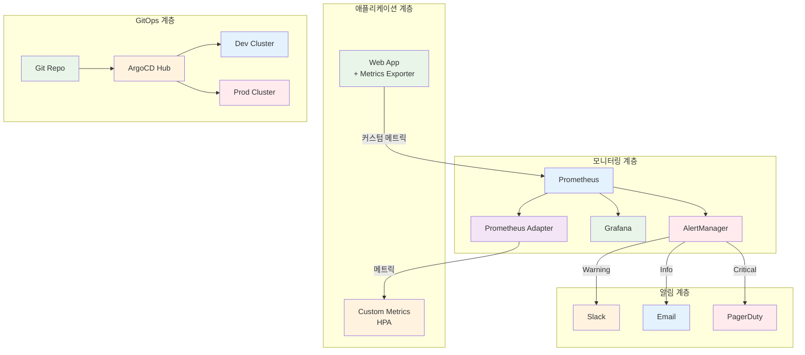

# Week 3 Day 5 Hands-on 1: 고급 운영 기능

<div align="center">

**🎯 커스텀 메트릭** • **🔔 고급 알림** • **🌐 멀티 클러스터** • **📦 Helm 고급**

*Lab 1을 기반으로 프로덕션급 고급 기능 구현*

</div>

---

## ⚠️ 사전 요구사항

### 빠른 시작 (자동 환경 설정)
```bash
cd lab_scripts/handson1
./00-setup-environment.sh
```

**자동 설치 항목**:
- ✅ Kubernetes 클러스터 (challenge-cluster, 없으면 자동 생성)
- ✅ day5-handson Namespace
- ✅ Helm
- ✅ Prometheus Operator (ServiceMonitor CRD 포함)
- ✅ Metrics Server

### 수동 환경 확인
```bash
# 클러스터 확인
kubectl cluster-info

# Prometheus Operator CRD 확인
kubectl get crd servicemonitors.monitoring.coreos.com

# Namespace 확인
kubectl get namespace day5-handson monitoring
```

---

## 🕘 실습 정보
**시간**: 14:00-15:30 (90분)  
**목표**: Lab 1 확장 + 실무 고급 기능 구현  
**방식**: Lab 1 기반 + 고급 기능 추가

## 🎯 실습 목표

### 📚 학습 목표
- **커스텀 메트릭**: Prometheus Adapter로 애플리케이션 메트릭 기반 스케일링
- **고급 알림**: 복잡한 알림 규칙과 라우팅
- **멀티 클러스터**: ArgoCD로 여러 클러스터 관리
- **Helm 고급**: Chart 개발 및 배포 자동화

### 🛠️ 구현 목표
- HTTP 요청 수 기반 HPA
- 계층적 알림 시스템 (Slack, Email, PagerDuty)
- 멀티 클러스터 GitOps 구성
- 프로덕션급 Helm Chart 작성

---

## 🏗️ 고급 아키텍처



---

## 🛠️ Step 0: 환경 설정 (10분)

### Step 0-1: 클러스터 생성

**클러스터 확인 및 생성**:
```bash
# 클러스터 확인
kubectl cluster-info

# 없으면 kind 클러스터 생성
kind create cluster --name challenge-cluster --config - <<EOF
kind: Cluster
apiVersion: kind.x-k8s.io/v1alpha4
nodes:
- role: control-plane
- role: worker
- role: worker
EOF
```

### Step 0-2: Namespace 생성

```bash
# day5-handson namespace 생성
kubectl create namespace day5-handson

# monitoring namespace 생성
kubectl create namespace monitoring

# 기본 namespace 설정
kubectl config set-context --current --namespace=day5-handson
```

### Step 0-3: 필수 컴포넌트 설치

**Helm 설치**:
```bash
# Helm 설치
curl https://raw.githubusercontent.com/helm/helm/main/scripts/get-helm-3 | bash

# Repository 추가
helm repo add prometheus-community https://prometheus-community.github.io/helm-charts
helm repo update
```

**Prometheus Operator 설치**:
```bash
# Prometheus Operator 설치 (ServiceMonitor CRD 포함)
helm install prometheus prometheus-community/kube-prometheus-stack \
  --namespace monitoring \
  --set prometheus.prometheusSpec.serviceMonitorSelectorNilUsesHelmValues=false \
  --set grafana.enabled=false \
  --wait
```

**Metrics Server 설치**:
```bash
# Metrics Server 설치
kubectl apply -f https://github.com/kubernetes-sigs/metrics-server/releases/latest/download/components.yaml

# 준비 대기 (30초)
sleep 30
```

**ArgoCD 설치**:
```bash
# argocd namespace 생성
kubectl create namespace argocd

# ArgoCD 설치
kubectl apply -n argocd -f https://raw.githubusercontent.com/argoproj/argo-cd/stable/manifests/install.yaml

# ArgoCD CLI 설치
curl -sSL -o argocd-linux-amd64 https://github.com/argoproj/argo-cd/releases/latest/download/argocd-linux-amd64
sudo install -m 555 argocd-linux-amd64 /usr/local/bin/argocd
rm argocd-linux-amd64

# ArgoCD 준비 대기
kubectl wait --for=condition=Ready pods --all -n argocd --timeout=300s
```

### Step 0-4: 환경 확인

```bash
# 클러스터 정보
kubectl cluster-info

# CRD 확인
kubectl get crd servicemonitors.monitoring.coreos.com

# Namespace 확인
kubectl get namespace day5-handson monitoring argocd

# ArgoCD CLI 확인
argocd version --client

# 현재 namespace 확인
kubectl config view --minify | grep namespace:
```

---

## 🛠️ Step 1: 커스텀 메트릭 기반 HPA (25분)

### Step 1-1: 메트릭을 노출하는 애플리케이션 배포

```yaml
# metrics-app-deployment.yaml
apiVersion: apps/v1
kind: Deployment
metadata:
  name: metrics-app
  namespace: day5-handson
spec:
  replicas: 2
  selector:
    matchLabels:
      app: metrics-app
  template:
    metadata:
      labels:
        app: metrics-app
      annotations:
        prometheus.io/scrape: "true"
        prometheus.io/port: "8080"
        prometheus.io/path: "/metrics"
    spec:
      containers:
      - name: app
        image: quay.io/brancz/prometheus-example-app:v0.3.0
        ports:
        - containerPort: 8080
          name: metrics
        resources:
          requests:
            cpu: 100m
            memory: 128Mi
          limits:
            cpu: 500m
            memory: 512Mi
---
apiVersion: v1
kind: Service
metadata:
  name: metrics-app
  namespace: day5-handson
  labels:
    app: metrics-app
spec:
  selector:
    app: metrics-app
  ports:
  - port: 8080
    targetPort: 8080
    name: metrics
---
apiVersion: monitoring.coreos.com/v1
kind: ServiceMonitor
metadata:
  name: metrics-app
  namespace: day5-handson
spec:
  selector:
    matchLabels:
      app: metrics-app
  endpoints:
  - port: metrics
    interval: 15s
```

```bash
# 배포
kubectl apply -f metrics-app-deployment.yaml -n day5-handson

# 메트릭 확인
kubectl port-forward -n day5-handson svc/metrics-app 8080:8080
curl http://localhost:8080/metrics
```

### Step 1-2: Prometheus Adapter 설치

```bash
# Prometheus Adapter 설치
helm install prometheus-adapter prometheus-community/prometheus-adapter \
  --namespace monitoring \
  --set prometheus.url=http://prometheus-kube-prometheus-prometheus.monitoring.svc \
  --set prometheus.port=9090

# 설치 확인
kubectl get pods -n monitoring | grep adapter

# Custom Metrics API 확인
kubectl get apiservice v1beta1.custom.metrics.k8s.io
```

### Step 1-3: 커스텀 메트릭 설정

```yaml
# prometheus-adapter-config.yaml
apiVersion: v1
kind: ConfigMap
metadata:
  name: prometheus-adapter
  namespace: monitoring
data:
  config.yaml: |
    rules:
    # HTTP 요청 수 메트릭
    - seriesQuery: 'http_requests_total{namespace!="",pod!=""}'
      resources:
        overrides:
          namespace: {resource: "namespace"}
          pod: {resource: "pod"}
      name:
        matches: "^(.*)_total$"
        as: "${1}_per_second"
      metricsQuery: 'sum(rate(<<.Series>>{<<.LabelMatchers>>}[2m])) by (<<.GroupBy>>)'
    
    # 애플리케이션 큐 길이
    - seriesQuery: 'queue_length{namespace!="",pod!=""}'
      resources:
        overrides:
          namespace: {resource: "namespace"}
          pod: {resource: "pod"}
      name:
        as: "queue_length"
      metricsQuery: 'avg(<<.Series>>{<<.LabelMatchers>>}) by (<<.GroupBy>>)'
```

```bash
# ConfigMap 업데이트
kubectl apply -f prometheus-adapter-config.yaml

# Adapter 재시작
kubectl rollout restart deployment prometheus-adapter -n monitoring

# 커스텀 메트릭 확인
kubectl get --raw "/apis/custom.metrics.k8s.io/v1beta1" | jq .
```

### Step 1-4: 커스텀 메트릭 기반 HPA 생성

```yaml
# custom-metrics-hpa.yaml
apiVersion: autoscaling/v2
kind: HorizontalPodAutoscaler
metadata:
  name: metrics-app-hpa
  namespace: day5-handson
spec:
  scaleTargetRef:
    apiVersion: apps/v1
    kind: Deployment
    name: metrics-app
  minReplicas: 2
  maxReplicas: 10
  metrics:
  # 커스텀 메트릭: HTTP 요청 수
  - type: Pods
    pods:
      metric:
        name: http_requests_per_second
      target:
        type: AverageValue
        averageValue: "100"
  behavior:
    scaleDown:
      stabilizationWindowSeconds: 300
      policies:
      - type: Percent
        value: 50
        periodSeconds: 60
    scaleUp:
      stabilizationWindowSeconds: 0
      policies:
      - type: Percent
        value: 100
        periodSeconds: 15
```

```bash
# HPA 생성
kubectl apply -f custom-metrics-hpa.yaml -n day5-handson

# HPA 상태 확인
kubectl get hpa -n day5-handson metrics-app-hpa
kubectl describe hpa -n day5-handson metrics-app-hpa
```

### Step 1-5: 부하 테스트

```bash
# 부하 생성
kubectl run -n day5-handson load-generator --image=busybox --restart=Never -- /bin/sh -c \
  "while true; do wget -q -O- http://metrics-app:8080; done"

# HPA 동작 관찰
watch kubectl get hpa -n day5-handson metrics-app-hpa

# 커스텀 메트릭 확인
kubectl get --raw "/apis/custom.metrics.k8s.io/v1beta1/namespaces/day5-handson/pods/*/http_requests_per_second" | jq .

# 부하 중지
kubectl delete pod -n day5-handson load-generator
```

---

## 🛠️ Step 2: 고급 알림 시스템 (25분)

### Step 2-1: AlertManager 설정

```yaml
# alertmanager-config.yaml
apiVersion: v1
kind: Secret
metadata:
  name: alertmanager-config
  namespace: monitoring
stringData:
  alertmanager.yaml: |
    global:
      resolve_timeout: 5m
      slack_api_url: 'YOUR_SLACK_WEBHOOK_URL'
    
    # 알림 라우팅
    route:
      group_by: ['alertname', 'cluster', 'service']
      group_wait: 10s
      group_interval: 10s
      repeat_interval: 12h
      receiver: 'default'
      routes:
      # Critical 알림 → PagerDuty
      - match:
          severity: critical
        receiver: 'pagerduty'
        continue: true
      # Warning 알림 → Slack
      - match:
          severity: warning
        receiver: 'slack'
      # Info 알림 → Email
      - match:
          severity: info
        receiver: 'email'
    
    # 알림 수신자
    receivers:
    - name: 'default'
      slack_configs:
      - channel: '#alerts'
        title: '{{ .GroupLabels.alertname }}'
        text: '{{ range .Alerts }}{{ .Annotations.description }}{{ end }}'
    
    - name: 'slack'
      slack_configs:
      - channel: '#warnings'
        title: '⚠️ {{ .GroupLabels.alertname }}'
        text: |
          *Severity:* {{ .CommonLabels.severity }}
          *Summary:* {{ .CommonAnnotations.summary }}
          *Description:* {{ .CommonAnnotations.description }}
    
    - name: 'pagerduty'
      pagerduty_configs:
      - service_key: 'YOUR_PAGERDUTY_KEY'
        description: '{{ .CommonAnnotations.summary }}'
    
    - name: 'email'
      email_configs:
      - to: 'devops@example.com'
        from: 'alertmanager@example.com'
        smarthost: 'smtp.gmail.com:587'
        auth_username: 'alertmanager@example.com'
        auth_password: 'YOUR_EMAIL_PASSWORD'
        headers:
          Subject: '[{{ .Status }}] {{ .GroupLabels.alertname }}'
    
    # 알림 억제 규칙
    inhibit_rules:
    - source_match:
        severity: 'critical'
      target_match:
        severity: 'warning'
      equal: ['alertname', 'cluster', 'service']
```

```bash
# AlertManager 설정 업데이트
kubectl apply -f alertmanager-config.yaml

# AlertManager 재시작
kubectl rollout restart statefulset alertmanager-prometheus-kube-prometheus-alertmanager -n monitoring
```

### Step 2-2: 커스텀 알림 규칙 생성

```yaml
# custom-alerts.yaml
apiVersion: monitoring.coreos.com/v1
kind: PrometheusRule
metadata:
  name: custom-alerts
  namespace: monitoring
  labels:
    prometheus: kube-prometheus
spec:
  groups:
  - name: application.rules
    interval: 30s
    rules:
    # High HTTP Request Rate
    - alert: HighHTTPRequestRate
      expr: sum(rate(http_requests_total[5m])) by (pod) > 1000
      for: 2m
      labels:
        severity: warning
      annotations:
        summary: "High HTTP request rate on {{ $labels.pod }}"
        description: "Pod {{ $labels.pod }} is receiving {{ $value }} requests/sec"
    
    # Pod Memory Usage High
    - alert: PodMemoryUsageHigh
      expr: |
        (container_memory_usage_bytes{namespace="day5-handson"} / 
         container_spec_memory_limit_bytes{namespace="day5-handson"}) > 0.9
      for: 5m
      labels:
        severity: critical
      annotations:
        summary: "Pod memory usage is above 90%"
        description: "Pod {{ $labels.pod }} memory usage is {{ $value | humanizePercentage }}"
    
    # Pod CPU Throttling
    - alert: PodCPUThrottling
      expr: |
        rate(container_cpu_cfs_throttled_seconds_total{namespace="day5-handson"}[5m]) > 0.5
      for: 5m
      labels:
        severity: warning
      annotations:
        summary: "Pod is being CPU throttled"
        description: "Pod {{ $labels.pod }} is being throttled {{ $value | humanizePercentage }} of the time"
    
    # HPA at Max Capacity
    - alert: HPAMaxedOut
      expr: |
        kube_horizontalpodautoscaler_status_current_replicas{namespace="day5-handson"} ==
        kube_horizontalpodautoscaler_spec_max_replicas{namespace="day5-handson"}
      for: 15m
      labels:
        severity: warning
      annotations:
        summary: "HPA {{ $labels.horizontalpodautoscaler }} is at maximum capacity"
        description: "HPA has been at max replicas for 15 minutes"
```

```bash
# 알림 규칙 생성
kubectl apply -f custom-alerts.yaml

# 알림 규칙 확인
kubectl get prometheusrule -n monitoring

# Prometheus에서 규칙 확인
# http://localhost:9090/alerts
```

### Step 2-3: 알림 테스트

```bash
# 의도적으로 높은 부하 생성
for i in {1..10}; do
  kubectl run load-$i --image=busybox --restart=Never -- /bin/sh -c \
    "while true; do wget -q -O- http://metrics-app:8080; done"
done

# AlertManager UI 확인
kubectl port-forward -n monitoring svc/alertmanager-operated 9093:9093
# http://localhost:9093

# 알림 발생 확인
# Slack, Email, PagerDuty 확인

# 부하 중지
for i in {1..10}; do kubectl delete pod load-$i; done
```

---

## 🛠️ Step 3: 멀티 클러스터 GitOps (25분)

### Step 3-0: ArgoCD 로그인

**ArgoCD 서버 접속**:
```bash
# ArgoCD 서버 포트포워딩 (백그라운드)
kubectl port-forward svc/argocd-server -n argocd 8080:443 > /dev/null 2>&1 &

# 초기 admin 비밀번호 확인
ARGOCD_PASSWORD=$(kubectl -n argocd get secret argocd-initial-admin-secret -o jsonpath="{.data.password}" | base64 -d)
echo "ArgoCD Password: $ARGOCD_PASSWORD"

# ArgoCD 로그인
argocd login localhost:8080 --username admin --password $ARGOCD_PASSWORD --insecure

# 로그인 확인
argocd account get-user-info
```

### Step 3-1: 클러스터 등록

```bash
# 현재 클러스터를 ArgoCD에 등록
argocd cluster add $(kubectl config current-context)

# 등록된 클러스터 확인
argocd cluster list

# 추가 클러스터 등록 (다른 kubeconfig 사용)
argocd cluster add dev-cluster --kubeconfig ~/.kube/dev-config
argocd cluster add prod-cluster --kubeconfig ~/.kube/prod-config
```

### Step 3-2: 환경별 Application 생성

```yaml
# apps/dev-app.yaml
apiVersion: argoproj.io/v1alpha1
kind: Application
metadata:
  name: web-app-dev
  namespace: argocd
spec:
  project: day5-handson
  source:
    repoURL: https://github.com/your-org/your-repo
    targetRevision: develop
    path: helm/web-app
    helm:
      valueFiles:
        - values-dev.yaml
      parameters:
        - name: replicaCount
          value: "2"
        - name: image.tag
          value: "dev-latest"
  destination:
    server: https://dev-cluster-api-server
    namespace: development
  syncPolicy:
    automated:
      prune: true
      selfHeal: true
    syncOptions:
      - CreateNamespace=true
---
# apps/prod-app.yaml
apiVersion: argoproj.io/v1alpha1
kind: Application
metadata:
  name: web-app-prod
  namespace: argocd
spec:
  project: day5-handson
  source:
    repoURL: https://github.com/your-org/your-repo
    targetRevision: main
    path: helm/web-app
    helm:
      valueFiles:
        - values-prod.yaml
      parameters:
        - name: replicaCount
          value: "5"
        - name: image.tag
          value: "v1.2.0"
  destination:
    server: https://prod-cluster-api-server
    namespace: production
  syncPolicy:
    automated:
      prune: false  # 프로덕션은 수동 삭제
      selfHeal: true
    syncOptions:
      - CreateNamespace=true
```

```bash
# Application 생성
kubectl apply -f apps/dev-app.yaml
kubectl apply -f apps/prod-app.yaml

# Application 상태 확인
argocd app list
argocd app get web-app-dev
argocd app get web-app-prod
```

### Step 3-3: App of Apps 패턴

```yaml
# root-app.yaml
apiVersion: argoproj.io/v1alpha1
kind: Application
metadata:
  name: root-app
  namespace: argocd
spec:
  project: day5-handson
  source:
    repoURL: https://github.com/your-org/gitops-repo
    targetRevision: HEAD
    path: apps
  destination:
    server: https://kubernetes.day5-handson.svc
    namespace: argocd
  syncPolicy:
    automated:
      prune: true
      selfHeal: true
```

**Git Repository 구조**:
```
gitops-repo/
├── apps/
│   ├── infrastructure/
│   │   ├── monitoring.yaml      # Prometheus, Grafana
│   │   ├── logging.yaml         # ELK Stack
│   │   └── ingress.yaml         # Nginx Ingress
│   ├── dev/
│   │   ├── app1.yaml
│   │   └── app2.yaml
│   └── prod/
│       ├── app1.yaml
│       └── app2.yaml
└── helm/
    └── web-app/
        ├── Chart.yaml
        ├── values.yaml
        ├── values-dev.yaml
        └── values-prod.yaml
```

```bash
# Root App 생성
kubectl apply -f root-app.yaml

# 모든 Application 자동 생성 확인
argocd app list
```

---

## 🛠️ Step 4: 프로덕션급 Helm Chart (15분)

### Step 4-1: Helm Chart 생성

```bash
# Chart 생성
helm create production-app

cd production-app/
```

### Step 4-2: Chart.yaml 작성

```yaml
# Chart.yaml
apiVersion: v2
name: production-app
description: Production-ready Kubernetes application
type: application
version: 1.0.0
appVersion: "2.1.0"

keywords:
  - web
  - production
  - kubernetes

maintainers:
  - name: DevOps Team
    email: devops@example.com

dependencies:
  - name: postgresql
    version: 12.1.0
    repository: https://charts.bitnami.com/bitnami
    condition: postgresql.enabled
  - name: redis
    version: 17.3.0
    repository: https://charts.bitnami.com/bitnami
    condition: redis.enabled
```

### Step 4-3: values.yaml 작성

```yaml
# values.yaml
replicaCount: 3

image:
  repository: nginx
  pullPolicy: IfNotPresent
  tag: "1.21"

service:
  type: ClusterIP
  port: 80

ingress:
  enabled: true
  className: nginx
  annotations:
    cert-manager.io/cluster-issuer: letsencrypt-prod
  hosts:
    - host: app.example.com
      paths:
        - path: /
          pathType: Prefix
  tls:
    - secretName: app-tls
      hosts:
        - app.example.com

resources:
  limits:
    cpu: 500m
    memory: 512Mi
  requests:
    cpu: 250m
    memory: 256Mi

autoscaling:
  enabled: true
  minReplicas: 3
  maxReplicas: 10
  targetCPUUtilizationPercentage: 70
  targetMemoryUtilizationPercentage: 80

# 의존성 설정
postgresql:
  enabled: true
  auth:
    username: appuser
    password: changeme
    database: appdb

redis:
  enabled: true
  auth:
    enabled: true
    password: changeme

# 모니터링
monitoring:
  enabled: true
  serviceMonitor:
    enabled: true
    interval: 30s

# 보안
podSecurityContext:
  runAsNonRoot: true
  runAsUser: 1000
  fsGroup: 1000

securityContext:
  allowPrivilegeEscalation: false
  capabilities:
    drop:
    - ALL
  readOnlyRootFilesystem: true
```

### Step 4-4: Chart 검증 및 배포

```bash
# Chart 검증
helm lint production-app/

# 템플릿 렌더링 확인
helm template production-app production-app/

# Dry-run 테스트
helm install production-app production-app/ --dry-run --debug

# Chart 설치
helm install production-app production-app/ \
  --namespace production \
  --create-namespace

# 설치 확인
helm list -n production
kubectl get all -n production
```

---

## ✅ 실습 체크포인트

### ✅ 커스텀 메트릭 HPA
- [ ] Prometheus Adapter 정상 동작
- [ ] 커스텀 메트릭 수집 확인
- [ ] HTTP 요청 수 기반 HPA 동작
- [ ] 부하 테스트 시 자동 확장 확인

### ✅ 고급 알림 시스템
- [ ] AlertManager 설정 완료
- [ ] 커스텀 알림 규칙 생성
- [ ] 계층적 알림 라우팅 동작
- [ ] 알림 테스트 성공

### ✅ 멀티 클러스터 GitOps
- [ ] 여러 클러스터 등록 완료
- [ ] 환경별 Application 생성
- [ ] App of Apps 패턴 구현
- [ ] 자동 동기화 확인

### ✅ 프로덕션급 Helm Chart
- [ ] Chart 구조 완성
- [ ] 의존성 관리 설정
- [ ] 보안 설정 적용
- [ ] Chart 배포 성공

---

## 🚀 추가 도전 과제

### 도전 1: KEDA 이벤트 기반 스케일링

```yaml
# keda-scaledobject.yaml
apiVersion: keda.sh/v1alpha1
kind: ScaledObject
metadata:
  name: rabbitmq-consumer
spec:
  scaleTargetRef:
    name: consumer-app
  minReplicaCount: 0
  maxReplicaCount: 30
  triggers:
  - type: rabbitmq
    metadata:
      queueName: orders
      queueLength: "20"
```

### 도전 2: Canary 배포

```yaml
# canary-rollout.yaml
apiVersion: argoproj.io/v1alpha1
kind: Rollout
spec:
  strategy:
    canary:
      steps:
      - setWeight: 20
      - pause: {duration: 5m}
      - setWeight: 50
      - pause: {duration: 5m}
      - setWeight: 100
```

### 도전 3: 멀티 테넌시 ArgoCD

```yaml
# project.yaml
apiVersion: argoproj.io/v1alpha1
kind: AppProject
metadata:
  name: team-a
spec:
  destinations:
  - namespace: team-a-*
    server: '*'
  sourceRepos:
  - 'https://github.com/team-a/*'
```

---

## 🧹 실습 정리

```bash
# HPA 삭제
kubectl delete hpa -n day5-handson metrics-app-hpa

# 애플리케이션 삭제
kubectl delete -f metrics-app-deployment.yaml -n day5-handson

# Prometheus Adapter 삭제
helm uninstall prometheus-adapter -n monitoring

# Helm Chart 삭제 (있다면)
helm uninstall production-app -n production 2>/dev/null || true

# Namespace 삭제
kubectl delete namespace day5-handson
kubectl delete namespace production 2>/dev/null || true

# 또는 클러스터 전체 삭제
kind delete cluster --name challenge-cluster
```

---

## 💡 실습 회고

### 🤝 팀 회고 (10분)
1. **커스텀 메트릭**: "애플리케이션 메트릭 기반 스케일링의 장점은?"
2. **고급 알림**: "계층적 알림 시스템이 실무에서 유용할까?"
3. **멀티 클러스터**: "여러 환경을 하나의 ArgoCD로 관리하는 것의 장단점은?"
4. **Helm 고급**: "프로덕션급 Chart 작성 시 주의할 점은?"

### 📊 학습 성과
- ✅ 커스텀 메트릭으로 더 정교한 스케일링
- ✅ 복잡한 알림 라우팅과 억제 규칙
- ✅ 멀티 클러스터 통합 관리
- ✅ 프로덕션급 Helm Chart 작성 능력

### 🎯 실무 적용 방안
- 비즈니스 메트릭 기반 스케일링 전략
- 팀별 알림 채널 분리 및 에스컬레이션
- 환경별 클러스터 분리 및 통합 관리
- 표준화된 Helm Chart 템플릿 구축

---

<div align="center">

**🎯 고급 스케일링** • **🔔 지능형 알림** • **🌐 멀티 클러스터** • **📦 프로덕션급 Chart**

*실무 운영의 모든 것을 경험했습니다!*

</div>
