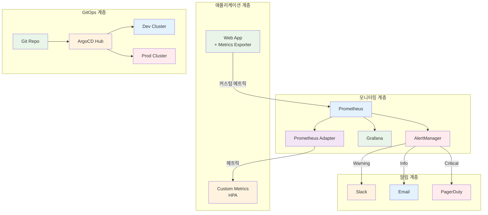
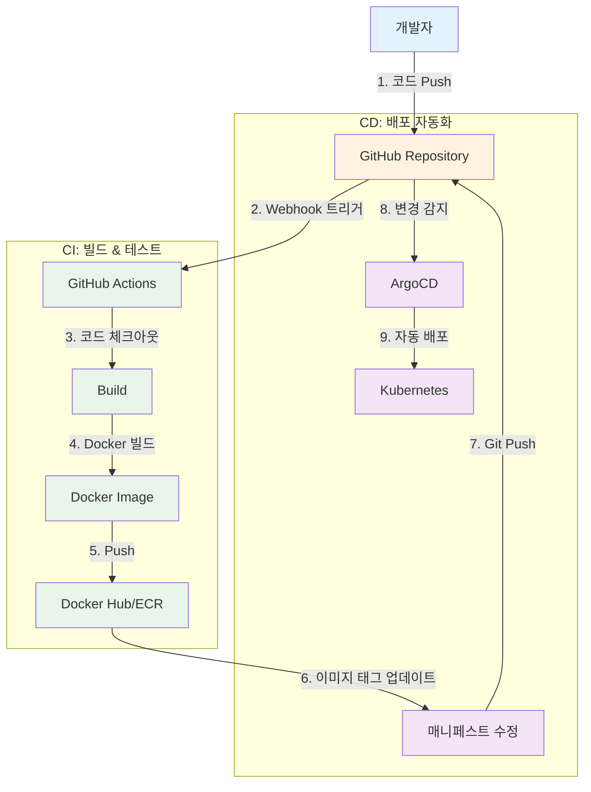
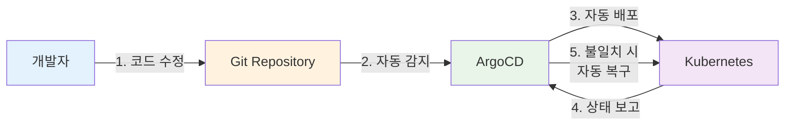

# Week 3 Day 5 Hands-on 1: 고급 운영 기능

<div align="center">

**🎯 커스텀 메트릭** • **🔔 고급 알림** • **🌐 멀티 클러스터** • **📦 Helm 고급**

*Lab 1을 기반으로 프로덕션급 고급 기능 구현*

</div>

---

## ⚠️ 사전 요구사항

### 빠른 시작 (자동 환경 설정)
```bash
cd lab_scripts/handson1
./00-setup-environment.sh
```

**📋 스크립트 내용**: [00-setup-environment.sh](./lab_scripts/handson1/00-setup-environment.sh)

**자동 설치 항목**:
- ✅ Kubernetes 클러스터 (challenge-cluster, 없으면 자동 생성)
- ✅ day5-handson, monitoring Namespace
- ✅ Helm 저장소 (prometheus-community, bitnami)
- ✅ Prometheus Operator (ServiceMonitor CRD 포함)
- ✅ Metrics Server

### 수동 환경 확인
```bash
# 클러스터 확인
kubectl cluster-info

# Prometheus Operator CRD 확인
kubectl get crd servicemonitors.monitoring.coreos.com

# Namespace 확인
kubectl get namespace day5-handson monitoring
```

---

## 🕘 실습 정보
**시간**: 14:00-15:30 (90분)  
**목표**: Lab 1 확장 + 실무 고급 기능 구현  
**방식**: Lab 1 기반 + 고급 기능 추가

## 🎯 실습 목표

### 📚 학습 목표
- **커스텀 메트릭**: Prometheus Adapter로 애플리케이션 메트릭 기반 스케일링
- **고급 알림**: 복잡한 알림 규칙과 라우팅
- **멀티 클러스터**: ArgoCD로 여러 클러스터 관리
- **Helm 고급**: Chart 개발 및 배포 자동화

### 🛠️ 구현 목표
- HTTP 요청 수 기반 HPA
- 계층적 알림 시스템 (Slack, Email, PagerDuty)
- 멀티 클러스터 GitOps 구성
- 프로덕션급 Helm Chart 작성

---

## 🏗️ 고급 아키텍처



---

## 🛠️ Step 0: 환경 설정 (10분)

### Step 0-1: 클러스터 생성

**클러스터 확인 및 생성**:
```bash
# 클러스터 확인
kubectl cluster-info

# 없으면 kind 클러스터 생성
kind create cluster --name challenge-cluster --config - <<EOF
kind: Cluster
apiVersion: kind.x-k8s.io/v1alpha4
nodes:
- role: control-plane
- role: worker
- role: worker
EOF
```

### Step 0-2: Namespace 생성

```bash
# day5-handson namespace 생성
kubectl create namespace day5-handson

# monitoring namespace 생성
kubectl create namespace monitoring

# 기본 namespace 설정
kubectl config set-context --current --namespace=day5-handson
```

### Step 0-3: 필수 컴포넌트 설치

**Helm 설치**:
```bash
# Helm 설치
curl https://raw.githubusercontent.com/helm/helm/main/scripts/get-helm-3 | bash

# Repository 추가
helm repo add prometheus-community https://prometheus-community.github.io/helm-charts
helm repo update
```

**Prometheus Operator 설치**:
```bash
# Prometheus Operator 설치 (ServiceMonitor CRD 포함)
helm install prometheus prometheus-community/kube-prometheus-stack \
  --namespace monitoring \
  --set prometheus.prometheusSpec.serviceMonitorSelectorNilUsesHelmValues=false \
  --set grafana.enabled=false \
  --wait
```

**Metrics Server 설치**:
```bash
# Metrics Server 설치
kubectl apply -f https://github.com/kubernetes-sigs/metrics-server/releases/latest/download/components.yaml
kubectl edit deployment/metrics-server -n kube-system
# args에 --kubelet-insecure-tls 추가

# 준비 대기 (30초)
sleep 30
```

**ArgoCD 설치**:
```bash
# argocd namespace 생성
kubectl create namespace argocd

# ArgoCD 설치
kubectl apply -n argocd -f https://raw.githubusercontent.com/argoproj/argo-cd/stable/manifests/install.yaml

# ArgoCD CLI 설치
curl -sSL -o argocd-linux-amd64 https://github.com/argoproj/argo-cd/releases/latest/download/argocd-linux-amd64
sudo install -m 555 argocd-linux-amd64 /usr/local/bin/argocd
rm argocd-linux-amd64

# ArgoCD 준비 대기
kubectl wait --for=condition=Ready pods --all -n argocd --timeout=300s
```

### Step 0-4: 환경 확인

```bash
# 클러스터 정보
kubectl cluster-info

# CRD 확인
kubectl get crd servicemonitors.monitoring.coreos.com

# Namespace 확인
kubectl get namespace day5-handson monitoring argocd

# ArgoCD CLI 확인
argocd version --client

# 현재 namespace 확인
kubectl config view --minify | grep namespace:
```

---

## 🛠️ Step 1: 커스텀 메트릭 기반 HPA (25분)

### Step 1-1: 메트릭을 노출하는 애플리케이션 배포

```yaml
# metrics-app-deployment.yaml
apiVersion: apps/v1
kind: Deployment
metadata:
  name: metrics-app
  namespace: day5-handson
spec:
  replicas: 2
  selector:
    matchLabels:
      app: metrics-app
  template:
    metadata:
      labels:
        app: metrics-app
      annotations:
        prometheus.io/scrape: "true"
        prometheus.io/port: "8080"
        prometheus.io/path: "/metrics"
    spec:
      containers:
      - name: app
        image: quay.io/brancz/prometheus-example-app:v0.3.0
        ports:
        - containerPort: 8080
          name: metrics
        resources:
          requests:
            cpu: 100m
            memory: 128Mi
          limits:
            cpu: 500m
            memory: 512Mi
---
apiVersion: v1
kind: Service
metadata:
  name: metrics-app
  namespace: day5-handson
  labels:
    app: metrics-app
spec:
  selector:
    app: metrics-app
  ports:
  - port: 8080
    targetPort: 8080
    name: metrics
---
apiVersion: monitoring.coreos.com/v1
kind: ServiceMonitor
metadata:
  name: metrics-app
  namespace: day5-handson
spec:
  selector:
    matchLabels:
      app: metrics-app
  endpoints:
  - port: metrics
    interval: 15s
```

```bash
# 배포
kubectl apply -f metrics-app-deployment.yaml -n day5-handson

# 메트릭 확인
kubectl port-forward -n day5-handson svc/metrics-app 8080:8080
curl http://localhost:8080/metrics
```

### Step 1-2: Prometheus Adapter 설치

```bash
# Prometheus Adapter 설치
helm install prometheus-adapter prometheus-community/prometheus-adapter \
  --namespace monitoring \
  --set prometheus.url=http://prometheus-kube-prometheus-prometheus.monitoring.svc \
  --set prometheus.port=9090

# 설치 확인
kubectl get pods -n monitoring | grep adapter

# Custom Metrics API 확인
kubectl get apiservice v1beta1.custom.metrics.k8s.io
```

### Step 1-3: 커스텀 메트릭 설정

```yaml
# prometheus-adapter-config.yaml
apiVersion: v1
kind: ConfigMap
metadata:
  name: prometheus-adapter
  namespace: monitoring
data:
  config.yaml: |
    rules:
    # HTTP 요청 수 메트릭
    - seriesQuery: 'http_requests_total{namespace!="",pod!=""}'
      resources:
        overrides:
          namespace: {resource: "namespace"}
          pod: {resource: "pod"}
      name:
        matches: "^(.*)_total$"
        as: "${1}_per_second"
      metricsQuery: 'sum(rate(<<.Series>>{<<.LabelMatchers>>}[2m])) by (<<.GroupBy>>)'
    
    # 애플리케이션 큐 길이
    - seriesQuery: 'queue_length{namespace!="",pod!=""}'
      resources:
        overrides:
          namespace: {resource: "namespace"}
          pod: {resource: "pod"}
      name:
        as: "queue_length"
      metricsQuery: 'avg(<<.Series>>{<<.LabelMatchers>>}) by (<<.GroupBy>>)'
```

```bash
# ConfigMap 업데이트
kubectl apply -f prometheus-adapter-config.yaml

# Adapter 재시작
kubectl rollout restart deployment prometheus-adapter -n monitoring

# 커스텀 메트릭 확인
kubectl get --raw "/apis/custom.metrics.k8s.io/v1beta1" | jq .
```

### Step 1-4: 커스텀 메트릭 기반 HPA 생성

```yaml
# custom-metrics-hpa.yaml
apiVersion: autoscaling/v2
kind: HorizontalPodAutoscaler
metadata:
  name: metrics-app-hpa
  namespace: day5-handson
spec:
  scaleTargetRef:
    apiVersion: apps/v1
    kind: Deployment
    name: metrics-app
  minReplicas: 2
  maxReplicas: 10
  metrics:
  # 커스텀 메트릭: HTTP 요청 수
  - type: Pods
    pods:
      metric:
        name: http_requests_per_second
      target:
        type: AverageValue
        averageValue: "100"
  behavior:
    scaleDown:
      stabilizationWindowSeconds: 300
      policies:
      - type: Percent
        value: 50
        periodSeconds: 60
    scaleUp:
      stabilizationWindowSeconds: 0
      policies:
      - type: Percent
        value: 100
        periodSeconds: 15
```

```bash
# HPA 생성
kubectl apply -f custom-metrics-hpa.yaml -n day5-handson

# HPA 상태 확인
kubectl get hpa -n day5-handson metrics-app-hpa
kubectl describe hpa -n day5-handson metrics-app-hpa
```

### Step 1-5: 부하 테스트

```bash
# 부하 생성
kubectl run -n day5-handson load-generator --image=busybox --restart=Never -- /bin/sh -c \
  "while true; do wget -q -O- http://metrics-app:8080; done"

# HPA 동작 관찰
watch kubectl get hpa -n day5-handson metrics-app-hpa

# 커스텀 메트릭 확인
kubectl get --raw "/apis/custom.metrics.k8s.io/v1beta1/namespaces/day5-handson/pods/*/http_requests_per_second" | jq .

# 부하 중지
kubectl delete pod -n day5-handson load-generator
```

---

## 🛠️ Step 2: 고급 알림 시스템 (25분)

### Step 2-1: AlertManager 설정

```yaml
# alertmanager-config.yaml
apiVersion: v1
kind: Secret
metadata:
  name: alertmanager-config
  namespace: monitoring
stringData:
  alertmanager.yaml: |
    global:
      resolve_timeout: 5m
      slack_api_url: 'YOUR_SLACK_WEBHOOK_URL'
    
    # 알림 라우팅
    route:
      group_by: ['alertname', 'cluster', 'service']
      group_wait: 10s
      group_interval: 10s
      repeat_interval: 12h
      receiver: 'default'
      routes:
      # Critical 알림 → PagerDuty
      - match:
          severity: critical
        receiver: 'pagerduty'
        continue: true
      # Warning 알림 → Slack
      - match:
          severity: warning
        receiver: 'slack'
      # Info 알림 → Email
      - match:
          severity: info
        receiver: 'email'
    
    # 알림 수신자
    receivers:
    - name: 'default'
      slack_configs:
      - channel: '#alerts'
        title: '{{ .GroupLabels.alertname }}'
        text: '{{ range .Alerts }}{{ .Annotations.description }}{{ end }}'
    
    - name: 'slack'
      slack_configs:
      - channel: '#warnings'
        title: '⚠️ {{ .GroupLabels.alertname }}'
        text: |
          *Severity:* {{ .CommonLabels.severity }}
          *Summary:* {{ .CommonAnnotations.summary }}
          *Description:* {{ .CommonAnnotations.description }}
    
    - name: 'pagerduty'
      pagerduty_configs:
      - service_key: 'YOUR_PAGERDUTY_KEY'
        description: '{{ .CommonAnnotations.summary }}'
    
    - name: 'email'
      email_configs:
      - to: 'devops@example.com'
        from: 'alertmanager@example.com'
        smarthost: 'smtp.gmail.com:587'
        auth_username: 'alertmanager@example.com'
        auth_password: 'YOUR_EMAIL_PASSWORD'
        headers:
          Subject: '[{{ .Status }}] {{ .GroupLabels.alertname }}'
    
    # 알림 억제 규칙
    inhibit_rules:
    - source_match:
        severity: 'critical'
      target_match:
        severity: 'warning'
      equal: ['alertname', 'cluster', 'service']
```

```bash
# AlertManager 설정 업데이트
kubectl apply -f alertmanager-config.yaml

# AlertManager 재시작
kubectl rollout restart statefulset alertmanager-prometheus-kube-prometheus-alertmanager -n monitoring
```

### Step 2-2: 커스텀 알림 규칙 생성

```yaml
# custom-alerts.yaml
apiVersion: monitoring.coreos.com/v1
kind: PrometheusRule
metadata:
  name: custom-alerts
  namespace: monitoring
  labels:
    prometheus: kube-prometheus
spec:
  groups:
  - name: application.rules
    interval: 30s
    rules:
    # High HTTP Request Rate
    - alert: HighHTTPRequestRate
      expr: sum(rate(http_requests_total[5m])) by (pod) > 1000
      for: 2m
      labels:
        severity: warning
      annotations:
        summary: "High HTTP request rate on {{ $labels.pod }}"
        description: "Pod {{ $labels.pod }} is receiving {{ $value }} requests/sec"
    
    # Pod Memory Usage High
    - alert: PodMemoryUsageHigh
      expr: |
        (container_memory_usage_bytes{namespace="day5-handson"} / 
         container_spec_memory_limit_bytes{namespace="day5-handson"}) > 0.9
      for: 5m
      labels:
        severity: critical
      annotations:
        summary: "Pod memory usage is above 90%"
        description: "Pod {{ $labels.pod }} memory usage is {{ $value | humanizePercentage }}"
    
    # Pod CPU Throttling
    - alert: PodCPUThrottling
      expr: |
        rate(container_cpu_cfs_throttled_seconds_total{namespace="day5-handson"}[5m]) > 0.5
      for: 5m
      labels:
        severity: warning
      annotations:
        summary: "Pod is being CPU throttled"
        description: "Pod {{ $labels.pod }} is being throttled {{ $value | humanizePercentage }} of the time"
    
    # HPA at Max Capacity
    - alert: HPAMaxedOut
      expr: |
        kube_horizontalpodautoscaler_status_current_replicas{namespace="day5-handson"} ==
        kube_horizontalpodautoscaler_spec_max_replicas{namespace="day5-handson"}
      for: 15m
      labels:
        severity: warning
      annotations:
        summary: "HPA {{ $labels.horizontalpodautoscaler }} is at maximum capacity"
        description: "HPA has been at max replicas for 15 minutes"
```

```bash
# 알림 규칙 생성
kubectl apply -f custom-alerts.yaml

# 알림 규칙 확인
kubectl get prometheusrule -n monitoring

# Prometheus에서 규칙 확인
# http://localhost:9090/alerts
```

### Step 2-3: 알림 테스트

```bash
# 의도적으로 높은 부하 생성
for i in {1..10}; do
  kubectl run load-$i --image=busybox --restart=Never -- /bin/sh -c \
    "while true; do wget -q -O- http://metrics-app:8080; done"
done

# AlertManager UI 확인
kubectl port-forward -n monitoring svc/alertmanager-operated 9093:9093
# http://localhost:9093

# 알림 발생 확인
# Slack, Email, PagerDuty 확인

# 부하 중지
for i in {1..10}; do kubectl delete pod load-$i; done
```

---

## 🛠️ Step 3: 멀티 클러스터 GitOps (25분)

### Step 3-0: ArgoCD 로그인

**ArgoCD 서버 접속**:
```bash
# ArgoCD 서버 포트포워딩 (백그라운드)
kubectl port-forward svc/argocd-server -n argocd 8080:443 > /dev/null 2>&1 &

# 초기 admin 비밀번호 확인
ARGOCD_PASSWORD=$(kubectl -n argocd get secret argocd-initial-admin-secret -o jsonpath="{.data.password}" | base64 -d)
echo "ArgoCD Password: $ARGOCD_PASSWORD"

# ArgoCD 로그인
argocd login localhost:8080 --username admin --password $ARGOCD_PASSWORD --insecure

# 로그인 확인
argocd account get-user-info
```

### Step 3-1: 클러스터 등록

**현재 클러스터 등록**:
```bash
# 현재 클러스터를 ArgoCD에 등록
argocd cluster add kind-challenge-cluster --in-cluster --name challenge-cluster

# 등록된 클러스터 확인
argocd cluster list
```

**추가 클러스터 등록 (선택사항 - 멀티 클러스터 환경)**:
```bash
# 다른 클러스터가 있는 경우에만 실행
# argocd cluster add dev-cluster --kubeconfig ~/.kube/dev-config
# argocd cluster add prod-cluster --kubeconfig ~/.kube/prod-config
```

**💡 단일 클러스터 환경**:
- 현재 실습은 단일 클러스터(challenge-cluster)로 진행
- 멀티 클러스터는 개념 이해 목적
- Namespace로 환경 분리 (development, production)

### Step 3-2: 환경별 Application 생성 (단일 클러스터)

**💡 단일 클러스터에서 환경 분리**:
- 같은 클러스터 내에서 Namespace로 환경 분리
- `server: https://kubernetes.default.svc` 사용

```yaml
# apps/dev-app.yaml
apiVersion: argoproj.io/v1alpha1
kind: Application
metadata:
  name: web-app-dev
  namespace: argocd
spec:
  project: default
  source:
    repoURL: https://github.com/your-org/your-repo
    targetRevision: develop
    path: helm/web-app
    helm:
      valueFiles:
        - values-dev.yaml
      parameters:
        - name: replicaCount
          value: "2"
        - name: image.tag
          value: "dev-latest"
  destination:
    server: https://kubernetes.default.svc  # 현재 클러스터
    namespace: development
  syncPolicy:
    automated:
      prune: true
      selfHeal: true
    syncOptions:
      - CreateNamespace=true
---
# apps/prod-app.yaml
apiVersion: argoproj.io/v1alpha1
kind: Application
metadata:
  name: web-app-prod
  namespace: argocd
spec:
  project: default
  source:
    repoURL: https://github.com/your-org/your-repo
    targetRevision: main
    path: helm/web-app
    helm:
      valueFiles:
        - values-prod.yaml
      parameters:
        - name: replicaCount
          value: "5"
        - name: image.tag
          value: "v1.2.0"
  destination:
    server: https://kubernetes.default.svc  # 현재 클러스터
    namespace: production
  syncPolicy:
    automated:
      prune: false  # 프로덕션은 수동 삭제
      selfHeal: true
    syncOptions:
      - CreateNamespace=true
```

```bash
# Application 생성
kubectl apply -f apps/dev-app.yaml
kubectl apply -f apps/prod-app.yaml

# Application 상태 확인
argocd app list
argocd app get web-app-dev
argocd app get web-app-prod
```

### Step 3-3: App of Apps 패턴

```yaml
# root-app.yaml
apiVersion: argoproj.io/v1alpha1
kind: Application
metadata:
  name: root-app
  namespace: argocd
spec:
  project: day5-handson
  source:
    repoURL: https://github.com/your-org/gitops-repo
    targetRevision: HEAD
    path: apps
  destination:
    server: https://kubernetes.day5-handson.svc
    namespace: argocd
  syncPolicy:
    automated:
      prune: true
      selfHeal: true
```

**Git Repository 구조**:
```
gitops-repo/
├── apps/
│   ├── infrastructure/
│   │   ├── monitoring.yaml      # Prometheus, Grafana
│   │   ├── logging.yaml         # ELK Stack
│   │   └── ingress.yaml         # Nginx Ingress
│   ├── dev/
│   │   ├── app1.yaml
│   │   └── app2.yaml
│   └── prod/
│       ├── app1.yaml
│       └── app2.yaml
└── helm/
    └── web-app/
        ├── Chart.yaml
        ├── values.yaml
        ├── values-dev.yaml
        └── values-prod.yaml
```

```bash
# Root App 생성
kubectl apply -f root-app.yaml

# 모든 Application 자동 생성 확인
argocd app list
```

---

## 🛠️ Step 4: 프로덕션급 Helm Chart (15분)

### Step 4-1: Helm Chart 생성

```bash
# Chart 생성
helm create production-app

cd production-app/
```

### Step 4-2: Chart.yaml 작성

```yaml
# Chart.yaml
apiVersion: v2
name: production-app
description: Production-ready Kubernetes application
type: application
version: 1.0.0
appVersion: "1.21"

keywords:
  - web
  - production
  - kubernetes

maintainers:
  - name: DevOps Team
    email: devops@example.com

dependencies:
  - name: postgresql
    version: "16.7.27"
    repository: https://charts.bitnami.com/bitnami
    condition: postgresql.enabled
  - name: redis
    version: "22.0.7"
    repository: https://charts.bitnami.com/bitnami
    condition: redis.enabled
```

### Step 4-3: values.yaml 작성

```yaml
# values.yaml
replicaCount: 3

image:
  repository: nginxinc/nginx-unprivileged
  pullPolicy: IfNotPresent
  tag: "1.21"

serviceAccount:
  create: true
  annotations: {}
  name: ""

service:
  type: ClusterIP
  port: 8080

ingress:
  enabled: false
  className: nginx
  annotations: {}
  hosts:
    - host: app.example.com
      paths:
        - path: /
          pathType: Prefix
  tls: []

httpRoute:
  enabled: false

resources:
  limits:
    cpu: 500m
    memory: 512Mi
  requests:
    cpu: 100m
    memory: 128Mi

autoscaling:
  enabled: false
  minReplicas: 3
  maxReplicas: 10
  targetCPUUtilizationPercentage: 70

livenessProbe:
  httpGet:
    path: /
    port: http
  initialDelaySeconds: 30
  periodSeconds: 10

readinessProbe:
  httpGet:
    path: /
    port: http
  initialDelaySeconds: 5
  periodSeconds: 5

# 의존성 설정 (기본 비활성화)
postgresql:
  enabled: false
  auth:
    username: appuser
    password: changeme
    database: appdb

redis:
  enabled: false
  auth:
    enabled: false

# 모니터링
monitoring:
  enabled: false
  serviceMonitor:
    enabled: false
    interval: 30s

# 보안 설정
podSecurityContext:
  runAsNonRoot: true
  runAsUser: 101
  fsGroup: 101

securityContext:
  allowPrivilegeEscalation: false
  capabilities:
    drop:
    - ALL
  readOnlyRootFilesystem: true
```
# Nginx용 임시 디렉토리
```yaml
volumeMounts:
  - name: cache
    mountPath: /var/cache/nginx
  - name: run
    mountPath: /var/run
  - name: tmp
    mountPath: /tmp

volumes:
  - name: cache
    emptyDir: {}
  - name: run
    emptyDir: {}
  - name: tmp
    emptyDir: {}

nodeSelector: {}
tolerations: []
affinity: {}
```

### Step 4-4: Chart 검증 및 배포

```bash
# Chart 의존성 업데이트
helm dependency update production-app/

# Chart 검증
helm lint production-app/

# 템플릿 렌더링 확인
helm template production-app production-app/

# Dry-run 테스트
helm install production-app production-app/ --dry-run --debug -n production

# Chart 설치
helm install production-app production-app/ \
  --namespace production \
  --create-namespace

# 설치 확인
helm list -n production
kubectl get all -n production

# Pod 로그 확인
kubectl logs -f deployment/production-app -n production
```

---

## ✅ 실습 체크포인트

### ✅ 커스텀 메트릭 HPA
- [ ] Prometheus Adapter 정상 동작
- [ ] 커스텀 메트릭 수집 확인
- [ ] HTTP 요청 수 기반 HPA 동작
- [ ] 부하 테스트 시 자동 확장 확인

### ✅ 고급 알림 시스템
- [ ] AlertManager 설정 완료
- [ ] 커스텀 알림 규칙 생성
- [ ] 계층적 알림 라우팅 동작
- [ ] 알림 테스트 성공

### ✅ 멀티 클러스터 GitOps
- [ ] 여러 클러스터 등록 완료
- [ ] 환경별 Application 생성
- [ ] App of Apps 패턴 구현
- [ ] 자동 동기화 확인

### ✅ 프로덕션급 Helm Chart
- [ ] Chart 구조 완성
- [ ] 의존성 관리 설정
- [ ] 보안 설정 적용
- [ ] Chart 배포 성공

### ✅ GitHub 연동 GitOps
- [ ] GitHub 저장소 생성 및 초기 설정
- [ ] ArgoCD Application 등록
- [ ] Git Push → 자동 배포 확인
- [ ] Self-Heal 기능 테스트
- [ ] 변경 이력 추적 및 롤백

---

## 🛠️ Step 5: GitHub 연동 GitOps 실습 (20분)

### 🎯 학습 목표
- Git을 Single Source of Truth로 사용
- 코드 변경 → 자동 배포 파이프라인 체험
- GitOps의 실시간 동기화 확인

### Step 5-1: GitHub 저장소 생성 및 초기 설정

**1. GitHub 저장소 생성 (웹 UI)**
```
1. https://github.com 접속 및 로그인
2. 우측 상단 '+' → 'New repository' 클릭
3. Repository name: k8s-gitops-demo
4. Public 선택
5. 'Create repository' 클릭
```

**2. 로컬에 클론 및 애플리케이션 매니페스트 생성**
```bash
# 저장소 클론 (본인의 username으로 변경)
git clone https://github.com/<your-username>/k8s-gitops-demo.git
cd k8s-gitops-demo

# Git 사용자 설정 (처음 사용하는 경우)
git config user.name "Your Name"
git config user.email "your.email@example.com"

# 디렉토리 구조 생성
mkdir -p apps/demo-app

# Deployment 매니페스트 생성
cat > apps/demo-app/deployment.yaml <<EOF
apiVersion: apps/v1
kind: Deployment
metadata:
  name: demo-app
  namespace: day5-handson
spec:
  replicas: 2
  selector:
    matchLabels:
      app: demo-app
  template:
    metadata:
      labels:
        app: demo-app
        version: v1
    spec:
      containers:
      - name: nginx
        image: nginxinc/nginx-unprivileged:1.21
        ports:
        - containerPort: 8080
        resources:
          requests:
            cpu: 50m
            memory: 64Mi
          limits:
            cpu: 100m
            memory: 128Mi
EOF

# Service 매니페스트 생성
cat > apps/demo-app/service.yaml <<EOF
apiVersion: v1
kind: Service
metadata:
  name: demo-app
  namespace: day5-handson
spec:
  selector:
    app: demo-app
  ports:
  - port: 80
    targetPort: 8080
  type: ClusterIP
EOF

# README 생성
cat > README.md <<EOF
# Kubernetes GitOps Demo

ArgoCD를 사용한 GitOps 실습 저장소

## 구조
- apps/demo-app: 데모 애플리케이션 매니페스트
EOF
```

**3. GitHub에 Push**
```bash
# 파일 추가
git add .

# 커밋
git commit -m "Initial deployment: 2 replicas"

# Push (첫 push 시 인증 필요)
git push origin main
```

> **💡 GitHub 인증 방법**:
> - Personal Access Token 사용 권장
> - Settings → Developer settings → Personal access tokens → Generate new token
> - repo 권한 선택 후 생성
> - Push 시 username과 token 입력

### Step 5-2: ArgoCD Application 생성

**1. ArgoCD Application 매니페스트 작성**
```bash
# 로컬 작업 디렉토리로 이동
cd /mnt/d/github/kdt_devops_lecture_2025/theory/week_03/day5/lab_scripts/handson1

# ArgoCD Application 생성 (본인의 GitHub username으로 변경)
cat > github-demo-app.yaml <<EOF
apiVersion: argoproj.io/v1alpha1
kind: Application
metadata:
  name: demo-app
  namespace: argocd
spec:
  project: default
  source:
    repoURL: https://github.com/<your-username>/k8s-gitops-demo.git
    targetRevision: main
    path: apps/demo-app
  destination:
    server: https://kubernetes.default.svc
    namespace: day5-handson
  syncPolicy:
    automated:
      prune: true      # 삭제된 리소스 자동 제거
      selfHeal: true   # 수동 변경 시 자동 복구
    syncOptions:
    - CreateNamespace=true
EOF
```

**2. ArgoCD에 Application 등록**
```bash
# Application 생성
kubectl apply -f github-demo-app.yaml

# Application 상태 확인
kubectl get application -n argocd demo-app

# ArgoCD CLI로 확인
argocd app get demo-app

# 동기화 상태 확인
argocd app sync demo-app
```

**3. 배포 확인**
```bash
# Pod 확인 (2개 실행 중이어야 함)
kubectl get pods -n day5-handson -l app=demo-app

# Service 확인
kubectl get svc -n day5-handson demo-app

# 애플리케이션 접속 테스트
kubectl port-forward -n day5-handson svc/demo-app 8082:80
# 브라우저에서 http://localhost:8082 접속
```

### Step 5-3: 실시간 GitOps 변경 테스트

**시나리오 1: Replica 수 변경**

```bash
# 1. 현재 상태 확인
kubectl get pods -n day5-handson -l app=demo-app
# 출력: 2개 Pod 실행 중

# 2. GitHub 저장소에서 파일 수정
cd k8s-gitops-demo

# deployment.yaml 수정 (replicas: 2 → 5)
sed -i 's/replicas: 2/replicas: 5/' apps/demo-app/deployment.yaml

# 변경 사항 확인
git diff

# 3. 커밋 및 Push
git add apps/demo-app/deployment.yaml
git commit -m "Scale up to 5 replicas"
git push origin main

# 4. ArgoCD 자동 동기화 대기 (약 3분 이내)
# 실시간 모니터링
watch -n 2 kubectl get pods -n day5-handson -l app=demo-app

# ArgoCD 동기화 상태 확인
argocd app get demo-app --refresh
```

**시나리오 2: 이미지 버전 업데이트**

```bash
# 1. 이미지 태그 변경 (1.21 → 1.22)
cd k8s-gitops-demo
sed -i 's/nginx-unprivileged:1.21/nginx-unprivileged:1.22/' apps/demo-app/deployment.yaml

# 2. 커밋 및 Push
git add apps/demo-app/deployment.yaml
git commit -m "Update nginx to 1.22"
git push origin main

# 3. 롤링 업데이트 확인
kubectl rollout status deployment/demo-app -n day5-handson

# Pod 이미지 확인
kubectl get pods -n day5-handson -l app=demo-app -o jsonpath='{.items[*].spec.containers[*].image}'
```

**시나리오 3: 리소스 제한 변경**

```bash
# 1. 리소스 제한 수정
cd k8s-gitops-demo
cat > apps/demo-app/deployment.yaml <<EOF
apiVersion: apps/v1
kind: Deployment
metadata:
  name: demo-app
  namespace: day5-handson
spec:
  replicas: 5
  selector:
    matchLabels:
      app: demo-app
  template:
    metadata:
      labels:
        app: demo-app
        version: v2
    spec:
      containers:
      - name: nginx
        image: nginxinc/nginx-unprivileged:1.22
        ports:
        - containerPort: 8080
        resources:
          requests:
            cpu: 100m      # 50m → 100m
            memory: 128Mi  # 64Mi → 128Mi
          limits:
            cpu: 200m      # 100m → 200m
            memory: 256Mi  # 128Mi → 256Mi
EOF

# 2. 커밋 및 Push
git add apps/demo-app/deployment.yaml
git commit -m "Increase resource limits"
git push origin main

# 3. 변경 확인
kubectl describe pod -n day5-handson -l app=demo-app | grep -A 5 "Limits"
```

### Step 5-4: ArgoCD UI에서 변경 이력 확인

```bash
# ArgoCD UI 접속 (이미 포트포워딩 중이라면 생략)
kubectl port-forward -n argocd svc/argocd-server 8080:443

# 브라우저에서 https://localhost:8080 접속
# Username: admin
# Password: (이전에 확인한 비밀번호)
```

**UI에서 확인할 내용:**
1. **Applications 목록**: demo-app 상태 확인
2. **App Details**: 
   - Sync Status: Synced
   - Health Status: Healthy
   - Last Sync: 최근 동기화 시간
3. **History**: Git 커밋 이력과 배포 이력
4. **Events**: 실시간 이벤트 로그
5. **Resource Tree**: 배포된 리소스 시각화

### Step 5-5: 수동 변경 시 Self-Heal 테스트

```bash
# 1. kubectl로 직접 replica 수 변경 (GitOps 위반)
kubectl scale deployment demo-app -n day5-handson --replicas=3

# 2. 잠시 후 Pod 수 확인
kubectl get pods -n day5-handson -l app=demo-app
# 출력: 3개로 줄어듦

# 3. ArgoCD가 자동으로 복구 (약 1-2분 이내)
# selfHeal: true 설정으로 Git 상태(5개)로 자동 복구
watch -n 2 kubectl get pods -n day5-handson -l app=demo-app

# 4. ArgoCD 이벤트 확인
argocd app get demo-app
# Sync Status: OutOfSync → Synced로 자동 변경
```

### Step 5-6: CI/CD 파이프라인 통합 (GitHub Actions)

> **💡 실무 GitOps 완전체**: 코드 변경 → 이미지 빌드 → 매니페스트 업데이트 → 자동 배포

**전체 CI/CD 흐름**


**1. 애플리케이션 소스 코드 추가**

```bash
cd k8s-gitops-demo

# 소스 코드 디렉토리 생성
mkdir -p src

# 간단한 웹 애플리케이션 작성
cat > src/index.html <<EOF
<!DOCTYPE html>
<html>
<head>
    <title>GitOps Demo</title>
    <style>
        body {
            font-family: Arial, sans-serif;
            display: flex;
            justify-content: center;
            align-items: center;
            height: 100vh;
            margin: 0;
            background: linear-gradient(135deg, #667eea 0%, #764ba2 100%);
            color: white;
        }
        .container {
            text-align: center;
            padding: 2rem;
            background: rgba(255,255,255,0.1);
            border-radius: 10px;
            backdrop-filter: blur(10px);
        }
        h1 { font-size: 3rem; margin: 0; }
        p { font-size: 1.5rem; margin-top: 1rem; }
        .version { 
            margin-top: 2rem; 
            font-size: 1rem; 
            opacity: 0.8; 
        }
    </style>
</head>
<body>
    <div class="container">
        <h1>🚀 GitOps Demo</h1>
        <p>Automated CI/CD with GitHub Actions & ArgoCD</p>
        <div class="version">Version: 1.0.0</div>
    </div>
</body>
</html>
EOF

# Dockerfile 작성
cat > Dockerfile <<EOF
FROM nginxinc/nginx-unprivileged:1.21-alpine

# 소스 코드 복사
COPY src/index.html /usr/share/nginx/html/index.html

# 포트 설정
EXPOSE 8080

# 헬스체크
HEALTHCHECK --interval=30s --timeout=3s --start-period=5s --retries=3 \
  CMD wget --quiet --tries=1 --spider http://localhost:8080/ || exit 1

# nginx 실행
CMD ["nginx", "-g", "daemon off;"]
EOF

# .dockerignore 작성
cat > .dockerignore <<EOF
.git
.github
apps
README.md
*.md
EOF
```

**2. GitHub Actions 워크플로우 작성**

```bash
# GitHub Actions 디렉토리 생성
mkdir -p .github/workflows

# CI/CD 파이프라인 작성
cat > .github/workflows/ci-cd.yaml <<'EOF'
name: CI/CD Pipeline

on:
  push:
    branches: [ main ]
    paths:
      - 'src/**'
      - 'Dockerfile'

env:
  DOCKER_IMAGE: ${{ secrets.DOCKER_USERNAME }}/gitops-demo

jobs:
  build-and-deploy:
    runs-on: ubuntu-latest
    
    steps:
    # 1. 코드 체크아웃
    - name: Checkout code
      uses: actions/checkout@v3
      with:
        fetch-depth: 0
    
    # 2. Docker Buildx 설정
    - name: Set up Docker Buildx
      uses: docker/setup-buildx-action@v2
    
    # 3. Docker Hub 로그인
    - name: Login to Docker Hub
      uses: docker/login-action@v2
      with:
        username: ${{ secrets.DOCKER_USERNAME }}
        password: ${{ secrets.DOCKER_PASSWORD }}
    
    # 4. 이미지 태그 생성 (Git SHA 사용)
    - name: Generate image tag
      id: image_tag
      run: |
        SHORT_SHA=$(echo ${{ github.sha }} | cut -c1-7)
        echo "tag=${SHORT_SHA}" >> $GITHUB_OUTPUT
        echo "Image tag: ${SHORT_SHA}"
    
    # 5. Docker 이미지 빌드 및 Push
    - name: Build and push Docker image
      uses: docker/build-push-action@v4
      with:
        context: .
        push: true
        tags: |
          ${{ env.DOCKER_IMAGE }}:${{ steps.image_tag.outputs.tag }}
          ${{ env.DOCKER_IMAGE }}:latest
        cache-from: type=registry,ref=${{ env.DOCKER_IMAGE }}:latest
        cache-to: type=inline
    
    # 6. Kubernetes 매니페스트 업데이트
    - name: Update Kubernetes manifest
      run: |
        sed -i "s|image:.*|image: ${{ env.DOCKER_IMAGE }}:${{ steps.image_tag.outputs.tag }}|" \
          apps/demo-app/deployment.yaml
        
        # 변경 사항 확인
        git diff apps/demo-app/deployment.yaml
    
    # 7. 변경사항 커밋 및 Push
    - name: Commit and push changes
      run: |
        git config user.name "GitHub Actions Bot"
        git config user.email "actions@github.com"
        git add apps/demo-app/deployment.yaml
        git commit -m "🚀 Update image to ${{ steps.image_tag.outputs.tag }}" || exit 0
        git push
    
    # 8. 배포 완료 알림
    - name: Deployment summary
      run: |
        echo "### 🚀 Deployment Summary" >> $GITHUB_STEP_SUMMARY
        echo "" >> $GITHUB_STEP_SUMMARY
        echo "- **Image**: ${{ env.DOCKER_IMAGE }}:${{ steps.image_tag.outputs.tag }}" >> $GITHUB_STEP_SUMMARY
        echo "- **Commit**: ${{ github.sha }}" >> $GITHUB_STEP_SUMMARY
        echo "- **Branch**: ${{ github.ref_name }}" >> $GITHUB_STEP_SUMMARY
        echo "" >> $GITHUB_STEP_SUMMARY
        echo "ArgoCD will automatically sync the changes within 3 minutes." >> $GITHUB_STEP_SUMMARY
EOF
```

**3. GitHub Secrets 설정**

```bash
# GitHub 웹 UI에서 설정:
# Repository → Settings → Secrets and variables → Actions → New repository secret

# 필요한 Secrets:
# 1. DOCKER_USERNAME: Docker Hub 사용자명
# 2. DOCKER_PASSWORD: Docker Hub 비밀번호 또는 Access Token
```

**Docker Hub Access Token 생성 방법:**
```
1. https://hub.docker.com 로그인
2. Account Settings → Security → New Access Token
3. Description: "GitHub Actions"
4. Access permissions: Read, Write, Delete
5. Generate → 토큰 복사 (한 번만 표시됨)
```

**4. 전체 파일 구조 확인**

```bash
# 디렉토리 구조
tree -L 3 -a

# 출력:
# .
# ├── .github
# │   └── workflows
# │       └── ci-cd.yaml
# ├── .dockerignore
# ├── Dockerfile
# ├── README.md
# ├── apps
# │   └── demo-app
# │       ├── deployment.yaml
# │       └── service.yaml
# └── src
#     └── index.html
```

**5. 변경사항 커밋 및 Push**

```bash
# 모든 파일 추가
git add .

# 커밋
git commit -m "Add CI/CD pipeline with GitHub Actions"

# Push (CI/CD 파이프라인 트리거)
git push origin main
```

**6. CI/CD 파이프라인 동작 확인**

```bash
# GitHub Actions 실행 확인 (웹 UI)
# Repository → Actions 탭 → 최근 워크플로우 실행 확인

# 파이프라인 단계:
# ✅ Checkout code
# ✅ Set up Docker Buildx
# ✅ Login to Docker Hub
# ✅ Generate image tag
# ✅ Build and push Docker image
# ✅ Update Kubernetes manifest
# ✅ Commit and push changes
# ✅ Deployment summary
```

**7. 자동 배포 확인**

```bash
# ArgoCD가 매니페스트 변경 감지 (약 3분 이내)
argocd app get demo-app --refresh

# 새 이미지로 롤링 업데이트 확인
kubectl rollout status deployment/demo-app -n day5-handson

# Pod 이미지 확인
kubectl get pods -n day5-handson -l app=demo-app \
  -o jsonpath='{.items[*].spec.containers[*].image}'

# 애플리케이션 접속 테스트
kubectl port-forward -n day5-handson svc/demo-app 8082:80
# 브라우저에서 http://localhost:8082 접속
```

**8. 코드 변경 → 자동 배포 테스트**

```bash
# HTML 파일 수정 (버전 업데이트)
sed -i 's/Version: 1.0.0/Version: 2.0.0/' src/index.html
sed -i 's/background: linear-gradient(135deg, #667eea 0%, #764ba2 100%)/background: linear-gradient(135deg, #f093fb 0%, #f5576c 100%)/' src/index.html

# 변경사항 커밋 및 Push
git add src/index.html
git commit -m "Update to version 2.0.0 with new color scheme"
git push origin main

# GitHub Actions 실행 확인
# Repository → Actions → 최근 워크플로우 확인

# 자동 배포 모니터링
watch -n 5 'kubectl get pods -n day5-handson -l app=demo-app'

# 배포 완료 후 확인
kubectl port-forward -n day5-handson svc/demo-app 8082:80
# 브라우저에서 새로운 버전 확인
```

**9. 배포 이력 및 롤백**

```bash
# Git 커밋 이력 확인
git log --oneline --graph -10

# ArgoCD 배포 이력 확인
argocd app history demo-app

# 이전 버전으로 롤백 (Git revert 사용)
git revert HEAD --no-edit
git push origin main

# ArgoCD가 자동으로 이전 버전 배포
watch kubectl get pods -n day5-handson -l app=demo-app
```

### 💡 CI/CD 파이프라인 핵심 개념

**완전한 GitOps 워크플로우:**
```
개발자 코드 변경
    ↓
GitHub Push
    ↓
GitHub Actions 트리거
    ↓
Docker 이미지 빌드 & Push
    ↓
매니페스트 자동 업데이트
    ↓
Git에 변경사항 커밋
    ↓
ArgoCD 변경 감지
    ↓
Kubernetes 자동 배포
    ↓
운영 환경 업데이트 완료
```

**주요 장점:**
- ✅ **완전 자동화**: 코드 Push만으로 전체 배포 완료
- ✅ **일관성**: 모든 환경이 Git 상태와 동일
- ✅ **추적성**: Git 커밋으로 모든 변경 이력 관리
- ✅ **롤백 용이**: Git revert로 즉시 이전 버전 복구
- ✅ **보안**: 클러스터 접근 권한 불필요 (Pull 방식)

### 💡 GitOps 핵심 개념 정리

**Git = Single Source of Truth**


**GitOps 장점:**
- ✅ **감사 추적**: 모든 변경이 Git 커밋으로 기록
- ✅ **롤백 용이**: Git revert로 즉시 이전 상태 복구
- ✅ **일관성**: Git 상태와 클러스터 상태 항상 동기화
- ✅ **협업**: Pull Request를 통한 코드 리뷰
- ✅ **재현성**: Git 저장소만 있으면 전체 환경 재구성 가능

### 🧹 실습 정리

```bash
# ArgoCD Application 삭제
kubectl delete application demo-app -n argocd

# Namespace 리소스 확인 및 정리
kubectl delete deployment demo-app -n day5-handson
kubectl delete service demo-app -n day5-handson

# GitHub 저장소는 유지 (포트폴리오로 활용 가능)
```

---

## 🚀 추가 도전 과제

### 도전 1: KEDA 이벤트 기반 스케일링

```yaml
# keda-scaledobject.yaml
apiVersion: keda.sh/v1alpha1
kind: ScaledObject
metadata:
  name: rabbitmq-consumer
spec:
  scaleTargetRef:
    name: consumer-app
  minReplicaCount: 0
  maxReplicaCount: 30
  triggers:
  - type: rabbitmq
    metadata:
      queueName: orders
      queueLength: "20"
```

### 도전 2: Canary 배포

```yaml
# canary-rollout.yaml
apiVersion: argoproj.io/v1alpha1
kind: Rollout
spec:
  strategy:
    canary:
      steps:
      - setWeight: 20
      - pause: {duration: 5m}
      - setWeight: 50
      - pause: {duration: 5m}
      - setWeight: 100
```

### 도전 3: 멀티 테넌시 ArgoCD

```yaml
# project.yaml
apiVersion: argoproj.io/v1alpha1
kind: AppProject
metadata:
  name: team-a
spec:
  destinations:
  - namespace: team-a-*
    server: '*'
  sourceRepos:
  - 'https://github.com/team-a/*'
```

---

## 🧹 실습 정리

```bash
# HPA 삭제
kubectl delete hpa -n day5-handson metrics-app-hpa

# 애플리케이션 삭제
kubectl delete -f metrics-app-deployment.yaml -n day5-handson

# Prometheus Adapter 삭제
helm uninstall prometheus-adapter -n monitoring

# Helm Chart 삭제 (있다면)
helm uninstall production-app -n production 2>/dev/null || true

# Namespace 삭제
kubectl delete namespace day5-handson
kubectl delete namespace production 2>/dev/null || true

# 또는 클러스터 전체 삭제
kind delete cluster --name challenge-cluster
```

---

## 💡 실습 회고

### 🤝 팀 회고 (10분)
1. **커스텀 메트릭**: "애플리케이션 메트릭 기반 스케일링의 장점은?"
2. **고급 알림**: "계층적 알림 시스템이 실무에서 유용할까?"
3. **멀티 클러스터**: "여러 환경을 하나의 ArgoCD로 관리하는 것의 장단점은?"
4. **Helm 고급**: "프로덕션급 Chart 작성 시 주의할 점은?"

### 📊 학습 성과
- ✅ 커스텀 메트릭으로 더 정교한 스케일링
- ✅ 복잡한 알림 라우팅과 억제 규칙
- ✅ 멀티 클러스터 통합 관리
- ✅ 프로덕션급 Helm Chart 작성 능력

### 🎯 실무 적용 방안
- 비즈니스 메트릭 기반 스케일링 전략
- 팀별 알림 채널 분리 및 에스컬레이션
- 환경별 클러스터 분리 및 통합 관리
- 표준화된 Helm Chart 템플릿 구축

---

<div align="center">

**🎯 고급 스케일링** • **🔔 지능형 알림** • **🌐 멀티 클러스터** • **📦 프로덕션급 Chart**

*실무 운영의 모든 것을 경험했습니다!*

</div>
