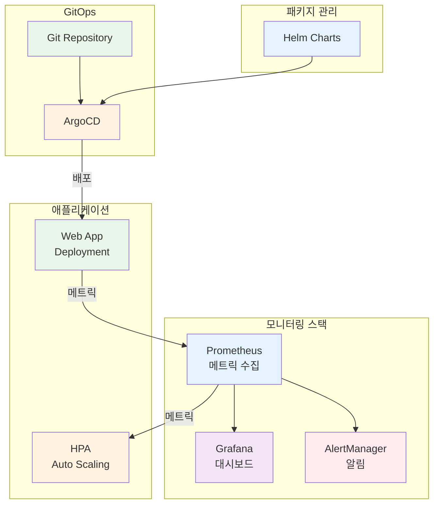

# Week 3 Day 5 Lab 1: 운영 환경 구축

<div align="center">

**📊 Prometheus** • **📈 Grafana** • **🔄 HPA** • **📦 Helm**

*프로덕션급 모니터링과 자동 확장 시스템 구축*

</div>

---

## 🕘 실습 정보
**시간**: 12:00-13:50 (110분, 점심시간 포함)  
**목표**: 완전한 운영 환경 구축 (모니터링 + 스케일링 + GitOps)  
**방식**: 단계별 실습 + 검증

## 🎯 실습 목표

### 📚 학습 목표
- **모니터링**: Prometheus + Grafana 스택 구축
- **자동 확장**: HPA로 자동 스케일링 구현
- **패키지 관리**: Helm으로 애플리케이션 배포
- **GitOps**: ArgoCD로 자동 배포 파이프라인

### 🛠️ 구현 목표
- Prometheus Operator로 메트릭 수집
- Grafana 대시보드로 시각화
- HPA로 CPU 기반 자동 확장
- Helm Chart로 애플리케이션 패키징
- ArgoCD로 GitOps 배포

---

## 🏗️ 전체 아키텍처



---

## 🚀 빠른 시작 (자동화 스크립트)

### 전체 자동 설치
```bash
cd lab_scripts/lab1
./00-install-all.sh
```

**📋 스크립트 내용**: [00-install-all.sh](./lab_scripts/lab1/00-install-all.sh)

모든 Step을 자동으로 실행합니다. 개별 Step을 학습하려면 아래 수동 실행을 따라하세요.

---

## 🛠️ Step 1: Helm 설치 및 설정 (10분)

### Step 1-1: Helm 설치

**🚀 자동화 스크립트 사용**:
```bash
cd lab_scripts/lab1
./01-install-helm.sh
```

**📋 스크립트 내용**: [01-install-helm.sh](./lab_scripts/lab1/01-install-helm.sh)

**1-1. 수동 실행 (학습용)**:
```bash
# Helm 설치
curl https://raw.githubusercontent.com/helm/helm/main/scripts/get-helm-3 | bash

# 버전 확인
helm version
```

**수동 설치 (학습용)**:
```bash
# macOS
brew install helm

# Linux
curl -fsSL -o get_helm.sh https://raw.githubusercontent.com/helm/helm/main/scripts/get-helm-3
chmod 700 get_helm.sh
./get_helm.sh

# Windows (Chocolatey)
choco install kubernetes-helm
```

### Step 1-2: Helm Repository 추가

```bash
# Prometheus Community Chart
helm repo add prometheus-community https://prometheus-community.github.io/helm-charts

# Grafana Chart
helm repo add grafana https://grafana.github.io/helm-charts

# ArgoCD Chart
helm repo add argo https://argoproj.github.io/argo-helm

# Repository 업데이트
helm repo update

# 추가된 Repository 확인
helm repo list
```

---

## 🛠️ Step 2: Prometheus Stack 설치 (25분)

### Step 2-1: Namespace 생성

**🚀 자동화 스크립트 사용**:
```bash
cd lab_scripts/lab1
./02-install-prometheus.sh
```

**📋 스크립트 내용**: [02-install-prometheus.sh](./lab_scripts/lab1/02-install-prometheus.sh)

**2-1. 수동 실행 (학습용)**:
```bash
# 모니터링 전용 Namespace
kubectl create namespace monitoring

# Namespace 확인
kubectl get namespace monitoring
```

### Step 2-2: Prometheus Operator 설치

**Helm으로 설치**:
```bash
# kube-prometheus-stack 설치
helm install prometheus prometheus-community/kube-prometheus-stack \
  --namespace monitoring \
  --set prometheus.prometheusSpec.serviceMonitorSelectorNilUsesHelmValues=false \
  --set grafana.enabled=true \
  --set grafana.adminPassword=admin123

# 설치 확인
helm list -n monitoring

# Pod 상태 확인
kubectl get pods -n monitoring
```

**설치되는 컴포넌트**:
- Prometheus Operator
- Prometheus Server
- Alertmanager
- Grafana
- Node Exporter (DaemonSet)
- Kube State Metrics

### Step 2-3: Prometheus 접속

```bash
# Prometheus 서비스 포트포워딩
kubectl port-forward -n monitoring svc/prometheus-kube-prometheus-prometheus 9090:9090

# 브라우저에서 접속
# http://localhost:9090
```

**Prometheus UI에서 확인**:
1. Status → Targets: 수집 중인 타겟 확인
2. Graph: PromQL 쿼리 테스트
3. Alerts: 알림 규칙 확인

**기본 PromQL 쿼리 테스트**:
```promql
# 노드 CPU 사용률
100 - (avg by (instance) (rate(node_cpu_seconds_total{mode="idle"}[5m])) * 100)

# Pod 메모리 사용량
container_memory_usage_bytes{namespace="default"}

# HTTP 요청 수
rate(http_requests_total[5m])
```

---

## 🛠️ Step 3: Grafana 대시보드 설정 (20분)

### Step 3-1: Grafana 접속

```bash
# Grafana 서비스 포트포워딩
kubectl port-forward -n monitoring svc/prometheus-grafana 3000:80

# 브라우저에서 접속
# http://localhost:3000
# Username: admin
# Password: admin123
```

### Step 3-2: 기본 대시보드 확인

**사전 설치된 대시보드**:
1. **Kubernetes / Compute Resources / Cluster**
   - 클러스터 전체 리소스 사용량
   - CPU, 메모리, 네트워크 현황

2. **Kubernetes / Compute Resources / Namespace (Pods)**
   - Namespace별 Pod 리소스 사용량
   - Pod별 상세 메트릭

3. **Node Exporter / Nodes**
   - 노드별 상세 메트릭
   - CPU, 메모리, 디스크, 네트워크

### Step 3-3: 커스텀 대시보드 생성

**대시보드 JSON 파일 생성**:
```json
{
  "dashboard": {
    "title": "My Application Dashboard",
    "panels": [
      {
        "title": "CPU Usage",
        "targets": [
          {
            "expr": "rate(container_cpu_usage_seconds_total{namespace=\"default\"}[5m])"
          }
        ],
        "type": "graph"
      },
      {
        "title": "Memory Usage",
        "targets": [
          {
            "expr": "container_memory_usage_bytes{namespace=\"default\"}"
          }
        ],
        "type": "graph"
      }
    ]
  }
}
```

**대시보드 Import**:
1. Grafana UI → Dashboards → Import
2. JSON 파일 업로드 또는 Dashboard ID 입력
3. Prometheus 데이터 소스 선택
4. Import 클릭

**추천 공개 대시보드**:
- **Kubernetes Cluster Monitoring**: ID 7249
- **Node Exporter Full**: ID 1860
- **Kubernetes Pod Monitoring**: ID 6417

---

## 🛠️ Step 4: 테스트 애플리케이션 배포 (15분)

### Step 4-1: 샘플 애플리케이션 배포

**🚀 자동화 스크립트 사용**:
```bash
cd lab_scripts/lab1
./03-deploy-app.sh
```

**📋 스크립트 내용**: [03-deploy-app.sh](./lab_scripts/lab1/03-deploy-app.sh)

**4-1. 수동 실행 (학습용)**:
```yaml
# web-app-deployment.yaml
apiVersion: apps/v1
kind: Deployment
metadata:
  name: web-app
  namespace: default
  labels:
    app: web-app
spec:
  replicas: 2
  selector:
    matchLabels:
      app: web-app
  template:
    metadata:
      labels:
        app: web-app
    spec:
      containers:
      - name: web-app
        image: nginx:1.21
        ports:
        - containerPort: 80
          name: http
        resources:
          requests:
            cpu: 100m
            memory: 128Mi
          limits:
            cpu: 500m
            memory: 512Mi
---
apiVersion: v1
kind: Service
metadata:
  name: web-app
  namespace: default
  labels:
    app: web-app
spec:
  selector:
    app: web-app
  ports:
  - port: 80
    targetPort: 80
    name: http
  type: ClusterIP
```

```bash
# 배포
kubectl apply -f web-app-deployment.yaml

# 확인
kubectl get pods -l app=web-app
kubectl get svc web-app
```

### Step 4-2: ServiceMonitor 생성

```yaml
# web-app-servicemonitor.yaml
apiVersion: monitoring.coreos.com/v1
kind: ServiceMonitor
metadata:
  name: web-app
  namespace: default
  labels:
    app: web-app
spec:
  selector:
    matchLabels:
      app: web-app
  endpoints:
  - port: http
    interval: 30s
    path: /metrics
```

```bash
# ServiceMonitor 생성
kubectl apply -f web-app-servicemonitor.yaml

# 확인
kubectl get servicemonitor -n default
```

---

## 🛠️ Step 5: HPA 설정 (20분)

### Step 5-1: Metrics Server 설치

**🚀 자동화 스크립트 사용**:
```bash
cd lab_scripts/lab1
./04-setup-hpa.sh
```

**📋 스크립트 내용**: [04-setup-hpa.sh](./lab_scripts/lab1/04-setup-hpa.sh)

**5-1. 수동 실행 (학습용)**:
```bash
# Metrics Server 설치
kubectl apply -f https://github.com/kubernetes-sigs/metrics-server/releases/latest/download/components.yaml

# Metrics Server 확인
kubectl get deployment metrics-server -n kube-system

# 메트릭 수집 확인 (1-2분 대기)
kubectl top nodes
kubectl top pods -n default
```

### Step 5-2: HPA 생성

```yaml
# web-app-hpa.yaml
apiVersion: autoscaling/v2
kind: HorizontalPodAutoscaler
metadata:
  name: web-app-hpa
  namespace: default
spec:
  scaleTargetRef:
    apiVersion: apps/v1
    kind: Deployment
    name: web-app
  minReplicas: 2
  maxReplicas: 10
  metrics:
  - type: Resource
    resource:
      name: cpu
      target:
        type: Utilization
        averageUtilization: 50
  - type: Resource
    resource:
      name: memory
      target:
        type: Utilization
        averageUtilization: 70
  behavior:
    scaleDown:
      stabilizationWindowSeconds: 300
      policies:
      - type: Percent
        value: 50
        periodSeconds: 60
    scaleUp:
      stabilizationWindowSeconds: 0
      policies:
      - type: Percent
        value: 100
        periodSeconds: 30
      - type: Pods
        value: 4
        periodSeconds: 30
      selectPolicy: Max
```

```bash
# HPA 생성
kubectl apply -f web-app-hpa.yaml

# HPA 상태 확인
kubectl get hpa web-app-hpa
kubectl describe hpa web-app-hpa
```

### Step 5-3: 부하 테스트

```bash
# 부하 생성 Pod 실행
kubectl run load-generator --image=busybox --restart=Never -- /bin/sh -c "while true; do wget -q -O- http://web-app; done"

# HPA 동작 관찰 (별도 터미널)
watch kubectl get hpa web-app-hpa

# Pod 개수 변화 관찰
watch kubectl get pods -l app=web-app

# 부하 중지
kubectl delete pod load-generator
```

**예상 결과**:
```
NAME           REFERENCE            TARGETS         MINPODS   MAXPODS   REPLICAS
web-app-hpa    Deployment/web-app   85%/50%         2         10        5
```

---

## 🛠️ Step 6: ArgoCD 설치 및 설정 (20분)

### Step 6-1: ArgoCD 설치

**🚀 자동화 스크립트 사용**:
```bash
cd lab_scripts/lab1
./05-install-argocd.sh
```

**📋 스크립트 내용**: [05-install-argocd.sh](./lab_scripts/lab1/05-install-argocd.sh)

**6-1. 수동 실행 (학습용)**:
```bash
# ArgoCD Namespace 생성
kubectl create namespace argocd

# ArgoCD 설치
kubectl apply -n argocd -f https://raw.githubusercontent.com/argoproj/argo-cd/stable/manifests/install.yaml

# 설치 확인
kubectl get pods -n argocd

# ArgoCD 서비스 확인
kubectl get svc -n argocd
```

### Step 6-2: ArgoCD CLI 설치

```bash
# macOS
brew install argocd

# Linux
curl -sSL -o argocd-linux-amd64 https://github.com/argoproj/argo-cd/releases/latest/download/argocd-linux-amd64
sudo install -m 555 argocd-linux-amd64 /usr/local/bin/argocd
rm argocd-linux-amd64

# Windows (Chocolatey)
choco install argocd-cli
```

### Step 6-3: ArgoCD 접속

```bash
# ArgoCD Server 포트포워딩
kubectl port-forward svc/argocd-server -n argocd 8080:443

# 초기 admin 비밀번호 확인
kubectl -n argocd get secret argocd-initial-admin-secret -o jsonpath="{.data.password}" | base64 -d

# 브라우저에서 접속
# https://localhost:8080
# Username: admin
# Password: (위에서 확인한 비밀번호)
```

### Step 6-4: ArgoCD Application 생성

```yaml
# argocd-app.yaml
apiVersion: argoproj.io/v1alpha1
kind: Application
metadata:
  name: web-app
  namespace: argocd
spec:
  project: default
  source:
    repoURL: https://github.com/your-org/your-repo
    targetRevision: HEAD
    path: k8s/web-app
  destination:
    server: https://kubernetes.default.svc
    namespace: default
  syncPolicy:
    automated:
      prune: true
      selfHeal: true
    syncOptions:
    - CreateNamespace=true
```

```bash
# Application 생성
kubectl apply -f argocd-app.yaml

# Application 상태 확인
kubectl get application -n argocd
```

---

## ✅ 실습 체크포인트

### ✅ 모니터링 스택 확인
- [ ] Prometheus가 정상적으로 메트릭 수집 중
- [ ] Grafana 대시보드에서 클러스터 상태 확인 가능
- [ ] ServiceMonitor로 애플리케이션 메트릭 수집 중

### ✅ 자동 확장 확인
- [ ] Metrics Server가 정상 동작
- [ ] HPA가 생성되고 메트릭 수집 중
- [ ] 부하 테스트 시 Pod 자동 증가
- [ ] 부하 제거 시 Pod 자동 감소

### ✅ GitOps 확인
- [ ] ArgoCD가 정상 설치됨
- [ ] ArgoCD UI 접속 가능
- [ ] Application이 생성되고 동기화 중

---

## 🚀 심화 실습 (선택사항)

### 심화 1: AlertManager 알림 설정

```yaml
# alertmanager-config.yaml
apiVersion: v1
kind: ConfigMap
metadata:
  name: alertmanager-config
  namespace: monitoring
data:
  alertmanager.yml: |
    global:
      resolve_timeout: 5m
    route:
      group_by: ['alertname']
      group_wait: 10s
      group_interval: 10s
      repeat_interval: 12h
      receiver: 'slack'
    receivers:
    - name: 'slack'
      slack_configs:
      - api_url: 'YOUR_SLACK_WEBHOOK_URL'
        channel: '#alerts'
        text: '{{ range .Alerts }}{{ .Annotations.description }}{{ end }}'
```

### 심화 2: 커스텀 메트릭 HPA

```yaml
# custom-metrics-hpa.yaml
apiVersion: autoscaling/v2
kind: HorizontalPodAutoscaler
metadata:
  name: web-app-custom-hpa
spec:
  scaleTargetRef:
    apiVersion: apps/v1
    kind: Deployment
    name: web-app
  minReplicas: 2
  maxReplicas: 10
  metrics:
  - type: Pods
    pods:
      metric:
        name: http_requests_per_second
      target:
        type: AverageValue
        averageValue: "1000"
```

### 심화 3: Helm Chart 생성

```bash
# Helm Chart 생성
helm create my-web-app

# Chart 구조 확인
tree my-web-app/

# values.yaml 수정
# templates/ 파일들 수정

# Chart 검증
helm lint my-web-app/

# Chart 설치
helm install my-app my-web-app/
```

---

## 🧹 실습 정리

**🚀 자동화 스크립트 사용**:
```bash
cd lab_scripts/lab1
./99-cleanup.sh
```

**📋 스크립트 내용**: [99-cleanup.sh](./lab_scripts/lab1/99-cleanup.sh)

**수동 정리 (학습용)**:
```bash
# HPA 삭제
kubectl delete hpa web-app-hpa

# 애플리케이션 삭제
kubectl delete -f web-app-deployment.yaml

# Prometheus Stack 삭제
helm uninstall prometheus -n monitoring

# ArgoCD 삭제
kubectl delete -n argocd -f https://raw.githubusercontent.com/argoproj/argo-cd/stable/manifests/install.yaml

# Namespace 삭제
kubectl delete namespace monitoring
kubectl delete namespace argocd
```

---

## 💡 실습 회고

### 🤝 페어 회고 (5분)
1. **모니터링**: "Prometheus와 Grafana로 어떤 인사이트를 얻었나요?"
2. **자동 확장**: "HPA 동작을 보면서 느낀 점은?"
3. **GitOps**: "ArgoCD의 자동 동기화가 유용할 것 같나요?"

### 📊 학습 성과
- ✅ Helm으로 복잡한 스택을 쉽게 설치
- ✅ Prometheus + Grafana로 완전한 가시성 확보
- ✅ HPA로 자동 확장 체험
- ✅ ArgoCD로 GitOps 기반 배포 이해

### 🎯 다음 단계
**Hands-on 1: 고급 운영 기능**
- 커스텀 메트릭 기반 스케일링
- 복잡한 알림 규칙 설정
- 멀티 클러스터 ArgoCD 구성

---

<div align="center">

**📊 완전한 가시성** • **🔄 자동 확장** • **🚀 GitOps 배포**

*프로덕션급 운영 환경 구축 완료!*

</div>
