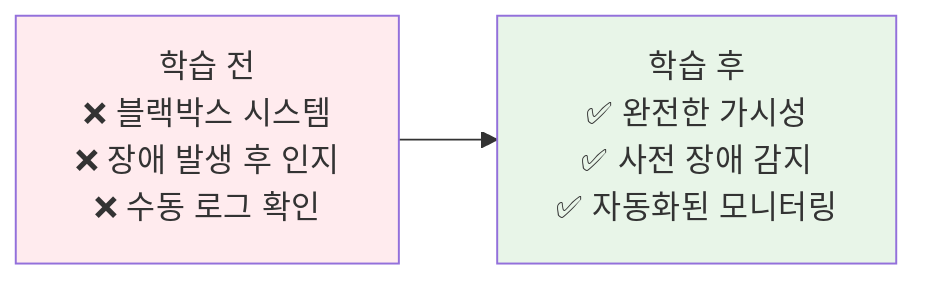
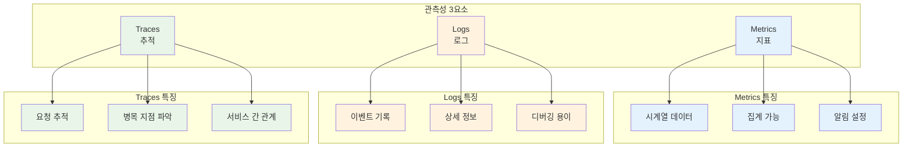
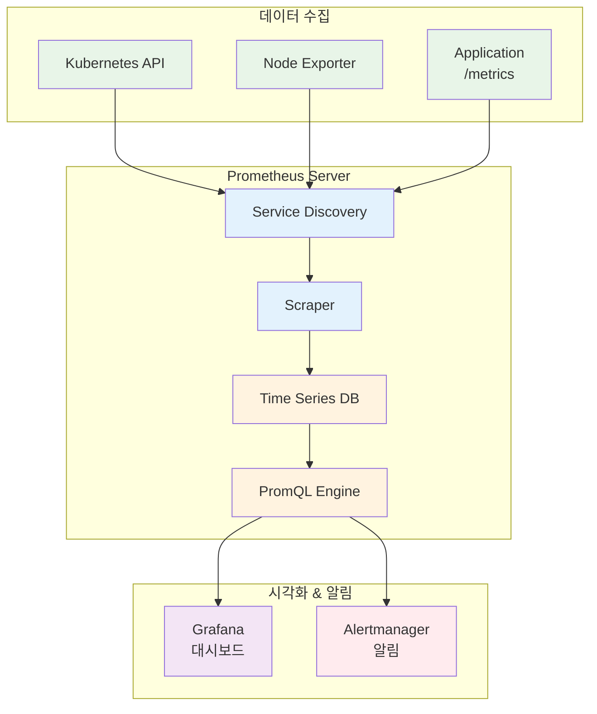
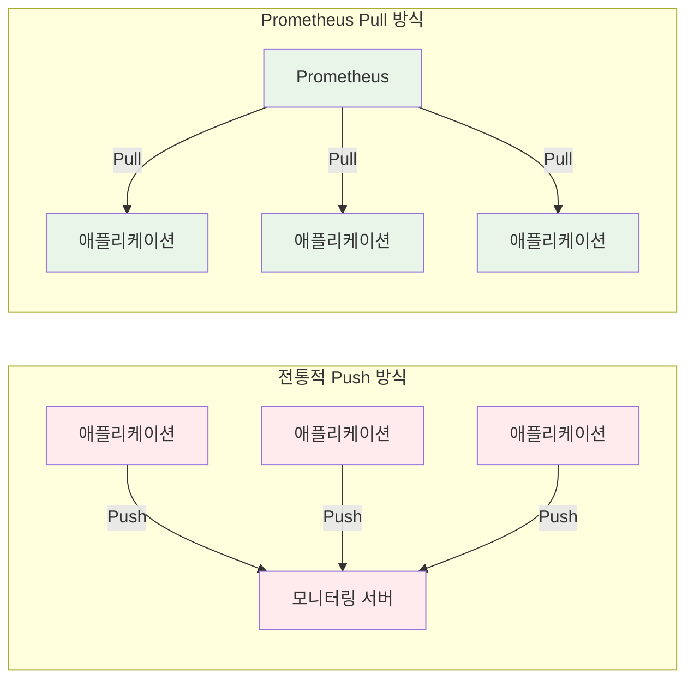
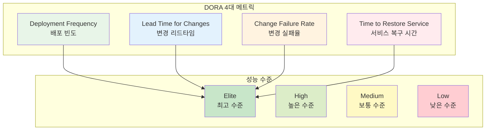
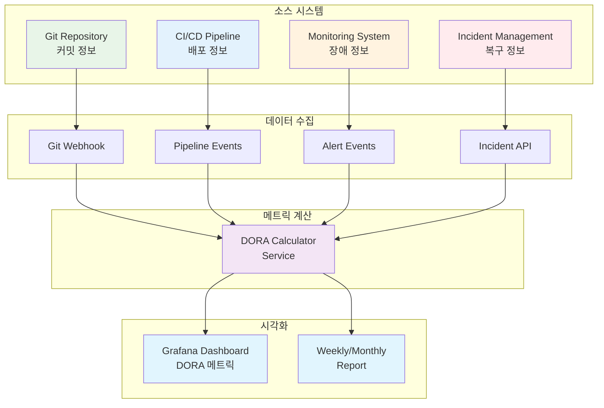
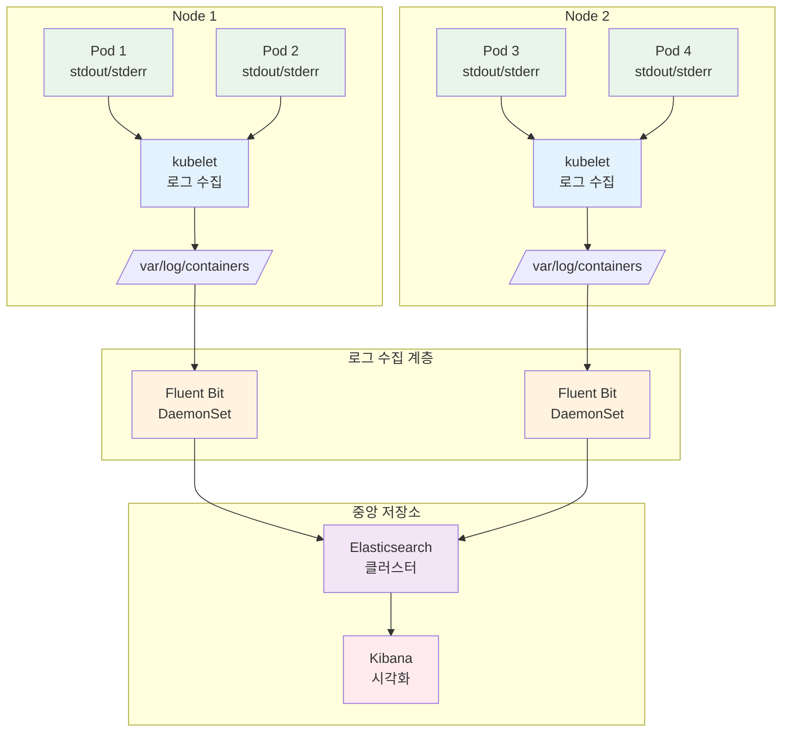
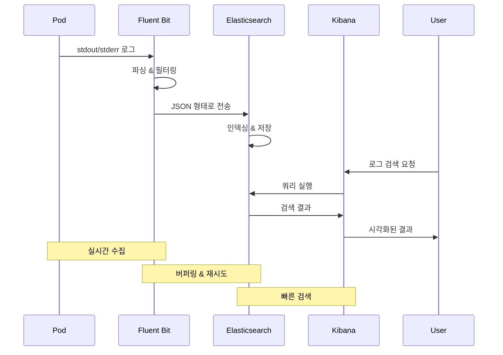

# Week 3 Day 5 Session 1: 모니터링 & 로깅

<div align="center">

**📊 관측성** • **🔍 Prometheus** • **📝 로깅**

*Kubernetes 클러스터의 완전한 가시성 확보*

</div>

---

## 🕘 세션 정보
**시간**: 09:00-09:50 (50분)  
**목표**: Kubernetes 관측성 3요소 완전 이해  
**방식**: 이론 + 아키텍처 분석

## 🎯 세션 목표

### 📚 학습 목표
- **이해 목표**: 관측성(Observability) 3요소 완전 이해
- **적용 목표**: Prometheus + Grafana 아키텍처 설계 능력
- **협업 목표**: 모니터링 전략 수립 및 공유

### 🤔 왜 필요한가? (5분)

**현실 문제 상황**:
- 💼 **실무 시나리오**: "서비스가 느려졌다는 고객 불만이 들어왔는데, 어디가 문제인지 모르겠어요"
- 🏠 **일상 비유**: 자동차 계기판 없이 운전하는 것과 같음 - 속도, 연료, 엔진 상태를 모르면 위험
- 📊 **시장 동향**: Google SRE가 강조하는 "관측성 없이는 운영 불가"

**학습 전후 비교**:


---

## 📖 핵심 개념 (35분)

### 🔍 개념 1: 관측성(Observability) 3요소 (12분)

> **정의**: 시스템의 내부 상태를 외부 출력으로 추론할 수 있는 능력

**🏠 실생활 비유**: 
- **Metrics**: 자동차 계기판 (속도계, 연료계, 온도계)
- **Logs**: 자동차 블랙박스 (사건 기록)
- **Traces**: 자동차 내비게이션 경로 (이동 경로 추적)

**관측성 3요소 상세**:



**1. Metrics (지표)**:
```yaml
# Prometheus 메트릭 예시
# Counter: 누적 증가 값
http_requests_total{method="GET", status="200"} 1547

# Gauge: 현재 값
node_memory_usage_bytes 8589934592

# Histogram: 분포 측정
http_request_duration_seconds_bucket{le="0.1"} 24054
http_request_duration_seconds_bucket{le="0.5"} 33444
http_request_duration_seconds_bucket{le="1.0"} 100392
```

**2. Logs (로그)**:
```json
{
  "timestamp": "2025-01-15T10:30:45Z",
  "level": "ERROR",
  "service": "order-service",
  "message": "Database connection timeout",
  "trace_id": "abc123",
  "user_id": "user456"
}
```

**3. Traces (추적)**:
```
Request Flow:
API Gateway (10ms)
  └─> User Service (50ms)
      └─> Database Query (200ms) ⚠️ 병목!
  └─> Order Service (30ms)
      └─> Payment Service (100ms)
```

**종합 비교표**:
| 구분 | Metrics | Logs | Traces |
|------|---------|------|--------|
| **목적** | 시스템 상태 측정 | 이벤트 기록 | 요청 경로 추적 |
| **데이터 형태** | 숫자 (시계열) | 텍스트/JSON | 스팬(Span) 체인 |
| **저장 기간** | 장기 (수개월) | 중기 (수주) | 단기 (수일) |
| **사용 시기** | 실시간 모니터링 | 문제 분석 | 성능 최적화 |
| **주요 도구** | Prometheus | ELK Stack | Jaeger, Zipkin |

### 🔍 개념 2: Prometheus 아키텍처 (12분)

> **정의**: Pull 기반 시계열 데이터베이스 및 모니터링 시스템

**💼 실무 상황**: Netflix, SoundCloud 등 대규모 서비스에서 사용하는 표준 모니터링 도구

**Prometheus 전체 아키텍처**:



**핵심 컴포넌트 설명**:

1. **Service Discovery (서비스 발견)**:
```yaml
# Kubernetes Service Discovery 설정
scrape_configs:
  - job_name: 'kubernetes-pods'
    kubernetes_sd_configs:
    - role: pod
    relabel_configs:
    - source_labels: [__meta_kubernetes_pod_annotation_prometheus_io_scrape]
      action: keep
      regex: true
```

2. **Scraper (메트릭 수집)**:
```
Pull 방식 동작:
1. Service Discovery로 타겟 목록 획득
2. 각 타겟의 /metrics 엔드포인트 호출
3. 기본 15초 간격으로 수집
4. Time Series DB에 저장
```

3. **Time Series Database**:
```
데이터 구조:
metric_name{label1="value1", label2="value2"} value timestamp

예시:
http_requests_total{method="GET", status="200"} 1547 1642248645
```

4. **PromQL (쿼리 언어)**:
```promql
# 5분간 평균 CPU 사용률
rate(container_cpu_usage_seconds_total[5m])

# 메모리 사용률 80% 이상인 Pod
container_memory_usage_bytes / container_spec_memory_limit_bytes > 0.8

# HTTP 요청 성공률
sum(rate(http_requests_total{status="200"}[5m])) 
/ 
sum(rate(http_requests_total[5m]))
```

**Prometheus vs 전통적 모니터링**:



**Pull 방식의 장점**:
- ✅ 모니터링 서버가 타겟 상태 파악 가능
- ✅ 네트워크 문제 시 즉시 감지
- ✅ 타겟 추가/제거 자동 감지
- ✅ 중앙에서 수집 주기 제어

### 🔍 개념 3: DORA 메트릭과 DevOps 성숙도 (8분)

> **정의**: DevOps Research and Assessment에서 정의한 소프트웨어 전달 성능 측정 지표

**💼 실무 중요성**: Google, Amazon, Microsoft 등 글로벌 기업들이 DevOps 성숙도 측정에 사용하는 표준 지표

**DORA 4대 핵심 메트릭**:



**1. Deployment Frequency (배포 빈도)**:
```yaml
# Prometheus 메트릭 예시
deployment_total{environment="production", service="backend"} 156

# 성능 수준별 기준
Elite: 하루에 여러 번 (On-demand)
High: 주 1회 ~ 월 1회
Medium: 월 1회 ~ 6개월에 1회
Low: 6개월에 1회 미만
```

**2. Lead Time for Changes (변경 리드타임)**:
```
측정 방법:
코드 커밋 → 프로덕션 배포까지 소요 시간

Elite: 1시간 미만
High: 1일 ~ 1주
Medium: 1주 ~ 1개월
Low: 1개월 ~ 6개월
```

**3. Change Failure Rate (변경 실패율)**:
```promql
# Prometheus 쿼리 예시
(
  sum(deployment_failures_total{environment="production"})
  /
  sum(deployment_total{environment="production"})
) * 100

Elite: 0-15%
High: 16-30%
Medium: 31-45%
Low: 46-60%
```

**4. Time to Restore Service (서비스 복구 시간)**:
```
측정 방법:
장애 발생 → 서비스 정상화까지 소요 시간

Elite: 1시간 미만
High: 1시간 ~ 1일
Medium: 1일 ~ 1주
Low: 1주 ~ 1개월
```

**DORA 메트릭 수집 아키텍처**:



**실무 구현 예시**:
```yaml
# GitLab CI/CD에서 DORA 메트릭 수집
stages:
  - build
  - test
  - deploy
  - metrics

deploy_production:
  stage: deploy
  script:
    - deploy.sh
    - |
      # Deployment Frequency 메트릭 전송
      curl -X POST http://prometheus-pushgateway:9091/metrics/job/dora \
        -d "deployment_total{environment=\"production\",service=\"${CI_PROJECT_NAME}\"} 1"
  only:
    - main

collect_dora_metrics:
  stage: metrics
  script:
    - |
      # Lead Time 계산 (커밋 시간 → 배포 시간)
      COMMIT_TIME=$(git log -1 --format=%ct)
      DEPLOY_TIME=$(date +%s)
      LEAD_TIME=$((DEPLOY_TIME - COMMIT_TIME))
      
      curl -X POST http://prometheus-pushgateway:9091/metrics/job/dora \
        -d "lead_time_seconds{environment=\"production\",service=\"${CI_PROJECT_NAME}\"} ${LEAD_TIME}"
```

**조직별 DORA 성숙도 비교**:
| 조직 유형 | Deployment Frequency | Lead Time | Change Failure Rate | Recovery Time |
|-----------|---------------------|-----------|-------------------|---------------|
| **스타트업** | 하루 여러 번 | 1시간 | 10% | 30분 |
| **중견기업** | 주 1회 | 1일 | 20% | 4시간 |
| **대기업** | 월 1회 | 1주 | 30% | 1일 |
| **레거시 조직** | 분기 1회 | 1개월 | 50% | 1주 |

### 🔍 개념 4: Kubernetes 로깅 전략 (8분)

> **정의**: 클러스터 전체의 로그를 중앙화하여 수집, 저장, 분석하는 시스템

**🏠 실생활 비유**: 
- **Node-level**: 각 건물의 CCTV (개별 저장)
- **Cluster-level**: 중앙 관제센터 (통합 모니터링)

**Kubernetes 로깅 아키텍처**:



**로깅 패턴 비교**:

1. **Node-level Logging**:
```bash
# kubelet이 자동으로 수집
/var/log/containers/
├── frontend-7d4b449c47-x8k9p_default_frontend-abc123.log
├── backend-5f6c8d9b4a-m2n3p_default_backend-def456.log
└── database-6g7d8e9c5b-q4r5s_default_database-ghi789.log

# 로그 로테이션 자동 관리
- 파일 크기: 10MB 초과 시 로테이션
- 보관 개수: 최대 5개 파일
```

2. **Cluster-level Logging**:
```yaml
# Fluent Bit DaemonSet 배포
apiVersion: apps/v1
kind: DaemonSet
metadata:
  name: fluent-bit
  namespace: logging
spec:
  selector:
    matchLabels:
      app: fluent-bit
  template:
    spec:
      containers:
      - name: fluent-bit
        image: fluent/fluent-bit:2.0
        volumeMounts:
        - name: varlog
          mountPath: /var/log
        - name: varlibdockercontainers
          mountPath: /var/lib/docker/containers
          readOnly: true
      volumes:
      - name: varlog
        hostPath:
          path: /var/log
      - name: varlibdockercontainers
        hostPath:
          path: /var/lib/docker/containers
```

**ELK Stack 구성**:



**로그 구조화 예시**:
```json
{
  "@timestamp": "2025-01-15T10:30:45.123Z",
  "kubernetes": {
    "namespace": "production",
    "pod_name": "backend-7d4b449c47-x8k9p",
    "container_name": "backend",
    "labels": {
      "app": "backend",
      "version": "v1.2.0"
    }
  },
  "log": "ERROR: Database connection failed",
  "level": "ERROR",
  "trace_id": "abc123def456",
  "user_id": "user789"
}
```

**로깅 베스트 프랙티스**:
- ✅ **구조화된 로그**: JSON 형태로 출력
- ✅ **로그 레벨**: DEBUG, INFO, WARN, ERROR 구분
- ✅ **컨텍스트 정보**: trace_id, user_id 등 포함
- ✅ **민감 정보 제외**: 비밀번호, 토큰 등 마스킹
- ✅ **적절한 보관 기간**: 비용과 규정 고려

---

## 💭 함께 생각해보기 (10분)

### 🤝 페어 토론 (5분)

**토론 주제**:
1. **관측성 우선순위**: "Metrics, Logs, Traces 중 가장 먼저 구축해야 할 것은?"
2. **DORA 메트릭**: "우리 조직의 현재 DORA 성숙도는 어느 수준일까?"
3. **모니터링 전략**: "우리 서비스에 필요한 핵심 메트릭은 무엇일까?"
4. **로그 보관**: "로그를 얼마나 오래 보관해야 할까? (비용 vs 필요성)"

**페어 활동 가이드**:
- 👥 **자유 페어링**: 관심사가 비슷한 사람끼리
- 🔄 **역할 교대**: 각자 의견 제시 후 토론
- 📝 **핵심 정리**: 합의된 내용 메모

### 🎯 전체 공유 (5분)

**공유 주제**:
- 각 페어의 모니터링 전략
- 실무에서 겪었던 모니터링 관련 경험
- 궁금한 점이나 추가로 알고 싶은 내용

### 💡 이해도 체크 질문

- ✅ "관측성 3요소를 각각 한 문장으로 설명할 수 있나요?"
- ✅ "Prometheus가 Pull 방식을 사용하는 이유를 설명할 수 있나요?"
- ✅ "Cluster-level 로깅이 필요한 이유를 설명할 수 있나요?"

---

## 🔑 핵심 키워드

### 🆕 새로운 용어
- **Observability (관측성)**: 시스템 내부 상태를 외부 출력으로 추론하는 능력
- **Metrics (메트릭)**: 시계열 숫자 데이터로 시스템 상태 측정
- **DORA 메트릭**: DevOps Research and Assessment에서 정의한 소프트웨어 전달 성능 지표
- **Deployment Frequency**: 프로덕션 환경으로의 배포 빈도
- **Lead Time for Changes**: 코드 커밋부터 프로덕션 배포까지의 소요 시간
- **Change Failure Rate**: 프로덕션 배포 중 실패하거나 롤백이 필요한 비율
- **Time to Restore Service**: 서비스 장애 발생부터 복구까지의 소요 시간
- **Prometheus**: Pull 기반 오픈소스 모니터링 시스템
- **PromQL**: Prometheus Query Language, 시계열 데이터 쿼리 언어
- **Time Series Database**: 시간 순서로 저장되는 데이터베이스
- **Scraping**: 메트릭 엔드포인트에서 데이터를 주기적으로 수집하는 행위
- **Exporter**: 메트릭을 Prometheus 형식으로 노출하는 에이전트
- **ELK Stack**: Elasticsearch, Logstash, Kibana 로깅 스택
- **Fluent Bit**: 경량 로그 수집기 (Fluentd의 경량 버전)
- **DaemonSet**: 모든 노드에 하나씩 Pod를 실행하는 워크로드

### 🔤 약어 및 줄임말
- **SLI**: Service Level Indicator (서비스 수준 지표)
- **SLO**: Service Level Objective (서비스 수준 목표)
- **SLA**: Service Level Agreement (서비스 수준 협약)
- **TSDB**: Time Series Database
- **ELK**: Elasticsearch + Logstash + Kibana

---

## 🎉 Fun Facts & 기업 사례

### 기술적 재미
- **Prometheus 이름**: 그리스 신화의 프로메테우스(불을 훔친 신)에서 유래
- **Pull vs Push**: Prometheus는 Pull, 대부분 모니터링 도구는 Push 방식
- **PromQL 강력함**: SQL처럼 복잡한 쿼리 가능하지만 시계열 데이터 특화
- **Grafana 의미**: "그래프"(Graph)와 "아나"(데이터)의 합성어

### Google SRE 사례
- **문제 상황**: 수천 개 서비스의 상태를 실시간으로 파악해야 함
- **해결 방법**: 
  - Borgmon (Prometheus의 전신) 개발
  - SLI/SLO 기반 모니터링 체계 확립
  - 4 Golden Signals (Latency, Traffic, Errors, Saturation)
- **결과**: 99.99% 가용성 달성, 장애 대응 시간 90% 단축
- **교훈**: "측정할 수 없으면 개선할 수 없다"

### Netflix 사례
- **문제 상황**: 마이크로서비스 수백 개의 로그를 효율적으로 관리
- **해결 방법**:
  - 중앙화된 로깅 시스템 구축 (ELK Stack)
  - 구조화된 JSON 로그 표준화
  - 자동화된 로그 분석 및 알림
- **결과**: 
  - 장애 원인 파악 시간 80% 단축
  - 일일 수 TB의 로그 효율적 관리
- **교훈**: 표준화된 로그 구조가 분석 효율을 극대화

### Spotify 사례
- **문제 상황**: 분산 시스템에서 성능 병목 지점 파악 어려움
- **해결 방법**:
  - Distributed Tracing 도입 (Jaeger)
  - 모든 서비스에 trace_id 전파
  - 요청 흐름 시각화
- **결과**:
  - API 응답 시간 40% 개선
  - 병목 지점 즉시 파악 가능
- **교훈**: Tracing은 마이크로서비스 필수 도구

### 업계 통계
- **Prometheus 채택률**: CNCF 설문조사 기준 78% 사용
- **로그 데이터 증가율**: 연평균 50% 증가
- **모니터링 ROI**: 장애 대응 비용 70% 절감
- **평균 MTTR**: 관측성 도구 도입 후 15분 → 3분으로 단축

---

## 📝 세션 마무리

### ✅ 오늘 세션 성과
- [ ] 관측성 3요소(Metrics, Logs, Traces) 완전 이해
- [ ] Prometheus 아키텍처와 동작 원리 파악
- [ ] Kubernetes 로깅 전략 및 ELK Stack 이해
- [ ] 실무 모니터링 전략 수립 능력 향상

### 🎯 다음 세션 준비
**Session 2: 오토스케일링 & 자동화**
- HPA, VPA, Cluster Autoscaler 학습
- 메트릭 기반 자동 확장 전략
- Session 1의 Prometheus 메트릭을 활용한 스케일링

### 💡 복습 가이드
1. **관측성 3요소**: 각각의 목적과 사용 시기 정리
2. **Prometheus**: Pull 방식의 장점과 PromQL 기본 문법
3. **로깅**: Node-level vs Cluster-level 차이점
4. **실습 준비**: Prometheus와 Grafana 설치 방법 예습

---

<div align="center">

**📊 완전한 가시성** • **🔍 사전 장애 감지** • **📝 효율적 로그 관리**

*관측성 없이는 운영할 수 없다 - Google SRE*

</div>
