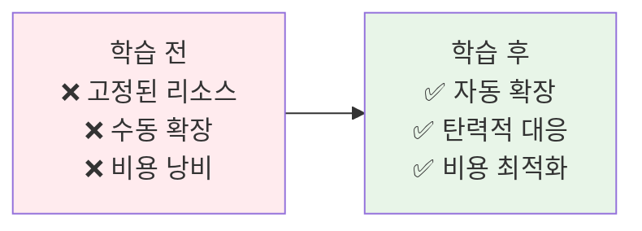
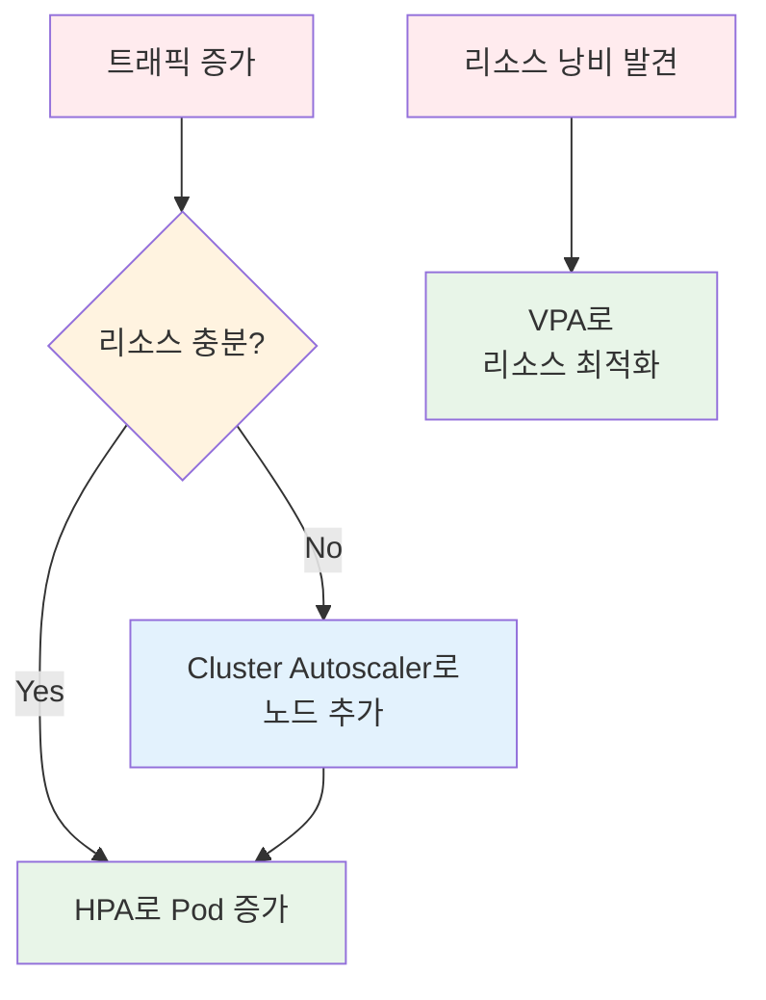
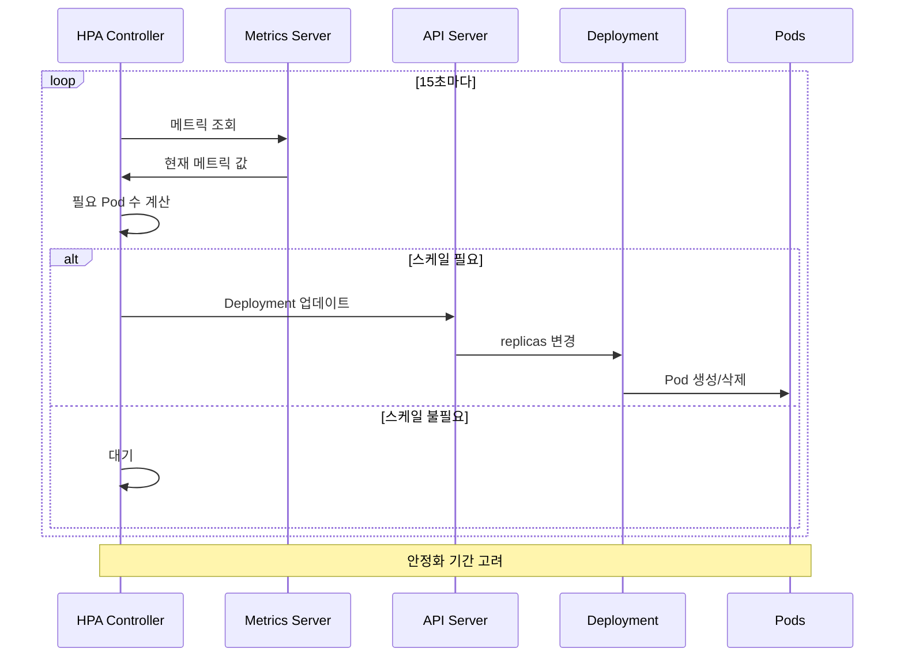
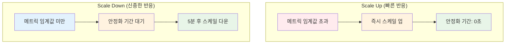
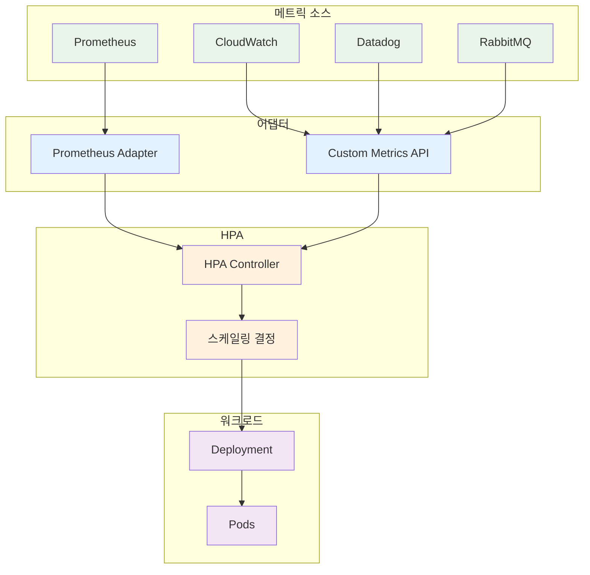
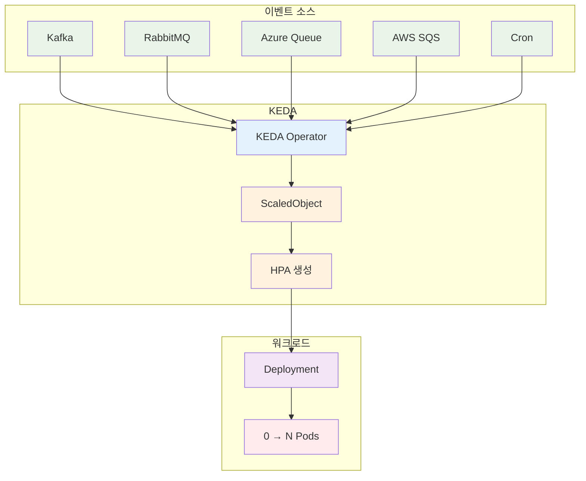
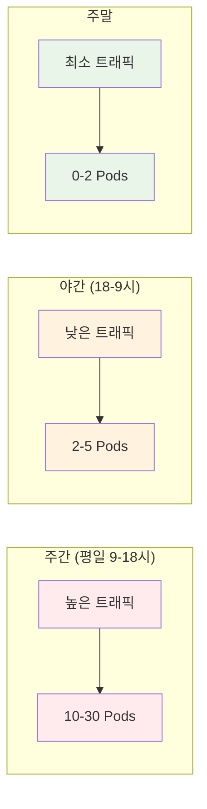

# Week 3 Day 5 Session 2: 오토스케일링 & 자동화

<div align="center">

**📈 HPA** • **📊 VPA** • **🔄 Cluster Autoscaler**

*Kubernetes의 자동 확장으로 탄력적인 시스템 구축*

</div>

---

## 🕘 세션 정보
**시간**: 10:00-10:50 (50분)  
**목표**: Kubernetes 오토스케일링 완전 정복  
**방식**: 이론 + 알고리즘 분석 + 실무 전략

## 🎯 세션 목표

### 📚 학습 목표
- **이해 목표**: HPA, VPA, Cluster Autoscaler 차이점 완전 이해
- **적용 목표**: 메트릭 기반 스케일링 전략 수립 능력
- **협업 목표**: 팀 서비스에 맞는 스케일링 정책 설계

### 🤔 왜 필요한가? (5분)

**현실 문제 상황**:
- 💼 **실무 시나리오**: "블랙 프라이데이 세일 때 서버가 다운됐어요. 트래픽이 평소의 10배였는데..."
- 🏠 **일상 비유**: 식당의 직원 수 - 손님이 많으면 직원 추가, 적으면 줄이기
- 📊 **시장 동향**: AWS, GCP 등 모든 클라우드가 Auto Scaling 기본 제공

**학습 전후 비교**:


---

## 📖 핵심 개념 (35분)

### 🔍 개념 1: 3가지 오토스케일링 비교 (12분)

> **정의**: Kubernetes에서 제공하는 3가지 자동 확장 메커니즘

**🏠 실생활 비유**:
- **HPA**: 식당 직원 수 조절 (손님 많으면 직원 추가)
- **VPA**: 직원 1명당 업무량 조절 (더 많은 일을 할 수 있게 역량 강화)
- **Cluster Autoscaler**: 식당 건물 확장 (공간이 부족하면 건물 증축)

**3가지 스케일링 비교**:

```mermaid
graph TB
    subgraph "HPA - Horizontal Pod Autoscaler"
        A1[Pod 개수 조절]
        A2[수평 확장]
        A3[트래픽 증가 대응]
    end
    
    subgraph "VPA - Vertical Pod Autoscaler"
        B1[Pod 리소스 조절]
        B2[수직 확장]
        B3[리소스 최적화]
    end
    
    subgraph "Cluster Autoscaler"
        C1[노드 개수 조절]
        C2[클러스터 확장]
        C3[리소스 부족 대응]
    end
    
    A1 --> A2
    A2 --> A3
    
    B1 --> B2
    B2 --> B3
    
    C1 --> C2
    C2 --> C3
    
    style A1 fill:#e3f2fd
    style A2 fill:#e3f2fd
    style A3 fill:#e3f2fd
    style B1 fill:#fff3e0
    style B2 fill:#fff3e0
    style B3 fill:#fff3e0
    style C1 fill:#e8f5e8
    style C2 fill:#e8f5e8
    style C3 fill:#e8f5e8
```



**1. HPA (Horizontal Pod Autoscaler)**:
```yaml
apiVersion: autoscaling/v2
kind: HorizontalPodAutoscaler
metadata:
  name: web-app-hpa
spec:
  scaleTargetRef:
    apiVersion: apps/v1
    kind: Deployment
    name: web-app
  minReplicas: 2
  maxReplicas: 10
  metrics:
  # CPU 기반 스케일링
  - type: Resource
    resource:
      name: cpu
      target:
        type: Utilization
        averageUtilization: 70
  # 메모리 기반 스케일링
  - type: Resource
    resource:
      name: memory
      target:
        type: Utilization
        averageUtilization: 80
  # 커스텀 메트릭 (RPS)
  - type: Pods
    pods:
      metric:
        name: http_requests_per_second
      target:
        type: AverageValue
        averageValue: "1000"
  behavior:
    scaleDown:
      stabilizationWindowSeconds: 300  # 5분 안정화
      policies:
      - type: Percent
        value: 50
        periodSeconds: 60
    scaleUp:
      stabilizationWindowSeconds: 0
      policies:
      - type: Percent
        value: 100
        periodSeconds: 30
```

**2. VPA (Vertical Pod Autoscaler)**:
```yaml
apiVersion: autoscaling.k8s.io/v1
kind: VerticalPodAutoscaler
metadata:
  name: web-app-vpa
spec:
  targetRef:
    apiVersion: apps/v1
    kind: Deployment
    name: web-app
  updatePolicy:
    updateMode: "Auto"  # Off, Initial, Recreate, Auto
  resourcePolicy:
    containerPolicies:
    - containerName: web-app
      minAllowed:
        cpu: 100m
        memory: 128Mi
      maxAllowed:
        cpu: 2000m
        memory: 2Gi
      controlledResources: ["cpu", "memory"]
```

**3. Cluster Autoscaler**:
```yaml
# AWS Auto Scaling Group 예시
apiVersion: v1
kind: ConfigMap
metadata:
  name: cluster-autoscaler-config
data:
  min-nodes: "2"
  max-nodes: "10"
  scale-down-enabled: "true"
  scale-down-delay-after-add: "10m"
  scale-down-unneeded-time: "10m"
```

**종합 비교표**:
| 구분 | HPA | VPA | Cluster Autoscaler |
|------|-----|-----|--------------------|
| **확장 대상** | Pod 개수 | Pod 리소스 | 노드 개수 |
| **확장 방향** | 수평 (Horizontal) | 수직 (Vertical) | 인프라 |
| **반응 속도** | 빠름 (초 단위) | 느림 (분 단위) | 매우 느림 (분 단위) |
| **사용 시기** | 트래픽 변동 | 리소스 최적화 | 노드 부족 |
| **비용 영향** | 중간 | 낮음 | 높음 |
| **주의사항** | Min/Max 설정 | Pod 재시작 필요 | 클라우드 의존 |

**스케일링 조합 전략**:


### 🔍 개념 2: HPA 스케일링 알고리즘 (12분)

> **정의**: 메트릭 기반으로 Pod 개수를 자동 계산하는 알고리즘

**💼 실무 상황**: Netflix, Spotify 등이 사용하는 핵심 스케일링 로직

**HPA 동작 원리**:



**스케일링 계산 공식**:
```
desiredReplicas = ceil[currentReplicas × (currentMetricValue / desiredMetricValue)]

예시 1: CPU 기반 스케일링
- 현재 Pod 수: 3개
- 현재 CPU 사용률: 80%
- 목표 CPU 사용률: 50%
- 계산: ceil[3 × (80/50)] = ceil[4.8] = 5개
- 결과: 2개 Pod 추가

예시 2: 메모리 기반 스케일링
- 현재 Pod 수: 5개
- 현재 메모리 사용률: 60%
- 목표 메모리 사용률: 70%
- 계산: ceil[5 × (60/70)] = ceil[4.28] = 5개
- 결과: 변경 없음 (안정 범위 내)
```

**다중 메트릭 처리**:
```yaml
# 여러 메트릭 중 가장 큰 값 선택
metrics:
- type: Resource
  resource:
    name: cpu
    target:
      averageUtilization: 70
- type: Resource
  resource:
    name: memory
    target:
      averageUtilization: 80

# 계산 예시
CPU 기반 계산: 5개 필요
메모리 기반 계산: 7개 필요
최종 결정: max(5, 7) = 7개
```

**스케일링 안정화 (Stabilization)**:



**안정화 설정 예시**:
```yaml
behavior:
  scaleDown:
    stabilizationWindowSeconds: 300  # 5분 동안 관찰
    policies:
    - type: Percent
      value: 50          # 한 번에 50%까지만 축소
      periodSeconds: 60  # 1분마다 평가
    - type: Pods
      value: 2           # 한 번에 최대 2개까지만 축소
      periodSeconds: 60
    selectPolicy: Min    # 가장 보수적인 정책 선택
  
  scaleUp:
    stabilizationWindowSeconds: 0    # 즉시 반응
    policies:
    - type: Percent
      value: 100         # 한 번에 100%까지 확장 가능
      periodSeconds: 30  # 30초마다 평가
    - type: Pods
      value: 4           # 한 번에 최대 4개까지 확장
      periodSeconds: 30
    selectPolicy: Max    # 가장 적극적인 정책 선택
```

**실무 튜닝 팁**:
- ✅ **Scale Up**: 빠르게 (트래픽 급증 대응)
- ✅ **Scale Down**: 천천히 (불필요한 재시작 방지)
- ✅ **안정화 기간**: 5-10분 권장
- ✅ **Min/Max**: 최소 2개, 최대는 비용 고려

### 🔍 개념 3: 커스텀 메트릭 & KEDA (11분)

> **정의**: CPU/메모리 외 다양한 메트릭으로 스케일링하는 고급 기법

**🏠 실생활 비유**: 
- **기본 메트릭**: 식당의 테이블 점유율
- **커스텀 메트릭**: 주문 대기 시간, 주방 처리 속도 등

**커스텀 메트릭 아키텍처**:



**커스텀 메트릭 예시**:

1. **HTTP 요청 수 기반**:
```yaml
apiVersion: autoscaling/v2
kind: HorizontalPodAutoscaler
metadata:
  name: web-app-hpa
spec:
  scaleTargetRef:
    apiVersion: apps/v1
    kind: Deployment
    name: web-app
  minReplicas: 2
  maxReplicas: 10
  metrics:
  - type: Pods
    pods:
      metric:
        name: http_requests_per_second
      target:
        type: AverageValue
        averageValue: "1000"  # Pod당 1000 RPS
```

2. **큐 길이 기반**:
```yaml
metrics:
- type: External
  external:
    metric:
      name: rabbitmq_queue_messages_ready
      selector:
        matchLabels:
          queue: "orders"
    target:
      type: AverageValue
      averageValue: "30"  # Pod당 30개 메시지 처리
```

3. **비즈니스 메트릭 기반**:
```yaml
metrics:
- type: Object
  object:
    metric:
      name: active_users
    describedObject:
      apiVersion: v1
      kind: Service
      name: user-service
    target:
      type: Value
      value: "10000"  # 활성 사용자 10,000명당 Pod 1개
```

**KEDA (Kubernetes Event-Driven Autoscaling)**:



**KEDA ScaledObject 예시**:
```yaml
apiVersion: keda.sh/v1alpha1
kind: ScaledObject
metadata:
  name: rabbitmq-consumer-scaler
spec:
  scaleTargetRef:
    name: rabbitmq-consumer
  minReplicaCount: 0   # 0까지 축소 가능!
  maxReplicaCount: 30
  pollingInterval: 30
  cooldownPeriod: 300
  triggers:
  # RabbitMQ 큐 길이 기반
  - type: rabbitmq
    metadata:
      queueName: orders
      queueLength: "20"
      host: amqp://rabbitmq:5672
  # Cron 기반 (특정 시간에 스케일 업)
  - type: cron
    metadata:
      timezone: Asia/Seoul
      start: 0 9 * * *    # 매일 오전 9시
      end: 0 18 * * *     # 매일 오후 6시
      desiredReplicas: "10"
```

**KEDA의 혁신적 기능**:
- ✅ **Scale to Zero**: 이벤트 없으면 Pod 0개로 축소 (비용 절감)
- ✅ **다양한 소스**: 60개 이상의 이벤트 소스 지원
- ✅ **Cron 스케일링**: 시간 기반 자동 확장
- ✅ **멀티 트리거**: 여러 조건 동시 고려

**실무 활용 사례**:



---

## 💭 함께 생각해보기 (10분)

### 🤝 페어 토론 (5분)

**토론 주제**:
1. **스케일링 전략**: "우리 서비스에는 HPA, VPA 중 무엇이 적합할까?"
2. **메트릭 선택**: "CPU/메모리 외에 어떤 메트릭으로 스케일링하면 좋을까?"
3. **비용 최적화**: "Scale to Zero를 적용할 수 있는 서비스는?"

**페어 활동 가이드**:
- 👥 **자유 페어링**: 관심사가 비슷한 사람끼리
- 🔄 **역할 교대**: 각자 의견 제시 후 토론
- 📝 **핵심 정리**: 합의된 스케일링 전략 메모

### 🎯 전체 공유 (5분)

**공유 주제**:
- 각 페어의 스케일링 전략
- 실무에서 겪었던 스케일링 관련 경험
- KEDA 활용 아이디어

### 💡 이해도 체크 질문

- ✅ "HPA, VPA, Cluster Autoscaler의 차이를 설명할 수 있나요?"
- ✅ "HPA 스케일링 계산 공식을 이해하고 적용할 수 있나요?"
- ✅ "KEDA의 Scale to Zero가 유용한 상황을 설명할 수 있나요?"

---

## 🔑 핵심 키워드

### 🆕 새로운 용어
- **HPA (Horizontal Pod Autoscaler)**: Pod 개수를 자동으로 조절하는 컨트롤러
- **VPA (Vertical Pod Autoscaler)**: Pod의 CPU/메모리 리소스를 자동 조절
- **Cluster Autoscaler**: 클러스터의 노드 개수를 자동 조절
- **Metrics Server**: Kubernetes 리소스 메트릭 수집 서버
- **Custom Metrics**: CPU/메모리 외 사용자 정의 메트릭
- **KEDA**: Kubernetes Event-Driven Autoscaling, 이벤트 기반 스케일링
- **ScaledObject**: KEDA의 스케일링 정의 리소스
- **Scale to Zero**: Pod를 0개까지 축소하는 기능
- **Stabilization Window**: 스케일링 결정 전 안정화 기간
- **Cooldown Period**: 스케일링 후 대기 시간

### 🔤 약어 및 줄임말
- **HPA**: Horizontal Pod Autoscaler
- **VPA**: Vertical Pod Autoscaler
- **CA**: Cluster Autoscaler
- **KEDA**: Kubernetes Event-Driven Autoscaling
- **RPS**: Requests Per Second (초당 요청 수)
- **QPS**: Queries Per Second (초당 쿼리 수)

---

## 🎉 Fun Facts & 기업 사례

### 기술적 재미
- **HPA 최소 간격**: 15초마다 메트릭 확인, 3분마다 스케일링 결정
- **VPA vs HPA 충돌**: CPU/메모리 기준으로 동시 사용 시 충돌 가능
- **KEDA 탄생**: Azure Functions 팀에서 시작된 오픈소스
- **Scale to Zero**: 서버리스의 핵심 개념을 Kubernetes에 도입

### Airbnb 사례
- **문제 상황**: 예약 시스템의 트래픽이 시간대별로 10배 차이
- **해결 방법**:
  - HPA로 CPU 기반 자동 확장
  - 커스텀 메트릭으로 예약 요청 수 기반 스케일링
  - Cluster Autoscaler로 노드 자동 확장
- **결과**:
  - 인프라 비용 40% 절감
  - 피크 시간 응답 시간 50% 개선
- **교훈**: 다층 스케일링 전략이 비용과 성능 모두 최적화

### Spotify 사례
- **문제 상황**: 음악 추천 배치 작업의 비효율적 리소스 사용
- **해결 방법**:
  - KEDA로 Kafka 메시지 큐 기반 스케일링
  - Scale to Zero로 작업 없을 때 Pod 0개
  - Cron 트리거로 특정 시간에 사전 스케일 업
- **결과**:
  - 배치 작업 비용 70% 절감
  - 처리 시간 30% 단축
- **교훈**: 이벤트 기반 스케일링이 배치 작업에 최적

### Zalando 사례
- **문제 상황**: 수백 개 마이크로서비스의 리소스 낭비
- **해결 방법**:
  - VPA로 모든 서비스의 리소스 자동 최적화
  - 2주간 학습 모드로 적정 리소스 파악
  - 점진적으로 Auto 모드 적용
- **결과**:
  - 클러스터 리소스 사용률 30% 개선
  - 오버 프로비저닝 비용 50% 절감
- **교훈**: VPA는 리소스 최적화의 숨은 영웅

### 업계 통계
- **HPA 채택률**: Kubernetes 사용자의 65% 이상 사용
- **평균 스케일링 시간**: HPA 30초, Cluster Autoscaler 3-5분
- **비용 절감**: 오토스케일링 도입 시 평균 40% 비용 절감
- **KEDA 성장**: 2019년 출시 후 CNCF Incubating 프로젝트로 성장

---

## 📝 세션 마무리

### ✅ 오늘 세션 성과
- [ ] HPA, VPA, Cluster Autoscaler 차이점 완전 이해
- [ ] HPA 스케일링 알고리즘과 계산 공식 파악
- [ ] 커스텀 메트릭과 KEDA 활용 방법 습득
- [ ] 실무 스케일링 전략 수립 능력 향상

### 🎯 다음 세션 준비
**Session 3: Helm & GitOps**
- Helm Chart로 애플리케이션 패키징
- ArgoCD로 GitOps 기반 배포
- Session 2의 HPA를 Helm Chart에 포함

### 💡 복습 가이드
1. **3가지 스케일링**: 각각의 용도와 조합 전략
2. **HPA 공식**: 계산 예시를 직접 풀어보기
3. **KEDA**: Scale to Zero의 장단점 정리
4. **실습 준비**: Metrics Server 설치 방법 예습

---

<div align="center">

**📈 자동 확장** • **💰 비용 최적화** • **🚀 탄력적 시스템**

*적절한 스케일링 전략이 성공적인 운영의 핵심*

</div>
