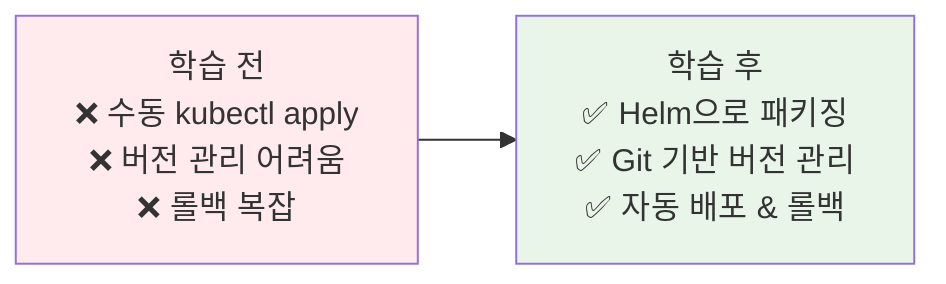
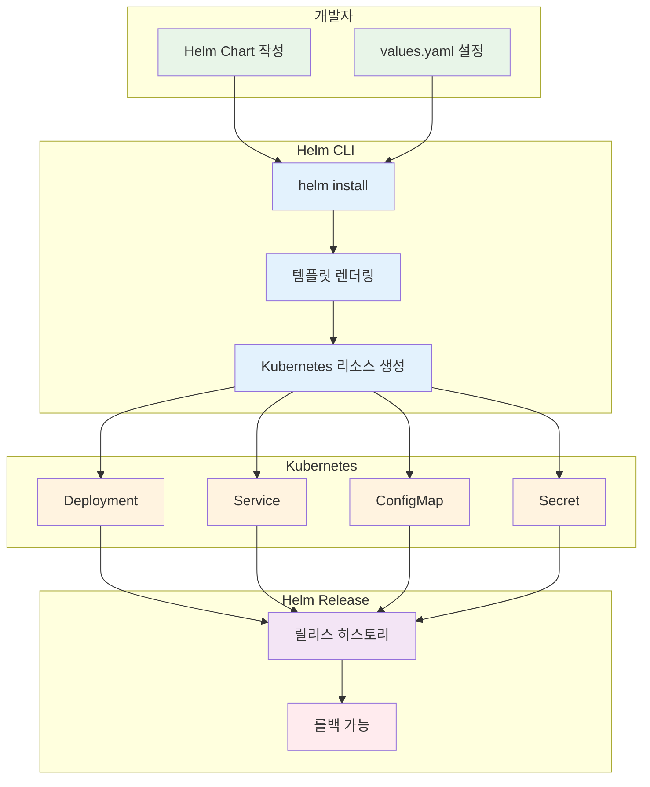

# Week 3 Day 5 Session 3: Helm & GitOps

<div align="center">

**📦 Helm** • **🔄 ArgoCD** • **🚀 GitOps**

*선언적 배포와 패키지 관리로 운영 자동화*

</div>

---

## 🕘 세션 정보
**시간**: 11:00-11:50 (50분)  
**목표**: Helm과 GitOps 기반 배포 완전 이해  
**방식**: 이론 + 아키텍처 분석 + 실무 워크플로우

## 🎯 세션 목표

### 📚 학습 목표
- **이해 목표**: Helm Chart 구조와 GitOps 원칙 완전 이해
- **적용 목표**: ArgoCD 기반 자동 배포 파이프라인 설계
- **협업 목표**: 팀 배포 전략 수립 및 공유

### 🤔 왜 필요한가? (5분)

**현실 문제 상황**:
- 💼 **실무 시나리오**: "Kubernetes YAML 파일이 수백 개인데, 버전 관리와 배포가 너무 복잡해요"
- 🏠 **일상 비유**: 
  - **Helm**: 가구 조립 설명서 (템플릿화된 설치 가이드)
  - **GitOps**: Git을 진실의 단일 소스로 사용하는 자동 배포
- 📊 **시장 동향**: CNCF 설문조사 기준 Helm 68%, GitOps 도구 45% 채택

**학습 전후 비교**:


---

## 📖 핵심 개념 (35분)

### 🔍 개념 1: Helm - Kubernetes 패키지 매니저 (12분)

> **정의**: Kubernetes 애플리케이션을 패키징, 배포, 관리하는 도구

**🏠 실생활 비유**: 
- **apt/yum**: Linux 패키지 매니저
- **npm/pip**: 프로그래밍 언어 패키지 매니저
- **Helm**: Kubernetes 패키지 매니저

**Helm 아키텍처**:



**Helm Chart 구조**:
```
my-app/
├── Chart.yaml              # Chart 메타데이터
├── values.yaml             # 기본 설정 값
├── charts/                 # 의존성 Chart들
├── templates/              # Kubernetes 템플릿들
│   ├── deployment.yaml
│   ├── service.yaml
│   ├── ingress.yaml
│   ├── configmap.yaml
│   ├── _helpers.tpl       # 템플릿 헬퍼 함수
│   └── NOTES.txt          # 설치 후 안내 메시지
└── README.md
```

**Chart.yaml 예시**:
```yaml
apiVersion: v2
name: my-web-app
description: A Helm chart for my web application
type: application
version: 1.0.0        # Chart 버전
appVersion: "2.1.0"   # 애플리케이션 버전

keywords:
  - web
  - kubernetes
maintainers:
  - name: DevOps Team
    email: devops@example.com
dependencies:
  - name: postgresql
    version: 12.1.0
    repository: https://charts.bitnami.com/bitnami
```

**values.yaml 예시**:
```yaml
# 기본 설정 값
replicaCount: 3

image:
  repository: nginx
  tag: "1.21"
  pullPolicy: IfNotPresent

service:
  type: ClusterIP
  port: 80

ingress:
  enabled: true
  className: nginx
  hosts:
    - host: myapp.example.com
      paths:
        - path: /
          pathType: Prefix

resources:
  limits:
    cpu: 500m
    memory: 512Mi
  requests:
    cpu: 250m
    memory: 256Mi

autoscaling:
  enabled: true
  minReplicas: 2
  maxReplicas: 10
  targetCPUUtilizationPercentage: 70
```

**템플릿 예시 (deployment.yaml)**:
```yaml
apiVersion: apps/v1
kind: Deployment
metadata:
  name: {{ include "my-app.fullname" . }}
  labels:
    {{- include "my-app.labels" . | nindent 4 }}
spec:
  {{- if not .Values.autoscaling.enabled }}
  replicas: {{ .Values.replicaCount }}
  {{- end }}
  selector:
    matchLabels:
      {{- include "my-app.selectorLabels" . | nindent 6 }}
  template:
    metadata:
      labels:
        {{- include "my-app.selectorLabels" . | nindent 8 }}
    spec:
      containers:
      - name: {{ .Chart.Name }}
        image: "{{ .Values.image.repository }}:{{ .Values.image.tag }}"
        imagePullPolicy: {{ .Values.image.pullPolicy }}
        ports:
        - name: http
          containerPort: 80
          protocol: TCP
        resources:
          {{- toYaml .Values.resources | nindent 12 }}
```

**Helm 주요 명령어**:
```bash
# Chart 설치
helm install my-release ./my-app

# 특정 values 파일로 설치
helm install my-release ./my-app -f values-prod.yaml

# 설정 값 오버라이드
helm install my-release ./my-app --set replicaCount=5

# 릴리스 목록 조회
helm list

# 릴리스 업그레이드
helm upgrade my-release ./my-app

# 릴리스 롤백
helm rollback my-release 1

# 릴리스 삭제
helm uninstall my-release

# Chart 검증
helm lint ./my-app

# 템플릿 렌더링 확인
helm template my-release ./my-app
```

**Helm의 장점**:
- ✅ **재사용성**: 한 번 작성한 Chart를 여러 환경에서 재사용
- ✅ **버전 관리**: Chart와 애플리케이션 버전 분리 관리
- ✅ **롤백**: 이전 버전으로 쉽게 롤백
- ✅ **의존성 관리**: 다른 Chart를 의존성으로 포함
- ✅ **커뮤니티**: Artifact Hub에 수천 개의 공개 Chart

### 🔍 개념 2: GitOps 원칙과 ArgoCD (12분)

> **정의**: Git을 진실의 단일 소스(Single Source of Truth)로 사용하는 선언적 배포 방식

**💼 실무 상황**: Weaveworks가 제안한 현대적 배포 패러다임

**GitOps 4대 원칙**:
1. **선언적 (Declarative)**: 시스템의 원하는 상태를 선언적으로 정의
2. **버전 관리 (Versioned)**: Git에 모든 상태 저장 및 버전 관리
3. **자동 적용 (Automated)**: Git 변경 시 자동으로 클러스터에 적용
4. **지속적 조정 (Reconciled)**: 실제 상태와 원하는 상태를 지속적으로 비교 및 조정

**ArgoCD 주요 기능**:
- 자동 동기화 및 Self-Heal
- 멀티 클러스터 지원
- Progressive Delivery (Canary, Blue-Green)
- Web UI 및 CLI 제공

### 🔍 개념 3: 실무 GitOps 전략 (11분)

**환경별 배포 전략**:
- 환경별 values 파일 사용
- 환경별 Application 분리
- App of Apps 패턴으로 계층적 관리

**GitOps 베스트 프랙티스**:
- ✅ Git이 진실의 소스
- ✅ 환경 분리
- ✅ 자동 동기화
- ✅ PR 기반 배포
- ✅ 롤백 전략

---

## 💭 함께 생각해보기 (10분)

### 🤝 페어 토론 (5분)
**토론 주제**:
1. "Helm vs Kustomize, 어떤 것이 적합할까?"
2. "GitOps 전략: Monorepo vs Polyrepo"
3. "배포 자동화 수준은?"

### 🎯 전체 공유 (5분)
- 각 페어의 배포 전략
- 실무 경험 공유

### 💡 이해도 체크 질문
- ✅ "Helm Chart 구조를 설명할 수 있나요?"
- ✅ "GitOps 4대 원칙을 설명할 수 있나요?"
- ✅ "ArgoCD 동작 원리를 설명할 수 있나요?"

---

## 🔑 핵심 키워드

### 🆕 새로운 용어
- **Helm**: Kubernetes 패키지 매니저
- **Chart**: Helm 패키지
- **GitOps**: Git 기반 운영 방식
- **ArgoCD**: GitOps CD 도구
- **Sync**: 상태 동기화
- **Self-Heal**: 자동 복구
- **App of Apps**: 계층적 관리 패턴

---

## 🎉 Fun Facts & 기업 사례

### Intuit 사례
- 1,000개 이상 마이크로서비스 관리
- Helm + ArgoCD로 배포 시간 80% 단축
- 배포 오류 90% 감소

### 업계 통계
- Helm 채택률: 68%
- GitOps 성장: 25% → 45%
- 배포 빈도: 5배 증가

---

## 📝 세션 마무리

### ✅ 오늘 세션 성과
- [ ] Helm Chart 이해
- [ ] GitOps 원칙 파악
- [ ] ArgoCD 아키텍처 이해
- [ ] 배포 전략 수립

### 🎯 다음 Lab 준비
**Lab 1: 운영 환경 구축**
- Helm Chart 작성
- ArgoCD 설치
- GitOps 파이프라인 구축

---

<div align="center">

**📦 패키지 관리** • **🔄 자동 배포** • **🚀 GitOps 혁명**

*Git을 진실의 소스로, 배포를 자동화로*

</div>

