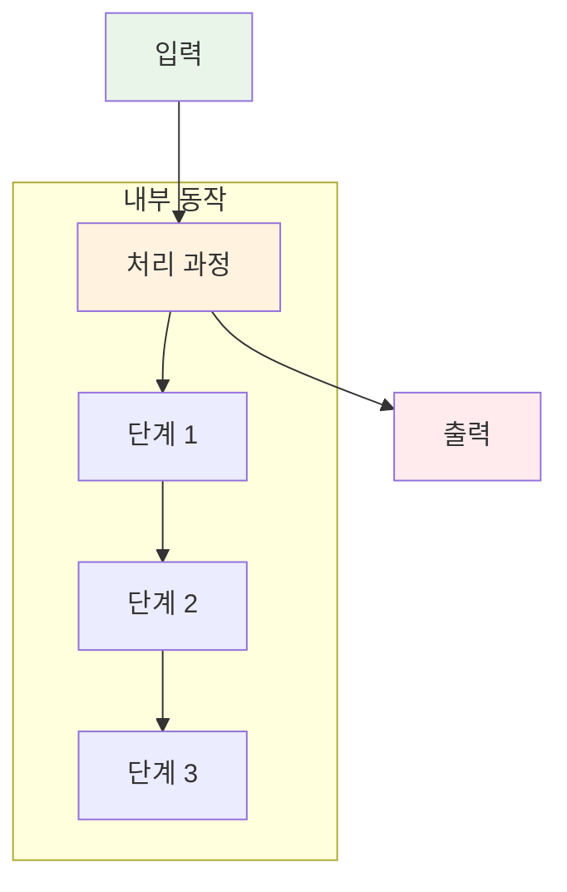
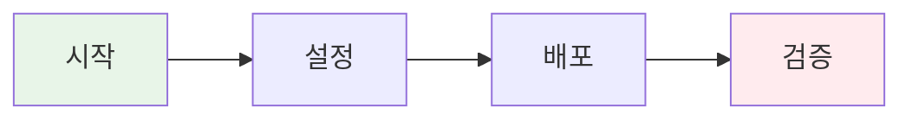
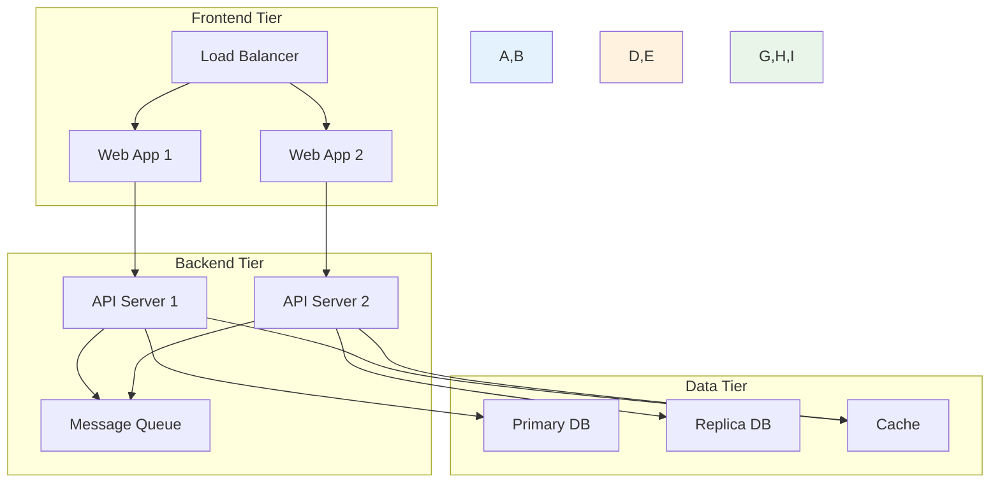
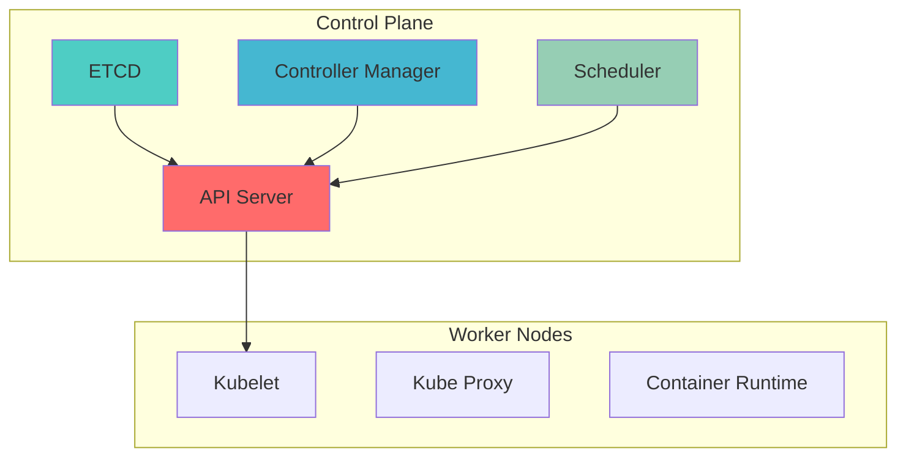
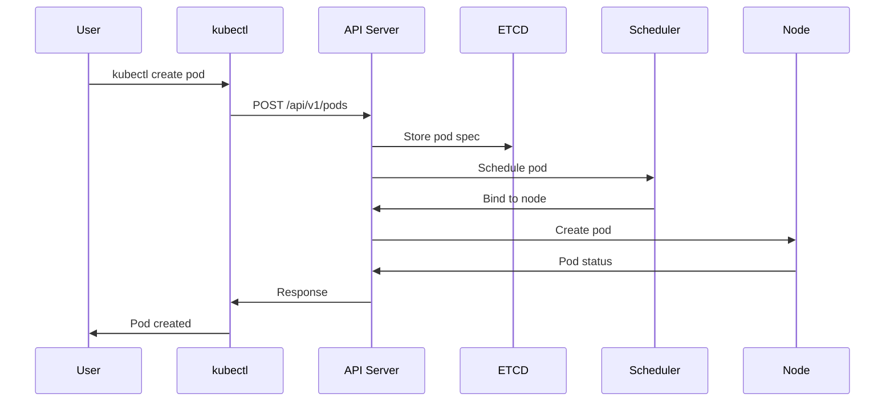
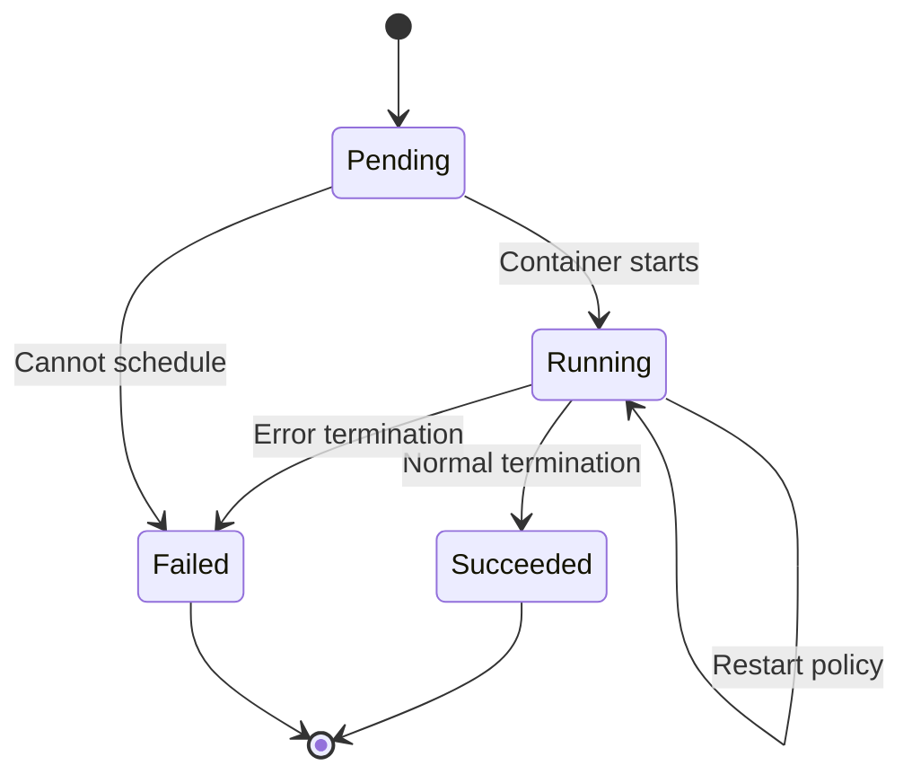
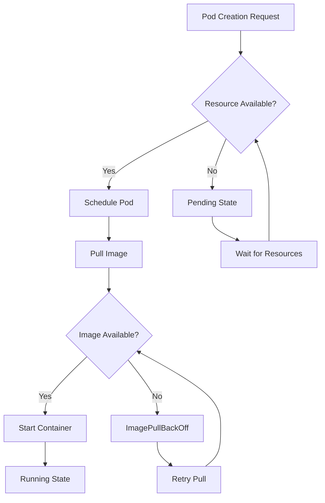

# Week 3 Kubernetes 교안 작성 템플릿 가이드라인

## 🎯 교안 작성 원칙

### 📚 핵심 원칙
- **시각화 우선**: 모든 개념을 Mermaid 다이어그램으로 표현
- **실무 연계**: 기업 사례와 실제 문제 해결 경험 포함
- **동작 원리 상세화**: 내부 메커니즘까지 깊이 있게 설명
- **예제 풍부화**: 다양한 사용 사례와 코드 예제 제공
- **Challenge 아키텍처**: 실제 구현 가능한 시스템 설계도 제공

### 🎨 시각화 가이드라인
- **Mermaid 다이어그램**: 각 세션마다 최소 3-4개 필수
- **아키텍처 다이어그램**: Challenge용 시스템 구조도
- **플로우차트**: 동작 과정과 의사결정 흐름
- **시퀀스 다이어그램**: 컴포넌트 간 상호작용
- **상태 다이어그램**: 리소스 생명주기 표현

---

## 📝 세션 템플릿 구조

### Session N: [세션 제목] (50분)

#### 🎯 필수 요소
- **핵심 개념 1**: [구체적 학습 목표]
- **핵심 개념 2**: [구체적 학습 목표]
- **핵심 개념 3**: [구체적 학습 목표]
- **실무 연계**: [실제 사용 사례]

#### 🔍 핵심 설명

**개념 1 - [개념명]**:


**동작 원리 상세**:
1. **초기화 단계**: [상세한 초기화 과정]
2. **실행 단계**: [핵심 실행 로직]
3. **완료 단계**: [결과 처리 및 정리]

**사용 예제**:
```yaml
# 기본 사용법
apiVersion: v1
kind: [ResourceType]
metadata:
  name: example
spec:
  # 기본 설정
  
---
# 고급 사용법
apiVersion: v1
kind: [ResourceType]
metadata:
  name: advanced-example
spec:
  # 고급 설정 옵션들
```

#### 🎉 Fun Facts & 기업 사례
- **기술적 재미**: [흥미로운 기술적 사실]
- **Netflix 사례**: [Netflix가 해당 기능으로 해결한 문제]
- **Google 사례**: [Google의 대규모 운영 경험]
- **Spotify 사례**: [Spotify의 창의적 활용법]
- **업계 통계**: [관련 통계나 벤치마크 데이터]

---

## 🛠️ Lab 템플릿 구조

### Lab N: [Lab 제목] (90분)

#### 🎯 Lab 목표
- **기본 목표**: [당일 학습 내용 직접 적용]
- **심화 목표**: [이해도 향상을 위한 고급 실습]
- **실무 연계**: [실제 업무에서 사용할 수 있는 시나리오]

#### 📋 사전 준비
```bash
# 환경 설정 명령어들
kubectl create namespace lab-session-n
kubectl config set-context --current --namespace=lab-session-n
```

#### 🔧 기본 Lab 요소 (60분)

**Step 1: [기본 구현]** (20분)


**구현 내용**:
```yaml
# 실제 구현할 YAML 파일들
apiVersion: apps/v1
kind: Deployment
metadata:
  name: lab-example
spec:
  replicas: 3
  selector:
    matchLabels:
      app: lab-example
  template:
    metadata:
      labels:
        app: lab-example
    spec:
      containers:
      - name: app
        image: nginx:1.20
        ports:
        - containerPort: 80
```

**Step 2: [기능 확장]** (20분)
**Step 3: [통합 테스트]** (20분)

#### 🚀 심화 Lab 요소 (30분)

**고급 기능 구현**:
- [복잡한 설정이나 고급 기능]
- [성능 최적화 방법]
- [모니터링 및 디버깅]

---

## 🎮 Challenge 템플릿 구조

### Challenge N: [Challenge 제목] (90분)

#### 🎯 Challenge 목표
**시나리오**: [실제 기업에서 발생할 수 있는 상황 설정]

#### 🏗️ 시스템 아키텍처


#### 🔧 구현 요구사항
1. **인프라 구성**: [필요한 인프라 컴포넌트]
2. **애플리케이션 배포**: [배포할 애플리케이션들]
3. **네트워킹 설정**: [서비스 간 통신 구성]
4. **데이터 관리**: [스토리지 및 데이터 영속성]

#### ⚠️ 의도적 오류 시나리오

**시나리오 1: [오류 상황 1]** (20분)
```yaml
# 의도적 오류가 포함된 설정
apiVersion: apps/v1
kind: Deployment
metadata:
  name: broken-app
spec:
  replicas: 3
  selector:
    matchLabels:
      app: wrong-label  # 의도적 오류: 라벨 불일치
  template:
    metadata:
      labels:
        app: correct-label
    spec:
      containers:
      - name: app
        image: nginx:nonexistent-tag  # 의도적 오류: 존재하지 않는 태그
```

**문제 해결 가이드**:
- 증상 확인 방법
- 로그 분석 절차
- 해결 단계별 가이드

---

## 🎨 Mermaid 다이어그램 활용 가이드

### 📊 다이어그램 타입별 용도

#### 1. 아키텍처 다이어그램


#### 2. 시퀀스 다이어그램


#### 3. 상태 다이어그램


#### 4. 플로우차트


### 🎨 스타일링 가이드라인
- **색상 구분**: 컴포넌트 타입별 일관된 색상 사용
- **그룹화**: subgraph로 논리적 그룹 표현
- **화살표**: 데이터 흐름과 제어 흐름 구분
- **라벨링**: 명확하고 간결한 라벨 사용

---

## 📚 Fun Facts 작성 가이드

### 🏢 기업 사례 템플릿
**[기업명] 사례**:
- **문제 상황**: [기업이 직면한 구체적 문제]
- **해결 방법**: [해당 Kubernetes 기능을 어떻게 활용했는지]
- **결과**: [정량적 개선 효과나 성과]
- **교훈**: [우리가 배울 수 있는 인사이트]

### 📊 통계 및 벤치마크
- **성능 수치**: [구체적인 성능 데이터]
- **업계 평균**: [업계 표준이나 평균치]
- **성장 추이**: [기술 채택률이나 성장 데이터]

### 🔍 기술적 흥미 요소
- **개발 배경**: [기술이 만들어진 이유나 배경]
- **네이밍 유래**: [이름의 어원이나 의미]
- **숨겨진 기능**: [잘 알려지지 않은 고급 기능]

---

## 🔧 코드 예제 작성 가이드

### 📝 예제 구성 원칙
1. **기본 → 고급**: 단순한 예제부터 복잡한 예제까지
2. **주석 풍부**: 각 설정의 의미와 효과 설명
3. **실무 적용**: 실제 프로덕션에서 사용 가능한 설정
4. **오류 방지**: 흔한 실수와 주의사항 포함

### 💡 예제 템플릿
```yaml
# [예제 제목] - [사용 목적]
apiVersion: [API 버전]
kind: [리소스 타입]
metadata:
  name: [리소스 이름]
  namespace: [네임스페이스]
  labels:
    # 라벨의 목적과 사용법 설명
    app: [앱 이름]
    version: [버전]
  annotations:
    # 어노테이션의 역할 설명
    description: "[설명]"
spec:
  # 각 필드별 상세 설명
  replicas: 3  # 복제본 개수 설정 이유
  selector:
    matchLabels:
      app: [앱 이름]  # 셀렉터 매칭 규칙
  template:
    metadata:
      labels:
        app: [앱 이름]
    spec:
      containers:
      - name: [컨테이너 이름]
        image: [이미지:태그]  # 이미지 선택 기준
        ports:
        - containerPort: 80
          name: http  # 포트 이름 지정의 장점
        resources:
          requests:
            cpu: 100m     # CPU 요청량 설정 근거
            memory: 128Mi # 메모리 요청량 설정 근거
          limits:
            cpu: 500m     # CPU 제한 설정 이유
            memory: 512Mi # 메모리 제한 설정 이유
        env:
        - name: [환경변수명]
          value: "[값]"
        # 추가 설정들...
```

이 가이드라인을 따라 Week 3의 모든 교안을 작성하면 일관성 있고 품질 높은 교육 자료가 완성됩니다! 🚀