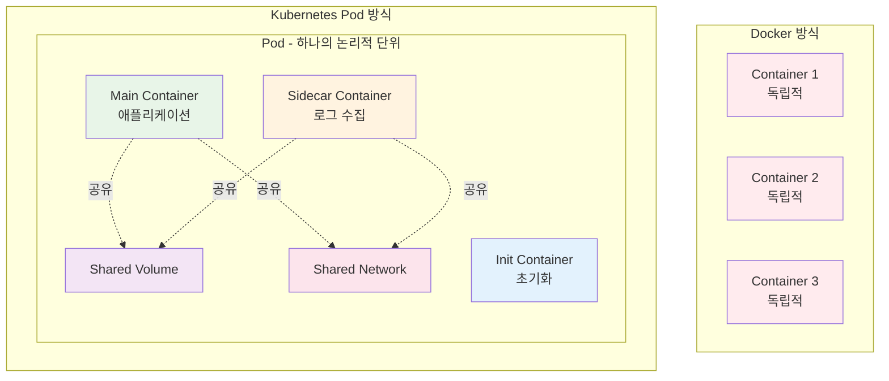
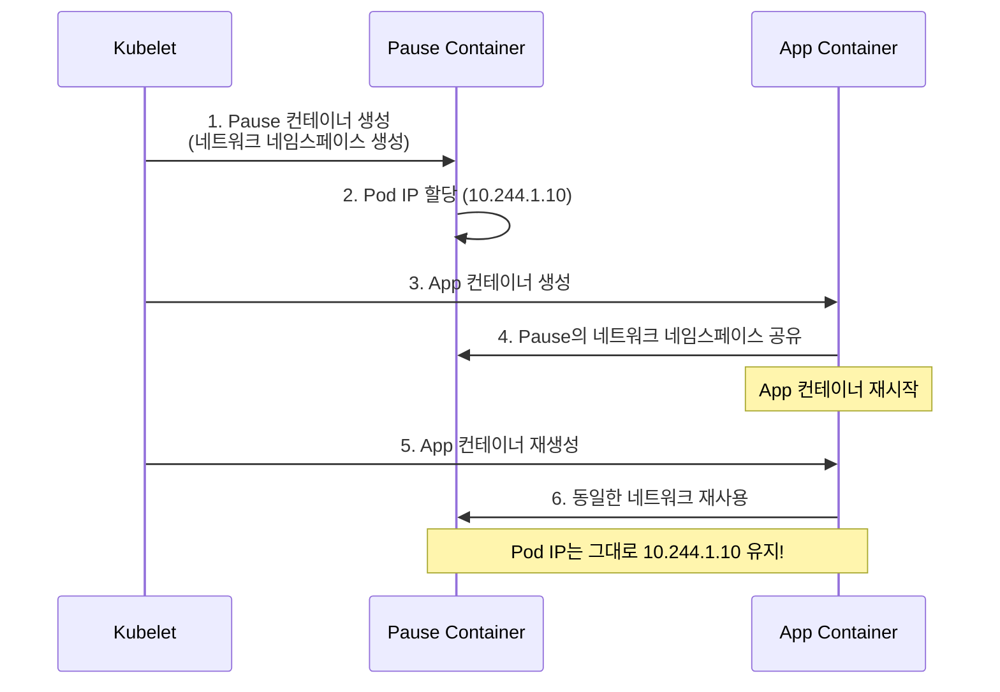
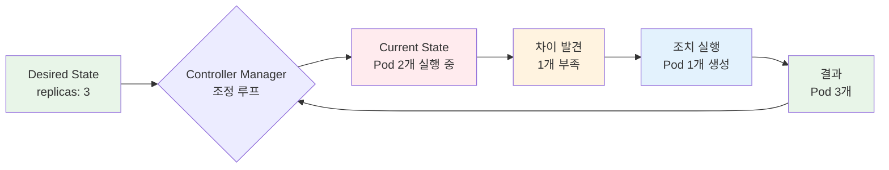
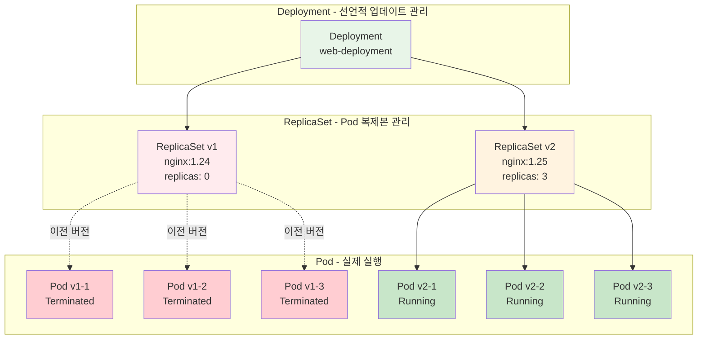
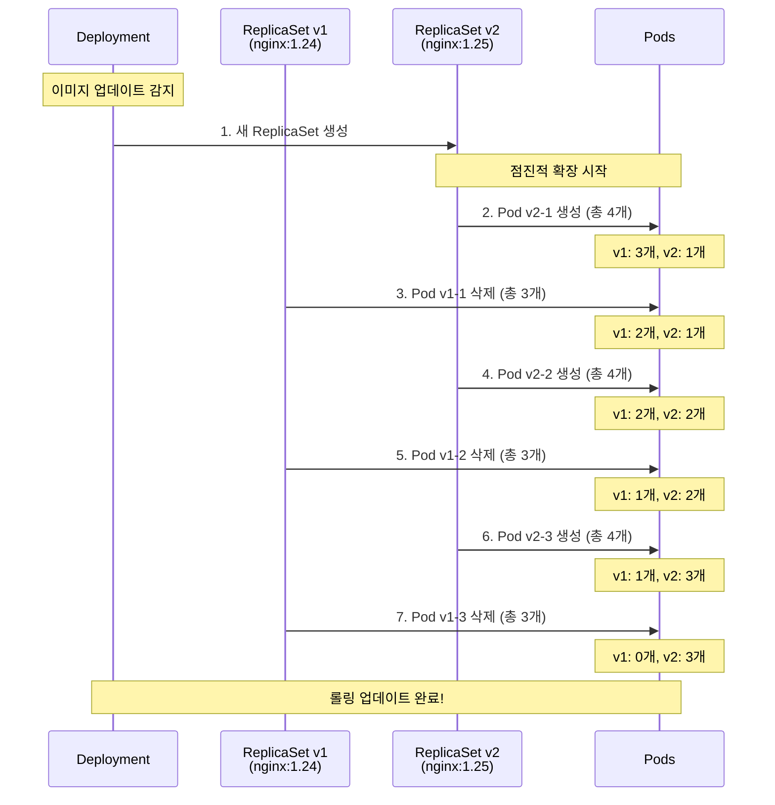
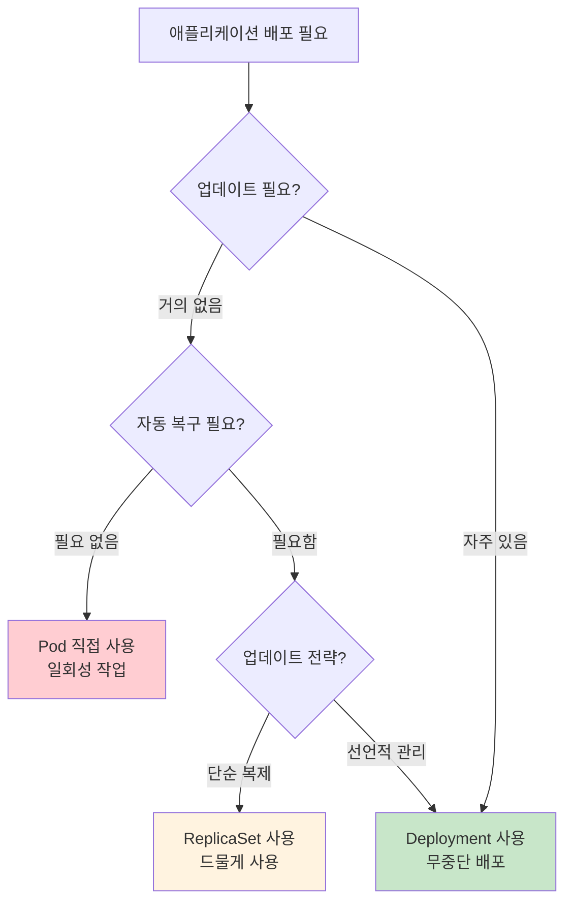

# Week 3.5 Day 1 Session 1: Pod vs Container vs Deployment 완전 정복

<div align="center">

**🐳 Docker vs Kubernetes** • **📦 Pod 설계 철학** • **🔄 계층 구조** • **🚀 Rolling Update**

*"왜 컨테이너가 아닌 Pod인가?" - 이 질문에 명확히 답할 수 있게 됩니다*

</div>

---

## 🕘 세션 정보

**시간**: 09:00-09:50 (50분)
**난이도**: Beginner
**실습 환경**: Kind 클러스터 (로컬)

---

## ⚠️ 사전 준비 필수!

**실습 환경이 준비되지 않았다면 먼저 설정하세요:**

### 📋 [실습 환경 설정 가이드 바로가기](../../requirements.md)

다음 항목들이 모두 완료되어야 합니다:
- [ ] Docker 설치 및 실행
- [ ] kubectl 설치
- [ ] Kind 설치
- [ ] Kind 클러스터 생성 (`kind create cluster --name k8s-lab`)
- [ ] 클러스터 동작 확인 (`kubectl get nodes`)

**5분 안에 환경이 준비되지 않으면 → [requirements.md](../../requirements.md) 참조!**

---

### 📚 학습 목표

이 세션을 마치면 다음을 할 수 있습니다:
- [ ] Docker 컨테이너와 Kubernetes Pod의 차이를 명확히 설명할 수 있다
- [ ] Pause 컨테이너의 역할과 필요성을 이해한다
- [ ] Pod → ReplicaSet → Deployment의 3단계 계층 구조를 그릴 수 있다
- [ ] ReplicaSet이 Pod를 자동으로 복구하는 원리를 설명할 수 있다
- [ ] Rolling Update가 무중단 배포를 보장하는 과정을 단계별로 설명할 수 있다
- [ ] 상황에 맞는 적절한 워크로드 타입을 선택할 수 있다

### 🎯 해결하는 질문들

- ❓ "Docker로 컨테이너 실행하면 되는데 왜 Pod가 필요한가요?"
- ❓ "Deployment랑 ReplicaSet이 뭐가 다른가요?"
- ❓ "Pod 안에 여러 컨테이너를 넣으면 어떤 이점이 있나요?"
- ❓ "Rolling Update가 정확히 뭐고 어떻게 무중단 배포가 되나요?"
- ❓ "Pause 컨테이너는 뭐고 왜 자동으로 생성되나요?"
- ❓ "replicas를 3개로 설정하면 정확히 어떤 일이 일어나나요?"

---

## 📖 Part 1: 왜 Pod인가? Docker와의 차이 (15분)

### 🤔 문제 상황

**학생의 질문**: "Docker로 `docker run nginx` 하면 되는데, Kubernetes는 왜 Pod라는 개념을 만들었나요?"

### 🐳 Docker의 한계

Docker는 **단일 서버**에서 **개별 컨테이너**를 관리합니다:

```bash
# Docker 방식
docker run -d --name web nginx
docker run -d --name db mysql
docker run -d --name cache redis

# 문제점:
# 1. 각 컨테이너가 독립적 → 긴밀한 협력 어려움
# 2. 네트워크 설정 복잡 (--link deprecated)
# 3. 볼륨 공유 수동 설정
# 4. 재시작/스케일링 수동 관리
# 5. 단일 서버 한계
```

### 📦 Pod의 설계 철학

Kubernetes는 **"긴밀하게 결합된 프로세스 그룹"**을 하나의 단위로 관리합니다.



### 🔍 Pod의 4가지 핵심 특징

#### 1. 네트워크 공유 (같은 IP, 같은 포트 공간)

```yaml
# multi-container-pod.yaml
apiVersion: v1
kind: Pod
metadata:
  name: shared-network-demo
spec:
  containers:
  - name: nginx
    image: nginx:1.25.3
    ports:
    - containerPort: 80  # nginx는 80번 포트

  - name: app
    image: myapp:1.0
    ports:
    - containerPort: 8080  # app은 8080번 포트
```

**핵심**:
- 두 컨테이너는 **같은 IP 주소** 사용
- 서로 `localhost:포트`로 통신 가능
- `nginx`에서 `curl localhost:8080` → `app` 접근 가능

#### 2. 스토리지 공유 (볼륨을 여러 컨테이너가 공유)

```yaml
# 실습 파일: labs/02-multi-container-pod.yaml
apiVersion: v1
kind: Pod
metadata:
  name: multi-pod
spec:
  containers:
  - name: main-app
    image: nginx:1.25.3
    volumeMounts:
    - name: logs
      mountPath: /var/log/nginx  # nginx 로그 기록

  - name: log-viewer
    image: busybox:1.36
    command: ['sh', '-c', 'tail -f /var/log/nginx/access.log']
    volumeMounts:
    - name: logs
      mountPath: /var/log/nginx  # 같은 로그 읽기

  volumes:
  - name: logs
    emptyDir: {}  # Pod 내 임시 저장소
```

**핵심**:
- `main-app`이 로그 파일 생성
- `log-viewer`가 실시간으로 같은 파일 읽음
- 볼륨을 통한 **파일 기반 통신** 가능

#### 3. 생명주기 공유 (함께 생성, 함께 삭제)

```bash
# Pod 생성 시
kubectl apply -f multi-pod.yaml
# → 모든 컨테이너가 동시에 생성

# Pod 삭제 시
kubectl delete pod multi-pod
# → 모든 컨테이너가 동시에 삭제
```

#### 4. Pause 컨테이너 - 숨은 조력자

**학생의 질문**: "Pause 컨테이너는 뭐고 왜 필요한가요?"

```bash
# Kind 클러스터에서 확인
docker exec k8s-lab-control-plane crictl ps

# 출력 예시:
# CONTAINER ID   IMAGE           ...   NAMES
# abc123         nginx:1.25.3    ...   nginx
# def456         pause:3.9       ...   POD
```

**Pause 컨테이너의 역할**:
1. **네트워크 네임스페이스 유지**: Pod의 IP 주소를 소유
2. **초경량**: 단 몇 KB, 거의 리소스 사용 안 함
3. **앵커 역할**: 애플리케이션 컨테이너가 재시작되어도 네트워크 유지



### 🚀 실습 1: Docker vs Pod 비교 (8분)

#### Step 1: Docker로 컨테이너 실행

```bash
# Docker로 nginx 실행
docker run -d --name my-nginx nginx:1.25.3

# 확인
docker ps
docker inspect my-nginx | grep IPAddress
```

#### Step 2: Kubernetes로 Pod 실행

```bash
# Pod 생성
kubectl run my-pod --image=nginx:1.25.3

# 확인
kubectl get pods
kubectl get pods -o wide  # IP 주소 확인
kubectl describe pod my-pod

# Pause 컨테이너 확인
docker exec k8s-lab-control-plane crictl pods
```

#### Step 3: 멀티 컨테이너 Pod 실습

```bash
# 실습 파일 적용
kubectl apply -f labs/02-multi-container-pod.yaml

# Pod 상태 확인
kubectl get pods

# 각 컨테이너 로그 확인
kubectl logs multi-pod -c main-app
kubectl logs multi-pod -c log-viewer

# Pod 내부로 접근하여 네트워크 공유 확인
kubectl exec -it multi-pod -c main-app -- curl localhost:80

# 정리
kubectl delete pod multi-pod
```

### ✅ Part 1 체크포인트

- [ ] Docker 컨테이너는 개별 관리, Pod는 그룹 관리임을 이해했다
- [ ] Pod 내 컨테이너들이 네트워크와 볼륨을 공유함을 확인했다
- [ ] Pause 컨테이너가 네트워크 네임스페이스를 유지함을 알았다
- [ ] 멀티 컨테이너 Pod로 사이드카 패턴을 실습했다

---

## 📖 Part 2: ReplicaSet - Pod 복제본 관리자 (12분)

### 🤔 문제 상황

**학생의 질문**: "Pod 1개만 있으면 죽으면 어떻게 되나요? 자동으로 다시 살아나나요?"

**답변**: **아니요!** Pod를 직접 생성하면 죽었을 때 자동 복구 안 됩니다.

```bash
# Pod 직접 생성
kubectl run test-pod --image=nginx:1.25.3

# Pod 강제 삭제
kubectl delete pod test-pod

# → 사라짐! 자동 복구 안 됨
kubectl get pods  # No resources found
```

### 🔄 ReplicaSet의 역할

ReplicaSet은 **"원하는 수의 Pod가 항상 실행되도록 보장"**합니다.



### 🔍 ReplicaSet 동작 원리 - 3단계

#### 1. Desired State (원하는 상태 선언)

```yaml
# labs/03-replicaset.yaml
apiVersion: apps/v1
kind: ReplicaSet
metadata:
  name: web-rs
spec:
  replicas: 3  # 원하는 Pod 개수
  selector:
    matchLabels:
      app: web
      tier: frontend
  template:  # Pod 템플릿
    metadata:
      labels:
        app: web
        tier: frontend
    spec:
      containers:
      - name: nginx
        image: nginx:1.25.3
```

#### 2. Current State (현재 상태 확인)

ReplicaSet Controller가 지속적으로 확인:

```bash
# Controller Manager가 실행하는 로직 (의사 코드)
while true; do
  current_pods=$(kubectl get pods -l app=web,tier=frontend --no-headers | wc -l)
  desired_pods=3

  if [ $current_pods -lt $desired_pods ]; then
    # Pod 생성
    create_pod_from_template
  elif [ $current_pods -gt $desired_pods ]; then
    # 초과 Pod 삭제
    delete_extra_pod
  fi

  sleep 5  # 5초마다 확인
done
```

#### 3. Reconciliation (조정)

**시나리오 1: Pod 부족**
```
Desired: 3개
Current: 2개
Action:  Pod 1개 생성 → 3개로 맞춤
```

**시나리오 2: Pod 초과**
```
Desired: 3개
Current: 5개
Action:  Pod 2개 삭제 → 3개로 맞춤
```

**시나리오 3: Pod 장애**
```
Desired: 3개
Current: 3개 (그 중 1개 Crashed)
Action:  새 Pod 1개 생성 → Crashed Pod 교체
```

### 🚀 실습 2: ReplicaSet 자동 복구 체험 (7분)

#### Step 1: ReplicaSet 생성 및 확인

```bash
# ReplicaSet 생성
kubectl apply -f labs/03-replicaset.yaml

# 상태 확인
kubectl get rs
# NAME     DESIRED   CURRENT   READY   AGE
# web-rs   3         3         3       10s

kubectl get pods
# NAME           READY   STATUS    RESTARTS   AGE
# web-rs-abc12   1/1     Running   0          10s
# web-rs-def34   1/1     Running   0          10s
# web-rs-ghi56   1/1     Running   0          10s

# 라벨 확인
kubectl get pods --show-labels
```

#### Step 2: 자동 복구 테스트 (2개 터미널 사용)

**터미널 1: 실시간 모니터링**
```bash
# Pod 상태 실시간 관찰
kubectl get pods -w
```

**터미널 2: Pod 삭제**
```bash
# Pod 1개 강제 삭제
kubectl delete pod web-rs-abc12

# → 터미널 1에서 즉시 새 Pod 생성되는 것 관찰!
# web-rs-abc12   1/1   Terminating   0     20s
# web-rs-xyz99   0/1   Pending       0     0s
# web-rs-xyz99   0/1   ContainerCreating   0     0s
# web-rs-xyz99   1/1   Running       0     2s
```

#### Step 3: 스케일링

```bash
# replicas 증가
kubectl scale rs web-rs --replicas=5

# 확인
kubectl get rs
# NAME     DESIRED   CURRENT   READY   AGE
# web-rs   5         5         5       1m

kubectl get pods
# → 5개로 증가 확인

# replicas 감소
kubectl scale rs web-rs --replicas=2

kubectl get pods
# → 3개 Pod가 Terminating 상태로 삭제됨
```

#### Step 4: Label Selector 테스트

```bash
# 현재 Pod 확인
kubectl get pods --show-labels

# Pod 라벨 수동 변경 (실험)
kubectl label pod web-rs-abc12 tier=backend --overwrite

# ReplicaSet 확인
kubectl get rs
# DESIRED   CURRENT   READY
# 2         3         2

# → ReplicaSet이 라벨이 변경된 Pod를 관리 대상에서 제외
# → 새 Pod 1개 생성하여 2개 유지

# 라벨 복구
kubectl label pod web-rs-abc12 tier=frontend --overwrite

# → ReplicaSet이 Pod 초과 감지
# → 1개 Pod 삭제하여 2개 유지
```

### ✅ Part 2 체크포인트

- [ ] ReplicaSet이 desired state를 유지함을 이해했다
- [ ] Pod를 삭제해도 자동으로 재생성됨을 확인했다
- [ ] `kubectl scale`로 Pod 개수 조정을 실습했다
- [ ] Label Selector로 Pod를 선택함을 알았다

---

## 📖 Part 3: Deployment - 무중단 배포의 마법 (18분)

### 🤔 문제 상황

**학생의 질문**: "ReplicaSet으로 Pod 관리는 알겠는데, 애플리케이션 업데이트는 어떻게 하나요? 서비스 중단 없이 가능한가요?"

### 🚀 Deployment의 계층 구조



**핵심 이해**:
- **Deployment**: 업데이트 전략 관리
- **ReplicaSet**: 각 버전의 Pod 복제본 관리
- **Pod**: 실제 애플리케이션 실행

### 🔄 Rolling Update 과정 - 5단계

#### 전제 조건
- 현재: nginx:1.24 (3개 Pod)
- 목표: nginx:1.25 (3개 Pod)
- 전략: maxUnavailable=1, maxSurge=1



#### 단계별 상세 설명

**Step 1: 새 ReplicaSet 생성**
```yaml
# Deployment Controller가 자동으로 생성
ReplicaSet v1:
  replicas: 3
  image: nginx:1.24

ReplicaSet v2:
  replicas: 0  # 처음엔 0개로 시작
  image: nginx:1.25
```

**Step 2-7: 점진적 교체**
```
maxUnavailable: 1  # 최대 1개까지 중단 허용
maxSurge: 1        # 최대 1개까지 추가 생성 허용

총 Pod 수 범위: 2개 ~ 4개
(3 - maxUnavailable) ~ (3 + maxSurge)
```

### 🎯 Rolling Update 전략 비교

#### Recreate (모두 삭제 후 재생성)

```yaml
spec:
  strategy:
    type: Recreate
```

**과정**:
1. 기존 Pod 3개 모두 삭제
2. 새 Pod 3개 생성

**장점**: 간단, 리소스 절약
**단점**: **다운타임 발생** (서비스 중단)
**사용**: 개발/테스트 환경

#### RollingUpdate (점진적 교체)

```yaml
spec:
  strategy:
    type: RollingUpdate
    rollingUpdate:
      maxUnavailable: 1
      maxSurge: 1
```

**과정**: 위에서 설명한 점진적 교체
**장점**: **무중단 배포** (Zero Downtime)
**단점**: 리소스 2배 필요 (일시적)
**사용**: 프로덕션 환경

### 🚀 실습 3: Rolling Update 체험 (10분)

#### Step 1: Deployment 생성

```bash
# Deployment 생성 (nginx:1.24)
kubectl apply -f labs/04-deployment-v1.yaml

# 상태 확인
kubectl get deployments
# NAME              READY   UP-TO-DATE   AVAILABLE   AGE
# web-deployment    3/3     3            3           10s

kubectl get rs
# NAME                        DESIRED   CURRENT   READY   AGE
# web-deployment-abc123       3         3         3       10s

kubectl get pods
# NAME                              READY   STATUS    RESTARTS   AGE
# web-deployment-abc123-pod1        1/1     Running   0          10s
# web-deployment-abc123-pod2        1/1     Running   0          10s
# web-deployment-abc123-pod3        1/1     Running   0          10s
```

#### Step 2: 3개 터미널로 Rolling Update 관찰

**터미널 1: Deployment 모니터링**
```bash
kubectl get deployments -w
```

**터미널 2: ReplicaSet 모니터링**
```bash
kubectl get rs -w
```

**터미널 3: Pod 모니터링**
```bash
kubectl get pods -w --show-labels
```

#### Step 3: 이미지 업데이트 (Rolling Update 시작!)

**터미널 4 (새 터미널):**
```bash
# 이미지 업데이트
kubectl set image deployment/web-deployment nginx=nginx:1.25

# → 터미널 1,2,3에서 실시간 변화 관찰!
# - 새 ReplicaSet 생성
# - Pod 점진적 교체
# - 기존 ReplicaSet replicas: 0
```

#### Step 4: Rollout 상태 확인

```bash
# Rollout 진행 상황
kubectl rollout status deployment/web-deployment
# Waiting for deployment "web-deployment" rollout to finish: 1 out of 3 new replicas have been updated...
# Waiting for deployment "web-deployment" rollout to finish: 2 out of 3 new replicas have been updated...
# deployment "web-deployment" successfully rolled out

# Rollout 히스토리
kubectl rollout history deployment/web-deployment
# REVISION  CHANGE-CAUSE
# 1         <none>
# 2         <none>

# 특정 Revision 상세 정보
kubectl rollout history deployment/web-deployment --revision=2
```

#### Step 5: 롤백 테스트

```bash
# 이전 버전으로 롤백
kubectl rollout undo deployment/web-deployment

# 특정 Revision으로 롤백
kubectl rollout undo deployment/web-deployment --to-revision=1

# 롤백 상태 확인
kubectl rollout status deployment/web-deployment

# 현재 이미지 버전 확인
kubectl get deployment web-deployment -o jsonpath='{.spec.template.spec.containers[0].image}'
```

#### Step 6: 계층 구조 확인

```bash
# 모든 리소스 확인
kubectl get all

# Deployment 상세 정보
kubectl describe deployment web-deployment

# ReplicaSet 목록 (2개 이상 존재)
kubectl get rs
# NAME                        DESIRED   CURRENT   READY   AGE
# web-deployment-abc123       0         0         0       5m  (이전 버전)
# web-deployment-def456       3         3         3       2m  (현재 버전)

# Pod 소유자 확인
kubectl get pods -o jsonpath='{range .items[*]}{.metadata.name}{"\t"}{.metadata.ownerReferences[0].name}{"\n"}{end}'
```

### ✅ Part 3 체크포인트

- [ ] Deployment가 여러 ReplicaSet을 관리함을 이해했다
- [ ] Rolling Update가 점진적으로 Pod를 교체함을 관찰했다
- [ ] maxUnavailable과 maxSurge의 역할을 알았다
- [ ] `kubectl rollout undo`로 롤백을 실습했다
- [ ] Deployment → ReplicaSet → Pod 계층 구조를 확인했다

---

## 📖 Part 4: 언제 무엇을 사용할까? (5분)

### 🎯 의사결정 가이드



### 📊 사용 시나리오 비교

| 리소스 | 사용 시나리오 | 장점 | 단점 | 권장도 |
|--------|--------------|------|------|---------|
| **Pod** | 일회성 작업, 디버깅 | 간단 | 자동 복구 X | ⭐ |
| **ReplicaSet** | 단순 복제 (거의 안 씀) | Pod 자동 복구 | 업데이트 수동 | ⭐⭐ |
| **Deployment** | 프로덕션 애플리케이션 | 무중단 배포, 롤백 | 약간 복잡 | ⭐⭐⭐⭐⭐ |

### 💡 실무 권장 사항

#### ✅ DO (권장)

```bash
# 1. 프로덕션: 항상 Deployment 사용
kubectl create deployment web --image=nginx:1.25.3 --replicas=3

# 2. 리소스 제한 설정
spec:
  containers:
  - name: nginx
    resources:
      requests:
        cpu: 100m
        memory: 128Mi
      limits:
        cpu: 500m
        memory: 512Mi

# 3. Health Probe 설정
spec:
  containers:
  - name: nginx
    readinessProbe:
      httpGet:
        path: /health
        port: 80
    livenessProbe:
      httpGet:
        path: /health
        port: 80
```

#### ❌ DON'T (비권장)

```bash
# 1. 프로덕션에서 Pod 직접 사용 금지
kubectl run web --image=nginx  # ❌ 자동 복구 안 됨

# 2. latest 태그 사용 금지
image: nginx:latest  # ❌ 버전 관리 안 됨

# 3. ReplicaSet의 replicas 직접 수정 금지
kubectl scale rs web-rs --replicas=5  # ❌ Deployment가 되돌림

# 4. 리소스 제한 없이 배포 금지
# ❌ OOMKilled 위험
```

---

## 🔧 트러블슈팅 가이드

### 문제 1: ImagePullBackOff

**증상**:
```bash
kubectl get pods
# NAME        READY   STATUS             RESTARTS   AGE
# web-pod     0/1     ImagePullBackOff   0          1m
```

**원인**: 이미지 이름 오타 또는 레지스트리 접근 불가

**해결**:
```bash
# 1. Pod 상세 정보 확인
kubectl describe pod web-pod
# Events:
#   Failed to pull image "ngin:1.25.3": rpc error: code = Unknown desc = Error response from daemon: pull access denied for ngin

# 2. 이미지 이름 수정
kubectl edit deployment web-deployment
# image: nginx:1.25.3  (오타 수정)

# 3. Docker에서 이미지 pull 테스트
docker pull nginx:1.25.3

# 4. Kind 클러스터로 이미지 로드 (오프라인)
kind load docker-image nginx:1.25.3 --name k8s-lab
```

---

### 문제 2: CrashLoopBackOff

**증상**:
```bash
kubectl get pods
# NAME        READY   STATUS              RESTARTS   AGE
# app-pod     0/1     CrashLoopBackOff    5          3m
```

**원인**: 컨테이너 실행 중 에러 발생

**해결**:
```bash
# 1. 로그 확인
kubectl logs app-pod

# 2. 이전 컨테이너 로그 확인
kubectl logs app-pod --previous

# 3. 컨테이너 내부 접속하여 디버깅
kubectl exec -it app-pod -- /bin/sh

# 4. 이벤트 확인
kubectl describe pod app-pod
```

---

### 문제 3: Pending 상태

**증상**:
```bash
kubectl get pods
# NAME        READY   STATUS    RESTARTS   AGE
# web-pod     0/1     Pending   0          2m
```

**원인**: 리소스 부족 또는 스케줄링 불가

**해결**:
```bash
# 1. Pod 이벤트 확인
kubectl describe pod web-pod
# Events:
#   Warning  FailedScheduling  2m  default-scheduler  0/1 nodes are available: 1 Insufficient memory.

# 2. 노드 리소스 확인
kubectl top nodes
kubectl describe nodes

# 3. 리소스 요청 조정
spec:
  containers:
  - name: nginx
    resources:
      requests:
        memory: "64Mi"  # 줄임
```

---

### 문제 4: Deployment 업데이트 안 됨

**증상**:
```bash
kubectl set image deployment/web nginx=nginx:1.26
# 하지만 Pod가 변경되지 않음
```

**원인**: 컨테이너 이름 오타 또는 imagePullPolicy

**해결**:
```bash
# 1. 컨테이너 이름 확인
kubectl get deployment web -o jsonpath='{.spec.template.spec.containers[*].name}'

# 2. 올바른 컨테이너 이름으로 업데이트
kubectl set image deployment/web nginx=nginx:1.26

# 3. imagePullPolicy 확인
spec:
  containers:
  - name: nginx
    imagePullPolicy: Always  # 또는 IfNotPresent

# 4. Deployment 강제 재시작
kubectl rollout restart deployment/web
```

---

## 📝 세션 마무리

### ✅ 오늘 배운 내용

1. **Pod의 설계 철학**
   - Docker는 개별 컨테이너, Kubernetes는 긴밀한 그룹 관리
   - 네트워크/스토리지/생명주기 공유
   - Pause 컨테이너의 역할

2. **ReplicaSet의 자동 복구**
   - Desired State vs Current State
   - Reconciliation Loop
   - Label Selector로 Pod 선택

3. **Deployment의 무중단 배포**
   - Deployment → ReplicaSet → Pod 계층 구조
   - Rolling Update의 점진적 교체
   - 롤백 기능

4. **실무 사용 가이드**
   - 프로덕션: 항상 Deployment 사용
   - 리소스 제한 및 Health Probe 설정
   - 트러블슈팅 방법

### 🎯 학습 목표 달성 확인

- [ ] Docker 컨테이너와 Kubernetes Pod의 차이를 설명할 수 있다
- [ ] Pause 컨테이너의 역할을 이해했다
- [ ] Pod → ReplicaSet → Deployment 계층 구조를 그릴 수 있다
- [ ] ReplicaSet의 자동 복구 원리를 설명할 수 있다
- [ ] Rolling Update의 무중단 배포 과정을 이해했다
- [ ] 상황에 맞는 워크로드 타입을 선택할 수 있다

### 📚 다음 세션 준비

**Session 2: ETCD와 클러스터 상태 관리**
- ETCD가 무엇이고 왜 필요한지
- Raft 알고리즘의 분산 합의
- 클러스터 상태 저장 메커니즘
- 실습: ETCD에 직접 데이터 저장/조회

---

## 🔗 참고 자료

### 공식 문서
- [Kubernetes Pods](https://kubernetes.io/docs/concepts/workloads/pods/)
- [ReplicaSet](https://kubernetes.io/docs/concepts/workloads/controllers/replicaset/)
- [Deployment](https://kubernetes.io/docs/concepts/workloads/controllers/deployment/)

### 실습 파일 위치
```
week_03_supplement/day1/session1/labs/
├── 01-single-container-pod.yaml
├── 02-multi-container-pod.yaml
├── 03-replicaset.yaml
├── 04-deployment-v1.yaml
└── README.md
```

---

<div align="center">

**🎉 Session 1 완료!**

*Pod, ReplicaSet, Deployment의 관계를 완전히 이해했습니다!*

**다음**: [Session 2 - ETCD와 클러스터 상태 관리](../session2/session2.md)

</div>
