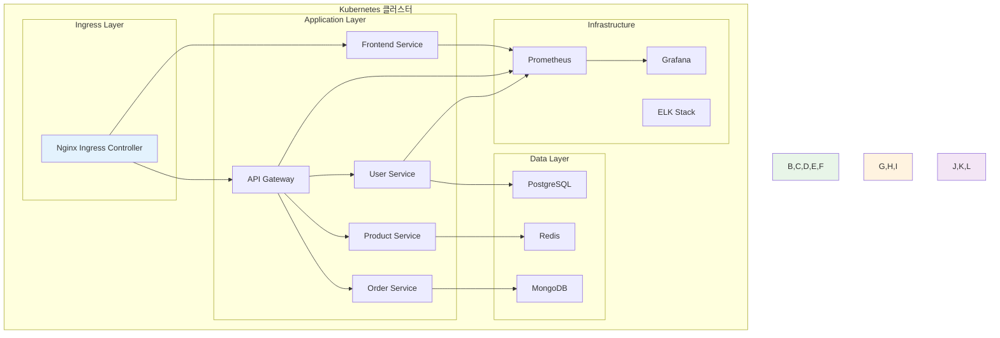

# Week 4: Kubernetes 운영과 관리

**☸️ Kubernetes 실무 운영** • **🏗️ 클러스터 관리** • **📊 워크로드 운영**

*Kubernetes 클러스터 구축부터 실무 운영까지, 완전한 K8s 전문가 되기*

---

## 🎯 주간 학습 목표 (5일 구성)

### 📚 전체 공통 목표
> **Kubernetes 클러스터를 직접 구축하고 운영하며, 실무에서 바로 활용할 수 있는 K8s 전문 역량을 완성한다**

### 🎪 협업 중심 학습
- **모든 학생 함께**: Kubernetes의 복잡성을 팀워크로 극복
- **자연스러운 역할 분담**: 클러스터 운영의 다양한 역할 체험
- **상호 학습**: 복잡한 K8s 개념을 서로 설명하며 이해도 향상
- **실무 연계**: 실제 운영 환경과 동일한 시나리오 기반 학습

---

## 📅 일일 학습 계획 (5일 구성)

### [Day 1: 클러스터 설치와 구성](./day1/README.md)
**🎯 목표**: Kubernetes 클러스터 직접 구축 및 기본 설정 완료

#### 📚 이론 강의 (2.5시간)
- **Session 1**: Kubernetes 설치 방법론과 도구 비교
- **Session 2**: kubeadm을 활용한 클러스터 구축
- **Session 3**: 클러스터 네트워킹과 CNI 설정

#### 🛠️ 실습 챌린지 (3시간)
- **Phase 1**: 멀티 노드 클러스터 구축
- **Phase 2**: 네트워크 플러그인 설치 및 설정
- **Phase 3**: 클러스터 상태 검증 및 문제 해결

---

### [Day 2: 워크로드 관리](./day2/README.md)
**🎯 목표**: Kubernetes 워크로드 패턴 완전 이해 및 실무 활용

#### 📚 이론 강의 (2.5시간)
- **Session 1**: Deployment와 ReplicaSet 심화
- **Session 2**: StatefulSet과 상태 관리
- **Session 3**: DaemonSet과 Job/CronJob 활용

#### 🛠️ 실습 챌린지 (3시간)
- **Phase 1**: 다양한 워크로드 패턴 배포
- **Phase 2**: 롤링 업데이트와 롤백 실습
- **Phase 3**: 상태 관리 애플리케이션 구축

---

### [Day 3: 네트워킹과 서비스](./day3/README.md)
**🎯 목표**: Kubernetes 네트워킹 완전 마스터 및 서비스 메시 기초

#### 📚 이론 강의 (2.5시간)
- **Session 1**: Service 타입별 특징과 활용
- **Session 2**: Ingress와 외부 트래픽 관리
- **Session 3**: NetworkPolicy와 보안

#### 🛠️ 실습 챌린지 (3시간)
- **Phase 1**: 다양한 Service 타입 구성
- **Phase 2**: Ingress Controller 설치 및 설정
- **Phase 3**: 네트워크 보안 정책 적용

---

### [Day 4: 스토리지와 설정 관리](./day4/README.md)
**🎯 목표**: 영속적 스토리지와 애플리케이션 설정 관리 전문성 확보

#### 📚 이론 강의 (2.5시간)
- **Session 1**: PV, PVC, StorageClass 이해
- **Session 2**: ConfigMap과 Secret 활용
- **Session 3**: 동적 프로비저닝과 스토리지 최적화

#### 🛠️ 실습 챌린지 (3시간)
- **Phase 1**: 다양한 스토리지 타입 구성
- **Phase 2**: 설정과 시크릿 관리 실습
- **Phase 3**: 데이터베이스 워크로드 구축

---

### [Day 5: 모니터링과 트러블슈팅](./day5/README.md)
**🎯 목표**: Kubernetes 운영 모니터링과 문제 해결 전문가 되기

#### 📚 이론 강의 (2.5시간)
- **Session 1**: Kubernetes 모니터링 아키텍처
- **Session 2**: Prometheus와 Grafana 통합
- **Session 3**: 로깅과 트러블슈팅 방법론

#### 🛠️ 실습 챌린지 (3시간)
- **Phase 1**: 모니터링 스택 구축
- **Phase 2**: 커스텀 메트릭과 알림 설정
- **Phase 3**: 장애 시나리오 대응 실습

---

## 🛠️ 주간 통합 프로젝트

### 🎯 프로젝트 목표
**"완전한 Kubernetes 기반 마이크로서비스 플랫폼 구축"**
- 멀티 노드 클러스터에서 운영되는 실무급 애플리케이션
- 모니터링, 로깅, 보안이 통합된 운영 환경
- CI/CD 파이프라인과 연동 준비 완료

### 📋 프로젝트 요구사항
1. **클러스터**: 3노드 이상 HA 구성
2. **워크로드**: 마이크로서비스 아키텍처 (5개 이상 서비스)
3. **네트워킹**: Ingress 기반 외부 접근, 내부 서비스 메시
4. **스토리지**: 영속적 데이터 관리 (DB, 파일 저장소)
5. **모니터링**: Prometheus + Grafana 통합 대시보드
6. **보안**: RBAC, NetworkPolicy, Pod Security Standards

### 🏗️ 아키텍처 예시

---

## 📊 주간 평가 기준

### ✅ 이해도 평가
- **클러스터 운영**: 설치, 구성, 관리 능력
- **워크로드 관리**: 다양한 패턴의 애플리케이션 배포
- **네트워킹**: 서비스 간 통신과 외부 접근 관리
- **스토리지**: 영속적 데이터 관리와 백업
- **모니터링**: 운영 상태 감시와 문제 진단

### 🎯 성공 지표
- **클러스터 구축**: 3노드 이상 안정적 클러스터 구성
- **애플리케이션 배포**: 5개 이상 마이크로서비스 성공적 배포
- **모니터링**: 실시간 메트릭 수집과 알림 시스템 구축
- **문제 해결**: 일반적인 K8s 문제 상황 독립적 해결
- **팀 협업**: 복잡한 시스템을 팀으로 구축하고 운영

### 📋 평가 체크리스트
- [ ] kubeadm으로 멀티 노드 클러스터 구축 완료
- [ ] 다양한 워크로드 패턴 (Deployment, StatefulSet, DaemonSet) 활용
- [ ] Ingress를 통한 외부 트래픽 관리 구현
- [ ] PV/PVC를 활용한 영속적 스토리지 구성
- [ ] Prometheus + Grafana 모니터링 시스템 구축
- [ ] RBAC과 NetworkPolicy 보안 정책 적용
- [ ] 팀 프로젝트에서 K8s 전문가 역할 수행

---

## 🤝 협업 학습 하이라이트

### 🌟 Kubernetes 복잡성을 팀워크로 극복
- **클러스터 운영팀**: 인프라 구축과 관리 전담
- **애플리케이션팀**: 워크로드 배포와 관리
- **네트워킹팀**: 서비스 간 통신과 보안 설정
- **모니터링팀**: 관측성과 문제 진단 시스템

### 🔄 자연스러운 전문성 발현
- **인프라 전문가**: 클러스터 아키텍처와 운영에 특화
- **애플리케이션 전문가**: 워크로드 패턴과 배포 전략
- **네트워크 전문가**: K8s 네트워킹과 보안 정책
- **운영 전문가**: 모니터링과 트러블슈팅

### 🎯 실무 시나리오 기반 학습
- **장애 대응**: 실제 장애 상황 시뮬레이션과 팀 대응
- **성능 최적화**: 리소스 사용량 분석과 최적화
- **보안 강화**: 보안 정책 수립과 적용
- **운영 자동화**: 반복 작업의 자동화 구현

---

## 🔗 다음 주 연결

### 🚀 Week 5 준비사항
- Kubernetes 클러스터 운영 경험 정리
- CI/CD 파이프라인 기초 개념 학습
- 클라우드 네이티브 아키텍처 패턴 이해

### 📚 추천 학습 자료
- [Kubernetes 공식 문서](https://kubernetes.io/docs/)
- [CNCF Landscape](https://landscape.cncf.io/)
- [Kubernetes the Hard Way](https://github.com/kelseyhightower/kubernetes-the-hard-way)

### 🎯 심화 학습 주제 (개인별 관심사에 따라)
- **클러스터 운영**: 멀티 클러스터 관리, 클러스터 업그레이드
- **보안 강화**: Pod Security Standards, OPA Gatekeeper
- **성능 최적화**: 리소스 관리, 오토스케일링
- **고급 네트워킹**: 서비스 메시, 멀티 클러스터 네트워킹

---

## 📝 주간 회고

### 🤔 회고 질문
1. Kubernetes의 복잡성을 어떻게 극복했나요?
2. 팀 협업을 통해 어떤 새로운 관점을 얻었나요?
3. 실무에서 가장 유용할 것 같은 K8s 기능은?
4. 앞으로 어떤 K8s 전문 영역을 더 깊이 학습하고 싶나요?

### 📈 개선 포인트
- Kubernetes 개념의 복잡성 관리 방법
- 팀 협업에서의 역할 분담과 소통
- 실습 환경에서의 문제 해결 과정
- 이론과 실무 적용 간의 격차 해소

### 🎉 성취 사항
- Kubernetes 클러스터 직접 구축 및 운영 경험
- 복잡한 마이크로서비스 아키텍처 구현
- 팀워크를 통한 대규모 시스템 구축
- 실무 수준의 K8s 운영 역량 확보

---

**☸️ Kubernetes 마스터** • **🏗️ 클러스터 운영 전문가** • **🤝 팀워크 시너지**

*Week 4를 통해 Kubernetes 전문가로서의 핵심 역량을 완성했습니다*

**이전 주**: [Week 2 - Docker 심화 & K8s 준비](../week_02/README.md) | **다음 주**: [Week 5 - 클라우드 네이티브 & CI/CD](../week_05/README.md)

