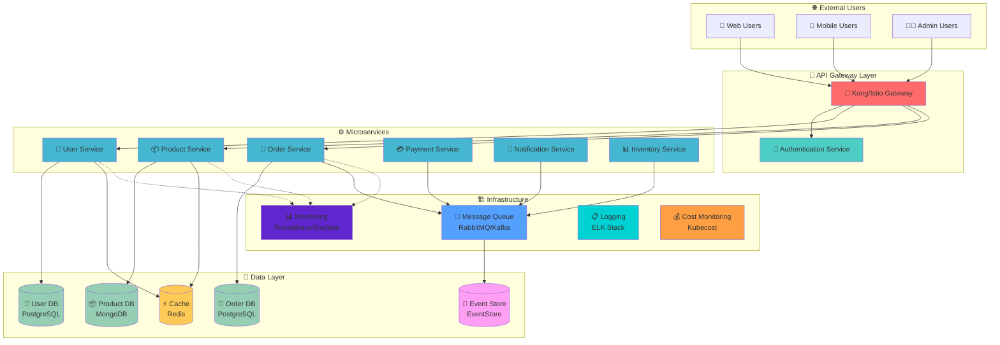
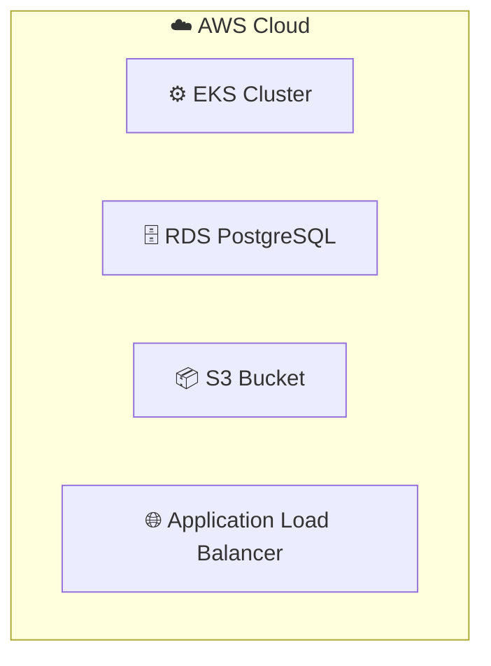

# Week 4: 클라우드 네이티브 아키텍처

**🏗️ 마이크로서비스** • **🌐 API Gateway** • **💾 데이터 관리** • **🔒 보안** • **💰 FinOps**

*Kubernetes 기반 클라우드 네이티브 아키텍처 설계와 구현*

---

## 🎯 주간 학습 목표

### 📚 핵심 목표
> **Kubernetes를 기반으로 한 현대적 클라우드 네이티브 아키텍처를 설계하고 구현하며, 실무에서 바로 활용할 수 있는 마이크로서비스 전문 역량을 완성한다**

### 🤝 협업 중심 학습
- **아키텍처 설계**: 팀별로 마이크로서비스 아키텍처 설계
- **역할 분담**: Frontend, Backend, DevOps, Security 전문가 역할
- **통합 구현**: 각 팀의 결과물을 하나의 시스템으로 통합
- **실무 연계**: 실제 기업에서 사용하는 아키텍처 패턴 적용

---

## 📅 일일 학습 계획 (5일 구성)

### [Day 1: 마이크로서비스 아키텍처](./day1/)
**🎯 목표**: 마이크로서비스 설계 원칙과 패턴 완전 이해

#### 📚 이론 세션 (2.3시간)
- **Session 1**: 마이크로서비스 vs 모놀리스 - 정량적 의사결정 프레임워크 (45분)
- **Session 2**: 서비스 분해 전략 - DDD 핵심 + 실습 (45분)
- **Session 3**: 마이크로서비스 패턴 - 실무 검증된 핵심 패턴 (50분)

#### 🛠️ 실습 세션 (3.7시간)
- **Lab 1**: 모놀리스 분해 실습 + 비용 최적화 (115분)
- **Hands-on 1**: 통신 패턴 구현 + 성능 비교 (105분)
- **Challenge 1**: 아키텍처 설계 챌린지 (90분)

#### 🎤 발표 및 회고 (0.8시간)
- **팀별 발표**: 아키텍처 설계 결과 발표 (30분)
- **일일 회고**: 학습 성찰 및 내일 준비 (20분)

#### 🎯 학습 성과
- [ ] 정량적 기준으로 아키텍처 선택 가능
- [ ] DDD 기반 서비스 경계 설정 능력
- [ ] 비용을 고려한 마이크로서비스 설계
- [ ] 실무적 통신 패턴 구현 및 성능 비교

---

### [Day 2: API Gateway와 Service Mesh](./day2/)
**🎯 목표**: Kong과 Istio를 통한 전문적 트래픽 관리 역량 확보

#### 📚 이론 세션 (2.5시간)
- **Session 1**: API Gateway 기초 - Ingress에서 전문 Gateway로 (50분)
- **Session 2**: Kong vs Istio 비교 - 올바른 선택 기준 (50분)
- **Session 3**: 고급 트래픽 관리 - 카나리, A/B, 서킷 브레이커 (50분)

#### 🛠️ 실습 세션 (2시간)
- **Lab 1**: Kong API Gateway 구축 - 플러그인 기반 확장 (50분)
- **Hands-on 1**: Istio Service Mesh 구축 - Sidecar 패턴 체험 (50분)

#### 🎯 학습 성과
- [ ] Ingress → Kong/Istio 진화 과정 이해
- [ ] Kong과 Istio의 핵심 차이점 파악
- [ ] 카나리 배포, A/B 테스팅 구현 능력
- [ ] 상황별 적절한 Gateway/Mesh 선택 능력

---

### [Day 3: 보안과 컴플라이언스](./day3/)
**🎯 목표**: 마이크로서비스 환경의 보안 아키텍처와 컴플라이언스 자동화

#### 📚 이론 세션 (2.5시간)
- **Session 1**: Zero Trust 아키텍처 - 마이크로서비스 보안 모델 (50분)
- **Session 2**: 인증/인가 패턴 - OAuth2, JWT, mTLS 통합 (50분)
- **Session 3**: 컴플라이언스 자동화 - Policy as Code와 거버넌스 (50분)

#### 🛠️ 실습 세션 (2.5시간)
- **Lab 3**: 서비스 간 mTLS 통신 구현 (75분)
- **Hands-on 3**: OPA Gatekeeper 정책 엔진 구축 (75분)

#### 🎯 학습 성과
- [ ] Zero Trust 보안 모델 구현
- [ ] 서비스 간 인증/인가 시스템 구축
- [ ] mTLS 기반 안전한 통신 설정
- [ ] 정책 기반 컴플라이언스 자동화

---

### [Day 4: GitOps와 배포 자동화](./day4/)
**🎯 목표**: Git 기반 선언적 배포와 고급 CI/CD 파이프라인 구축

#### 📚 이론 세션 (2.5시간)
- **Session 1**: Git 기초와 브랜치 전략 - GitFlow, GitHub Flow 비교 (50분)
- **Session 2**: GitHub Workflow와 Actions 기초 - 자동화 파이프라인 (50분)
- **Session 3**: 고급 GitHub Actions - Cache, Self-hosted Runner, Matrix (50분)

#### 🛠️ 실습 세션 (2.5시간)
- **Lab 4**: GitOps 파이프라인 구축 - ArgoCD + GitHub 연동 (75분)
- **Hands-on 4**: 고급 GitHub Actions 구현 - 최적화된 CI/CD (75분)

#### 🎯 학습 성과
- [ ] Git 브랜치 전략 수립 및 적용
- [ ] GitHub Actions 기반 CI/CD 파이프라인 구축
- [ ] ArgoCD를 통한 GitOps 구현
- [ ] 고급 CI/CD 최적화 기법 적용

---

### [Day 5: FinOps와 클라우드 비용 최적화](./day5/)
**🎯 목표**: 클라우드 네이티브 환경의 비용 최적화와 FinOps 문화 구축

#### 📚 이론 세션 (2.5시간)
- **Session 1**: FinOps 문화와 프레임워크 - 비용 가시성 확보 (50분)
- **Session 2**: 클라우드 비용 모델 - 리소스 최적화 전략 (50분)
- **Session 3**: 비용 모니터링과 알림 - 예산 관리 자동화 (50분)

#### 🛠️ 실습 세션 (2.5시간)
- **Lab 5**: Kubecost 기반 비용 모니터링 구축 (75분)
- **Challenge 5**: 비용 최적화 시나리오 해결 (75분)

#### 🎯 학습 성과
- [ ] FinOps 프레임워크 이해 및 적용
- [ ] 클라우드 비용 가시성 확보
- [ ] 리소스 최적화 전략 수립
- [ ] 자동화된 비용 관리 시스템 구축

---

## 🏗️ 주간 통합 프로젝트: "CloudMart - 클라우드 네이티브 E-Commerce"

### 🎯 프로젝트 개요
**"완전한 클라우드 네이티브 마이크로서비스 플랫폼 구축"**
- Kubernetes 기반 마이크로서비스 아키텍처
- API Gateway를 통한 통합 접근
- 이벤트 기반 비동기 통신
- Zero Trust 보안 모델
- FinOps 기반 비용 최적화

### 📋 아키텍처 요구사항

### 🎯 구현 목표

#### **Day 1 결과물**: 마이크로서비스 분해
- [ ] 도메인 모델링 완료
- [ ] 6개 마이크로서비스 식별 및 설계
- [ ] 서비스 간 API 명세 정의
- [ ] 기본 서비스 구현 및 배포

#### **Day 2 결과물**: API Gateway 통합
- [ ] Kong/Istio Gateway 구축
- [ ] 서비스 디스커버리 설정
- [ ] 라우팅 규칙 및 로드밸런싱
- [ ] 외부 접근 통합 관리

#### **Day 3 결과물**: 보안 강화
- [ ] mTLS 기반 서비스 간 통신
- [ ] JWT 기반 인증/인가
- [ ] OPA 정책 엔진 적용
- [ ] 보안 스캔 및 컴플라이언스

#### **Day 4 결과물**: GitOps 파이프라인
- [ ] ArgoCD 기반 GitOps 구축
- [ ] GitHub Actions CI/CD 파이프라인
- [ ] 브랜치 전략 및 워크플로우 적용
- [ ] 자동화된 배포 및 롤백

#### **Day 5 결과물**: 비용 최적화
- [ ] Kubecost 모니터링 구축
- [ ] 리소스 사용량 분석
- [ ] 비용 최적화 정책 적용
- [ ] 자동화된 비용 알림

---

## 📊 평가 기준

### ✅ 기술적 역량 (60%)
- **아키텍처 설계**: 마이크로서비스 분해 및 설계 품질
- **구현 능력**: 각 패턴의 정확한 구현
- **통합 역량**: 서비스 간 통신 및 데이터 일관성
- **보안 적용**: Zero Trust 모델 구현
- **비용 최적화**: FinOps 원칙 적용

### 🤝 협업 및 소통 (25%)
- **팀워크**: 역할 분담 및 협업 효과
- **지식 공유**: 학습 내용 상호 전파
- **문제 해결**: 복잡한 문제의 협력적 해결
- **발표 능력**: 아키텍처 설명 및 시연

### 🚀 창의성 및 응용 (15%)
- **혁신적 아이디어**: 독창적인 해결책 제시
- **실무 연계**: 실제 비즈니스 시나리오 적용
- **기술 확장**: 추가 기술 스택 활용
- **미래 지향**: 확장 가능한 아키텍처 설계

---

## 🔗 연결성

### 이전 학습과의 연결
- **Week 1-2**: Docker 컨테이너 → 마이크로서비스 배포
- **Week 3**: Kubernetes 운영 → 클라우드 네이티브 플랫폼
- **기초 지식**: 네트워킹, 보안, 모니터링 → 아키텍처 적용

### 다음 학습 준비
- **Week 5**: CI/CD 파이프라인 → 마이크로서비스 배포 자동화
- **Week 6**: 최신 DevOps 트렌드 → Platform Engineering 연계

---

## 📚 참고 자료

### 📖 필수 도서
- [Microservices Patterns - Chris Richardson](https://microservices.io/)
- [Building Microservices - Sam Newman](https://samnewman.io/books/building_microservices/)
- [Cloud Native Patterns - Cornelia Davis](https://www.manning.com/books/cloud-native-patterns)

### 🌐 온라인 리소스
- [CNCF Landscape](https://landscape.cncf.io/)
- [12-Factor App](https://12factor.net/)
- [Microservices.io](https://microservices.io/)
- [FinOps Foundation](https://www.finops.org/)

### 🛠️ 도구 및 플랫폼
- **API Gateway**: Kong, Istio, Ambassador
- **Service Mesh**: Istio, Linkerd, Consul Connect
- **Event Streaming**: Apache Kafka, NATS, RabbitMQ
- **Cost Management**: Kubecost, CloudHealth, AWS Cost Explorer

### ☁️ AWS 서비스 이모지 매핑
Week 4에서 사용할 AWS 서비스들의 이모지 표현:

| AWS 서비스 | 이모지 | 설명 |
|------------|--------|------|
| **EKS** | ⚙️ | Kubernetes 클러스터 |
| **EC2** | 🖥️ | 가상 서버 인스턴스 |
| **RDS** | 🗄️ | 관리형 데이터베이스 |
| **S3** | 📦 | 객체 스토리지 |
| **Lambda** | 🚀 | 서버리스 함수 |
| **ALB/NLB** | 🌐 | 로드밸런서 |
| **CloudFront** | 🌍 | CDN 서비스 |
| **API Gateway** | 🚪 | API 관리 서비스 |
| **CloudWatch** | 📊 | 모니터링 서비스 |
| **IAM** | 🔐 | 권한 관리 |
| **VPC** | 🏠 | 가상 네트워크 |
| **Route53** | 🌐 | DNS 서비스 |
| **ECR** | 📋 | 컨테이너 레지스트리 |
| **EFS/EBS** | 💾 | 파일/블록 스토리지 |
| **SQS/SNS** | 📨 | 메시징 서비스 |

**사용 예시**:

---

## 🎯 성공 지표

### 📈 학습 성과
- **아키텍처 이해도**: 마이크로서비스 패턴 90% 이상 이해
- **구현 완성도**: 통합 프로젝트 95% 이상 완성
- **팀 협업 만족도**: 4.5/5 이상
- **실무 적용 가능성**: 실제 프로젝트 적용 가능 수준

### 🏆 최종 목표
- **클라우드 네이티브 아키텍트**: 마이크로서비스 설계 전문가
- **실무 즉시 적용**: 현업에서 바로 활용 가능한 역량
- **팀 리더십**: 복잡한 아키텍처 프로젝트 리딩 능력
- **지속적 학습**: 최신 클라우드 네이티브 트렌드 추적 능력

---

**🏗️ 클라우드 네이티브 아키텍트** • **🤝 팀워크 시너지** • **💰 비용 최적화** • **🔒 보안 전문가**

*Week 4를 통해 현대적 클라우드 네이티브 아키텍처의 모든 것을 마스터합니다*

**이전 주**: [Week 3 - Kubernetes 운영과 관리](../week_03/README.md) | **다음 주**: [Week 5 - CI/CD 파이프라인](../week_05/README.md)

