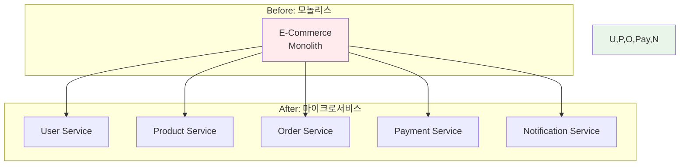
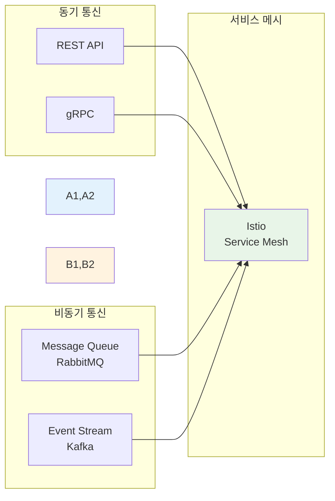

# Week 4 Day 1: 마이크로서비스 아키텍처

<div align="center">

**🏗️ 아키텍처 설계** • **🔄 서비스 분해** • **📡 통신 패턴**

*모놀리스에서 마이크로서비스로의 전환 - 설계부터 구현까지*

</div>

---

## 🕘 일일 스케줄

### 📊 시간 배분
```
📚 이론 강의: 2.5시간 (50분×3세션) - 오전 집중 학습
🛠️ 실습 세션: 3.5시간 (110분×2세션 + 120분 Challenge) - 당일 학습 적용
🍽️ 점심시간: 1시간 (실습 1 중간에 포함)
👥 학생 케어: 개별 맞춤 지원 (필요시)
```

### 🗓️ 상세 스케줄
| 시간 | 구분 | 내용 | 목적 |
|------|------|------|------|
| **09:00-09:50** | 📚 이론 1 | [마이크로서비스 vs 모놀리스](./session_1.md) (50분) | 아키텍처 선택 기준 |
| **09:50-10:00** | ☕ 휴식 | 10분 휴식 | |
| **10:00-10:50** | 📚 이론 2 | [서비스 분해 전략](./session_2.md) (50분) | DDD 기반 설계 |
| **10:50-11:00** | ☕ 휴식 | 10분 휴식 | |
| **11:00-11:50** | 📚 이론 3 | [마이크로서비스 패턴](./session_3.md) (50분) | 핵심 패턴 이해 |
| **11:50-12:00** | ☕ 휴식 | 10분 휴식 | |
| **12:00-13:50** | 🛠️ 실습 1 | [모놀리스 분해 실습](./lab_1.md) (110분) | 서비스 분해 |
| **13:00-14:00** | 🍽️ 점심 | 점심시간 (실습 중 60분) | |
| **14:00-15:50** | 🛠️ 실습 2 | [통신 패턴 구현](./handson_1.md) (110분) | 심화 적용 |
| **15:50-16:00** | ☕ 휴식 | 10분 휴식 | |
| **16:00-18:00** | 🎮 Challenge | [아키텍처 설계 챌린지](./challenge_1.md) (120분) | 종합 실습 |

---

## 🎯 일일 학습 목표

### 📚 이론 학습 목표
- **아키텍처 이해**: 마이크로서비스와 모놀리스의 본질적 차이와 선택 기준
- **설계 원칙**: Domain-Driven Design 기반 서비스 경계 식별
- **패턴 습득**: Saga, CQRS, Event Sourcing 등 핵심 패턴 이해
- **실무 연계**: 실제 기업의 마이크로서비스 전환 사례 분석

### 🛠️ 실습 학습 목표
- **서비스 분해**: 모놀리스 애플리케이션을 마이크로서비스로 분해
- **통신 구현**: REST, gRPC, 메시지 큐를 활용한 서비스 간 통신
- **패턴 적용**: API Gateway, Service Discovery 패턴 구현
- **문제 해결**: 분산 시스템의 일반적인 문제 상황 대응

### 🤝 협업 학습 목표
- **팀 설계**: 함께 마이크로서비스 아키텍처 설계
- **역할 분담**: 서비스별 담당자 지정 및 협업
- **통합 구현**: 각 서비스를 하나의 시스템으로 통합
- **상호 리뷰**: 설계 및 구현에 대한 동료 피드백

---

## 📚 이론 세션 개요

### Session 1: 마이크로서비스 vs 모놀리스 (50분)
> **핵심 질문**: "언제, 왜 마이크로서비스를 선택해야 하는가?"

**학습 내용**:
- 모놀리스 아키텍처의 장단점과 한계
- 마이크로서비스 아키텍처의 특징과 이점
- 아키텍처 선택을 위한 의사결정 프레임워크
- 실제 기업의 전환 사례 (Netflix, Amazon, Uber)

**실무 연계**:
- 스타트업 vs 대기업의 아키텍처 선택
- 레거시 시스템의 점진적 마이그레이션 전략
- 비즈니스 성장 단계별 아키텍처 진화

### Session 2: 서비스 분해 전략 (50분)
> **핵심 질문**: "어떻게 서비스 경계를 식별하고 분해하는가?"

**학습 내용**:
- Domain-Driven Design (DDD) 기본 개념
- Bounded Context와 서비스 경계 식별
- 서비스 분해 패턴 (Strangler Fig, Branch by Abstraction)
- 데이터 일관성과 트랜잭션 경계

**실무 연계**:
- 비즈니스 도메인 분석 방법론
- 팀 구조와 서비스 경계의 관계 (Conway's Law)
- 점진적 마이그레이션 전략

### Session 3: 마이크로서비스 패턴 (50분)
> **핵심 질문**: "분산 시스템의 복잡성을 어떻게 관리하는가?"

**학습 내용**:
- API Gateway 패턴 - 단일 진입점
- Service Discovery - 동적 서비스 찾기
- Circuit Breaker - 장애 전파 방지
- Saga 패턴 - 분산 트랜잭션 관리
- CQRS & Event Sourcing - 읽기/쓰기 분리

**실무 연계**:
- 패턴 선택 기준과 트레이드오프
- 실제 프로덕션 환경의 패턴 조합
- 안티패턴과 흔한 실수

---

## 🛠️ 실습 세션 개요

### Lab 1: 모놀리스 애플리케이션 분해 실습 (110분)
> **목표**: E-Commerce 모놀리스를 마이크로서비스로 분해

**실습 구성**:


**실습 단계**:
1. **도메인 분석** (20분): 비즈니스 기능 식별 및 경계 설정
2. **서비스 분해** (40분): 각 도메인을 독립 서비스로 분리
3. **데이터베이스 분리** (30분): Database per Service 패턴 적용
4. **통합 테스트** (30분): 분해된 서비스들의 통합 동작 확인

**학습 효과**:
- 실제 애플리케이션 분해 경험
- 서비스 경계 식별 능력 향상
- 데이터 일관성 문제 이해
- 팀 협업을 통한 설계 역량 강화

### Hands-on 1: 마이크로서비스 통신 패턴 구현 (110분)
> **목표**: 다양한 통신 패턴을 실제로 구현하고 비교

**실습 구성**:


**실습 단계**:
1. **REST API 통신** (25분): HTTP 기반 동기 통신
2. **gRPC 통신** (25분): 고성능 RPC 프레임워크
3. **메시지 큐** (30분): RabbitMQ를 이용한 비동기 통신
4. **이벤트 스트리밍** (30분): Kafka를 이용한 이벤트 기반 아키텍처

**학습 효과**:
- 통신 패턴별 장단점 체험
- 동기/비동기 통신의 트레이드오프 이해
- 실무에서의 패턴 선택 기준 습득
- 성능과 복잡도의 균형 감각

---

## 🎮 Challenge: 마이크로서비스 아키텍처 설계 (120분)

### 🎯 Challenge 목표
**시나리오**: 
급성장하는 소셜 미디어 플랫폼 "CloudSocial"이 모놀리스 아키텍처의 한계에 직면했습니다. 
월간 활성 사용자 100만 명을 지원하기 위해 마이크로서비스로 전환해야 합니다.

### 📋 요구사항
1. **기능 요구사항**:
   - 사용자 관리 (회원가입, 로그인, 프로필)
   - 게시물 관리 (작성, 수정, 삭제, 조회)
   - 소셜 기능 (팔로우, 좋아요, 댓글)
   - 알림 시스템 (실시간 알림)
   - 미디어 처리 (이미지/비디오 업로드)

2. **비기능 요구사항**:
   - 고가용성 (99.9% uptime)
   - 확장성 (피크 시간 10배 트래픽)
   - 성능 (API 응답 < 200ms)
   - 보안 (OAuth2 인증/인가)

### 🏆 평가 기준
- **아키텍처 설계** (30점): 서비스 분해의 적절성
- **통신 패턴** (25점): 효율적인 서비스 간 통신
- **데이터 관리** (20점): 데이터 일관성 전략
- **확장성** (15점): 스케일링 전략
- **창의성** (10점): 독창적인 해결책

---

## ✅ 일일 체크포인트

### 📚 이론 이해도 체크
- [ ] **아키텍처 선택**: 모놀리스 vs 마이크로서비스 선택 기준 설명 가능
- [ ] **서비스 분해**: DDD 기반 서비스 경계 식별 능력
- [ ] **패턴 이해**: 주요 마이크로서비스 패턴의 목적과 사용법
- [ ] **트레이드오프**: 각 패턴의 장단점과 선택 기준 이해

### 🛠️ 실습 완성도 체크
- [ ] **모놀리스 분해**: E-Commerce 애플리케이션 성공적 분해
- [ ] **통신 구현**: REST, gRPC, 메시지 큐 통신 구현
- [ ] **패턴 적용**: API Gateway, Service Discovery 구성
- [ ] **통합 테스트**: 전체 시스템 동작 검증

### 🤝 협업 활동 체크
- [ ] **팀 설계**: 아키텍처 설계에 적극 참여
- [ ] **역할 수행**: 담당 서비스 구현 완료
- [ ] **지식 공유**: 학습 내용 팀원과 공유
- [ ] **상호 리뷰**: 동료 코드 리뷰 참여

---

## 🎯 다음 학습 준비

### 📖 예습 키워드
- **API Gateway**: Kong, Istio, AWS API Gateway
- **Service Discovery**: Consul, Eureka, Kubernetes DNS
- **Load Balancing**: Round Robin, Least Connection, Consistent Hashing
- **Service Mesh**: Istio, Linkerd, Consul Connect

### 🔧 환경 준비
```bash
# API Gateway 도구 설치
kubectl apply -f https://bit.ly/kong-ingress

# Service Mesh 준비
istioctl install --set profile=demo

# 모니터링 도구
kubectl apply -f https://bit.ly/prometheus-operator
```

### 📚 추천 학습 자료
- **[Building Microservices](https://www.oreilly.com/library/view/building-microservices/9781491950340/)**: Sam Newman
- **[Domain-Driven Design](https://www.domainlanguage.com/ddd/)**: Eric Evans
- **[Microservices Patterns](https://microservices.io/patterns/)**: Chris Richardson

---

## 💡 학습 회고

### 🤝 페어 회고 (10분)
1. **가장 인상 깊었던 개념**: 오늘 배운 내용 중 가장 중요하다고 생각하는 것은?
2. **실습에서의 어려움**: 어떤 부분이 가장 어려웠고, 어떻게 해결했나요?
3. **실무 적용 아이디어**: 현재 또는 미래 프로젝트에 어떻게 적용할 수 있을까요?
4. **내일 학습 기대**: API Gateway와 Service Mesh에 대해 궁금한 점은?

### 📊 학습 성과 자가 평가
**5점 척도로 평가해보세요**:
- [ ] 마이크로서비스 아키텍처 이해도: ⭐⭐⭐⭐⭐
- [ ] 서비스 분해 능력: ⭐⭐⭐⭐⭐
- [ ] 통신 패턴 구현 능력: ⭐⭐⭐⭐⭐
- [ ] 팀 협업 만족도: ⭐⭐⭐⭐⭐

### 🎯 개선 포인트
- **더 학습이 필요한 부분**: 
- **다음에 시도해볼 것**: 
- **팀에게 공유하고 싶은 것**: 

---

## 📚 참고 자료

### 🔗 AWS 공식 문서
- **[Microservices on AWS](https://docs.aws.amazon.com/whitepapers/latest/microservices-on-aws/)**: AWS 마이크로서비스 백서
- **[AWS Well-Architected Framework](https://docs.aws.amazon.com/wellarchitected/)**: 아키텍처 설계 원칙
- **[Amazon EKS Best Practices](https://aws.github.io/aws-eks-best-practices/)**: EKS 운영 가이드

### 📖 추천 도서
- **Building Microservices** (Sam Newman)
- **Domain-Driven Design** (Eric Evans)
- **Microservices Patterns** (Chris Richardson)
- **Release It!** (Michael Nygard)

### 🎥 추천 영상
- **[Mastering Chaos - Netflix](https://www.youtube.com/watch?v=CZ3wIuvmHeM)**: Netflix의 마이크로서비스 여정
- **[Microservices at Uber](https://www.youtube.com/watch?v=kb-m2fasdDY)**: Uber의 아키텍처 진화
- **[AWS re:Invent - Microservices](https://www.youtube.com/results?search_query=aws+reinvent+microservices)**: AWS 마이크로서비스 세션

### 🌐 커뮤니티 & 블로그
- **[Microservices.io](https://microservices.io/)**: 마이크로서비스 패턴 카탈로그
- **[Martin Fowler's Blog](https://martinfowler.com/)**: 소프트웨어 아키텍처 인사이트
- **[Netflix Tech Blog](https://netflixtechblog.com/)**: Netflix 기술 블로그

---

<div align="center">

**🏗️ 체계적 설계** • **🔄 점진적 전환** • **🤝 협업 중심** • **🚀 실무 연계**

*마이크로서비스 아키텍처의 첫걸음, 함께 시작합니다*

</div>
